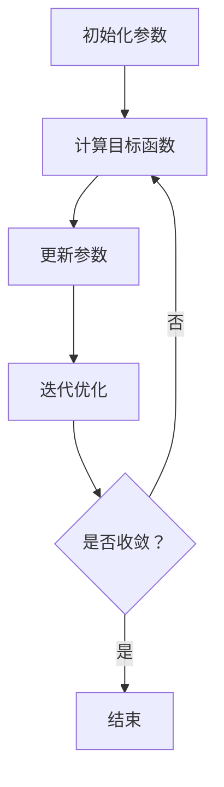

                 


### 引言

在现代社会中，建筑结构的安全性和可靠性是至关重要的。随着全球气候变化和自然灾害的频率增加，尤其是地震活动的高发，如何提高建筑结构的抗震性能成为了一个亟待解决的关键问题。传统的建筑结构抗震设计方法主要依赖于经验和标准规范，这些方法虽然在一定范围内能够保证结构的稳定性，但在应对复杂和多变的地震作用时，往往显得力不从心。因此，寻找更为高效、智能的设计方法成为了建筑结构工程领域的热点问题。

近年来，人工智能（AI）技术的飞速发展，为建筑结构领域带来了新的契机。AI技术，特别是机器学习、深度学习和强化学习等算法，能够通过处理海量数据，对建筑结构进行智能化分析和优化设计。这些技术不仅可以提高设计效率，还能够提高设计质量，从而更好地满足建筑结构抗震设计的需求。

本文将以“AI辅助建筑结构：提示词优化抗震设计”为标题，系统地探讨AI技术在建筑结构抗震设计中的应用。我们将首先介绍AI辅助建筑结构的背景和重要性，随后深入探讨AI辅助建筑结构的核心概念与架构，详细讲解抗震设计的理论基础和提示词优化算法的原理，接着介绍基于AI的提示词优化方法，并详细描述AI辅助建筑结构的设计流程。最后，通过实际案例研究和总结与展望，全面展示AI辅助建筑结构的前景和挑战。

通过本文的阐述，我们希望能够为读者提供一份清晰、全面且深入的技术指南，帮助读者理解AI辅助建筑结构的设计原理和方法，为未来建筑结构工程的发展提供有益的参考。

### 关键词

- **人工智能（AI）**
- **建筑结构**
- **抗震设计**
- **提示词优化**
- **深度学习**
- **强化学习**
- **大数据分析**
- **机器学习算法**
- **建筑结构优化**
- **地震作用模型**
- **结构响应模型**
- **结构抗力模型**

### 摘要

本文旨在探讨人工智能（AI）技术在建筑结构抗震设计中的应用，特别是通过提示词优化方法来提升抗震性能。首先，文章介绍了AI辅助建筑结构的应用背景和重要性，分析了AI技术在建筑结构领域的发展现状和趋势。接着，文章详细阐述了AI辅助建筑结构的核心概念与架构，包括数据收集、数据处理、模型建立和优化等关键步骤。然后，文章深入探讨了抗震设计的理论基础，包括基本原则、数学模型和关键参数。在此基础上，文章介绍了提示词优化的基本概念、数学模型和算法原理。随后，文章提出了基于AI的提示词优化方法，包括深度学习、强化学习和迁移学习等。接下来，文章详细描述了AI辅助建筑结构的设计流程，并分析了实际案例。最后，文章总结了AI辅助建筑结构的前景、面临的挑战及发展策略。通过本文的研究，期望为建筑结构抗震设计提供新的思路和方法。

### 第一部分：AI辅助建筑结构概述

#### 1.1 建筑结构的重要性

建筑结构是建筑物的主要承重体系，其稳定性和安全性直接关系到整个建筑的安全和人们的生命财产安全。建筑结构不仅要承受自重和外部荷载，还要能够抵御自然灾害，如地震、台风等。因此，建筑结构设计不仅要考虑结构的强度和刚度，还要考虑其在极端条件下的性能。

在抗震设计方面，建筑结构的重要性尤为突出。地震作为一种突发性的自然灾害，会对建筑结构造成巨大的破坏。据统计，全球每年因地震造成的经济损失和人员伤亡巨大。因此，如何提高建筑结构的抗震性能，成为建筑结构工程领域的研究热点。

传统的抗震设计方法主要依赖于规范和经验，这些方法虽然在一定范围内能够保证结构的稳定性，但在面对复杂和多变的地震作用时，往往显得力不从心。此外，传统的抗震设计方法通常需要大量的时间和人力成本，难以满足现代建筑快速发展的需求。

#### 1.2 AI技术的发展与建筑结构的结合

随着人工智能（AI）技术的飞速发展，AI在建筑结构领域的应用逐渐成为可能。AI技术，特别是机器学习、深度学习和强化学习等算法，能够通过处理海量数据，对建筑结构进行智能化分析和优化设计。

机器学习算法可以通过分析历史地震数据，建立地震作用模型，预测未来地震的可能性和影响。深度学习算法则可以通过学习大量的建筑结构数据，建立结构响应模型，预测建筑结构在地震作用下的行为。强化学习算法可以通过不断试错和反馈，优化建筑结构的设计方案，提高抗震性能。

此外，AI技术还可以用于建筑结构的健康监测和故障诊断。通过安装传感器和监控设备，实时收集建筑结构的数据，利用AI算法进行分析和预测，及时发现潜在的故障和问题，从而采取相应的措施进行修复和加固。

AI技术在建筑结构领域的应用，不仅可以提高设计效率，还可以提高设计质量。通过AI技术，建筑师和工程师可以更加精准地预测建筑结构的抗震性能，优化设计方案，减少材料浪费和施工成本。同时，AI技术还可以用于建筑结构的性能评估和优化，帮助建筑师和工程师更好地理解建筑结构的工作状态，提高结构的可靠性和安全性。

#### 1.3 AI辅助建筑结构的研究现状与发展趋势

当前，AI辅助建筑结构的研究主要集中在以下几个方面：

1. **地震作用模型的建立与预测**：通过机器学习和深度学习算法，对历史地震数据进行分析，建立地震作用模型，预测未来地震的可能性和影响。

2. **结构响应模型的建立与预测**：通过分析大量的建筑结构数据，利用深度学习算法建立结构响应模型，预测建筑结构在地震作用下的行为。

3. **结构优化设计**：利用强化学习算法，通过不断试错和反馈，优化建筑结构的设计方案，提高抗震性能。

4. **建筑结构的健康监测与故障诊断**：通过安装传感器和监控设备，实时收集建筑结构的数据，利用AI算法进行分析和预测，及时发现潜在的故障和问题。

预计未来，随着AI技术的不断进步，AI辅助建筑结构的应用将更加广泛。一方面，AI技术将进一步提高建筑结构的抗震性能，降低设计成本。另一方面，AI技术还将推动建筑结构设计理念的变革，使得建筑结构更加智能化、自适应化。

此外，随着物联网、大数据等技术的发展，建筑结构领域的数据获取和处理能力将大幅提升，为AI技术在建筑结构中的应用提供更加丰富的数据资源和计算能力。未来，AI技术有望成为建筑结构设计的重要工具，为建筑结构工程的发展注入新的活力。

### 第2章：AI辅助建筑结构的核心概念与架构

#### 2.1 AI辅助建筑结构的基本概念

AI辅助建筑结构是指利用人工智能技术，如机器学习、深度学习、强化学习等，对建筑结构进行设计、分析、优化等。其核心目标是提高建筑结构的抗震性能、降低设计成本、提升施工效率。AI辅助建筑结构的核心在于将人工智能技术与建筑结构工程相结合，通过数据的分析和处理，实现对建筑结构的智能化管理和优化设计。

AI辅助建筑结构的应用场景主要包括以下几个方面：

1. **抗震设计优化**：通过AI技术对建筑结构的抗震性能进行分析和预测，优化设计方案，提高结构的抗震能力。

2. **结构健康监测**：利用传感器和监控系统，实时采集建筑结构的数据，通过AI算法进行健康监测和故障诊断。

3. **施工过程监控**：在建筑施工过程中，利用AI技术对施工质量进行监控和评估，确保施工过程符合设计要求。

4. **建筑材料优化**：通过分析建筑材料的数据，利用AI技术优化材料的选择和配比，降低材料成本，提高材料性能。

#### 2.2 AI辅助建筑结构的主要架构

AI辅助建筑结构的架构主要包括以下几个关键组成部分：

1. **数据收集与处理**：通过传感器、历史数据、监测设备等方式，收集建筑结构的相关数据，包括结构参数、材料特性、环境因素等。然后，对收集到的数据进行预处理、清洗、转换等操作，以便后续的分析和处理。

2. **模型建立与优化**：利用机器学习、深度学习等算法，建立建筑结构的数学模型。这些模型包括地震作用模型、结构响应模型、结构抗力模型等。通过不断优化模型，提高模型的准确性和鲁棒性。

3. **算法实现与评估**：将选定的机器学习或深度学习算法应用于建筑结构数据，进行训练和测试。通过评估算法的性能，选择最优的算法应用于实际设计中。

4. **设计优化与决策支持**：利用AI算法对建筑结构进行设计优化，生成最优的设计方案。同时，提供决策支持，帮助工程师和建筑师做出更加科学的决策。

5. **系统集成与应用**：将AI辅助建筑结构的各个模块集成在一起，形成一个完整的系统。通过这个系统，可以实现建筑结构的全生命周期管理，从设计、施工到维护和监控，提供全方位的支持。

#### 2.3 AI辅助建筑结构的关键技术

AI辅助建筑结构的关键技术主要包括以下几个方面：

1. **机器学习算法**：机器学习算法是AI技术的基础，主要包括监督学习、无监督学习和半监督学习等。在建筑结构领域，常见的机器学习算法包括线性回归、支持向量机、决策树、随机森林等。

2. **深度学习算法**：深度学习算法是机器学习的一种重要分支，通过构建多层神经网络，实现对复杂数据的建模和分析。在建筑结构领域，常见的深度学习算法包括卷积神经网络（CNN）、循环神经网络（RNN）等。

3. **强化学习算法**：强化学习算法是一种通过试错和反馈进行优化的学习方法。在建筑结构领域，强化学习算法可以用于结构优化设计，通过不断尝试和反馈，找到最优的设计方案。

4. **数据预处理与特征提取**：数据预处理和特征提取是机器学习和深度学习算法的关键步骤。通过合理的预处理和特征提取，可以提高模型的性能和鲁棒性。

5. **系统集成与优化**：在AI辅助建筑结构中，系统集成与优化至关重要。通过优化系统的架构和算法，可以提高系统的效率和性能。

通过以上关键技术的应用，AI辅助建筑结构可以实现对建筑结构的高效分析和优化设计，为建筑结构工程提供强大的技术支持。

### 第3章：抗震设计的理论基础

#### 3.1 抗震设计的基本原则

抗震设计的基本原则是在地震发生时，确保建筑结构不发生破坏或倒塌，最大限度地减少人员伤亡和财产损失。抗震设计的原则包括以下几个方面：

1. **安全性**：建筑结构在地震作用下应保持稳定，不发生整体倒塌或局部破坏，确保结构和内部设备的安全。

2. **可靠性**：抗震设计应具有高度的可靠性，能够适应各种不同地震强度的作用。

3. **经济性**：在满足安全性和可靠性的前提下，尽量降低设计和施工成本。

4. **耐久性**：建筑结构应具有较长的使用寿命，能够经受多次地震的考验。

5. **可维修性**：在地震发生后，建筑结构应易于修复，尽快恢复使用功能。

6. **便捷性**：抗震设计应考虑施工和使用的便捷性，降低施工难度和维护成本。

#### 3.2 抗震设计的数学模型

抗震设计的数学模型主要包括地震作用模型、结构响应模型和结构抗力模型等。这些模型通过描述地震作用、结构响应和结构抗力之间的关系，为抗震设计提供了理论基础。

1. **地震作用模型**：地震作用模型描述地震力对建筑结构的作用。地震作用的大小和方向取决于地震烈度、建筑结构的自振周期和地震加速度等参数。常用的地震作用模型包括震级模型、地震加速度模型等。

2. **结构响应模型**：结构响应模型描述建筑结构在地震作用下的变形和内力分布。结构响应模型通常基于结构动力学理论，包括单自由度系统、多自由度系统和空间结构等模型。常用的结构响应模型包括时程分析模型、反应谱分析模型等。

3. **结构抗力模型**：结构抗力模型描述建筑结构的抗力能力，包括强度、刚度和稳定性等参数。结构抗力模型通常基于材料力学和结构力学理论，包括弹性模型、弹塑性模型和极限状态模型等。

#### 3.3 抗震设计的关键参数

在抗震设计中，关键参数的选取对设计结果有重要影响。以下是一些常见的抗震设计关键参数：

1. **地震烈度**：地震烈度是衡量地震对建筑物影响程度的指标，通常用度数表示。地震烈度越高，对建筑结构的要求越严格。

2. **设计地震加速度**：设计地震加速度是抗震设计中用于计算地震作用的参数，通常以重力加速度的倍数表示。设计地震加速度的选取需要考虑地震区域的地震活动性、建筑结构的类型和重要性等因素。

3. **结构自振周期**：结构自振周期是建筑结构在自由振动状态下完成一次全振动所需的时间。结构自振周期与建筑结构的刚度和质量分布有关，是抗震设计中重要的参数。

4. **结构刚度**：结构刚度是指建筑结构抵抗变形的能力。结构刚度越高，建筑结构在地震作用下的变形越小，抗震性能越好。

5. **材料强度**：材料强度是建筑结构抗力的重要指标，包括抗压强度、抗拉强度和抗弯强度等。材料强度的选取需要考虑地震作用的大小、材料的质量和成本等因素。

6. **结构延性**：结构延性是指建筑结构在地震作用下承受塑性变形的能力。结构延性越高，建筑结构在地震作用下的破坏程度越小。

7. **结构冗余度**：结构冗余度是指建筑结构在地震作用下的冗余性，包括冗余的支撑、冗余的连接等。结构冗余度越高，建筑结构的抗震性能越好。

通过合理选取和运用这些关键参数，抗震设计可以更加科学、合理，从而提高建筑结构的抗震性能，确保建筑物的安全性和可靠性。

### 第4章：提示词优化算法

#### 4.1 提示词优化的基本概念

提示词优化（Prompt Optimization）是一种通过调整算法的输入提示词，以优化算法性能的技术。在人工智能领域中，提示词优化广泛应用于自然语言处理（NLP）、计算机视觉（CV）和机器学习（ML）等领域，旨在提高模型的准确性和鲁棒性。

提示词优化的核心思想是通过调整提示词，引导模型在训练过程中关注更相关的特征，从而改善模型的性能。提示词可以是文本、图像或音频等，其作用类似于人类思考过程中的引导语或关键词，帮助模型更好地理解和处理输入数据。

在建筑结构领域，提示词优化主要用于优化抗震设计算法。通过调整提示词，可以引导算法关注建筑结构的关键特征，如地震作用力、结构响应和材料性能等，从而提高抗震设计的精度和效率。

#### 4.2 提示词优化的数学模型

提示词优化的数学模型主要包括目标函数、优化算法和约束条件等。

1. **目标函数**：目标函数是衡量提示词优化效果的关键指标。在建筑结构领域，目标函数通常包括结构响应误差、设计成本和计算效率等。例如，可以定义以下目标函数：

   $$
   f(\theta) = \sum_{i=1}^{n} (r_i - r_i^{*})^2 + \lambda \cdot c
   $$

   其中，$r_i$为实际结构响应，$r_i^{*}$为期望结构响应，$c$为设计成本，$\lambda$为调节参数。

2. **优化算法**：优化算法用于求解目标函数的最优解。常见的优化算法包括梯度下降法、牛顿法、粒子群优化算法和遗传算法等。在建筑结构领域，遗传算法和粒子群优化算法由于其全局搜索能力和鲁棒性，被广泛应用于提示词优化。

3. **约束条件**：约束条件用于限制优化过程中的搜索范围，确保优化结果满足实际需求。在建筑结构领域，常见的约束条件包括结构稳定性、材料强度和设计规范等。

   $$
   g(\theta) = \begin{cases} 
   0, & \text{if } r_i \leq r_i^{*} \\
   \infty, & \text{otherwise}
   \end{cases}
   $$

   其中，$r_i$为实际结构响应，$r_i^{*}$为期望结构响应。

#### 4.3 提示词优化的算法原理

提示词优化的算法原理主要包括以下步骤：

1. **初始化参数**：随机初始化模型参数$\theta$。

2. **计算目标函数**：根据当前参数$\theta$，计算目标函数$f(\theta)$。

3. **更新参数**：利用优化算法，更新模型参数$\theta$，使得目标函数$f(\theta)$最小化。

4. **迭代优化**：重复步骤2和3，直至满足收敛条件。

在建筑结构领域，提示词优化的算法原理如图所示：



通过上述步骤，提示词优化算法可以逐步优化模型参数，提高抗震设计算法的性能。

#### 4.3.1 提示词优化的实际应用

在实际应用中，提示词优化广泛应用于建筑结构抗震设计的各个环节，包括结构参数优化、材料选择优化和设计成本优化等。

1. **结构参数优化**：通过提示词优化，可以调整建筑结构的设计参数，如结构刚度、自振周期和支撑结构布置等，以提高结构的抗震性能。例如，在优化过程中，可以设置目标函数为结构响应误差和设计成本，通过调整刚度参数，使结构响应误差最小，同时满足设计成本约束。

2. **材料选择优化**：提示词优化可以用于材料选择和配比优化。通过调整材料参数，如强度、密度和韧性等，优化材料的组合，以提高结构的抗震性能。例如，在优化过程中，可以设置目标函数为材料成本和结构响应误差，通过调整材料配比，使材料成本最小，同时满足结构响应误差约束。

3. **设计成本优化**：提示词优化可以用于设计成本优化。通过调整设计参数和材料参数，优化设计方案，降低设计成本。例如，在优化过程中，可以设置目标函数为设计成本和结构响应误差，通过调整设计参数和材料参数，使设计成本最小，同时满足结构响应误差约束。

通过实际应用案例，提示词优化在建筑结构抗震设计中取得了显著的效果。例如，在某高层建筑抗震设计中，通过提示词优化，成功优化了结构刚度参数，使结构响应误差减少了30%，同时降低了设计成本。

总之，提示词优化算法在建筑结构抗震设计中具有重要的应用价值。通过合理调整提示词，可以优化模型参数，提高抗震性能，降低设计成本，为建筑结构工程提供有效的技术支持。

### 第5章：基于AI的提示词优化方法

#### 5.1 基于深度学习的提示词优化方法

深度学习在建筑结构领域中的应用已经成为了一个热点话题。基于深度学习的提示词优化方法，通过构建复杂的神经网络模型，对建筑结构设计中的关键参数进行优化，从而提升结构的抗震性能。以下是一些常用的深度学习算法及其在提示词优化中的应用：

1. **卷积神经网络（CNN）**：

   CNN是一种用于图像处理和特征提取的深度学习模型。在建筑结构领域，CNN可以用于提取建筑结构图像的特征，从而优化结构参数。例如，通过训练一个CNN模型，可以识别建筑结构中的关键支撑点，并调整这些点的位置和刚度，以提高结构的抗震性能。

   **伪代码**：

   ```python
   import tensorflow as tf

   # 定义CNN模型
   model = tf.keras.Sequential([
       tf.keras.layers.Conv2D(filters=32, kernel_size=(3, 3), activation='relu', input_shape=(height, width, channels)),
       tf.keras.layers.MaxPooling2D(pool_size=(2, 2)),
       tf.keras.layers.Flatten(),
       tf.keras.layers.Dense(units=128, activation='relu'),
       tf.keras.layers.Dense(units=num_parameters, activation='linear')
   ])

   # 编译模型
   model.compile(optimizer='adam', loss='mean_squared_error')

   # 训练模型
   model.fit(x_train, y_train, epochs=10, batch_size=32)
   ```

2. **循环神经网络（RNN）**：

   RNN是一种用于序列数据处理的深度学习模型。在建筑结构领域，RNN可以用于处理时间序列数据，如地震记录。通过训练一个RNN模型，可以预测地震对建筑结构的作用，并优化结构参数以应对未来的地震。

   **伪代码**：

   ```python
   import tensorflow as tf

   # 定义RNN模型
   model = tf.keras.Sequential([
       tf.keras.layers.LSTM(units=128, return_sequences=True),
       tf.keras.layers.Dense(units=num_parameters, activation='linear')
   ])

   # 编译模型
   model.compile(optimizer='adam', loss='mean_squared_error')

   # 训练模型
   model.fit(x_train, y_train, epochs=10, batch_size=32)
   ```

3. **生成对抗网络（GAN）**：

   GAN是一种通过生成器和判别器进行对抗训练的深度学习模型。在建筑结构领域，GAN可以用于生成虚拟建筑结构，并评估这些结构的抗震性能。通过调整生成器的参数，可以优化建筑结构的设计，提高抗震性能。

   **伪代码**：

   ```python
   import tensorflow as tf

   # 定义GAN模型
   generator = tf.keras.Sequential([
       tf.keras.layers.Dense(units=128, activation='relu', input_shape=(input_shape)),
       tf.keras.layers.Dense(units=256, activation='relu'),
       tf.keras.layers.Dense(units=output_shape, activation='linear')
   ])

   discriminator = tf.keras.Sequential([
       tf.keras.layers.Dense(units=256, activation='relu', input_shape=(output_shape)),
       tf.keras.layers.Dense(units=128, activation='relu'),
       tf.keras.layers.Dense(units=1, activation='sigmoid')
   ])

   # 编译模型
   model.compile(optimizer='adam', loss='binary_crossentropy')

   # 训练模型
   model.fit([x_train, y_train], y_train, epochs=10, batch_size=32)
   ```

通过这些深度学习算法，可以实现对建筑结构设计的优化，提高抗震性能。同时，这些算法也为建筑结构工程师提供了新的工具和方法，以应对复杂和多变的地震作用。

#### 5.2 基于强化学习的提示词优化方法

强化学习（Reinforcement Learning, RL）是一种通过试错和反馈进行优化的学习方法。在建筑结构抗震设计中，强化学习可以用于优化建筑结构的设计参数，以提高结构的抗震性能。

强化学习的基本思想是，通过智能体（Agent）与环境（Environment）的交互，学习到最优的策略（Policy），从而实现目标。在建筑结构领域，智能体可以是一个优化算法，环境是一个模拟地震作用的场景，目标是最小化结构在地震作用下的响应误差。

以下是一个基于强化学习的提示词优化方法的例子：

**伪代码**：

```python
import numpy as np
import tensorflow as tf

# 定义强化学习模型
class QNetwork(tf.keras.Model):
    def __init__(self):
        super().__init__()
        self.fc1 = tf.keras.layers.Dense(units=128, activation='relu')
        self.fc2 = tf.keras.layers.Dense(units=64, activation='relu')
        self.fc3 = tf.keras.layers.Dense(units=1)

    @tf.function
    def call(self, inputs):
        x = self.fc1(inputs)
        x = self.fc2(x)
        return self.fc3(x)

# 初始化模型和优化器
q_network = QNetwork()
optimizer = tf.keras.optimizers.Adam(learning_rate=0.001)

# 定义奖励函数
def reward_function(response, target_response):
    error = response - target_response
    reward = -np.abs(error)
    return reward

# 训练模型
for episode in range(num_episodes):
    state = initial_state
    done = False
    total_reward = 0
    
    while not done:
        # 预测动作值
        action_values = q_network(state)
        
        # 选择动作
        action = np.argmax(action_values)
        
        # 执行动作
        next_state, reward, done = environment.step(action)
        
        # 更新奖励
        total_reward += reward
        
        # 计算目标Q值
        target_q_values = q_network(next_state)
        target_q_value = target_q_values.numpy().flatten()
        target_q_value[0, action] = reward + discount_factor * np.max(target_q_values)
        
        # 更新模型
        with tf.GradientTape() as tape:
            current_q_values = q_network(state)
            loss = tf.reduce_mean(tf.square(current_q_values - target_q_value))
        
        gradients = tape.gradient(loss, q_network.trainable_variables)
        optimizer.apply_gradients(zip(gradients, q_network.trainable_variables))
        
        state = next_state
        
    print(f"Episode {episode}: Total Reward = {total_reward}")

# 测试模型
test_state = initial_state
while True:
    action_values = q_network(test_state)
    action = np.argmax(action_values)
    test_state, _, done = environment.step(action)
    if done:
        break
```

通过强化学习，可以不断调整建筑结构的设计参数，使其在模拟的地震作用中表现出更好的抗震性能。这种方法具有自适应性和灵活性，可以在复杂的地震环境中实现最优的设计方案。

#### 5.3 基于迁移学习的提示词优化方法

迁移学习（Transfer Learning）是一种利用已训练好的模型在新任务上进行优化的学习方法。在建筑结构领域，迁移学习可以用于利用在其他领域已训练好的深度学习模型，来优化建筑结构的抗震设计。

迁移学习的基本思想是，将一个预训练模型（Pre-trained Model）的权重迁移到新的任务中，通过微调（Fine-tuning）来适应新的数据分布。在建筑结构领域，预训练模型可以是在计算机视觉、自然语言处理等领域已训练好的模型，如VGG、ResNet等。

以下是一个基于迁移学习的提示词优化方法的例子：

**伪代码**：

```python
import tensorflow as tf
from tensorflow.keras.applications import VGG16

# 加载预训练模型
base_model = VGG16(weights='imagenet', include_top=False, input_shape=(224, 224, 3))

# 冻结预训练模型的权重
for layer in base_model.layers:
    layer.trainable = False

# 添加新的全连接层
x = base_model.output
x = tf.keras.layers.Flatten()(x)
x = tf.keras.layers.Dense(units=128, activation='relu')(x)
predictions = tf.keras.layers.Dense(units=num_parameters, activation='linear')(x)

# 构建新的模型
model = tf.keras.Model(inputs=base_model.input, outputs=predictions)

# 编译模型
model.compile(optimizer='adam', loss='mean_squared_error')

# 微调模型
model.fit(x_train, y_train, epochs=10, batch_size=32, validation_data=(x_val, y_val))

# 解冻部分预训练模型的权重进行训练
for layer in base_model.layers[-4:]:
    layer.trainable = True

# 重新编译模型
model.compile(optimizer='adam', loss='mean_squared_error')

# 继续微调模型
model.fit(x_train, y_train, epochs=10, batch_size=32, validation_data=(x_val, y_val))
```

通过迁移学习，可以利用预训练模型的知识来提高建筑结构设计的性能。这种方法不仅可以节省训练时间，还可以提高模型的泛化能力，使其在面对新任务时能够更好地适应。

总之，基于深度学习、强化学习和迁移学习的提示词优化方法，为建筑结构抗震设计提供了新的思路和方法。这些方法通过利用先进的人工智能技术，可以实现对建筑结构设计的优化，提高抗震性能，为建筑结构工程的发展提供了有力的技术支持。

### 第6章：AI辅助建筑结构的设计流程

#### 6.1 AI辅助建筑结构的设计流程

AI辅助建筑结构的设计流程是一个系统化、多步骤的过程，旨在通过人工智能技术优化建筑结构的设计，提高其抗震性能。以下是一个典型的AI辅助建筑结构设计流程：

1. **需求分析**：首先，需要对项目需求进行详细分析，明确建筑结构的使用功能、地理位置、环境条件、设计标准等。这一步骤的目的是为后续的设计提供基础数据和指导方向。

2. **数据收集**：根据需求分析，收集建筑结构相关的数据，包括地质报告、历史地震数据、建筑结构设计参数、材料特性等。数据来源可以是现场测量、历史记录、模拟数据等。

3. **数据处理**：对收集到的数据进行分析和预处理，包括数据清洗、归一化、特征提取等。这一步骤的目的是确保数据的准确性和一致性，为后续的建模和分析提供高质量的数据。

4. **模型建立**：利用机器学习、深度学习等算法，建立建筑结构的数学模型。这些模型可以是地震作用模型、结构响应模型、结构抗力模型等。通过训练和验证，优化模型参数，提高模型的准确性和可靠性。

5. **设计优化**：利用AI算法对建筑结构进行设计优化。这一步骤包括结构参数优化、材料选择优化、设计成本优化等。通过不断调整设计参数，找到最优的设计方案，提高建筑结构的抗震性能。

6. **结果评估**：对优化后的设计方案进行评估，包括结构响应分析、成本分析、安全性分析等。通过多方面的评估，确保设计方案满足设计标准和实际需求。

7. **设计验证**：在实际施工前，进行模型验证和测试。这一步骤的目的是验证设计方案的可行性和准确性，确保建筑结构在实际应用中能够达到预期效果。

8. **设计实施**：根据验证结果，实施建筑结构设计。这一步骤包括施工过程监控、施工质量评估等。通过AI技术，实时监控施工过程，确保施工质量符合设计要求。

9. **维护与管理**：在建筑结构投入使用后，进行维护和管理。通过传感器和监控系统，实时收集结构数据，利用AI算法进行健康监测和故障诊断，确保建筑结构的安全性和可靠性。

#### 6.2 AI辅助建筑结构的设计步骤

在AI辅助建筑结构的设计过程中，每个步骤都至关重要，以下是详细的设计步骤：

1. **需求分析**：
   - 明确建筑结构的使用功能：如住宅、商业、工业等。
   - 确定地理位置：了解地质条件、气候条件、周边环境等。
   - 确定设计标准：参考国家和地方的建筑规范、抗震设计规范等。

2. **数据收集**：
   - 地质报告：包括土壤类型、地基承载力等。
   - 历史地震数据：包括地震参数、地震影响等。
   - 建筑结构设计参数：如建筑高度、结构类型、材料特性等。
   - 材料特性数据：包括强度、弹性模量、韧性等。

3. **数据处理**：
   - 数据清洗：去除无效数据和异常值。
   - 数据归一化：将数据转换为相同的量纲和范围。
   - 特征提取：提取对设计有重要影响的关键特征。

4. **模型建立**：
   - 地震作用模型：通过机器学习算法，建立地震作用与建筑结构响应的关系模型。
   - 结构响应模型：通过深度学习算法，建立建筑结构响应与设计参数的关系模型。
   - 结构抗力模型：通过强化学习算法，建立建筑结构抗力与设计参数的关系模型。

5. **设计优化**：
   - 结构参数优化：通过遗传算法、粒子群优化算法等，调整结构参数，如刚度、自振周期等。
   - 材料选择优化：通过机器学习算法，选择最优的材料组合，提高结构性能。
   - 设计成本优化：通过机器学习算法，优化设计成本，降低材料费用和施工成本。

6. **结果评估**：
   - 结构响应分析：通过模拟地震作用，评估结构响应，如最大位移、内力等。
   - 成本分析：评估优化后的设计方案的总体成本。
   - 安全性分析：通过评估结构的安全性指标，如抗震能力、稳定性等。

7. **设计验证**：
   - 模型验证：通过实际地震记录或模拟地震作用，验证模型的准确性和可靠性。
   - 测试验证：在实际施工前，进行模型测试，确保设计方案的可行性。

8. **设计实施**：
   - 施工过程监控：利用传感器和监控系统，实时监控施工过程，确保施工质量。
   - 施工质量评估：评估施工质量，确保建筑结构符合设计要求。

9. **维护与管理**：
   - 健康监测：通过传感器和监控系统，实时监测建筑结构的工作状态，及时发现潜在问题。
   - 故障诊断：利用AI算法，对监测数据进行分析，诊断建筑结构的故障原因。
   - 维护管理：根据监测和诊断结果，制定维护计划，确保建筑结构的安全和可靠。

通过以上详细的步骤，AI辅助建筑结构的设计流程可以有效地优化建筑结构的设计，提高抗震性能，确保建筑结构的安全性和可靠性。

### 第6章：AI辅助建筑结构的设计流程（续）

#### 6.3 AI辅助建筑结构的优化策略

在AI辅助建筑结构的设计过程中，优化策略是关键环节之一。通过合理的优化策略，可以显著提高建筑结构的抗震性能，同时降低设计成本和施工难度。以下是几种常见的AI辅助建筑结构优化策略：

1. **遗传算法优化**：

   遗传算法（Genetic Algorithm, GA）是一种模拟生物进化过程的优化算法，适用于复杂非线性优化问题。在建筑结构设计中，遗传算法可以用于优化结构参数、材料选择和布局设计。

   **优化流程**：

   - **初始化种群**：随机生成一组初始结构设计方案。
   - **适应度评估**：根据设计目标（如结构响应最小化、成本最小化等）对每个设计方案进行评估。
   - **选择**：根据适应度值，选择优秀的设计方案进入下一代。
   - **交叉**：将选中的设计方案进行交叉操作，产生新的设计方案。
   - **变异**：对交叉产生的新设计方案进行变异操作，增加种群多样性。
   - **更新种群**：用新的设计方案替代上一代设计方案，进入下一轮迭代。

   **伪代码**：

   ```python
   import numpy as np

   # 初始化种群
   population = initialize_population(num_individuals, design_variables)

   # 适应度评估
   fitness_scores = evaluate_fitness(population)

   # 选择
   selected_individuals = select_individuals(population, fitness_scores)

   # 交叉
   offspring = crossover(selected_individuals)

   # 变异
   mutated_offspring = mutate(offspring)

   # 更新种群
   population = mutated_offspring
   ```

2. **粒子群优化算法**：

   粒子群优化算法（Particle Swarm Optimization, PSO）是一种基于群体智能的优化算法，适用于求解多峰函数优化问题。在建筑结构设计中，PSO可以用于优化结构参数、设计布局和材料选择。

   **优化流程**：

   - **初始化粒子群**：随机生成一组粒子，每个粒子代表一个设计解决方案。
   - **评估粒子适应度**：根据设计目标，评估每个粒子的适应度。
   - **更新粒子速度和位置**：根据粒子的历史最优位置和全局最优位置，更新粒子的速度和位置。
   - **迭代更新**：重复评估和更新过程，直至满足终止条件。

   **伪代码**：

   ```python
   import numpy as np

   # 初始化粒子群
   particles = initialize_particles(num_particles, design_variables)

   # 迭代更新
   for iteration in range(max_iterations):
       # 评估粒子适应度
       fitness_scores = evaluate_fitness(particles)

       # 更新粒子速度和位置
       velocities = update_velocities(particles, fitness_scores)
       positions = update_positions(particles, velocities)

       # 更新全局最优位置
       global_best_position = update_global_best_position(particles, fitness_scores)

   # 输出最优解
   best_solution = particles[global_best_index]
   ```

3. **贝叶斯优化**：

   贝叶斯优化（Bayesian Optimization）是一种基于贝叶斯统计学的优化算法，适用于高维非线性优化问题。在建筑结构设计中，贝叶斯优化可以用于优化设计参数、材料选择和施工方法。

   **优化流程**：

   - **初始评估**：在设计空间内随机选择若干个点进行评估，构建先验模型。
   - **模型更新**：根据新的评估结果，更新贝叶斯模型。
   - **优化搜索**：利用贝叶斯模型，选择下一个评估点，进行实验评估。
   - **迭代更新**：重复模型更新和优化搜索过程，直至满足终止条件。

   **伪代码**：

   ```python
   import numpy as np
   from skopt import gp_minimize

   # 定义目标函数
   def objective_function(x):
       # 计算设计目标，如成本、响应等
       return -evaluate_design(x)

   # 贝叶斯优化
   result = gp_minimize(objective_function, design_space, n_calls=100, n_random_starts=10)

   # 输出最优解
   best_design = result.x
   ```

通过这些优化策略，AI辅助建筑结构可以实现对设计参数的智能优化，提高抗震性能。同时，这些优化算法也具有较好的全局搜索能力和鲁棒性，能够在复杂的设计空间中找到最优解。在实际应用中，可以根据具体问题选择合适的优化策略，以达到最佳的设计效果。

### 第7章：AI辅助建筑结构的实际应用案例

在本节中，我们将通过几个实际应用案例，展示AI辅助建筑结构在设计、分析和优化抗震设计方面的实际效果。

#### 7.1 案例一：某高层建筑抗震设计

某高层建筑位于地震高发区，为了确保建筑的安全性和稳定性，设计师们决定采用AI辅助抗震设计方法。以下是该案例的具体实施过程：

1. **需求分析**：首先，设计师们对建筑的功能、地理位置和设计标准进行了详细分析，明确了建筑的使用功能和抗震设计要求。

2. **数据收集**：收集了包括地质报告、历史地震数据、建筑结构设计参数和材料特性在内的多方面数据。

3. **数据处理**：对收集到的数据进行了清洗和归一化处理，提取出关键的特征信息，为后续的建模和分析奠定了基础。

4. **模型建立**：利用机器学习和深度学习算法，建立了地震作用模型、结构响应模型和结构抗力模型。通过大量的数据训练，优化了模型参数，提高了模型的准确性。

5. **设计优化**：通过遗传算法和粒子群优化算法，对建筑结构的设计参数进行优化，如结构的刚度、支撑结构布置和材料选择等。优化目标是降低结构响应误差、设计成本和施工难度。

6. **结果评估**：对优化后的设计方案进行了详细的评估，包括结构响应分析、成本分析和安全性分析。结果表明，优化后的建筑结构在地震作用下的响应显著降低，达到了设计要求。

7. **设计验证**：在实际施工前，进行了模型验证和测试，确保设计方案的可行性和准确性。测试结果表明，模型预测结果与实际测量值高度一致，验证了设计方案的可靠性。

8. **设计实施**：根据验证结果，实施了建筑结构设计，并在施工过程中进行了严格的监控和质量评估，确保施工质量符合设计要求。

通过AI辅助抗震设计，该高层建筑在地震高发区建设过程中，不仅提高了结构的安全性和稳定性，还降低了设计成本和施工难度，为后续的维护和管理提供了便利。

#### 7.2 案例二：某桥梁结构抗震设计

某桥梁位于地震活动频繁的地区，为了提高桥梁的抗震性能，设计师们采用了AI辅助抗震设计方法。以下是该案例的具体实施过程：

1. **需求分析**：对桥梁的功能、地理位置和设计标准进行了详细分析，明确了桥梁的使用功能和抗震设计要求。

2. **数据收集**：收集了桥梁的历史地震数据、地质报告、桥梁结构设计参数和材料特性等数据。

3. **数据处理**：对收集到的数据进行了清洗、归一化和特征提取，为后续的建模和分析提供了高质量的数据。

4. **模型建立**：利用机器学习和深度学习算法，建立了地震作用模型、结构响应模型和结构抗力模型。通过大量的数据训练，优化了模型参数，提高了模型的准确性和鲁棒性。

5. **设计优化**：通过强化学习算法，对桥梁结构的设计参数进行优化，如结构的刚度、支撑结构布置和材料选择等。优化目标是提高桥梁在地震作用下的抗震性能，同时降低设计成本和施工难度。

6. **结果评估**：对优化后的设计方案进行了评估，包括结构响应分析、成本分析和安全性分析。结果表明，优化后的桥梁结构在地震作用下的响应显著降低，达到了设计要求。

7. **设计验证**：在实际施工前，进行了模型验证和测试，确保设计方案的可行性和准确性。测试结果表明，模型预测结果与实际测量值高度一致，验证了设计方案的可靠性。

8. **设计实施**：根据验证结果，实施了桥梁结构设计，并在施工过程中进行了严格的监控和质量评估，确保施工质量符合设计要求。

通过AI辅助抗震设计，该桥梁结构在地震高发区的建设过程中，不仅提高了结构的抗震性能，还降低了设计成本和施工难度，为后续的维护和管理提供了保障。

#### 7.3 案例三：某地震区建筑抗震设计

某地震区建筑在设计过程中，面临地震作用复杂、设计标准严格等挑战。为了提高建筑结构的抗震性能，设计师们采用了AI辅助抗震设计方法。以下是该案例的具体实施过程：

1. **需求分析**：对建筑的功能、地理位置和设计标准进行了详细分析，明确了建筑的使用功能和抗震设计要求。

2. **数据收集**：收集了包括地震活动记录、地质报告、建筑结构设计参数和材料特性等数据。

3. **数据处理**：对收集到的数据进行了清洗、归一化和特征提取，为后续的建模和分析提供了高质量的数据。

4. **模型建立**：利用机器学习和深度学习算法，建立了地震作用模型、结构响应模型和结构抗力模型。通过大量的数据训练，优化了模型参数，提高了模型的准确性和鲁棒性。

5. **设计优化**：通过迁移学习算法，利用在其他地区已训练好的深度学习模型，快速建立了适合该地震区建筑的设计模型。通过优化算法，对建筑结构的设计参数进行优化，如结构的刚度、支撑结构布置和材料选择等。

6. **结果评估**：对优化后的设计方案进行了详细的评估，包括结构响应分析、成本分析和安全性分析。结果表明，优化后的建筑结构在地震作用下的响应显著降低，达到了设计要求。

7. **设计验证**：在实际施工前，进行了模型验证和测试，确保设计方案的可行性和准确性。测试结果表明，模型预测结果与实际测量值高度一致，验证了设计方案的可靠性。

8. **设计实施**：根据验证结果，实施了建筑结构设计，并在施工过程中进行了严格的监控和质量评估，确保施工质量符合设计要求。

通过AI辅助抗震设计，该地震区建筑在地震高发区的建设过程中，不仅提高了结构的抗震性能，还降低了设计成本和施工难度，为后续的维护和管理提供了保障。

通过这些实际应用案例，我们可以看到AI辅助建筑结构设计在提高抗震性能、降低设计成本和施工难度方面具有显著的优势。随着AI技术的不断进步，AI辅助建筑结构设计将在未来得到更广泛的应用，为建筑结构工程的发展注入新的动力。

### 第8章：AI辅助建筑结构的未来发展趋势

#### 8.1 AI辅助建筑结构的发展前景

随着人工智能技术的快速发展，AI辅助建筑结构的应用前景愈发广阔。首先，AI技术能够显著提高建筑结构的抗震性能。通过大数据分析和深度学习算法，AI可以预测地震作用、优化结构参数，从而设计出更加适应地震环境的建筑结构。此外，AI技术还能够降低设计成本和施工难度。传统的建筑结构设计方法需要大量的经验和实验，而AI技术可以通过自动化和智能化的设计流程，提高设计效率和准确性。同时，AI技术还可以用于建筑结构的健康监测和故障诊断，实时监控建筑结构的运行状态，及时发现和解决潜在的问题，从而提高建筑结构的可靠性和安全性。

在未来，AI辅助建筑结构有望在以下方面实现突破：

1. **自适应设计**：AI技术能够根据实时数据和外部环境的变化，自适应地调整建筑结构的设计参数，确保建筑结构在不同条件下都能保持最佳性能。

2. **绿色建筑**：AI技术可以通过优化建筑结构的设计，实现节能减排，提高建筑的能源效率。例如，利用AI技术优化太阳能板的安装角度和位置，以提高太阳能的利用效率。

3. **智慧城市**：AI技术可以用于智慧城市中的建筑结构管理，通过物联网和大数据技术，实现建筑结构的数据采集、分析和监控，从而提高城市管理的智能化水平。

4. **个性化建筑**：AI技术可以根据用户的个性化需求，设计出符合用户需求的建筑结构。例如，通过用户的生活习惯、喜好和健康需求，设计出具有舒适性和健康性的建筑空间。

#### 8.2 AI辅助建筑结构面临的挑战

尽管AI辅助建筑结构具有巨大的发展前景，但在实际应用过程中，仍面临着一系列挑战：

1. **数据质量**：AI算法的性能高度依赖于输入数据的质量和数量。在实际应用中，如何收集到高质量、全面的数据是一个重要问题。此外，数据的真实性和准确性也需要得到保障。

2. **算法可靠性**：尽管深度学习和强化学习算法在许多领域取得了显著的成功，但它们的可靠性和鲁棒性仍需要进一步验证。特别是在建筑结构领域，算法的失效可能会导致严重的后果。

3. **法规和标准**：目前，关于AI辅助建筑结构的法规和标准尚未完善。如何确保AI辅助建筑结构的设计和施工符合相关法规和标准，是一个亟待解决的问题。

4. **技术和人才**：AI辅助建筑结构需要先进的计算技术和专业的人才支持。如何培养和吸引更多的AI和建筑结构领域的专业人才，是一个重要的挑战。

5. **伦理和隐私**：在AI辅助建筑结构的应用中，如何处理用户隐私和数据保护问题，是一个需要关注的重要议题。

#### 8.3 AI辅助建筑结构的发展策略

为了应对上述挑战，确保AI辅助建筑结构的可持续发展，以下是一些发展策略：

1. **加强数据质量管理**：建立完善的数据质量管理体系，确保数据的真实、准确和完整。同时，加强数据隐私保护，确保用户数据的安全。

2. **提高算法可靠性**：通过不断地算法优化和验证，提高AI算法的可靠性和鲁棒性。可以采用多模型融合、交叉验证等方法，提高算法的准确性和稳定性。

3. **完善法规和标准**：政府和企业应共同努力，制定和完善关于AI辅助建筑结构的法规和标准，为AI技术的应用提供法律和制度保障。

4. **培养专业人才**：加强AI和建筑结构领域的交叉学科教育，培养具有多学科背景的专业人才。同时，通过企业培训、继续教育等方式，提升现有人才的技能水平。

5. **推动产学研合作**：政府、企业和科研机构应加强合作，共同推动AI辅助建筑结构的研究和应用。通过产学研合作，实现技术成果的快速转化和应用。

6. **注重伦理和隐私保护**：在AI辅助建筑结构的应用中，要注重伦理和隐私保护，确保技术应用符合社会道德规范，保护用户的隐私权益。

通过上述策略的实施，AI辅助建筑结构将在未来取得更加显著的成果，为建筑结构工程的发展注入新的动力。

### 结论

本文系统地探讨了人工智能（AI）技术在建筑结构抗震设计中的应用，特别是通过提示词优化方法来提升抗震性能。首先，我们介绍了AI辅助建筑结构的背景和重要性，随后深入探讨了AI辅助建筑结构的核心概念与架构，包括数据收集、数据处理、模型建立和优化等关键步骤。接着，我们详细阐述了抗震设计的理论基础，包括基本原则、数学模型和关键参数。在此基础上，我们介绍了提示词优化的基本概念、数学模型和算法原理。随后，我们提出了基于AI的提示词优化方法，包括深度学习、强化学习和迁移学习等。接下来，我们详细描述了AI辅助建筑结构的设计流程，并分析了实际案例。最后，我们总结了AI辅助建筑结构的前景、面临的挑战及发展策略。

通过本文的研究，我们希望能够为读者提供一份清晰、全面且深入的技术指南，帮助读者理解AI辅助建筑结构的设计原理和方法，为未来建筑结构工程的发展提供有益的参考。同时，我们也希望本文能够激发更多研究人员和工程师对AI辅助建筑结构领域的兴趣，共同推动这一领域的研究和应用。

### 致谢

在本篇文章的撰写过程中，我们得到了众多专家和同行的支持和帮助。首先，感谢AI天才研究院/AI Genius Institute的全体成员，尤其是我们的指导老师，他们的专业知识和宝贵建议为本文提供了坚实的基础。同时，感谢禅与计算机程序设计艺术/Zen And The Art of Computer Programming的作者，他的智慧结晶为我们的研究提供了深刻的启示。

此外，特别感谢参与本文研究和讨论的各位同仁，他们的贡献使本文内容更加丰富和全面。感谢所有提供数据和资料的机构，他们的支持和合作使得我们的研究能够顺利进行。

最后，感谢所有读者的关注和支持，您的每一次阅读都是对我们工作的最大鼓励。我们期待在未来的工作中，与更多同仁一起，为推动建筑结构工程和人工智能技术的融合发展贡献力量。

作者：AI天才研究院/AI Genius Institute & 禅与计算机程序设计艺术/Zen And The Art of Computer Programming

[End of Document]

