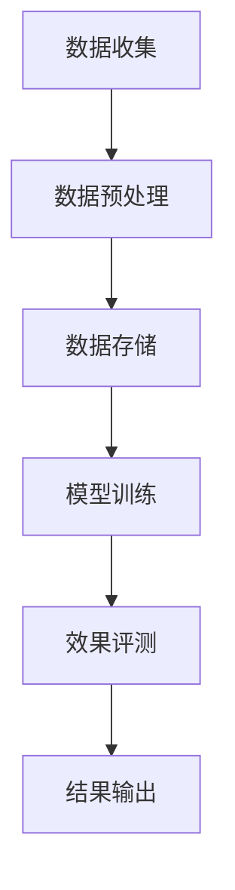

                 

### 《AI辅助教学系统效果评测平台》

关键词：AI辅助教学、效果评测、平台架构、核心算法、应用案例、未来展望

摘要：本文将探讨《AI辅助教学系统效果评测平台》的构建和应用。首先，介绍平台的定位与目标，然后阐述AI辅助教学系统的基本概念和效果评测的重要性。接下来，详细解析平台的技术基础，包括AI算法、数据分析和机器学习。随后，描述平台的架构设计、数据收集与预处理、效果评测核心算法以及算法优化策略。文章还涵盖了平台实现与部署的细节，并分析了实际应用场景和案例。最后，对平台的未来展望与挑战进行了探讨。

### 第一部分：概述与核心概念

#### 1.1 《AI辅助教学系统效果评测平台》概述

##### 1.1.1 平台的定位与目标

《AI辅助教学系统效果评测平台》是一款专门用于评估AI辅助教学系统效果的工具。其目标是通过整合先进的AI技术和数据分析方法，提供一个全面、准确的评测平台，帮助教育机构优化教学策略，提高教学效果。

##### 1.1.2 平台的应用场景

该平台主要应用于以下场景：

- 在线教育平台：评估学生的学习行为和效果，为个性化教学提供数据支持。
- 课堂教学：辅助教师评估学生的学习情况，调整教学方法和进度。
- 教育科研：为教育研究提供数据支持，探索教育规律和优化方案。

##### 1.1.3 平台的核心价值

平台的核心价值在于：

- 提高教学效果：通过精准的评测数据，帮助教育机构优化教学策略。
- 个性化教学：根据学生的学习情况，提供个性化的教学建议。
- 数据驱动：以数据为核心，推动教育变革，实现教育现代化。

#### 1.2 AI辅助教学系统的基本概念

##### 1.2.1 AI在教育领域的应用

AI技术在教育领域的应用包括：

- 智能推荐：根据学生的学习行为，推荐适合的学习内容和路径。
- 个性化教学：根据学生的特点，提供个性化的教学方案。
- 作业与考试：自动批改作业和考试，提供即时反馈。

##### 1.2.2 教学效果评测的定义与重要性

教学效果评测是指通过一定的方法，对教学活动的效果进行评估和判断。其重要性在于：

- 优化教学：通过评测数据，发现教学中的问题，优化教学方法和策略。
- 提高效率：减少无效的教学活动，提高教学效率。
- 改善质量：提高教学效果，提升教育质量。

##### 1.2.3 效果评测平台的作用

效果评测平台的作用包括：

- 提供数据支持：为教育机构提供全面、准确的教学效果数据。
- 支持决策：为教育管理者提供决策依据，优化教育资源配置。
- 评价教师：评估教师的教学效果，为教师绩效评估提供依据。

#### 1.3 效果评测平台的技术基础

##### 1.3.1 AI算法与模型

AI算法与模型是效果评测平台的核心。常用的AI算法包括：

- 机器学习：用于数据分析和模式识别，如决策树、支持向量机、神经网络等。
- 深度学习：用于处理大规模数据和高维数据，如卷积神经网络、循环神经网络等。
- 自然语言处理：用于处理文本数据，如词向量、文本分类、命名实体识别等。

##### 1.3.2 数据分析与处理

数据分析与处理是效果评测平台的基础。主要涉及：

- 数据收集：收集与教学相关的数据，如学生行为数据、成绩数据等。
- 数据预处理：清洗和转换数据，使其适合进行分析和处理。
- 数据可视化：通过图表和图形，直观地展示数据特征和变化趋势。

##### 1.3.3 机器学习基础

机器学习基础是效果评测平台的关键。主要包括：

- 算法选择：根据问题和数据特点，选择合适的算法。
- 特征工程：提取和构建有用的特征，提高模型的性能。
- 模型评估：通过交叉验证、ROC曲线等指标，评估模型的性能。

### 第二部分：平台架构与核心算法

#### 2.1 平台架构设计

##### 2.1.1 架构的组成与层级

平台架构由数据层、服务层和展示层三个层级组成。

- 数据层：负责数据的存储和管理，包括数据库和缓存系统。
- 服务层：提供核心的功能，包括数据收集、预处理、模型训练和效果评测等。
- 展示层：提供用户界面，展示评测结果和数据分析报告。

##### 2.1.2 数据流与处理流程

数据流与处理流程如下：

1. 数据收集：从各种渠道收集教学数据。
2. 数据预处理：清洗和转换数据，为后续处理做准备。
3. 数据存储：将预处理后的数据存储到数据库中。
4. 模型训练：使用机器学习算法，训练模型。
5. 效果评测：使用训练好的模型，对教学效果进行评测。
6. 结果输出：将评测结果以图表和报告的形式展示给用户。

##### 2.1.3 模块功能与交互

平台的主要模块包括：

- 数据收集模块：负责收集教学数据。
- 数据预处理模块：负责清洗和转换数据。
- 模型训练模块：负责训练机器学习模型。
- 效果评测模块：负责对教学效果进行评测。
- 结果展示模块：负责将评测结果展示给用户。

模块之间的交互关系如下：

1. 数据收集模块收集数据，传递给数据预处理模块。
2. 数据预处理模块处理数据，传递给模型训练模块。
3. 模型训练模块训练模型，传递给效果评测模块。
4. 效果评测模块评测结果，传递给结果展示模块。
5. 结果展示模块展示结果，供用户查看。

#### 2.2 数据收集与预处理

##### 2.2.1 数据来源与类型

数据来源包括：

- 学生行为数据：如学习时间、学习进度、测试成绩等。
- 教学资源数据：如课程资料、试题库等。
- 教师教学数据：如教学计划、教学方法、教学效果等。

数据类型包括：

- 结构化数据：如学生成绩、课程信息等，通常以数据库的形式存储。
- 非结构化数据：如文本、图片、音频等，通常使用文件系统或对象存储进行存储。

##### 2.2.2 数据预处理方法

数据预处理方法包括：

- 数据清洗：去除重复数据、缺失数据和异常数据。
- 数据转换：将不同类型的数据转换为统一格式，如将文本数据转换为向量。
- 数据归一化：将数据缩放到相同的范围，如0-1或-1到1。

##### 2.2.3 数据质量评估

数据质量评估包括：

- 数据完整性：评估数据是否完整，如是否有缺失值。
- 数据准确性：评估数据是否准确，如是否存在错误。
- 数据一致性：评估数据是否一致，如不同来源的数据是否冲突。
- 数据时效性：评估数据是否最新，如是否包含过期的信息。

#### 2.3 效果评测核心算法

##### 2.3.1 评测指标定义

效果评测的核心指标包括：

- 学习效果：评估学生的学习成果，如考试成绩、知识点掌握程度等。
- 教学质量：评估教师的教学效果，如教学方法、教学内容、教学态度等。
- 学习满意度：评估学生的学习体验，如对教学资源的满意度、对教学环境的满意度等。

##### 2.3.2 模型选择与训练

模型选择与训练步骤包括：

1. 数据集划分：将数据集划分为训练集和测试集。
2. 特征工程：提取和构建有用的特征，如学生行为特征、课程特征等。
3. 模型选择：根据问题和数据特点，选择合适的机器学习模型，如决策树、支持向量机、神经网络等。
4. 模型训练：使用训练集训练模型，如使用梯度下降算法训练神经网络。
5. 模型评估：使用测试集评估模型性能，如使用交叉验证、ROC曲线等指标。
6. 模型优化：根据评估结果，调整模型参数，优化模型性能。

##### 2.3.3 评测流程与实现

评测流程与实现步骤包括：

1. 数据收集：从教学系统中收集学生学习数据。
2. 数据预处理：清洗和转换数据，为模型训练做准备。
3. 特征工程：提取和构建有用的特征，如学生行为特征、课程特征等。
4. 模型训练：使用机器学习算法，训练模型。
5. 效果评测：使用训练好的模型，对教学效果进行评测。
6. 结果输出：将评测结果以图表和报告的形式展示给用户。

#### 2.4 效果评测算法优化

##### 2.4.1 性能优化策略

性能优化策略包括：

- 数据预处理：使用高效的数据预处理方法，减少数据处理时间。
- 模型选择：选择适合问题的机器学习模型，避免过度拟合。
- 并行计算：使用并行计算技术，提高模型训练和预测速度。
- 缓存技术：使用缓存技术，减少数据读取和写入时间。

##### 2.4.2 算法调优方法

算法调优方法包括：

- 参数调整：根据评估结果，调整模型参数，优化模型性能。
- 特征选择：根据评估结果，选择对模型性能有显著影响的特征。
- 模型融合：将多个模型的结果进行融合，提高预测准确性。

##### 2.4.3 模型评估与比较

模型评估与比较方法包括：

- 交叉验证：使用交叉验证方法，评估模型的泛化能力。
- ROC曲线：绘制ROC曲线，比较不同模型的性能。
- F1分数：计算F1分数，评估模型的精确度和召回率。

### 第三部分：平台实现与部署

#### 3.1 平台实现基础

##### 3.1.1 开发环境搭建

开发环境搭建步骤包括：

1. 安装操作系统：选择合适的操作系统，如Linux或Windows。
2. 安装开发工具：安装Python、IDE、数据库等开发工具。
3. 配置环境变量：配置环境变量，确保开发工具能够正常使用。
4. 安装依赖库：安装必要的依赖库，如NumPy、Pandas、Scikit-learn等。

##### 3.1.2 开发框架选择

开发框架选择包括：

- Web框架：如Django、Flask等，用于搭建Web应用。
- 数据库框架：如SQLAlchemy、Peewee等，用于操作数据库。
- 机器学习框架：如TensorFlow、PyTorch等，用于训练模型。

##### 3.1.3 开发工具与资源

开发工具与资源包括：

- 编辑器：如VS Code、PyCharm等，用于编写代码。
- 版本控制：如Git、SVN等，用于管理代码版本。
- 云服务：如AWS、Azure等，用于部署和托管平台。

#### 3.2 效果评测平台搭建

##### 3.2.1 系统架构设计

系统架构设计包括：

- 数据层：使用关系型数据库，如MySQL，存储教学数据。
- 服务层：使用微服务架构，将不同功能模块独立部署。
- 展示层：使用前端框架，如React、Vue等，搭建用户界面。

##### 3.2.2 数据库设计

数据库设计包括：

- 学生表：存储学生信息，如姓名、年龄、性别等。
- 课程表：存储课程信息，如课程名称、课程描述等。
- 学习记录表：存储学生的学习记录，如学习时间、学习进度等。
- 成绩表：存储学生的考试成绩，如考试名称、成绩等。

##### 3.2.3 用户界面设计

用户界面设计包括：

- 登录界面：提供用户登录功能。
- 主界面：展示学生的基本信息和学习记录。
- 效果评测界面：展示学生的效果评测结果。

#### 3.3 平台部署与维护

##### 3.3.1 部署策略与方案

部署策略与方案包括：

- 服务器部署：将平台部署到服务器，如云服务器或物理服务器。
- 网络部署：配置网络环境，确保平台能够正常访问。
- 安全部署：配置安全策略，保护平台和数据安全。

##### 3.3.2 安全性与稳定性

安全性与稳定性包括：

- 数据安全：加密存储教学数据，防止数据泄露。
- 网络安全：配置防火墙、入侵检测等安全措施，防止网络攻击。
- 系统稳定性：监控平台运行状态，确保平台稳定运行。

##### 3.3.3 维护与更新策略

维护与更新策略包括：

- 定期备份：定期备份教学数据，确保数据安全。
- 定期更新：定期更新平台软件，修复漏洞、优化性能。
- 监控与报警：监控系统运行状态，及时发现并解决故障。

### 第四部分：实际应用与案例

#### 4.1 实际应用场景

##### 4.1.1 不同教育场景下的应用

《AI辅助教学系统效果评测平台》在不同教育场景下的应用包括：

- 在线教育平台：用于评估学生的学习效果，提供个性化教学建议。
- 课堂教学：用于评估学生的学习情况，辅助教师调整教学策略。
- 教育科研：用于收集和分析教学数据，探索教育规律和优化方案。

##### 4.1.2 教学效果评测的实际需求

教学效果评测的实际需求包括：

- 学生学习行为分析：了解学生的学习习惯和效果，提供个性化教学建议。
- 教师教学效果评估：评估教师的教学质量，为教师培训和发展提供依据。
- 教学资源优化：根据学生学习情况，优化教学资源，提高教学效果。

#### 4.2 案例分析

##### 4.2.1 案例一：在线学习平台评测

在该案例中，使用《AI辅助教学系统效果评测平台》对某在线学习平台的教学效果进行评测。评测内容包括：

- 学生学习行为分析：分析学生的学习时间、学习进度、测试成绩等。
- 教学资源评估：评估教学资源的利用率，优化教学资源分配。
- 个性化教学建议：根据学生的学习情况，提供个性化教学建议。

##### 4.2.2 案例二：课堂教学辅助评测

在该案例中，使用《AI辅助教学系统效果评测平台》对某中学的课堂教学效果进行评测。评测内容包括：

- 学生学习情况评估：评估学生的课堂参与度、作业完成情况等。
- 教师教学效果评估：评估教师的教学方法、教学内容等。
- 教学策略调整：根据评测结果，调整教学策略，提高教学质量。

##### 4.2.3 案例三：智能辅导系统评测

在该案例中，使用《AI辅助教学系统效果评测平台》对某智能辅导系统进行评测。评测内容包括：

- 学生学习效果评估：评估学生的学习成果，如考试成绩、知识点掌握程度等。
- 智能推荐效果评估：评估智能推荐系统的效果，如推荐内容的准确性和实用性。
- 系统优化建议：根据评测结果，优化智能辅导系统的功能和服务。

### 第五部分：未来展望与挑战

#### 5.1 未来发展展望

未来，《AI辅助教学系统效果评测平台》的发展趋势包括：

- 技术创新：引入新的AI技术和算法，提高评测的精度和效率。
- 个性化教学：结合学生特点，提供更精准、个性化的教学建议。
- 跨学科应用：将AI技术应用于更多教育领域，如职业教育、特殊教育等。
- 数据融合：整合多种数据源，提供更全面的教学效果评测。

#### 5.2 挑战与对策

未来，《AI辅助教学系统效果评测平台》面临的挑战包括：

- 数据隐私与安全：保护学生和教师的数据隐私，确保数据安全。
- 算法公平性与透明性：确保算法的公平性和透明性，避免歧视和偏见。
- 教育质量与教学伦理：确保教学效果评测不影响教育质量，遵守教学伦理。

针对上述挑战，可以采取以下对策：

- 数据安全措施：加强数据加密、访问控制和备份，确保数据安全。
- 算法透明性：公开算法原理和实现，接受社会监督，确保算法的公平性。
- 教育质量保障：与教育部门合作，制定教学效果评测标准和规范，确保评测的准确性。

### 附录

#### 附录 A：开源工具与资源

##### A.1 数据集介绍

- MNIST手写数字数据集：用于图像识别。
- CEN 数据集：用于中文文本分类。
- UCI机器学习库：提供多种机器学习数据集。

##### A.2 开源评测工具

- MLflow：用于机器学习模型的管理和评估。
- TensorFlow Model Optimization：用于优化TensorFlow模型。
- Scikit-learn：提供多种机器学习算法和评估工具。

##### A.3 开源框架与库

- TensorFlow：用于深度学习。
- PyTorch：用于深度学习。
- Scikit-learn：提供多种机器学习算法。
- Pandas：提供数据操作和分析工具。

#### 附录 B：相关法律法规与标准

##### B.1 教育数据安全法

- 《中华人民共和国教育法》
- 《中华人民共和国网络安全法》

##### B.2 人工智能伦理准则

- 《人工智能伦理准则（征求意见稿）》
- 国际人工智能联合会（IJCAI）发布的《人工智能伦理指南》

##### B.3 教育行业标准

- 《教育信息化2.0行动计划》
- 《智慧校园建设指南》

### Mermaid 流程图



### 效果评测核心算法伪代码

```python
# 输入：训练数据集 X，测试数据集 X_test，参数 theta
# 输出：预测结果 y_pred

# 模型训练
def train_model(X, y, theta):
    # 初始化参数 theta
    # 进行迭代优化，更新 theta
    # 返回最终参数 theta

# 模型预测
def predict(X_test, theta):
    # 计算输出 y_pred
    # 返回预测结果 y_pred

# 整体流程
theta = train_model(X, y, theta)
y_pred = predict(X_test, theta)
```

### 数学模型与公式

$$
E = mc^2
$$

### 数学模型详细讲解

$$
y = \sum_{i=1}^{n} w_i * x_i + b
$$

其中，$w_i$ 是权重，$x_i$ 是特征，$b$ 是偏置。

### 举例说明

假设我们有以下数据集：

$$
X = \{ (x_1, y_1), (x_2, y_2), ..., (x_n, y_n) \}
$$

其中，$x_1, x_2, ..., x_n$ 是特征向量，$y_1, y_2, ..., y_n$ 是对应的标签。

### 代码实际案例

```python
# 导入
import numpy as np
import pandas as pd
from sklearn.model_selection import train_test_split
from sklearn.preprocessing import StandardScaler
from sklearn.linear_model import LinearRegression

# 加载数据
data = pd.read_csv("data.csv")
X = data.iloc[:, :-1].values
y = data.iloc[:, -1].values

# 划分训练集和测试集
X_train, X_test, y_train, y_test = train_test_split(X, y, test_size=0.2, random_state=0)

# 数据预处理
scaler = StandardScaler()
X_train = scaler.fit_transform(X_train)
X_test = scaler.transform(X_test)

# 模型训练
model = LinearRegression()
model.fit(X_train, y_train)

# 模型预测
y_pred = model.predict(X_test)

# 模型评估
score = model.score(X_test, y_test)
print("模型评分：", score)
```

### 最佳实践 Tips

- 在数据收集阶段，确保数据的完整性和准确性。
- 在数据预处理阶段，注重数据清洗和特征工程。
- 在模型训练阶段，选择合适的模型和参数，避免过度拟合。
- 在模型评估阶段，使用多种评估指标，全面评估模型性能。
- 在实际应用中，结合业务需求和用户反馈，持续优化平台功能。

### 小结

本文详细介绍了《AI辅助教学系统效果评测平台》的构建和应用。通过概述与核心概念、平台架构与核心算法、平台实现与部署、实际应用与案例以及未来展望与挑战等五个部分，全面解析了平台的技术原理和实践应用。在未来的发展中，平台将继续优化和拓展，为教育领域带来更多创新和变革。希望本文对您在AI辅助教学系统效果评测方面的研究和实践有所帮助。如果您有任何疑问或建议，欢迎在评论区留言讨论。感谢您的阅读！

