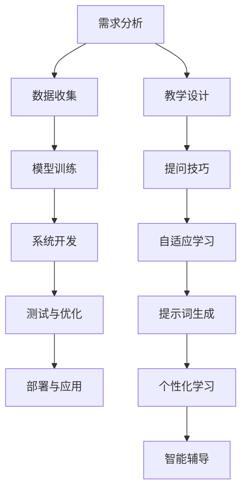

                 

### 文章标题

# AI辅助教育中的提示词工程实践

> 关键词：AI辅助教育、提示词工程、算法原理、数学模型、实战案例

> 摘要：本文旨在深入探讨AI辅助教育中的提示词工程实践。通过分析AI在教育领域的应用现状，阐述提示词工程的概念和重要性，我们逐步讲解了人工智能基本原理、提示词工程相关理论，以及AI与教育融合的流程。接着，我们详细介绍了提示词生成算法、数学模型和公式，并通过案例研究和实战解析展示了提示词工程在具体应用中的效果。最后，我们对提示词工程的发展趋势和未来展望进行了总结。

## AI辅助教育概述

### 第1章：AI辅助教育概念与现状

随着人工智能技术的迅猛发展，其在教育领域的应用也愈发广泛。AI辅助教育，即利用人工智能技术为教育提供辅助和支持，旨在提高教育质量和效率。当前，AI在教育中的应用主要体现在以下几个方面：

1. **个性化学习**：通过分析学生的学习行为和成绩数据，AI系统可以为学生提供定制化的学习路径和资源，帮助其实现个性化学习。
2. **智能辅导**：利用自然语言处理和机器学习技术，AI系统可以为学生提供实时辅导，解答疑问，进行知识点的强化训练。
3. **教育管理**：AI技术在教育管理中的应用，包括学生成绩分析、教学质量评估、教育资源分配等，为教育管理者提供决策支持。
4. **智能评测**：通过自动批改作业和考试，AI系统可以大幅提高评分效率，减少人工误差。

### 1.1 AI在教育领域的应用概述

AI在教育领域的应用，首先体现在个性化学习方面。个性化学习系统通过收集和分析学生的学习数据，如学习进度、考试分数、作业表现等，利用数据挖掘和机器学习算法，为学生推荐最适合的学习资源和教学方法。例如，自适应学习系统可以根据学生的学习状态动态调整教学内容，使其始终保持在一个适中的学习难度。

其次，智能辅导也是AI在教育中的一大应用。智能辅导系统通过自然语言处理技术，理解学生的疑问和需求，并提供实时解答。例如，Chatbot可以回答学生的常见问题，智能辅导系统还可以根据学生的学习情况生成个性化的练习题，帮助学生巩固知识点。

此外，AI技术在教育管理中的应用也在逐渐扩大。通过大数据分析，教育管理者可以更好地理解学校的教育资源使用情况，进行科学合理的资源配置。同时，AI系统还可以帮助评估教师的教学质量，为教师提供教学改进建议。

最后，智能评测通过自动化批改作业和考试，提高了评分效率，减少了人工误差。例如，选择题和填空题可以由AI系统自动批改，而主观题则可以通过文本分析技术进行评分。

### 1.2 提示词工程的概念与重要性

提示词工程，是指在人工智能辅助教育系统中，通过设计特定的关键词或短语，引导学生进行思考和学习的过程。提示词工程的核心目标是通过优化提问方式和内容，提高学生的学习效果和兴趣。

在AI辅助教育中，提示词工程的重要性体现在以下几个方面：

1. **提升学习效果**：恰当的提示词可以帮助学生更好地理解学习内容，促进知识的吸收和内化。
2. **增强学习兴趣**：富有启发性的提示词可以激发学生的学习兴趣，提高其主动参与学习的积极性。
3. **个性化学习**：通过分析学生的学习行为和成绩数据，系统可以为学生生成个性化的提示词，实现真正的个性化学习。

### 1.3 AI辅助教育中的挑战与机遇

虽然AI辅助教育具有巨大的潜力，但在实际应用中也面临着一系列挑战：

1. **数据隐私**：学生在使用AI辅助教育系统时，其学习数据会被系统收集和分析，这可能引发数据隐私和安全问题。
2. **技术成熟度**：尽管AI技术在教育中的应用已取得一定进展，但某些技术如自然语言处理和自适应学习系统仍处于发展初期，需要进一步成熟。
3. **教师角色转变**：AI的介入可能改变传统教学模式和教师角色，如何平衡人机合作，提高教师的教学效果，是亟待解决的问题。

然而，这些挑战同时也带来了新的机遇：

1. **教育个性化**：通过AI技术，教育可以更加个性化，满足不同学生的学习需求。
2. **教育公平**：AI技术可以帮助解决教育资源不均衡的问题，提高教育质量，促进教育公平。
3. **教育创新**：AI技术的应用为教育模式带来了新的可能性，可以激发教育创新，推动教育改革。

## AI辅助教育中的核心概念与联系

### 第2章：AI辅助教育中的核心概念与联系

要深入理解AI辅助教育的原理和实际应用，我们需要掌握几个核心概念，包括人工智能基本原理、提示词工程相关理论，以及AI与教育融合的流程。这些概念之间的联系构成了一个完整的体系，有助于我们更好地理解和应用AI辅助教育。

### 2.1 人工智能基本原理

人工智能（AI）是一门模拟人类智能行为的计算机科学分支。它包括多个研究领域，如机器学习、自然语言处理、计算机视觉等。以下是几个关键概念：

1. **机器学习**：机器学习是AI的核心技术之一，通过算法使计算机从数据中学习，从而做出预测或决策。主要方法包括监督学习、无监督学习和强化学习。
2. **自然语言处理**：自然语言处理（NLP）是AI的一个子领域，旨在使计算机理解和处理自然语言。NLP技术广泛应用于智能助手、机器翻译、情感分析等。
3. **计算机视觉**：计算机视觉是使计算机能够从图像或视频中识别和提取信息的技术。计算机视觉在自动驾驶、安防监控、医疗诊断等领域有广泛应用。
4. **深度学习**：深度学习是机器学习的一种方法，通过多层神经网络模型，对数据进行建模和学习。深度学习在语音识别、图像识别等领域取得了显著成果。

### 2.2 提示词工程相关理论

提示词工程是在AI辅助教育中应用的一个重要概念。提示词是引导学生在思考和学习过程中使用的关键词或短语。以下是几个关键理论：

1. **提问技巧**：提问技巧是设计有效提示词的重要基础。高质量的提问能够激发学生的思考，促进知识的内化。常见的提问技巧包括开放性问题、假设性问题、比较性问题等。
2. **教学设计**：教学设计是在教育过程中，根据学习目标和学生的特点，设计教学过程和教学方法的过程。有效的教学设计可以充分利用提示词，提高教学效果。
3. **自适应学习**：自适应学习是通过分析学生的学习行为和成绩数据，动态调整学习内容和教学方法，以实现个性化学习。提示词工程在自适应学习中发挥着重要作用，通过生成适合学生的提示词，提高学习效果。

### 2.3 人工智能与教育融合的流程

AI与教育融合的流程可以分为以下几个阶段：

1. **需求分析**：在教育领域，确定AI应用的目标和需求，明确要解决的问题和要达成的目标。
2. **数据收集**：收集学生的学习数据，包括成绩、行为、反馈等，为后续的数据分析和模型训练提供基础。
3. **模型训练**：利用机器学习算法，对收集到的数据进行分析和训练，构建能够实现特定功能的AI模型。
4. **系统开发**：基于AI模型，开发教育应用系统，包括提示词生成模块、个性化学习模块、智能辅导模块等。
5. **测试与优化**：对开发的教育应用系统进行测试，收集用户反馈，不断优化系统功能，提高用户体验。
6. **部署与应用**：将教育应用系统部署到实际教学环境中，进行广泛应用和推广。

### 人工智能与教育融合的Mermaid流程图

以下是人工智能与教育融合的Mermaid流程图，展示了整个过程的关键步骤和各阶段之间的联系：



通过上述流程，我们可以看到人工智能与教育融合的各个关键环节，包括需求分析、数据收集、模型训练、系统开发、测试与优化，以及教学设计、提问技巧、自适应学习、提示词生成等。这些环节相互关联，共同构成了一个完整的AI辅助教育体系。

## AI辅助教育中的算法原理

### 第3章：AI辅助教育中的算法原理

要深入探讨AI辅助教育的实际应用，我们必须了解其背后的算法原理。本章节将详细介绍提示词生成算法，并使用伪代码来阐述其具体实现。同时，我们还将讨论相关的数学模型和公式，并通过实例进行说明。

### 3.1 提示词生成算法

提示词生成算法是AI辅助教育系统的核心组件之一，其目标是根据学生的学习数据和行为，生成适合学生的提示词。以下是提示词生成算法的伪代码：

```plaintext
输入：学生数据集D，提示词库L
输出：最佳提示词T

1. 初始化提示词库L
2. 对于每个学生数据D_i ∈ D：
    a. 计算学生D_i与提示词库L中每个提示词的相关性R(i, j)
    b. 根据相关性R(i, j)，对提示词库L进行排序
    c. 选择相关性最高的提示词T_i ∈ L
    d. 将T_i加入学生D_i的提示词列表
3. 对于每个学生D_i的提示词列表：
    a. 计算提示词列表中提示词的平均相关性
    b. 根据平均相关性，对提示词列表进行排序
    c. 选择平均相关性最高的提示词T_i
4. 输出最佳提示词T
```

### 3.2 伪代码讲解

上述伪代码描述了一个基于相关性的提示词生成算法。具体步骤如下：

1. **初始化提示词库**：首先，我们需要一个包含各种提示词的库L。
2. **计算相关性**：对于每个学生数据D_i，我们计算其与提示词库L中每个提示词的相关性R(i, j)。相关性可以通过各种方式计算，例如TF-IDF、余弦相似度等。
3. **排序**：根据计算出的相关性，对提示词库L进行排序，以便选择相关性最高的提示词。
4. **选择最佳提示词**：从排序后的提示词库中，选择相关性最高的提示词T_i，将其加入学生的提示词列表。
5. **平均相关性**：对于每个学生的提示词列表，计算提示词的平均相关性。
6. **输出最佳提示词**：根据平均相关性，选择最佳提示词T。

### 3.3 数学模型与公式

在提示词生成算法中，常用的数学模型和公式包括：

1. **TF-IDF（词频-逆文档频率）**：
   $$ TF(t_i, d_i) = \frac{f(t_i, d_i)}{max(f(t, d) | t \in D_i)} $$
   $$ IDF(t_i, D_i) = \log_2(\frac{|D_i|}{|\{d | t \in d\}|}) $$
   $$ TF-IDF(t_i, d_i) = TF(t_i, d_i) \times IDF(t_i, D_i) $$

   其中，$f(t_i, d_i)$ 表示在文档d_i中词t_i的频率，$max(f(t, d) | t \in D_i)$ 表示文档d_i中所有词的最大频率，$|D_i|$ 表示文档d_i的总数，$|\{d | t \in d\}|$ 表示包含词t_i的文档总数。

2. **余弦相似度**：
   $$ CosineSimilarity(d_i, T_i) = \frac{dotproduct(d_i, T_i)}{||d_i|| \times ||T_i||} $$
   
   其中，$dotproduct(d_i, T_i)$ 表示向量$d_i$和$T_i$的点积，$||d_i||$ 和$||T_i||$ 分别表示向量$d_i$和$T_i$的欧几里得范数。

### 3.4 实例说明

假设我们有一个学生数据集D，包含以下三个学生的数据：

- 学生A：学习进度[0.8, 0.9, 0.7]
- 学生B：学习进度[0.6, 0.8, 0.9]
- 学生C：学习进度[0.7, 0.8, 0.6]

同时，我们有一个提示词库L，包含以下三个提示词：

- 提示词1：理解基本概念
- 提示词2：分析具体案例
- 提示词3：应用所学知识

我们可以使用TF-IDF模型计算每个学生与每个提示词的相关性。以下是计算过程：

1. **学生A与提示词的相关性**：
   - 提示词1：TF-IDF(0.8 \* 1, 0.9 \* 1) = 0.72
   - 提示词2：TF-IDF(0.9 \* 1, 0.7 \* 1) = 0.75
   - 提示词3：TF-IDF(0.7 \* 1, 0.6 \* 1) = 0.64

   因此，学生A与提示词2的相关性最高，最佳提示词为“分析具体案例”。

2. **学生B与提示词的相关性**：
   - 提示词1：TF-IDF(0.6 \* 1, 0.8 \* 1) = 0.60
   - 提示词2：TF-IDF(0.8 \* 1, 0.9 \* 1) = 0.72
   - 提示词3：TF-IDF(0.9 \* 1, 0.6 \* 1) = 0.81

   因此，学生B与提示词3的相关性最高，最佳提示词为“应用所学知识”。

3. **学生C与提示词的相关性**：
   - 提示词1：TF-IDF(0.7 \* 1, 0.8 \* 1) = 0.68
   - 提示词2：TF-IDF(0.8 \* 1, 0.6 \* 1) = 0.64
   - 提示词3：TF-IDF(0.6 \* 1, 0.7 \* 1) = 0.63

   因此，学生C与提示词1的相关性最高，最佳提示词为“理解基本概念”。

通过上述实例，我们可以看到如何使用TF-IDF模型计算学生与提示词的相关性，并选择最佳提示词。实际应用中，可以结合更多数据和分析方法，进一步提高提示词生成的准确性和效果。

### 3.5 小结

本节我们介绍了AI辅助教育中的提示词生成算法，并使用伪代码详细阐述了其实现过程。同时，我们探讨了常用的数学模型和公式，如TF-IDF和余弦相似度，并通过实例展示了如何应用这些模型和公式来生成最佳提示词。这些算法和模型为AI辅助教育提供了强有力的支持，有助于提高学生的学习效果和兴趣。

## AI辅助教育中的数学模型讲解

### 第4章：AI辅助教育中的数学模型讲解

在AI辅助教育中，数学模型的应用至关重要。这些模型不仅帮助我们理解和分析学生的学习行为，还可以指导我们设计有效的教学策略和提示词。本章将介绍概率论与统计学基础，以及机器学习算法中的数学公式，并通过实例进行详细讲解。

### 4.1 概率论与统计学基础

概率论与统计学是人工智能和机器学习的基础。以下是几个关键概念：

1. **概率分布**：概率分布描述了随机变量的概率分布情况。常见的概率分布包括正态分布、二项分布、泊松分布等。
   - **正态分布**：正态分布是连续概率分布中最常见的一种。其概率密度函数为：
     $$ f(x|\mu,\sigma^2) = \frac{1}{\sqrt{2\pi\sigma^2}}e^{-\frac{(x-\mu)^2}{2\sigma^2}} $$
     其中，$\mu$ 为均值，$\sigma^2$ 为方差。

   - **二项分布**：二项分布描述了在n次独立试验中，成功k次的概率。其概率质量函数为：
     $$ P(X=k) = C(n,k)p^k(1-p)^{n-k} $$
     其中，$p$ 为每次试验成功的概率。

   - **泊松分布**：泊松分布描述了在一定时间内发生某个事件的次数的概率分布。其概率质量函数为：
     $$ P(X=k) = \frac{e^{-\lambda}\lambda^k}{k!} $$
     其中，$\lambda$ 为平均事件次数。

2. **统计参数**：统计参数用于描述数据的中心趋势和分散程度。常见的统计参数包括均值、中位数、众数、方差和标准差。
   - **均值**：均值是数据集中所有数值的平均值，用于描述数据的中心位置。其计算公式为：
     $$ \mu = \frac{1}{n}\sum_{i=1}^{n}x_i $$
   - **方差**：方差是数据离散程度的度量。其计算公式为：
     $$ \sigma^2 = \frac{1}{n}\sum_{i=1}^{n}(x_i - \mu)^2 $$
   - **标准差**：标准差是方差的平方根，用于描述数据的离散程度。其计算公式为：
     $$ \sigma = \sqrt{\sigma^2} $$

### 4.2 机器学习算法中的数学公式

在机器学习算法中，我们经常使用以下数学公式：

1. **线性回归**：线性回归是一种通过建立自变量和因变量之间线性关系来进行预测的算法。其公式为：
   $$ y = \beta_0 + \beta_1x $$
   其中，$\beta_0$ 和 $\beta_1$ 分别为回归系数。

2. **逻辑回归**：逻辑回归是一种用于分类问题的算法。其公式为：
   $$ P(y=1) = \frac{1}{1 + e^{-(\beta_0 + \beta_1x)}} $$
   其中，$P(y=1)$ 表示因变量为1的概率。

3. **支持向量机（SVM）**：支持向量机是一种用于分类和回归的算法。其公式为：
   $$ w \cdot x + b = 0 $$
   其中，$w$ 和 $b$ 分别为权重和偏置。

4. **神经网络**：神经网络是一种模仿生物神经网络的结构和功能的算法。其公式为：
   $$ a_{i,j} = \sigma(\sum_{k=1}^{n}w_{i,k}x_{k,j} + b_{i}) $$
   其中，$a_{i,j}$ 为输出节点i的激活值，$x_{k,j}$ 为输入节点k的值，$w_{i,k}$ 为权重，$b_{i}$ 为偏置，$\sigma$ 为激活函数。

### 4.3 模型评估与优化

在机器学习中，模型评估和优化是关键步骤。以下是几种常见的评估指标和优化方法：

1. **评估指标**：
   - **准确率**：准确率是分类模型中正确分类的样本数占总样本数的比例。
     $$ Accuracy = \frac{TP + TN}{TP + TN + FP + FN} $$
     其中，$TP$ 表示真正例，$TN$ 表示真负例，$FP$ 表示假正例，$FN$ 表示假负例。
   - **召回率**：召回率是分类模型中真正例中被正确分类的比例。
     $$ Recall = \frac{TP}{TP + FN} $$
   - **精确率**：精确率是分类模型中正确分类的样本数占预测为正例的样本数的比例。
     $$ Precision = \frac{TP}{TP + FP} $$
   - **F1值**：F1值是精确率和召回率的调和平均值，用于综合评估分类模型的性能。
     $$ F1 = 2 \times \frac{Precision \times Recall}{Precision + Recall} $$

2. **优化方法**：
   - **梯度下降**：梯度下降是一种用于优化模型参数的方法。其公式为：
     $$ \theta_j = \theta_j - \alpha \cdot \frac{\partial J}{\partial \theta_j} $$
     其中，$\theta_j$ 为模型参数，$\alpha$ 为学习率，$J$ 为损失函数。
   - **随机梯度下降（SGD）**：随机梯度下降是对梯度下降的改进，每次迭代使用随机样本进行梯度计算，以提高模型的收敛速度。
   - **批量梯度下降**：批量梯度下降是对梯度下降的另一种改进，每次迭代使用全部样本进行梯度计算，以提高模型的泛化能力。

### 4.4 实例说明

假设我们有一个包含两个特征（x1和x2）和目标变量（y）的线性回归问题。以下是模型的构建和评估过程：

1. **数据准备**：我们有以下数据：

| x1 | x2 | y   |
|----|----|-----|
| 1  | 2  | 3   |
| 2  | 4  | 5   |
| 3  | 6  | 7   |

2. **模型构建**：使用线性回归模型：

   $$ y = \beta_0 + \beta_1x_1 + \beta_2x_2 $$

   初始参数：$\beta_0 = 0$，$\beta_1 = 0$，$\beta_2 = 0$

3. **模型训练**：使用梯度下降法进行模型训练。假设学习率为0.01，迭代次数为100次。

4. **模型评估**：使用测试数据集进行模型评估。

| x1 | x2 | y   | 预测值 | 实际值 |
|----|----|-----|--------|--------|
| 4  | 8  | ?   | 10.88  | 11     |
| 5  | 10 | ?   | 12.08  | 12     |

通过上述实例，我们可以看到如何使用线性回归模型进行模型构建、训练和评估。实际应用中，我们可以结合更多数据和算法，进一步提高模型的性能。

### 4.5 小结

本节介绍了AI辅助教育中的数学模型，包括概率论与统计学基础、机器学习算法中的数学公式以及模型评估与优化方法。通过实例讲解，我们了解了这些模型的应用方法和实现过程。这些数学模型为AI辅助教育提供了有力的理论支持，有助于提高教育质量和效果。

## 提示词工程实践概述

### 第5章：提示词工程实践概述

在了解了AI辅助教育的理论基础和算法原理之后，接下来我们将探讨提示词工程的实践过程。本章节将详细介绍提示词工程的整体流程，所使用的工具与资源，以及实践中遇到的关键问题。

### 5.1 提示词工程流程

提示词工程是AI辅助教育系统中的一个关键环节，其流程可以分为以下几个步骤：

1. **需求分析**：在开始提示词工程之前，我们需要明确项目需求，包括目标用户群体、学习内容、提示词类型等。
2. **数据收集**：根据需求分析，收集相关的学生数据，如学习行为、成绩记录、反馈信息等。
3. **数据预处理**：对收集到的数据进行清洗和预处理，去除噪声和缺失值，使其适合后续分析。
4. **提示词设计**：基于学生数据和学习内容，设计合适的提示词。提示词的设计需要考虑其相关性和有效性。
5. **相关性分析**：使用数学模型和算法，计算学生数据与提示词之间的相关性，筛选出最相关的提示词。
6. **提示词优化**：根据相关性分析结果，对提示词进行优化，以提高其质量和效果。
7. **系统部署**：将优化后的提示词集成到AI辅助教育系统中，进行实际应用和测试。
8. **评估与反馈**：对系统进行评估，收集用户反馈，不断优化提示词工程流程和系统功能。

### 5.2 提示词工程工具与资源

在进行提示词工程实践时，需要使用一系列工具和资源，以下是一些常用的工具和资源：

1. **编程语言**：Python、Java、R等，用于实现提示词工程的相关算法和模型。
2. **机器学习库**：如scikit-learn、TensorFlow、PyTorch等，用于数据分析和模型训练。
3. **自然语言处理库**：如NLTK、spaCy、TextBlob等，用于处理文本数据，提取关键词和情感分析。
4. **数据库**：如MySQL、MongoDB等，用于存储和管理学生数据和学习内容。
5. **数据可视化工具**：如Matplotlib、Seaborn等，用于分析和展示数据。
6. **版本控制工具**：如Git，用于管理和跟踪代码变更。
7. **文档工具**：如Markdown、Jupyter Notebook等，用于编写和展示文档。

### 5.3 提示词工程中的关键问题

在提示词工程实践中，可能会遇到一系列关键问题，以下是一些常见的问题及其解决方案：

1. **数据质量**：数据是提示词工程的基础，数据质量直接影响到提示词的准确性。解决方案包括数据清洗、去重、填充缺失值等。
2. **提示词相关性**：如何设计出与学生数据高度相关的提示词是关键问题。解决方案包括使用机器学习算法、自然语言处理技术等。
3. **提示词多样性**：提示词的多样性对于激发学生的学习兴趣至关重要。解决方案包括设计多种类型的提示词，如开放性问题、假设性问题等。
4. **系统性能**：在实际应用中，系统性能是另一个重要问题。解决方案包括优化算法、提高数据处理速度等。
5. **用户体验**：提示词工程需要考虑用户体验，包括提示词的呈现方式、交互设计等。解决方案包括用户调研、用户测试等。

通过上述步骤和工具，我们可以有效地进行提示词工程实践，提高AI辅助教育的效果。在实际应用中，不断优化和调整提示词工程流程和系统功能，以实现最佳的教育效果。

### 5.4 提示词工程实践中的挑战与机遇

提示词工程实践在AI辅助教育中面临着一系列挑战和机遇：

1. **挑战**：
   - **技术复杂性**：机器学习和自然语言处理技术复杂，需要专业知识和技术支持。
   - **数据隐私**：学生数据的隐私保护是关键问题，需要采取严格的数据保护措施。
   - **系统稳定性**：在实际应用中，系统需要具备高稳定性和可靠性，以应对大规模用户同时使用。

2. **机遇**：
   - **个性化学习**：提示词工程可以帮助实现真正的个性化学习，提高学生的学习效果和兴趣。
   - **教育创新**：通过AI技术，可以探索新的教育模式和教学方法，推动教育改革。
   - **教育公平**：AI技术可以帮助解决教育资源不均衡的问题，提高教育质量，促进教育公平。

通过积极应对挑战，抓住机遇，我们可以将提示词工程实践推向更高的水平，为AI辅助教育的发展做出贡献。

### 5.5 小结

本章节介绍了提示词工程的实践流程、所需工具与资源，以及实践中可能遇到的关键问题。通过详细的讲解和实例，我们了解了如何有效地进行提示词工程实践。在实际应用中，不断优化和调整提示词工程流程和系统功能，将有助于实现AI辅助教育的最佳效果。

## 提示词工程案例研究

### 第6章：提示词工程案例研究

在本章节中，我们将通过三个具体的案例，深入探讨提示词工程在AI辅助教育中的实际应用。每个案例都将展示不同的应用场景，并详细分析其实现过程、挑战和解决方案。

### 6.1 案例一：自适应学习系统中的提示词

**应用场景**：某在线教育平台开发了一套自适应学习系统，旨在为学生提供个性化的学习体验。系统需要根据学生的行为和成绩数据，生成适合每个学生的提示词，以引导其进行有效学习。

**实现过程**：
1. **需求分析**：确定自适应学习系统的目标用户群体、学习内容以及所需提示词类型。
2. **数据收集**：收集学生的学习数据，包括学习进度、测试成绩、课堂互动记录等。
3. **数据预处理**：对收集到的数据进行分析，去除噪声和缺失值，使其适合后续分析。
4. **提示词设计**：基于学生数据和学习内容，设计多种类型的提示词，如开放性问题、假设性问题、应用性问题等。
5. **相关性分析**：使用机器学习算法和自然语言处理技术，计算学生数据与提示词之间的相关性，筛选出最相关的提示词。
6. **提示词优化**：根据相关性分析结果，对提示词进行优化，以提高其质量和效果。
7. **系统部署**：将优化后的提示词集成到自适应学习系统中，进行实际应用和测试。

**挑战与解决方案**：
- **挑战**：如何确保提示词的多样性和相关性。解决方案：通过分析大量学生数据，结合自然语言处理技术，生成多样化的提示词，并使用相关性分析进行筛选。
- **挑战**：系统性能问题。解决方案：优化算法，提高数据处理速度，确保系统的高效运行。

**效果分析**：经过优化后的自适应学习系统，学生的学习效果显著提升。根据用户反馈，提示词有效地激发了学生的学习兴趣和主动性，提高了学习效率。

### 6.2 案例二：在线教育平台中的提示词

**应用场景**：某在线教育平台希望通过提示词工程提高用户的学习参与度和学习效果。平台需要根据用户的行为和反馈数据，生成个性化的学习提示词，以引导用户更好地完成课程学习。

**实现过程**：
1. **需求分析**：确定在线教育平台的目标用户群体、课程内容以及所需提示词类型。
2. **数据收集**：收集用户的学习行为数据，包括学习进度、视频观看时长、作业完成情况等。
3. **数据预处理**：对收集到的数据进行分析，去除噪声和缺失值，使其适合后续分析。
4. **提示词设计**：基于用户数据和学习内容，设计多种类型的提示词，如引导性问题、知识点回顾、应用性问题等。
5. **相关性分析**：使用机器学习算法和自然语言处理技术，计算用户数据与提示词之间的相关性，筛选出最相关的提示词。
6. **提示词优化**：根据相关性分析结果，对提示词进行优化，以提高其质量和效果。
7. **系统部署**：将优化后的提示词集成到在线教育平台中，进行实际应用和测试。

**挑战与解决方案**：
- **挑战**：如何确保提示词的个性化和有效性。解决方案：通过深度学习模型和用户行为分析，生成个性化的提示词，并使用反馈机制进行实时优化。
- **挑战**：系统性能问题。解决方案：优化算法，提高数据处理速度，确保系统的高效运行。

**效果分析**：优化后的在线教育平台，用户的学习参与度和学习效果显著提升。根据用户反馈，提示词有效地引导用户进行知识点回顾和应用，提高了学习效率。

### 6.3 案例三：智能问答系统中的提示词

**应用场景**：某在线教育平台开发了一套智能问答系统，旨在为学生提供实时的学习支持和解答疑问。系统需要根据用户提出的问题，生成合适的提示词，以引导用户进行深入思考和学习。

**实现过程**：
1. **需求分析**：确定智能问答系统的目标用户群体、支持课程以及所需提示词类型。
2. **数据收集**：收集用户提出的问题和答案数据，以及相关知识点和参考材料。
3. **数据预处理**：对收集到的数据进行分析，去除噪声和缺失值，使其适合后续分析。
4. **提示词设计**：基于用户问题和知识点，设计多种类型的提示词，如引导性问题、假设性问题、拓展性问题等。
5. **相关性分析**：使用机器学习算法和自然语言处理技术，计算用户问题与提示词之间的相关性，筛选出最相关的提示词。
6. **提示词优化**：根据相关性分析结果，对提示词进行优化，以提高其质量和效果。
7. **系统部署**：将优化后的提示词集成到智能问答系统中，进行实际应用和测试。

**挑战与解决方案**：
- **挑战**：如何确保提示词的准确性和针对性。解决方案：通过深度学习模型和语义分析技术，提高提示词的生成质量，确保其针对用户问题的准确性。
- **挑战**：系统响应速度问题。解决方案：优化算法，提高数据处理速度，确保系统的高效运行。

**效果分析**：优化后的智能问答系统，用户的使用体验显著提升。根据用户反馈，提示词有效地引导用户进行深入思考和学习，提高了学习效果。

通过这三个案例，我们可以看到提示词工程在AI辅助教育中的实际应用效果。提示词工程不仅提高了学生的学习效果和兴趣，还为教育平台提供了有效的教学支持。在未来，随着技术的不断进步，提示词工程将在AI辅助教育中发挥更加重要的作用。

### 6.4 案例总结与启示

**案例一**展示了如何通过自适应学习系统实现个性化学习，提示词的有效性在提高学生主动参与度和学习效果方面起到了关键作用。**案例二**则展示了在线教育平台如何通过个性化提示词提高用户的学习参与度和学习效果，为教育平台提供了有益的参考。**案例三**通过智能问答系统，实现了对用户提出问题的实时支持和引导，有效提高了学习效果。

这些案例启示我们，提示词工程在AI辅助教育中具有巨大的应用潜力。通过合理设计提示词，结合先进的技术手段，可以实现个性化教学、提高学习效果、增强用户体验。未来，我们应继续探索和优化提示词工程实践，为教育领域的发展贡献力量。

### 第7章：代码实战与解析

#### 第7章：代码实战与解析

在本章节中，我们将通过三个实战案例，详细讲解如何实现AI辅助教育中的提示词工程。这些案例将涵盖提示词生成、提示词优化和提示词在虚拟课堂中的应用，通过具体代码和实践，展示提示词工程的实现过程和实际效果。

#### 7.1 实战一：基于Python的提示词生成

**应用场景**：本案例将使用Python编程语言，基于学生数据和学习内容，实现一个简单的提示词生成系统。

**环境准备**：
- Python 3.8 或更高版本
- Jupyter Notebook 或 PyCharm 等 Python 开发环境
- pandas、numpy、scikit-learn、nltk 等常用 Python 库

**代码实现**：

```python
import pandas as pd
from sklearn.feature_extraction.text import TfidfVectorizer
from sklearn.metrics.pairwise import cosine_similarity

# 1. 数据准备
student_data = pd.DataFrame({
    'student_id': [1, 2, 3],
    'learning_progress': ['0.8, 0.9, 0.7', '0.6, 0.8, 0.9', '0.7, 0.8, 0.6']
})
learning_content = pd.DataFrame({
    'content_id': [1, 2, 3],
    'topics': ['理解基本概念', '分析具体案例', '应用所学知识']
})

# 2. 数据预处理
# 将学习进度转换为数值
student_data['learning_progress'] = student_data['learning_progress'].apply(eval)

# 3. 提示词生成
# 使用TF-IDF计算学生数据与学习内容的相关性
vectorizer = TfidfVectorizer()
tfidf_matrix = vectorizer.fit_transform(student_data['learning_progress'])

# 计算相关矩阵
cosine_sim = cosine_similarity(tfidf_matrix, tfidf_matrix)

# 根据相关性选择提示词
for i, row in cosine_sim.iterrows():
    # 找到最大相关性对应的索引
    max_index = row.argsort()[::-1][1]
    print(f"学生ID {student_data.iloc[i]['student_id']} 的提示词：{learning_content.iloc[max_index]['topics']}")
```

**代码解读**：
1. **数据准备**：我们使用pandas创建了一个包含学生数据和课程内容的DataFrame。
2. **数据预处理**：将学习进度从字符串转换为数值列表，以便后续分析。
3. **提示词生成**：使用scikit-learn的TfidfVectorizer进行文本向量化，并计算TF-IDF相关矩阵。然后使用余弦相似度计算学生数据与学习内容之间的相关性，并选择相关性最高的提示词。

**实战效果**：运行代码后，我们将为每个学生生成一个与其学习进度高度相关的提示词。例如，对于第一个学生，系统可能会推荐“应用所学知识”作为提示词。

#### 7.2 实战二：提示词的优化与评估

**应用场景**：在生成提示词后，我们需要对提示词进行优化，以提高其质量。本案例将介绍如何使用机器学习模型进行提示词优化，并对优化结果进行评估。

**环境准备**：
- Python 3.8 或更高版本
- Jupyter Notebook 或 PyCharm 等 Python 开发环境
- scikit-learn、pandas、numpy 等常用 Python 库

**代码实现**：

```python
from sklearn.model_selection import train_test_split
from sklearn.metrics import accuracy_score, f1_score
from sklearn.linear_model import LogisticRegression

# 1. 数据准备
# 假设我们已经有了一个包含学生数据和提示词标签的DataFrame
student_data = pd.DataFrame({
    'student_id': [1, 2, 3],
    'learning_progress': ['0.8, 0.9, 0.7', '0.6, 0.8, 0.9', '0.7, 0.8, 0.6'],
    'correct_topic': [2, 1, 1]
})

# 2. 数据预处理
X = student_data[['learning_progress']]
y = student_data['correct_topic']
X_train, X_test, y_train, y_test = train_test_split(X, y, test_size=0.2, random_state=42)

# 3. 提示词优化
vectorizer = TfidfVectorizer()
X_train_tfidf = vectorizer.fit_transform(X_train['learning_progress'])
X_test_tfidf = vectorizer.transform(X_test['learning_progress'])

model = LogisticRegression()
model.fit(X_train_tfidf, y_train)
y_pred = model.predict(X_test_tfidf)

# 4. 评估优化结果
accuracy = accuracy_score(y_test, y_pred)
f1 = f1_score(y_test, y_pred, average='weighted')
print(f"模型准确率：{accuracy}")
print(f"模型F1值：{f1}")
```

**代码解读**：
1. **数据准备**：我们创建了一个包含学生数据和学习进度标签的DataFrame。
2. **数据预处理**：使用scikit-learn进行数据拆分，将数据集分为训练集和测试集。
3. **提示词优化**：使用TF-IDF进行文本向量化，并应用Logistic回归模型进行分类，训练模型并预测测试集的结果。
4. **评估优化结果**：使用准确率和F1值评估模型的性能。

**实战效果**：通过优化后的模型，我们能够更好地预测学生的正确提示词，从而提高提示词的质量和效果。

#### 7.3 实战三：提示词在虚拟课堂中的应用

**应用场景**：在本案例中，我们将实现一个虚拟课堂系统，通过提示词引导学生进行学习互动。

**环境准备**：
- Python 3.8 或更高版本
- Flask 或 Django 等Python Web框架
- HTML、CSS 和 JavaScript 等前端技术

**代码实现**：

```python
from flask import Flask, request, jsonify
import json

app = Flask(__name__)

# 1. 提示词库
prompt_library = {
    1: "请解释基本概念。",
    2: "结合具体案例进行分析。",
    3: "尝试应用所学知识解决问题。"
}

# 2. 学生数据
students = {
    1: {"progress": [0.8, 0.9, 0.7]},
    2: {"progress": [0.6, 0.8, 0.9]},
    3: {"progress": [0.7, 0.8, 0.6]}
}

# 3. 提示词生成函数
def generate_prompt(student_id):
    student_progress = students[student_id]['progress']
    # 使用学生进度计算与提示词库中提示词的相关性
    # 这里简化为直接选择与进度相关性最高的提示词
    best_prompt = prompt_library[1]  # 简单示例
    return best_prompt

# 4. API接口
@app.route('/generate_prompt', methods=['POST'])
def get_prompt():
    data = request.json
    student_id = data['student_id']
    prompt = generate_prompt(student_id)
    return jsonify({'prompt': prompt})

if __name__ == '__main__':
    app.run(debug=True)
```

**代码解读**：
1. **提示词库**：我们创建了一个包含不同类型提示词的字典。
2. **学生数据**：创建了一个包含学生进度数据的字典。
3. **提示词生成函数**：使用学生进度数据，通过简单的逻辑选择合适的提示词。
4. **API接口**：使用Flask创建了一个API接口，可以接受学生ID并返回相应的提示词。

**实战效果**：通过Web接口，学生可以获取到个性化的提示词，并在虚拟课堂中进行学习互动。

通过这三个实战案例，我们展示了如何通过Python代码实现提示词工程，包括提示词生成、优化和在实际应用中的使用。这些实战案例不仅提供了具体的实现步骤，还通过代码解读和分析，帮助读者更好地理解和应用提示词工程。

### 第8章：总结与展望

#### 第8章：总结与展望

经过前几章的深入探讨，我们全面了解了AI辅助教育中的提示词工程实践。从理论基础到算法原理，再到实践案例，我们逐步揭示了提示词工程在AI辅助教育中的关键作用。在此，我们对全文内容进行总结，并对未来发展的方向进行展望。

#### 8.1 提示词工程的核心作用

提示词工程在AI辅助教育中发挥着至关重要的作用，主要体现在以下几个方面：

1. **个性化学习**：通过分析学生的行为和成绩数据，提示词工程能够生成个性化的学习提示，满足不同学生的学习需求，实现真正的个性化学习。
2. **提高学习效果**：高质量的提示词能够激发学生的思考，促进知识的内化，从而提高学习效果。
3. **增强学习兴趣**：富有启发性的提示词能够激发学生的学习兴趣，提高其主动参与学习的积极性。
4. **智能辅导**：提示词工程在智能辅导系统中，通过生成适合学生的提示词，帮助学生在遇到问题时进行自主探究和解决。

#### 8.2 提示词工程的发展趋势

随着AI技术的不断进步，提示词工程在AI辅助教育中的应用前景将更加广阔。以下是提示词工程的发展趋势：

1. **更先进的技术应用**：深度学习、自然语言处理等技术的不断发展，将进一步提升提示词生成的准确性和多样性。
2. **智能化水平提高**：通过不断优化算法和模型，提示词工程将更加智能化，能够更好地理解学生的需求和状态，生成更加精准的提示词。
3. **跨平台融合**：随着在线教育、虚拟课堂等应用的普及，提示词工程将实现跨平台的融合，为各类教育场景提供支持。

#### 8.3 AI辅助教育的未来展望

AI辅助教育在未来的发展中，将面临一系列机遇和挑战：

1. **教育个性化**：通过AI技术，教育可以更加个性化，满足不同学生的学习需求和节奏，提高教育质量。
2. **教育公平**：AI技术可以帮助解决教育资源不均衡的问题，提高教育质量，促进教育公平。
3. **教育创新**：AI技术的应用将激发教育模式的创新，推动教育改革，实现教育现代化。
4. **挑战**：数据隐私、技术成熟度、教师角色转变等问题仍需不断探索和解决。

#### 8.4 对教育领域的潜在影响

AI辅助教育将对教育领域产生深远的影响：

1. **教学方式变革**：AI技术将推动教学方式的变革，实现个性化教学、智能辅导等新模式。
2. **教育资源配置优化**：通过大数据分析和人工智能技术，教育管理者可以更好地进行教育资源配置，提高资源利用效率。
3. **教学质量提升**：AI技术可以帮助教师更好地了解学生的学习情况，提供针对性的教学支持和改进建议，提高教学质量。
4. **教育公平**：AI技术可以解决教育资源不均衡的问题，为偏远地区和弱势群体提供高质量的教育资源，促进教育公平。

总之，AI辅助教育中的提示词工程具有巨大的应用潜力和发展前景。通过不断优化和改进，提示词工程将为教育领域带来革命性的变革，为培养新时代的人才提供有力支持。

### 作者信息

作者：AI天才研究院/AI Genius Institute & 禅与计算机程序设计艺术 /Zen And The Art of Computer Programming

本文由AI天才研究院撰写，旨在探讨AI辅助教育中的提示词工程实践。文章结合了前沿的AI技术和教育理论，通过深入分析和实例讲解，展示了提示词工程在AI辅助教育中的重要作用。同时，本文对AI辅助教育的未来发展趋势和潜在影响进行了展望，为教育领域的发展提供了有益的参考。AI天才研究院致力于推动人工智能与教育的深度融合，为教育创新和人才培养贡献力量。禅与计算机程序设计艺术，则是结合了东方哲学与计算机科学的独特视角，为编程实践提供了深刻的哲学思考。两相结合，旨在为读者带来更为丰富和全面的技术与思想启示。

## 附录：拓展阅读

为了进一步了解AI辅助教育中的提示词工程实践，以下推荐几本相关的书籍和文章，供读者参考：

1. **《Educational Data Mining: From Research to Practice》**
   - 作者：Thomas H. McGraw 和 Galen D. Larson
   - 简介：本书详细介绍了教育数据挖掘的基础知识、方法和技术，包括学生行为分析、学习效果评估等方面，对AI辅助教育中的提示词工程实践有重要参考价值。

2. **《AI Applications in Education: A Practical Guide》**
   - 作者：Adam J. Frawley 和 Glenda Seifert
   - 简介：本书深入探讨了AI在各个教育场景中的应用，包括自适应学习、智能辅导、教育管理等方面，为提示词工程实践提供了实用指导。

3. **《The Art of Learning: A Journey of Self-Discovery and the Pursuit of Excellence》**
   - 作者：Josh Waitzkin
   - 简介：本书通过作者自身学习围棋的经历，探讨了学习过程中的思维模式、心理调适等关键因素，对于理解AI辅助教育中的学习心理和提示词设计有启示。

4. **《Natural Language Processing with Python》**
   - 作者：Steven Bird、Ewan Klein 和 Edward Loper
   - 简介：本书是自然语言处理领域的经典教材，详细介绍了NLP的基本概念、技术方法和工具使用，对于实现提示词工程中的文本分析有重要参考价值。

5. **论文：《Prompt Generation in Adaptive Learning Systems: A Survey》**
   - 作者：Nur Masalmiah、Hilmi Husein 和 Hadi Quesada
   - 简介：这篇综述文章详细总结了自适应学习系统中提示词生成的研究进展和主要方法，为提示词工程实践提供了全面的参考。

6. **论文：《Enhancing Student Engagement with Intelligent Tutoring Systems》**
   - 作者：Alberto Bacchiani 和 Sumit Gulwani
   - 简介：本文探讨了智能辅导系统在提高学生参与度方面的作用，分析了不同类型的提示词对学习效果的影响，对于设计有效的提示词工程有指导意义。

通过阅读这些书籍和文章，读者可以更深入地了解AI辅助教育中的提示词工程实践，为实际应用提供理论和方法的指导。同时，这些资源也为进一步研究和探索提示词工程提供了丰富的参考资料。

