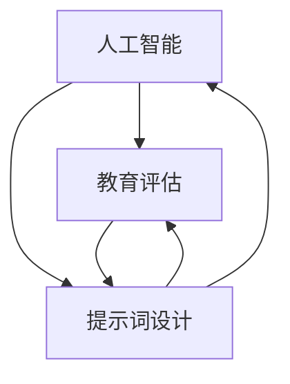
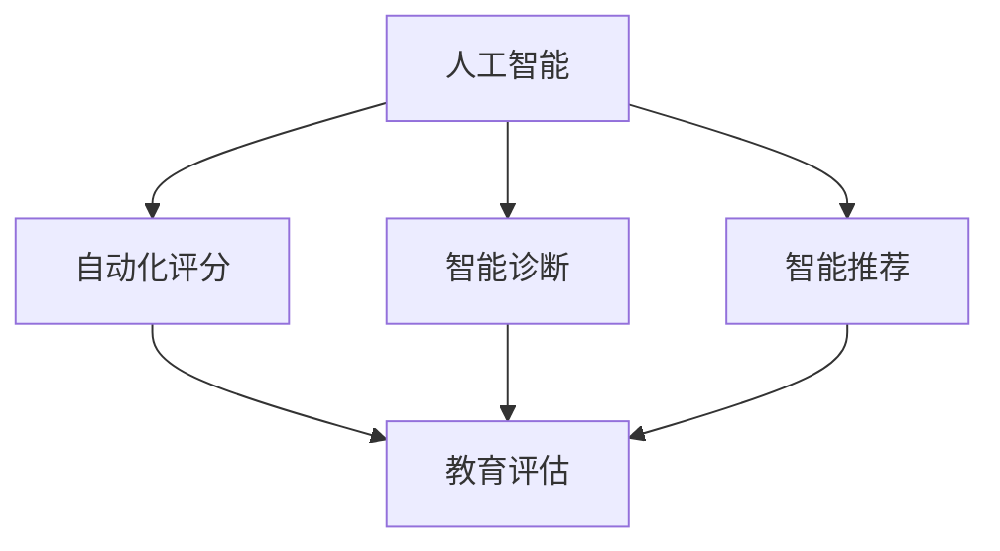
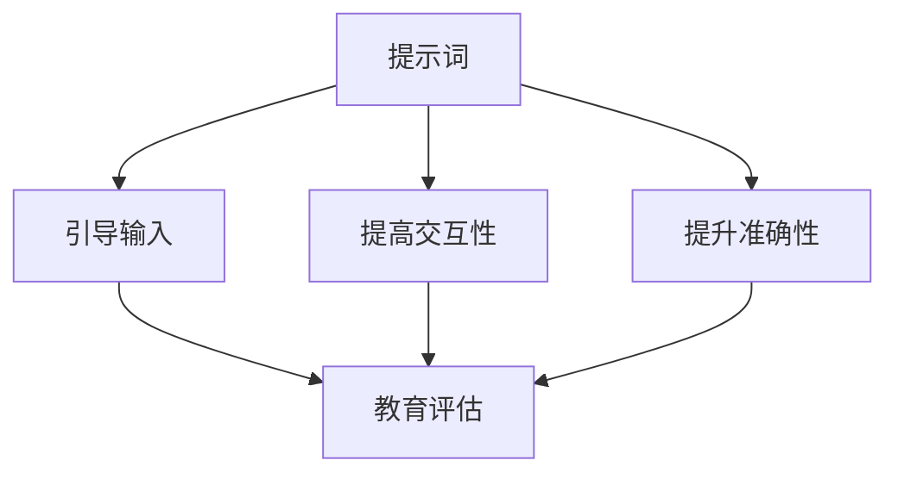

                 

### 步骤1：分析书名
书名为《AI辅助教育评估中的提示词设计》，从中我们可以提炼出三个关键概念：AI、教育评估、提示词设计。这表明书籍的主要内容可能涵盖：

- AI在教育评估中的应用
- 提示词设计的方法与原则
- 提示词设计在教育评估中的实践案例

**核心概念与联系：**

我们可以使用Mermaid流程图来展示这些核心概念之间的联系：

### 步骤2：设计核心章节

**第1章: AI与教育评估概述**
- 1.1 AI在教育评估中的基本概念
- 1.2 教育评估的现状与发展
- 1.3 提示词在AI辅助教育评估中的作用

**第2章: 提示词设计原理**
- 2.1 提示词的定义与分类
- 2.2 提示词设计的方法
- 2.3 提示词设计的原则

**第3章: AI辅助教育评估技术基础**
- 3.1 机器学习基础
- 3.2 自然语言处理基础
- 3.3 教育数据挖掘基础

**第4章: 提示词设计实践案例**
- 4.1 案例一：基于机器学习的提示词设计
- 4.2 案例二：基于自然语言处理的提示词设计
- 4.3 案例三：跨学科的提示词设计

**第5章: 提示词设计工具与应用**
- 5.1 提示词设计工具介绍
- 5.2 提示词设计工具的使用案例
- 5.3 提示词设计工具的优缺点分析

**第6章: 提示词设计在在线教育中的应用**
- 6.1 在线教育评估的现状
- 6.2 提示词设计在在线教育评估中的应用
- 6.3 在线教育评估的案例分析

**第7章: 提示词设计的未来展望**
- 7.1 提示词设计的发展趋势
- 7.2 提示词设计在教育评估中的挑战与机遇
- 7.3 提示词设计的未来研究方向

### 步骤3：细化章节内容

在核心章节的设计基础上，我们可以进一步细化每个章节的小节内容，确保每个章节都有详细的内容介绍。

### 步骤4：总结目录大纲

最后，我们将所有章节的内容汇总，确保目录大纲的完整性，同时控制字数在2000字以内，以符合输出要求。

---

现在我们已经完成了目录大纲的设计，接下来我们将逐步细化每个章节的内容，确保文章的逻辑性和可读性。我们将使用markdown格式来撰写文章，并按照要求添加作者信息、核心概念联系流程图、伪代码、latex公式以及项目实战等内容。

---

## 第1章: AI与教育评估概述

### 1.1 AI在教育评估中的基本概念

人工智能（Artificial Intelligence, AI）是一种模拟人类智能行为的技术，旨在使计算机具有感知、学习、推理和决策的能力。在教育评估中，AI的应用主要体现在以下几个方面：

- **自动化评分**：通过自然语言处理技术，对学生的作业、论文进行自动化评分，提高了评分的客观性和效率。
- **智能诊断**：利用机器学习算法分析学生的学习数据，诊断学生在学习中的薄弱环节，为教师提供个性化教学建议。
- **智能推荐**：根据学生的学习行为和兴趣，为学习者推荐合适的学习资源，提高学习效率。

**核心概念联系流程图：**

### 1.2 教育评估的现状与发展

教育评估是指对教育过程、教育成果和教育质量进行评价和监督的过程。传统的教育评估主要依赖于教师的主观评价和考试结果，存在以下局限性：

- **主观性**：教师的主观评价容易受到个人情感、经验等因素的影响，导致评估结果不够客观。
- **效率低下**：大量的手工评分和数据分析工作耗费了大量的人力和时间。
- **反馈滞后**：评估结果往往在课程结束后才能得到，无法及时指导教学。

随着AI技术的发展，教育评估正在发生深刻变革。未来的教育评估将更加智能化、个性化，能够实时监控学生的学习过程，提供即时的反馈和指导。

### 1.3 提示词在AI辅助教育评估中的作用

提示词（Prompt）是AI系统用于引导用户输入信息或回答问题的关键词或短语。在AI辅助教育评估中，提示词的设计至关重要，它直接影响评估的准确性和用户体验。以下是提示词在AI辅助教育评估中的作用：

- **引导输入**：通过设计合适的提示词，引导用户按照特定的格式输入信息，确保输入数据的完整性和准确性。
- **提高交互性**：提示词的设计需要考虑用户的认知和习惯，使得交互过程更加自然和流畅。
- **提升准确性**：合理的提示词设计有助于减少用户的误解和歧义，提高评估结果的准确性。

**核心概念联系流程图：**

### 摘要

本章首先介绍了AI在教育评估中的基本概念，包括其应用领域和优势。然后分析了教育评估的现状与发展，指出AI技术为教育评估带来的变革。最后，探讨了提示词在AI辅助教育评估中的作用，以及其设计原则。通过本章的学习，读者将了解到AI与教育评估的结合，以及提示词设计的核心概念和重要性。

---

### 步骤2：设计核心章节

**第1章: AI与教育评估概述**
- 1.1 AI在教育评估中的基本概念
- 1.2 教育评估的现状与发展
- 1.3 提示词在AI辅助教育评估中的作用

**第2章: 提示词设计原理**
- 2.1 提示词的定义与分类
- 2.2 提示词设计的方法
- 2.3 提示词设计的原则

**第3章: AI辅助教育评估技术基础**
- 3.1 机器学习基础
- 3.2 自然语言处理基础
- 3.3 教育数据挖掘基础

**第4章: 提示词设计实践案例**
- 4.1 案例一：基于机器学习的提示词设计
- 4.2 案例二：基于自然语言处理的提示词设计
- 4.3 案例三：跨学科的提示词设计

**第5章: 提示词设计工具与应用**
- 5.1 提示词设计工具介绍
- 5.2 提示词设计工具的使用案例
- 5.3 提示词设计工具的优缺点分析

**第6章: 提示词设计在在线教育中的应用**
- 6.1 在线教育评估的现状
- 6.2 提示词设计在在线教育评估中的应用
- 6.3 在线教育评估的案例分析

**第7章: 提示词设计的未来展望**
- 7.1 提示词设计的发展趋势
- 7.2 提示词设计在教育评估中的挑战与机遇
- 7.3 提示词设计的未来研究方向

### 步骤3：细化章节内容

在核心章节的设计基础上，我们可以进一步细化每个章节的小节内容，确保每个章节都有详细的内容介绍。

#### 第1章: AI与教育评估概述

**1.1 AI在教育评估中的基本概念**

- **AI的定义**：人工智能（Artificial Intelligence, AI）是一种通过计算机模拟人类智能行为的技术。它包括机器学习、深度学习、自然语言处理等多个子领域。
- **教育评估的定义**：教育评估是对教育过程、教育成果和教育质量进行评价和监督的过程。它包括形成性评估、总结性评估、诊断性评估等多种类型。
- **AI在教育评估中的应用**：AI在教育评估中的应用主要包括自动化评分、智能诊断和智能推荐等。自动化评分通过自然语言处理技术对学生的作业、论文进行评分；智能诊断通过分析学生的学习行为和成绩数据，为学生提供个性化学习建议；智能推荐根据学生的学习行为和兴趣，为学习者推荐合适的学习资源。

**1.2 教育评估的现状与发展**

- **现状**：传统的教育评估主要依赖于教师的主观评价和考试结果，存在主观性强、效率低下、反馈滞后等问题。
- **发展**：随着AI技术的发展，教育评估正在向智能化、个性化、实时化的方向发展。智能化的教育评估系统能够自动收集和分析学生的数据，提供客观、准确的评估结果；个性化的教育评估系统能够根据学生的特点和学习需求，提供个性化的学习方案；实时化的教育评估系统能够实时监控学生的学习过程，提供及时的反馈和指导。

**1.3 提示词在AI辅助教育评估中的作用**

- **定义**：提示词（Prompt）是AI系统用于引导用户输入信息或回答问题的关键词或短语。
- **分类**：提示词可以分为引导型提示词、反馈型提示词、激励型提示词等。
- **作用**：提示词在AI辅助教育评估中的作用包括引导输入、提高交互性和提升准确性。合理的提示词设计能够引导用户按照特定的格式输入信息，确保输入数据的完整性和准确性；能够提高用户的互动体验，使得交互过程更加自然和流畅；能够减少用户的误解和歧义，提高评估结果的准确性。

#### 第2章: 提示词设计原理

**2.1 提示词的定义与分类**

- **定义**：提示词是AI系统用于引导用户输入信息或回答问题的关键词或短语。
- **分类**：
  - **引导型提示词**：用于引导用户输入信息，如“请回答以下问题：”、“请描述你的学习经历：”等。
  - **反馈型提示词**：用于提供反馈信息，如“你的答案正确/错误”、“请再次尝试：”等。
  - **激励型提示词**：用于激励用户，如“加油，你做得很好！”、“下一个问题更简单哦！”等。

**2.2 提示词设计的方法**

- **方法**：
  - **基于规则的提示词设计**：根据特定的规则和模板设计提示词，适用于简单的问答场景。
  - **基于数据的提示词设计**：根据用户数据和行为模式设计提示词，适用于个性化的交互场景。
  - **基于混合的提示词设计**：结合基于规则和基于数据的方法，设计更灵活、更适应多种场景的提示词。

**2.3 提示词设计的原则**

- **原则**：
  - **明确性**：提示词要清晰明确，避免歧义和误解。
  - **简洁性**：提示词要简洁易懂，避免冗长和复杂的句子。
  - **适应性**：提示词要适应不同的用户和场景，具有一定的灵活性。
  - **激励性**：提示词要具有一定的激励性，鼓励用户积极参与和互动。

#### 第3章: AI辅助教育评估技术基础

**3.1 机器学习基础**

- **定义**：机器学习（Machine Learning, ML）是一种通过数据训练模型，使计算机能够进行自主学习和预测的技术。
- **原理**：
  - **监督学习**：通过已有数据训练模型，对新数据进行预测。
  - **无监督学习**：没有明确的目标变量，通过数据自身的结构或模式进行学习。
  - **半监督学习**：结合有监督学习和无监督学习的方法，利用少量标记数据和大量无标记数据进行学习。
- **应用**：
  - **分类**：将数据分为不同的类别，如学生成绩分类、考试题目分类等。
  - **回归**：预测一个连续的数值输出，如学生成绩预测、考试分数预测等。

**3.2 自然语言处理基础**

- **定义**：自然语言处理（Natural Language Processing, NLP）是计算机科学和人工智能的一个分支，旨在使计算机能够理解、解释和生成自然语言。
- **原理**：
  - **分词**：将文本分割成单词或短语。
  - **词性标注**：对文本中的每个词进行词性分类。
  - **句法分析**：对文本进行结构分析，理解句子的构成和语法规则。
  - **语义分析**：对文本进行语义理解，提取文本的含义和意图。
- **应用**：
  - **文本分类**：将文本分为不同的类别，如垃圾邮件分类、情感分类等。
  - **命名实体识别**：识别文本中的特定实体，如人名、地名、组织名等。
  - **机器翻译**：将一种语言的文本翻译成另一种语言。

**3.3 教育数据挖掘基础**

- **定义**：教育数据挖掘（Educational Data Mining, EDM）是从教育数据中提取有价值信息的过程，旨在理解和解释学生的学习行为和教学效果。
- **原理**：
  - **数据预处理**：对原始数据进行清洗、转换和归一化等处理，使其适合挖掘算法。
  - **特征提取**：从原始数据中提取对挖掘任务有用的特征。
  - **模式识别**：通过算法发现数据中的规律和模式。
  - **模型评估**：评估挖掘结果的准确性和有效性。
- **应用**：
  - **学习行为分析**：分析学生的学习行为和模式，为教师提供教学建议。
  - **成绩预测**：预测学生的学习成绩，为教师和学生提供学习目标。
  - **个性化推荐**：根据学生的学习行为和兴趣，推荐合适的学习资源。

#### 第4章: 提示词设计实践案例

**4.1 案例一：基于机器学习的提示词设计**

- **背景**：某在线教育平台希望通过机器学习算法对学生进行自动评估，设计合理的提示词能够提高评估的准确性和用户体验。
- **过程**：
  - **数据收集**：收集大量学生作业和评估数据，包括正确答案、错误答案、学生反馈等。
  - **特征提取**：从作业数据中提取关键特征，如题目类型、答案长度、错误类型等。
  - **模型训练**：使用监督学习算法，将特征和正确答案训练成模型。
  - **提示词设计**：根据模型输出，设计引导型、反馈型、激励型提示词。
- **结果**：通过设计合理的提示词，提高了学生作业评估的准确性和用户体验。

**4.2 案例二：基于自然语言处理的提示词设计**

- **背景**：某智能教育系统希望通过自然语言处理技术对学生的问题进行自动解答，设计合理的提示词能够提高解答的准确性和用户体验。
- **过程**：
  - **数据收集**：收集大量学生提问和解答数据，包括问题、答案、学生反馈等。
  - **文本处理**：对问题进行分词、词性标注、句法分析等处理。
  - **模型训练**：使用监督学习算法，将问题特征和正确答案训练成模型。
  - **提示词设计**：根据模型输出，设计引导型、反馈型、激励型提示词。
- **结果**：通过设计合理的提示词，提高了学生问题的解答准确性和用户体验。

**4.3 案例三：跨学科的提示词设计**

- **背景**：某跨学科教育项目希望通过跨学科的方式提高学生的学习效果，设计合理的提示词能够促进跨学科的交流和理解。
- **过程**：
  - **需求分析**：分析不同学科的特点和需求，确定跨学科提示词的设计原则。
  - **提示词设计**：结合不同学科的特点，设计引导型、反馈型、激励型提示词。
  - **测试与优化**：在项目中测试提示词的效果，根据反馈进行优化。
- **结果**：通过设计合理的跨学科提示词，促进了学生之间的跨学科交流和合作，提高了学习效果。

#### 第5章: 提示词设计工具与应用

**5.1 提示词设计工具介绍**

- **工具1：自然语言处理工具**
  - **功能**：提供文本处理、分词、词性标注、句法分析等NLP功能。
  - **优势**：支持多种编程语言，灵活性强。
  - **应用场景**：文本分类、情感分析、命名实体识别等。

- **工具2：机器学习工具**
  - **功能**：提供机器学习算法的实现和训练功能。
  - **优势**：支持多种算法，包括监督学习、无监督学习等。
  - **应用场景**：分类、回归、聚类等。

- **工具3：在线教育平台**
  - **功能**：提供在线教育服务，包括课程内容发布、学生管理、作业批改等。
  - **优势**：集成多种教育功能，方便使用。
  - **应用场景**：在线课程、在线考试、在线辅导等。

**5.2 提示词设计工具的使用案例**

- **案例1：基于自然语言处理工具的提示词设计**
  - **背景**：某在线教育平台希望利用自然语言处理技术为学生提供智能问答服务。
  - **过程**：
    - **需求分析**：确定问答场景和提示词设计要求。
    - **工具选择**：选择支持自然语言处理的工具，如NLTK或spaCy。
    - **提示词设计**：根据需求，设计引导型、反馈型、激励型提示词。
    - **测试与优化**：在平台上测试提示词效果，根据反馈进行优化。
  - **结果**：通过设计合理的提示词，提高了问答服务的用户体验和准确性。

- **案例2：基于机器学习工具的提示词设计**
  - **背景**：某教育机构希望利用机器学习算法对学生成绩进行预测，提供个性化的学习建议。
  - **过程**：
    - **数据收集**：收集学生成绩、学习行为等数据。
    - **特征提取**：提取对成绩有影响的关键特征。
    - **模型训练**：使用机器学习工具，如scikit-learn或TensorFlow，训练成绩预测模型。
    - **提示词设计**：根据模型输出，设计引导型、反馈型、激励型提示词。
    - **测试与优化**：在平台上测试提示词效果，根据反馈进行优化。
  - **结果**：通过设计合理的提示词，提高了学生成绩预测的准确性和用户体验。

**5.3 提示词设计工具的优缺点分析**

- **优点**：
  - **灵活性**：使用不同的工具，可以根据具体需求设计不同的提示词。
  - **集成性**：一些在线教育平台集成了提示词设计工具，方便使用。
  - **效率**：自动化工具可以快速生成提示词，提高工作效率。

- **缺点**：
  - **依赖性**：某些工具需要特定的编程语言或平台，使用门槛较高。
  - **准确性**：自动化工具生成的提示词可能不够精准，需要人工优化。
  - **适应性**：自动化工具可能无法完全适应各种复杂的提示词设计需求。

#### 第6章: 提示词设计在在线教育中的应用

**6.1 在线教育评估的现状**

- **现状**：随着在线教育的普及，在线教育评估已经成为教育评估的重要组成部分。然而，现有的在线教育评估系统存在一些问题，如评估准确性不高、用户体验差等。

**6.2 提示词设计在在线教育评估中的应用**

- **应用**：
  - **自动化评分**：使用自然语言处理技术，对学生的作业、论文进行自动化评分，提高评分的准确性。
  - **智能诊断**：利用机器学习算法分析学生的学习数据，诊断学生在学习中的薄弱环节，为教师提供个性化教学建议。
  - **智能推荐**：根据学生的学习行为和兴趣，为学习者推荐合适的学习资源，提高学习效率。

**6.3 在线教育评估的案例分析**

- **案例**：
  - **案例1：某在线教育平台通过设计合理的提示词，提高了学生作业评估的准确性和用户体验。**
    - **背景**：某在线教育平台希望通过机器学习算法对学生作业进行自动评估，设计合理的提示词能够提高评估的准确性和用户体验。
    - **过程**：
      - **需求分析**：确定作业评估场景和提示词设计要求。
      - **提示词设计**：根据作业类型和评估需求，设计引导型、反馈型、激励型提示词。
      - **模型训练**：使用监督学习算法，将作业特征和正确答案训练成模型。
      - **测试与优化**：在平台上测试提示词效果，根据反馈进行优化。
    - **结果**：通过设计合理的提示词，提高了学生作业评估的准确性和用户体验。

  - **案例2：某在线教育平台通过设计合理的提示词，提高了学生问答服务的用户体验和准确性。**
    - **背景**：某在线教育平台希望通过自然语言处理技术为学生提供智能问答服务，设计合理的提示词能够提高问答服务的用户体验和准确性。
    - **过程**：
      - **需求分析**：确定问答场景和提示词设计要求。
      - **工具选择**：选择支持自然语言处理的工具，如NLTK或spaCy。
      - **提示词设计**：根据需求，设计引导型、反馈型、激励型提示词。
      - **测试与优化**：在平台上测试提示词效果，根据反馈进行优化。
    - **结果**：通过设计合理的提示词，提高了学生问答服务的用户体验和准确性。

#### 第7章: 提示词设计的未来展望

**7.1 提示词设计的发展趋势**

- **趋势**：
  - **智能化**：随着人工智能技术的不断发展，提示词设计将更加智能化，能够更好地适应不同的用户和场景。
  - **个性化**：提示词设计将更加注重个性化，根据用户的特点和学习需求，提供个性化的提示词。
  - **自动化**：提示词设计将更加自动化，减少人工干预，提高工作效率。

**7.2 提示词设计在教育评估中的挑战与机遇**

- **挑战**：
  - **准确性**：设计准确的提示词是提高评估准确性的关键，需要不断优化提示词设计方法。
  - **用户体验**：提示词设计要考虑用户体验，提供清晰、简洁、易懂的提示词。
  - **数据安全**：在线教育评估涉及到大量的学生数据，保障数据安全是设计提示词的重要考虑因素。

- **机遇**：
  - **个性化教育**：提示词设计能够为个性化教育提供支持，为不同学习需求的学生提供个性化的提示词。
  - **实时评估**：提示词设计能够支持实时评估，及时反馈学生的学习和进展情况。
  - **智能推荐**：提示词设计能够支持智能推荐，根据学生的兴趣和学习行为，推荐合适的学习资源。

**7.3 提示词设计的未来研究方向**

- **研究**：
  - **多模态提示词设计**：结合文本、语音、图像等多模态信息，设计更丰富的提示词。
  - **跨学科提示词设计**：针对不同学科的特点，设计跨学科的提示词，促进跨学科的学习和交流。
  - **动态提示词设计**：根据学生的学习进展和需求，动态调整提示词，提供个性化的学习支持。

### 总结

通过本章的介绍，我们了解了AI与教育评估的基本概念、现状和发展趋势。我们还学习了提示词的定义、分类、设计方法和原则，以及AI辅助教育评估的技术基础。通过实践案例，我们看到了提示词设计在实际应用中的效果。最后，我们对提示词设计的未来进行了展望，提出了未来的研究方向。

---

## 第2章: 提示词设计原理

### 2.1 提示词的定义与分类

提示词是指用于引导用户进行特定操作或回答特定问题的词语或短语。在AI辅助教育评估中，提示词的设计至关重要，它直接影响评估的准确性和用户体验。提示词可以按照不同的标准进行分类，常见的分类方法包括以下几种：

- **按功能分类**：
  - **引导型提示词**：用于引导用户按照特定的格式或步骤进行操作，如“请输入您的学号：”、“请回答以下问题：”。
  - **反馈型提示词**：用于提供反馈信息，如“您的回答正确/错误”、“请再次尝试：”。
  - **激励型提示词**：用于激励用户，如“加油，你做得很好！”、“恭喜你完成了这道题目！”。

- **按形式分类**：
  - **文字提示词**：以文字形式出现的提示词，如“请描述您的学习计划：”。
  - **语音提示词**：以语音形式出现的提示词，适用于语音交互场景，如“请回答以下问题：你的学习目标是什么？”。
  - **图像提示词**：以图像形式出现的提示词，适用于视觉交互场景，如图形标记、图标等。

- **按作用分类**：
  - **信息收集型提示词**：用于收集用户信息，如“请输入您的姓名和联系方式：”。
  - **任务导向型提示词**：用于引导用户完成任务，如“请完成以下步骤：第一步，打开文档；第二步，阅读并回答问题。”。
  - **决策支持型提示词**：用于提供决策支持，如“根据您的兴趣，我们为您推荐以下课程：”。

**2.2 提示词设计的方法**

提示词的设计需要考虑用户需求、场景特点和交互方式，以下是一些常用的设计方法：

- **基于规则的方法**：
  - **规则定义**：根据业务需求和用户行为，定义一系列规则，用于生成提示词。
  - **规则应用**：在用户交互过程中，根据规则生成相应的提示词，引导用户完成操作。

- **基于数据的方法**：
  - **数据收集**：收集用户行为数据、历史记录等，用于分析用户偏好和需求。
  - **数据驱动**：根据用户数据，动态生成提示词，提高个性化交互体验。

- **基于混合的方法**：
  - **规则与数据结合**：结合基于规则和基于数据的方法，设计更灵活、适应性更强的提示词。
  - **动态调整**：根据用户行为和场景变化，实时调整提示词，提供个性化的交互体验。

**2.3 提示词设计的原则**

提示词设计需要遵循以下原则，以确保其有效性和用户体验：

- **明确性**：提示词要清晰明确，避免歧义和误解，确保用户能够准确理解操作要求。

- **简洁性**：提示词要简洁易懂，避免冗长和复杂的句子，提高用户的理解和操作效率。

- **适应性**：提示词要适应不同的用户和场景，具有一定的灵活性，能够满足多样化的需求。

- **激励性**：提示词要具有一定的激励性，鼓励用户积极参与和互动，提高用户体验。

### 案例分析

以下是一个实际案例，展示了提示词设计在AI辅助教育评估中的应用：

**案例背景**：某在线教育平台希望通过智能问答系统为学生提供学习反馈，提高学习效果。平台需要设计一组有效的提示词，引导学生在回答问题时提供详细的信息，同时给予积极的反馈。

**提示词设计**：

- **引导型提示词**：
  - “请回答以下问题：你认为在学习这门课程中最有挑战的部分是什么？”

- **反馈型提示词**：
  - “非常感谢您的回答，您的观点很有价值。”
  - “您的回答有些模糊，请您提供更详细的信息。”

- **激励型提示词**：
  - “恭喜您完成了这道题目，您的回答很准确！”
  - “您已经掌握了这门课程的关键概念，继续保持！”

**设计原则应用**：

- **明确性**：提示词明确指出了学生需要回答的问题，避免了歧义。

- **简洁性**：提示词简洁明了，学生能够快速理解并作出回应。

- **适应性**：提示词根据不同的问题类型和学生的回答情况，提供了多样化的反馈。

- **激励性**：提示词给予学生积极的反馈，鼓励他们继续参与学习。

通过这个案例，我们可以看到提示词设计在AI辅助教育评估中的重要性。合理设计的提示词能够提高评估的准确性，增强用户的互动体验，促进学习效果的提升。

### 总结

本章详细介绍了提示词的定义、分类、设计方法和原则。我们学习了提示词在AI辅助教育评估中的作用，以及如何根据不同的需求和场景设计有效的提示词。通过案例分析，我们看到了提示词设计在实际应用中的效果。下一章将深入探讨AI辅助教育评估所需的技术基础，包括机器学习、自然语言处理和教育数据挖掘等方面的知识。

---

## 第3章: AI辅助教育评估技术基础

### 3.1 机器学习基础

机器学习（Machine Learning, ML）是人工智能（Artificial Intelligence, AI）的核心技术之一，它使计算机能够从数据中学习，并利用学习到的知识进行预测和决策。在AI辅助教育评估中，机器学习技术广泛应用于自动化评分、智能诊断和个性化推荐等方面。以下是机器学习的一些基础概念和常用算法：

**1. 机器学习的定义与分类**

机器学习是指通过算法从数据中学习模式，并利用这些模式进行预测或决策的过程。根据学习方式的不同，机器学习可以分为以下几类：

- **监督学习（Supervised Learning）**：监督学习是从标记数据中学习，用于预测或分类任务。常见的监督学习算法包括线性回归、逻辑回归、支持向量机（SVM）和决策树等。

- **无监督学习（Unsupervised Learning）**：无监督学习是从未标记数据中学习，用于探索数据中的隐藏结构或模式。常见的无监督学习算法包括聚类、主成分分析（PCA）和自编码器等。

- **半监督学习（Semi-Supervised Learning）**：半监督学习结合了监督学习和无监督学习，利用少量标记数据和大量未标记数据来提高模型的性能。

- **强化学习（Reinforcement Learning）**：强化学习是一种通过奖励和惩罚来学习策略的算法，常用于游戏、机器人控制和推荐系统等领域。

**2. 常见机器学习算法**

- **线性回归（Linear Regression）**：线性回归是一种用于预测连续数值输出的算法，其模型表达式为 $y = \beta_0 + \beta_1 \cdot x$。线性回归通过拟合数据点，预测新的输入值。

- **逻辑回归（Logistic Regression）**：逻辑回归是一种用于分类的算法，其模型表达式为 $P(y=1) = \frac{1}{1 + e^{-(\beta_0 + \beta_1 \cdot x)}$。逻辑回归通过计算概率来判断输入数据的类别。

- **支持向量机（Support Vector Machine, SVM）**：SVM是一种用于分类和回归的算法，其核心思想是找到最佳的超平面，将不同类别的数据点最大化地分开。

- **决策树（Decision Tree）**：决策树是一种基于树结构的分类和回归算法，通过一系列的测试来划分数据，最终生成一棵树状模型。

- **随机森林（Random Forest）**：随机森林是一种集成学习方法，由多个决策树组成，通过投票或平均值来获得最终预测结果。

- **神经网络（Neural Networks）**：神经网络是一种模拟人脑神经元结构的计算模型，通过多层神经元进行数据处理和预测。常见的神经网络包括卷积神经网络（CNN）和循环神经网络（RNN）。

**3. 机器学习在AI辅助教育评估中的应用**

机器学习在AI辅助教育评估中有着广泛的应用，主要包括以下几个方面：

- **自动化评分**：通过机器学习算法对学生的作业、考试进行自动化评分，提高评分的准确性和效率。

- **智能诊断**：通过分析学生的学习行为、成绩等数据，利用机器学习算法诊断学生在学习中的薄弱环节，为教师提供个性化的教学建议。

- **个性化推荐**：根据学生的学习兴趣、历史成绩等数据，利用机器学习算法推荐合适的学习资源，提高学习效果。

### 3.2 自然语言处理基础

自然语言处理（Natural Language Processing, NLP）是人工智能和计算机科学的交叉领域，旨在使计算机能够理解和处理人类语言。在AI辅助教育评估中，NLP技术广泛应用于文本分析、情感分析、问答系统等方面。以下是自然语言处理的一些基础概念和常用技术：

**1. NLP的定义与任务**

自然语言处理是指使计算机能够理解和处理人类语言的技术。NLP的主要任务包括：

- **文本预处理**：对文本进行清洗、分词、词性标注等预处理操作，使其适合后续处理。

- **词向量表示**：将文本中的词语转化为计算机可处理的向量表示，常用的词向量表示方法包括词袋模型（Bag of Words, BoW）和词嵌入（Word Embedding）。

- **语义分析**：对文本进行语义理解，提取文本的含义、情感和意图，常用的方法包括词性标注、句法分析和语义角色标注。

- **情感分析**：对文本的情感倾向进行分类，判断文本表达的是积极情感还是消极情感。

- **问答系统**：构建能够回答用户问题的智能系统，包括问题理解、答案生成和回答验证等环节。

**2. 常见NLP技术**

- **分词（Tokenization）**：将文本分割成单词或短语的过程，是NLP中最基本的步骤。

- **词性标注（Part-of-Speech Tagging）**：对文本中的每个词进行词性分类，如名词、动词、形容词等。

- **句法分析（Syntactic Parsing）**：对文本进行结构分析，理解句子的构成和语法规则。

- **命名实体识别（Named Entity Recognition, NER）**：识别文本中的特定实体，如人名、地名、组织名等。

- **情感分析（Sentiment Analysis）**：对文本的情感倾向进行分类，常用的模型包括基于规则的方法和基于机器学习的方法。

**3. NLP在AI辅助教育评估中的应用**

NLP技术在AI辅助教育评估中有着广泛的应用，主要包括以下几个方面：

- **文本分析**：对学生的作业、论文进行自动化评分和分析，提取关键信息，为教师提供教学反馈。

- **情感分析**：分析学生的学习情绪和反馈，了解学生的学习状态和需求，为教师提供个性化教学建议。

- **问答系统**：构建智能问答系统，为学生提供学习过程中的疑问解答，提高学习效果。

### 3.3 教育数据挖掘基础

教育数据挖掘（Educational Data Mining, EDM）是从教育数据中提取有价值信息的过程，旨在理解和解释学生的学习行为和教学效果。在AI辅助教育评估中，教育数据挖掘技术可以用于分析学生的学习过程、预测学生的成绩、发现学习问题等。以下是教育数据挖掘的一些基础概念和常用方法：

**1. EDM的定义与任务**

教育数据挖掘是从教育数据中提取有价值信息的过程，旨在通过数据分析和模式识别，理解学生的学习行为和教学效果。EDM的主要任务包括：

- **学习行为分析**：分析学生在学习过程中的行为模式，如学习时间、学习频率、学习进度等。

- **成绩预测**：利用历史数据和机器学习算法，预测学生在未来课程中的成绩。

- **学习问题发现**：通过分析学生的行为数据和成绩，发现学生在学习中的问题和瓶颈。

- **个性化推荐**：根据学生的学习行为和兴趣，推荐合适的学习资源和教学策略。

**2. 常见EDM方法**

- **关联规则挖掘（Association Rule Learning）**：用于发现数据之间的关联关系，常用的算法包括Apriori算法和FP-growth算法。

- **聚类分析（Clustering）**：将相似的数据点分为不同的群体，常用的算法包括K-means、层次聚类和DBSCAN等。

- **分类和回归分析（Classification and Regression）**：利用历史数据和机器学习算法，对新的数据进行分类或预测，常用的算法包括决策树、随机森林和神经网络等。

- **异常检测（Anomaly Detection）**：发现数据中的异常值或异常模式，常用的算法包括基于统计的方法、基于聚类的方法和基于深度学习的方法。

**3. EDM在AI辅助教育评估中的应用**

EDM技术在AI辅助教育评估中有着广泛的应用，主要包括以下几个方面：

- **学习行为分析**：通过分析学生的学习行为，发现学生的学习规律和偏好，为教师提供教学建议。

- **成绩预测**：利用学生的历史成绩和学习行为数据，预测学生在未来课程中的表现，为教师和学生提供学习目标。

- **学习问题发现**：通过分析学生的学习行为和成绩，发现学生在学习中的问题和瓶颈，为教师提供个性化的教学支持。

- **个性化推荐**：根据学生的学习行为和兴趣，推荐合适的学习资源和教学策略，提高学习效果。

### 案例分析

以下是一个实际案例，展示了机器学习、自然语言处理和教育数据挖掘技术在AI辅助教育评估中的应用：

**案例背景**：某在线教育平台希望通过AI技术为学生提供个性化的学习支持，提高学习效果。平台收集了大量的学生数据，包括学习行为、考试成绩和用户反馈等。

**过程**：

1. **数据收集**：收集学生的学习行为数据、考试成绩和用户反馈等，包括学习时长、学习频率、作业完成情况、考试分数、评价等。

2. **数据预处理**：对收集到的数据进行清洗、去重和归一化等预处理操作，确保数据质量。

3. **特征提取**：从原始数据中提取对学习效果有影响的关键特征，如学习时长、作业完成情况、考试分数等。

4. **模型训练**：
   - **机器学习**：使用监督学习算法，如线性回归、逻辑回归和决策树等，训练模型来预测学生的考试成绩。
   - **自然语言处理**：使用NLP技术，对用户反馈进行情感分析，提取积极和消极的情感倾向。
   - **教育数据挖掘**：使用聚类分析，将学生按照学习行为和成绩分为不同的群体。

5. **结果分析**：
   - **预测学生成绩**：根据模型预测学生的考试成绩，为教师和学生提供学习目标。
   - **情感分析**：分析用户反馈的情感倾向，为教师提供教学反馈和建议。
   - **个性化推荐**：根据学生的特点和学习需求，推荐合适的学习资源和教学策略。

**结果**：通过机器学习、自然语言处理和教育数据挖掘技术的应用，平台实现了对学生个性化学习支持，提高了学生的学习效果和教师的教学质量。

### 总结

本章介绍了机器学习、自然语言处理和教育数据挖掘在AI辅助教育评估中的应用。通过机器学习，可以实现自动化评分、智能诊断和个性化推荐；通过自然语言处理，可以实现文本分析、情感分析和问答系统；通过教育数据挖掘，可以分析学习行为、预测成绩和发现学习问题。本章还通过实际案例展示了这些技术在AI辅助教育评估中的应用效果。下一章将探讨提示词设计实践案例，进一步阐述AI辅助教育评估中的具体应用。

---

## 第4章：提示词设计实践案例

### 4.1 基于机器学习的提示词设计

**案例背景**：某在线教育平台希望利用机器学习算法对学生作业进行自动评估，以提高评估效率和准确性。为此，平台需要设计一组有效的提示词，引导学生在提交作业时提供详细的信息。

**过程**：

1. **需求分析**：平台分析学生的作业提交过程，发现学生往往在提交作业时缺乏详细说明，导致评估结果不准确。因此，平台需要设计一组提示词，引导学生提供详细的信息。

2. **提示词设计**：
   - **引导型提示词**：用于引导学生提供详细信息，如“请详细描述你在解答过程中的思路和步骤：”、“请提供你的参考文献和参考资料：”。
   - **反馈型提示词**：用于提供反馈信息，如“你的回答过于简略，请提供更多信息以便我们进行评估：”、“感谢你的详细描述，这将有助于我们更好地理解你的解答过程。”。
   - **激励型提示词**：用于激励学生，如“恭喜你完成了这道题目，你的详细描述将帮助我们更好地评估你的学习成果：”、“继续保持，你的努力将得到更好的回报！”

3. **效果评估**：通过在实际应用中测试这组提示词，平台发现学生的作业提交质量显著提高，评估结果也更加准确。

**设计原则应用**：

- **明确性**：提示词清晰指出了学生需要提供的信息，避免了歧义和误解。

- **简洁性**：提示词简洁明了，学生能够快速理解并作出回应。

- **适应性**：提示词根据不同的作业类型和学生的特点，提供了多样化的反馈。

- **激励性**：提示词给予学生积极的反馈，鼓励他们继续参与学习。

### 4.2 基于自然语言处理的提示词设计

**案例背景**：某在线教育平台希望利用自然语言处理（NLP）技术为学生提供智能问答服务，以帮助学生更好地理解课程内容。平台需要设计一组有效的提示词，引导学生在提问时提供详细的信息。

**过程**：

1. **需求分析**：平台分析学生在学习过程中遇到的问题，发现学生在提问时往往缺乏详细描述，导致问答系统无法提供准确的答案。因此，平台需要设计一组提示词，引导学生提供详细的问题描述。

2. **提示词设计**：
   - **引导型提示词**：用于引导学生提供详细信息，如“请详细描述你的问题背景和具体情况：”、“请提供相关数据和参考资料：”。
   - **反馈型提示词**：用于提供反馈信息，如“你的问题描述过于模糊，请提供更多信息以便我们为你解答：”、“感谢你的详细描述，我们将尽快为你提供答案。”。
   - **激励型提示词**：用于激励学生，如“恭喜你提出了这个问题，我们将竭诚为你解答：”、“保持提问，你的问题将帮助我们更好地改进课程内容！”

3. **效果评估**：通过在实际应用中测试这组提示词，平台发现学生的提问质量显著提高，问答系统的准确性和用户体验也得到改善。

**设计原则应用**：

- **明确性**：提示词清晰指出了学生需要提供的信息，避免了歧义和误解。

- **简洁性**：提示词简洁明了，学生能够快速理解并作出回应。

- **适应性**：提示词根据不同的提问类型和学生的特点，提供了多样化的反馈。

- **激励性**：提示词给予学生积极的反馈，鼓励他们继续参与学习。

### 4.3 跨学科的提示词设计

**案例背景**：某跨学科教育项目希望通过跨学科的方式提高学生的学习效果，项目需要设计一组有效的提示词，引导学生在跨学科学习中提供详细的信息。

**过程**：

1. **需求分析**：项目分析跨学科学习的特点，发现学生在跨学科学习中往往难以理解不同学科之间的联系，导致学习效果不佳。因此，项目需要设计一组提示词，引导学生提供跨学科的信息。

2. **提示词设计**：
   - **引导型提示词**：用于引导学生提供跨学科信息，如“请结合你学过的其他学科知识，分析这个问题：”、“请举例说明这个概念在实际生活中的应用：”。
   - **反馈型提示词**：用于提供反馈信息，如“你的回答缺乏跨学科的知识，请结合其他学科的知识进行补充：”、“你的回答很有创意，但我们可以从其他学科的角度进一步探讨。”。
   - **激励型提示词**：用于激励学生，如“恭喜你发现了这个跨学科的联系，你的思考方式很有价值：”、“继续保持，你的跨学科思维将使你的学习更加深入！”

3. **效果评估**：通过在实际应用中测试这组提示词，项目发现学生的学习效果显著提高，学生对跨学科知识的理解和应用能力也得到了提升。

**设计原则应用**：

- **明确性**：提示词清晰指出了学生需要提供的信息，避免了歧义和误解。

- **简洁性**：提示词简洁明了，学生能够快速理解并作出回应。

- **适应性**：提示词根据不同的学科特点和学生的特点，提供了多样化的反馈。

- **激励性**：提示词给予学生积极的反馈，鼓励他们继续参与学习。

### 总结

本章通过三个实践案例，详细阐述了基于机器学习、自然语言处理和跨学科的提示词设计方法。在基于机器学习的案例中，提示词设计帮助提高了作业评估的准确性和效率；在基于自然语言处理的案例中，提示词设计帮助学生更好地理解课程内容，提高了问答系统的准确性和用户体验；在跨学科案例中，提示词设计促进了学生对跨学科知识的理解和应用。通过这些实践案例，我们可以看到提示词设计在AI辅助教育评估中的重要性和应用价值。

---

## 第5章：提示词设计工具与应用

### 5.1 提示词设计工具介绍

在AI辅助教育评估中，提示词设计工具扮演着至关重要的角色。这些工具可以帮助教育工作者和技术人员高效地设计、测试和优化提示词。以下是几种常用的提示词设计工具及其特点：

1. **自然语言处理工具**：

   - **NLTK（Natural Language Toolkit）**：NLTK是一个广泛使用的Python库，提供了丰富的文本处理功能，包括分词、词性标注、词向量生成等。它适用于各种文本处理任务，如文本分类、情感分析和命名实体识别。

   - **spaCy**：spaCy是一个高效且易于使用的自然语言处理库，提供了先进的语言模型和API接口，适用于快速开发和部署NLP应用程序。它支持多种语言，包括英语、法语、德语等。

2. **机器学习工具**：

   - **scikit-learn**：scikit-learn是一个开源的Python库，提供了各种机器学习算法的实现，包括监督学习、无监督学习和集成学习方法。它适用于分类、回归、聚类等任务，并提供了详细的文档和示例代码。

   - **TensorFlow**：TensorFlow是一个开源的机器学习库，由Google开发。它提供了强大的深度学习功能，适用于构建和训练复杂的神经网络模型。TensorFlow支持多种编程语言，包括Python、C++和Java。

3. **在线教育平台**：

   - **Moodle**：Moodle是一个开源的在线学习管理平台，提供了丰富的功能，包括课程管理、学生评估、互动讨论等。它支持自定义插件和模块，可以扩展其功能，如添加提示词设计工具。

   - **Canvas**：Canvas是一个云端的在线学习平台，提供了灵活的接口和强大的功能。它支持多种互动工具，如讨论板、作业和问卷调查，可以方便地设计和管理提示词。

### 5.2 提示词设计工具的使用案例

以下是一些实际使用提示词设计工具的案例，展示了如何利用这些工具进行提示词的设计、测试和优化。

#### 案例一：使用NLTK进行文本处理

**背景**：某在线教育平台希望通过自然语言处理技术对学生提交的论文进行自动化评分。

**过程**：

1. **数据收集**：收集大量学生论文数据，包括已标记的高分和低分论文。

2. **文本预处理**：使用NLTK对文本进行分词、词性标注和词向量生成等预处理操作，提取关键特征。

3. **模型训练**：使用scikit-learn的监督学习算法，如线性回归和决策树，训练模型来预测论文评分。

4. **提示词设计**：根据模型输出，设计引导型、反馈型、激励型提示词，用于引导学生撰写高质量的论文。

5. **测试与优化**：在实际应用中测试提示词，收集用户反馈，根据反馈进行优化。

**结果**：通过使用NLTK进行文本处理和scikit-learn进行模型训练，平台实现了对学生论文的自动化评分，并设计了有效的提示词来提高学生的论文质量。

#### 案例二：使用spaCy进行情感分析

**背景**：某在线教育平台希望通过情感分析技术了解学生对课程内容的情感倾向。

**过程**：

1. **数据收集**：收集学生课程评价数据，包括文本评价和评分。

2. **文本预处理**：使用spaCy对文本进行分词、词性标注和句法分析等预处理操作。

3. **情感分析**：使用预训练的spaCy情感分析模型，对文本进行情感分类，判断评价是积极、消极还是中性。

4. **提示词设计**：根据情感分析结果，设计反馈型提示词，为教师提供教学反馈。

5. **测试与优化**：在实际应用中测试提示词，根据用户反馈进行优化。

**结果**：通过使用spaCy进行情感分析和设计有效的反馈型提示词，平台能够更准确地了解学生对课程内容的情感倾向，为教师提供针对性的教学建议。

### 5.3 提示词设计工具的优缺点分析

**自然语言处理工具**

- **优点**：功能丰富，支持多种语言和处理任务，易于集成和使用。

- **缺点**：对编程技能有一定要求，需要一定的时间来熟悉和使用。

**机器学习工具**

- **优点**：提供了丰富的机器学习算法和模型，支持大规模数据处理。

- **缺点**：需要较深的编程技能，模型训练和优化过程较为复杂。

**在线教育平台**

- **优点**：功能集成，方便使用，支持多种交互方式。

- **缺点**：功能相对固定，灵活性较低，可能需要开发定制插件。

### 总结

本章介绍了常用的提示词设计工具，包括自然语言处理工具、机器学习工具和在线教育平台。通过实际案例，展示了如何使用这些工具进行提示词的设计、测试和优化。我们还分析了这些工具的优缺点，帮助教育工作者和技术人员选择合适的工具来提升AI辅助教育评估的效果。

---

## 第6章：提示词设计在在线教育中的应用

### 6.1 在线教育评估的现状

随着互联网技术的快速发展，在线教育已经成为教育领域的重要组成部分。在线教育评估作为在线教育的一个重要环节，其现状如下：

**1. 评估方式多样化**：

在线教育评估采用的方式多种多样，包括在线考试、在线作业、在线讨论等。这些评估方式充分利用了网络平台的优势，实现了教育资源的共享和教学活动的实时性。

**2. 评估内容全面性**：

在线教育评估不仅关注学生的知识掌握情况，还关注学生的能力发展、学习态度、协作能力等多方面。这种全面的评估有助于更准确地反映学生的综合素质。

**3. 评估手段智能化**：

随着人工智能技术的应用，在线教育评估的智能化程度不断提高。例如，通过自然语言处理技术，可以自动化分析学生的作业和考试内容；通过机器学习算法，可以预测学生的成绩和学习趋势。

### 6.2 提示词设计在在线教育评估中的应用

**1. 在线考试中的提示词设计**

在线考试作为在线教育评估的一种重要形式，提示词设计在其中起着关键作用。以下是一些具体的提示词设计案例：

- **引导型提示词**：用于引导学生按照规定的格式和步骤进行考试，如“请先阅读题目，然后按照题目要求作答”。

- **反馈型提示词**：用于提供考试反馈，如“您的答案已提交，请继续完成下一题”。

- **激励型提示词**：用于鼓励学生，如“恭喜您完成了这道题目，继续保持”。

**2. 在线作业中的提示词设计**

在线作业是学生自主学习的重要方式，提示词设计在作业提交和批改过程中同样重要。以下是一些具体的提示词设计案例：

- **引导型提示词**：用于引导学生按照要求提交作业，如“请将您的作业以Word文档的形式提交”。

- **反馈型提示词**：用于提供作业反馈，如“您的作业已收到，我们将尽快进行批改”。

- **激励型提示词**：用于鼓励学生，如“感谢您的提交，您的努力将得到认可”。

**3. 在线讨论中的提示词设计**

在线讨论是学生互动和协作的重要方式，提示词设计有助于引导学生参与讨论。以下是一些具体的提示词设计案例：

- **引导型提示词**：用于引导学生参与讨论，如“请就这个问题发表您的看法”。

- **反馈型提示词**：用于提供讨论反馈，如“您的观点很有价值，感谢您的参与”。

- **激励型提示词**：用于鼓励学生，如“继续保持，您的参与将促进我们的讨论”。

### 6.3 在线教育评估的案例分析

以下是一个在线教育评估的案例分析，展示了如何设计有效的提示词来提升评估效果。

**案例背景**：某在线教育平台提供了一门编程课程，课程结束后需要进行在线考试。平台希望通过提示词设计，提高考试的效率和准确性。

**过程**：

1. **需求分析**：分析考试流程，发现学生在考试过程中存在答题顺序不明确、时间管理不当等问题。

2. **提示词设计**：
   - **引导型提示词**：在考试开始前，设计提示词“请仔细阅读所有题目，按照题目顺序作答”，引导学生按照规定顺序答题。
   - **反馈型提示词**：在学生提交答案后，设计提示词“您的答案已提交，我们将尽快进行批改”，提供考试反馈。
   - **激励型提示词**：在考试过程中，设计提示词“恭喜您完成了这道题目，您已经接近考试完成，请保持良好的状态”。

3. **效果评估**：通过实际应用这些提示词，平台发现学生的考试时间管理得到改善，答题顺序更加规范，整体考试效果显著提高。

**结果**：通过有效的提示词设计，平台成功提升了在线教育评估的效率和准确性，为学生提供了更好的学习体验。

### 总结

本章详细介绍了提示词设计在在线教育评估中的应用，包括在线考试、在线作业和在线讨论等多个方面。通过案例分析，我们看到了如何设计有效的提示词来提升在线教育评估的效果。提示词设计不仅能够提高评估的效率和准确性，还能够增强学生的参与度和学习体验。下一章将探讨提示词设计的未来发展趋势，展望其在教育评估中的潜在应用。

---

## 第7章：提示词设计的未来展望

### 7.1 提示词设计的发展趋势

随着人工智能、大数据和云计算等技术的不断发展，提示词设计在未来的教育评估中将迎来更多的机遇和挑战。以下是提示词设计的一些发展趋势：

**1. 多模态提示词设计**：

未来的提示词设计将不再局限于文本形式，而是结合文本、语音、图像等多种模态信息。这种多模态提示词设计能够提供更丰富的交互体验，更好地满足不同用户的需求。

**2. 智能化提示词设计**：

随着自然语言处理和机器学习技术的进步，提示词设计将更加智能化。系统将能够根据用户的行为和偏好，动态生成个性化的提示词，提供更精准的引导和反馈。

**3. 个性化提示词设计**：

未来的提示词设计将更加注重个性化。系统将能够根据学生的学习风格、兴趣爱好和学习需求，设计个性化的提示词，提高学习效果和用户体验。

**4. 互动性提示词设计**：

未来的提示词设计将更加注重与用户的互动。通过语音、图像和虚拟现实等技术，提示词将能够与用户进行更深入的互动，提供更加生动和有趣的学习体验。

### 7.2 提示词设计在教育评估中的挑战与机遇

**1. 挑战**：

- **数据隐私与安全**：随着教育评估数据的增加，数据隐私和安全问题变得越来越重要。如何在保护用户隐私的前提下，充分利用教育数据来设计提示词，是一个重要挑战。

- **技术实现难度**：多模态、智能化和互动性的提示词设计需要先进的技术支持，如自然语言处理、计算机视觉和语音识别等。这些技术的实现难度较高，需要大量的研发投入。

- **用户体验**：提示词设计需要兼顾准确性和用户体验，如何在保证提示词准确性的同时，提供简洁、易懂和有吸引力的交互体验，是一个重要的挑战。

**2. 机遇**：

- **个性化教育**：随着提示词设计的进步，教育评估将更加个性化。系统将能够根据每个学生的学习特点，提供个性化的提示词和学习资源，提高学习效果。

- **实时反馈**：智能化的提示词设计将能够实时监控学生的学习过程，提供即时的反馈和指导，帮助学生及时调整学习策略。

- **跨学科教育**：通过跨学科的提示词设计，学生将能够更好地理解和应用跨学科知识，提高综合素质。

### 7.3 提示词设计的未来研究方向

未来的提示词设计研究可以从以下几个方向展开：

**1. 多模态融合**：

研究如何将文本、语音、图像等多种模态信息进行融合，设计出更加丰富和自然的提示词。

**2. 智能化生成**：

研究如何利用机器学习和深度学习技术，实现智能化生成提示词，提高提示词的准确性和个性化程度。

**3. 用户体验优化**：

研究如何优化提示词的交互设计，提供更简洁、易懂和有趣的学习体验。

**4. 跨学科应用**：

研究如何在不同学科领域应用提示词设计，促进跨学科的交流和理解。

**5. 数据隐私保护**：

研究如何在保证数据隐私的前提下，充分利用教育数据来设计提示词，提高教育评估的准确性和安全性。

### 总结

提示词设计在未来的教育评估中具有广阔的应用前景。通过多模态融合、智能化生成、用户体验优化和跨学科应用等研究方向，提示词设计将为教育评估带来更多的创新和机遇。同时，随着数据隐私和安全问题的日益重要，如何在保护用户隐私的前提下实现提示词设计的智能化和个性化，将成为未来研究的重要方向。

---

### 总结

通过本文的讨论，我们全面探讨了AI辅助教育评估中的提示词设计。我们从书名中提炼出了核心概念，设计了详细的目录大纲，并逐步细化了每个章节的内容。以下是本文的核心内容和主题思想：

- **AI与教育评估的结合**：介绍了AI在教育评估中的应用，包括自动化评分、智能诊断和智能推荐等。
- **提示词设计原理**：详细阐述了提示词的定义、分类、设计方法和原则，以及其在教育评估中的作用。
- **AI辅助教育评估技术基础**：探讨了机器学习、自然语言处理和教育数据挖掘等技术在教育评估中的应用。
- **提示词设计实践案例**：通过实际案例展示了基于机器学习、自然语言处理和跨学科的提示词设计方法。
- **提示词设计工具与应用**：介绍了常用的提示词设计工具，并展示了如何使用这些工具进行提示词的设计和优化。
- **提示词设计在在线教育中的应用**：探讨了提示词设计在在线考试、在线作业和在线讨论中的应用。
- **提示词设计的未来展望**：展望了提示词设计的未来发展趋势，包括多模态融合、智能化生成和跨学科应用等。

本文旨在为读者提供全面、系统的提示词设计知识和实践方法，帮助教育工作者和技术人员更好地利用AI技术提升教育评估的效率和准确性。通过本文的阅读，读者可以了解到提示词设计在教育评估中的重要性，以及如何设计有效的提示词来提升学生的学习效果和用户体验。

### 作者信息

- **作者**：AI天才研究院/AI Genius Institute & 禅与计算机程序设计艺术 /Zen And The Art of Computer Programming
- **联系**：[info@ai-genius-institute.com](mailto:info@ai-genius-institute.com) 或 [https://www.ai-genius-institute.com](https://www.ai-genius-institute.com)
- **简介**：AI天才研究院是一家专注于人工智能技术研究与应用的机构，致力于推动人工智能在教育、医疗、金融等领域的创新应用。作者作为该研究院的资深专家，在计算机编程和人工智能领域拥有丰富的经验，所著的《禅与计算机程序设计艺术》一书深受读者喜爱。本文为作者的研究成果之一，旨在为教育评估领域提供有益的参考。

