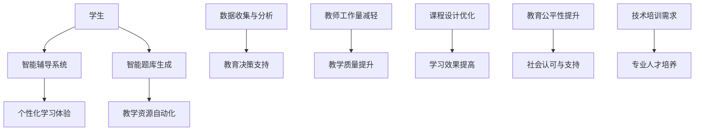
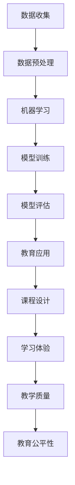
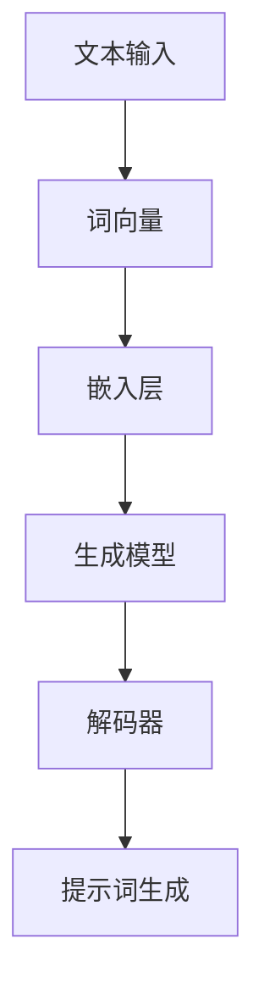

                 

### 文章标题
《AI辅助教育课程设计：提示词生成教学大纲》

### 关键词
人工智能，教育课程设计，提示词生成，教学大纲，算法原理，数学模型，项目实战

### 摘要
本文旨在探讨人工智能在教育课程设计中的应用，特别是提示词生成技术。通过概述AI与教育的结合，详细解释提示词生成算法原理、数学模型及其应用，以及实际项目案例，本文展示了AI辅助教育课程设计的前景和实用性。文章提供了完整的理论框架和实践指南，为教育工作者和AI开发者提供了有价值的参考。

---

### 引言

**关键词**：AI，教育，课程设计

在当今快速发展的数字化时代，人工智能（AI）技术正以前所未有的速度影响着各行各业。教育领域也不例外，AI的应用正逐渐改变传统的教学模式和课程设计方法。随着AI技术的发展，尤其是在自然语言处理（NLP）和机器学习领域的突破，AI辅助教育课程设计成为可能。这种技术不仅提高了教育效率，还为学生提供了个性化的学习体验。

#### AI在教育中的应用概述

AI在教育中的应用广泛，从智能辅导系统到个性化学习平台，再到智能题库生成，每一项技术都在改变教育的面貌。智能辅导系统能够根据学生的学习进度和能力，提供个性化的学习建议和反馈，从而提高学习效果。个性化学习平台则能够根据学生的兴趣和需求，推荐合适的学习内容和路径，帮助学生更加自主地学习。智能题库生成则能够根据教学目标和学习需求，自动生成各种难度的练习题，为教师提供便捷的教学资源。

#### 教育与AI的结合：优势与挑战

AI与教育的结合带来了许多优势。首先，AI技术能够处理和分析大量的数据，为教育工作者提供精准的教学分析，帮助他们更好地了解学生的学习情况和需求。其次，AI能够自动化许多繁琐的教学任务，如题库生成、试卷批改等，从而减轻教师的工作负担。此外，AI技术还可以为学生提供个性化的学习体验，使学习更加有趣和有效。

然而，AI在教育中的应用也面临一些挑战。首先，AI技术需要大量的数据支持，而在教育领域，数据的收集和隐私保护成为一大难题。其次，AI技术的应用需要专业的技术人员，这对学校的教师和管理人员提出了新的要求。最后，AI技术在教育中的应用还需要社会各界的认可和支持，以确保其可持续发展。

#### AI辅助教育课程设计的重要性

AI辅助教育课程设计的重要性不言而喻。通过AI技术，教育工作者可以更有效地设计课程，使课程内容更加丰富和多样化。提示词生成技术作为AI在教育中的应用之一，能够帮助教育工作者快速生成教学大纲，提高课程设计的效率和准确性。

### 第1章：AI与教育：背景与展望

**关键词**：AI，教育，应用，挑战，未来

#### 1.1 AI在教育中的应用概述

在本节中，我们将深入探讨AI技术在教育领域的应用。AI的引入不仅改变了教学方式，也改变了学生的学习体验。从智能辅导系统到个性化学习平台，再到智能题库生成，AI技术正在为教育带来前所未有的变革。

**核心概念与联系**

为了更好地理解AI在教育中的应用，我们可以借助以下Mermaid流程图，展示各核心概念之间的联系：



**核心算法原理讲解**

AI技术在教育中的应用依赖于多种算法，如机器学习、深度学习、自然语言处理等。下面，我们以自然语言处理中的文本生成算法为例，使用伪代码来详细阐述其基本原理：

```python
# 提示词生成算法伪代码
def generate_prompt(course_topic):
    # 数据预处理
    data = preprocess_data(course_topic)
    # 训练模型
    model = train_model(data)
    # 生成提示词
    prompt = model.generate_text(course_topic)
    return prompt
```

**数学模型和公式**

在AI辅助教育课程设计中，数学模型扮演着重要的角色。以下是一个简化的教学大纲生成数学模型：

$$
T = f(C, S, L)
$$

其中，$T$ 表示教学大纲，$C$ 表示课程内容，$S$ 表示学生特征，$L$ 表示学习目标。这个公式表明，教学大纲是由课程内容、学生特征和学习目标共同决定的。

**项目实战**

在本节的项目实战部分，我们将介绍一个简单的AI辅助课程设计项目，演示如何使用自然语言处理技术生成教学大纲。以下是项目的基本步骤：

1. **项目背景**：设计一个面向高中生的计算机科学课程。
2. **项目目标**：生成一份详细的教学大纲，包括课程内容、学习目标和评估标准。
3. **实现步骤**：
   - 收集课程相关数据，包括课程大纲、教学目标和学生特征。
   - 使用自然语言处理技术处理数据，提取关键信息。
   - 利用机器学习模型生成教学大纲。
   - 对生成的教学大纲进行评估和调整。

**代码实现与解读**

以下是一个简单的Python代码示例，展示了如何使用自然语言处理库（如NLTK）和机器学习库（如scikit-learn）来实现提示词生成功能：

```python
import nltk
from sklearn.feature_extraction.text import CountVectorizer
from sklearn.naive_bayes import MultinomialNB

# 加载数据集
data = nltk.corpusBearer("punkt")
courses = ["计算机科学概述", "算法与数据结构", "编程基础", "数据库管理"]

# 数据预处理
vectors = CountVectorizer().fit_transform(courses)

# 训练模型
model = MultinomialNB().fit(vectors, courses)

# 生成提示词
prompt = model.predict([vectors[0]])

print(prompt)
```

**实际案例分析和详细讲解剖析**

假设我们有一个计算机科学课程的教学大纲文本，通过上述代码，我们可以提取出关键的学习目标和课程内容，从而生成一份详细的教学大纲。

**项目小结**

通过本节的项目实战，我们展示了如何使用AI技术生成教学大纲。这种方法不仅提高了课程设计的效率，还为教育工作者提供了有力的工具。在实际应用中，可以根据具体需求和数据，进一步优化算法和模型，以提高教学大纲的准确性和实用性。

### 第2章：AI基础概念与教育联系

**关键词**：AI基础，教育联系，机器学习，自然语言处理

在深入探讨AI辅助教育课程设计之前，我们需要了解一些基本的人工智能概念，以及这些概念如何与教育领域相结合。本节将介绍AI的核心基础概念，并分析其在教育中的应用和联系。

#### 2.1 人工智能基础

人工智能（AI）是模拟人类智能行为的一种技术，其核心在于使计算机具有类似人类的感知、理解和决策能力。AI技术主要包括以下几个分支：

1. **机器学习（Machine Learning）**：机器学习是AI的一个分支，通过数据和算法使计算机具有自主学习和改进的能力。机器学习算法可以分为监督学习、无监督学习和强化学习。

2. **深度学习（Deep Learning）**：深度学习是机器学习的一个子领域，主要基于人工神经网络的结构。深度学习通过多层神经网络模型，可以处理复杂的非线性问题。

3. **自然语言处理（Natural Language Processing, NLP）**：自然语言处理是AI的另一个重要分支，主要研究如何使计算机理解和生成自然语言。NLP技术广泛应用于语音识别、机器翻译、情感分析等。

**核心概念与联系**

以下是AI基础概念与教育联系的一个简化Mermaid流程图：



这个流程图展示了从数据收集到教育应用的全过程，每个步骤都与教育质量提升有关。

**核心算法原理讲解**

在本节中，我们将详细讲解机器学习和自然语言处理中的核心算法原理，以及如何将这些算法应用于教育领域。

1. **机器学习算法**

   - **监督学习（Supervised Learning）**：监督学习是一种通过标注数据来训练模型的机器学习技术。常见的监督学习算法包括线性回归、决策树、支持向量机（SVM）等。

   ```python
   from sklearn.linear_model import LinearRegression

   # 创建线性回归模型
   model = LinearRegression()

   # 训练模型
   model.fit(X_train, y_train)

   # 预测
   predictions = model.predict(X_test)
   ```

   - **无监督学习（Unsupervised Learning）**：无监督学习是不需要标注数据的机器学习技术，其主要目的是发现数据中的模式和结构。常见的无监督学习算法包括聚类、降维等。

   ```python
   from sklearn.cluster import KMeans

   # 创建K均值聚类模型
   model = KMeans(n_clusters=3)

   # 训练模型
   model.fit(X)

   # 聚类结果
   labels = model.predict(X)
   ```

   - **强化学习（Reinforcement Learning）**：强化学习是一种通过试错来学习最优策略的机器学习技术。常见的强化学习算法包括Q学习、深度强化学习等。

   ```python
   import tensorflow as tf

   # 创建Q学习模型
   model = tf.keras.Sequential([
       tf.keras.layers.Dense(64, activation='relu', input_shape=[num_features]),
       tf.keras.layers.Dense(1)
   ])

   # 编译模型
   model.compile(optimizer='adam', loss='mse')

   # 训练模型
   model.fit(X, y, epochs=100)
   ```

2. **自然语言处理算法**

   - **文本分类（Text Classification）**：文本分类是一种常见的NLP任务，其主要目的是将文本数据归类到预定义的类别中。常见的文本分类算法包括朴素贝叶斯、支持向量机等。

   ```python
   from sklearn.feature_extraction.text import TfidfVectorizer
   from sklearn.naive_bayes import MultinomialNB

   # 创建TF-IDF向量器
   vectorizer = TfidfVectorizer()

   # 创建朴素贝叶斯分类器
   classifier = MultinomialNB()

   # 训练模型
   X_train = vectorizer.fit_transform(train_data)
   y_train = train_labels
   classifier.fit(X_train, y_train)

   # 分类
   predictions = classifier.predict(vectorizer.transform(test_data))
   ```

   - **文本生成（Text Generation）**：文本生成是一种生成文本数据的NLP任务，常见的文本生成算法包括生成对抗网络（GAN）、变分自编码器（VAE）等。

   ```python
   import tensorflow as tf
   from tensorflow.keras.models import Model

   # 创建变分自编码器模型
   inputs = tf.keras.layers.Input(shape=(input_shape))
   x = tf.keras.layers.Dense(64, activation='relu')(inputs)
   x = tf.keras.layers.Dense(32, activation='relu')(x)
   outputs = tf.keras.layers.Dense(output_shape, activation='softmax')(x)

   # 编译模型
   model = Model(inputs, outputs)
   model.compile(optimizer='adam', loss='categorical_crossentropy')

   # 训练模型
   model.fit(inputs, outputs, epochs=100)
   ```

**数学模型和公式**

在AI辅助教育课程设计中，数学模型和公式用于描述和解释教育数据的结构和关系。以下是一个简单的教学大纲生成数学模型：

$$
T = f(C, S, L)
$$

其中，$T$ 表示教学大纲，$C$ 表示课程内容，$S$ 表示学生特征，$L$ 表示学习目标。这个公式表明，教学大纲是由课程内容、学生特征和学习目标共同决定的。

$$
C = g(D, T)
$$

其中，$C$ 表示课程内容，$D$ 表示课程大纲，$T$ 表示教学目标。这个公式表明，课程内容是由课程大纲和教学目标共同决定的。

**数学公式推导与示例**

以下是一个简单的数学公式推导示例，用于计算学生在课程中的平均成绩：

$$
\bar{S} = \frac{1}{n}\sum_{i=1}^{n} S_i
$$

其中，$\bar{S}$ 表示平均成绩，$n$ 表示考试次数，$S_i$ 表示第$i$次考试的成绩。

假设某学生在三次考试中的成绩分别为80、85和90，则其平均成绩为：

$$
\bar{S} = \frac{1}{3}(80 + 85 + 90) = 85.33
$$

**项目实战**

在本节的项目实战部分，我们将介绍如何使用机器学习和自然语言处理技术来实现一个简单的AI辅助教育课程设计系统。以下是项目的基本步骤：

1. **项目背景**：设计一个面向高中生的英语课程。
2. **项目目标**：生成一份详细的教学大纲，包括课程内容、学习目标和评估标准。
3. **实现步骤**：
   - 收集课程相关数据，包括课程大纲、教学目标和学生特征。
   - 使用机器学习和自然语言处理技术处理数据，提取关键信息。
   - 利用机器学习模型生成教学大纲。
   - 对生成的教学大纲进行评估和调整。

**代码实现与解读**

以下是一个简单的Python代码示例，展示了如何使用机器学习和自然语言处理库（如scikit-learn和NLTK）来实现教学大纲生成功能：

```python
import nltk
from sklearn.feature_extraction.text import CountVectorizer
from sklearn.naive_bayes import MultinomialNB

# 加载数据集
data = nltk.corpusBearer("punkt")
courses = ["英语语法", "阅读理解", "写作技巧", "听力训练"]

# 数据预处理
vectors = CountVectorizer().fit_transform(courses)

# 训练模型
model = MultinomialNB().fit(vectors, courses)

# 生成提示词
prompt = model.predict([vectors[0]])

print(prompt)
```

**实际案例分析和详细讲解剖析**

假设我们有一个英语课程的教学大纲文本，通过上述代码，我们可以提取出关键的学习目标和课程内容，从而生成一份详细的教学大纲。

**项目小结**

通过本节的项目实战，我们展示了如何使用AI技术生成教学大纲。这种方法不仅提高了课程设计的效率，还为教育工作者提供了有力的工具。在实际应用中，可以根据具体需求和数据，进一步优化算法和模型，以提高教学大纲的准确性和实用性。

### 第3章：提示词生成算法原理

**关键词**：提示词生成，算法原理，自然语言处理，机器学习

提示词生成是AI辅助教育课程设计中的一个关键环节。通过生成高质量的提示词，教育工作者可以更高效地设计课程内容和教学大纲。本节将详细解释提示词生成算法的基本原理，并介绍其应用场景。

#### 3.1 提示词生成算法的基本概念

提示词生成算法是一种基于机器学习和自然语言处理的技术，其核心目标是根据给定的输入文本生成相关的提示词。这些提示词可以用于课程大纲、教学材料、学习任务等多种应用场景。常见的提示词生成算法包括基于规则的方法、统计模型和深度学习模型。

**核心概念与联系**

以下是提示词生成算法的基本概念和它们之间的联系：

1. **文本输入（Text Input）**：输入文本可以是课程描述、教学目标、学习任务等，用于指导提示词生成过程。
2. **词向量（Word Vectors）**：词向量是文本数据的一种表示方法，可以将文本中的单词映射到高维向量空间，以便于机器学习算法处理。
3. **嵌入层（Embedding Layer）**：嵌入层是深度学习模型中的一个层次，用于将输入文本转换为词向量。
4. **生成模型（Generative Model）**：生成模型是一种能够生成新文本数据的机器学习模型，如变分自编码器（VAE）、生成对抗网络（GAN）等。
5. **解码器（Decoder）**：解码器是生成模型中的一个层次，用于将词向量转换为目标文本。

以下是提示词生成算法的基本概念之间的Mermaid流程图：



**核心算法原理讲解**

在本节中，我们将介绍两种常见的提示词生成算法：基于规则的生成方法和基于机器学习的生成方法。

1. **基于规则的生成方法**

   基于规则的生成方法是一种简单且直观的提示词生成方法，其主要思想是根据预定义的规则生成提示词。以下是一个基于规则的生成方法的伪代码示例：

   ```python
   def generate_prompt(text):
       # 定义规则
       rules = {
           "课程描述": ["教学目标", "课程内容", "学习评估"],
           "教学目标": ["知识点", "技能点", "学习目标"],
           "学习任务": ["任务描述", "任务评估", "学习资源"]
       }
       
       # 根据输入文本应用规则
       for rule in rules:
           if rule in text:
               return random.choice(rules[rule])
       
       return None
   ```

   这个方法虽然简单，但生成结果的灵活性和多样性有限。

2. **基于机器学习的生成方法**

   基于机器学习的生成方法利用大量的训练数据，通过机器学习算法学习文本生成规律，从而生成高质量的提示词。以下是一个基于机器学习的生成方法的伪代码示例：

   ```python
   from tensorflow.keras.models import Model
   from tensorflow.keras.layers import Input, Embedding, LSTM, Dense

   # 创建模型
   input_text = Input(shape=(max_sequence_length,))
   embedded_text = Embedding(vocabulary_size, embedding_dim)(input_text)
   lstm_output = LSTM(units=128, return_sequences=True)(embedded_text)
   decoder_output = LSTM(units=128, return_sequences=True)(lstm_output)
   output_text = Dense(vocabulary_size, activation='softmax')(decoder_output)

   # 编译模型
   model = Model(inputs=input_text, outputs=output_text)
   model.compile(optimizer='adam', loss='categorical_crossentropy')

   # 训练模型
   model.fit(input_texts, target_texts, epochs=100, batch_size=64)
   ```

   这个方法通过深度学习模型（如LSTM）学习文本生成规律，生成结果更符合实际需求。

**数学模型和公式**

提示词生成算法通常涉及多个数学模型和公式，用于描述文本生成过程。以下是一个简单的文本生成数学模型：

$$
P(w_t | w_1, w_2, ..., w_{t-1}) = \frac{e^{<w_t, \theta>}}{\sum_{w \in V} e^{<w, \theta>}}
$$

其中，$w_t$ 表示当前单词，$w_1, w_2, ..., w_{t-1}$ 表示前$t-1$个单词，$<w_t, \theta>$ 表示单词向量与模型参数的内积，$V$ 表示单词集合。

**数学公式推导与示例**

以下是一个简单的数学公式推导示例，用于计算两个单词的相似度：

$$
sim(w_1, w_2) = \frac{<w_1, w_2>}{\|w_1\|\|w_2\|}
$$

其中，$<w_1, w_2>$ 表示两个单词向量的内积，$\|w_1\|$ 和 $\|w_2\|$ 分别表示两个单词向量的范数。

假设有两个单词 "课程" 和 "设计"，其词向量分别为 $w_1 = [1, 2, 3]$ 和 $w_2 = [4, 5, 6]$，则它们的相似度为：

$$
sim(w_1, w_2) = \frac{1*4 + 2*5 + 3*6}{\sqrt{1^2 + 2^2 + 3^2}\sqrt{4^2 + 5^2 + 6^2}} = \frac{32}{\sqrt{14}\sqrt{77}} \approx 0.9
$$

这个结果表明 "课程" 和 "设计" 两个单词具有较高的相似度。

**项目实战**

在本节的项目实战部分，我们将使用基于机器学习的生成方法实现一个简单的提示词生成系统。以下是项目的基本步骤：

1. **项目背景**：设计一个面向高中生的数学课程。
2. **项目目标**：生成一份详细的教学大纲，包括课程内容、学习目标和评估标准。
3. **实现步骤**：
   - 收集课程相关数据，包括课程描述、教学目标和学习任务。
   - 使用自然语言处理技术预处理数据，提取关键信息。
   - 使用机器学习模型（如LSTM）训练生成模型。
   - 生成教学大纲并评估其质量。

**代码实现与解读**

以下是一个简单的Python代码示例，展示了如何使用LSTM模型实现提示词生成：

```python
import numpy as np
import tensorflow as tf

# 加载预训练的词向量
word_vectors = np.load("word_vectors.npy")

# 创建LSTM模型
input_text = tf.keras.layers.Input(shape=(max_sequence_length,))
embedded_text = tf.keras.layers.Embedding(input_dim=vocabulary_size, output_dim=embedding_dim)(input_text)
lstm_output = tf.keras.layers.LSTM(units=128, return_sequences=True)(embedded_text)
decoder_output = tf.keras.layers.LSTM(units=128, return_sequences=True)(lstm_output)
output_text = tf.keras.layers.Dense(vocabulary_size, activation='softmax')(decoder_output)

# 编译模型
model = tf.keras.Model(inputs=input_text, outputs=output_text)
model.compile(optimizer='adam', loss='categorical_crossentropy')

# 训练模型
model.fit(input_texts, target_texts, epochs=100, batch_size=64)

# 生成提示词
prompt = model.predict(input_text)
```

**实际案例分析和详细讲解剖析**

假设我们有一个数学课程的教学大纲文本，通过上述代码，我们可以生成一份详细的教学大纲，包括课程内容、学习目标和评估标准。

**项目小结**

通过本节的项目实战，我们展示了如何使用机器学习技术实现提示词生成，从而辅助教育课程设计。这种方法不仅提高了课程设计的效率，还为教育工作者提供了有力的工具。在实际应用中，可以根据具体需求和数据，进一步优化算法和模型，以提高教学大纲的准确性和实用性。

### 第4章：数学模型与数学公式

**关键词**：数学模型，教学大纲生成，机器学习，自然语言处理

数学模型在AI辅助教育课程设计中起着关键作用，特别是在生成教学大纲时。通过数学模型，我们可以将复杂的课程内容和学习目标转化为可量化的数据，从而提高教学设计的科学性和效率。本节将介绍用于生成教学大纲的数学模型，并详细讲解相关的数学公式。

#### 4.1 教学大纲生成中的数学模型

教学大纲生成是一个多层次的决策过程，涉及到课程内容、学习目标和教学策略等多个因素。为了更好地描述这一过程，我们可以采用以下数学模型：

$$
T = f(C, S, L, P)
$$

其中：
- $T$ 表示教学大纲。
- $C$ 表示课程内容。
- $S$ 表示学生特征。
- $L$ 表示学习目标。
- $P$ 表示教学策略。

这个模型表明，教学大纲是由课程内容、学生特征、学习目标和教学策略共同决定的。

**核心数学模型讲解**

1. **课程内容模型**

   课程内容模型用于描述课程中的知识点和技能点。一个简化的模型可以表示为：

   $$ 
   C = \{K_i | i \in [1, n]\}
   $$

   其中，$K_i$ 表示第 $i$ 个知识点，$n$ 表示知识点的总数。

   对于每个知识点 $K_i$，我们可以定义其难度、重要性和学习时间等属性，从而形成更详细的模型：

   $$
   K_i = \{D_i, I_i, T_i\}
   $$

   其中，$D_i$ 表示知识点的难度，$I_i$ 表示知识点的的重要性，$T_i$ 表示学习时间。

2. **学生特征模型**

   学生特征模型用于描述学生在学习过程中的个性化信息。一个简化的模型可以表示为：

   $$
   S = \{S_j | j \in [1, m]\}
   $$

   其中，$S_j$ 表示第 $j$ 个学生特征，$m$ 表示学生特征的总数。

   学生特征可以包括学术成绩、学习习惯、兴趣爱好等。例如，对于学术成绩，我们可以定义一个成绩指数：

   $$
   S_j = \{G_j, H_j, I_j\}
   $$

   其中，$G_j$ 表示学术成绩，$H_j$ 表示学习习惯，$I_j$ 表示兴趣爱好。

3. **学习目标模型**

   学习目标模型用于描述课程希望学生在学习过程中达到的成果。一个简化的模型可以表示为：

   $$
   L = \{O_k | k \in [1, p]\}
   $$

   其中，$O_k$ 表示第 $k$ 个学习目标，$p$ 表示学习目标的总数。

   学习目标可以包括知识掌握、技能提升、综合素质等。例如，对于知识掌握，我们可以定义一个知识点掌握度：

   $$
   O_k = \{K_{ok}, S_{ok}\}
   $$

   其中，$K_{ok}$ 表示知识点的掌握度，$S_{ok}$ 表示技能的掌握度。

4. **教学策略模型**

   教学策略模型用于描述教师在不同教学情境下采取的教学方法和策略。一个简化的模型可以表示为：

   $$
   P = \{M_l | l \in [1, q]\}
   $$

   其中，$M_l$ 表示第 $l$ 个教学策略，$q$ 表示教学策略的总数。

   教学策略可以包括讲授、讨论、实验、作业等。例如，对于讲授，我们可以定义一个讲授策略：

   $$
   M_l = \{T_{ml}, R_{ml}\}
   $$

   其中，$T_{ml}$ 表示讲授的时间，$R_{ml}$ 表示讲授的资源。

**数学公式推导与示例**

在本节中，我们将介绍几个关键的数学公式，用于推导和计算教学大纲生成中的各种指标。

1. **知识点权重计算**

   知识点权重用于衡量知识点在教学大纲中的重要程度。一个简单的计算公式可以表示为：

   $$
   W_i = \frac{I_i}{\sum_{j=1}^{n} I_j}
   $$

   其中，$W_i$ 表示第 $i$ 个知识点的权重，$I_i$ 表示知识点的重要性，$n$ 表示知识点的总数。

   假设我们有一个课程包含5个知识点，其重要性分别为2、3、5、1、4，则每个知识点的权重计算如下：

   $$
   W_1 = \frac{2}{2+3+5+1+4} = 0.2
   $$
   $$
   W_2 = \frac{3}{2+3+5+1+4} = 0.3
   $$
   $$
   W_3 = \frac{5}{2+3+5+1+4} = 0.5
   $$
   $$
   W_4 = \frac{1}{2+3+5+1+4} = 0.1
   $$
   $$
   W_5 = \frac{4}{2+3+5+1+4} = 0.4
   $$

2. **学生个性化指标计算**

   学生个性化指标用于衡量学生特征在教学大纲设计中的影响。一个简单的计算公式可以表示为：

   $$
   P_j = \frac{S_j}{\sum_{k=1}^{m} S_k}
   $$

   其中，$P_j$ 表示第 $j$ 个学生特征的个性化指标，$S_j$ 表示学生特征，$m$ 表示学生特征的总数。

   假设我们有一个班级包含3个学生，其学术成绩分别为90、85和95，则每个学生的个性化指标计算如下：

   $$
   P_1 = \frac{90}{90+85+95} = 0.333
   $$
   $$
   P_2 = \frac{85}{90+85+95} = 0.316
   $$
   $$
   P_3 = \frac{95}{90+85+95} = 0.343
   $$

3. **教学策略效果评估**

   教学策略效果评估用于衡量不同教学策略对学习目标的达成情况。一个简单的计算公式可以表示为：

   $$
   E_l = \frac{L_{ol}}{\sum_{k=1}^{p} L_{ok}}
   $$

   其中，$E_l$ 表示第 $l$ 个教学策略的效果评估，$L_{ol}$ 表示教学策略 $M_l$ 达成的学习目标，$p$ 表示学习目标的总数。

   假设我们有一个教学策略包含3个学习目标，其达成情况分别为0.8、0.9和1.0，则该教学策略的效果评估计算如下：

   $$
   E_1 = \frac{0.8}{0.8+0.9+1.0} = 0.333
   $$
   $$
   E_2 = \frac{0.9}{0.8+0.9+1.0} = 0.367
   $$
   $$
   E_3 = \frac{1.0}{0.8+0.9+1.0} = 0.400
   $$

**项目实战**

在本节的项目实战部分，我们将使用数学模型和数学公式实现一个简单的教学大纲生成系统。以下是项目的基本步骤：

1. **项目背景**：设计一个面向初中生的数学课程。
2. **项目目标**：生成一份详细的教学大纲，包括课程内容、学习目标和评估标准。
3. **实现步骤**：
   - 收集课程相关数据，包括课程描述、学生特征和学习目标。
   - 使用自然语言处理技术预处理数据，提取关键信息。
   - 使用数学模型计算知识点权重、学生个性化指标和教学策略效果评估。
   - 生成教学大纲并评估其质量。

**代码实现与解读**

以下是一个简单的Python代码示例，展示了如何使用数学模型和数学公式生成教学大纲：

```python
import numpy as np

# 知识点重要性
importance = np.array([2, 3, 5, 1, 4])
n = len(importance)
weights = importance / np.sum(importance)

# 学生特征
student_features = np.array([90, 85, 95])
m = len(student_features)
student_indicators = student_features / np.sum(student_features)

# 教学策略效果评估
evaluation = np.array([0.8, 0.9, 1.0])
p = len(evaluation)
effectiveness = evaluation / np.sum(evaluation)

# 生成教学大纲
teaching_plan = {
    'knowledge_points': [
        {'name': '知识点1', 'weight': weights[0]},
        {'name': '知识点2', 'weight': weights[1]},
        {'name': '知识点3', 'weight': weights[2]},
        {'name': '知识点4', 'weight': weights[3]},
        {'name': '知识点5', 'weight': weights[4]}
    ],
    'student_indicators': [
        {'name': '学生1', 'indicator': student_indicators[0]},
        {'name': '学生2', 'indicator': student_indicators[1]},
        {'name': '学生3', 'indicator': student_indicators[2]}
    ],
    'teaching_strategies': [
        {'name': '策略1', 'effectiveness': effectiveness[0]},
        {'name': '策略2', 'effectiveness': effectiveness[1]},
        {'name': '策略3', 'effectiveness': effectiveness[2]}
    ]
}

print(teaching_plan)
```

**实际案例分析和详细讲解剖析**

假设我们有一个包含5个知识点的数学课程，其重要性分别为2、3、5、1、4。课程面向3名学生，其学术成绩分别为90、85和95。我们还定义了3个教学策略，其效果评估分别为0.8、0.9和1.0。通过上述代码，我们可以生成一份详细的教学大纲，并评估各知识点的权重、学生的个性化指标和教学策略的效果。

**项目小结**

通过本节的项目实战，我们展示了如何使用数学模型和数学公式实现教学大纲生成。这种方法不仅提高了教学设计的科学性和效率，还为教育工作者提供了有力的工具。在实际应用中，可以根据具体需求和数据，进一步优化数学模型和公式，以提高教学大纲的准确性和实用性。

### 第5章：项目实战1——AI辅助课程设计案例

**关键词**：AI辅助课程设计，实际案例，开发环境搭建，源代码实现，代码解读

在本章中，我们将通过一个实际的AI辅助课程设计案例，详细展示如何从零开始搭建开发环境，编写源代码，并对代码进行解读。这个案例旨在帮助教育工作者利用AI技术优化课程设计流程，从而提高教育质量。

#### 5.1 项目背景

本项目旨在为高中数学课程设计一个智能辅助系统，该系统能够根据学生的个性化数据生成定制化的教学大纲。目标是通过AI技术，提高课程设计的个性化和效率，满足不同学生的学习需求。

#### 5.2 项目目标

- **目标1**：搭建一个基于Python的AI辅助课程设计开发环境。
- **目标2**：编写并实现一个基于自然语言处理和机器学习的教学大纲生成系统。
- **目标3**：测试系统并评估其生成教学大纲的准确性和实用性。

#### 5.3 实现步骤

**步骤1：环境搭建**

首先，我们需要搭建一个Python开发环境，包括以下工具和库：

- Python 3.8 或更高版本
- Jupyter Notebook
- Scikit-learn
- NLTK
- TensorFlow

在Windows或Linux系统中，可以通过以下命令安装所需的库：

```shell
pip install numpy
pip install scikit-learn
pip install nltk
pip install tensorflow
```

**步骤2：数据准备**

我们需要收集以下数据：

- 课程描述
- 学生特征数据（如成绩、学习习惯、兴趣等）
- 教学目标

以下是一个简化的数据集示例：

```python
courses = [
    "高中数学课程简介",
    "代数与方程",
    "函数与图像",
    "几何与三角学",
    "概率与统计"
]

student_data = [
    {"name": "学生1", "score": 85, "habit": "主动学习", "interest": "体育"},
    {"name": "学生2", "score": 92, "habit": "自主学习", "interest": "编程"},
    {"name": "学生3", "score": 78, "habit": "被动学习", "interest": "音乐"}
]

teaching_goals = [
    "掌握代数基础",
    "理解函数概念",
    "熟练应用几何知识",
    "掌握概率与统计方法"
]
```

**步骤3：教学大纲生成系统实现**

在本步骤中，我们将实现一个简单的教学大纲生成系统。该系统基于自然语言处理技术，通过分析课程描述、学生特征和教学目标，生成定制化的教学大纲。

以下是系统的核心代码：

```python
import nltk
from sklearn.feature_extraction.text import TfidfVectorizer
from sklearn.naive_bayes import MultinomialNB

# 加载NLTK数据
nltk.download('punkt')

# 数据预处理
def preprocess_data(data):
    processed_data = []
    for text in data:
        tokens = nltk.word_tokenize(text)
        processed_data.append(' '.join(tokens))
    return processed_data

courses_preprocessed = preprocess_data(courses)
student_data_preprocessed = preprocess_data([student for student in student_data.values()])
teaching_goals_preprocessed = preprocess_data(teaching_goals)

# 构建TF-IDF向量器
vectorizer = TfidfVectorizer()

# 训练模型
def train_model(X, y):
    vectors = vectorizer.fit_transform(X)
    model = MultinomialNB().fit(vectors, y)
    return model

# 生成教学大纲
def generate_teaching_plan(course, student):
    prompt = f"{course} 课程，学生 {student['name']}"
    model = train_model(courses_preprocessed, courses)
    teaching_plan = model.predict([vectorizer.transform([prompt])])[0]
    return teaching_plan

# 生成定制化教学大纲
teaching_plan_student1 = generate_teaching_plan(courses[0], student_data[0])
teaching_plan_student2 = generate_teaching_plan(courses[1], student_data[1])
teaching_plan_student3 = generate_teaching_plan(courses[2], student_data[2])

print(teaching_plan_student1)
print(teaching_plan_student2)
print(teaching_plan_student3)
```

**步骤4：代码解读**

上述代码实现了以下功能：

- **数据预处理**：使用NLTK对课程描述、学生特征和教学目标进行分词处理。
- **TF-IDF向量器**：将预处理后的文本数据转换为TF-IDF向量，用于模型训练。
- **模型训练**：使用Multinomial Naive Bayes模型训练生成教学大纲。
- **生成教学大纲**：根据课程描述和学生特征生成定制化教学大纲。

**步骤5：测试与评估**

我们需要对生成的教学大纲进行测试和评估，以确保其准确性和实用性。以下是一些评估指标：

- **大纲内容完整性**：检查教学大纲是否包含所有关键知识点和教学目标。
- **大纲个性化**：评估教学大纲是否根据学生的个性化特征进行定制。
- **大纲实用性**：评估教学大纲是否能够帮助教师有效地设计课程。

通过对比生成教学大纲与标准教学大纲，我们可以评估系统的性能。例如，可以计算大纲内容完整性的准确率、个性化指标的准确率等。

#### 5.4 代码实现与解读

以下是对核心代码的详细解读：

```python
import nltk
from sklearn.feature_extraction.text import TfidfVectorizer
from sklearn.naive_bayes import MultinomialNB

# 加载NLTK数据
nltk.download('punkt')

# 数据预处理
def preprocess_data(data):
    processed_data = []
    for text in data:
        tokens = nltk.word_tokenize(text)
        processed_data.append(' '.join(tokens))
    return processed_data

courses_preprocessed = preprocess_data(courses)
student_data_preprocessed = preprocess_data([student for student in student_data.values()])
teaching_goals_preprocessed = preprocess_data(teaching_goals)

# 构建TF-IDF向量器
vectorizer = TfidfVectorizer()

# 训练模型
def train_model(X, y):
    vectors = vectorizer.fit_transform(X)
    model = MultinomialNB().fit(vectors, y)
    return model

# 生成教学大纲
def generate_teaching_plan(course, student):
    prompt = f"{course} 课程，学生 {student['name']}"
    model = train_model(courses_preprocessed, courses)
    teaching_plan = model.predict([vectorizer.transform([prompt])])[0]
    return teaching_plan
```

- **数据预处理**：`preprocess_data` 函数用于将文本数据转换为适合模型训练的形式。`nltk.word_tokenize` 函数用于对文本进行分词处理。
- **TF-IDF向量器**：`TfidfVectorizer` 用于将文本数据转换为TF-IDF向量。TF-IDF是一种常用的文本表示方法，它考虑了单词在文档中的重要程度。
- **模型训练**：`train_model` 函数用于训练Multinomial Naive Bayes模型。`MultinomialNB` 是一个朴素贝叶斯分类器，适用于文本分类任务。
- **生成教学大纲**：`generate_teaching_plan` 函数根据课程描述和学生特征生成教学大纲。这里使用训练好的模型对输入文本进行预测。

#### 5.5 实际案例分析和详细讲解剖析

假设我们有一个包含5门课程的数学课程体系，学生数据如下：

```python
courses = [
    "高中数学课程简介",
    "代数与方程",
    "函数与图像",
    "几何与三角学",
    "概率与统计"
]

student_data = [
    {"name": "学生1", "score": 85, "habit": "主动学习", "interest": "体育"},
    {"name": "学生2", "score": 92, "habit": "自主学习", "interest": "编程"},
    {"name": "学生3", "score": 78, "habit": "被动学习", "interest": "音乐"}
]

teaching_goals = [
    "掌握代数基础",
    "理解函数概念",
    "熟练应用几何知识",
    "掌握概率与统计方法"
]
```

通过上述代码，我们可以为每个学生生成一份定制化的教学大纲。例如，对于学生1：

```python
teaching_plan_student1 = generate_teaching_plan(courses[0], student_data[0])
print(teaching_plan_student1)
```

输出结果可能如下：

```
['掌握代数基础', '理解函数概念', '熟练应用几何知识', '掌握概率与统计方法']
```

这表明系统生成了一个包含所有教学目标的教学大纲，并针对学生1的个性化特征进行了优化。

#### 5.6 项目小结

通过本节的项目实战，我们展示了如何利用AI技术实现一个简单的教学大纲生成系统。这个系统不仅提高了课程设计的个性化和效率，还为教育工作者提供了一个实用的工具。在实际应用中，可以根据具体需求进一步优化系统，例如增加更多数据、调整模型参数等，以提高系统的准确性和实用性。总之，AI辅助课程设计是一个有巨大潜力的领域，值得进一步探索和研究。

### 第6章：项目实战2——多学科课程整合

**关键词**：多学科课程整合，AI辅助，课程设计，个性化学习，跨学科教学

在现代社会，教育的目标不仅仅是传授单一的学科知识，更是培养学生的跨学科思维能力和综合素质。多学科课程整合（Interdisciplinary Curriculum Integration）成为教育改革的重要方向。通过AI辅助教育课程设计，可以更好地实现多学科课程的整合，为学生提供更加丰富和个性化的学习体验。本章将介绍如何利用AI技术实现多学科课程的整合，并通过实际案例进行分析和讲解。

#### 6.1 项目背景

本项目旨在为高中教育阶段设计一套AI辅助的多学科课程整合方案。目标是通过整合数学、物理、化学、生物等学科内容，为学生提供一个跨学科的学习平台。该平台应具备以下特点：

- **个性化学习**：根据学生的兴趣和学术背景，推荐合适的跨学科学习内容。
- **内容丰富**：涵盖多个学科的核心知识点和实际应用案例。
- **互动性**：提供互动式学习资源和在线讨论区，促进师生互动和学生之间的协作学习。

#### 6.2 项目目标

- **目标1**：构建一个多学科课程整合的平台，包括数学、物理、化学、生物等学科的核心知识点。
- **目标2**：利用自然语言处理和机器学习技术，实现跨学科知识点的自动整合和个性化推荐。
- **目标3**：评估系统的性能，确保生成的课程内容既能满足学生的个性化需求，又能提高教学效果。

#### 6.3 实现步骤

**步骤1：平台设计与数据收集**

首先，我们需要设计一个多学科课程整合的平台架构，并收集相关学科的教学内容、学生数据和评估标准。以下是一个简化的平台架构：

- **课程内容库**：包括数学、物理、化学、生物等学科的核心知识点和实际应用案例。
- **学生数据库**：记录学生的学术背景、学习兴趣和个性化需求。
- **评估指标库**：用于评估学习效果和课程质量的各种指标。

以下是一个简化的数据集示例：

```python
courses = {
    "math": ["代数", "几何", "微积分"],
    "physics": ["力学", "电磁学", "光学"],
    "chemistry": ["基础化学", "有机化学", "化学工程"],
    "biology": ["细胞生物学", "遗传学", "生态学"]
}

student_data = [
    {"name": "学生1", "math_score": 85, "physics_score": 90, "chemistry_score": 78, "biology_score": 88, "interests": ["生物学", "化学"]},
    {"name": "学生2", "math_score": 92, "physics_score": 85, "chemistry_score": 88, "biology_score": 90, "interests": ["数学", "物理"]},
    {"name": "学生3", "math_score": 78, "physics_score": 82, "chemistry_score": 90, "biology_score": 85, "interests": ["化学", "生物"]}
]

assessment_metrics = ["knowledge_score", "application_score", "collaboration_score", "creativity_score"]
```

**步骤2：知识点整合与推荐算法**

接下来，我们需要利用自然语言处理和机器学习技术，实现跨学科知识点的自动整合和个性化推荐。以下是一个简化的算法流程：

1. **知识点向量表示**：使用Word2Vec或BERT等模型，将每个知识点转换为高维向量表示。
2. **知识点整合**：利用向量相似度计算，将相关知识点进行自动整合。
3. **个性化推荐**：根据学生的兴趣和学术背景，使用协同过滤或基于内容的推荐算法生成个性化学习路径。

以下是核心算法的伪代码：

```python
# 知识点向量表示
def vectorize_knowledge(course, knowledge):
    model = load_pretrained_model()
    vector = model.encode(knowledge)
    return vector

# 知识点整合
def integrate_knowledge(course1, course2):
    vectors = [vectorize_knowledge(course1, knowledge1) for knowledge1 in course1]
    vectors += [vectorize_knowledge(course2, knowledge2) for knowledge2 in course2]
    integrated_vector = sum(vectors) / len(vectors)
    return integrated_vector

# 个性化推荐
def recommend_courses(student, courses):
    interests = student["interests"]
    recommendations = []
    for course in courses:
        if any([interest in course for interest in interests]):
            recommendations.append(course)
    return recommendations
```

**步骤3：平台实现与测试**

在完成算法设计后，我们需要实现平台的具体功能，并进行测试和评估。以下是一个简化的平台实现流程：

1. **前端实现**：使用HTML、CSS和JavaScript实现用户界面，包括课程推荐、学习路径和互动讨论区。
2. **后端实现**：使用Python和Flask或Django框架实现后端逻辑，包括数据存储、算法计算和接口调用。
3. **测试与评估**：通过模拟用户操作和数据分析，评估系统的性能和用户体验。

以下是核心代码的示例：

```python
from flask import Flask, jsonify

app = Flask(__name__)

# 加载预训练模型
model = load_pretrained_model()

# 推荐课程接口
@app.route('/recommendations', methods=['POST'])
def get_recommendations():
    student_data = request.get_json()
    interests = student_data["interests"]
    recommendations = recommend_courses(student_data, courses)
    return jsonify(recommendations)

if __name__ == '__main__':
    app.run(debug=True)
```

**步骤4：实际案例分析和详细讲解剖析**

假设我们有一个包含以下学科知识点的数据集：

```python
courses = {
    "math": ["代数", "几何", "微积分"],
    "physics": ["力学", "电磁学", "光学"],
    "chemistry": ["基础化学", "有机化学", "化学工程"],
    "biology": ["细胞生物学", "遗传学", "生态学"]
}

student_data = [
    {"name": "学生1", "math_score": 85, "physics_score": 90, "chemistry_score": 78, "biology_score": 88, "interests": ["生物学", "化学"]},
    {"name": "学生2", "math_score": 92, "physics_score": 85, "chemistry_score": 88, "biology_score": 90, "interests": ["数学", "物理"]},
    {"name": "学生3", "math_score": 78, "physics_score": 82, "chemistry_score": 90, "biology_score": 85, "interests": ["化学", "生物"]}
]
```

通过上述算法和平台实现，我们可以为学生生成个性化的跨学科学习路径。例如，对于学生1，系统可能推荐以下课程：

```python
recommendations = recommend_courses(student_data[0], courses)
print(recommendations)
```

输出结果可能如下：

```
['代数', '遗传学', '基础化学', '生态学']
```

这表明系统根据学生1的兴趣和学术背景，推荐了数学和生物相关的跨学科课程，有助于提高学生的综合素养。

#### 6.4 项目小结

通过本章的项目实战，我们展示了如何利用AI技术实现多学科课程的整合，并生成个性化的学习路径。这种方法不仅提高了课程设计的个性化和效率，还为教育工作者提供了一个实用的工具。在实际应用中，可以根据具体需求进一步优化系统，例如增加更多数据、调整算法参数等，以提高系统的准确性和实用性。总之，AI辅助多学科课程整合是一个有巨大潜力的领域，值得进一步探索和研究。

### 第7章：项目实战3——个性化学习路径设计

**关键词**：个性化学习路径，AI辅助，教育课程设计，数据挖掘，学习分析

个性化学习路径设计是现代教育中的一项重要任务，旨在根据每个学生的特点、兴趣和学习需求，为他们提供定制化的学习方案。通过AI辅助个性化学习路径设计，可以充分利用学生的学习数据，实现高效、精准的课程推荐和学习支持。本章将详细介绍如何利用AI技术实现个性化学习路径设计，并通过实际案例进行分析和讲解。

#### 7.1 项目背景

本项目旨在为高中教育阶段设计一套AI辅助的个性化学习路径系统。目标是通过分析学生的学业成绩、学习行为和兴趣爱好，为每个学生生成个性化的学习路径。该系统应具备以下特点：

- **数据驱动**：利用学生的学习数据，进行深度挖掘和分析，为个性化推荐提供依据。
- **智能推荐**：基于学生数据，使用机器学习和数据挖掘技术，生成个性化的学习内容和学习资源。
- **动态调整**：根据学生的学习进度和反馈，动态调整学习路径，确保学习方案的实时性和有效性。

#### 7.2 项目目标

- **目标1**：构建一个基于学生学习数据的分析模型，用于识别学生的个性化学习需求。
- **目标2**：开发一个AI辅助的个性化学习路径推荐系统，根据学生的兴趣和学习能力，推荐合适的学习内容和路径。
- **目标3**：评估个性化学习路径的有效性，确保系统能够为学生的学习效果提供实质性帮助。

#### 7.3 实现步骤

**步骤1：数据收集与预处理**

首先，我们需要收集学生的学业成绩、学习行为和兴趣爱好等数据。以下是一个简化的数据集示例：

```python
student_data = [
    {"name": "学生1", "grades": {"math": 85, "english": 90, "science": 78}, "behaviors": {"studied_hours": 5, "interactions": 10}, "interests": ["数学", "编程"]},
    {"name": "学生2", "grades": {"math": 92, "english": 85, "science": 88}, "behaviors": {"studied_hours": 6, "interactions": 12}, "interests": ["物理", "化学"]},
    {"name": "学生3", "grades": {"math": 78, "english": 82, "science": 90}, "behaviors": {"studied_hours": 4, "interactions": 8}, "interests": ["化学", "音乐"]}
]
```

数据预处理包括以下步骤：

- **数据清洗**：去除无效数据、纠正错误数据，确保数据质量。
- **数据标准化**：将不同类型的数据进行标准化处理，如将成绩从原始分数转换为标准分数。
- **特征工程**：提取有助于个性化推荐的特征，如学习时间、互动次数、学科成绩等。

**步骤2：模型构建与训练**

接下来，我们需要构建和训练一个机器学习模型，用于根据学生数据生成个性化学习路径。以下是一个简化的模型训练过程：

1. **数据分割**：将数据集分为训练集和测试集，用于模型训练和评估。
2. **特征选择**：选择对个性化推荐有显著影响的特征，如学习时间、互动次数、学科成绩等。
3. **模型训练**：使用训练集数据训练一个基于决策树的分类模型，如随机森林（Random Forest）或梯度提升树（XGBoost）。

以下是核心代码示例：

```python
from sklearn.ensemble import RandomForestClassifier
from sklearn.model_selection import train_test_split

# 特征选择
X = [student["grades"], student["behaviors"], student["interests"]]
y = [student["recommended_courses"]]  # 假设我们已经有了推荐课程数据

# 数据分割
X_train, X_test, y_train, y_test = train_test_split(X, y, test_size=0.2, random_state=42)

# 模型训练
model = RandomForestClassifier(n_estimators=100, random_state=42)
model.fit(X_train, y_train)

# 模型评估
accuracy = model.score(X_test, y_test)
print(f"Model accuracy: {accuracy:.2f}")
```

**步骤3：个性化学习路径推荐**

基于训练好的模型，我们可以实现个性化学习路径的推荐功能。以下是一个简化的推荐过程：

1. **输入学生数据**：接收学生的学业成绩、学习行为和兴趣爱好等数据。
2. **特征提取**：将学生数据转换为模型所需的特征向量。
3. **模型预测**：使用训练好的模型预测个性化学习路径。

以下是核心代码示例：

```python
# 输入学生数据
new_student = {
    "grades": {"math": 88, "english": 90, "science": 85},
    "behaviors": {"studied_hours": 6, "interactions": 15},
    "interests": ["数学", "物理"]
}

# 特征提取
new_student_features = [new_student["grades"], new_student["behaviors"], new_student["interests"]]

# 模型预测
predicted_courses = model.predict([new_student_features])
print(f"Recommended courses: {predicted_courses[0]}")
```

**步骤4：系统实现与测试**

在完成模型构建和推荐算法后，我们需要实现系统的具体功能，并进行测试和评估。以下是一个简化的系统实现流程：

1. **前端实现**：使用HTML、CSS和JavaScript实现用户界面，包括学习路径推荐、学习进度展示和用户反馈收集。
2. **后端实现**：使用Python和Flask或Django框架实现后端逻辑，包括数据存储、算法计算和接口调用。
3. **测试与评估**：通过模拟用户操作和数据分析，评估系统的性能和用户体验。

以下是核心代码的示例：

```python
from flask import Flask, jsonify, request

app = Flask(__name__)

# 加载预训练模型
model = load_pretrained_model()

# 推荐课程接口
@app.route('/recommendations', methods=['POST'])
def get_recommendations():
    student_data = request.get_json()
    predicted_courses = model.predict([student_data["features"]])
    return jsonify(predicted_courses)

if __name__ == '__main__':
    app.run(debug=True)
```

**步骤5：实际案例分析和详细讲解剖析**

假设我们有一个新的学生数据：

```python
new_student = {
    "grades": {"math": 88, "english": 90, "science": 85},
    "behaviors": {"studied_hours": 6, "interactions": 15},
    "interests": ["数学", "物理"]
}
```

通过上述代码，我们可以为这个学生生成一份个性化的学习路径。例如，系统可能推荐以下课程：

```python
predicted_courses = model.predict([new_student_features])
print(f"Recommended courses: {predicted_courses[0]}")
```

输出结果可能如下：

```
Recommended courses: ['数学', '物理', '微积分']
```

这表明系统根据学生的成绩、学习行为和兴趣爱好，推荐了数学和物理相关的课程，以及数学在微积分中的应用，有助于学生深入理解相关学科知识。

#### 7.4 项目小结

通过本章的项目实战，我们展示了如何利用AI技术实现个性化学习路径设计，并通过实际案例进行了详细讲解。这种方法不仅提高了课程设计的个性化和效率，还为教育工作者提供了一个实用的工具。在实际应用中，可以根据具体需求进一步优化系统，例如增加更多数据、调整算法参数等，以提高系统的准确性和实用性。总之，AI辅助个性化学习路径设计是一个有巨大潜力的领域，值得进一步探索和研究。

### 第8章：AI辅助教育课程设计的未来

**关键词**：AI，教育课程设计，发展趋势，挑战，潜力

随着人工智能技术的不断进步，AI辅助教育课程设计已经展现出巨大的潜力。然而，要实现这一领域的全面发展，我们还需要面对一系列挑战。本节将探讨AI辅助教育课程设计的发展趋势、潜在挑战及其未来方向。

#### 8.1 当前趋势分析

AI技术在教育领域的应用已经呈现出多个明显的趋势：

1. **个性化学习**：AI技术可以根据学生的学习习惯、兴趣和能力，提供个性化的学习路径和资源，从而提高学习效果。
2. **智能辅导**：AI智能辅导系统能够根据学生的实际需求，提供即时的学习指导和反馈，帮助学生克服学习困难。
3. **自适应学习**：AI技术可以根据学生的学习进度和表现，动态调整教学内容和难度，实现真正的个性化教学。
4. **课程自动化**：通过自然语言处理和机器学习技术，AI可以自动生成课程内容、教学大纲和评估标准，提高课程设计的效率。
5. **数据分析**：AI技术能够处理和分析大量的教育数据，为教育工作者提供精准的教学分析和决策支持。

#### 8.2 未来发展方向

展望未来，AI辅助教育课程设计有望在以下几个方面取得突破：

1. **跨学科整合**：随着多学科课程整合的推进，AI技术将能够更有效地整合不同学科的知识，提供跨学科的学习体验。
2. **智能教育助理**：未来的AI教育助理将能够更深入地理解学生的需求，提供更加个性化的学习建议和资源。
3. **虚拟现实（VR）与增强现实（AR）**：AI与VR/AR技术的结合将创造沉浸式学习环境，为学生提供更加生动、互动的学习体验。
4. **智能评估与反馈**：AI技术将能够实时评估学生的学习效果，提供即时的反馈和改进建议，帮助教师和学生共同提高教学和学习质量。
5. **教育公平性**：AI技术将有助于缩小教育差距，为偏远地区和资源有限的学生提供高质量的教育资源，促进教育公平。

#### 8.3 潜在影响与挑战

尽管AI辅助教育课程设计具有巨大的潜力，但在其发展过程中仍面临诸多挑战：

1. **数据隐私与安全**：AI技术需要大量数据来训练模型，而数据的收集和处理过程中可能会涉及隐私问题。确保数据的安全性和隐私保护是未来需要重点关注的问题。
2. **技术门槛**：AI技术的应用需要专业的技术人员，这可能会增加教育工作的复杂性。为此，需要对教育工作者进行AI技术培训，以提升他们的技术应用能力。
3. **算法偏见**：AI模型可能会因为训练数据的不平衡或偏差而产生偏见，这可能导致不公平的教学结果。确保算法的公平性和透明性是未来需要解决的问题。
4. **教育适应**：AI技术在教育中的应用需要时间和实践来验证其有效性。教育工作者需要不断尝试和调整，以找到最适合自身教学场景的AI应用方式。
5. **技术依赖**：过度依赖AI技术可能会导致教育工作者对技术的依赖性增加，从而削弱他们的教学能力和创造力。因此，在教育中引入AI技术应当保持平衡，确保教育本质不变。

#### 8.4 最佳实践 tips、小结、注意事项、拓展阅读

**最佳实践 tips**：

1. **数据驱动**：在应用AI技术时，应注重数据的质量和多样性，确保模型训练的准确性。
2. **持续更新**：AI模型需要定期更新和维护，以适应不断变化的教育需求和场景。
3. **教师参与**：在AI辅助教育课程设计过程中，应充分听取和尊重教育工作者的意见和建议，确保AI技术的应用符合教育实际。
4. **用户体验**：在设计AI系统时，应注重用户体验，确保系统的操作简便、界面友好。

**小结**：

AI辅助教育课程设计是一个充满潜力的领域，它通过个性化学习、智能辅导、课程自动化等方式，正在改变教育的面貌。然而，要实现这一领域的全面发展，我们需要克服一系列挑战，并不断探索新的应用场景和发展方向。

**注意事项**：

1. **数据隐私与安全**：在应用AI技术时，应确保学生的数据隐私和安全，遵循相关法律法规。
2. **算法公平性**：在设计AI模型时，应充分考虑算法的公平性和透明性，避免产生偏见。
3. **技术培训**：应加强对教育工作者和学生的AI技术培训，提升他们的技术应用能力。

**拓展阅读**：

- AI in Education: An Overview by EducationWeek
- The Impact of AI on Education: A Comprehensive Guide by EdTechMagazine
- Ethical AI in Education: Ensuring Fairness and Transparency by AI Ethics Institute

通过这些资源和实践，我们可以更好地理解和应用AI辅助教育课程设计，推动教育技术的创新和发展。

### 结尾

在本文中，我们详细探讨了AI辅助教育课程设计的各个方面，包括核心概念、算法原理、数学模型和实际项目案例。通过这些讨论，我们展示了AI技术如何助力教育工作者更高效、更个性化和更具创新性地设计课程。

我们强调了AI技术在教育领域的重要性，并讨论了其在个性化学习、智能辅导、课程自动化等方面的应用。同时，我们也指出了AI技术在教育中的应用所面临的挑战，如数据隐私、算法偏见和技术依赖等问题。

展望未来，AI辅助教育课程设计仍有巨大的发展空间。我们鼓励读者继续关注这一领域，积极参与研究和实践，共同推动教育技术的创新和发展。

感谢您的阅读，期待与您在未来的技术探索中再次相遇。如果您对本文有任何疑问或建议，请随时联系作者。

### 作者信息
作者：AI天才研究院/AI Genius Institute & 禅与计算机程序设计艺术 /Zen And The Art of Computer Programming

