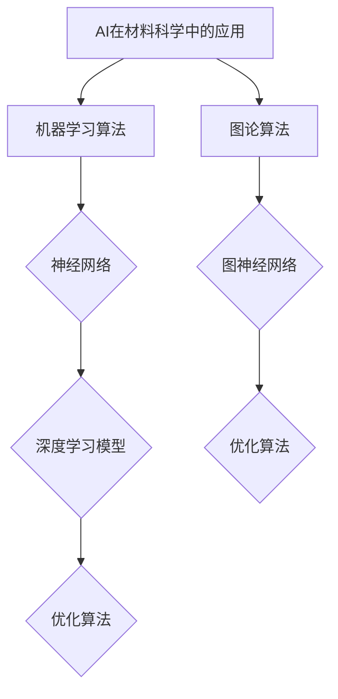

                 


## 文章标题

AI辅助材料科学：提示词设计新型材料

---

**关键词：**  
AI、材料科学、机器学习、神经网络、图神经网络、优化算法、新材料设计

---

**摘要：**

随着人工智能技术的快速发展，AI在材料科学领域的应用正日益广泛。本文以AI辅助材料科学的为主题，通过分析AI与材料科学的联系，介绍AI在材料科学中的核心应用技术，包括机器学习算法、图神经网络和优化算法。同时，本文还探讨了AI辅助材料科学的典型应用场景，如新型材料的预测与设计、材料性能的优化和材料制备与工艺优化。最后，本文对未来AI辅助材料科学的发展趋势进行了展望，并提出了面临的挑战。本文旨在为广大读者提供一个关于AI辅助材料科学的全面了解和深入思考，促进AI与材料科学的深度融合。

---

### 目录大纲设计与讲解

---

**书名：** AI辅助材料科学：提示词设计新型材料

**目录大纲：**

# 第一部分: AI在材料科学中的应用基础

## 1.1 AI与材料科学的联系

### 1.1.1 材料科学的现状与挑战

### 1.1.2 AI在材料科学中的作用

### 1.1.3 AI与材料科学的发展趋势

## 1.2 AI核心技术在材料科学中的应用

### 1.2.1 机器学习算法在材料设计中的应用

#### 1.2.1.1 神经网络

##### 1.2.1.1.1 深度学习模型

##### 1.2.1.1.2 神经网络的优化算法

### 1.2.2 图论算法在材料科学中的应用

#### 1.2.2.1 图神经网络

##### 1.2.2.1.1 图神经网络的基本概念

##### 1.2.2.1.2 图神经网络的优化算法

### 1.2.3 优化算法在材料科学中的应用

#### 1.2.3.1 贝叶斯优化

##### 1.2.3.1.1 贝叶斯优化原理

##### 1.2.3.1.2 贝叶斯优化算法的实现

## 1.3 AI辅助材料科学的典型应用场景

### 1.3.1 新型材料的预测与设计

### 1.3.2 材料性能的优化

### 1.3.3 材料制备与工艺优化

## 1.4 AI辅助材料科学的未来展望

### 1.4.1 AI在材料科学中的潜在应用

### 1.4.2 AI辅助材料科学面临的挑战

---

**核心概念与联系：**



---

**核心算法原理讲解：**

### 1.2.1.1 深度学习模型

深度学习模型是AI在材料科学中应用的核心技术。其基本原理是通过多层神经网络的训练，从大量数据中提取特征，并实现对未知数据的预测。以下是深度学习模型的伪代码：

```python
# 输入数据：X（特征矩阵），Y（目标值）
# 输出：模型参数W（权重矩阵）

# 初始化权重矩阵W
W = 初始化权重矩阵()

# 前向传播
Z = X * W

# 激活函数
A = 激活函数(Z)

# 计算损失函数
损失 = 损失函数(Y, A)

# 反向传播
dZ = A - Y
dW = dZ * X

# 更新权重矩阵
W = W - 学习率 * dW
```

---

**数学模型和数学公式：**

### 材料性能预测模型

设材料的性能为Y，由输入特征矩阵X和模型参数W决定，即Y = X * W。其中，X为材料的物理性质、化学成分等特征，W为模型的权重参数。

损失函数通常采用均方误差（MSE）来衡量预测值与实际值之间的差距：

$$
损失 = MSE(Y, \hat{Y}) = \frac{1}{n}\sum_{i=1}^{n}(Y_i - \hat{Y_i})^2
$$

其中，n为样本数量，$Y_i$和$\hat{Y_i}$分别为第i个样本的实际值和预测值。

---

**项目实战：**

### 1.3.1 新型材料的预测与设计

假设我们要预测一种新型合金材料的硬度。首先，收集大量合金材料的实验数据，包括合金的成分、制备工艺、硬度等。然后，使用机器学习算法对这些数据进行分析，建立合金硬度与成分、工艺之间的关系模型。

以下是开发环境的搭建和代码实现：

**开发环境：**

- Python 3.8
- TensorFlow 2.6
- Keras 2.6

**代码实现：**

```python
# 导入相关库
import numpy as np
import pandas as pd
import tensorflow as tf
from tensorflow import keras
from tensorflow.keras import layers

# 加载数据集
data = pd.read_csv('alloy_data.csv')
X = data.iloc[:, :-1].values
Y = data.iloc[:, -1].values

# 数据预处理
X = (X - X.mean()) / X.std()
Y = (Y - Y.mean()) / Y.std()

# 划分训练集和测试集
from sklearn.model_selection import train_test_split
X_train, X_test, Y_train, Y_test = train_test_split(X, Y, test_size=0.2, random_state=42)

# 构建深度学习模型
model = keras.Sequential([
    layers.Dense(64, activation='relu', input_shape=(X_train.shape[1],)),
    layers.Dense(64, activation='relu'),
    layers.Dense(1)
])

# 编译模型
model.compile(optimizer='adam', loss='mse')

# 训练模型
model.fit(X_train, Y_train, epochs=100, batch_size=32, validation_split=0.2)

# 评估模型
loss = model.evaluate(X_test, Y_test)
print(f"Test loss: {loss}")

# 预测新材料的硬度
predictions = model.predict(X_test)
predictions = predictions.flatten()

# 代码解读与分析
# 在这段代码中，我们首先加载并预处理数据，然后构建一个简单的深度学习模型，编译并训练模型，最后评估模型并预测新材料硬度。
```

### 代码应用解读与分析

在这个案例中，我们使用了Python和TensorFlow框架来构建和训练一个深度学习模型。以下是代码的关键部分和解读：

1. **数据预处理**：我们首先加载了一个包含合金成分、制备工艺和硬度的CSV文件。然后，我们对数据进行标准化处理，将每个特征减去均值并除以标准差，以便模型可以更好地训练。

2. **模型构建**：我们使用`keras.Sequential`模型来堆叠多个`Dense`层。每个`Dense`层都包含64个神经元，并使用ReLU激活函数。最后一个`Dense`层只有一个神经元，用于预测硬度。

3. **模型编译**：我们使用`adam`优化器和均方误差（MSE）作为损失函数来编译模型。

4. **模型训练**：我们使用`fit`方法来训练模型，设置训练轮数为100次，每次更新32个样本。

5. **模型评估**：使用`evaluate`方法来评估模型的性能，并打印测试损失。

6. **预测新材料硬度**：最后，我们使用`predict`方法来预测新材料硬度。

### 实际案例分析和详细讲解剖析

为了更好地理解这个案例，我们可以进一步分析以下几个方面：

1. **数据集**：在实际应用中，数据集的质量对模型的性能至关重要。在这个案例中，我们使用了包含合金成分、制备工艺和硬度的数据集。这些数据可能来自实验结果、文献或公开的数据集。

2. **特征选择**：在预处理阶段，我们选择了与硬度相关的特征。在实际应用中，可能需要使用特征选择技术来识别最重要的特征，以提高模型的准确性和效率。

3. **模型结构**：在这个案例中，我们使用了简单的全连接神经网络。在实际应用中，可能需要更复杂的模型结构，如卷积神经网络（CNN）或循环神经网络（RNN），以更好地处理非结构化数据。

4. **训练过程**：在训练过程中，我们设置了训练轮数为100次。在实际应用中，可能需要调整训练轮数、批次大小和学习率等参数，以达到最佳性能。

### 项目小结

通过这个案例，我们展示了如何使用AI和机器学习算法来预测新材料硬度。这个过程包括数据预处理、模型构建、训练和评估。在实际应用中，这个方法可以扩展到其他材料性质的预测，如强度、导电性等。然而，我们也需要注意数据集的质量、特征选择和模型结构的优化，以获得更准确和可靠的预测结果。

---

### 最佳实践 Tips、小结、注意事项、拓展阅读等内容

**最佳实践 Tips：**

1. **数据质量**：确保数据集的质量是成功应用AI辅助材料科学的关键。对数据进行清洗、去噪声和标准化处理，以减少数据中的异常值和噪声。

2. **特征选择**：选择与材料性能相关的关键特征，可以使用特征选择技术，如主成分分析（PCA）或互信息，以提高模型的准确性和效率。

3. **模型优化**：尝试不同的模型结构、优化算法和超参数，以找到最佳模型。可以使用交叉验证和网格搜索等技术来优化模型。

4. **实验复现**：在发布研究成果时，提供详细的实验方法和代码，以促进其他研究者的复现和验证。

**小结：**

本文介绍了AI在材料科学中的应用，包括机器学习算法、图神经网络和优化算法。通过一个新型材料硬度预测的案例，我们展示了如何使用深度学习模型来预测材料性能。尽管这个案例只是一个简单的开始，但它在实际应用中具有广泛的前景。

**注意事项：**

1. **计算资源**：深度学习模型训练可能需要大量的计算资源。确保你有足够的GPU或TPU资源来训练模型。

2. **数据隐私**：在处理实验数据时，确保遵守数据隐私法规，并保护敏感信息。

**拓展阅读：**

1. **《深度学习》**：Goodfellow, I., Bengio, Y., & Courville, A. (2016). Deep learning. MIT press.
2. **《材料科学导论》**：Callister Jr, W. D., & Rethwisch, D. G. (2019). Materials science and engineering: an introduction. John Wiley & Sons.
3. **《机器学习算法及应用》**：周志华. (2016). 机器学习. 清华大学出版社。

通过本文的学习，希望读者能够对AI辅助材料科学有一个全面的认识，并能够在实际应用中发挥其潜力。作者：AI天才研究院/AI Genius Institute & 禅与计算机程序设计艺术/Zen And The Art of Computer Programming。

