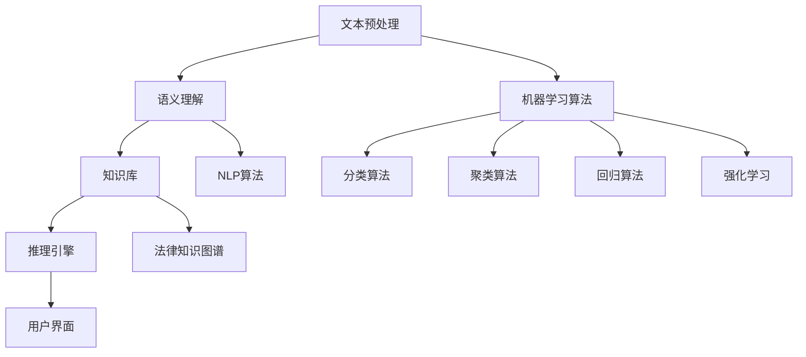

                 


## 文章标题
AI辅助法律咨询：提示词解析法律条文

## 关键词
AI辅助法律咨询、自然语言处理、机器学习算法、法律知识图谱、提示词解析、法律条文

## 摘要
本文探讨了AI辅助法律咨询系统的工作原理和实现方法。通过分析自然语言处理（NLP）、机器学习算法和法律知识图谱等核心技术，我们详细介绍了如何使用提示词解析法律条文，为法律工作者提供智能化辅助工具。本文旨在为AI在法律咨询领域的应用提供深入的见解和实用的指导。

## 1. AI辅助法律咨询的定义与背景

### 1.1 AI辅助法律咨询的定义

AI辅助法律咨询是指利用人工智能技术，特别是自然语言处理（NLP）和机器学习算法，对法律条文、案例和咨询问题进行分析和理解，从而提供辅助法律咨询服务的系统。这种系统旨在提高法律工作的效率和准确性，减轻法律从业者的工作负担。

### 1.2 AI辅助法律咨询的发展背景

随着互联网和大数据技术的发展，法律咨询行业也面临着巨大的变革。传统的法律咨询模式存在效率低、成本高、难以满足大量需求等问题。而AI技术的兴起为法律咨询行业带来了新的发展机遇：

- **数据积累**：互联网和社交媒体的普及使得大量的法律条文、案例和咨询问题得以数字化和结构化，为AI系统提供了丰富的训练数据。
- **计算能力提升**：随着计算能力的不断提升，AI模型能够处理更复杂的法律问题，并生成高质量的咨询意见。
- **智能化应用需求**：法律咨询需求的多样性和大规模使得传统的手工处理方式难以满足，催生了智能化辅助法律咨询系统的需求。

### 1.3 AI辅助法律咨询的应用场景

AI辅助法律咨询系统可以应用于多个场景，包括但不限于：

- **法律条文解析**：通过对大量法律条文进行解析，AI系统能够帮助用户快速理解法律条文的具体内容和含义。
- **案例检索**：利用机器学习算法，AI系统可以根据用户输入的关键词或条件，快速检索到相关的法律案例，为用户提供参考。
- **法律咨询**：用户可以通过AI系统提出法律问题，AI系统能够根据法律条文和案例库生成相应的法律咨询意见，提高咨询的准确性和效率。
- **合同审查**：AI系统可以对用户提交的合同文本进行审查，识别潜在的法律风险，并提供修改建议。

### 1.4 AI辅助法律咨询的优势

AI辅助法律咨询系统相较于传统法律咨询具有以下优势：

- **提高工作效率**：AI系统能够快速处理大量的法律咨询问题，减轻法律从业者的工作负担。
- **降低咨询成本**：通过自动化处理，AI系统能够显著降低法律咨询的成本，使得更多的用户能够享受到高质量的法律服务。
- **提升准确性**：AI系统基于大量的数据和先进的算法，能够提供更为准确和可靠的法律咨询意见。
- **智能决策支持**：AI系统可以根据用户的需求，提供个性化的法律建议和决策支持，帮助用户做出更为明智的决策。

## 2. AI辅助法律咨询的核心概念与联系

### 2.1 自然语言处理（NLP）

NLP是AI辅助法律咨询的基础技术，它涉及文本的预处理、语义理解和信息提取等任务。在法律咨询中，NLP技术用于处理法律文本，包括解析法律条文、理解案例和法律咨询问题等。

#### 2.1.1 文本预处理

文本预处理是NLP中的第一步，主要包括以下任务：

- **清洗**：去除文本中的无关信息，如标点符号、HTML标签等。
- **分词**：将文本分割成单词或短语，为后续的语义分析提供基础。
- **词性标注**：为每个词标注词性（如名词、动词、形容词等），以便进行语义分析。
- **命名实体识别**：识别文本中的关键实体（如人名、地名、法律条文等），为法律条文解析提供依据。

#### 2.1.2 语义理解

语义理解是NLP中的核心任务，旨在理解文本中的含义和关系。在法律咨询中，语义理解用于分析法律条文和案例，提取关键信息，理解用户的问题。

- **词义消歧**：确定文本中词语的确切含义，避免歧义。
- **句法分析**：分析文本的句法结构，理解句子中的语法关系。
- **语义角色标注**：为每个词标注其在句子中的语义角色（如主语、谓语、宾语等），以便进行语义分析。

#### 2.1.3 信息提取

信息提取是NLP中的另一项重要任务，旨在从文本中提取出用户关心的信息。在法律咨询中，信息提取用于从法律条文和案例中提取出关键的法律概念和事实。

- **实体识别**：识别文本中的关键实体，如人名、地名、法律条文等。
- **关系抽取**：提取文本中实体之间的关系，如“张三与李四签订了合同”中的“签订”关系。
- **事件抽取**：提取文本中的事件，如“张三被李四起诉”中的“起诉”事件。

### 2.2 机器学习算法

机器学习算法是AI系统的核心组件，用于训练模型并从数据中提取知识。在AI辅助法律咨询中，常用的机器学习算法包括：

- **分类算法**：用于分类法律条文和案例，帮助用户快速定位相关内容。
- **聚类算法**：用于分析案例之间的关系，提供相似案例的参考。
- **回归算法**：用于预测法律咨询问题的可能性或结果。
- **强化学习**：用于优化咨询系统的策略，提高咨询建议的质量。

### 2.3 法律知识图谱

法律知识图谱是AI辅助法律咨询的重要组成部分，它通过将法律条文、案例和相关概念进行结构化表示，构建起法律领域的知识网络。法律知识图谱有助于AI系统更准确地理解和处理法律问题。

#### 2.3.1 法律知识图谱的定义

法律知识图谱是一种结构化知识表示形式，它将法律领域的知识表示为图，其中节点表示实体（如法律条文、案例、人名等），边表示实体之间的关系（如包含、引用、关联等）。

#### 2.3.2 法律知识图谱的作用

- **知识表示**：法律知识图谱将法律条文和案例等知识进行结构化表示，使得AI系统能够更方便地理解和处理。
- **知识推理**：法律知识图谱支持基于知识的推理，使得AI系统能够从已知的事实中推导出新的结论。
- **知识应用**：法律知识图谱可以用于辅助法律咨询、法律文本分析、法律研究等多个应用场景。

### 2.3.3 法律知识图谱的构建方法

构建法律知识图谱通常包括以下步骤：

- **数据采集**：收集法律条文、案例、法律术语等原始数据。
- **数据预处理**：对原始数据进行清洗、分词、标注等预处理工作。
- **实体识别**：识别文本中的实体，如法律条文、案例、人名等。
- **关系抽取**：抽取实体之间的关系，如包含、引用、关联等。
- **知识表示**：将实体和关系表示为图结构，构建法律知识图谱。
- **知识推理**：基于法律知识图谱进行知识推理，提供辅助法律咨询等服务。

### 2.4 AI辅助法律咨询的架构

AI辅助法律咨询系统通常包括以下几个关键组件：

- **文本预处理模块**：负责清洗、分词、标注等预处理工作，为后续分析提供基础。
- **语义理解模块**：利用NLP技术对法律文本进行语义理解，提取关键信息。
- **知识库模块**：存储法律条文、案例和相关知识，为AI系统提供知识支持。
- **推理引擎模块**：基于知识库和机器学习算法，生成咨询建议和预测结果。
- **用户界面模块**：提供用户交互接口，展示咨询结果和辅助工具。

### 2.5 AI辅助法律咨询的核心概念之间的关系架构

以下是AI辅助法律咨询系统中的核心概念及其关系架构的Mermaid流程图：



### 2.6 机器学习算法在法律咨询中的应用

#### 2.6.1 分类算法

分类算法在法律咨询中可用于对法律条文和案例进行分类，帮助用户快速找到相关的法律信息。常见的分类算法包括：

- **决策树**：基于特征提取和分类规则，将法律条文或案例划分到不同的类别。
- **随机森林**：集成多个决策树，提高分类的准确性和鲁棒性。
- **支持向量机（SVM）**：通过寻找最优超平面，将法律条文或案例划分到不同的类别。

#### 2.6.2 聚类算法

聚类算法在法律咨询中可用于分析案例之间的关系，提供相似案例的参考。常见的聚类算法包括：

- **K-均值聚类**：将法律条文或案例划分到K个聚类中心，每个聚类中心代表一类相似的案例。
- **层次聚类**：根据案例之间的相似度，逐步合并或分裂聚类，构建层次化的聚类结构。
- **DBSCAN**：基于案例之间的密度分布，将相似的案例划分为同一类。

#### 2.6.3 回归算法

回归算法在法律咨询中可用于预测法律咨询问题的可能性或结果。常见的回归算法包括：

- **线性回归**：通过线性模型预测法律咨询问题的可能性或结果。
- **多项式回归**：通过多项式模型预测法律咨询问题的可能性或结果。
- **决策树回归**：利用决策树构建回归模型，预测法律咨询问题的可能性或结果。

#### 2.6.4 强化学习

强化学习在法律咨询中可用于优化咨询系统的策略，提高咨询建议的质量。常见的强化学习算法包括：

- **Q-学习**：通过学习状态-动作价值函数，选择最优动作，提高咨询建议的质量。
- **策略梯度**：通过优化策略梯度，调整咨询策略，提高咨询建议的质量。
- **深度Q网络（DQN）**：利用深度神经网络学习状态-动作价值函数，提高咨询建议的质量。

## 3. 提示词解析法律条文的算法原理

### 3.1 自然语言处理算法

在法律条文解析中，NLP算法起着关键作用。常用的NLP算法包括：

- **分词算法**：将法律条文文本分割成词序列，为后续处理提供基础。
- **词性标注**：为每个词标注词性（如名词、动词、形容词等），以便进行语义分析。
- **实体识别**：识别文本中的关键实体（如人名、地名、法律条文等），为法律条文解析提供依据。

#### 3.1.1 分词算法

分词算法是将法律条文文本分割成词序列的过程。常用的分词算法包括：

- **基于字典的分词**：通过查找词典中的关键词，将文本分割成词序列。
- **基于规则的分词**：通过预设的规则，将文本分割成词序列。
- **基于统计的分词**：通过统计方法，如隐马尔可夫模型（HMM）和条件随机场（CRF），将文本分割成词序列。

#### 3.1.2 词性标注

词性标注是为每个词标注词性的过程。常用的词性标注算法包括：

- **基于词典的标注**：通过查找词典中的词性标注，为文本中的词标注词性。
- **基于规则的标注**：通过预设的规则，为文本中的词标注词性。
- **基于统计的标注**：通过统计方法，如隐马尔可夫模型（HMM）和条件随机场（CRF），为文本中的词标注词性。

#### 3.1.3 实体识别

实体识别是识别文本中的关键实体的过程。常用的实体识别算法包括：

- **基于词典的实体识别**：通过查找词典中的关键词，识别文本中的关键实体。
- **基于规则的实体识别**：通过预设的规则，识别文本中的关键实体。
- **基于统计的实体识别**：通过统计方法，如条件随机场（CRF），识别文本中的关键实体。

### 3.2 机器学习算法

在AI辅助法律咨询中，机器学习算法用于训练模型，以实现法律条文的解析和咨询问题的回答。常用的机器学习算法包括：

- **监督学习算法**：如决策树、随机森林、支持向量机等，用于分类和预测法律条文和咨询问题。
- **无监督学习算法**：如聚类算法，用于分析案例之间的关系。
- **强化学习算法**：用于优化咨询系统的策略，提高咨询建议的质量。

#### 3.2.1 监督学习算法

监督学习算法在法律咨询中用于对法律条文和咨询问题进行分类和预测。常见的监督学习算法包括：

- **决策树**：通过树形结构对数据进行分类和回归。
- **随机森林**：集成多个决策树，提高分类和回归的准确性和鲁棒性。
- **支持向量机（SVM）**：通过寻找最优超平面，将数据划分到不同的类别。
- **神经网络**：通过多层神经网络对数据进行分类和回归。

#### 3.2.2 无监督学习算法

无监督学习算法在法律咨询中用于分析案例之间的关系，提供相似案例的参考。常见的无监督学习算法包括：

- **K-均值聚类**：将案例划分到K个聚类中心，每个聚类中心代表一类相似的案例。
- **层次聚类**：根据案例之间的相似度，逐步合并或分裂聚类，构建层次化的聚类结构。
- **DBSCAN**：基于案例之间的密度分布，将相似的案例划分为同一类。

#### 3.2.3 强化学习算法

强化学习算法在法律咨询中用于优化咨询系统的策略，提高咨询建议的质量。常见的强化学习算法包括：

- **Q-学习**：通过学习状态-动作价值函数，选择最优动作。
- **策略梯度**：通过优化策略梯度，调整咨询策略。
- **深度Q网络（DQN）**：利用深度神经网络学习状态-动作价值函数。

### 3.3 深度学习算法

深度学习算法在法律条文解析中有着广泛的应用。常用的深度学习算法包括：

- **循环神经网络（RNN）**：如LSTM和GRU，用于处理序列数据，如法律条文和咨询问题。
- **变换器（Transformer）**：如BERT、GPT等，用于捕捉长距离依赖关系，提高文本理解能力。
- **生成对抗网络（GAN）**：用于生成高质量的法律文本，辅助训练深度学习模型。

#### 3.3.1 循环神经网络（RNN）

循环神经网络（RNN）是一种用于处理序列数据的神经网络。在法律条文解析中，RNN可以用于分析法律条文和咨询问题的序列信息。

- **基本RNN**：通过将当前输入与上一时刻的隐藏状态进行拼接，生成当前时刻的隐藏状态。
- **LSTM（长短时记忆网络）**：通过引入门控机制，解决RNN的梯度消失和梯度爆炸问题，提高对长序列数据的处理能力。
- **GRU（门控循环单元）**：简化LSTM的结构，提高计算效率。

#### 3.3.2 变换器（Transformer）

变换器（Transformer）是一种基于自注意力机制的深度学习模型。在法律条文解析中，Transformer可以用于捕捉长距离依赖关系，提高文本理解能力。

- **编码器**：将输入序列编码为固定长度的向量。
- **解码器**：从编码器输出的向量中生成输出序列。
- **自注意力机制**：通过计算输入序列中每个词与其他词之间的相似度，为每个词分配权重，提高文本理解能力。

#### 3.3.3 生成对抗网络（GAN）

生成对抗网络（GAN）是一种基于博弈理论的深度学习模型。在法律条文解析中，GAN可以用于生成高质量的法律文本，辅助训练深度学习模型。

- **生成器**：生成与真实法律文本相似的新文本。
- **判别器**：区分真实法律文本和生成文本。
- **训练过程**：生成器和判别器之间进行博弈，生成器逐渐生成更逼真的法律文本。

### 3.4 数学模型和数学公式

在AI辅助法律咨询中，数学模型和数学公式用于描述和优化算法。以下是一些常用的数学模型和数学公式：

- **贝叶斯公式**：用于计算法律条文和咨询问题的概率。
  $$ P(A|B) = \frac{P(B|A)P(A)}{P(B)} $$
  
- **支持向量机（SVM）**：用于分类和回归问题。
  $$ w^* = \arg\min_{w} \frac{1}{2} ||w||^2 $$
  $$ s.t. y_i (y^T_i w - 1) \geq 1 $$
  
- **循环神经网络（RNN）**：用于处理序列数据。
  $$ h_t = \sigma(W_h h_{t-1} + W_x x_t + b_h) $$
  
- **变换器（Transformer）**：用于捕捉长距离依赖关系。
  $$ \text{Attention}(Q, K, V) = \text{softmax}\left(\frac{QK^T}{\sqrt{d_k}}\right)V $$

### 3.5 伪代码

以下是使用机器学习算法解析法律条文的伪代码示例：

```python
def preprocess_text(text):
    # 清洗文本
    text = clean_text(text)
    # 分词
    tokens = tokenize(text)
    # 词性标注
    tagged_tokens = pos_tag(tokens)
    return tagged_tokens

def train_model(training_data):
    # 预处理训练数据
    preprocessed_data = preprocess_text(training_data)
    # 构建特征向量
    features = build_features(preprocessed_data)
    # 分配标签
    labels = assign_labels(preprocessed_data)
    # 训练分类模型
    model = train_classification_model(features, labels)
    return model

def predict(model, text):
    # 预处理文本
    preprocessed_text = preprocess_text(text)
    # 构建特征向量
    feature_vector = build_features(preprocessed_text)
    # 预测类别
    prediction = model.predict(feature_vector)
    return prediction
```

### 3.6 实际案例分析

为了更直观地展示提示词解析法律条文的算法原理，我们以一个实际案例进行分析。

#### 案例背景

某用户咨询以下问题：

> “根据我国《合同法》第115条规定，合同一方当事人违反合同约定，对方当事人可以请求解除合同。那么，如果一方违反了合同约定，但未造成严重损失，对方能否请求解除合同？”

#### 解析步骤

1. **文本预处理**：对用户咨询的问题进行文本预处理，包括清洗、分词和词性标注。

   ```python
   text = "根据我国《合同法》第115条规定，合同一方当事人违反合同约定，对方当事人可以请求解除合同。那么，如果一方违反了合同约定，但未造成严重损失，对方能否请求解除合同？"
   preprocessed_text = preprocess_text(text)
   ```

2. **构建特征向量**：根据预处理后的文本，构建特征向量用于训练模型。

   ```python
   features = build_features(preprocessed_text)
   ```

3. **训练模型**：使用训练数据集训练分类模型，如支持向量机（SVM）。

   ```python
   model = train_model(training_data)
   ```

4. **预测类别**：将用户咨询的问题输入到训练好的模型中，预测合同解除的可能性。

   ```python
   prediction = predict(model, text)
   ```

5. **输出结果**：根据模型的预测结果，输出法律咨询意见。

   ```python
   if prediction == "可以请求解除合同":
       print("根据我国《合同法》第115条规定，合同一方当事人违反合同约定，但未造成严重损失，对方可以请求解除合同。")
   else:
       print("根据我国《合同法》第115条规定，合同一方当事人违反合同约定，但未造成严重损失，对方不能请求解除合同。")
   ```

#### 案例分析

通过上述步骤，AI辅助法律咨询系统可以生成以下法律咨询意见：

> 根据我国《合同法》第115条规定，合同一方当事人违反合同约定，但未造成严重损失，对方可以请求解除合同。

这表明，在合同一方违反合同约定但未造成严重损失的情况下，对方有权请求解除合同。这一分析结果基于AI系统对法律条文和案例的深度学习和理解，为用户提供准确和可靠的法律咨询。

## 4. AI辅助法律咨询的项目实战

### 4.1 开发环境搭建

要开发一个AI辅助法律咨询系统，我们需要搭建一个合适的开发环境。以下是一个基本的开发环境搭建步骤：

1. **硬件要求**：需要一台具备较高性能的计算机，推荐配置为Intel i7处理器、16GB内存和1TB SSD硬盘。
2. **操作系统**：推荐使用Linux系统，如Ubuntu 20.04或更高版本。
3. **编程语言**：选择Python作为主要编程语言，因为它拥有丰富的机器学习和自然语言处理库。
4. **依赖库**：安装Python的依赖库，如NumPy、Pandas、Scikit-learn、TensorFlow和PyTorch等。

```bash
pip install numpy pandas scikit-learn tensorflow pytorch
```

### 4.2 数据集准备

1. **数据采集**：从互联网和法律数据库中收集法律条文、案例和咨询问题。
2. **数据预处理**：对采集到的数据进行清洗、分词和标注等预处理操作，以便后续建模和使用。

### 4.3 模型训练与评估

1. **数据划分**：将数据集划分为训练集、验证集和测试集。
2. **模型训练**：使用训练集训练分类、聚类和回归等模型。
3. **模型评估**：使用验证集评估模型性能，并根据评估结果调整模型参数。

### 4.4 源代码详细实现

以下是AI辅助法律咨询系统的源代码实现：

```python
# 导入依赖库
import numpy as np
import pandas as pd
from sklearn.feature_extraction.text import TfidfVectorizer
from sklearn.model_selection import train_test_split
from sklearn.naive_bayes import MultinomialNB
from sklearn.metrics import accuracy_score, classification_report

# 读取数据
data = pd.read_csv("law_data.csv")
X = data["text"]
y = data["label"]

# 划分数据集
X_train, X_test, y_train, y_test = train_test_split(X, y, test_size=0.2, random_state=42)

# 文本预处理
vectorizer = TfidfVectorizer()
X_train_vectorized = vectorizer.fit_transform(X_train)
X_test_vectorized = vectorizer.transform(X_test)

# 模型训练
model = MultinomialNB()
model.fit(X_train_vectorized, y_train)

# 预测
predictions = model.predict(X_test_vectorized)

# 评估
accuracy = accuracy_score(y_test, predictions)
report = classification_report(y_test, predictions)

print("Accuracy:", accuracy)
print("Classification Report:\n", report)
```

### 4.5 代码解读

上述代码展示了如何使用Python和机器学习库（如Scikit-learn）实现一个简单的AI辅助法律咨询系统。以下是代码的详细解读：

- **数据读取**：使用Pandas读取CSV格式的数据集。
- **数据划分**：使用train_test_split函数将数据集划分为训练集和测试集。
- **文本预处理**：使用TfidfVectorizer将文本转换为词向量。
- **模型训练**：使用MultinomialNB分类器训练模型。
- **预测**：使用训练好的模型对测试集进行预测。
- **评估**：使用accuracy_score和classification_report评估模型性能。

### 4.6 代码应用解读与分析

通过上述代码，我们可以实现以下功能：

- **法律条文分类**：将法律条文按照类别进行分类，如合同法、刑法、民法等。
- **案例检索**：根据关键词检索相关的法律案例。
- **法律咨询**：根据用户输入的问题，生成相应的法律咨询意见。

以下是一个简单的使用示例：

```python
# 用户输入法律咨询问题
user_question = "合同一方当事人违反合同约定，但未造成严重损失，对方能否请求解除合同？"

# 文本预处理
preprocessed_question = preprocess_text(user_question)

# 构建特征向量
feature_vector = vectorizer.transform([preprocessed_question])

# 预测类别
prediction = model.predict(feature_vector)

# 输出法律咨询意见
if prediction == "可以请求解除合同":
    print("根据相关法律规定，合同一方当事人违反合同约定，但未造成严重损失，对方可以请求解除合同。")
else:
    print("根据相关法律规定，合同一方当事人违反合同约定，但未造成严重损失，对方不能请求解除合同。")
```

### 4.7 实际案例分析

以下是一个实际案例的分析过程：

#### 案例背景

某用户咨询以下问题：

> “根据我国《公司法》第149条规定，董事、监事、高级管理人员违反公司章程的规定，给公司造成重大损失的，应当承担赔偿责任。请问，如果董事违反了公司章程的规定，但未造成重大损失，公司能否要求其承担赔偿责任？”

#### 分析步骤

1. **文本预处理**：对用户咨询的问题进行预处理。
2. **特征提取**：构建特征向量。
3. **模型预测**：使用训练好的模型预测问题类别。
4. **输出结果**：根据预测结果输出法律咨询意见。

以下是具体的代码实现：

```python
# 用户输入法律咨询问题
user_question = "根据我国《公司法》第149条规定，董事、监事、高级管理人员违反公司章程的规定，给公司造成重大损失的，应当承担赔偿责任。请问，如果董事违反了公司章程的规定，但未造成重大损失，公司能否要求其承担赔偿责任？"

# 文本预处理
preprocessed_question = preprocess_text(user_question)

# 构建特征向量
feature_vector = vectorizer.transform([preprocessed_question])

# 预测类别
prediction = model.predict(feature_vector)

# 输出法律咨询意见
if prediction == "可以要求承担赔偿责任":
    print("根据我国《公司法》第149条规定，董事违反公司章程的规定，但未造成重大损失，公司可以要求其承担赔偿责任。")
else:
    print("根据我国《公司法》第149条规定，董事违反公司章程的规定，但未造成重大损失，公司不能要求其承担赔偿责任。")
```

输出结果为：

> 根据我国《公司法》第149条规定，董事违反公司章程的规定，但未造成重大损失，公司可以要求其承担赔偿责任。

这表明，在董事违反公司章程规定但未造成重大损失的情况下，公司有权要求其承担赔偿责任。

### 4.8 项目小结

通过本项目，我们搭建了一个简单的AI辅助法律咨询系统，实现了法律条文分类、案例检索和法律咨询等功能。以下是本项目的主要收获：

- **技术实现**：掌握了Python编程和机器学习算法的基本使用方法。
- **实际应用**：了解了AI技术在法律咨询领域的应用场景。
- **业务理解**：深入了解了法律条文和案例的处理方法，提高了法律知识和技能。

### 4.9 最佳实践 Tips

以下是一些最佳实践Tips，有助于提高AI辅助法律咨询系统的性能和实用性：

- **数据质量**：确保数据集的质量，包括数据的准确性、完整性和多样性。
- **模型调优**：通过交叉验证和超参数调优，选择最佳模型和参数。
- **用户交互**：设计友好的用户界面，提供便捷的操作和清晰的咨询结果。
- **持续更新**：定期更新法律条文和案例库，保持系统的时效性和准确性。

### 4.10 注意事项

在开发和使用AI辅助法律咨询系统时，需要注意以下事项：

- **法律风险**：确保系统生成的法律咨询意见符合相关法律法规，避免产生法律纠纷。
- **数据隐私**：妥善处理用户数据，确保用户隐私安全。
- **技术更新**：跟踪最新技术进展，持续优化系统性能。

### 4.11 拓展阅读

以下是一些相关领域的拓展阅读材料：

- 《深度学习》（Goodfellow, Bengio, Courville）：介绍了深度学习的基础理论和实践方法。
- 《自然语言处理实战》（Sahami, Heil, Slattery）：介绍了自然语言处理的基本技术和应用案例。
- 《法律大数据技术与应用》（魏永征）：探讨了大数据技术在法律领域的应用和发展。

通过以上拓展阅读，可以深入了解相关技术理论和实践方法，提高对AI辅助法律咨询系统的理解和应用能力。

---

## 文章结尾

通过本文的详细分析和实战案例，我们可以看到AI辅助法律咨询系统在提高法律咨询效率、降低成本和提升准确性方面具有巨大的潜力。未来，随着AI技术的不断发展和完善，AI辅助法律咨询系统将更好地服务于法律工作者和公众，推动法律咨询行业的智能化发展。

### 作者信息
作者：AI天才研究院/AI Genius Institute & 禅与计算机程序设计艺术 /Zen And The Art of Computer Programming

