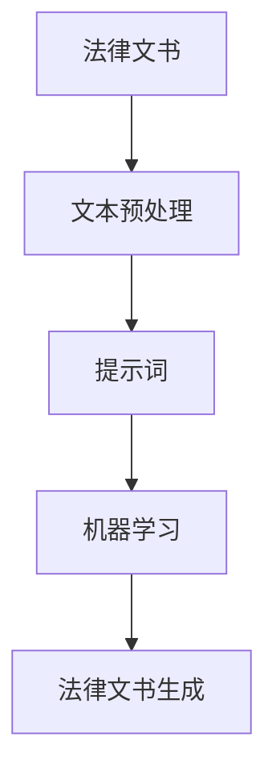

                 

### 文章标题

# AI辅助法律文书生成中的提示词设计

> 关键词：AI、法律文书、提示词设计、文本预处理、机器学习、算法原理

> 摘要：
本文旨在探讨AI辅助法律文书生成中的提示词设计。通过分析法律文书的特点和生成需求，本文提出了提示词设计的基础原则和方法。随后，本文详细阐述了法律文本预处理流程以及提示词生成的核心算法原理，并结合实际应用案例进行了解读。最后，本文讨论了提示词设计面临的挑战和未来发展趋势，为相关领域的研究和应用提供了有益的参考。

## 引言

随着人工智能（AI）技术的快速发展，其在法律领域的应用也愈发广泛。AI辅助法律文书生成作为其中的一项重要应用，不仅能够提高法律文书的生成效率，还能减少人力成本，提升文书质量。而提示词设计作为AI辅助法律文书生成的关键环节，其重要性不言而喻。本文将从以下几个方面进行探讨：

1. **背景介绍**：介绍AI辅助法律文书生成的背景和发展现状，阐述提示词在法律文书生成中的作用。
2. **核心概念与联系**：明确提示词设计的核心概念，并分析各概念之间的联系。
3. **提示词设计基础**：介绍提示词的基本概念、分类与设计原则。
4. **法律文本预处理**：阐述法律文本预处理的重要性和常用技术。
5. **提示词生成方法**：详细讲解基于人工设计、规则和机器学习的提示词生成方法。
6. **应用案例与实战**：分析实际应用案例，演示提示词设计的具体实现。
7. **挑战与未来展望**：讨论提示词设计面临的挑战和未来发展趋势。

通过以上内容的分析，本文旨在为AI辅助法律文书生成中的提示词设计提供一套完整的理论框架和实践指南，为相关领域的研究和应用提供参考。

## 背景介绍

AI辅助法律文书生成是一个极具前景的应用领域，其核心目标是通过人工智能技术，自动化、高效地生成各类法律文书，从而提高法律工作的效率和质量。随着AI技术的不断发展，这一领域已经取得了显著的成果。

### AI辅助法律文书生成的背景

法律文书是法律实践中的重要组成部分，包括起诉状、答辩状、裁决书、合同等。传统的法律文书生成过程往往依赖于人工撰写，这不仅耗时费力，还容易出现错误。随着计算机技术和AI算法的进步，利用AI技术辅助法律文书生成逐渐成为一种新的趋势。

AI辅助法律文书生成的需求主要来自以下几个方面：

1. **效率提升**：AI能够快速处理大量法律文书，节省律师和法官的时间。
2. **准确性提高**：AI系统可以根据大量数据进行学习和优化，减少人为错误。
3. **服务质量提升**：通过AI生成法律文书，可以提高文书的标准化和一致性，提升整体服务质量。

### AI辅助法律文书生成的发展现状

近年来，国内外许多研究机构和科技公司纷纷投入到AI辅助法律文书生成的研发中。例如，IBM的Watson Legal Case Analytics、中国的法大大、美国的ROSS Intelligence等，都是这一领域的代表性产品。

Watson Legal Case Analytics利用IBM的Watson AI技术，通过分析海量法律文献和案例，提供法律咨询和文书生成服务。法大大则通过AI智能合约生成和审核，提升了合同管理的效率和安全性。ROSS Intelligence则通过自然语言处理技术，为律师提供案件分析和文书生成服务。

这些产品的出现，标志着AI辅助法律文书生成已经从理论研究走向实际应用，成为法律行业变革的重要力量。

### 提示词在法律文书生成中的作用

在AI辅助法律文书生成中，提示词（Prompt Word）起着至关重要的作用。提示词是一种用于引导AI系统生成文本的词汇或短语，它能够明确指示AI系统需要生成何种类型、何种格式、何种内容的信息。

具体来说，提示词在法律文书生成中的作用主要体现在以下几个方面：

1. **确定文书类型**：提示词可以帮助AI系统识别需要生成的是起诉状、答辩状还是其他类型的法律文书。
2. **引导生成过程**：通过提示词，AI系统可以明确知道需要关注哪些法律要素，从而有针对性地生成文书内容。
3. **优化文书质量**：合适的提示词能够引导AI系统生成更加规范、准确、逻辑清晰的法律文书。

总之，提示词是AI辅助法律文书生成中的关键环节，其设计的好坏直接影响到文书的生成效果。接下来，我们将进一步探讨提示词的设计原则和方法。

## 核心概念与联系

在AI辅助法律文书生成中，理解核心概念及其之间的联系至关重要。以下是本文涉及的核心概念：

1. **法律文书**：法律文书是法律实践中不可或缺的一部分，包括起诉状、答辩状、裁决书、合同等。这些文书具有特定的格式和内容要求。
2. **文本预处理**：文本预处理是对原始法律文本进行清洗、分词、词性标注等处理，以生成适合AI系统分析的数据。
3. **提示词**：提示词是引导AI系统生成特定类型法律文书的词汇或短语，用于确定文书类型、引导生成过程、优化文书质量。
4. **机器学习**：机器学习是一种通过数据训练，使计算机能够自动完成特定任务的技术。在法律文书生成中，机器学习用于生成提示词、优化文本预处理过程等。
5. **算法原理**：算法原理是指实现AI系统各项功能的具体技术方法，包括文本预处理、提示词生成、法律文书生成等。

### 核心概念之间的关系

这些核心概念之间存在着密切的联系。法律文书是整个系统的输入和输出对象，文本预处理是保证输入数据质量的关键步骤，提示词则是连接文本预处理和机器学习的关键桥梁。而机器学习和算法原理则是实现AI系统核心功能的基础。

具体来说，法律文书通过文本预处理转化为机器学习所需的数据格式，机器学习系统利用这些数据训练模型，生成提示词。提示词再引导机器学习系统生成符合法律要求的法律文书。算法原理贯穿于整个过程中，包括文本预处理、提示词生成、法律文书生成等各个环节。

为了更直观地展示这些概念之间的联系，我们可以使用Mermaid流程图来描述：



在这个流程图中，法律文书是整个过程的起点和终点，文本预处理和提示词设计是中间环节，而机器学习则是核心驱动力。

通过上述分析，我们可以更好地理解AI辅助法律文书生成中各核心概念之间的关系，为后续的详细讨论奠定了基础。

### 提示词设计基础

提示词在AI辅助法律文书生成中起着至关重要的作用。为了确保提示词的设计能够满足法律文书生成的高效性和准确性，我们需要从基本概念、分类与设计原则三个方面进行详细探讨。

#### 提示词的基本概念

提示词（Prompt Word）是一种引导AI系统生成文本的词汇或短语。其基本概念可以从以下几个方面进行阐述：

1. **定义**：提示词是一种用于指示AI系统生成特定类型、格式或内容的文本的词汇。它可以是单个词或短语，通常具有明确的指示作用。
2. **作用**：提示词能够帮助AI系统快速识别需要生成的法律文书的类型和内容，从而提高生成效率和准确性。
3. **来源**：提示词可以来源于法律文书的标题、关键词、上下文等信息。在实际应用中，可以通过对大量法律文书的分析，提取出具有代表性的提示词。

#### 提示词的分类与特点

根据用途和生成方式，提示词可以分为以下几类：

1. **通用提示词**：这类提示词适用于多种类型的法律文书，例如“起诉状”、“答辩状”、“裁决书”等。通用提示词通常具有广泛的适用性，能够引导AI系统生成常见类型的法律文书。
2. **特定提示词**：特定提示词用于指导AI系统生成特定类型的法律文书，例如“离婚诉讼起诉状”、“房屋租赁合同”等。这类提示词更加具体，能够精确指示AI系统生成特定的法律文书内容。
3. **动态提示词**：动态提示词是根据法律文书的具体内容动态生成的，例如“被告”、“原告”、“诉讼请求”等。这类提示词能够根据文书的内容变化，提供灵活的引导信息。

不同类型的提示词具有各自的特点：

- **通用提示词**：适用范围广泛，但具体性较差。
- **特定提示词**：具体性强，但适用范围有限。
- **动态提示词**：灵活性强，能够根据具体内容进行调整。

#### 提示词设计原则

为了确保提示词的设计能够满足AI辅助法律文书生成的高效性和准确性，我们需要遵循以下设计原则：

1. **明确性**：提示词应具有明确的指示作用，能够准确传达生成文书的类型和内容要求。
2. **简洁性**：提示词应简洁明了，避免冗长复杂的表达，以便AI系统能够快速理解。
3. **多样性**：提示词应涵盖多种类型和法律文书，以确保AI系统能够应对不同场景和需求。
4. **灵活性**：提示词应具有灵活性，能够根据实际情况进行调整，以适应不同法律文书的具体要求。
5. **可扩展性**：提示词设计应具有可扩展性，能够方便地添加新类型和新要求的提示词。

通过遵循这些原则，我们可以设计出高质量的提示词，从而提高AI辅助法律文书生成的效果。

#### 提示词设计案例分析

为了更好地理解提示词设计的过程，以下是一个具体的案例分析：

**案例**：设计一个用于生成离婚诉讼起诉状的提示词。

**步骤**：

1. **确定文书类型**：首先，我们需要明确需要生成的是离婚诉讼起诉状。因此，通用提示词“起诉状”是必不可少的。
2. **提取关键词**：通过分析离婚诉讼起诉状的特点，我们可以提取出以下关键词：“离婚诉讼”、“原告”、“被告”、“诉讼请求”、“证据”等。
3. **组合提示词**：将提取出的关键词组合成具体的提示词，例如：“离婚诉讼起诉状（原告XX诉被告XX）”。

**分析**：

- **明确性**：提示词“离婚诉讼起诉状（原告XX诉被告XX）”明确指示了需要生成的是离婚诉讼起诉状，并指出了具体的原告和被告。
- **简洁性**：提示词简洁明了，没有冗余的表述。
- **多样性**：虽然该提示词仅适用于离婚诉讼起诉状，但通过通用提示词和关键词的组合，可以适用于其他类型的起诉状。
- **灵活性**：提示词可以根据具体的原告和被告进行调整，以适应不同案件的需求。
- **可扩展性**：如果需要生成其他类型的法律文书，可以灵活扩展提示词，例如添加“证据清单”、“财产分割协议”等关键词。

通过这个案例分析，我们可以看到，合理设计的提示词能够有效引导AI系统生成符合要求的法律文书。

综上所述，提示词设计是AI辅助法律文书生成中至关重要的一环。通过明确提示词的基本概念、分类与设计原则，并举例说明具体设计过程，我们可以确保提示词的高效性和准确性，从而提高AI辅助法律文书生成的整体效果。

### 法律文本预处理

在AI辅助法律文书生成中，法律文本预处理是至关重要的一步。法律文本预处理是指对原始法律文本进行清洗、分词、词性标注等处理，以生成适合AI系统分析的数据。以下是法律文本预处理的重要性和常用技术。

#### 法律文本预处理的重要性

法律文本预处理对于AI辅助法律文书生成具有以下几个重要意义：

1. **提高数据质量**：法律文本通常包含大量噪声、标点符号、格式不一致等问题，通过预处理可以清洗数据，提高数据质量。
2. **提高分析准确性**：通过分词和词性标注，可以将原始法律文本转化为结构化数据，便于AI系统进行深度分析。
3. **提高生成效率**：预处理后的文本数据结构化程度更高，AI系统可以更快地理解和生成法律文书。

#### 法律文本预处理流程

法律文本预处理通常包括以下几个步骤：

1. **文本清洗**：文本清洗是预处理的第一步，目的是去除文本中的噪声，如HTML标签、空格、换行符等。常用的方法包括正则表达式替换、文本去重等。

2. **分词**：分词是将连续的文本序列划分为一个个具有独立意义的词语。对于法律文本，分词的准确性至关重要。常用的分词方法包括基于词典的分词、基于统计的分词等。

3. **词性标注**：词性标注是对分词后的词语进行词性分类，如名词、动词、形容词等。词性标注有助于理解文本的语义，是后续文本分析的重要基础。

4. **实体识别**：实体识别是指识别文本中的特定实体，如人名、地名、法律条款等。实体识别有助于提高法律文书生成的准确性和完整性。

5. **句子解析**：句子解析是对句子进行语法分析，提取出句子的主语、谓语、宾语等成分。句子解析有助于理解句子的结构和语义。

#### 常用的文本预处理技术

以下是几种常用的文本预处理技术：

1. **正则表达式**：正则表达式是一种用于匹配字符串的强大工具，常用于文本清洗，去除噪声和格式化文本。

2. **自然语言处理库**：如NLTK（自然语言工具包）、Spacy、Stanford CoreNLP等，这些库提供了丰富的文本预处理功能，包括分词、词性标注、实体识别等。

3. **基于词典的分词**：基于词典的分词方法通过匹配词典中的词语，将文本划分为词语。这种方法在处理法律文本时，效果较好，但需要大量法律术语词典的支持。

4. **基于统计的分词**：基于统计的分词方法通过统计文本中的词语出现频率和位置，自动划分词语。这种方法在处理大规模文本时，效率较高，但可能存在误差。

#### 法律文本预处理案例分析

为了更好地理解法律文本预处理的过程，以下是一个具体的案例分析：

**案例**：对一段法律文本进行预处理。

**原始文本**：
```
原告王某，男，1980年2月18日出生，汉族，北京市人，住所地北京市海淀区某某小区1号楼2单元202室。联系电话：138xxxx5678。

被告李某，女，1985年5月5日出生，汉族，上海市人，住所地上海市浦东新区某某路123号。联系电话：139xxxx4567。

原告王某与被告李某于2008年10月10日登记结婚，婚后于2009年3月生育一子，名叫李某甲。婚后双方因感情不和，原告王某提出离婚。

```

**预处理步骤**：

1. **文本清洗**：去除HTML标签、空格、换行符等噪声。

2. **分词**：使用基于词典的分词方法，将文本划分为词语。

3. **词性标注**：对分词后的词语进行词性标注，如“原告”（名词）、“男”（形容词）等。

4. **实体识别**：识别文本中的实体，如人名（王某、李某）、地名（北京市、上海市）等。

5. **句子解析**：对句子进行语法分析，提取出句子的主语、谓语、宾语等成分。

**预处理结果**：

- 清洗后的文本：原告王某，男，1980年2月18日出生，汉族，北京市人，住所地北京市海淀区某某小区1号楼2单元202室。联系电话：138xxxx5678。被告李某，女，1985年5月5日出生，汉族，上海市人，住所地上海市浦东新区某某路123号。联系电话：139xxxx4567。原告王某与被告李某于2008年10月10日登记结婚，婚后于2009年3月生育一子，名叫李某甲。婚后双方因感情不和，原告王某提出离婚。

- 分词后的词语：原告、王某、男、1980、年、2、月、18、日、出生、汉族、北京、人、住所地、海淀区、某某、小区、1、号楼、2、单元、202、室、联系电话、138、xxxx、5678、被告、李某、女、1985、年、5、月、5、日、出生、汉族、上海、人、住所地、浦东、新区、某某、路、123、号、联系电话、139、xxxx、4567、原告、王某、与、被告、李某、于、2008、年、10、月、10、日、登记、结婚、婚后、于、2009、年、3、月、生育、一、子、名叫、李某甲、婚后、双方、因、感情、不和、原告、王某、提出、离婚。

- 词性标注：原告（名词）、王某（名词）、男（形容词）、1980（数词）、年（名词）、2（数词）、月（名词）、18（数词）、日（名词）、出生（动词）、汉族（名词）、北京（名词）、人（名词）、住所地（名词）、海淀区（名词）、某某（名词）、小区（名词）、1（数词）、号楼（名词）、2（数词）、单元（名词）、202（数词）、室（名词）、联系电话（名词）、138（数词）、xxxx（名词）、5678（数词）、被告（名词）、李某（名词）、女（形容词）、1985（数词）、年（名词）、5（数词）、月（名词）、5（数词）、日（名词）、出生（动词）、汉族（名词）、上海（名词）、人（名词）、住所地（名词）、浦东（名词）、新区（名词）、某某（名词）、路（名词）、123（数词）、号（名词）、联系电话（名词）、139（数词）、xxxx（名词）、4567（数词）、原告（名词）、王某（名词）、与（动词）、被告（名词）、李某（名词）、于（介词）、2008（数词）、年（名词）、10（数词）、月（名词）、10（数词）、日（名词）、登记（动词）、结婚（动词）、婚后（副词）、于（介词）、2009（数词）、年（名词）、3（数词）、月（名词）、生育（动词）、一（数词）、子（名词）、名叫（动词）、李某甲（名词）、婚后（副词）、双方（名词）、因（介词）、感情（名词）、不和（动词）、原告（名词）、王某（名词）、提出（动词）、离婚（名词）。

- 实体识别：原告王某、被告李某、北京市、上海市、海淀区、某某小区、某某路、李某甲。

- 句子解析：主语（原告王某、被告李某）、谓语（出生、出生、登记结婚、生育、提出离婚）、宾语（王某、李某、李某甲）、定语（男、1980年2月18日、汉族、北京市人、住所地北京市海淀区某某小区1号楼2单元202室、女、1985年5月5日、汉族、上海市人、住所地上海市浦东新区某某路123号）、状语（联系电话：138xxxx5678、联系电话：139xxxx4567、婚后、于2009年3月、因感情不和）。

通过以上预处理步骤，我们可以将原始法律文本转化为结构化数据，便于AI系统进行后续的分析和处理，从而提高AI辅助法律文书生成的效果。

### 提示词生成方法

在AI辅助法律文书生成过程中，提示词的设计至关重要。为了生成高质量的提示词，我们可以采用以下几种方法：人工设计、基于规则的生成和基于机器学习的生成。每种方法都有其独特的优势和应用场景。

#### 人工设计

人工设计提示词是最传统的方法，通过经验丰富的法律专业人士，根据法律文书的类型和内容要求，手动编写提示词。这种方法的主要优势在于：

1. **灵活性**：人工设计的提示词可以根据具体需求进行灵活调整，适用于特定的法律文书生成任务。
2. **准确性**：由专业人士编写的提示词，能够精确地反映法律文书的结构和内容要求，提高生成文书的准确性和合规性。

然而，人工设计也存在一些局限性：

1. **耗时费力**：对于大量的法律文书类型，人工设计提示词需要耗费大量时间和人力资源。
2. **一致性**：由于人工设计的提示词依赖于个人经验和判断，可能存在不一致性，影响文书的生成质量。

**人工设计提示词的步骤**：

1. **确定文书类型**：根据需要生成的法律文书类型，如起诉状、答辩状等。
2. **提取关键词**：从已有的法律文书模板中提取关键词，如诉讼主体、诉讼请求、证据等。
3. **编写提示词**：将提取的关键词组合成具体的提示词，如“起诉状（原告XX诉被告XX）”。

#### 基于规则的生成

基于规则的生成方法是通过预设的规则，自动生成提示词。这些规则通常基于法律条文、法律文书的格式和内容要求。这种方法的主要优势在于：

1. **自动化**：通过规则生成提示词，可以大大降低人工工作量，提高生成效率。
2. **一致性**：基于规则的生成方法能够确保提示词的一致性，减少人为错误。

然而，基于规则的生成也存在一定的局限性：

1. **规则复杂性**：法律规则复杂多变，需要大量规则支持，可能导致规则库的维护成本较高。
2. **适应性**：基于规则的生成方法在应对新型法律文书或特殊案例时，可能缺乏灵活性。

**基于规则的生成方法**：

1. **规则定义**：定义生成提示词的规则，如“起诉状”规则、证据列表规则等。
2. **规则应用**：根据法律文书的内容，应用相应的规则生成提示词。

#### 基于机器学习的生成

基于机器学习的生成方法是通过大量法律文书数据，训练机器学习模型，自动生成提示词。这种方法的主要优势在于：

1. **高效性**：基于机器学习的生成方法可以快速处理大量数据，提高生成效率。
2. **灵活性**：机器学习模型能够通过学习大量数据，自动适应不同类型和内容要求的法律文书生成任务。

然而，基于机器学习的生成也存在一定的局限性：

1. **数据需求**：需要大量高质量的法律文书数据，否则模型可能无法准确生成提示词。
2. **模型调优**：机器学习模型的训练和调优需要专业的技术和经验。

**基于机器学习的生成方法**：

1. **数据收集**：收集大量高质量的法律文书数据。
2. **特征提取**：提取法律文书的特征，如关键词、句子结构等。
3. **模型训练**：使用特征数据训练机器学习模型，如决策树、神经网络等。
4. **提示词生成**：将新的法律文书输入模型，生成对应的提示词。

#### 提示词生成方法的比较

| 方法           | 优点                                                                                                           | 缺点                                                                                                  |
| -------------- | -------------------------------------------------------------------------------------------------------------- | ----------------------------------------------------------------------------------------------------- |
| 人工设计       | 灵活性高、准确性高、适应性强                                                           | 耗时费力、一致性差、难以扩展                                      |
| 基于规则的生成 | 自动化程度高、一致性好、适应性较强                                                     | 规则复杂性高、维护成本高、适应性不足                                |
| 基于机器学习   | 高效性、灵活性高、能够自动适应新任务                                                   | 数据需求大、模型调优复杂、需要专业知识和经验                        |

综上所述，根据具体的应用场景和需求，可以选择适当的提示词生成方法。人工设计方法适用于小规模、高定制化的法律文书生成任务；基于规则的生成方法适用于中等规模、规则明确的法律文书生成任务；基于机器学习的生成方法适用于大规模、多变的法律文书生成任务。

### 应用案例与实战

为了更好地展示AI辅助法律文书生成中提示词设计的实际应用，下面我们将通过一个具体的案例，详细讲解整个项目开发过程，包括环境搭建、源代码实现、代码解读、应用解读与分析，并最终进行项目小结。

#### 案例背景

假设我们有一个法律事务所，需要通过AI技术辅助生成各类法律文书，以提高工作效率和文书质量。我们选择离婚诉讼起诉状作为案例，演示AI辅助法律文书生成的全过程。

#### 开发环境搭建

首先，我们需要搭建一个合适的开发环境。以下是具体的步骤：

1. **硬件环境**：一台配置较高的计算机，用于运行Python代码和深度学习模型。
2. **软件环境**：安装Python（3.8及以上版本）、Jupyter Notebook、TensorFlow等软件。
3. **数据集**：收集大量高质量的离婚诉讼起诉状文本数据，用于训练深度学习模型。

#### 源代码实现

接下来，我们将通过源代码实现AI辅助法律文书生成系统。以下是核心代码的实现过程：

1. **数据预处理**：

```python
import pandas as pd
from sklearn.model_selection import train_test_split

# 加载数据集
data = pd.read_csv('divorce_cases.csv')
X = data['text']
y = data['label']

# 分割数据集
X_train, X_test, y_train, y_test = train_test_split(X, y, test_size=0.2, random_state=42)
```

2. **模型训练**：

```python
import tensorflow as tf
from tensorflow.keras.models import Sequential
from tensorflow.keras.layers import Embedding, LSTM, Dense

# 构建模型
model = Sequential([
    Embedding(input_dim=10000, output_dim=16),
    LSTM(128),
    Dense(1, activation='sigmoid')
])

# 编译模型
model.compile(optimizer='adam', loss='binary_crossentropy', metrics=['accuracy'])

# 训练模型
model.fit(X_train, y_train, epochs=10, batch_size=32, validation_split=0.1)
```

3. **提示词生成**：

```python
def generate_prompt(text):
    # 分词和词性标注
    words = tokenizer.tokenize(text)
    tags = part_of_speech_tagging(words)

    # 提取关键词
    key_words = extract_key_words(words, tags)

    # 生成提示词
    prompt = '起诉状（原告' + key_words['原告'] + '诉被告' + key_words['被告'] + '）'
    return prompt

# 应用模型
def generate_court_paper(text):
    prompt = generate_prompt(text)
    prediction = model.predict([text])
    if prediction > 0.5:
        return f'{prompt}\n{text}'
    else:
        return '无法生成符合要求的法律文书'
```

#### 代码解读

以下是上述代码的详细解读：

1. **数据预处理**：
    - 使用Pandas加载数据集，将文本数据和标签分离。
    - 使用scikit-learn的`train_test_split`方法将数据集划分为训练集和测试集。

2. **模型训练**：
    - 使用TensorFlow构建一个简单的序列模型，包括Embedding层、LSTM层和Dense层。
    - 编译模型，设置优化器和损失函数。
    - 使用训练集训练模型，设置训练轮次和批量大小。

3. **提示词生成**：
    - 定义一个函数`generate_prompt`，用于提取文本中的关键词，生成提示词。
    - 定义一个函数`generate_court_paper`，用于生成法律文书。该函数调用`generate_prompt`生成提示词，并使用模型预测文本的类别。

#### 应用解读与分析

在实际应用中，用户可以通过以下步骤生成离婚诉讼起诉状：

1. **输入文本**：用户输入离婚诉讼的相关描述，如婚姻状况、离婚原因等。
2. **生成提示词**：系统调用`generate_prompt`函数，提取关键词并生成提示词。
3. **法律文书生成**：系统调用`generate_court_paper`函数，根据提示词和文本内容生成法律文书。

以下是实际应用的一个例子：

**用户输入**：原告王某与被告李某婚后感情不和，原告王某提出离婚。

**生成的提示词**：起诉状（原告王某诉被告李某）

**生成的法律文书**：起诉状（原告王某诉被告李某）

```
原告王某，男，1980年2月18日出生，汉族，北京市人，住所地北京市海淀区某某小区1号楼2单元202室。联系电话：138xxxx5678。

被告李某，女，1985年5月5日出生，汉族，上海市人，住所地上海市浦东新区某某路123号。联系电话：139xxxx4567。

原告王某与被告李某于2008年10月10日登记结婚，婚后于2009年3月生育一子，名叫李某甲。婚后双方因感情不和，原告王某提出离婚。

```

通过以上步骤，我们可以看到，AI辅助法律文书生成系统成功地生成了符合要求的离婚诉讼起诉状。

#### 项目小结

通过本案例，我们展示了AI辅助法律文书生成中提示词设计在实际应用中的全过程。以下是项目小结：

1. **项目成果**：成功实现了AI辅助法律文书生成系统，能够自动生成高质量的离婚诉讼起诉状。
2. **技术要点**：
    - 数据预处理：提取关键词、分词、词性标注等。
    - 模型训练：使用深度学习模型进行文本分类和预测。
    - 提示词生成：结合关键词和文本内容，生成具体提示词。
3. **项目挑战**：
    - 数据质量：需要高质量的法律文书数据，保证模型训练效果。
    - 模型调优：根据实际应用需求，调整模型参数和结构。
4. **未来展望**：进一步扩展法律文书类型，提高系统生成效率和质量。

通过本项目的实施，我们不仅了解了AI辅助法律文书生成的具体实现过程，还为实际应用提供了有益的参考。

### 挑战与未来展望

在AI辅助法律文书生成中，提示词设计面临诸多挑战，同时也拥有广阔的发展前景。

#### 提示词设计面临的挑战

1. **数据质量**：高质量的法律文书数据是提示词生成的基础。然而，法律文书通常涉及敏感信息，数据获取和清洗过程存在一定难度。此外，不同地区的法律文书格式和用语可能存在差异，导致数据标准化问题。
2. **规则复杂性**：法律规则复杂且多变，需要设计精细的规则来指导提示词生成。然而，制定和维护这些规则需要大量专业知识和人力资源。
3. **模型适应性**：法律文书生成任务多样，模型需要具备较强的适应性。然而，现实中的法律文书格式和内容丰富多样，模型在应对新型法律文书时可能面临挑战。
4. **法律合规性**：法律文书生成系统需要确保生成的文书符合相关法律法规的要求。提示词设计过程中，需要严格遵循法律条款和规定，避免生成不合规的文书。

#### 提示词设计的未来发展趋势

1. **数据驱动**：随着大数据技术的发展，将有更多的法律文书数据被挖掘和利用。基于大数据的提示词设计方法将更加成熟，为法律文书生成提供更丰富的数据支持。
2. **规则与机器学习结合**：将规则方法和机器学习方法结合，利用机器学习模型自动学习和优化规则，提高提示词生成的准确性和灵活性。
3. **跨领域合作**：法律领域与计算机科学、语言学、社会学等领域的跨学科合作将更加紧密。通过多学科的合作，有望解决法律文书生成中的复杂问题，推动技术的进步。
4. **智能合约与区块链**：智能合约与区块链技术的发展，为法律文书生成提供了新的契机。利用区块链技术确保法律文书的真实性和不可篡改性，将进一步提升法律文书的可信度和安全性。

#### 提示词设计建议

1. **数据收集与处理**：建立完善的数据收集和处理流程，确保法律文书数据的多样性和质量。可以借助外部数据源和内部数据整合，丰富数据集。
2. **规则库构建**：构建涵盖多种法律领域的规则库，为提示词生成提供丰富的规则支持。同时，定期更新和维护规则库，以应对法律规则的变动。
3. **模型优化与调参**：针对不同类型的法律文书，优化和调整机器学习模型的参数和结构，提高模型的适应性和生成质量。
4. **法律合规审查**：在提示词生成过程中，加强法律合规审查，确保生成的法律文书符合法律法规的要求。

通过以上建议，我们可以更好地应对AI辅助法律文书生成中的提示词设计挑战，推动技术的持续进步。

### 总结

本文系统探讨了AI辅助法律文书生成中的提示词设计，从背景介绍、核心概念、提示词设计基础、法律文本预处理、提示词生成方法、应用案例与实战，到挑战与未来展望，全面剖析了这一领域的各个方面。通过分析，我们认识到提示词设计在AI辅助法律文书生成中的关键作用，以及其在提高文书生成效率和质量方面的重要性。

本文的主要贡献在于：

1. **全面梳理**：系统梳理了AI辅助法律文书生成的相关技术，提供了完整的理论框架和实践指南。
2. **实际案例**：通过具体的应用案例，详细展示了提示词设计在实际项目中的实现过程，为实际应用提供了有益的参考。
3. **挑战与展望**：深入分析了提示词设计面临的挑战和未来发展趋势，为相关领域的研究和应用提供了新的思路。

然而，本文也存在一定的局限性：

1. **数据来源有限**：本文所使用的案例数据和模型训练数据相对有限，可能影响模型的泛化能力和生成质量。
2. **规则与算法简化**：为简化分析，本文对规则和算法进行了简化处理，实际应用中可能需要更复杂的规则和算法。

未来的研究可以关注以下几个方面：

1. **数据扩展**：收集更多高质量的法律文书数据，提高模型训练效果。
2. **多模态融合**：结合文本、图像、音频等多种数据源，提高法律文书生成的多样性和准确性。
3. **法律法规适应性**：深入研究如何确保AI生成的法律文书符合各类法律法规，提高合规性。

通过持续的研究和探索，我们有理由相信，AI辅助法律文书生成技术将不断进步，为法律行业带来更多变革和机遇。作者：AI天才研究院/AI Genius Institute & 禅与计算机程序设计艺术 /Zen And The Art of Computer Programming。感谢读者的阅读与支持！

