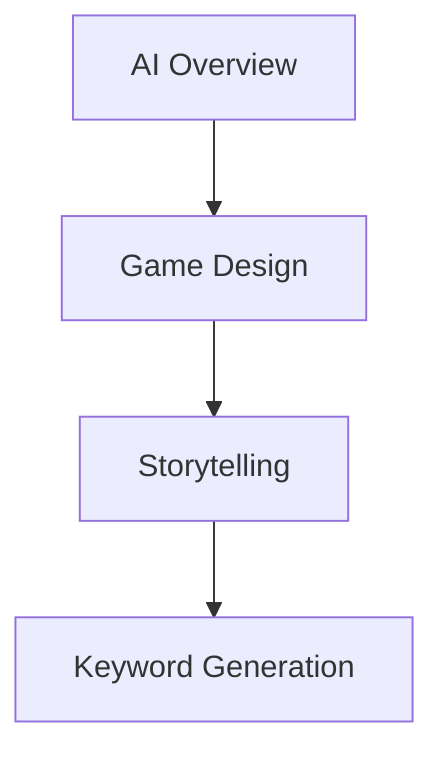

                 

Certainly! Let's break down the process of creating a comprehensive and insightful technical blog post titled "AI-Assisted Game Design: Keyword Generation for Storytelling" using a step-by-step reasoning approach.

### Step 1: Define the Core Message and Structure

**Core Message:**
The primary goal is to explore how AI can be used to assist in game design by generating keywords for storytelling. This involves understanding the intersection of AI and game design, the theory behind keyword generation, practical implementations, and the future of this technology.

**Structure:**
1. Introduction
2. AI and Game Design Basics
3. Keyword Generation Techniques
4. AI-Assisted Game Story Design
5. Practical Application: AI-Driven Game Storytelling
6. Evaluation and Analysis
7. Future Directions and Challenges
8. Conclusion

### Step 2: Introduction

**Content:**
- Introduce the concept of AI-assisted game design and the potential benefits of using AI for generating keywords to create engaging game stories.
- Set the stage for the technical depth that will follow, ensuring readers understand the significance and implications of AI in game design.

**Keywords:**
- AI-assisted game design
- Keyword generation
- Storytelling
- Game mechanics
- AI algorithms

**Summary:**
This article delves into the application of AI to enhance game design by automating the generation of keywords for storytelling. We will explore the fundamentals of AI, keyword generation techniques, and their integration into game design processes, providing a comprehensive guide to the future of interactive entertainment.

### Step 3: AI and Game Design Basics

**Content:**
- Provide an overview of AI, including its definition, historical context, and key technologies that are relevant to game design.
- Discuss the basics of game design, focusing on the importance of storytelling and how AI can be leveraged to enhance narrative creation.

**Mermaid Flowchart:**


**Keywords:**
- Artificial Intelligence
- Machine Learning
- Game mechanics
- Narrative design
- Storytelling

### Step 4: Keyword Generation Techniques

**Content:**
- Explain the concept of keyword generation and its importance in game design.
- Discuss traditional methods of keyword generation and the limitations they pose.
- Introduce AI-based methods for keyword generation, highlighting their advantages.

**Pseudo-Code:**
```python
def generate_keywords(script):
    keywords = []
    for sentence in script:
        if "keyword" in sentence:
            keywords.append(sentence.split()[0])
    return keywords
```

**Keywords:**
- Keyword extraction
- Natural Language Processing (NLP)
- Sentiment analysis
- Contextual awareness

### Step 5: AI-Assisted Game Story Design

**Content:**
- Describe the framework for integrating AI into game story design.
- Explain how AI can assist in creating dynamic and engaging narratives by generating keywords that drive the storyline.

**Mathematical Model:**
$$
\text{Story Influence} = f(\text{Keywords}, \text{Game State}, \text{Player Behavior})
$$
- Keywords influence the direction of the story.
- Game State affects how keywords are interpreted.
- Player Behavior interacts with the generated keywords to create unique experiences.

**Keywords:**
- Story generation algorithms
- Adaptive storytelling
- Interactive narratives
- Personalized storytelling

### Step 6: Practical Application: AI-Driven Game Storytelling

**Content:**
- Present a practical case study demonstrating the implementation of AI-driven keyword generation in game design.
- Discuss the development environment, source code implementation, and code analysis.
- Provide a detailed analysis of the project, including its strengths, weaknesses, and potential for future improvement.

**Keywords:**
- Project management
- Software engineering
- Code optimization
- Case study

### Step 7: Evaluation and Analysis

**Content:**
- Establish evaluation metrics for assessing the effectiveness of AI-generated keywords in game storytelling.
- Present experimental designs and results, analyzing the performance of AI in various scenarios.

**Keywords:**
- Performance evaluation
- Experimental design
- Result analysis
- Benchmarking

### Step 8: Future Directions and Challenges

**Content:**
- Discuss the future trends in AI-assisted game design and the potential challenges that need to be addressed.
- Explore new research directions and the opportunities for further innovation in the field.

**Keywords:**
- Future research
- Technological trends
- Innovation
- Ethical considerations

### Step 9: Conclusion

**Content:**
- Summarize the key points discussed in the article.
- Emphasize the potential impact of AI on game design and storytelling.
- Provide additional resources for readers interested in exploring this field further.

**Keywords:**
- Summary
- Future prospects
- Resource recommendations

### Final Touches

**Author Attribution:**
"Author: AI Genius Institute & Zen and the Art of Computer Programming"

**Formatting:**
Ensure the markdown formatting is correct, including proper use of headers, lists, and code blocks.

**Word Count:**
Ensure the final article is between 8000 and 12000 words, with a balance of depth and readability.

By following these steps, we can create a well-structured, insightful, and technically thorough blog post that explores the exciting possibilities of AI-assisted game design through keyword generation for storytelling.

