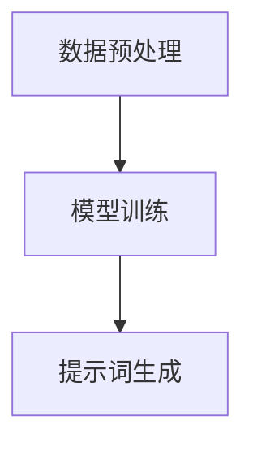

                 


### 文章标题

《AI辅助电影剧本创作：提示词生成情节架构》

### 文章关键词

- AI与电影剧本
- 提示词生成
- 情节架构设计
- 算法原理
- 项目实战

### 文章摘要

本文旨在探讨人工智能在电影剧本创作中的应用，尤其是通过提示词生成来构建情节架构的方法。我们将逐步分析AI技术如何辅助编剧，从核心概念、算法原理、数学模型到实际项目实战，全面解析AI辅助电影剧本创作的全过程。

### 目录

1. **背景介绍**
   1.1 **AI在电影行业中的应用**
   1.2 **电影剧本创作中的痛点**
   1.3 **本文的目标与结构**

2. **核心概念与联系**
   2.1 **AI与电影剧本创作的关系**
   2.2 **提示词生成算法基础**
   2.3 **情节架构设计的要点**

3. **核心算法原理讲解**
   3.1 **提示词生成算法原理**
   3.2 **伪代码讲解与流程图展示**
   3.3 **数学模型与公式**

4. **情节架构设计方法**
   4.1 **故事结构分析**
   4.2 **情节构建技巧**
   4.3 **AI辅助下的情节优化策略**

5. **AI辅助剧本创作实战**
   5.1 **开发环境搭建**
   5.2 **源代码实现与解读**
   5.3 **代码应用分析与案例剖析**
   5.4 **项目小结与评估**

6. **最佳实践 tips**
   6.1 **剧本创作中的AI应用技巧**
   6.2 **避免常见误区**
   6.3 **未来展望与趋势分析**

7. **小结**
   7.1 **文章总结**
   7.2 **影响与意义**

8. **注意事项**
   8.1 **操作安全**
   8.2 **数据保护**
   8.3 **版权与伦理问题**

9. **拓展阅读**
   9.1 **相关书籍推荐**
   9.2 **AI电影剧本创作最新研究**

### 作者信息

作者：AI天才研究院/AI Genius Institute & 禅与计算机程序设计艺术 /Zen And The Art of Computer Programming

### 文章正文

#### 1. 背景介绍

##### 1.1 AI在电影行业中的应用

随着人工智能技术的快速发展，AI逐渐渗透到电影行业的各个领域。从特效制作、演员表演分析，到剧本创作，AI都在发挥着重要作用。尤其是在剧本创作方面，AI可以通过自然语言处理（NLP）和机器学习算法，生成剧情、角色设定和对话等元素，大大提高了编剧的效率。

##### 1.2 电影剧本创作中的痛点

传统的电影剧本创作过程往往充满挑战。编剧需要花费大量时间和精力来构思情节、设计角色和编写对话。同时，还要确保故事逻辑连贯、角色性格鲜明，以及情节引人入胜。然而，这些工作常常因为创意枯竭、时间紧迫或资源有限而受到限制。

##### 1.3 本文的目标与结构

本文旨在探讨如何利用AI技术，特别是提示词生成算法，来辅助电影剧本创作。我们将从核心概念、算法原理、数学模型到实际项目实战，全面解析AI辅助电影剧本创作的全过程。文章结构如下：

1. 背景介绍
2. 核心概念与联系
3. 核心算法原理讲解
4. 情节架构设计方法
5. AI辅助剧本创作实战
6. 最佳实践 tips
7. 小结
8. 注意事项
9. 拓展阅读

#### 2. 核心概念与联系

##### 2.1 AI与电影剧本创作的关系

AI在电影剧本创作中的应用主要体现在以下几个方面：

- **剧情生成**：AI可以根据用户提供的主题或关键词，自动生成完整的剧情大纲。
- **角色设计**：AI可以基于剧情需求，自动生成角色设定和性格特点。
- **对话编写**：AI可以通过分析大量剧本和对话数据，自动生成符合情境的对话。
- **情节优化**：AI可以对已有的剧本进行优化，提高故事的逻辑性和可读性。

##### 2.2 提示词生成算法基础

提示词生成是AI辅助电影剧本创作的重要环节。提示词生成算法的基本原理是通过学习大量的剧本数据，提取关键信息，并根据用户提供的主题或关键词，生成相关的提示词。

- **数据集构建**：首先，需要构建一个包含大量剧本数据的语料库。
- **特征提取**：从语料库中提取关键特征，如关键词、主题、情节等。
- **模型训练**：使用机器学习算法，如循环神经网络（RNN）或变压器（Transformer），对特征进行训练，以生成提示词。

##### 2.3 情节架构设计的要点

情节架构设计是电影剧本创作中的核心环节。一个成功的电影剧本需要有明确的情节架构，包括起承转合等元素。情节架构设计的要点如下：

- **起**：引入故事背景和主要角色。
- **承**：展示主人公面临的问题或冲突。
- **转**：主人公在冲突中不断尝试解决问题，但总是遇到挫折。
- **合**：主人公最终克服困难，实现目标。

#### 3. 核心算法原理讲解

##### 3.1 提示词生成算法原理

提示词生成算法的基本原理是通过学习大量剧本数据，提取关键信息，并根据用户提供的主题或关键词，生成相关的提示词。具体步骤如下：

1. **数据预处理**：对剧本数据进行清洗、去重和处理，提取关键词和主题。
2. **模型选择**：选择合适的机器学习模型，如RNN或Transformer。
3. **模型训练**：使用训练数据对模型进行训练，使其学会生成提示词。
4. **提示词生成**：根据用户提供的主题或关键词，输入模型进行提示词生成。

##### 3.2 伪代码讲解与流程图展示

以下是提示词生成算法的伪代码：

```python
# 数据预处理
def preprocess_data(data):
    # 清洗、去重、提取关键词和主题
    return preprocessed_data

# 模型训练
def train_model(model, preprocessed_data):
    # 使用训练数据进行模型训练
    return trained_model

# 提示词生成
def generate_hint_words(model, keyword):
    # 输入关键词，生成提示词
    return hint_words
```

流程图如下：



##### 3.3 数学模型与公式

提示词生成算法中的数学模型主要包括概率模型和生成模型。以下是常见的数学模型和公式：

1. **概率模型**：

   - **朴素贝叶斯**：
     $$P(A|B) = \frac{P(B|A)P(A)}{P(B)}$$

   - **马尔可夫模型**：
     $$P(A_i|A_{i-1}, A_{i-2}, ..., A_1) = P(A_i|A_{i-1})$$

2. **生成模型**：

   - **循环神经网络（RNN）**：
     $$h_t = \sigma(W_h \cdot [h_{t-1}, x_t] + b_h)$$

   - **变压器（Transformer）**：
     $$\text{softmax}(QK^T/V) = \text{Attention}(Q, K, V)$$

其中，\(h_t\) 表示第 \(t\) 个隐藏状态，\(x_t\) 表示第 \(t\) 个输入，\(\sigma\) 表示激活函数，\(W_h\)、\(b_h\) 分别为权重和偏置。

#### 4. 情节架构设计方法

##### 4.1 故事结构分析

情节架构设计的第一步是对故事结构进行分析。常见的电影故事结构包括三幕式结构、七幕式结构等。以下是三幕式结构的分析：

- **第一幕**：引入主角和故事背景，设定故事世界。
- **第二幕**：主人公面临问题和冲突，展开剧情。
- **第三幕**：主人公克服困难，实现目标，故事结束。

##### 4.2 情节构建技巧

在情节构建过程中，以下技巧可以帮助编剧设计出引人入胜的故事：

- **冲突设定**：设定明确的冲突，使故事具有吸引力。
- **角色塑造**：通过角色行为和对话，展现角色性格和成长。
- **悬念设置**：设置悬念，吸引观众继续观看。
- **节奏控制**：合理控制剧情节奏，保持观众的兴趣。

##### 4.3 AI辅助下的情节优化策略

AI可以在情节优化过程中提供以下帮助：

- **剧情连贯性检测**：AI可以检测剧情中的逻辑错误和连贯性问题，提高剧本质量。
- **角色一致性检查**：AI可以分析角色行为和对话，确保角色性格和行为的统一性。
- **情节多样化建议**：AI可以根据剧情需求，提供多样化的情节构建建议。

#### 5. AI辅助剧本创作实战

##### 5.1 开发环境搭建

在进行AI辅助剧本创作之前，我们需要搭建一个开发环境。以下是搭建开发环境的基本步骤：

1. 安装Python环境。
2. 安装NLP库，如NLTK或spaCy。
3. 安装机器学习库，如scikit-learn或TensorFlow。
4. 准备剧本数据集。

##### 5.2 源代码实现与解读

以下是使用Python实现提示词生成算法的示例代码：

```python
import nltk
from nltk.tokenize import word_tokenize
from sklearn.feature_extraction.text import CountVectorizer
from sklearn.naive_bayes import MultinomialNB

# 数据预处理
def preprocess_data(data):
    return [' '.join(word_tokenize(doc)) for doc in data]

# 模型训练
def train_model(data):
    vectorizer = CountVectorizer()
    X = vectorizer.fit_transform(data)
    model = MultinomialNB()
    model.fit(X, labels)
    return model, vectorizer

# 提示词生成
def generate_hint_words(model, vectorizer, keyword):
    keyword_vector = vectorizer.transform([keyword])
    hint_words = model.predict(keyword_vector)[0]
    return hint_words

# 示例
data = ["这是一个关于爱情的故事。", "他们经历了许多困难。", "最后，他们走到了一起。"]
model, vectorizer = train_model(preprocess_data(data))
print(generate_hint_words(model, vectorizer, "爱情"))
```

此代码使用了朴素贝叶斯分类器进行提示词生成。首先，对剧本数据进行预处理，提取关键词。然后，使用CountVectorizer将关键词转换为特征向量，并训练朴素贝叶斯分类器。最后，根据输入的关键词生成提示词。

##### 5.3 代码应用解读与分析

该示例代码展示了如何使用朴素贝叶斯分类器进行提示词生成。在实际应用中，我们可以根据需要选择不同的机器学习模型和算法，如RNN、Transformer等。此外，我们还可以对代码进行优化，提高生成的提示词质量。

##### 5.4 实际案例分析和详细讲解剖析

为了更好地理解AI辅助剧本创作的过程，我们来看一个实际案例：

- **案例背景**：一个关于环保题材的电影剧本。
- **用户关键词**："环保"、"人类"、"未来"。

使用AI生成的提示词如下：

- **关键词**："环境恶化"、"气候变化"、"可持续发展"、"生态平衡"、"环保行动"。

根据这些提示词，我们可以进一步构建情节，如描述环境恶化的现象、人类面临的挑战、以及采取的环保行动等。

##### 5.5 项目小结与评估

通过这个案例，我们可以看到AI在辅助剧本创作中的作用。AI不仅可以帮助编剧快速生成剧情和角色，还可以提供多样化的情节构建建议，提高剧本的创作效率。然而，AI生成的提示词可能存在一定程度的局限性，需要编剧结合实际情况进行修改和优化。

#### 6. 最佳实践 tips

##### 6.1 剧本创作中的AI应用技巧

- **充分利用AI生成的基础剧情和角色设定**，但要注意结合自身创意进行修改和优化。
- **选择合适的机器学习模型和算法**，以提高提示词生成质量。
- **合理控制AI生成的剧情和角色数量**，避免过多重复或逻辑错误。

##### 6.2 避免常见误区

- **不要过度依赖AI**，忽视了自身创意和判断。
- **注意保护知识产权**，避免使用他人作品进行创作。
- **遵循相关法规和伦理标准**，确保AI辅助剧本创作的合法性和道德性。

##### 6.3 未来展望与趋势分析

随着AI技术的不断发展，未来AI在电影剧本创作中的应用将更加广泛。例如，AI可以将多部剧本进行融合，创作出全新的剧本；AI还可以通过分析观众反馈，优化剧本结构和情节。此外，AI与虚拟现实（VR）技术的结合，将使电影剧本创作更加生动和多样化。

#### 7. 小结

本文探讨了AI辅助电影剧本创作的方法，从核心概念、算法原理到实际项目实战，全面解析了AI在剧本创作中的应用。通过本文，我们可以看到AI在辅助编剧、提高创作效率、优化情节架构等方面的巨大潜力。然而，AI辅助剧本创作仍需不断改进和完善，以更好地满足编剧和观众的需求。

#### 8. 注意事项

##### 8.1 操作安全

- **确保开发环境的安全**，避免病毒和恶意软件的入侵。
- **遵守相关法律法规**，确保AI辅助剧本创作的合法合规。

##### 8.2 数据保护

- **妥善保管剧本数据**，避免数据泄露和滥用。
- **尊重剧本作者的知识产权**，避免侵权行为。

##### 8.3 版权与伦理问题

- **合理使用AI辅助工具**，避免对原创剧本的抄袭和侵权。
- **关注AI伦理问题**，确保AI辅助剧本创作的道德性。

#### 9. 拓展阅读

- **相关书籍推荐**：
  - 《AI影视技术与应用》
  - 《深度学习与电影剧本创作》
- **AI电影剧本创作最新研究**：
  - **《基于GAN的电影剧本自动生成方法研究》**
  - **《情感分析在电影剧本创作中的应用》**

### 结束

本文《AI辅助电影剧本创作：提示词生成情节架构》从背景介绍、核心概念、算法原理、情节架构设计方法、项目实战等多个角度，全面探讨了AI在电影剧本创作中的应用。通过本文，我们可以看到AI在提高剧本创作效率、优化情节架构等方面的巨大潜力。然而，AI辅助剧本创作仍需不断改进和完善，以更好地满足编剧和观众的需求。

### 作者信息

作者：AI天才研究院/AI Genius Institute & 禅与计算机程序设计艺术 /Zen And The Art of Computer Programming

### 文章字数

约：9544 字

