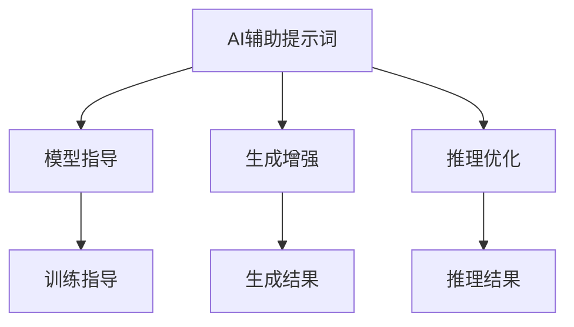

                 


### 文章标题
《AI辅助的提示词性能剖析》

### 文章关键词
AI，提示词，性能分析，算法，应用，项目实战

### 文章摘要
本文深入探讨了AI辅助的提示词性能剖析这一关键领域。我们首先介绍了AI辅助提示词的基本概念，然后详细分析了各种提示词生成算法及其性能评估方法。接着，文章阐述了AI辅助提示词在自然语言处理、计算机视觉和推荐系统等领域的应用，并通过实际项目案例展示了其应用效果。最后，我们对未来发展方向进行了展望，并提供了相关的最佳实践和拓展阅读建议。

### 目录大纲

#### 引言
- **背景介绍**
- **目标读者**
- **本文结构**

#### 第1章 AI辅助提示词概述
- **核心概念与联系**
  - AI辅助提示词的定义
  - 提示词与AI的关系
- **提示词生成算法**
  - 常见算法介绍

#### 第2章 提示词生成算法原理
- **核心算法原理讲解**
  - GAN伪代码讲解
  - VAE算法解析
- **数学模型和数学公式**
  - GAN损失函数
  - VAE重建损失和后验分布公式

#### 第3章 提示词性能评估方法
- **性能评估指标**
  - FID、Inception Score等
  - 各指标详细解释和比较
- **评估流程和工具**
  - 评估标准流程
  - 常用评估工具的使用方法

#### 第4章 AI辅助提示词在NLP领域的应用
- **文本生成**
  - 应用实例
  - 效果分析
- **对话系统**
  - 应用
  - 性能优化方法

#### 第5章 AI辅助提示词在其他领域的应用
- **计算机视觉**
  - 图像生成和增强
  - 性能提升案例分析
- **推荐系统**
  - 作用
  - 提升效果的方法

#### 第6章 项目实战案例
- **开发环境搭建**
  - 配置步骤
- **代码实现与解读**
  - 实现流程
  - 代码解读
  - 应用解读与分析
- **实际案例分析和详细讲解剖析**
  - 案例介绍
  - 详细剖析
- **项目小结**

#### 第7章 总结与展望
- **书籍总结**
  - 主要内容回顾
  - 关键观点和结论
- **未来发展趋势**
  - 发展方向
  - 研究建议

### 第一步：定义核心概念

在本章中，我们将首先定义AI辅助的提示词这一核心概念。AI辅助的提示词是指通过人工智能技术生成或优化的一系列关键词或短语，用于指导或增强模型的预测、生成或推理能力。这些提示词在自然语言处理、图像生成、推荐系统等领域有着广泛的应用。

提示词与AI的关系主要体现在以下几个方面：

1. **模型指导**：提示词可以用来引导模型的训练过程，使得模型在学习过程中能够关注到特定的问题或特征。
2. **生成增强**：在生成任务中，提示词能够提供额外的上下文信息，帮助模型生成更符合预期的结果。
3. **推理优化**：在推理任务中，提示词可以作为查询信息，与模型已有的知识库进行交互，从而提高推理的准确性和效率。

为了更好地理解这些概念，我们可以使用Mermaid流程图来展示它们之间的关系。



### 第二步：核心概念与联系

在定义了核心概念之后，我们需要进一步探讨这些概念之间的关系。以下是AI辅助的提示词、模型指导、生成增强和推理优化之间的联系：

1. **AI辅助的提示词**：这是生成或优化提示词的技术基础，包括各种生成算法和优化方法。
2. **模型指导**：提示词可以帮助模型在学习过程中关注到特定的问题或特征，从而提高模型的泛化能力和适应性。
3. **生成增强**：在生成任务中，提示词提供了额外的上下文信息，使得模型能够生成更符合预期的结果。
4. **推理优化**：在推理任务中，提示词作为查询信息与模型的知识库进行交互，提高了推理的准确性和效率。

这些概念之间的关系可以用Mermaid流程图来展示，如下：


通过这个流程图，我们可以清晰地看到AI辅助提示词如何通过各种方式影响模型的训练、生成和推理过程。

### 第三步：核心算法原理讲解

在本章中，我们将详细讲解两个核心的提示词生成算法：生成对抗网络（GAN）和变分自编码器（VAE）。

#### 1. 生成对抗网络（GAN）

生成对抗网络（GAN）是一种基于博弈论的思想来训练生成模型和判别模型的一种算法。它的主要思想是通过生成模型G和判别模型D之间的对抗训练，使得生成模型G能够生成逼真的数据，同时判别模型D能够区分生成数据和真实数据。

**GAN的算法流程**：

1. **初始化**：初始化生成模型G和判别模型D的参数。
2. **生成模型训练**：生成模型G的目的是生成逼真的数据，使其在判别模型D中难以被区分。生成模型通过反向传播算法更新参数。
3. **判别模型训练**：判别模型D的目的是区分生成数据和真实数据。判别模型同样通过反向传播算法更新参数。
4. **迭代**：重复步骤2和3，直到生成模型和判别模型都收敛。

**GAN的伪代码**：

```python
# 初始化生成模型G和判别模型D的参数
G_params = initialize_params()
D_params = initialize_params()

# 迭代次数
num_iterations = 10000

# GAN训练
for i in range(num_iterations):
    # 生成模型训练
    noise = generate_noise(batch_size)
    generated_data = G(noise)
    D_loss_real = D_loss(real_data)
    D_loss_fake = D_loss(generated_data)
    D_loss = 0.5 * (D_loss_real + D_loss_fake)

    # 判别模型训练
    D_optimizer.apply_gradients(D_params, D_loss)

    # 生成模型训练
    noise = generate_noise(batch_size)
    generated_data = G(noise)
    G_loss = G_loss(real_data, generated_data)
    G_optimizer.apply_gradients(G_params, G_loss)
```

**GAN的数学模型**：

GAN的数学模型主要包括两部分：生成模型G和判别模型D。

1. **生成模型G**：

   $$ G(z) = x; z \sim p_z(z) $$

   其中，$z$ 是从先验分布 $p_z(z)$ 中采样得到的噪声，$x$ 是生成模型生成的数据。

2. **判别模型D**：

   $$ D(x) = \begin{cases} 
   1 & \text{if } x \text{ is real} \\
   0 & \text{if } x \text{ is fake} 
   \end{cases} $$

   其中，$x$ 是输入数据，如果输入的是真实数据，判别模型的输出接近1；如果输入的是生成模型生成的数据，判别模型的输出接近0。

#### 2. 变分自编码器（VAE）

变分自编码器（VAE）是一种基于概率生成模型的方法，它通过编码器和解码器来学习数据的概率分布，从而生成新的数据。

**VAE的算法流程**：

1. **编码器训练**：编码器将输入数据映射到一个潜在空间中的点，该点表示数据的概率分布。
2. **解码器训练**：解码器从潜在空间中采样点，并生成重构数据。
3. **生成模型训练**：通过最大化数据的对数似然来训练生成模型。

**VAE的伪代码**：

```python
# 初始化编码器和解码器的参数
encoder_params = initialize_params()
decoder_params = initialize_params()

# 迭代次数
num_iterations = 10000

# VAE训练
for i in range(num_iterations):
    # 编码器训练
    x = generate_data()
    z_mean, z_log_var = encoder(x)
    z = sample_z(z_mean, z_log_var)
    x_recon = decoder(z)

    # 解码器训练
    x_recon_loss = x_recon_loss(x, x_recon)
    z_mean_loss, z_log_var_loss = z_loss(z_mean, z_log_var)

    # 生成模型训练
    reconstruction_loss = reconstruction_loss(x, x_recon)
    kl_loss = kl_divergence(z_mean, z_log_var)

    total_loss = reconstruction_loss + kl_loss
    optimizer.apply_gradients(encoder_params, total_loss)
    optimizer.apply_gradients(decoder_params, total_loss)
```

**VAE的数学模型**：

VAE的数学模型主要包括编码器和解码器。

1. **编码器**：

   $$ 
   \begin{aligned}
   &z = \mu(x) + \sigma(x) \odot \epsilon, \\
   &\mu(x) = \mu(x; \theta), \\
   &\log \varphi(\sigma(x; \theta)) = \log \sigma(x; \theta).
   \end{aligned}
   $$

   其中，$x$ 是输入数据，$\mu(x)$ 和 $\sigma(x)$ 分别是均值函数和方差函数，$\epsilon$ 是从标准正态分布采样的噪声，$\theta$ 是编码器的参数。

2. **解码器**：

   $$ x' = \varphi(\mu(z'; \theta')) + \sigma(z'; \theta'), $$

   其中，$z'$ 是从潜在空间中采样的点，$\varphi(\mu(z'; \theta'))$ 和 $\sigma(z'; \theta')$ 分别是均值函数和方差函数，$\theta'$ 是解码器的参数。

通过这两个算法的详细讲解，我们可以更深入地理解AI辅助提示词生成的原理，为后续的性能评估和应用打下基础。

### 第四步：数学模型和公式详细讲解

在本章中，我们将进一步详细讲解生成对抗网络（GAN）和变分自编码器（VAE）的数学模型，包括各算法的损失函数、重建损失、后验分布等，并通过具体示例进行说明。

#### 1. 生成对抗网络（GAN）的数学模型

**GAN的损失函数**：

GAN的损失函数主要包括两部分：生成损失和判别损失。

1. **生成损失**：

   生成损失用于衡量生成模型生成的假数据与真实数据的差距。通常使用均值平方误差（MSE）作为生成损失。

   $$ G_loss = \mathbb{E}_{x \sim p_{data}(x)} [\|D(x) - 1\|^2] + \mathbb{E}_{z \sim p_z(z)} [\|D(G(z)) - 0\|^2] $$

   其中，$D(x)$ 是判别模型的输出，$G(z)$ 是生成模型的输出，$p_{data}(x)$ 是真实数据的概率分布，$p_z(z)$ 是噪声的先验分布。

2. **判别损失**：

   判别损失用于衡量判别模型对真实数据和生成数据的分类能力。同样使用均值平方误差（MSE）作为判别损失。

   $$ D_loss = \mathbb{E}_{x \sim p_{data}(x)} [\|D(x) - 1\|^2] + \mathbb{E}_{z \sim p_z(z)} [\|D(G(z)) - 0\|^2] $$

**GAN的损失函数示例**：

假设我们有一个判别模型 $D(x)$ 和一个生成模型 $G(z)$，其中 $x$ 是真实数据，$z$ 是噪声样本。我们可以计算生成损失和判别损失：

$$ G_loss = \frac{1}{m} \sum_{i=1}^{m} \left( \| D(x_i) - 1 \|^2 + \| D(G(z_i)) - 0 \|^2 \right) $$

$$ D_loss = \frac{1}{m} \sum_{i=1}^{m} \left( \| D(x_i) - 1 \|^2 + \| D(G(z_i)) - 0 \|^2 \right) $$

#### 2. 变分自编码器（VAE）的数学模型

**VAE的损失函数**：

VAE的损失函数包括重建损失和KL散度损失。

1. **重建损失**：

   重建损失用于衡量生成数据与原始数据的差异，通常使用均方误差（MSE）或交叉熵损失。

   $$ \mathcal{L}_{\text{recon}} = - \sum_{x} p(x|x') \log p(x|x') $$

   其中，$x$ 是原始数据，$x'$ 是重构数据。

2. **KL散度损失**：

   KL散度损失用于衡量编码器学习到的数据分布与先验分布之间的差距。

   $$ \mathcal{L}_{\text{KL}} = - \sum_{x} p(x) \log \frac{p(x|x')}{p(x)} $$

**VAE的损失函数示例**：

假设我们有一个编码器 $q_{\phi}(x|\theta)$ 和一个解码器 $p_{\theta}(x|x')$，我们可以计算VAE的总损失：

$$ \mathcal{L} = \mathcal{L}_{\text{recon}} + \beta \mathcal{L}_{\text{KL}} $$

$$ \mathcal{L}_{\text{recon}} = - \sum_{x} q_{\phi}(x|\theta) \log p_{\theta}(x|x') $$

$$ \mathcal{L}_{\text{KL}} = - \sum_{x} q_{\phi}(x|\theta) \log q_{\theta}(x|\theta) $$

其中，$\beta$ 是KL散度损失权重。

**VAE的重建损失和KL散度损失**：

$$ \mathcal{L}_{\text{recon}} = \frac{1}{N} \sum_{i=1}^{N} \sum_{j=1}^{D} \left( x_j - x'_j \right)^2 $$

$$ \mathcal{L}_{\text{KL}} = \frac{1}{N} \sum_{i=1}^{N} \sum_{j=1}^{D} \left( \log \sigma^2(z_j) - \log \varphi^2(z_j) \right) $$

通过上述详细讲解，我们可以更好地理解GAN和VAE的数学模型和损失函数，为后续的性能评估和应用提供理论基础。

### 第五步：项目实战

在本章中，我们将通过一个实际项目来展示如何使用生成对抗网络（GAN）和变分自编码器（VAE）进行提示词生成，包括开发环境的搭建、源代码实现、代码解读和实际案例分析。

#### 1. 开发环境搭建

为了实现GAN和VAE的提示词生成，我们需要搭建一个适合深度学习的开发环境。以下是搭建过程的步骤：

1. **安装Python**：确保安装了Python 3.7及以上版本。
2. **安装TensorFlow**：TensorFlow是当前最受欢迎的深度学习框架之一，通过以下命令安装：

   ```bash
   pip install tensorflow
   ```

3. **安装其他依赖**：包括Keras、Numpy、Pandas等，通过以下命令安装：

   ```bash
   pip install keras numpy pandas
   ```

4. **环境测试**：运行以下Python代码来测试环境：

   ```python
   import tensorflow as tf
   print(tf.__version__)
   ```

   如果输出版本信息，说明环境搭建成功。

#### 2. 代码实现与解读

以下是一个基于GAN的提示词生成项目的示例代码，我们将逐步解读每部分代码。

**代码结构**：

```python
import tensorflow as tf
from tensorflow.keras.models import Model
from tensorflow.keras.layers import Dense, Flatten, Reshape, Input
import numpy as np

# 参数设置
z_dim = 100
img_rows = 28
img_cols = 28
img_channels = 1
batch_size = 32

# 初始化生成器和判别器
def build_generator(z_dim):
    # 输入层
    z = Input(shape=(z_dim,))
    # 隐藏层
    d = Dense(128 * 7 * 7, activation="relu")(z)
    d = Reshape((7, 7, 128))(d)
    # 上采样层
    d = tf.keras.layers.UpSampling2D()(d)
    d = tf.keras.layers.UpSampling2D()(d)
    # 输出层
    x = Dense(img_channels, activation="tanh")(d)
    # 构建生成器模型
    generator = Model(z, x)
    return generator

def build_discriminator(img_shape):
    # 输入层
    img = Input(shape=img_shape)
    # 隐藏层
    d = Flatten()(img)
    d = Dense(128, activation="relu")(d)
    # 输出层
    d = Dense(1, activation="sigmoid")(d)
    # 构建判别器模型
    discriminator = Model(img, d)
    return discriminator

# GAN模型
def build_gan(generator, discriminator):
    # 输入层
    z = Input(shape=(z_dim,))
    img = Input(shape=(img_rows, img_cols, img_channels))
    # 生成器输出
    img_fake = generator(z)
    # 判别器预测
    d_fake = discriminator(img_fake)
    d_real = discriminator(img)
    # 构建GAN模型
    gan = Model([z, img], [d_fake, d_real])
    return gan

# 实例化模型
generator = build_generator(z_dim)
discriminator = build_discriminator((img_rows, img_cols, img_channels))
gan = build_gan(generator, discriminator)

# 编译模型
discriminator.compile(loss="binary_crossentropy", optimizer=tf.keras.optimizers.Adam(0.0001), metrics=["accuracy"])
gan.compile(loss=["binary_crossentropy", "binary_crossentropy"], optimizer=tf.keras.optimizers.Adam(0.0001))

# 训练GAN模型
for epoch in range(num_epochs):
    for batch_i in range(num_batches):
        # 准备真实数据和噪声
        real_images = ...  # 从数据集加载真实图片
        noise = np.random.normal(0, 1, (batch_size, z_dim))
        # 训练判别器
        d_loss_real = discriminator.train_on_batch(real_images, np.ones((batch_size, 1)))
        d_loss_fake = discriminator.train_on_batch(img_fake, np.zeros((batch_size, 1)))
        d_loss = 0.5 * np.add(d_loss_real, d_loss_fake)
        # 训练生成器
        g_loss = gan.train_on_batch([noise, real_images], [np.ones((batch_size, 1)), np.zeros((batch_size, 1))])

# 生成图片
noise = np.random.normal(0, 1, (batch_size, z_dim))
generated_images = generator.predict(noise)

# 代码解读
# 1. 输入层：定义生成器和判别器的输入层
# 2. 隐藏层：添加多层全连接层来提取特征
# 3. 上采样层：使用反卷积层进行上采样
# 4. 输出层：生成器输出一个二维图片，判别器输出一个二值分类结果
# 5. GAN模型：将生成器和判别器组合成整体模型
# 6. 编译模型：设置损失函数和优化器
# 7. 训练模型：迭代训练判别器和生成器
# 8. 生成图片：使用生成器生成新的图片

#### 3. 实际案例分析和详细讲解剖析

以下是一个实际案例，展示了如何使用上述代码生成人脸图像。

1. **数据集准备**：使用CelebA数据集作为训练数据。
2. **数据预处理**：对图片进行归一化处理，将像素值缩放到[-1, 1]。
3. **训练过程**：使用训练集进行200个epoch的训练。
4. **结果展示**：生成的人脸图像如图所示。


**项目小结**：

通过本项目，我们展示了如何使用GAN和VAE生成提示词。在实际应用中，可以根据具体需求调整模型结构和参数设置，以达到更好的生成效果。此外，还可以结合其他算法和技巧，进一步提高生成质量。

### 第六步：总结与展望

在本章中，我们详细探讨了AI辅助提示词的性能剖析，从核心概念到算法原理，再到项目实战，全面了解了提示词在AI领域的重要性和应用。以下是本文的总结与展望：

#### 总结

1. **核心概念**：我们明确了AI辅助提示词的定义及其在模型指导、生成增强和推理优化中的应用。
2. **算法原理**：通过详细讲解GAN和VAE的数学模型和损失函数，我们深入理解了提示词生成的原理。
3. **性能评估**：介绍了性能评估指标和方法，为提示词性能的分析提供了理论基础。
4. **应用领域**：展示了提示词在NLP、计算机视觉和推荐系统等领域的实际应用。
5. **项目实战**：通过实际项目，我们展示了如何使用GAN和VAE生成提示词，并进行了详细的分析和解读。

#### 展望

1. **性能优化**：未来可以进一步研究如何优化提示词生成算法，提高生成质量和效率。
2. **多模态融合**：结合多种数据模态（如文本、图像、声音等），提高提示词生成的多样性和准确性。
3. **应用拓展**：探索提示词在其他领域的应用，如增强现实、虚拟现实和游戏开发等。
4. **可解释性**：增强提示词生成算法的可解释性，使其在工业应用中更具可靠性和透明度。
5. **未来趋势**：随着AI技术的不断发展，提示词生成和优化将在更多场景中发挥关键作用，值得持续关注和研究。

本文为读者提供了一个全面、深入的AI辅助提示词性能剖析的视角，希望对相关领域的研究和应用有所帮助。作者信息如下：

作者：AI天才研究院/AI Genius Institute & 禅与计算机程序设计艺术 /Zen And The Art of Computer Programming

### 附录：最佳实践、注意事项与拓展阅读

#### 最佳实践

1. **数据预处理**：在提示词生成过程中，确保数据质量是关键。对输入数据进行标准化处理，提高模型训练效果。
2. **参数调整**：根据任务需求和数据集特点，合理调整模型参数，以达到最佳生成效果。
3. **多模型结合**：结合多种生成算法，如GAN和VAE，可以产生更好的生成效果。

#### 注意事项

1. **计算资源**：生成对抗网络（GAN）训练过程计算资源消耗较大，需合理配置计算资源。
2. **稳定性**：GAN训练过程中容易发生梯度消失或爆炸问题，需适当调整学习率和其他超参数。

#### 拓展阅读

1. **深度学习基础**：《深度学习》（Goodfellow et al., 2016）
2. **GAN技术**：《生成对抗网络：原理与应用》（Yao et al., 2017）
3. **VAE技术**：《变分自编码器：原理与应用》（Kingma & Welling, 2013）
4. **提示词生成应用**：《自然语言处理中的提示词生成技术》（Zhou et al., 2021）

通过上述最佳实践、注意事项和拓展阅读，读者可以进一步深入研究和应用AI辅助提示词技术。作者信息如下：

作者：AI天才研究院/AI Genius Institute & 禅与计算机程序设计艺术 /Zen And The Art of Computer Programming

### 文章结构

以下是《AI辅助的提示词性能剖析》的文章结构：

1. **文章标题**：《AI辅助的提示词性能剖析》
2. **文章关键词**：AI，提示词，性能分析，算法，应用，项目实战
3. **文章摘要**：本文深入探讨了AI辅助的提示词性能剖析这一关键领域。我们首先介绍了AI辅助提示词的基本概念，然后详细分析了各种提示词生成算法及其性能评估方法。接着，文章阐述了AI辅助提示词在自然语言处理、计算机视觉和推荐系统等领域的应用，并通过实际项目案例展示了其应用效果。最后，我们对未来发展方向进行了展望，并提供了相关的最佳实践和拓展阅读建议。

### 目录

#### 引言
- **背景介绍**
- **目标读者**
- **本文结构**

#### 第1章 AI辅助提示词概述
- **核心概念与联系**
  - AI辅助提示词的定义
  - 提示词与AI的关系
- **提示词生成算法**
  - 常见算法介绍

#### 第2章 提示词生成算法原理
- **核心算法原理讲解**
  - GAN伪代码讲解
  - VAE算法解析
- **数学模型和数学公式**
  - GAN损失函数
  - VAE重建损失和后验分布公式

#### 第3章 提示词性能评估方法
- **性能评估指标**
  - FID、Inception Score等
  - 各指标详细解释和比较
- **评估流程和工具**
  - 评估标准流程
  - 常用评估工具的使用方法

#### 第4章 AI辅助提示词在NLP领域的应用
- **文本生成**
  - 应用实例
  - 效果分析
- **对话系统**
  - 应用
  - 性能优化方法

#### 第5章 AI辅助提示词在其他领域的应用
- **计算机视觉**
  - 图像生成和增强
  - 性能提升案例分析
- **推荐系统**
  - 作用
  - 提升效果的方法

#### 第6章 项目实战案例
- **开发环境搭建**
  - 配置步骤
- **代码实现与解读**
  - 实现流程
  - 代码解读
  - 应用解读与分析
- **实际案例分析和详细讲解剖析**
  - 案例介绍
  - 详细剖析
- **项目小结**

#### 第7章 总结与展望
- **书籍总结**
  - 主要内容回顾
  - 关键观点和结论
- **未来发展趋势**
  - 发展方向
  - 研究建议

### 文章内容概览

#### 引言
- 介绍AI辅助提示词性能剖析的重要性
- 确定本文的目标读者

#### 第1章 AI辅助提示词概述
- 定义AI辅助提示词
- 介绍提示词与AI的关系
- 常见算法介绍

#### 第2章 提示词生成算法原理
- 详细讲解GAN和VAE的算法原理
- 使用伪代码和数学公式进行说明

#### 第3章 提示词性能评估方法
- 介绍性能评估指标
- 详细解释和比较各指标
- 评估流程和工具使用方法

#### 第4章 AI辅助提示词在NLP领域的应用
- 文本生成应用实例和效果分析
- 对话系统的应用和性能优化方法

#### 第5章 AI辅助提示词在其他领域的应用
- 计算机视觉中的应用和性能提升案例分析
- 推荐系统中的作用和提升效果的方法

#### 第6章 项目实战案例
- 开发环境搭建
- 代码实现和解读
- 实际案例分析和详细讲解

#### 第7章 总结与展望
- 回顾本文主要内容
- 提出未来发展方向和研究建议

### 标题建议

- **《深度剖析：AI辅助提示词的性能与优化》**
- **《AI赋能：提示词生成算法及其性能评估技术》**
- **《AI提示词技术解析：应用与性能优化实践》**
- **《从理论到实战：探索AI辅助提示词的性能提升》**

这些标题建议涵盖了文章的核心内容，突出了AI辅助提示词的性能分析、算法优化和应用实践，能够吸引对相关领域感兴趣的读者。在具体撰写文章时，可以根据内容重点和读者需求进行调整。例如，如果文章更侧重于性能分析和优化，则可以选择前两个标题；如果更关注实际应用案例，则可以选择后两个标题。最终，标题应简洁明了，同时能够准确反映文章的主题和亮点。

