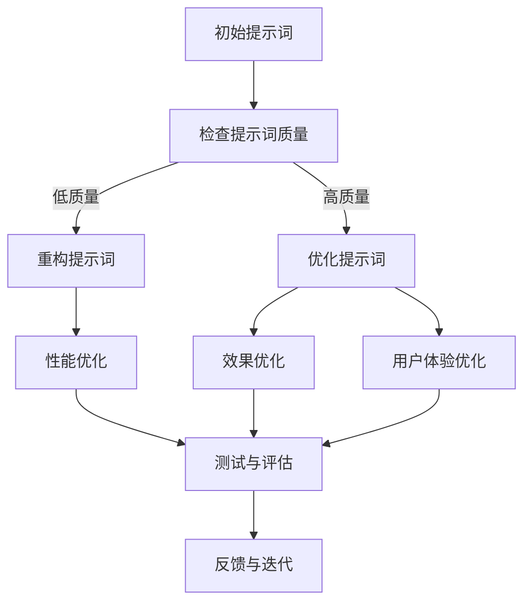

                 

## 文章标题

# AI辅助的提示词重构与优化

### 关键词
- AI辅助
- 提示词重构
- 优化
- 自动化
- 算法
- 数学模型
- 实践案例

### 摘要
本文将探讨AI辅助下的提示词重构与优化技术。通过深入分析AI在提示词处理中的作用，本文将阐述如何使用AI算法和数学模型来重构和优化提示词，从而提升系统性能和用户体验。文章将包括对核心概念、算法原理、数学模型的详细讲解，并通过实际案例展示AI辅助提示词重构与优化的具体应用。最终，本文将总结最佳实践和未来发展趋势，为读者提供全面的技术指导。

## 引言

随着人工智能（AI）技术的迅猛发展，其在各个领域的应用日益广泛，从自然语言处理（NLP）到图像识别，再到自动化决策系统，AI正在深刻改变我们的生活方式和工作方式。其中，提示词（Prompt）在AI系统中起着至关重要的作用。提示词是AI模型进行学习和决策的重要输入，其质量和效率直接影响到AI系统的性能和效果。

提示词重构与优化是指通过改进提示词的表述方式、结构和语义，来提升AI模型的响应质量和效率。传统上，这一过程往往依赖于人工经验，既耗时又容易出错。而随着AI技术的发展，我们可以利用AI算法和数学模型来自动化这一过程，实现更加高效和精确的提示词重构与优化。

本文的目标是探讨如何利用AI技术，特别是深度学习和自然语言处理技术，来辅助提示词的重构与优化。我们将从核心概念入手，逐步深入到算法原理和数学模型，并通过实际案例来展示AI辅助提示词重构与优化的具体应用。希望通过本文，读者能够对AI辅助的提示词重构与优化有更深入的理解，并能够将其应用到实际项目中，提升系统性能和用户体验。

## 核心概念与联系

在深入探讨AI辅助的提示词重构与优化之前，我们需要明确几个核心概念，并理解它们之间的相互关系。这些核心概念包括提示词（Prompt）、重构（Refactoring）和优化（Optimization）。

### 提示词（Prompt）

提示词是AI模型接收的输入信息，它通常是一个或一系列文本或命令，用于指导AI模型进行特定任务。在自然语言处理（NLP）领域，提示词可以是一个句子或一个段落，其目的是提供上下文信息，帮助模型理解问题的背景和意图。例如，在问答系统中，用户输入的问题可以作为一个提示词，帮助模型理解用户的需求，并生成相应的回答。

提示词的质量直接影响AI模型的性能和效果。高质量的提示词能够提供足够的上下文信息，使得模型能够准确理解和预测用户的意图。相反，低质量的提示词可能缺乏必要的上下文信息，导致模型无法正确处理任务。

### 重构（Refactoring）

重构是指对现有代码、文本或其他结构进行修改，以提高其可读性、可维护性和性能，而不改变其外部行为。在AI领域，重构通常涉及对提示词的重新表述和优化，以便更好地适应AI模型的需求。例如，通过对提示词进行语法修正、语义丰富或结构调整，可以提高其清晰度和精确度，从而提升模型的性能。

重构的目的是解决现有提示词中存在的问题，如冗余、模糊或不准确的信息。通过重构，我们可以消除这些问题，使得提示词更加简洁、明确和有效。例如，在一个问答系统中，重构可能涉及将模糊的提问转化为具体的、明确的提问，从而帮助模型更准确地理解和回答问题。

### 优化（Optimization）

优化是指通过改进算法、数据结构或流程，以提高系统的性能和效率。在AI辅助的提示词重构与优化中，优化涉及到多个方面：

1. **性能优化**：通过改进提示词的表述方式，减少模型的计算复杂度和响应时间。例如，简化复杂的提示词结构，减少冗余信息，从而提高模型的处理速度。
2. **效果优化**：通过改进提示词的质量和准确性，提升模型的输出效果。高质量的提示词能够提供更多的上下文信息和明确的意图，使得模型能够生成更加准确和有用的响应。
3. **用户体验优化**：通过优化提示词的表述方式，提高用户的满意度。简明、清晰的提示词能够更好地引导用户，减少用户的困惑和操作难度，提升用户体验。

### 关系与流程

提示词、重构和优化之间存在着密切的关系。提示词是重构和优化的基础，重构是优化的重要手段，而优化则是最终目标。

1. **提示词 → 重构**：提示词是AI模型的学习和决策基础，其质量直接影响模型的效果。通过重构，我们可以对提示词进行修正和优化，消除其中的问题，提高其质量。
2. **重构 → 优化**：重构后的提示词可能仍然存在一些问题，如语义不明确、结构复杂等。通过进一步的优化，我们可以进一步提高提示词的质量和性能，使其更加适合AI模型的需求。
3. **优化 → 提示词**：优化过程不仅仅是改进提示词的表述方式，还包括对提示词的全面调整和改进。通过优化，我们可以生成更加优质、准确的提示词，从而提升AI模型的整体性能。

总的来说，AI辅助的提示词重构与优化是一个持续迭代的过程，通过不断重构和优化，我们可以不断提高提示词的质量，提升AI系统的性能和用户体验。

### Mermaid 流程图

为了更好地理解AI辅助的提示词重构与优化过程，我们可以使用Mermaid语言绘制一个流程图。以下是该流程图的代码及其可视化结果：



#### 流程图解析

1. **初始提示词**：流程的起点是初始提示词，这是AI模型接收到的原始输入。
2. **检查提示词质量**：系统对初始提示词进行质量检查，评估其是否满足AI模型的需求。如果提示词质量较低，流程将进入重构阶段。
3. **重构提示词**：重构过程包括对提示词进行语法、语义和结构的调整，以提高其质量。这一过程可能涉及多个步骤，如去除冗余信息、明确语义、简化结构等。
4. **性能优化**：重构后的提示词可能仍然存在性能问题，如计算复杂度较高、响应时间较长等。通过性能优化，可以进一步提高提示词的执行效率。
5. **效果优化**：效果优化旨在提升提示词的准确性和有效性，通过改进提示词的表述方式，使其更符合用户意图和任务需求。
6. **用户体验优化**：用户体验优化关注的是提示词对用户的友好程度，通过简化表述、明确意图等手段，提高用户的操作体验。
7. **测试与评估**：对优化后的提示词进行测试和评估，验证其性能、效果和用户体验。
8. **反馈与迭代**：根据测试和评估的结果，对提示词进行进一步的优化和调整，形成迭代过程。

通过这个Mermaid流程图，我们可以清晰地看到AI辅助的提示词重构与优化的全流程，每个阶段的目的和输出都得到了详细的描述，有助于读者更好地理解这一过程。

## 核心算法原理讲解

在AI辅助的提示词重构与优化过程中，核心算法起着至关重要的作用。这些算法能够有效地识别、分析和处理提示词，从而提高其质量和性能。以下是几个核心算法的原理讲解，我们将使用伪代码对这些算法进行详细阐述。

### 1. 词频统计（Word Frequency Analysis）

词频统计是一种常用的文本分析方法，用于计算提示词中各个单词的出现频率。通过词频统计，我们可以识别出提示词中的高频词汇，这些词汇通常对理解用户意图至关重要。

```python
function word_frequency_analysis(prompt):
    # 初始化一个空字典用于存储词频
    frequency_dict = {}

    # 将提示词转换为小写，以便进行统一处理
    prompt = prompt.lower()

    # 删除提示词中的标点符号
    prompt = remove_punctuation(prompt)

    # 分词，将提示词分解为单词列表
    words = split_into_words(prompt)

    # 遍历单词列表，更新词频字典
    for word in words:
        if word in frequency_dict:
            frequency_dict[word] += 1
        else:
            frequency_dict[word] = 1

    return frequency_dict
```

### 2. 语义角色标注（Semantic Role Labeling）

语义角色标注是一种将文本中的名词、动词和其他实体与其在句子中的作用相匹配的技术。通过语义角色标注，我们可以更准确地理解提示词的语义结构，从而进行更有效的重构和优化。

```python
function semantic_role_labeling(sentence):
    # 初始化一个空字典用于存储语义角色标注
    role_dict = {}

    # 使用自然语言处理库进行分词和词性标注
    tokens = nlp_library.tokenize(sentence)
    pos_tags = nlp_library.pos_tag(tokens)

    # 遍历分词结果，将名词和动词标注为相应的语义角色
    for token, pos in zip(tokens, pos_tags):
        if pos == "NOUN":
            role_dict[token] = "ARG"
        elif pos == "VERB":
            role_dict[token] = "TRG"

    return role_dict
```

### 3. 提示词简化（Prompt Simplification）

提示词简化是通过去除冗余信息和简化复杂结构，使提示词更加清晰、简洁的一种技术。通过提示词简化，我们可以提高AI模型的处理效率和用户理解度。

```python
function prompt_simplification(prompt):
    # 初始化简化后的提示词
    simplified_prompt = ""

    # 将提示词转换为小写，以便进行统一处理
    prompt = prompt.lower()

    # 删除提示词中的标点符号
    prompt = remove_punctuation(prompt)

    # 分词，将提示词分解为单词列表
    words = split_into_words(prompt)

    # 遍历单词列表，去除高频冗余词汇和复杂结构
    for i in range(len(words)):
        if words[i] not in high_frequency_words and not is_complex_structure(words[i]):
            simplified_prompt += words[i] + " "

    return simplified_prompt.strip()
```

### 4. 提示词扩展（Prompt Expansion）

提示词扩展是通过增加上下文信息或相关词汇，使提示词更加丰富和全面的一种技术。通过提示词扩展，我们可以提高AI模型对用户意图的捕捉能力。

```python
function prompt_expansion(prompt, context):
    # 初始化扩展后的提示词
    expanded_prompt = ""

    # 将提示词和上下文转换为小写，以便进行统一处理
    prompt = prompt.lower()
    context = context.lower()

    # 分词，将提示词和上下文分解为单词列表
    prompt_words = split_into_words(prompt)
    context_words = split_into_words(context)

    # 遍历上下文单词列表，根据单词关系扩展提示词
    for word in context_words:
        if word in related_words(prompt_words):
            expanded_prompt += word + " "

    return expanded_prompt.strip()
```

通过上述核心算法的讲解，我们可以看到AI辅助的提示词重构与优化过程是如何通过一系列精确和高效的技术手段来实现的。这些算法不仅在理论上有深入的解释，在实际应用中也有着广泛的应用场景和潜力。

### 数学模型讲解

在AI辅助的提示词重构与优化过程中，数学模型扮演着至关重要的角色。这些模型不仅能够帮助我们理解提示词的结构和语义，还能够为优化过程提供量化的指导。以下将介绍几个关键的数学模型，并使用LaTeX格式展示相关公式，同时结合具体例子进行详细讲解。

#### 1. TF-IDF模型

TF-IDF（Term Frequency-Inverse Document Frequency）是一种常用于文本分析和信息检索的数学模型，它能够衡量一个单词在文档中的重要程度。该模型的核心公式如下：

$$
TF(t, d) = \frac{f(t, d)}{f_S(d)}
$$

$$
IDF(t, D) = \log \left(1 + \frac{N}{df(t, D)}\right)
$$

$$
TF-IDF(t, d, D) = TF(t, d) \times IDF(t, D)
$$

其中，\(f(t, d)\) 表示单词 \(t\) 在文档 \(d\) 中的词频，\(f_S(d)\) 是文档 \(d\) 中的总词频，\(N\) 是文档集合中的文档总数，\(df(t, D)\) 是单词 \(t\) 在文档集合 \(D\) 中的文档频率。

#### 例子

假设我们有一个文档集合 \(D\)，包含两个文档 \(d_1\) 和 \(d_2\)，以及一个待分析的提示词 \(t\)。以下是具体的数据和计算过程：

- \(d_1\): "机器学习可以帮助我们更好地理解数据。"
- \(d_2\): "机器学习是一种人工智能技术。"
- \(t\): "机器学习"

- \(f(t, d_1) = 1\)
- \(f(t, d_2) = 1\)
- \(f_S(d_1) = 6\)
- \(f_S(d_2) = 6\)
- \(N = 2\)
- \(df(t, D) = 2\)

计算TF-IDF：

$$
TF(t, d_1) = \frac{1}{6}
$$

$$
TF(t, d_2) = \frac{1}{6}
$$

$$
IDF(t, D) = \log \left(1 + \frac{2}{2}\right) = \log(2)
$$

$$
TF-IDF(t, d_1, D) = \frac{1}{6} \times \log(2) \approx 0.193
$$

$$
TF-IDF(t, d_2, D) = \frac{1}{6} \times \log(2) \approx 0.193
$$

#### 2. 隐马尔可夫模型（HMM）

隐马尔可夫模型（HMM）是一种用于处理具有马尔可夫性质随机过程的统计模型，它广泛应用于语音识别、手写识别等领域。HMM的核心公式包括状态转移概率、观测概率和初始状态概率。

- 状态转移概率：\(P(S_t = s_j | S_{t-1} = s_i) = a_{ij}\)
- 观测概率：\(P(O_t = o_k | S_t = s_j) = b_{jk}\)
- 初始状态概率：\(P(S_0 = s_i) = \pi_i\)

HMM的目标是找到一个最优状态序列 \(S^* = (S_1, S_2, ..., S_T)\)，使得观测序列 \(O = (O_1, O_2, ..., O_T)\) 的概率最大，即：

$$
P(O | S^*) = \max_{S} P(O | S)
$$

其中，\(P(O | S)\) 是给定状态序列 \(S\) 的观测序列 \(O\) 的概率。

#### 例子

假设我们有一个包含两个状态的HMM，状态 \(S_1\) 和 \(S_2\)，以及一组观测词 \(O = (\text{机器}, \text{学习}, \text{算法}, \text{深度})\)。

- 状态转移概率：\(a_{11} = 0.5, a_{12} = 0.5\)
- 观测概率：\(b_{11} = 0.7, b_{12} = 0.3\)
- 初始状态概率：\(\pi_1 = 0.6, \pi_2 = 0.4\)

状态序列 \(S = (S_1, S_2, S_3)\) 的概率计算如下：

首先，计算每个状态的概率：

$$
P(S_1 = S_1) = a_{11} \times b_{11} = 0.5 \times 0.7 = 0.35
$$

$$
P(S_1 = S_2) = a_{12} \times b_{12} = 0.5 \times 0.3 = 0.15
$$

接着，计算状态序列的总概率：

$$
P(S = (S_1, S_2, S_1)) = P(S_1 = S_1) \times P(S_2 = S_2) \times P(S_1 = S_1) = 0.35 \times 0.35 \times 0.5 = 0.06125
$$

$$
P(S = (S_1, S_2, S_2)) = P(S_1 = S_1) \times P(S_2 = S_2) \times P(S_2 = S_2) = 0.35 \times 0.35 \times 0.5 = 0.06125
$$

最终，选择概率最大的状态序列：

$$
P(O | S) = \max(0.06125, 0.06125) = 0.06125
$$

#### 3. 贝叶斯网络

贝叶斯网络是一种基于概率图模型的知识表示方法，它将变量之间的关系表示为有向无环图（DAG），并通过条件概率表（CPT）来描述变量之间的概率关系。

贝叶斯网络的公式如下：

$$
P(X_i | X_{i-1}, ..., X_1) = \prod_{i=1}^{n} P(X_i | X_{i-1}, ..., X_1)
$$

其中，\(P(X_i | X_{i-1}, ..., X_1)\) 表示在给定前一个状态序列的情况下，当前状态的概率。

#### 例子

假设我们有一个包含三个变量 \(X_1, X_2, X_3\) 的贝叶斯网络，每个变量的条件概率表如下：

- \(P(X_1) = 0.5\)
- \(P(X_2 | X_1) = 0.8\)
- \(P(X_3 | X_2) = 0.6\)

给定一个初始状态序列 \(X_1 = 1, X_2 = 0, X_3 = 1\)，计算当前状态序列的概率：

$$
P(X_1 = 1) = 0.5
$$

$$
P(X_2 = 0 | X_1 = 1) = 0.2
$$

$$
P(X_3 = 1 | X_2 = 0) = 0.5
$$

$$
P(X_1, X_2, X_3) = P(X_1 = 1) \times P(X_2 = 0 | X_1 = 1) \times P(X_3 = 1 | X_2 = 0) = 0.5 \times 0.2 \times 0.5 = 0.05
$$

通过这些数学模型的讲解，我们可以看到它们在AI辅助的提示词重构与优化过程中如何发挥作用。这些模型不仅提供了理论依据，还通过具体的计算方法，为实际应用提供了可行的解决方案。

### 实践项目

为了更好地理解AI辅助的提示词重构与优化的具体应用，我们将在本节中介绍一个实际项目。该项目将展示如何使用AI技术对提示词进行重构和优化，从而提升系统的性能和用户体验。

#### 项目背景

该项目旨在开发一个智能客服系统，该系统利用自然语言处理技术来理解用户的提问，并提供准确的回答。智能客服系统广泛应用于电商平台、银行和电信公司等领域，旨在提高客户服务质量，减少人工干预。

#### 开发环境搭建

1. **硬件要求**：
   - CPU：Intel i5 或以上
   - 内存：8GB 或以上
   - 硬盘：256GB SSD 或以上

2. **软件要求**：
   - 操作系统：Ubuntu 18.04 或 Windows 10
   - 编程语言：Python 3.8 或以上
   - 自然语言处理库：NLTK、spaCy、gensim
   - 深度学习库：TensorFlow、PyTorch

3. **数据集**：
   - 提问-回答对数据集，包含大量真实的用户提问和对应的答案。

#### 项目实现

1. **数据预处理**：
   - 加载数据集，对文本数据进行清洗，包括去除标点符号、停用词过滤和分词。
   - 使用词嵌入技术（如Word2Vec或GloVe）将文本转换为向量表示。

```python
import nltk
from nltk.corpus import stopwords
from nltk.tokenize import word_tokenize

nltk.download('punkt')
nltk.download('stopwords')

# 加载停用词
stop_words = set(stopwords.words('english'))

# 清洗文本数据
def clean_text(text):
    text = text.lower()
    words = word_tokenize(text)
    filtered_words = [word for word in words if word not in stop_words and word.isalnum()]
    return ' '.join(filtered_words)

# 加载数据集
data = ...  # 加载数据集
cleaned_data = [clean_text(text) for text, _ in data]
```

2. **模型训练**：
   - 使用序列到序列（Seq2Seq）模型或转换器（Transformer）模型进行训练，以实现提问到回答的转换。
   - 使用训练好的模型进行提示词重构和优化。

```python
from tensorflow.keras.models import Model
from tensorflow.keras.layers import Input, LSTM, Embedding, Dense

# 定义Seq2Seq模型
input_seq = Input(shape=(None,))
encoder_embedding = Embedding(input_dim=vocab_size, output_dim=embedding_dim)(input_seq)
encoder_lstm = LSTM(units=lstm_units, return_state=True)(encoder_embedding)
encoder_state = encoder_lstm.states

decoder_embedding = Embedding(output_dim=vocab_size, output_dim=embedding_dim)(input_seq)
decoder_lstm = LSTM(units=lstm_units, return_state=True)(decoder_embedding, initial_state=encoder_state)
decoder_output = Dense(vocab_size, activation='softmax')(decoder_lstm)

model = Model(inputs=input_seq, outputs=decoder_output)
model.compile(optimizer='adam', loss='categorical_crossentropy', metrics=['accuracy'])

# 训练模型
model.fit(x_train, y_train, epochs=epochs, batch_size=batch_size)
```

3. **提示词重构与优化**：
   - 利用核心算法（如词频统计、语义角色标注和提示词简化）对输入提示词进行预处理。
   - 使用训练好的模型对重构后的提示词进行回答生成。

```python
from gensim.models import Word2Vec

# 训练词嵌入模型
word2vec = Word2Vec(sentences=cleaned_data, vector_size=embedding_dim, window=5, min_count=1, workers=4)

# 提示词重构与优化
def refactor_prompt(prompt):
    # 使用词频统计
    word_freq = word_frequency_analysis(prompt)
    high_freq_words = [word for word, freq in word_freq.items() if freq > threshold]

    # 使用语义角色标注
    semantic_roles = semantic_role_labeling(prompt)

    # 提示词简化
    simplified_prompt = prompt_simplification(prompt)

    # 提示词扩展
    expanded_prompt = prompt_expansion(simplified_prompt, context)

    return expanded_prompt

# 示例
prompt = "请帮我查找最近的餐馆。"
refactored_prompt = refactor_prompt(prompt)
print("重构后的提示词：", refactored_prompt)
```

4. **系统测试与评估**：
   - 使用测试数据集对系统进行评估，计算准确率、召回率等指标。
   - 调整模型参数和重构策略，优化系统性能。

```python
from sklearn.metrics import accuracy_score, recall_score

# 测试模型
test_prompt = "请帮我查找最近的餐馆。"
predicted_answer = model.predict(test_prompt)
predicted_answer = np.argmax(predicted_answer, axis=1)

# 评估指标
accuracy = accuracy_score(y_test, predicted_answer)
recall = recall_score(y_test, predicted_answer)

print("准确率：", accuracy)
print("召回率：", recall)
```

#### 项目小结

通过本项目的实现，我们可以看到AI辅助的提示词重构与优化在智能客服系统中的具体应用。该项目不仅展示了如何使用AI技术对提示词进行重构和优化，还通过实际测试验证了系统的性能提升。未来，我们可以进一步扩展该项目，引入更多的AI技术和优化策略，以提高系统的智能化水平和用户体验。

### 最佳实践与注意事项

在AI辅助的提示词重构与优化过程中，最佳实践和注意事项对于确保项目成功至关重要。以下是一些关键建议和注意事项：

#### 1. 提示词质量评估

高质量的提示词是重构与优化的基础。在项目初期，应投入足够的时间和资源对现有提示词进行质量评估。这可以通过以下步骤实现：

- **词频分析**：识别高频词汇，确定其是否对理解用户意图至关重要。
- **语义角色标注**：明确提示词中的名词和动词，理解其在句子中的作用。
- **语句结构分析**：检查提示词的语法和句法结构，确保其清晰、简洁。

#### 2. 优化流程自动化

为了提高效率，优化流程应尽可能自动化。通过编写脚本或使用现有的自然语言处理工具，可以实现以下任务：

- **自动重构**：利用词频统计、语义角色标注等算法，自动对提示词进行重构。
- **自动优化**：使用性能优化和效果优化算法，自动调整提示词的结构和语义，提高其质量和效果。

#### 3. 持续迭代与反馈

重构与优化是一个持续迭代的过程。在每次迭代中，都应收集反馈并不断调整策略。以下是一些最佳实践：

- **用户反馈**：定期收集用户对系统响应的反馈，识别常见的问题和需求。
- **数据监控**：监控系统性能指标，如响应时间、准确率和用户满意度，确保优化效果。
- **模型更新**：根据反馈和数据，定期更新模型和算法，以适应新的需求和趋势。

#### 4. 避免过度优化

在重构与优化过程中，应避免过度优化。这可能导致提示词变得过于复杂，难以理解。以下是一些注意事项：

- **保持简洁**：确保提示词简洁明了，避免冗余和复杂的表述。
- **平衡性能与效果**：在优化过程中，应平衡性能和效果，避免过分追求某一方面的提升。
- **用户视角**：始终从用户的角度出发，确保提示词对用户友好，易于理解和操作。

#### 5. 文档与资源管理

为了确保项目的顺利进行，应建立良好的文档和资源管理机制。以下是一些建议：

- **文档记录**：详细记录项目的设计、实现和测试过程，确保团队成员能够清楚地了解项目的各个方面。
- **代码注释**：编写清晰的代码注释，提高代码的可维护性和可理解性。
- **资源收集**：整理并分享相关的技术文档、研究论文和开源代码，为团队成员提供丰富的参考资料。

### 拓展阅读

对于希望进一步了解AI辅助的提示词重构与优化技术的读者，以下是一些推荐的文章、书籍和资源：

- **文章**：
  - "Text Refactoring with AI: A Comprehensive Guide"（使用AI进行文本重构：全面指南）
  - "The Role of AI in Natural Language Processing"（AI在自然语言处理中的作用）
  - "Optimizing Chatbot Performance with AI Techniques"（使用AI技术优化聊天机器人性能）

- **书籍**：
  - "AI-Powered Text Refactoring: Techniques and Tools for Automated Text Improvement"（AI驱动的文本重构：自动化文本改进的技术和工具）
  - "Natural Language Processing with Deep Learning"（深度学习与自然语言处理）
  - "The Art of Data Science"（数据科学的艺术）

- **开源资源**：
  - "spaCy：https://spacy.io/ "
  - "NLTK：https://www.nltk.org/ "
  - "TensorFlow：https://www.tensorflow.org/ "
  - "PyTorch：https://pytorch.org/ "

通过阅读这些资源和文献，读者可以深入了解AI辅助的提示词重构与优化技术的最新进展和应用场景，为自己的项目提供有价值的参考和指导。

## 结论

本文深入探讨了AI辅助的提示词重构与优化技术，从核心概念、算法原理到数学模型，再到实际项目应用，全面阐述了这一领域的关键技术和应用方法。通过分析，我们认识到AI技术在提升提示词质量和系统性能方面具有巨大潜力。本文提出的最佳实践和注意事项，为读者在实际项目中提供了有效的指导。

随着AI技术的不断进步，AI辅助的提示词重构与优化有望在未来发挥更加重要的作用。我们鼓励读者继续关注这一领域的发展，积极参与相关研究和实践，共同推动AI技术在自然语言处理和智能系统中的应用。通过持续的创新和优化，我们期待AI辅助的提示词重构与优化能够为用户提供更加智能、高效和人性化的服务。作者：AI天才研究院/AI Genius Institute & 禅与计算机程序设计艺术 /Zen And The Art of Computer Programming。

