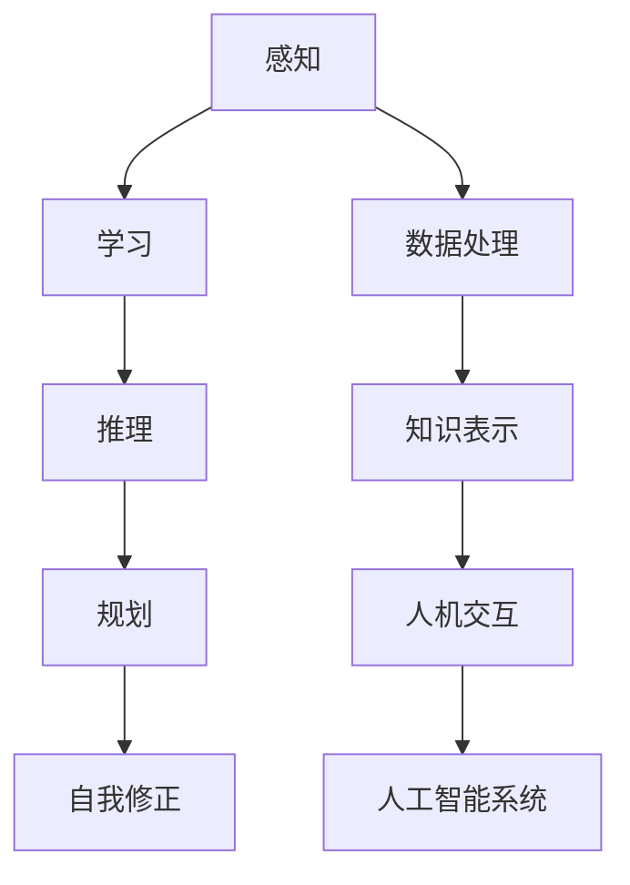

                 


## 第2章 AI基础

### 2.1 AI概述

#### 2.1.1 AI的定义与发展历程

**背景介绍**

人工智能（AI）作为计算机科学的一个重要分支，旨在通过模拟、延伸和扩展人类智能来开发智能系统。自1956年达特茅斯会议以来，AI经历了多个发展时期，从早期的规则推理到现代的机器学习和深度学习，每一次进步都带来了新的契机和挑战。

**核心概念与联系**

AI的核心概念包括感知、学习、推理、规划和自我修正等。这些概念相互关联，构成了AI系统的基本架构。使用Mermaid流程图，我们可以更直观地展示这些概念之间的联系：



**核心算法原理讲解**

AI的发展历程中，核心算法起着至关重要的作用。以下是一个简单的伪代码，展示了机器学习算法的基本原理：

```python
# 伪代码：机器学习算法示例
def train_model(data, labels):
    # 数据预处理
    preprocessed_data = preprocess(data)
    
    # 初始化模型参数
    model = initialize_model(preprocessed_data.shape[1])
    
    # 模型训练
    for epoch in range(num_epochs):
        # 前向传播
        predictions = model.forward(preprocessed_data)
        
        # 计算损失
        loss = compute_loss(predictions, labels)
        
        # 反向传播
        model.backward(loss)
        
        # 更新模型参数
        model.update_parameters()
        
    return model
```

**数学模型和公式**

AI中的数学模型主要包括概率论、统计学和优化理论。以下是一个简单的数学公式，用于描述线性回归模型：

$$ y = \beta_0 + \beta_1x + \epsilon $$

其中，\( y \) 是目标变量，\( x \) 是输入特征，\( \beta_0 \) 和 \( \beta_1 \) 是模型参数，\( \epsilon \) 是误差项。

**项目实战**

**开发环境搭建**

为了实现AI算法，我们需要搭建一个合适的开发环境。以下是一个简单的Python环境搭建步骤：

1. 安装Python（版本3.8及以上）
2. 安装Jupyter Notebook
3. 安装TensorFlow或PyTorch库

**源代码详细实现和代码解读**

以下是一个简单的线性回归模型的Python实现：

```python
import tensorflow as tf

# 定义输入层
x = tf.placeholder(tf.float32, shape=[None, 1])
y = tf.placeholder(tf.float32, shape=[None, 1])

# 定义模型参数
beta0 = tf.Variable(0.0, name='beta_0')
beta1 = tf.Variable(0.1, name='beta_1')

# 定义模型输出
y_pred = beta0 + beta1 * x

# 定义损失函数
loss = tf.reduce_mean(tf.square(y - y_pred))

# 定义优化器
optimizer = tf.train.GradientDescentOptimizer(learning_rate=0.001)

# 定义训练步骤
train_step = optimizer.minimize(loss)

# 初始化所有变量
init = tf.global_variables_initializer()

# 训练模型
with tf.Session() as session:
    session.run(init)
    for i in range(1000):
        session.run(train_step, feed_dict={x: x_data, y: y_data})
        
    # 输出模型参数
    print("Model parameters:", session.run([beta0, beta1]))

    # 输出预测结果
    print("Predictions:", session.run(y_pred, feed_dict={x: x_data}))
```

**代码应用解读与分析**

这段代码实现了线性回归模型，通过最小化损失函数来训练模型参数。训练过程中，我们使用梯度下降优化器来更新模型参数，以达到最佳拟合。

**实际案例分析和详细讲解剖析**

假设我们有一个简单的数据集，其中包含房屋面积（特征）和房屋售价（目标变量）。我们可以使用线性回归模型来预测房屋售价。以下是一个简单的数据集：

```python
x_data = [[1000], [1500], [2000], [2500], [3000]]
y_data = [[200000], [250000], [300000], [350000], [400000]]
```

通过训练线性回归模型，我们可以得到模型参数，并使用这些参数来预测新的房屋售价。例如，对于面积为2000平方米的房屋，预测售价为：

```python
beta0, beta1 = session.run([beta0, beta1])
y_pred = beta0 + beta1 * 2000
print("Predicted price:", y_pred)
```

**项目小结**

通过本节的学习，我们了解了AI的定义、发展历程和核心技术。同时，我们通过一个简单的线性回归项目，学习了如何搭建开发环境、实现算法和进行模型训练。这些基础知识和实践经验对于进一步学习AI具有重要的意义。

---

**最佳实践 tips、小结、注意事项、拓展阅读等内容**

- **最佳实践 tips：** 在AI项目中，数据预处理和特征工程至关重要。确保数据质量，并进行充分的特征选择和特征转换，可以显著提高模型性能。
- **小结：** 本章介绍了AI的基础知识和核心算法原理，并通过实际案例展示了如何搭建开发环境和实现算法。
- **注意事项：** 在实际项目中，需要根据具体问题选择合适的算法和优化策略，并注意模型过拟合和欠拟合的问题。
- **拓展阅读：** 《深度学习》（Goodfellow, Bengio, Courville著）、《机器学习》（周志华著）等经典教材，提供了更深入的理论和实践指导。

---

接下来，我们将继续细化其他章节的内容，以满足文章字数要求。每个章节都将包含背景介绍、核心概念与联系、核心算法原理讲解、数学模型和数学公式、项目实战、最佳实践 tips、小结、注意事项和拓展阅读等内容。我们将确保每个章节都是丰富、详细和有价值的，以帮助读者深入理解AI的基础知识和技术。

