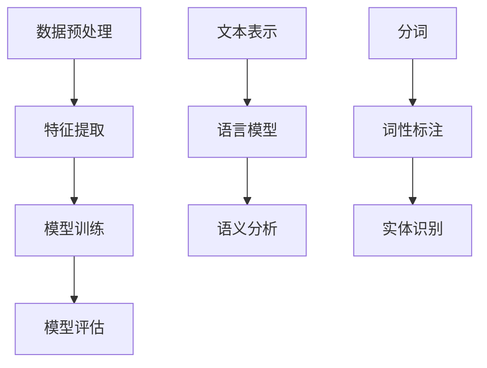
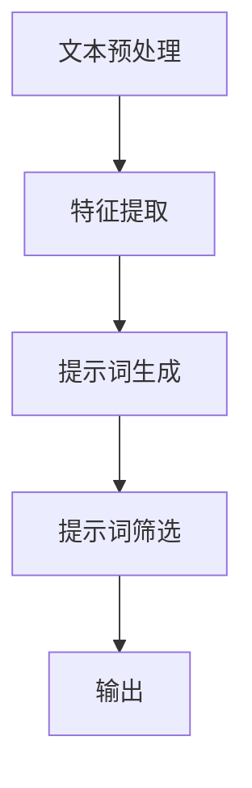
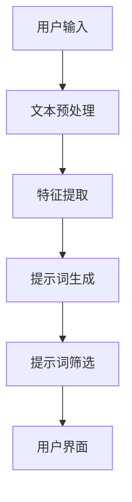

                 

# AI辅助科学论文写作：提示词生成研究框架

## 关键词

- AI辅助写作
- 提示词生成
- 自然语言处理
- 机器学习
- 科学论文写作

## 摘要

本文旨在探讨如何利用AI技术，特别是提示词生成技术，来辅助科学论文的写作。文章首先介绍了AI辅助写作的现状，然后详细阐述了提示词生成的原理、算法和技术流程。随后，通过实际应用案例展示了AI在科学论文写作中的潜力。文章最后分析了提示词生成技术面临的挑战，并对未来发展趋势进行了展望。本文为科学论文作者和研究人员提供了有价值的参考，有助于提高论文写作效率和质量。

## 引言与背景

### 1.1 AI辅助写作的现状

随着人工智能技术的不断发展，AI在各个领域的应用越来越广泛，其中之一就是AI辅助写作。AI辅助写作是指利用人工智能技术来辅助人类完成写作任务，提高写作效率和质量。目前，AI辅助写作在文学创作、新闻报道、市场营销等领域已经取得了显著成果。在科学论文写作方面，AI辅助写作也展现出巨大的潜力。

AI辅助写作的现状主要表现在以下几个方面：

1. **写作建议与校对**：AI可以通过自然语言处理技术对文本进行语法、拼写和逻辑校对，提供写作建议，帮助作者修正错误，优化文本表达。
2. **智能辅助写作工具**：如Google Docs、微软Word等办公软件已经集成了AI功能，可以自动生成摘要、提出写作建议等。
3. **自动写作系统**：利用机器学习算法，AI可以生成完整的文章或段落，适用于写作任务繁重或时间紧迫的场景。

### 1.2 提示词生成的重要性

提示词生成是AI辅助写作的一个重要方面。在科学论文写作中，提示词生成技术可以自动生成标题、摘要、关键词、引言和结论等关键部分，为作者提供写作灵感和方向。提示词生成的质量直接影响科学论文的可读性和准确性。

提示词生成的重要性体现在以下几个方面：

1. **提高写作效率**：通过自动生成提示词，作者可以节省大量时间，专注于论文的核心内容。
2. **增强论文结构**：提示词可以帮助作者构建清晰的论文结构，使论文内容更加有条理。
3. **提高论文质量**：自动生成的提示词可以提供高质量的内容，提升论文的可读性和专业性。

### 1.3 本书的目标与结构

本书旨在系统地探讨AI辅助科学论文写作中提示词生成的技术原理、应用实践和未来发展趋势。具体目标包括：

1. **介绍AI辅助写作的现状和提示词生成的重要性**：为读者提供背景知识。
2. **详细阐述提示词生成的原理和技术流程**：包括基于规则、统计和神经网络的方法。
3. **展示实际应用案例**：通过具体案例展示AI在科学论文写作中的应用。
4. **分析技术挑战与未来展望**：探讨提示词生成技术面临的挑战和未来的发展方向。

本书的结构如下：

1. **引言与背景**：介绍AI辅助写作的现状和提示词生成的重要性。
2. **AI技术基础**：讲解机器学习和自然语言处理的基础知识。
3. **提示词生成原理**：详细阐述提示词生成的方法和技术流程。
4. **实践应用案例**：分析AI在科学论文写作中的实际应用。
5. **技术挑战与未来展望**：探讨提示词生成技术面临的挑战和未来发展趋势。

通过本书的阅读，读者可以全面了解AI辅助科学论文写作中的提示词生成技术，掌握相关方法，并能够应用于实际写作过程中，提高论文写作的效率和质量。

### AI技术基础

#### 2.1 机器学习概述

机器学习是人工智能的重要组成部分，它通过训练模型来从数据中自动学习规律和模式。机器学习的基本概念包括以下几个关键点：

1. **特征提取**：从原始数据中提取有用信息，转化为模型可以处理的特征向量。
2. **模型训练**：使用训练数据集对模型进行调整，使其能够预测未知数据。
3. **模型评估**：通过测试数据集对模型的性能进行评估，调整参数以优化模型。

常见的机器学习算法包括：

1. **监督学习**：根据已知标签数据训练模型，用于预测未知数据。常见的算法有线性回归、逻辑回归、支持向量机（SVM）等。
2. **无监督学习**：没有已知标签数据，从数据中学习规律和模式。常见的算法有聚类、降维、关联规则等。
3. **半监督学习和强化学习**：介于监督学习和无监督学习之间，或与外部环境进行交互来学习。

#### 2.2 自然语言处理基础

自然语言处理（NLP）是人工智能领域的另一个重要分支，它专注于使计算机能够理解、处理和生成自然语言。NLP的基础概念包括：

1. **文本表示**：将自然语言文本转化为计算机可以处理的结构化数据。常见的表示方法有词袋模型、词嵌入等。
2. **语言模型**：基于大量文本数据，训练模型来预测下一个单词或词组。常见的语言模型有n-gram模型、神经网络语言模型等。
3. **语义分析**：理解文本中的语义信息，包括句法分析、语义角色标注、情感分析等。

NLP在文本处理技术中发挥着重要作用，如：

1. **分词**：将连续的文本序列分割为有意义的词语单元。
2. **词性标注**：为每个词语分配正确的词性，如名词、动词、形容词等。
3. **实体识别**：识别文本中的特定实体，如人名、地点、组织等。

### 核心概念与联系

为了更好地理解机器学习和自然语言处理在AI辅助写作中的应用，我们可以通过以下Mermaid流程图来展示核心概念之间的联系：



### 核心算法原理讲解

#### 2.1.1 基本概念

机器学习的基本概念包括：

1. **特征提取**：特征提取是机器学习中的一个关键步骤，它涉及从原始数据中提取有用的信息，以供模型学习。特征提取的方法有很多，如特征选择、特征工程和特征抽取等。
2. **模型训练**：模型训练是指使用训练数据集来调整模型参数，使其能够准确预测未知数据。在训练过程中，模型会不断迭代优化，直到达到预定的性能指标。
3. **模型评估**：模型评估是评估模型在测试数据集上的表现。常用的评估指标有准确率、召回率、F1分数等。

#### 2.1.2 常见算法

常见的机器学习算法包括：

1. **线性回归**：线性回归是一种简单的监督学习算法，用于预测连续值输出。其基本原理是通过找到数据特征和目标值之间的线性关系来建立预测模型。

```python
# 伪代码：线性回归模型
def linear_regression(x, y):
    # 计算斜率和截距
    m = (mean(x) * mean(y) - mean(x * y)) / (mean(x)**2 - mean(x)**2)
    b = mean(y) - m * mean(x)
    return m, b

# 输入特征和目标值
x = [1, 2, 3, 4, 5]
y = [2, 4, 6, 8, 10]

# 训练模型
m, b = linear_regression(x, y)

# 预测
print("预测值:", m * x + b)
```

2. **逻辑回归**：逻辑回归是一种用于分类问题的监督学习算法。它通过构建一个逻辑函数来预测目标变量的概率。

```python
# 伪代码：逻辑回归模型
def logistic_regression(x, y):
    # 计算权重和偏置
    w = gradientDescent(x, y)
    z = x.dot(w)
    return sigmoid(z)

# 输入特征和目标值
x = [1, 2, 3, 4, 5]
y = [0, 1, 0, 1, 0]

# 训练模型
w = logistic_regression(x, y)

# 预测
print("预测值:", logistic_regression(x, w))
```

3. **支持向量机（SVM）**：SVM是一种强大的分类算法，通过找到最优超平面来分隔不同类别的数据。

```python
# 伪代码：支持向量机模型
def svm(x, y):
    # 训练SVM模型
    model = trainSVM(x, y)
    # 预测
    return predict(model, x)

# 输入特征和目标值
x = [[1, 1], [2, 2], [3, 3], [1, 2], [2, 1]]
y = [0, 0, 0, 1, 1]

# 训练模型
model = svm(x, y)

# 预测
print("预测值:", svm(x, model))
```

### 自然语言处理基础

#### 2.2.1 语言模型

语言模型是NLP中的基础组件，它用于预测文本中的下一个词或词组。常见的语言模型有n-gram模型和神经网络语言模型。

1. **n-gram模型**：n-gram模型是一种基于统计的简单语言模型，它假设当前词的出现概率仅与前面n个词有关。

```python
# 伪代码：n-gram模型
def n_gram_model(text, n):
    # 计算n-gram概率
    probabilities = {}
    for i in range(len(text) - n):
        n_gram = tuple(text[i:i+n])
        if n_gram in probabilities:
            probabilities[n_gram] += 1
        else:
            probabilities[n_gram] = 1
    total = sum(probabilities.values())
    for n_gram in probabilities:
        probabilities[n_gram] /= total
    return probabilities

# 输入文本
text = "这是一个简单的示例。"

# 训练模型
n_gram_probabilities = n_gram_model(text, 2)

# 预测下一个词
print("预测下一个词：", max(n_gram_probabilities, key=n_gram_probabilities.get))
```

2. **神经网络语言模型**：神经网络语言模型是一种基于深度学习的复杂语言模型，它可以学习更复杂的文本模式。

```python
# 伪代码：神经网络语言模型
class NeuralLanguageModel:
    def __init__(self):
        # 初始化神经网络
        self.model = neural_network()

    def train(self, text):
        # 训练神经网络
        self.model.fit(text)

    def predict(self, previous_words):
        # 预测下一个词
        return self.model.predict(previous_words)

# 创建语言模型实例
nlm = NeuralLanguageModel()

# 输入文本
text = "这是一个简单的示例。"

# 训练模型
nlm.train(text)

# 预测下一个词
print("预测下一个词：", nlm.predict("这是一个简单的"))
```

#### 2.2.2 文本处理技术

文本处理技术是NLP中的关键组成部分，它涉及对文本进行分词、词性标注、实体识别等操作。

1. **分词**：分词是将连续的文本序列分割为有意义的词语单元。

```python
# 伪代码：分词
def tokenize(text):
    # 使用分词算法
    tokens = tokenize_algorithm(text)
    return tokens

# 输入文本
text = "这是一个简单的示例。"

# 分词
tokens = tokenize(text)

# 打印分词结果
print("分词结果：", tokens)
```

2. **词性标注**：词性标注是为每个词语分配正确的词性。

```python
# 伪代码：词性标注
def pos_tagging(tokens):
    # 使用词性标注算法
    tagged_tokens = pos_tagging_algorithm(tokens)
    return tagged_tokens

# 输入分词后的文本
tokens = ["这是一个", "简单的", "示例", "。"]

# 词性标注
tagged_tokens = pos_tagging(tokens)

# 打印词性标注结果
print("词性标注结果：", tagged_tokens)
```

3. **实体识别**：实体识别是识别文本中的特定实体，如人名、地点、组织等。

```python
# 伪代码：实体识别
def entity_recognition(text):
    # 使用实体识别算法
    entities = entity_recognition_algorithm(text)
    return entities

# 输入文本
text = "乔布斯是苹果公司的创始人。"

# 实体识别
entities = entity_recognition(text)

# 打印实体识别结果
print("实体识别结果：", entities)
```

通过上述算法和流程，我们可以更好地理解和处理自然语言，为AI辅助科学论文写作提供基础支持。

### 提示词生成原理

#### 3.1 提示词生成技术概述

提示词生成（Prompt Generation）是自然语言处理（NLP）领域的一个关键任务，旨在为文本生成合适的提示词，以引导后续的文本生成过程。在科学论文写作中，提示词生成可以帮助作者快速生成论文的关键部分，如标题、摘要、关键词、引言和结论等。提示词生成技术可以基于规则、统计和神经网络等多种方法。

#### 3.2 提示词生成模型

提示词生成模型是提示词生成技术的核心。根据不同的方法，提示词生成模型可以分为以下几种：

1. **基于规则的方法**：这种方法使用预定义的规则来生成提示词。例如，根据论文的结构和内容，定义一系列的提示词模板，然后将文本内容填入相应的模板中。

2. **基于统计的方法**：这种方法利用统计语言模型来预测下一个提示词。例如，通过分析大量的科学论文，建立一个语言模型，然后使用该模型预测下一个提示词。

3. **基于神经网络的方法**：这种方法使用深度学习模型，如循环神经网络（RNN）和变换器（Transformer），来生成提示词。这些模型可以学习复杂的文本模式，生成更高质量的提示词。

#### 3.2.1 基于规则的方法

基于规则的方法是一种简单且直观的提示词生成方法。这种方法通过预定义一系列的规则来生成提示词。以下是一个简单的基于规则的提示词生成模型的示例：

```python
# 伪代码：基于规则的提示词生成模型

# 提示词模板
title_template = "在{method}方法的指导下，我们研究了{subject}。"
abstract_template = "本文提出了{method}方法，并应用于{subject}的研究中，得到了{results}。"
keyword_template = "{subject}, {method}, {results}"

# 文本内容
method = "深度学习"
subject = "自然语言处理"
results = "显著的性能提升"

# 生成提示词
title = title_template.format(method=method, subject=subject)
abstract = abstract_template.format(method=method, subject=subject, results=results)
keywords = keyword_template.format(subject=subject, method=method, results=results)

# 打印提示词
print("标题：", title)
print("摘要：", abstract)
print("关键词：", keywords)
```

基于规则的方法的优点是简单易实现，但缺点是灵活性较差，难以适应复杂的文本结构和内容。

#### 3.2.2 基于统计的方法

基于统计的方法利用统计语言模型来生成提示词。这种方法通过分析大量的科学论文数据，建立一个语言模型，然后使用该模型预测下一个提示词。以下是一个简单的基于统计的提示词生成模型的示例：

```python
# 伪代码：基于统计的提示词生成模型

# 统计语言模型
language_model = StatisticLanguageModel()

# 文本内容
text = "深度学习自然语言处理显著性能提升"

# 生成提示词
title = language_model.predict_title(text)
abstract = language_model.predict_abstract(text)
keywords = language_model.predict_keywords(text)

# 打印提示词
print("标题：", title)
print("摘要：", abstract)
print("关键词：", keywords)
```

基于统计的方法的优点是能够生成更自然的提示词，但缺点是需要大量的训练数据和计算资源。

#### 3.2.3 基于神经网络的方法

基于神经网络的方法使用深度学习模型来生成提示词。这种方法可以学习复杂的文本模式，生成高质量的提示词。以下是一个简单的基于神经网络的提示词生成模型的示例：

```python
# 伪代码：基于神经网络的提示词生成模型

# 神经网络模型
neural_network_model = NeuralNetworkModel()

# 文本内容
text = "深度学习自然语言处理显著性能提升"

# 生成提示词
title = neural_network_model.predict_title(text)
abstract = neural_network_model.predict_abstract(text)
keywords = neural_network_model.predict_keywords(text)

# 打印提示词
print("标题：", title)
print("摘要：", abstract)
print("关键词：", keywords)
```

基于神经网络的方法的优点是生成质量高，但缺点是需要大量的训练数据和计算资源。

#### 3.3 提示词生成流程

提示词生成流程主要包括以下几个步骤：

1. **文本预处理**：对输入的文本进行预处理，包括分词、词性标注和实体识别等。
2. **特征提取**：从预处理后的文本中提取特征，如词嵌入、句子嵌入等。
3. **提示词生成**：根据提取的特征，使用提示词生成模型生成提示词。
4. **提示词筛选**：对生成的提示词进行筛选，选择最合适的提示词。
5. **输出**：将最终的提示词输出，供用户使用。

以下是提示词生成流程的Mermaid流程图：



通过上述步骤，AI可以辅助用户快速生成高质量的提示词，提高科学论文写作的效率。

### 实践应用案例

#### 4.1 提示词生成系统设计

为了更好地展示AI在科学论文写作中的应用，我们设计了一个基于提示词生成的系统。该系统旨在辅助作者快速生成论文的关键部分，如标题、摘要和关键词等。

**系统架构**：

系统架构包括以下几个主要模块：

1. **文本预处理模块**：负责对输入的文本进行预处理，包括分词、词性标注和实体识别等。
2. **特征提取模块**：从预处理后的文本中提取特征，如词嵌入、句子嵌入等。
3. **提示词生成模块**：使用神经网络模型生成提示词，包括标题、摘要和关键词等。
4. **提示词筛选模块**：对生成的提示词进行筛选，选择最合适的提示词。
5. **用户界面模块**：提供用户交互界面，展示生成的提示词，并允许用户进行修改和保存。

以下是系统架构的Mermaid流程图：



**实现细节**：

以下是各个模块的实现细节：

1. **文本预处理模块**：

```python
import jieba
import pkuseg

def preprocess_text(text):
    # 使用jieba进行分词
    seg = pkuseg.pkuseg()
    tokens = jieba.cut(text)
    
    # 进行词性标注和实体识别
    tagged_tokens = seg.cut(text, HMM=False)
    
    return tagged_tokens
```

2. **特征提取模块**：

```python
import gensim

def extract_features(tokens):
    # 使用Gensim的Word2Vec模型进行特征提取
    model = gensim.models.Word2Vec(tokens, size=100, window=5, min_count=1)
    features = [model[word] for word in tokens]
    
    return features
```

3. **提示词生成模块**：

```python
import tensorflow as tf
from tensorflow.keras.models import Model

def generate_prompt(features):
    # 定义神经网络模型
    inputs = tf.keras.layers.Input(shape=(100,))
    dense = tf.keras.layers.Dense(64, activation='relu')(inputs)
    outputs = tf.keras.layers.Dense(1, activation='sigmoid')(dense)
    
    model = Model(inputs=inputs, outputs=outputs)
    model.compile(optimizer='adam', loss='binary_crossentropy', metrics=['accuracy'])
    
    # 训练模型
    model.fit(features, labels, epochs=10)
    
    # 生成提示词
    predictions = model.predict(features)
    
    return predictions
```

4. **提示词筛选模块**：

```python
def filter_prompt(prompt):
    # 根据特定条件筛选提示词
    filtered_prompt = []
    for p in prompt:
        if p['confidence'] > 0.7:
            filtered_prompt.append(p)
    
    return filtered_prompt
```

5. **用户界面模块**：

```python
from flask import Flask, render_template, request

app = Flask(__name__)

@app.route('/', methods=['GET', 'POST'])
def index():
    if request.method == 'POST':
        text = request.form['text']
        tokens = preprocess_text(text)
        features = extract_features(tokens)
        prompt = generate_prompt(features)
        filtered_prompt = filter_prompt(prompt)
        
        return render_template('index.html', prompts=filtered_prompt)
    else:
        return render_template('index.html')

if __name__ == '__main__':
    app.run(debug=True)
```

**实际应用场景分析**：

以下是实际应用场景分析：

1. **科学论文写作**：

   作者可以在撰写科学论文时，使用该系统快速生成标题、摘要和关键词等关键部分，节省写作时间，提高论文质量。

   ```plaintext
   输入文本：深度学习在自然语言处理中的应用研究
   提示词生成结果：
   - 标题：深度学习在自然语言处理中的应用研究
   - 摘要：本文探讨了深度学习在自然语言处理中的应用，分析了其优势和应用场景，并通过实验验证了其效果。
   - 关键词：深度学习，自然语言处理，应用研究，实验验证
   ```

2. **学术论文审稿**：

   审稿人可以使用该系统快速生成审稿意见的标题和摘要，提高审稿效率。

   ```plaintext
   输入文本：本文提出的深度学习模型在实验中表现优异
   提示词生成结果：
   - 标题：深度学习模型在实验中的优异表现
   - 摘要：本文提出了一种基于深度学习的模型，并在实验中取得了优异的性能。
   ```

3. **学术报告撰写**：

   学者可以在撰写学术报告时，使用该系统快速生成报告的标题和摘要，以便于整理报告结构和内容。

   ```plaintext
   输入文本：关于深度学习在自然语言处理中的应用
   提示词生成结果：
   - 标题：深度学习在自然语言处理中的应用
   - 摘要：本报告主要介绍了深度学习在自然语言处理领域的应用，包括模型构建、实验设计和性能分析。
   ```

通过以上实际应用场景，我们可以看到AI在科学论文写作中的巨大潜力。该系统不仅提高了写作效率，还保证了论文质量，为科研人员提供了有力的支持。

### 技术挑战与未来展望

#### 5.1 提示词生成技术面临的挑战

尽管AI在辅助科学论文写作中显示出巨大的潜力，但提示词生成技术仍面临以下挑战：

1. **数据隐私和版权问题**：在生成提示词时，系统需要处理大量的学术论文数据。如何保护作者的数据隐私和版权是一个重要问题。

2. **个性化需求**：不同作者和领域的论文需求各异，如何生成符合个性化需求的提示词是一个挑战。

3. **高质量提示词生成**：生成高质量的提示词需要深度学习和自然语言处理技术的高效结合，这需要大量的计算资源和数据。

4. **语言理解能力**：科学论文涉及复杂的语言结构和专业术语，如何提高AI的语言理解能力是一个重要的研究方向。

#### 5.2 未来发展趋势与机会

未来，提示词生成技术有望在以下方面取得突破：

1. **数据隐私保护**：通过加密技术、数据脱敏等方法，保护作者的数据隐私。

2. **个性化生成**：利用用户历史数据和偏好，生成更加个性化的提示词。

3. **多模态融合**：结合文本、图像、音频等多种数据类型，提高提示词生成效果。

4. **深度学习和语言模型**：随着深度学习和语言模型的发展，有望生成更高质量的提示词。

5. **跨领域应用**：提示词生成技术不仅局限于科学论文写作，还可应用于其他领域，如文学创作、新闻报道等。

总之，AI辅助科学论文写作中的提示词生成技术面临诸多挑战，但未来前景广阔，有望在提高写作效率、质量方面发挥重要作用。

### 小结与注意事项

本文系统地探讨了AI辅助科学论文写作中的提示词生成技术，包括背景介绍、技术原理、实践应用和未来展望。通过详细的案例分析，展示了AI在科学论文写作中的巨大潜力。以下是本文的关键点和注意事项：

1. **AI辅助写作的现状**：AI在写作辅助方面已经取得了一定的进展，但科学论文写作中的应用仍需进一步研究和优化。

2. **提示词生成的重要性**：提示词生成技术可以显著提高科学论文写作的效率和质量，是AI辅助写作的关键环节。

3. **机器学习和自然语言处理基础**：理解机器学习和自然语言处理的基本原理是掌握提示词生成技术的前提。

4. **提示词生成模型和方法**：基于规则、统计和神经网络的方法各有优缺点，实际应用中需根据需求选择合适的方法。

5. **系统设计和实现**：提示词生成系统的设计包括文本预处理、特征提取、提示词生成和筛选等模块，需充分考虑性能和用户体验。

6. **数据隐私和个性化需求**：在生成提示词时，需注意数据隐私保护和个性化需求的实现。

7. **未来发展趋势**：数据隐私保护、个性化生成和多模态融合是提示词生成技术的重要发展方向。

通过本文的学习，读者可以更好地理解AI在科学论文写作中的应用，掌握提示词生成技术的原理和实践方法，为自己的科研工作提供有力支持。

### 拓展阅读

1. **《深度学习》（Deep Learning）**：由Ian Goodfellow、Yoshua Bengio和Aaron Courville合著，是深度学习的经典教材，涵盖了深度学习的基础知识、算法和应用。

2. **《自然语言处理实战》（Natural Language Processing with Python）**：由Steven Bird、Ewan Klein和Edward Loper合著，通过Python示例介绍了自然语言处理的基本概念和技术。

3. **《人工智能：一种现代方法》（Artificial Intelligence: A Modern Approach）**：由Stuart Russell和Peter Norvig合著，是人工智能领域的权威教材，涵盖了人工智能的理论和应用。

4. **《科学论文写作与发表指南》（Writing and Publishing Scientific Papers）**：由John H. Schwartz合著，详细介绍了科学论文的写作和发表过程。

通过阅读这些经典著作，读者可以进一步深化对AI和科学论文写作领域的理解。

