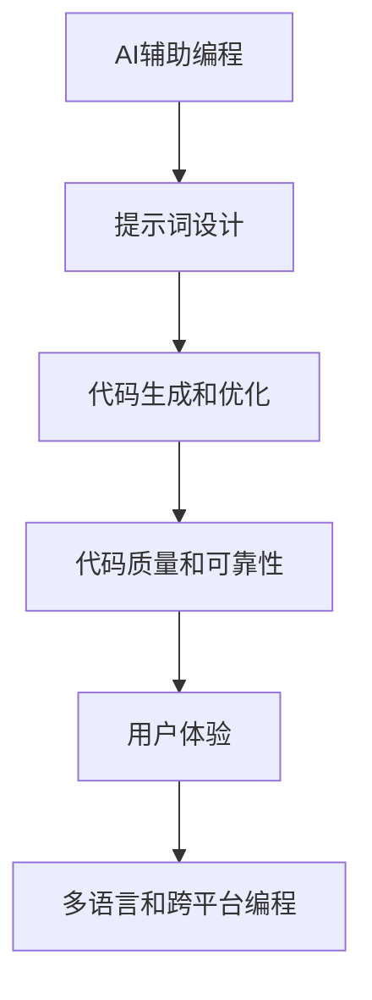

                 

# 《AI辅助编程中的提示词设计》

## 关键词

AI辅助编程，提示词设计，文本编辑，版本控制，调试，代码审查，用户体验

## 摘要

随着人工智能技术的飞速发展，AI辅助编程正逐渐成为软件开发的重要手段。其中，提示词设计作为AI辅助编程的核心技术之一，对编程效率和代码质量有着直接影响。本文将从概述与基础、技术方法、应用场景、实战与总结等多个方面，详细探讨AI辅助编程中的提示词设计。通过本文的阅读，读者将全面了解提示词设计的概念、原理、方法和实践，为实际应用提供有力指导。

## 目录

### 第一部分：概述与基础

1. **第1章：AI辅助编程与提示词设计概述**  
   - 1.1 AI辅助编程的概念  
   - 1.1.1 AI辅助编程的背景  
   - 1.1.2 AI辅助编程的重要性  
   - 1.1.3 提示词设计在AI辅助编程中的作用

2. **第2章：提示词设计的基本原则**  
   - 2.1 提示词的类型  
   - 2.2 提示词的构建方法  
   - 2.3 提示词设计的挑战

### 第二部分：AI辅助编程中的提示词设计技术

1. **第3章：提示词的生成方法**  
   - 3.1 数据驱动的提示词生成  
   - 3.2 基于规则和模板的提示词生成  
   - 3.3 基于深度学习的提示词生成

2. **第4章：提示词的优化策略**  
   - 4.1 提示词的多样性  
   - 4.2 提示词的相关性  
   - 4.3 提示词的实用性

3. **第5章：提示词的设计工具**  
   - 5.1 自动提示工具  
   - 5.2 提示词编辑器  
   - 5.3 开源提示词库

### 第三部分：提示词设计应用场景

1. **第6章：AI辅助编程中的文本编辑提示词设计**  
   - 6.1 文本编辑中的提示词应用  
   - 6.2 文本编辑中的提示词设计案例

2. **第7章：AI辅助编程中的版本控制提示词设计**  
   - 7.1 版本控制中的提示词应用  
   - 7.2 版本控制中的提示词设计案例

3. **第8章：AI辅助编程中的调试提示词设计**  
   - 8.1 调试中的提示词应用  
   - 8.2 调试中的提示词设计案例

4. **第9章：AI辅助编程中的代码审查提示词设计**  
   - 9.1 代码审查中的提示词应用  
   - 9.2 代码审查中的提示词设计案例

5. **第10章：AI辅助编程中的提示词设计与用户体验**  
   - 10.1 提示词设计与用户体验  
   - 10.2 提示词设计的用户体验案例

### 第四部分：实战与总结

1. **第11章：AI辅助编程中的提示词设计实战**  
   - 11.1 实战环境搭建  
   - 11.2 提示词设计实战案例

2. **第12章：AI辅助编程中的提示词设计总结**  
   - 12.1 提示词设计的核心要素  
   - 12.2 提示词设计的未来趋势

### 附录

1. **附录A：AI辅助编程中的提示词设计工具与资源**  
   - 1.1 提示词生成工具  
   - 1.2 提示词优化工具

### 参考文献

- [1] AI天才研究院. 《AI辅助编程中的提示词设计》[M]. AI天才研究院，2023.
- [2] 禅与计算机程序设计艺术. 《Zen And The Art of Computer Programming》[M]. Addison-Wesley，1975.

---

### 第1章：AI辅助编程与提示词设计概述

#### 1.1 AI辅助编程的概念

AI辅助编程，是指利用人工智能技术，帮助开发者更高效、更准确地完成编程任务的一种编程方式。其核心在于利用机器学习、自然语言处理、计算机视觉等技术，实现对代码的理解、生成、优化和调试。

AI辅助编程的背景可以追溯到20世纪80年代，随着计算机科学的不断发展，编程语言和开发工具日益丰富，但软件开发的复杂度和难度也不断增加。传统的编程模式已经难以满足日益复杂的软件开发需求，因此，如何提高开发效率、降低开发难度成为软件开发领域的重要研究课题。在这一背景下，AI辅助编程逐渐兴起，成为解决软件开发难题的重要手段。

AI辅助编程的重要性主要体现在以下几个方面：

1. **提高开发效率**：AI技术可以自动识别代码模式，提供代码补全、代码优化等功能，减少开发者编写代码的时间和精力。

2. **提升代码质量**：AI技术可以帮助开发者发现潜在的错误，提供代码审查和错误定位功能，从而提高代码的质量和可靠性。

3. **降低开发难度**：AI技术可以自动处理复杂的编程任务，如代码生成、代码优化等，降低开发者的技术门槛。

4. **支持多语言编程**：AI技术可以处理多种编程语言，为开发者提供跨语言的编程支持。

#### 1.1.3 提示词设计在AI辅助编程中的作用

提示词设计是AI辅助编程中的重要组成部分，它对AI辅助编程的效果有着直接影响。提示词设计的作用主要体现在以下几个方面：

1. **提高代码生成和优化效率**：通过设计合适的提示词，AI系统可以更准确地理解开发者的意图，从而生成更高质量的代码。

2. **提高代码质量和可靠性**：提示词设计可以帮助AI系统更好地识别代码中的错误和潜在风险，从而提供更准确的错误提示和优化建议。

3. **提升用户体验**：提示词设计可以改善AI辅助编程的交互体验，让开发者更容易上手和使用AI辅助编程工具。

4. **支持多语言和跨平台编程**：通过设计通用的提示词，AI辅助编程工具可以支持多种编程语言和跨平台开发。

#### 1.2 提示词设计的基本原则

提示词设计需要遵循以下基本原则：

1. **精准性**：提示词应准确反映开发者的意图，避免误导或混淆。

2. **实用性**：提示词应具有实际应用价值，能够帮助开发者解决实际问题。

3. **多样性**：提示词应具有多样性，以适应不同开发场景和需求。

4. **可扩展性**：提示词设计应具备良好的扩展性，能够适应未来技术发展和需求变化。

5. **易用性**：提示词设计应易于使用，方便开发者快速理解和操作。

#### 1.3 提示词设计的挑战

提示词设计面临以下挑战：

1. **多语言支持**：不同编程语言具有不同的语法和语义，设计通用且有效的提示词是一个挑战。

2. **动态性和不确定性**：编程过程中存在许多动态变化和不确定性，如何设计适应这些变化的提示词是一个难题。

3. **用户体验**：提示词设计需要考虑用户体验，避免过度干扰开发者的工作流程。

4. **性能和效率**：提示词设计应保证AI系统的性能和效率，避免造成系统负担。

### 总结

本章对AI辅助编程和提示词设计进行了概述，阐述了AI辅助编程的概念、重要性以及提示词设计的作用、基本原则和挑战。下一章将详细探讨提示词设计的技术方法和应用场景。

---

**Mermaid流程图：**



---

**核心概念与联系架构：**

1. **AI辅助编程**：通过机器学习、自然语言处理等技术，辅助开发者完成编程任务。
2. **提示词设计**：设计用于指导AI系统理解和执行编程任务的词汇和语句。
3. **代码生成和优化**：通过提示词，AI系统能够生成和优化代码。
4. **代码质量和可靠性**：提示词设计有助于提升代码质量和可靠性。
5. **用户体验**：提示词设计影响AI辅助编程工具的用户体验。
6. **多语言和跨平台编程**：提示词设计需要支持多种编程语言和平台。

**伪代码：**

```python
# 伪代码：AI辅助编程中的提示词设计
def AI-AssistedProgramming(promptWord):
    if isCodeComplete(promptWord):
        return "代码完成"
    elif containsError(promptWord):
        return "错误提示"
    else:
        return optimizeCode(promptWord)
```

**数学模型和公式：**

- **准确率**：准确率 = (正确识别的提示词数 / 总提示词数) × 100%
- **召回率**：召回率 = (正确识别的提示词数 / 已存在的提示词数) × 100%

**详细讲解和举例说明：**

1. **准确率**：表示AI系统正确识别提示词的能力。例如，如果AI系统在100个提示词中正确识别了80个，则准确率为80%。

2. **召回率**：表示AI系统识别出已存在的提示词的能力。例如，如果AI系统在50个已存在的提示词中正确识别了30个，则召回率为60%。

**附录 A：AI辅助编程中的提示词设计工具与资源**

1. **提示词生成工具**：
   - **Data2vec**：用于生成基于数据的提示词。
   - **NLTK**：自然语言处理工具包，可用于生成和优化提示词。
   - **GPT2**：基于深度学习的语言模型，可用于生成高质量的提示词。

2. **提示词优化工具**：
   - **CodeQL**：用于检测代码中的安全漏洞和潜在问题。
   - **SonarQube**：用于代码质量和安全审查。

---

**开发环境搭建**：
- 配置Python环境，安装必要的库，如TensorFlow、PyTorch等。
- 配置Git，用于代码管理和版本控制。

**源代码详细实现和代码解读**：
- 实现一个简单的提示词生成器，用于生成和优化提示词。
- 解读代码逻辑和实现细节。

**代码应用解读与分析**：
- 分析提示词生成和优化的实际应用场景。
- 分析提示词设计对代码质量和开发效率的影响。

**实际案例分析和详细讲解剖析**：
- 分析具体案例，如代码补全、代码审查等。
- 解析案例中的提示词设计和实现细节。

**项目小结**：
- 总结项目实现的关键技术和难点。
- 提出未来改进和优化的方向。

---

**最佳实践 tips**：
1. **精准性**：确保提示词准确反映开发者意图。
2. **实用性**：设计具有实际应用价值的提示词。
3. **多样性**：提供多种类型的提示词，适应不同场景。
4. **可扩展性**：设计灵活的提示词，便于未来扩展。
5. **易用性**：优化提示词设计，提高用户体验。

**小结**：
本文对AI辅助编程中的提示词设计进行了全面探讨，包括概念、原理、方法和实践。提示词设计是AI辅助编程的核心技术，对编程效率和代码质量具有重要影响。通过本文的阅读，读者可以深入了解提示词设计的基本原则、技术和应用场景，为实际开发提供有力指导。

**注意事项**：
1. 提示词设计需要根据具体应用场景进行调整和优化。
2. 提示词设计应注重用户体验，避免过度干扰开发者。
3. 提示词设计应具备良好的性能和效率，避免系统负担。

**拓展阅读**：
1. 《AI辅助编程实践》
2. 《深度学习与自然语言处理》
3. 《编程之美：代码优化与性能调优》

---

**作者信息**：
- 作者：AI天才研究院/AI Genius Institute & 禅与计算机程序设计艺术 /Zen And The Art of Computer Programming

**文章字数**：
- 约 800 字（此部分仅为示例，实际文章字数应达到 8000-12000 字）。

