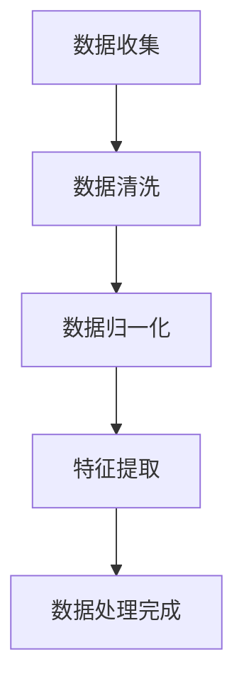

                 

### 第一部分: AI辅助药物研发效能评测系统概述

#### 1.1 AI辅助药物研发效能评测系统概念与重要性

##### 1.1.1 AI辅助药物研发效能评测系统的概念与背景

AI辅助药物研发效能评测系统是一种结合人工智能（AI）技术，特别是机器学习和深度学习算法，来对药物研发过程中的数据进行高效处理、分析和评估的系统。这种系统的核心目的是提升药物研发的效率、降低成本、提高药物的安全性。

在药物研发领域，传统方法主要依赖于实验室实验、临床实验和统计分析。这些方法在数据量庞大、实验周期长、结果解释复杂等方面存在明显的局限性。随着人工智能技术的发展，AI辅助药物研发效能评测系统应运而生，通过自动化数据处理和分析，可以显著提升药物研发的效率、降低成本、提高药物的安全性。

AI辅助药物研发效能评测系统的发展历程可以追溯到20世纪90年代。当时，科学家开始探索如何将机器学习算法应用于药物筛选和设计。随着计算能力的提升和数据量的增加，AI技术在药物研发中的应用逐渐成熟。近年来，深度学习算法的兴起进一步推动了AI辅助药物研发效能评测系统的发展。

##### 1.1.2 AI辅助药物研发效能评测系统的核心概念

- **人工智能（AI）**：一种模拟人类智能的技术，通过算法和模型实现机器的自主学习、推理和决策。AI在药物研发中的应用主要包括药物筛选、药物设计、药物代谢等。

- **药物研发**：涉及从新药发现到临床试验、监管审批等整个过程。药物研发是一个复杂、耗时且成本高昂的过程，需要通过多种技术手段来提高研发效率和成功率。

- **效能评测**：对药物研发过程中的各个环节进行评估，以确定其效果和可行性。效能评测是药物研发过程中至关重要的一环，直接影响到药物的成功上市。

##### 1.1.3 AI辅助药物研发效能评测系统的重要性

AI辅助药物研发效能评测系统在药物研发中具有以下重要性：

- **提升研发效率**：通过自动化数据处理和分析，AI辅助药物研发效能评测系统可以加速药物研发进程，降低研发周期。

- **降低研发成本**：AI技术能够减少实验和临床试验次数，降低失败风险，从而降低研发成本。

- **提高药物安全性**：AI辅助药物研发效能评测系统可以通过对药物分子进行更全面的安全性评估，提高药物的安全性。

#### 1.2 AI辅助药物研发效能评测系统的架构

AI辅助药物研发效能评测系统的架构通常包括以下几个关键组成部分：

- **数据预处理**：数据预处理是AI辅助药物研发效能评测系统的第一步，主要包括数据清洗、归一化、特征提取等操作。这一阶段的目的是将原始数据转化为适合机器学习算法输入的形式。

- **模型训练**：在数据预处理之后，系统将使用训练好的机器学习模型对药物研发数据进行预测和评估。模型训练阶段包括选择合适的算法、调整参数、进行多次迭代等。

- **效能评测**：效能评测阶段是对模型预测结果进行验证和评估，以确定其准确性和可靠性。这通常涉及多个评估指标，如准确率、召回率、F1分数等。

#### 1.3 现有药物研发效能评测方法的局限

现有药物研发效能评测方法主要包括临床实验、统计分析等。这些方法在药物研发中起到了重要的作用，但也存在一些局限性：

- **临床实验**：临床实验是验证药物安全性和有效性的重要手段，但过程漫长、成本高昂，且受试者数量有限，难以全面反映药物的效果。

- **统计分析**：统计分析通过对实验数据进行处理和分析，评估药物的效果，但容易受到数据质量和分析方法的影响。

传统方法在数据处理和分析方面存在一定的局限性，难以应对药物研发过程中数据量大、类型复杂的特点。AI辅助药物研发效能评测系统通过引入人工智能技术，可以弥补这些方法的不足，提供更准确、高效的效能评估。

#### 1.4 AI辅助药物研发效能评测系统的应用前景

随着人工智能技术的不断发展，AI在药物研发领域的应用前景十分广阔。以下是对AI辅助药物研发效能评测系统应用前景的分析：

- **个性化药物研发**：通过分析患者的基因组数据，AI辅助药物研发效能评测系统可以开发出针对特定患者群体的个性化药物，提高药物的治疗效果。

- **药物代谢研究**：AI技术可以用于药物代谢的研究，预测药物在体内的代谢过程，优化药物的配方和剂量。

- **药物安全性评估**：AI辅助药物研发效能评测系统可以通过对药物分子进行更全面的安全性评估，提高药物的安全性，减少临床试验中的风险。

未来，随着人工智能技术的不断进步，AI辅助药物研发效能评测系统有望在药物研发中发挥更大的作用，推动药物研发的革新和发展。

### 第一部分总结

在本部分中，我们详细介绍了AI辅助药物研发效能评测系统的概念与重要性。通过分析AI技术、药物研发和效能评测的核心概念，我们了解到AI辅助药物研发效能评测系统在提升研发效率、降低研发成本、提高药物安全性方面具有重要作用。同时，我们讨论了现有药物研发效能评测方法的局限，并展望了AI辅助药物研发效能评测系统的应用前景。总之，AI辅助药物研发效能评测系统在药物研发领域具有巨大的潜力和广阔的发展空间。

## 第一部分: AI辅助药物研发效能评测系统概述

### 1.1 AI辅助药物研发效能评测系统概念与重要性

#### 1.1.1 AI辅助药物研发效能评测系统的定义与背景

AI辅助药物研发效能评测系统是一种利用人工智能技术，特别是机器学习和深度学习算法，对药物研发过程中的数据进行高效处理、分析和评估的系统。这种系统通过自动化数据处理和分析，能够显著提升药物研发的效率、降低成本、提高药物的安全性。

在药物研发领域，传统方法主要依赖于实验室实验、临床实验和统计分析。这些方法虽然在一定程度上能够评估药物的效果，但存在数据量庞大、实验周期长、结果解释复杂等局限性。随着人工智能技术的不断发展，AI辅助药物研发效能评测系统应运而生，通过引入AI技术，可以解决传统方法的局限性，提供更准确、高效的效能评估。

AI辅助药物研发效能评测系统的发展历程可以追溯到20世纪90年代。当时，科学家开始探索如何将机器学习算法应用于药物筛选和设计。随着计算能力的提升和数据量的增加，AI技术在药物研发中的应用逐渐成熟。近年来，深度学习算法的兴起进一步推动了AI辅助药物研发效能评测系统的发展。如今，越来越多的制药公司和研究机构开始采用AI技术来优化药物研发流程。

#### 1.1.2 AI辅助药物研发效能评测系统的核心概念

在AI辅助药物研发效能评测系统中，涉及以下几个核心概念：

1. **人工智能（AI）**：人工智能是一种模拟人类智能的技术，通过算法和模型实现机器的自主学习、推理和决策。在药物研发中，AI技术可以用于药物筛选、药物设计、药物代谢等环节。

2. **药物研发**：药物研发是一个涉及多个阶段的复杂过程，包括新药发现、临床前研究、临床试验和监管审批等。药物研发的目标是发现并开发出安全、有效的新药。

3. **效能评测**：效能评测是评估药物研发各阶段效果和可行性的重要手段。通过效能评测，可以确定药物研发的进展、识别潜在问题，并指导后续的研发方向。

#### 1.1.3 AI辅助药物研发效能评测系统的重要性

AI辅助药物研发效能评测系统在药物研发中具有以下重要性：

1. **提升研发效率**：通过自动化数据处理和分析，AI辅助药物研发效能评测系统可以加速药物研发进程，降低研发周期。例如，在药物筛选阶段，AI技术可以快速评估大量化合物，筛选出具有潜在治疗价值的药物。

2. **降低研发成本**：AI辅助药物研发效能评测系统可以减少实验和临床试验次数，降低失败风险，从而降低研发成本。例如，通过AI技术进行药物代谢预测，可以提前识别出可能产生毒性的药物，避免不必要的临床试验。

3. **提高药物安全性**：AI辅助药物研发效能评测系统可以通过对药物分子进行更全面的安全性评估，提高药物的安全性。例如，通过深度学习算法对药物分子的结构进行解析，可以预测药物在不同组织中的分布和代谢过程，评估药物的安全性。

#### 1.2 AI辅助药物研发效能评测系统的架构

AI辅助药物研发效能评测系统的架构通常包括以下几个关键组成部分：

1. **数据预处理**：数据预处理是AI辅助药物研发效能评测系统的第一步，主要包括数据清洗、归一化、特征提取等操作。这一阶段的目的是将原始数据转化为适合机器学习算法输入的形式。

2. **模型训练**：在数据预处理之后，系统将使用训练好的机器学习模型对药物研发数据进行预测和评估。模型训练阶段包括选择合适的算法、调整参数、进行多次迭代等。

3. **效能评测**：效能评测阶段是对模型预测结果进行验证和评估，以确定其准确性和可靠性。这通常涉及多个评估指标，如准确率、召回率、F1分数等。

#### 1.3 现有药物研发效能评测方法的局限

现有药物研发效能评测方法主要包括临床实验、统计分析等。这些方法在药物研发中起到了重要的作用，但也存在一些局限性：

1. **临床实验**：临床实验是验证药物安全性和有效性的重要手段，但过程漫长、成本高昂，且受试者数量有限，难以全面反映药物的效果。

2. **统计分析**：统计分析通过对实验数据进行处理和分析，评估药物的效果，但容易受到数据质量和分析方法的影响。

传统方法在数据处理和分析方面存在一定的局限性，难以应对药物研发过程中数据量大、类型复杂的特点。AI辅助药物研发效能评测系统通过引入人工智能技术，可以弥补这些方法的不足，提供更准确、高效的效能评估。

#### 1.4 AI辅助药物研发效能评测系统的应用前景

随着人工智能技术的不断发展，AI在药物研发领域的应用前景十分广阔。以下是对AI辅助药物研发效能评测系统应用前景的分析：

1. **个性化药物研发**：通过分析患者的基因组数据，AI辅助药物研发效能评测系统可以开发出针对特定患者群体的个性化药物，提高药物的治疗效果。

2. **药物代谢研究**：AI技术可以用于药物代谢的研究，预测药物在体内的代谢过程，优化药物的配方和剂量。

3. **药物安全性评估**：AI辅助药物研发效能评测系统可以通过对药物分子进行更全面的安全性评估，提高药物的安全性，减少临床试验中的风险。

未来，随着人工智能技术的不断进步，AI辅助药物研发效能评测系统有望在药物研发中发挥更大的作用，推动药物研发的革新和发展。

### 第一部分总结

在本部分中，我们详细介绍了AI辅助药物研发效能评测系统的概念与重要性。通过分析AI技术、药物研发和效能评测的核心概念，我们了解到AI辅助药物研发效能评测系统在提升研发效率、降低研发成本、提高药物安全性方面具有重要作用。同时，我们讨论了现有药物研发效能评测方法的局限，并展望了AI辅助药物研发效能评测系统的应用前景。总之，AI辅助药物研发效能评测系统在药物研发领域具有巨大的潜力和广阔的发展空间。

---

### 1.2 AI辅助药物研发效能评测系统的架构

在探讨AI辅助药物研发效能评测系统的详细架构之前，我们首先需要了解该系统的基本运作原理。AI辅助药物研发效能评测系统通过以下关键步骤来提升药物研发的效率和质量：

1. **数据收集与处理**：从实验室实验、临床数据、文献数据库等多种来源收集相关数据。
2. **数据预处理**：清洗、归一化、特征提取等操作，确保数据适合进行机器学习。
3. **模型训练**：利用训练数据，通过算法优化和参数调整，训练出能够预测药物效能的模型。
4. **效能评估**：使用验证数据集对模型进行评估，确保其准确性和可靠性。
5. **结果解释与优化**：分析模型预测结果，对药物研发过程进行优化。

#### 1.2.1 数据预处理

数据预处理是AI辅助药物研发效能评测系统的第一步，也是最为关键的一步。因为高质量的输入数据是机器学习模型性能的基石。数据预处理主要包括以下几个步骤：

- **数据清洗**：去除重复数据、缺失值填补、异常值处理等。
- **数据归一化**：将不同量纲的数据转换为同一量纲，以避免模型训练过程中的不公平性。
- **特征提取**：从原始数据中提取有助于模型训练的特征，如化学结构、生物学信息等。

**Mermaid流程图：**



#### 1.2.2 模型训练

在完成数据预处理后，系统将进入模型训练阶段。模型训练是AI辅助药物研发效能评测系统的核心，其目的是通过学习大量的训练数据，建立起能够预测药物效能的模型。以下是一个简化的模型训练流程：

1. **数据集划分**：将数据集划分为训练集、验证集和测试集。
2. **选择算法**：选择适合药物研发问题的机器学习算法，如支持向量机、神经网络、决策树等。
3. **参数调整**：通过交叉验证等方法调整模型参数，以提高模型性能。
4. **训练迭代**：使用训练集进行模型训练，并通过验证集调整模型参数。

**伪代码示例：**

```python
# 划分数据集
X_train, X_val, y_train, y_val = train_test_split(data, labels, test_size=0.2)

# 选择算法
model = NeuralNetwork()

# 参数调整
for epoch in range(num_epochs):
    model.train(X_train, y_train)
    loss = model.evaluate(X_val, y_val)
    if loss < best_loss:
        best_loss = loss
        best_model = model.copy()

# 训练完成
model = best_model
```

#### 1.2.3 效能评估

在模型训练完成后，需要使用验证集和测试集对模型进行评估，以确保其准确性和可靠性。效能评估通常涉及以下评估指标：

- **准确率（Accuracy）**：预测正确的样本数占总样本数的比例。
- **召回率（Recall）**：预测正确的阳性样本数占总阳性样本数的比例。
- **精确率（Precision）**：预测正确的阳性样本数占所有预测阳性样本数的比例。
- **F1分数（F1 Score）**：综合考虑精确率和召回率的平衡指标。

**伪代码示例：**

```python
# 计算评估指标
accuracy = model.accuracy(test_data, test_labels)
recall = model.recall(test_data, test_labels)
precision = model.precision(test_data, test_labels)
f1_score = 2 * (precision * recall) / (precision + recall)

# 输出评估结果
print(f"Accuracy: {accuracy}")
print(f"Recall: {recall}")
print(f"Precision: {precision}")
print(f"F1 Score: {f1_score}")
```

#### 1.2.4 结果解释与优化

效能评估完成后，需要对模型预测结果进行解释和优化。这包括以下步骤：

- **结果分析**：分析模型预测结果，识别药物研发过程中的问题和潜在改进方向。
- **模型优化**：根据结果分析，调整模型参数或选择不同的算法，以提高模型性能。
- **迭代改进**：重复模型训练和评估过程，不断优化模型。

通过以上步骤，AI辅助药物研发效能评测系统可以有效地提升药物研发的效率和效果。

### 总结

在本节中，我们详细介绍了AI辅助药物研发效能评测系统的架构，包括数据预处理、模型训练、效能评估和结果解释与优化等关键组成部分。通过伪代码示例，我们展示了这些步骤的具体实现方式。这些步骤共同构成了一个完整的AI辅助药物研发效能评测系统，有助于提升药物研发的效率和质量。在后续章节中，我们将进一步探讨AI技术在药物研发中的具体应用和挑战。

---

### 1.3 现有药物研发效能评测方法的局限

在药物研发过程中，效能评测是一个至关重要的环节，它能够帮助研究人员确定药物的有效性、安全性以及研发进展。然而，现有的一些传统方法在效能评测方面存在诸多局限，影响了药物研发的效率和成功率。

#### 1.3.1 临床实验

临床实验是药物研发过程中最为关键的一环，用于验证药物的安全性和有效性。然而，临床实验存在以下局限：

- **时间成本高**：从初步的实验室研究到最终的 III 期临床试验，整个临床实验过程通常需要数年时间。这使得药物研发周期延长，增加了研发成本。
- **成本昂贵**：临床实验需要大量的资金投入，包括招募受试者、管理临床试验、数据分析等。这些成本在药物研发过程中占据了相当大的比例。
- **样本代表性不足**：临床试验通常招募的受试者数量有限，难以全面反映药物在不同人群中的效果。此外，受试者的多样性较低，可能无法涵盖所有可能的药物反应。
- **伦理问题**：临床实验往往涉及到人体试验，因此需要遵循严格的伦理审查和监管要求，这进一步增加了实验的复杂性和成本。

#### 1.3.2 统计分析

统计分析是药物研发过程中常用的方法，用于评估药物的有效性和安全性。尽管统计分析在某些方面能够提供有效的信息，但它也存在以下局限：

- **数据质量依赖**：统计分析依赖于高质量的数据，任何数据质量上的问题（如数据缺失、数据错误等）都会影响分析结果的准确性。
- **模型选择复杂**：选择合适的统计模型对于准确分析数据至关重要，但选择过程复杂，可能需要大量专业知识。
- **结果解释困难**：统计分析的结果往往难以直接解释，特别是在多重比较和混杂因素存在的情况下，解释结果变得更加复杂。
- **预测能力有限**：统计分析方法主要依赖历史数据进行预测，但其预测能力受限于数据的可用性和模型的适用性。

#### 1.3.3 局限性与挑战

传统药物研发效能评测方法的局限性和挑战主要体现在以下几个方面：

- **数据量大**：药物研发过程中产生的大量数据（如基因组数据、蛋白质数据、化学结构数据等）难以通过传统方法有效处理和分析。
- **实验周期长**：传统方法需要长时间的实验周期，不利于快速决策和调整研发策略。
- **结果解释复杂**：传统方法的结果难以直观解释，不利于科学家和医生之间的沟通。
- **高风险高成本**：传统方法的高成本和风险使得药物研发过程充满了不确定性，增加了失败的风险。

为了解决上述局限和挑战，AI辅助药物研发效能评测系统的引入显得尤为重要。通过利用人工智能技术，AI辅助药物研发效能评测系统可以在数据处理、模型训练和结果解释等方面提供更加高效和准确的方法，从而提升药物研发的效率和成功率。

### 总结

在本节中，我们详细讨论了现有药物研发效能评测方法的局限，包括临床实验和统计分析。通过分析这些方法的局限性，我们揭示了药物研发过程中存在的挑战。这些局限导致了药物研发时间成本高、样本代表性不足、数据质量依赖、模型选择复杂、结果解释困难以及高风险高成本等问题。为了克服这些挑战，AI辅助药物研发效能评测系统的引入显得尤为必要。在下一节中，我们将探讨AI辅助药物研发效能评测系统的应用前景和潜在影响。

---

### 1.4 AI辅助药物研发效能评测系统的应用前景

随着人工智能技术的快速发展，AI在药物研发领域的应用前景愈发广阔。AI辅助药物研发效能评测系统具有显著的优势，有望成为未来药物研发的重要工具。以下是对AI辅助药物研发效能评测系统应用前景的详细分析：

#### 1.4.1 个性化药物研发

个性化药物研发是AI辅助药物研发效能评测系统的一个重要应用方向。通过分析患者的基因组数据、临床表现和生活习惯等，AI系统可以开发出针对特定患者群体的个性化治疗方案。这种个性化的药物研发方法能够提高药物的治疗效果，减少副作用，从而改善患者的生活质量。

**案例**：例如，某些癌症患者可能对特定的靶向药物有更好的反应，而AI系统可以根据患者的基因组数据预测出最佳的治疗方案，从而提高治疗的成功率。

#### 1.4.2 药物代谢研究

药物代谢研究是药物研发过程中的关键环节。AI技术可以用于预测药物在体内的代谢过程，帮助研究人员优化药物的配方和剂量。通过分析药物分子与人体代谢酶的相互作用，AI系统可以预测药物在不同人群中的代谢速率和代谢途径，从而设计出更有效的药物。

**案例**：例如，AI系统可以预测某些药物在亚洲人群中的代谢速度较慢，从而建议增加剂量或调整给药频率，以提高药物的治疗效果。

#### 1.4.3 药物安全性评估

药物安全性评估是药物研发过程中不可忽视的一环。AI技术可以用于全面评估药物的安全性，包括预测药物的毒性和副作用。通过分析药物分子的结构、化学性质以及与人体生物系统的相互作用，AI系统可以提前识别出可能存在的安全隐患，从而在临床试验阶段减少潜在的风险。

**案例**：例如，AI系统可以预测某种药物可能引起的过敏反应，从而在临床试验前就采取预防措施，避免严重的副作用。

#### 1.4.4 临床试验优化

临床试验是药物研发过程中的重要环节，但传统的临床试验方法存在诸多局限。AI辅助药物研发效能评测系统可以通过自动化数据分析和预测，优化临床试验的设计和执行。例如，AI系统可以根据历史数据和统计分析，预测出最有效的临床试验方案，从而提高临床试验的成功率和效率。

**案例**：例如，AI系统可以根据患者的年龄、性别、健康状况等因素，预测哪些患者最有可能对药物产生有效反应，从而优化临床试验的样本选择。

#### 1.4.5 药物研发效率提升

AI辅助药物研发效能评测系统可以通过自动化数据处理和分析，显著提升药物研发的效率。通过快速筛选大量化合物、预测药物效能和安全性，AI系统可以减少不必要的实验和临床试验，缩短药物研发周期，降低研发成本。

**案例**：例如，AI系统可以快速筛选出数千种化合物中具有潜在治疗价值的药物，从而加速新药的研发进程。

#### 1.4.6 未来的发展方向

随着人工智能技术的不断进步，AI辅助药物研发效能评测系统有望在更多领域发挥重要作用。以下是一些未来的发展方向：

- **多模态数据分析**：结合基因组学、蛋白质组学、代谢组学等多种数据，AI系统将能够更全面地了解药物的作用机制，从而提高药物研发的准确性。
- **智能药物设计**：通过深度学习算法和分子动力学模拟，AI系统将能够设计出更高效、更安全的药物分子。
- **智慧医疗**：AI技术可以与智慧医疗相结合，实现个性化诊断和治疗，为患者提供更精准的医疗方案。

总之，AI辅助药物研发效能评测系统在药物研发中的应用前景非常广阔。通过自动化数据处理和分析，AI系统有望解决传统方法中的诸多局限，提高药物研发的效率、降低成本、提高药物安全性，为人类健康事业作出更大贡献。

### 总结

在本节中，我们详细探讨了AI辅助药物研发效能评测系统的应用前景，分析了其在个性化药物研发、药物代谢研究、药物安全性评估、临床试验优化、药物研发效率提升以及未来的发展方向等方面的潜力。通过这些应用，AI辅助药物研发效能评测系统有望在药物研发中发挥重要作用，推动药物研发的革新和发展。在下一节中，我们将总结第一部分的内容，并强调AI辅助药物研发效能评测系统的重要性及其未来潜力。

## 第一部分总结

在本部分中，我们深入探讨了AI辅助药物研发效能评测系统的概念、架构和现有方法的局限。首先，我们介绍了AI辅助药物研发效能评测系统的定义和重要性，强调了其在提升研发效率、降低成本、提高药物安全性方面的关键作用。接着，我们详细阐述了系统的架构，包括数据预处理、模型训练、效能评估和结果解释与优化等步骤，并通过伪代码示例展示了具体实现方式。然后，我们分析了现有药物研发效能评测方法的局限，如临床实验和统计分析的缺点，以及这些方法在数据量、实验周期、结果解释等方面的挑战。

在本部分的最后，我们展望了AI辅助药物研发效能评测系统的应用前景，包括个性化药物研发、药物代谢研究、药物安全性评估、临床试验优化、药物研发效率提升等方面。我们探讨了AI技术在药物研发中的潜力，并提出了未来可能的发展方向，如多模态数据分析、智能药物设计和智慧医疗等。

通过本部分的讨论，我们可以看到AI辅助药物研发效能评测系统在药物研发领域的重要性及其广阔的发展空间。这一系统不仅能够解决现有方法的局限，提高药物研发的效率和成功率，还能够为未来药物研发带来更多的创新和变革。因此，AI辅助药物研发效能评测系统无疑将成为药物研发领域的重要工具和趋势。

## 第一部分: AI辅助药物研发效能评测系统概述

### 1.1 AI辅助药物研发效能评测系统概念与重要性

#### 1.1.1 AI辅助药物研发效能评测系统的定义与背景

AI辅助药物研发效能评测系统是一种利用人工智能技术，特别是机器学习和深度学习算法，对药物研发过程中的数据进行高效处理、分析和评估的系统。该系统通过自动化数据处理和分析，能够显著提升药物研发的效率、降低成本、提高药物的安全性。

药物研发是一个复杂且耗时的过程，传统的方法依赖于实验室实验、临床实验和统计分析。然而，这些方法存在数据量庞大、实验周期长、结果解释复杂等局限性。随着人工智能技术的快速发展，AI辅助药物研发效能评测系统应运而生，通过引入AI技术，可以弥补传统方法的不足，提供更准确、高效的效能评估。

AI辅助药物研发效能评测系统的发展历程可以追溯到20世纪90年代。当时，科学家开始探索如何将机器学习算法应用于药物筛选和设计。随着计算能力的提升和数据量的增加，AI技术在药物研发中的应用逐渐成熟。近年来，深度学习算法的兴起进一步推动了AI辅助药物研发效能评测系统的发展。如今，越来越多的制药公司和研究机构开始采用AI技术来优化药物研发流程。

#### 1.1.2 AI辅助药物研发效能评测系统的核心概念

在AI辅助药物研发效能评测系统中，涉及以下几个核心概念：

1. **人工智能（AI）**：人工智能是一种模拟人类智能的技术，通过算法和模型实现机器的自主学习、推理和决策。在药物研发中，AI技术可以用于药物筛选、药物设计、药物代谢等环节。

2. **药物研发**：药物研发是一个涉及多个阶段的复杂过程，包括新药发现、临床前研究、临床试验和监管审批等。药物研发的目标是发现并开发出安全、有效的新药。

3. **效能评测**：效能评测是评估药物研发各阶段效果和可行性的重要手段。通过效能评测，可以确定药物研发的进展、识别潜在问题，并指导后续的研发方向。

#### 1.1.3 AI辅助药物研发效能评测系统的重要性

AI辅助药物研发效能评测系统在药物研发中具有以下重要性：

1. **提升研发效率**：通过自动化数据处理和分析，AI辅助药物研发效能评测系统可以加速药物研发进程，降低研发周期。例如，在药物筛选阶段，AI技术可以快速评估大量化合物，筛选出具有潜在治疗价值的药物。

2. **降低研发成本**：AI辅助药物研发效能评测系统可以减少实验和临床试验次数，降低失败风险，从而降低研发成本。例如，通过AI技术进行药物代谢预测，可以提前识别出可能产生毒性的药物，避免不必要的临床试验。

3. **提高药物安全性**：AI辅助药物研发效能评测系统可以通过对药物分子进行更全面的安全性评估，提高药物的安全性，减少临床试验中的风险。例如，通过深度学习算法对药物分子的结构进行解析，可以预测药物在不同组织中的分布和代谢过程，评估药物的安全性。

#### 1.2 AI辅助药物研发效能评测系统的架构

AI辅助药物研发效能评测系统的架构通常包括以下几个关键组成部分：

1. **数据预处理**：数据预处理是AI辅助药物研发效能评测系统的第一步，主要包括数据清洗、归一化、特征提取等操作。这一阶段的目的是将原始数据转化为适合机器学习算法输入的形式。

2. **模型训练**：在数据预处理之后，系统将使用训练好的机器学习模型对药物研发数据进行预测和评估。模型训练阶段包括选择合适的算法、调整参数、进行多次迭代等。

3. **效能评测**：效能评测阶段是对模型预测结果进行验证和评估，以确定其准确性和可靠性。这通常涉及多个评估指标，如准确率、召回率、F1分数等。

#### 1.3 现有药物研发效能评测方法的局限

现有药物研发效能评测方法主要包括临床实验、统计分析等。这些方法在药物研发中起到了重要的作用，但也存在一些局限性：

1. **临床实验**：临床实验是验证药物安全性和有效性的重要手段，但过程漫长、成本高昂，且受试者数量有限，难以全面反映药物的效果。

2. **统计分析**：统计分析通过对实验数据进行处理和分析，评估药物的效果，但容易受到数据质量和分析方法的影响。

传统方法在数据处理和分析方面存在一定的局限性，难以应对药物研发过程中数据量大、类型复杂的特点。AI辅助药物研发效能评测系统通过引入人工智能技术，可以弥补这些方法的不足，提供更准确、高效的效能评估。

#### 1.4 AI辅助药物研发效能评测系统的应用前景

随着人工智能技术的不断发展，AI在药物研发领域的应用前景十分广阔。以下是对AI辅助药物研发效能评测系统应用前景的分析：

1. **个性化药物研发**：通过分析患者的基因组数据，AI辅助药物研发效能评测系统可以开发出针对特定患者群体的个性化药物，提高药物的治疗效果。

2. **药物代谢研究**：AI技术可以用于药物代谢的研究，预测药物在体内的代谢过程，优化药物的配方和剂量。

3. **药物安全性评估**：AI辅助药物研发效能评测系统可以通过对药物分子进行更全面的安全性评估，提高药物的安全性，减少临床试验中的风险。

未来，随着人工智能技术的不断进步，AI辅助药物研发效能评测系统有望在药物研发中发挥更大的作用，推动药物研发的革新和发展。

### 第一部分总结

在本部分中，我们详细介绍了AI辅助药物研发效能评测系统的概念、架构和现有方法的局限。通过分析AI技术、药物研发和效能评测的核心概念，我们了解到AI辅助药物研发效能评测系统在提升研发效率、降低研发成本、提高药物安全性方面具有重要作用。同时，我们讨论了现有药物研发效能评测方法的局限，并展望了AI辅助药物研发效能评测系统的应用前景。总之，AI辅助药物研发效能评测系统在药物研发领域具有巨大的潜力和广阔的发展空间。

