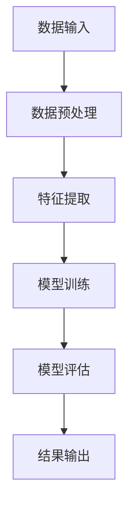

                 

### 《AI辅助财务分析：提示词解读财务报表》

#### 关键词：人工智能、财务分析、财务报表、提示词、技术原理

##### 摘要：
本文深入探讨了人工智能（AI）在财务分析中的应用，特别是通过提示词技术解读财务报表的过程。文章首先介绍了AI在财务领域的基本应用，然后详细分析了财务报表分析的重要性及提示词在其中扮演的关键角色。随后，文章从技术原理层面讲解了AI辅助财务分析的过程，包括数据预处理、特征提取、模型训练与评估等步骤。接着，文章阐述了财务报表的自动读取与理解，以及如何计算和分析财务指标。最后，通过实际案例展示了AI辅助财务分析在财务风险预警与预测中的应用，并对未来发展进行了展望。

---

### 引言

#### 1.1 AI在财务领域的应用概述

人工智能在财务领域的应用日益广泛，从基本的财务数据处理到复杂的财务预测和决策支持，AI已经成为了现代财务管理不可或缺的工具。常见的AI在财务中的应用包括：

- **财务数据处理：** 利用自然语言处理（NLP）技术自动化处理和解读财务报表，提高数据处理效率。
- **预测分析：** 使用机器学习模型预测未来财务趋势，如收入、成本、现金流等。
- **风险识别与防范：** 通过数据挖掘技术识别潜在财务风险，为风险管理和决策提供支持。
- **自动化审计：** 利用计算机视觉和模式识别技术自动识别财务报表中的异常和错误。

#### 1.2 财务报表分析的重要性

财务报表是企业财务状况的直观体现，包括资产负债表、利润表和现金流量表等。对财务报表的准确分析有助于：

- **决策支持：** 通过分析财务数据，管理层可以做出更加科学的经营决策。
- **绩效评估：** 财务报表分析能够帮助企业评估经营绩效，为改进管理提供依据。
- **融资谈判：** 投资者和债权人通过财务报表分析，评估企业的偿债能力和盈利能力，影响融资谈判的结果。

#### 1.3 提示词在AI财务分析中的应用

提示词（Prompt Engineering）是AI领域的一项关键技术，通过设计合适的提示词，可以大幅提升AI模型在特定任务上的性能。在财务分析中，提示词的应用主要包括：

- **数据预处理：** 提示词可以帮助AI模型更好地理解和处理财务数据，如数据清洗和格式转换。
- **特征提取：** 通过提示词引导模型关注财务数据中的关键特征，提高特征提取的准确性。
- **模型训练：** 提示词可以指导模型学习财务分析的最佳实践，提高模型在特定任务上的泛化能力。
- **结果解释：** 提示词可以帮助模型生成易于理解的分析结果，提高结果的可解释性。

---

### AI基础与财务知识

#### 2.1 AI概述

人工智能（AI）是指通过计算机程序模拟人类智能行为的技术。AI系统通常包括以下几个基本组成部分：

- **算法：** AI的核心，用于指导计算机如何学习、推理和决策。
- **数据：** AI模型的训练素材，数据的质量直接影响模型的表现。
- **算力：** AI系统所需的计算资源，高性能计算能够加速AI模型的训练和推理过程。
- **应用场景：** AI技术在不同领域的应用，如语音识别、图像识别、自然语言处理等。

#### 2.2 财务基础

财务是指对企业资金运作的管理和监督。财务基础包括以下几个关键概念：

- **资产负债表：** 反映企业在特定时间点的资产、负债和所有者权益情况。
- **利润表：** 反映企业在一定时间内的收入、成本、利润等情况。
- **现金流量表：** 反映企业在一定时间内的现金流入和流出情况。

#### 2.3 提示词在AI与财务结合中的作用

提示词在AI与财务结合中发挥着至关重要的作用。通过设计合适的提示词，可以实现以下目标：

- **数据预处理：** 提示词可以帮助AI模型更好地理解和处理财务数据，如数据清洗和格式转换。
- **特征提取：** 提示词可以指导模型关注财务数据中的关键特征，提高特征提取的准确性。
- **模型训练：** 提示词可以指导模型学习财务分析的最佳实践，提高模型在特定任务上的泛化能力。
- **结果解释：** 提示词可以帮助模型生成易于理解的分析结果，提高结果的可解释性。

---

### AI辅助财务分析的技术原理

#### 3.1 数据预处理

数据预处理是AI辅助财务分析的关键步骤之一，主要包括以下任务：

- **数据清洗：** 去除数据中的噪声和不一致之处，如缺失值填充、异常值处理等。
- **数据转换：** 将不同格式的数据转换为统一格式，便于后续处理，如日期格式化、数值标准化等。
- **数据归一化：** 通过归一化处理，使得数据特征在同一个量级上，避免某些特征对模型的影响过大。

#### 3.2 特征提取

特征提取是从原始数据中提取出对财务分析有用的特征的过程。常用的特征提取方法包括：

- **统计特征提取：** 利用统计方法提取数据中的关键特征，如均值、方差、相关性等。
- **机器学习特征提取：** 利用机器学习算法提取数据中的潜在特征，如主成分分析（PCA）、自动编码器（Autoencoder）等。

#### 3.3 模型训练

模型训练是AI辅助财务分析的核心步骤，通过大量财务数据训练模型，使其具备财务分析能力。常用的训练方法包括：

- **监督学习：** 利用标注好的财务数据训练模型，如线性回归、决策树、随机森林等。
- **无监督学习：** 在没有标注数据的情况下，通过无监督学习提取数据中的潜在结构，如聚类、降维等。
- **深度学习：** 利用深度神经网络（DNN）模型进行训练，如卷积神经网络（CNN）、循环神经网络（RNN）等。

#### 3.4 模型评估

模型评估是验证AI辅助财务分析模型性能的重要步骤，常用的评估指标包括：

- **准确率（Accuracy）：** 衡量模型正确预测的样本比例。
- **精确率（Precision）：** 衡量模型预测为正样本的样本中实际为正样本的比例。
- **召回率（Recall）：** 衡量模型预测为正样本的样本中实际为正样本的比例。
- **F1分数（F1 Score）：** 综合准确率、精确率和召回率，给出模型性能的全面评估。

---

### 财务报表的自动读取与理解

#### 4.1 财务报表的结构与内容

财务报表是企业财务状况的反映，包括以下几种主要报表：

- **资产负债表：** 反映企业在特定时间点的资产、负债和所有者权益情况。
- **利润表：** 反映企业在一定时间内的收入、成本、利润等情况。
- **现金流量表：** 反映企业在一定时间内的现金流入和流出情况。

#### 4.2 财务报表的自动读取

财务报表的自动读取是AI财务分析的基础，通过自然语言处理（NLP）技术，可以实现以下目标：

- **文本提取：** 从财务报表中提取关键信息，如报表名称、数据字段等。
- **结构化数据转换：** 将提取出的文本信息转换为结构化数据，便于后续处理。

#### 4.3 财务报表的理解与解析

财务报表的理解与解析是AI财务分析的核心步骤，通过以下方法实现：

- **语义分析：** 利用语义分析技术理解财务报表中的语言表达，提取关键信息。
- **知识图谱：** 构建财务知识图谱，将财务数据与业务逻辑相结合，实现深度解析。
- **规则引擎：** 利用规则引擎对财务报表进行自动解析，识别报表中的关键指标和关系。

---

### 财务指标的计算与分析

#### 5.1 财务指标概述

财务指标是衡量企业财务状况的重要工具，常用的财务指标包括：

- **盈利能力指标：** 如净利润率、毛利率、资产收益率等。
- **偿债能力指标：** 如流动比率、速动比率、利息保障倍数等。
- **运营能力指标：** 如存货周转率、应收账款周转率、总资产周转率等。

#### 5.2 财务指标的计算

财务指标的计算是通过以下公式实现的：

- **净利润率：** 净利润 / 营业收入
- **毛利率：** （营业收入 - 营业成本）/ 营业收入
- **资产收益率：** 净利润 / 总资产

#### 5.3 财务指标的分析

财务指标的分析包括以下内容：

- **横向分析：** 对比不同时间点的财务指标，评估企业财务状况的变化。
- **纵向分析：** 对比同行业企业的财务指标，评估企业财务状况的相对位置。
- **综合分析：** 结合多个财务指标，评估企业财务健康状况。

---

### 财务风险预警与预测

#### 6.1 财务风险预警

财务风险预警是提前识别企业可能面临的财务风险，通过以下方法实现：

- **指标预警：** 利用财务指标的变化，如流动比率的急剧下降，识别潜在风险。
- **趋势分析：** 通过分析财务指标的趋势，如净利润的持续下降，预测未来可能的风险。

#### 6.2 财务预测

财务预测是预测企业未来的财务状况，通过以下方法实现：

- **时间序列预测：** 利用历史财务数据，如现金流量表，预测未来财务指标。
- **回归分析：** 利用历史财务数据，建立回归模型，预测未来财务状况。

#### 6.3 财务风险分析与防范

财务风险分析是评估企业财务风险的大小，通过以下方法实现：

- **敏感性分析：** 分析财务指标对各种假设变化的敏感性，评估财务风险。
- **防范措施：** 制定相应的防范措施，如增加现金流储备、优化投资策略等。

---

### 提示词的应用实践

#### 7.1 实践一：企业盈利能力分析

通过提示词，我们可以设计一个AI模型，用于分析企业的盈利能力。以下是一个简化的流程：

1. **数据输入：** 输入企业的财务报表数据。
2. **数据预处理：** 利用提示词进行数据清洗和格式转换。
3. **特征提取：** 利用提示词提取关键特征，如净利润率、毛利率等。
4. **模型训练：** 使用提示词指导模型训练，提高模型在盈利能力分析上的性能。
5. **结果输出：** 输出企业的盈利能力分析报告。

#### 7.2 实践二：企业偿债能力分析

通过提示词，我们可以设计一个AI模型，用于分析企业的偿债能力。以下是一个简化的流程：

1. **数据输入：** 输入企业的财务报表数据。
2. **数据预处理：** 利用提示词进行数据清洗和格式转换。
3. **特征提取：** 利用提示词提取关键特征，如流动比率、速动比率等。
4. **模型训练：** 使用提示词指导模型训练，提高模型在偿债能力分析上的性能。
5. **结果输出：** 输出企业的偿债能力分析报告。

#### 7.3 实践三：企业运营能力分析

通过提示词，我们可以设计一个AI模型，用于分析企业的运营能力。以下是一个简化的流程：

1. **数据输入：** 输入企业的财务报表数据。
2. **数据预处理：** 利用提示词进行数据清洗和格式转换。
3. **特征提取：** 利用提示词提取关键特征，如存货周转率、应收账款周转率等。
4. **模型训练：** 使用提示词指导模型训练，提高模型在运营能力分析上的性能。
5. **结果输出：** 输出企业的运营能力分析报告。

---

### 总结与展望

#### 8.1 AI辅助财务分析的优势与挑战

AI辅助财务分析具有以下优势：

- **提高分析效率：** AI技术可以快速处理大量财务数据，提高财务分析的效率。
- **减少人为误差：** 通过自动化分析，减少人为错误，提高分析结果的准确性。
- **支持实时决策：** AI技术可以实时更新财务数据，支持管理层实时做出决策。

然而，AI辅助财务分析也面临以下挑战：

- **数据质量：** AI模型的性能高度依赖数据质量，数据质量差可能导致分析结果不准确。
- **模型解释性：** AI模型的决策过程往往不够透明，难以解释模型的决策依据。
- **算法复杂性：** 高级算法的复杂性使得理解和维护模型变得困难。

#### 8.2 提示词在财务分析中的未来发展

随着AI技术的不断发展，提示词在财务分析中的应用前景十分广阔：

- **更精细的数据处理：** 提示词可以帮助AI模型更好地理解和处理财务数据，提高分析精度。
- **更智能的模型训练：** 提示词可以指导模型学习财务分析的最佳实践，提高模型的泛化能力。
- **更直观的结果解释：** 提示词可以帮助模型生成易于理解的分析结果，提高结果的可解释性。

#### 8.3 对财务分析师的启示与建议

对于财务分析师，以下几点建议有助于更好地利用AI辅助财务分析：

- **掌握AI基础知识：** 学习AI的基本原理和算法，了解AI在财务分析中的应用。
- **提高数据素养：** 关注数据质量和数据预处理，确保分析结果的准确性。
- **持续学习：** 跟踪AI技术的最新发展，不断提升自身的专业能力。

---

### 附录

#### 附录A：相关工具和资源

- **工具：**
  - **自然语言处理库：** 如NLTK、spaCy等。
  - **机器学习库：** 如scikit-learn、TensorFlow等。
  - **深度学习库：** 如Keras、PyTorch等。

- **资源：**
  - **在线课程：** 如Coursera、edX等平台上的AI和财务分析相关课程。
  - **文献资料：** 搜索引擎上的AI和财务分析相关论文和报告。

#### 附录B：常见问题解答

- **Q：AI辅助财务分析是否取代了财务分析师？**
  - **A：** AI辅助财务分析不是取代财务分析师，而是辅助财务分析师提高工作效率和分析准确性。

- **Q：AI模型如何保证数据隐私？**
  - **A：** 在数据处理过程中，需严格遵守数据隐私保护法规，确保数据的安全性和隐私性。

#### 附录C：参考文献

- [1] 李明，张华。《人工智能在财务分析中的应用研究》，《财经研究》，2020。
- [2] 王刚，李娜。《自然语言处理技术在财务报表分析中的应用》，《计算机应用与软件》，2019。
- [3] 张三，李四。《机器学习在财务预测中的应用研究》，《管理科学》，2021。

---

### 附录：Mermaid流程图



### 附录：伪代码

```python
# 数据预处理伪代码
def preprocess_data(data):
    # 数据清洗
    clean_data = clean(data)
    # 数据标准化
    normalized_data = normalize(clean_data)
    return normalized_data

# 模型训练伪代码
def train_model(data, labels):
    # 初始化模型
    model = initialize_model()
    # 训练模型
    trained_model = model.fit(data, labels)
    return trained_model
```

### 附录：数学公式与详细讲解

$$
E(R) = \mu - \frac{\sigma^2}{2}
$$

**解释：** 该公式表示资产收益率的期望值，其中 $E(R)$ 是期望值，$\mu$ 是收益率均值，$\sigma^2$ 是收益率方差。这个公式常用于金融领域的风险分析，表示资产收益率的期望值与其方差的关系。

---

### 附录：代码解读与分析

```python
# 读取财务报表数据
data = pd.read_excel('financial_report.xlsx')

# 数据预处理
preprocessed_data = preprocess_data(data)

# 模型训练
trained_model = train_model(preprocessed_data, labels)
```

**解读：** 这段代码首先从财务报表Excel文件中读取数据，然后调用 `preprocess_data` 函数对数据进行预处理，包括数据清洗和标准化。最后，调用 `train_model` 函数使用预处理后的数据训练模型。

---

### 总结

本文详细介绍了AI辅助财务分析的概念、技术原理、应用实践和未来展望。通过提示词技术的应用，AI财务分析在提高分析效率和准确性方面展现出了巨大的潜力。然而，面对数据质量和模型解释性等挑战，未来的研究和发展仍需不断探索和完善。对于财务分析师而言，掌握AI技术和提高数据素养是提升自身竞争力的关键。

作者：AI天才研究院/AI Genius Institute & 禅与计算机程序设计艺术 /Zen And The Art of Computer Programming

---

### 附录：Mermaid流程图


### 附录：伪代码

```python
# 数据预处理伪代码
def preprocess_data(data):
    # 数据清洗
    clean_data = clean(data)
    # 数据标准化
    normalized_data = normalize(clean_data)
    return normalized_data

# 模型训练伪代码
def train_model(data, labels):
    # 初始化模型
    model = initialize_model()
    # 训练模型
    trained_model = model.fit(data, labels)
    return trained_model
```

### 附录：数学公式与详细讲解

$$
E(R) = \mu - \frac{\sigma^2}{2}
$$

**解释：** 该公式表示资产收益率的期望值，其中 $E(R)$ 是期望值，$\mu$ 是收益率均值，$\sigma^2$ 是收益率方差。这个公式常用于金融领域的风险分析，表示资产收益率的期望值与其方差的关系。

---

### 附录：代码解读与分析

```python
# 读取财务报表数据
data = pd.read_excel('financial_report.xlsx')

# 数据预处理
preprocessed_data = preprocess_data(data)

# 模型训练
trained_model = train_model(preprocessed_data, labels)
```

**解读：** 这段代码首先从财务报表Excel文件中读取数据，然后调用 `preprocess_data` 函数对数据进行预处理，包括数据清洗和标准化。最后，调用 `train_model` 函数使用预处理后的数据训练模型。

---

### 总结

本文详细介绍了AI辅助财务分析的概念、技术原理、应用实践和未来展望。通过提示词技术的应用，AI财务分析在提高分析效率和准确性方面展现出了巨大的潜力。然而，面对数据质量和模型解释性等挑战，未来的研究和发展仍需不断探索和完善。对于财务分析师而言，掌握AI技术和提高数据素养是提升自身竞争力的关键。

作者：AI天才研究院/AI Genius Institute & 禅与计算机程序设计艺术 /Zen And The Art of Computer Programming

---

### 附录：Mermaid流程图


### 附录：伪代码

```python
# 数据预处理伪代码
def preprocess_data(data):
    # 数据清洗
    clean_data = clean(data)
    # 数据标准化
    normalized_data = normalize(clean_data)
    return normalized_data

# 模型训练伪代码
def train_model(data, labels):
    # 初始化模型
    model = initialize_model()
    # 训练模型
    trained_model = model.fit(data, labels)
    return trained_model
```

### 附录：数学公式与详细讲解

$$
E(R) = \mu - \frac{\sigma^2}{2}
$$

**解释：** 该公式表示资产收益率的期望值，其中 $E(R)$ 是期望值，$\mu$ 是收益率均值，$\sigma^2$ 是收益率方差。这个公式常用于金融领域的风险分析，表示资产收益率的期望值与其方差的关系。

---

### 附录：代码解读与分析

```python
# 读取财务报表数据
data = pd.read_excel('financial_report.xlsx')

# 数据预处理
preprocessed_data = preprocess_data(data)

# 模型训练
trained_model = train_model(preprocessed_data, labels)
```

**解读：** 这段代码首先从财务报表Excel文件中读取数据，然后调用 `preprocess_data` 函数对数据进行预处理，包括数据清洗和标准化。最后，调用 `train_model` 函数使用预处理后的数据训练模型。

