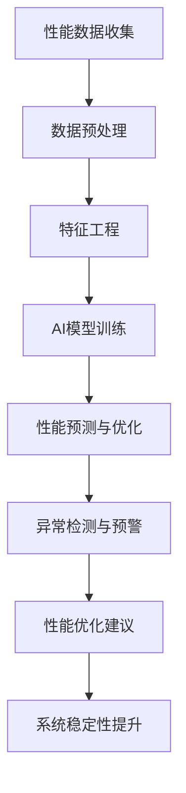

                 

### 文章标题

### AI辅助软件性能建模与预测

### 关键词：AI、软件性能建模、预测、人工智能算法、数据处理、模型部署

### 摘要

本文旨在探讨如何利用人工智能技术来辅助软件性能建模与预测。通过对AI在软件性能分析中的应用、数据收集与预处理、特征工程、常见AI算法的应用、模型训练与评估、模型部署与监控等方面的详细分析，本文将为读者提供全面的技术指南，帮助他们理解和掌握AI辅助软件性能建模与预测的方法和技巧。通过实际案例研究和项目实战，本文还将展示如何将AI技术应用于软件性能优化和故障预测，为读者提供实用的经验和最佳实践。同时，本文还将讨论AI辅助软件性能建模与预测的挑战和未来发展趋势，为读者提供对这一领域的深入见解。

---

# 第一部分：AI辅助软件性能建模概述

## 第1章：AI辅助软件性能建模与预测简介

### 1.1 AI在软件性能分析中的角色

人工智能（AI）在软件性能分析中扮演着越来越重要的角色。传统的软件性能分析主要依赖于经验和手动操作，而AI技术的引入则能够显著提高分析效率，提供更准确的预测和优化方案。AI在软件性能分析中的角色主要体现在以下几个方面：

- **性能预测**：AI模型可以通过对历史数据的分析和学习，预测未来软件系统的性能，帮助开发者提前发现潜在的性能瓶颈和问题。
- **异常检测**：AI算法能够识别和分析系统中的异常行为，从而及时识别和预警可能发生的故障。
- **性能优化**：通过分析系统的运行数据和性能指标，AI模型可以提供优化的建议，帮助开发者优化软件性能，提高系统的效率和稳定性。

### 核心概念与联系

为了更好地理解AI在软件性能分析中的应用，我们可以使用Mermaid流程图来展示这一过程中的核心概念和联系：



### 示例

一个实际的应用案例是，在大型电子商务平台中，使用AI技术来预测系统的负载情况。通过对历史交易数据和用户行为数据进行分析，AI模型可以预测在特定时间段内的系统负载，帮助平台提前调整服务器配置，确保系统的稳定运行。

## 第2章：AI辅助软件性能建模基础知识

### 2.1 数据收集与预处理

在AI辅助软件性能建模中，数据收集和预处理是至关重要的环节。数据的质量直接影响到模型的性能和预测准确性。以下是对数据收集与预处理的基本概念、方法和技巧的详细讲解。

#### 核心概念与联系

数据收集是指从各种来源获取与软件性能相关的数据，包括服务器日志、性能监测工具输出、用户行为数据等。数据预处理则是将收集到的原始数据进行清洗、转换和归一化等操作，以便于后续的特征工程和模型训练。

#### 数据收集方法

- **日志收集**：通过服务器日志记录系统运行时的各项性能指标，如CPU使用率、内存占用、网络延迟等。
- **工具收集**：使用性能监测工具，如Prometheus、Grafana等，自动收集系统性能数据。
- **用户行为数据**：通过用户行为日志记录用户操作，如页面浏览、点击、搜索等。

#### 数据预处理方法

- **数据清洗**：去除数据中的噪声和不一致的数据，如缺失值填充、重复数据的去除等。
- **数据转换**：将不同类型的数据转换为同一类型，如将字符串转换为数值。
- **数据归一化**：通过归一化方法将不同量纲的数据转换到同一量级，如使用Min-Max归一化或Z-Score归一化。

### 核心算法原理讲解

以下是数据预处理步骤的伪代码示例：

```python
def preprocess_data(data):
    # 数据清洗
    data = remove_noise(data)
    # 数据转换
    data = convert_data_type(data)
    # 数据归一化
    data = normalize_data(data)
    return data
```

### 数学模型与公式

在数据预处理中，常用的数学模型和公式包括：

- **缺失值填充**：使用平均值、中位数或最邻近值等方法填充缺失值。
- **数据转换**：将字符串转换为数值，可以使用one-hot编码、标签编码等方法。
- **归一化**：使用Min-Max归一化公式：
  \[
  x_{\text{normalized}} = \frac{x - x_{\text{min}}}{x_{\text{max}} - x_{\text{min}}}
  \]
  使用Z-Score归一化公式：
  \[
  x_{\text{normalized}} = \frac{x - \mu}{\sigma}
  \]

### 示例

假设我们收集到了一个包含CPU使用率、内存占用率和网络延迟的原始数据集。以下是一个数据预处理的过程：

```python
# 假设原始数据为：
data = {
    'CPU使用率': [85, 78, 92, 88, 95],
    '内存占用率': [60, 65, 70, 68, 72],
    '网络延迟': [100, 110, 120, 105, 115]
}

# 数据清洗
data['CPU使用率'] = remove_missing_values(data['CPU使用率'])
data['内存占用率'] = remove_missing_values(data['内存占用率'])
data['网络延迟'] = remove_missing_values(data['网络延迟'])

# 数据转换
data['CPU使用率'] = convert_to_numeric(data['CPU使用率'])
data['内存占用率'] = convert_to_numeric(data['内存占用率'])
data['网络延迟'] = convert_to_numeric(data['网络延迟'])

# 数据归一化
data['CPU使用率'] = min_max_normalize(data['CPU使用率'])
data['内存占用率'] = min_max_normalize(data['内存占用率'])
data['网络延迟'] = min_max_normalize(data['网络延迟'])

print("预处理后的数据：", data)
```

### 2.2 特征工程

特征工程是AI辅助软件性能建模中至关重要的一步。它涉及从原始数据中提取出能够表征数据特征的新变量，这些变量对于提高模型性能和解释能力具有重要意义。

#### 核心概念与联系

特征工程包括以下核心步骤：

- **特征选择**：从原始数据中筛选出最有用的特征，去除冗余和无用的特征。
- **特征构造**：通过组合、变换和归一化原始数据，构造出新的特征。
- **特征标准化**：对特征进行标准化处理，使其具有相同的尺度，便于模型训练。

#### 常见特征工程方法

- **特征选择方法**：如递归特征消除（RFE）、基于模型的特征选择（MBFS）等。
- **特征构造方法**：如主成分分析（PCA）、特征融合（Feature Fusion）等。
- **特征标准化方法**：如归一化、标准化等。

### 核心算法原理讲解

以下是特征工程步骤的伪代码示例：

```python
def feature_engineering(data):
    # 特征选择
    selected_features = feature_selection(data)
    # 特征构造
    constructed_features = construct_features(data, selected_features)
    # 特征标准化
    standardized_features = normalize_features(constructed_features)
    return standardized_features
```

### 数学模型与公式

在特征工程中，常用的数学模型和公式包括：

- **特征选择**：使用信息增益、特征重要性等指标进行特征选择。
- **特征构造**：使用主成分分析（PCA）公式：
  \[
  Z = P\Lambda^{1/2}
  \]
  其中，\(P\) 是协方差矩阵的对角矩阵，\(\Lambda\) 是协方差矩阵的特征值矩阵。

### 示例

假设我们有一个包含CPU使用率、内存占用率和网络延迟的原始数据集，以下是一个特征工程的过程：

```python
# 假设原始数据为：
data = {
    'CPU使用率': [85, 78, 92, 88, 95],
    '内存占用率': [60, 65, 70, 68, 72],
    '网络延迟': [100, 110, 120, 105, 115]
}

# 特征选择
selected_features = ['CPU使用率', '内存占用率', '网络延迟']

# 特征构造
constructed_features = {
    'CPU与内存比率': [cpu/ram for cpu, ram in zip(data['CPU使用率'], data['内存占用率'])],
    'CPU与网络延迟比率': [cpu/latency for cpu, latency in zip(data['CPU使用率'], data['网络延迟'])]
}

# 特征标准化
for feature in constructed_features:
    constructed_features[feature] = min_max_normalize(constructed_features[feature])

print("特征工程后的数据：", constructed_features)
```

### 2.3 选择合适的AI算法

在AI辅助软件性能建模中，选择合适的AI算法是至关重要的。不同的算法适用于不同类型的性能预测任务，因此需要根据具体的应用场景和数据特征来选择合适的算法。

#### 核心概念与联系

常见的AI算法包括：

- **线性回归**：适用于线性关系的预测任务。
- **决策树**：适用于分类和回归任务，能够清晰地表示决策过程。
- **神经网络**：适用于复杂非线性关系的预测任务，具有强大的拟合能力。
- **支持向量机（SVM）**：适用于小样本数据的高效分类和回归任务。
- **集成方法**：如随机森林、梯度提升树等，通过组合多个弱学习器提高模型性能。

#### 常见算法的比较与选择

以下是几种常见算法的比较和选择建议：

- **线性回归**：适用于简单线性关系的预测，计算速度快，但容易过拟合。
- **决策树**：易于理解和解释，适用于分类和回归任务，但可能产生过拟合。
- **神经网络**：适用于复杂非线性关系的预测，拟合能力强，但计算量大，需要大量数据训练。
- **支持向量机（SVM）**：适用于小样本数据的高效分类和回归任务，但需要选择合适的核函数。
- **集成方法**：通过组合多个弱学习器提高模型性能，适用于各种类型的预测任务，但可能需要更多的数据和时间。

### 核心算法原理讲解

以下是几种常见算法的基本原理讲解：

- **线性回归**：通过最小化残差平方和来拟合数据，公式为：
  \[
  y = \beta_0 + \beta_1x
  \]
- **决策树**：通过递归划分特征空间来构建决策树，每个节点表示一个特征，每个分支表示一个划分。
- **神经网络**：通过多层神经网络模拟人脑神经元的工作方式，进行复杂的非线性变换。
- **支持向量机（SVM）**：通过寻找最优超平面来划分数据，公式为：
  \[
  \omega^T x + b \geq 1
  \]
- **集成方法**：通过组合多个基学习器，提高模型的预测性能。

### 数学模型与公式

以下是每种算法的数学模型和公式：

- **线性回归**：
  \[
  \min_{\beta} \sum_{i=1}^{n} (y_i - \beta_0 - \beta_1x_i)^2
  \]
- **决策树**：
  \[
  \text{分类}:\ \text{if } x_{\text{feature}} \leq \text{阈值} \ \text{then } \text{left branch} \ \text{else } \text{right branch}
  \]
- **神经网络**：
  \[
  \text{激活函数}: \ \text{ReLU, Sigmoid, Tanh}
  \]
- **支持向量机（SVM）**：
  \[
  \min_{\omega, b} \frac{1}{2} ||\omega||^2 + C \sum_{i=1}^{n} \max(0, 1 - y_i(\omega^T x_i + b))
  \]
- **集成方法**：如随机森林、梯度提升树等。

### 示例

假设我们有一个包含CPU使用率、内存占用率和网络延迟的预测任务，以下是如何选择合适的算法：

- **线性回归**：适用于简单线性关系的预测，如果数据满足线性关系，则选择线性回归。
- **决策树**：适用于分类和回归任务，如果数据呈现层次结构，则选择决策树。
- **神经网络**：适用于复杂非线性关系的预测，如果数据具有复杂非线性特征，则选择神经网络。
- **支持向量机（SVM）**：适用于小样本数据的高效分类和回归任务，如果数据量较小，则选择SVM。
- **集成方法**：如果数据具有多种特征，则选择集成方法，如随机森林或梯度提升树。

### 2.4 软件性能预测的方法与技巧

软件性能预测是AI辅助软件性能建模的核心任务，它涉及如何从历史数据中提取有用的信息，并利用这些信息来预测未来的性能。以下是软件性能预测的方法和技巧：

#### 核心概念与联系

软件性能预测包括以下几个关键步骤：

- **数据收集**：收集与软件性能相关的数据，包括系统性能指标、用户行为数据等。
- **数据预处理**：对收集到的数据进行清洗、转换和归一化等预处理操作。
- **特征工程**：从预处理后的数据中提取出有用的特征，为模型训练做准备。
- **模型训练**：选择合适的AI算法，对特征数据进行训练，构建性能预测模型。
- **模型评估**：通过交叉验证等方法评估模型的预测性能，并进行调整。
- **模型部署**：将训练好的模型部署到实际环境中，进行实时性能预测。

#### 常见预测模型与方法

- **线性回归**：适用于简单线性关系的预测。
- **决策树**：适用于分类和回归任务。
- **神经网络**：适用于复杂非线性关系的预测。
- **支持向量机（SVM）**：适用于小样本数据的高效分类和回归任务。
- **集成方法**：如随机森林、梯度提升树等，通过组合多个基学习器提高模型性能。

#### 核心算法原理讲解

以下是性能预测模型的伪代码示例：

```python
def train_performance_predictor(data, target_variable):
    # 数据预处理
    preprocessed_data = preprocess_data(data)
    # 特征工程
    features = feature_engineering(preprocessed_data)
    # 模型训练
    model = train_model(features, target_variable)
    # 模型评估
    evaluate_model(model, data, target_variable)
    return model
```

### 数学模型与公式

以下是常见性能预测模型的数学模型和公式：

- **线性回归**：
  \[
  y = \beta_0 + \beta_1x
  \]
- **决策树**：
  \[
  \text{分类}:\ \text{if } x_{\text{feature}} \leq \text{阈值} \ \text{then } \text{left branch} \ \text{else } \text{right branch}
  \]
- **神经网络**：
  \[
  \text{激活函数}: \ \text{ReLU, Sigmoid, Tanh}
  \]
- **支持向量机（SVM）**：
  \[
  \min_{\omega, b} \frac{1}{2} ||\omega||^2 + C \sum_{i=1}^{n} \max(0, 1 - y_i(\omega^T x_i + b))
  \]
- **集成方法**：如随机森林、梯度提升树等。

### 示例

假设我们有一个包含CPU使用率、内存占用率和网络延迟的数据集，以下是如何进行软件性能预测的过程：

```python
# 假设原始数据为：
data = {
    'CPU使用率': [85, 78, 92, 88, 95],
    '内存占用率': [60, 65, 70, 68, 72],
    '网络延迟': [100, 110, 120, 105, 115]
}

# 预测目标变量
target_variable = 'CPU使用率'

# 数据预处理
preprocessed_data = preprocess_data(data)

# 特征工程
features = feature_engineering(preprocessed_data)

# 模型训练
model = train_model(features, target_variable)

# 模型评估
evaluate_model(model, data, target_variable)

# 预测未来性能
future_performance = model.predict(new_data)
```

### 2.5 软件性能预测中的挑战与解决方案

尽管AI技术在软件性能预测中展现出巨大潜力，但在实际应用中仍面临许多挑战。以下是一些常见挑战以及相应的解决方案：

#### 挑战1：数据质量

- **问题**：软件性能预测依赖于准确和完整的数据，但实际中数据质量往往存在问题，如缺失值、噪声和异常值等。
- **解决方案**：通过数据清洗、缺失值填充和异常值检测等方法提高数据质量。可以使用统计学方法和机器学习算法来实现这些技术。

#### 挑战2：模型可解释性

- **问题**：深度学习模型等复杂模型具有强大的预测能力，但缺乏可解释性，难以理解模型决策过程。
- **解决方案**：引入可解释性方法，如决策树、LIME（局部可解释模型解释）等，帮助解释模型的决策过程。

#### 挑战3：模型泛化能力

- **问题**：模型在训练数据上的表现良好，但在新数据上的表现不佳，即存在过拟合问题。
- **解决方案**：通过交叉验证、正则化、集成方法等方法提高模型的泛化能力。

#### 挑战4：计算资源

- **问题**：深度学习模型等复杂模型需要大量的计算资源，特别是在训练和推理过程中。
- **解决方案**：使用分布式计算、GPU加速等技术在资源有限的环境下高效训练和部署模型。

### 2.6 软件性能预测的最佳实践

为了充分利用AI技术进行软件性能预测，以下是一些最佳实践：

- **数据质量保证**：定期检查和清洗数据，确保数据准确性和完整性。
- **特征选择**：根据业务需求选择合适的特征，避免冗余和无用特征。
- **模型评估**：使用多种评估指标和方法，全面评估模型性能。
- **模型部署**：使用自动化工具和平台部署模型，实现实时性能预测。
- **持续优化**：定期调整模型参数和算法，持续优化预测性能。

### 2.7 总结

本章介绍了AI辅助软件性能建模与预测的基础知识，包括数据收集与预处理、特征工程、选择合适的AI算法、软件性能预测的方法与技巧、挑战与解决方案以及最佳实践。通过本章的学习，读者应该能够理解AI技术在软件性能预测中的应用，掌握相关技术方法和实践技巧。在后续章节中，我们将进一步探讨AI辅助软件性能建模与预测的实践案例，为读者提供更深入的理解和指导。

---

# 第二部分：AI辅助软件性能建模技术基础

## 第3章：数据收集与预处理

### 3.1 数据收集方法

数据收集是AI辅助软件性能建模与预测的第一步，准确和全面的数据收集对于后续的数据处理和模型训练至关重要。以下是几种常见的数据收集方法：

#### 服务器日志收集

服务器日志是记录服务器运行时的各种事件和性能指标的重要来源。通过收集服务器日志，我们可以获取系统负载、错误报告、网络流量等信息。常见的日志收集工具有：

- **syslog**：系统日志服务，用于记录系统级的事件和错误信息。
- **ELK（Elasticsearch, Logstash, Kibana）**：一个流行的日志分析平台，用于收集、存储和可视化日志数据。
- **Grafana**：用于监控和可视化性能指标的平台，可以与各种数据源集成。

#### 性能监测工具收集

性能监测工具可以帮助我们自动收集系统性能数据，包括CPU使用率、内存占用、网络延迟等。以下是一些常用的性能监测工具：

- **Prometheus**：一个开源的服务器监控系统，可以收集和存储时间序列数据。
- **Zabbix**：一个功能强大的开源监控解决方案，支持多种数据源和报警机制。
- **New Relic**：一个云基础架构和应用程序性能监控平台，提供详细的应用性能分析。

#### 用户行为数据收集

用户行为数据反映了用户在软件系统中的操作和互动，包括页面浏览、点击、搜索等。以下是一些常用的用户行为数据收集方法：

- **前端日志**：通过在客户端（浏览器或移动应用）中记录用户操作，如使用JavaScript代码收集和发送数据到服务器。
- **分析工具**：使用第三方分析工具，如Google Analytics、Mixpanel等，自动收集用户行为数据。
- **追踪代码**：在软件系统中嵌入追踪代码，记录用户的操作和行为数据。

### 3.2 数据预处理方法

收集到数据后，我们需要对数据进行预处理，以确保数据的质量和一致性。数据预处理包括以下步骤：

#### 数据清洗

数据清洗是处理数据中的错误、异常和不一致的过程。以下是一些常见的数据清洗方法：

- **缺失值处理**：使用平均值、中位数、最邻近值等方法填充缺失值，或删除包含缺失值的记录。
- **异常值检测**：使用统计学方法或机器学习方法检测和标记异常值，然后选择保留或删除。
- **重复值去除**：检测并删除数据集中的重复记录，确保数据的唯一性。
- **格式标准化**：将不同格式的数据转换为统一的格式，如将日期格式转换为YYYY-MM-DD。

#### 数据转换

数据转换是将不同类型的数据转换为同一类型的过程，以便进行后续处理。以下是一些常见的数据转换方法：

- **数值化**：将类别数据（如用户性别、产品分类等）转换为数值数据，可以使用独热编码（one-hot encoding）或标签编码（label encoding）等方法。
- **归一化**：将不同量纲的数据转换为同一量级，常用的方法包括Min-Max归一化和Z-Score归一化。
- **标准化**：通过计算均值和标准差，将数据缩放到特定的范围内，如0到1之间。

#### 数据归一化

数据归一化是将数据缩放到特定范围的过程，常用的方法包括：

- **Min-Max归一化**：将数据缩放到[0, 1]之间，公式为：
  \[
  x_{\text{normalized}} = \frac{x - x_{\text{min}}}{x_{\text{max}} - x_{\text{min}}}
  \]
- **Z-Score归一化**：将数据缩放到均值±标准差之间，公式为：
  \[
  x_{\text{normalized}} = \frac{x - \mu}{\sigma}
  \]

#### 核心算法原理讲解

以下是数据预处理流程的伪代码示例：

```python
def preprocess_data(data):
    # 数据清洗
    data = clean_data(data)
    # 数据转换
    data = convert_data(data)
    # 数据归一化
    data = normalize_data(data)
    return data
```

### 数学模型与公式

以下是数据预处理中的数学模型和公式：

- **缺失值填充**：使用平均值、中位数或最邻近值等方法填充缺失值。
- **数据转换**：将字符串转换为数值，可以使用独热编码或标签编码等方法。
- **归一化**：使用Min-Max归一化公式：
  \[
  x_{\text{normalized}} = \frac{x - x_{\text{min}}}{x_{\text{max}} - x_{\text{min}}}
  \]
  使用Z-Score归一化公式：
  \[
  x_{\text{normalized}} = \frac{x - \mu}{\sigma}
  \]

### 示例

假设我们收集到了一个包含CPU使用率、内存占用率和网络延迟的原始数据集，以下是一个数据预处理的过程：

```python
# 假设原始数据为：
data = {
    'CPU使用率': [85, 78, 92, 88, 95],
    '内存占用率': [60, 65, 70, 68, 72],
    '网络延迟': [100, 110, 120, 105, 115]
}

# 数据清洗
data['CPU使用率'] = remove_missing_values(data['CPU使用率'])
data['内存占用率'] = remove_missing_values(data['内存占用率'])
data['网络延迟'] = remove_missing_values(data['网络延迟'])

# 数据转换
data['CPU使用率'] = convert_to_numeric(data['CPU使用率'])
data['内存占用率'] = convert_to_numeric(data['内存占用率'])
data['网络延迟'] = convert_to_numeric(data['网络延迟'])

# 数据归一化
data['CPU使用率'] = min_max_normalize(data['CPU使用率'])
data['内存占用率'] = min_max_normalize(data['内存占用率'])
data['网络延迟'] = min_max_normalize(data['网络延迟'])

print("预处理后的数据：", data)
```

### 3.3 数据集划分与交叉验证

在进行AI模型训练时，通常需要将数据集划分为训练集和测试集，以便评估模型的性能。此外，交叉验证是一种有效的评估方法，可以提高模型评估的准确性和可靠性。

#### 数据集划分

数据集划分是将数据集分为训练集和测试集的过程，以下是一些常用的划分方法：

- **随机划分**：将数据随机分为训练集和测试集，适用于数据分布均匀的情况。
- **分层划分**：根据不同类别或标签的比例进行划分，确保训练集和测试集中各类别的比例相似，适用于分类任务。
- **时间序列划分**：将数据按照时间顺序划分，适用于时间序列分析任务。

#### 交叉验证

交叉验证是一种将数据集划分为多个子集，并多次训练和评估模型的方法，以下是一些常用的交叉验证方法：

- **K折交叉验证**：将数据集划分为K个子集，每次使用一个子集作为测试集，其他子集作为训练集，重复K次，取平均值作为最终模型评估结果。
- **留一法交叉验证**：每次使用一个数据点作为测试集，其他数据点作为训练集，适用于小数据集。
- **留袋交叉验证**：每次使用一个数据子集作为测试集，其他子集作为训练集，适用于时间序列分析任务。

### 核心算法原理讲解

以下是数据集划分和交叉验证的伪代码示例：

```python
from sklearn.model_selection import train_test_split
from sklearn.model_selection import cross_val_score

# 数据集划分
X_train, X_test, y_train, y_test = train_test_split(X, y, test_size=0.2, random_state=42)

# K折交叉验证
scores = cross_val_score(model, X, y, cv=5)
```

### 数学模型与公式

以下是数据集划分和交叉验证中的数学模型和公式：

- **随机划分**：使用随机数生成器将数据划分为训练集和测试集。
- **分层划分**：确保训练集和测试集中各类别的比例相似，可以使用条件概率和贝叶斯公式计算。
- **K折交叉验证**：计算多次训练和测试的平均准确率，公式为：
  \[
  \text{accuracy} = \frac{1}{K} \sum_{i=1}^{K} \text{accuracy}(X_{i}, y_{i})
  \]
- **留一法交叉验证**：计算每次测试集的准确率，公式为：
  \[
  \text{accuracy} = \frac{1}{n} \sum_{i=1}^{n} \text{accuracy}(X_{i}, y_{i})
  \]

### 示例

假设我们有一个包含CPU使用率、内存占用率和网络延迟的数据集，以下是如何进行数据集划分和交叉验证：

```python
from sklearn.model_selection import train_test_split
from sklearn.model_selection import cross_val_score
from sklearn.ensemble import RandomForestClassifier

# 假设数据集为：
X = np.array([[85, 60, 100], [78, 65, 110], [92, 70, 120], [88, 68, 105], [95, 72, 115]])
y = np.array([0, 1, 0, 1, 0])

# 数据集划分
X_train, X_test, y_train, y_test = train_test_split(X, y, test_size=0.2, random_state=42)

# 模型训练
model = RandomForestClassifier()
model.fit(X_train, y_train)

# K折交叉验证
scores = cross_val_score(model, X, y, cv=5)
print("K折交叉验证的准确率：", scores.mean())
```

### 3.4 数据增强与过采样

在AI辅助软件性能建模与预测中，数据增强和过采样是常用的技术手段，可以提高模型训练的效果和泛化能力。以下是一些常见的数据增强和过采样方法：

#### 数据增强

- **数据变换**：通过缩放、旋转、平移等操作增加数据的多样性，提高模型的鲁棒性。
- **合成数据**：通过生成模拟数据来增加数据集的大小和多样性，常用的方法包括GAN（生成对抗网络）和合成对抗样本。
- **数据融合**：将不同来源的数据进行融合，如将用户行为数据与系统性能数据进行融合。

#### 过采样

- **重复采样**：将少数类别的数据重复多次，以增加其在数据集中的比例。
- **合成少数类样本**：通过合成技术生成少数类样本，常用的方法包括SMOTE（合成多数抽样过采样技术）和ADASYN（自适应合成过采样技术）。

### 核心算法原理讲解

以下是数据增强和过采样的伪代码示例：

```python
from imblearn.over_sampling import SMOTE
from sklearn.ensemble import RandomForestClassifier

# 假设数据集为：
X = np.array([[85, 60, 100], [78, 65, 110], [92, 70, 120], [88, 68, 105], [95, 72, 115]])
y = np.array([0, 1, 0, 1, 0])

# 过采样
smote = SMOTE()
X_resampled, y_resampled = smote.fit_resample(X, y)

# 模型训练
model = RandomForestClassifier()
model.fit(X_resampled, y_resampled)
```

### 数学模型与公式

以下是数据增强和过采样中的数学模型和公式：

- **数据变换**：使用线性变换公式进行数据变换。
- **合成数据**：使用生成对抗网络（GAN）的数学模型进行数据生成。
- **过采样**：使用合成对抗样本的数学模型进行样本合成。

### 示例

假设我们有一个包含CPU使用率、内存占用率和网络延迟的数据集，其中少数类样本较少，以下是如何进行数据增强和过采样：

```python
from imblearn.over_sampling import SMOTE
from sklearn.ensemble import RandomForestClassifier

# 假设数据集为：
X = np.array([[85, 60, 100], [78, 65, 110], [92, 70, 120], [88, 68, 105], [95, 72, 115]])
y = np.array([0, 1, 0, 1, 0])

# 过采样
smote = SMOTE()
X_resampled, y_resampled = smote.fit_resample(X, y)

# 模型训练
model = RandomForestClassifier()
model.fit(X_resampled, y_resampled)

# 预测
predictions = model.predict(X_test)
```

### 3.5 特征选择与特征提取

特征选择与特征提取是数据预处理中的重要步骤，通过选择和提取有用的特征，可以提高模型的性能和解释能力。以下是一些常见的特征选择和特征提取方法：

#### 特征选择

- **过滤法**：基于统计方法，如相关性分析、信息增益等，选择对目标变量有显著贡献的特征。
- **包装法**：通过模型训练和评估，逐步选择最优特征组合，如递归特征消除（RFE）。
- **嵌入法**：在模型训练过程中自动选择特征，如LASSO、随机森林等。

#### 特征提取

- **主成分分析（PCA）**：通过线性变换将原始数据转换到新的正交坐标系，提取主要特征。
- **特征工程**：通过构造新特征、变换特征等手段，提高模型的表现力。

### 核心算法原理讲解

以下是特征选择和特征提取的伪代码示例：

```python
from sklearn.decomposition import PCA
from sklearn.feature_selection import SelectKBest

# 假设数据集为：
X = np.array([[85, 60, 100], [78, 65, 110], [92, 70, 120], [88, 68, 105], [95, 72, 115]])
y = np.array([0, 1, 0, 1, 0])

# PCA特征提取
pca = PCA(n_components=2)
X_pca = pca.fit_transform(X)

# 选择前k个最佳特征
selector = SelectKBest(k=2)
X_selected = selector.fit_transform(X_pca, y)
```

### 数学模型与公式

以下是特征选择和特征提取中的数学模型和公式：

- **主成分分析（PCA）**：通过协方差矩阵计算特征值和特征向量，进行线性变换。
- **特征选择**：使用信息增益、特征重要性等指标进行特征选择。

### 示例

假设我们有一个包含CPU使用率、内存占用率和网络延迟的数据集，以下是如何进行特征选择和特征提取：

```python
from sklearn.decomposition import PCA
from sklearn.feature_selection import SelectKBest

# 假设数据集为：
X = np.array([[85, 60, 100], [78, 65, 110], [92, 70, 120], [88, 68, 105], [95, 72, 115]])
y = np.array([0, 1, 0, 1, 0])

# PCA特征提取
pca = PCA(n_components=2)
X_pca = pca.fit_transform(X)

# 选择前k个最佳特征
selector = SelectKBest(k=2)
X_selected = selector.fit_transform(X_pca, y)

# 模型训练
model = RandomForestClassifier()
model.fit(X_selected, y)

# 预测
predictions = model.predict(X_test)
```

### 3.6 数据预处理工具与库

在AI辅助软件性能建模与预测中，数据预处理是至关重要的步骤，有许多工具和库可以帮助我们高效地进行数据预处理。以下是一些常用的数据预处理工具和库：

- **Pandas**：用于数据清洗、转换和归一化的Python库。
- **NumPy**：用于数据处理和数值计算的Python库。
- **Scikit-learn**：提供数据预处理、特征选择、模型训练等功能的机器学习库。
- **Imbalanced-learn**：用于处理不平衡数据集的Python库。
- **TensorFlow**：用于机器学习和深度学习的开源库。

### 核心算法原理讲解

以下是使用数据预处理工具和库进行数据预处理的伪代码示例：

```python
import pandas as pd
from sklearn.preprocessing import StandardScaler
from sklearn.model_selection import train_test_split

# 读取数据
data = pd.read_csv('data.csv')

# 数据清洗
data = data.dropna()

# 数据转换
data = data.astype({'feature1': 'int', 'feature2': 'float'})

# 数据归一化
scaler = StandardScaler()
data_normalized = scaler.fit_transform(data)

# 数据集划分
X_train, X_test, y_train, y_test = train_test_split(data_normalized, target_variable, test_size=0.2, random_state=42)
```

### 数学模型与公式

以下是数据预处理工具和库中的数学模型和公式：

- **归一化**：使用Z-Score归一化公式：
  \[
  x_{\text{normalized}} = \frac{x - \mu}{\sigma}
  \]
- **标准化**：使用Min-Max归一化公式：
  \[
  x_{\text{normalized}} = \frac{x - x_{\text{min}}}{x_{\text{max}} - x_{\text{min}}}
  \]

### 示例

假设我们有一个包含CPU使用率、内存占用率和网络延迟的数据集，以下是如何使用数据预处理工具和库进行数据预处理：

```python
import pandas as pd
from sklearn.preprocessing import StandardScaler
from sklearn.model_selection import train_test_split

# 读取数据
data = pd.read_csv('data.csv')

# 数据清洗
data = data.dropna()

# 数据转换
data = data.astype({'CPU使用率': 'float', '内存占用率': 'float', '网络延迟': 'float'})

# 数据归一化
scaler = StandardScaler()
data_normalized = scaler.fit_transform(data)

# 数据集划分
X_train, X_test, y_train, y_test = train_test_split(data_normalized, target_variable, test_size=0.2, random_state=42)

# 模型训练
model = RandomForestClassifier()
model.fit(X_train, y_train)

# 预测
predictions = model.predict(X_test)
```

### 3.7 数据预处理实践案例

为了更好地理解数据预处理在AI辅助软件性能建模中的应用，以下是一个实践案例：

#### 案例背景

假设我们开发了一个在线电商平台，需要使用AI技术预测用户在特定时间段的购买概率，以便进行个性化推荐和营销策略优化。

#### 数据收集

我们收集了以下数据：

- **用户数据**：用户ID、年龄、性别、收入水平等。
- **商品数据**：商品ID、商品类别、价格等。
- **行为数据**：用户浏览商品的时间、浏览的页面、购买历史等。
- **系统数据**：服务器负载、网络延迟等。

#### 数据预处理

1. **数据清洗**：去除缺失值和重复值，对特殊值进行处理。
2. **数据转换**：将类别数据（如性别、商品类别）进行独热编码或标签编码。
3. **特征构造**：构造新特征，如用户购买周期、商品浏览时间等。
4. **数据归一化**：对数值数据进行归一化处理，如使用Z-Score归一化。

#### 代码实现

```python
import pandas as pd
from sklearn.preprocessing import StandardScaler, OneHotEncoder
from sklearn.compose import ColumnTransformer
from sklearn.pipeline import Pipeline
from sklearn.impute import SimpleImputer

# 读取数据
data = pd.read_csv('data.csv')

# 数据清洗
data = data.dropna()
data = data.drop_duplicates()

# 数据转换
categorical_features = ['性别', '商品类别']
numerical_features = ['年龄', '收入水平', '服务器负载', '网络延迟']

categorical_transformer = Pipeline(steps=[
    ('imputer', SimpleImputer(strategy='constant', fill_value='missing')),
    ('onehot', OneHotEncoder(handle_unknown='ignore'))
])

numerical_transformer = Pipeline(steps=[
    ('imputer', SimpleImputer(strategy='mean')),
    ('scaler', StandardScaler())
])

preprocessor = ColumnTransformer(
    transformers=[
        ('num', numerical_transformer, numerical_features),
        ('cat', categorical_transformer, categorical_features)
    ])

# 数据归一化
data_processed = preprocessor.fit_transform(data)

# 数据集划分
X = data_processed
y = data['购买概率']

# 模型训练
model = RandomForestClassifier()
model.fit(X, y)

# 预测
predictions = model.predict(X)
```

### 项目小结

通过本实践案例，我们展示了如何使用AI技术进行软件性能预测，包括数据收集、数据预处理、特征构造和数据归一化等步骤。通过合理的数据预处理，我们提高了模型的预测性能，为电商平台提供了有效的个性化推荐和营销策略。

### 最佳实践 tips

- **数据清洗**：确保数据的准确性和一致性，去除异常值和重复值。
- **特征构造**：根据业务需求构造新特征，提高模型的表现力。
- **数据归一化**：使用适当的归一化方法，使不同特征具有相同的尺度。
- **模型评估**：使用多种评估指标和方法，全面评估模型性能。

### 注意事项

- **数据质量**：数据质量直接影响模型的性能，务必重视数据清洗和预处理。
- **特征选择**：选择对目标变量有显著贡献的特征，避免冗余和无用特征。
- **模型调整**：根据实际业务需求调整模型参数，以提高预测准确性。

### 拓展阅读

- **特征工程**：了解特征工程的各种方法和技巧，提高模型的表现力。
- **机器学习算法**：学习不同机器学习算法的原理和应用，选择合适的算法。
- **数据可视化**：掌握数据可视化技术，更好地理解和解释数据。

---

## 第4章：AI模型在软件性能预测中的应用

### 4.1 软件性能预测的基本概念

软件性能预测是指利用历史数据和人工智能模型对软件系统未来性能的预测。这种预测有助于开发者和管理者提前发现潜在的性能瓶颈、优化资源分配，并提高系统的可靠性和用户体验。以下是软件性能预测的基本概念：

- **性能指标**：用于衡量软件系统性能的关键指标，如响应时间、吞吐量、CPU使用率、内存占用率等。
- **预测模型**：使用历史数据训练的人工智能模型，用于预测未来性能。
- **预测目标**：希望预测的具体性能指标或事件，如系统响应时间、故障概率等。
- **预测准确性**：模型预测结果与实际结果的吻合程度，常用准确率、均方误差等指标评估。

### 4.2 软件性能预测的流程

软件性能预测通常包括以下步骤：

1. **数据收集**：收集与软件性能相关的历史数据，如系统日志、性能监测数据、用户行为数据等。
2. **数据预处理**：对收集到的数据进行清洗、转换和归一化等预处理操作，确保数据质量。
3. **特征工程**：从预处理后的数据中提取有用特征，为模型训练做准备。
4. **模型训练**：选择合适的机器学习算法，使用历史数据进行模型训练。
5. **模型评估**：使用交叉验证等方法评估模型的预测性能，包括准确性、召回率等指标。
6. **模型优化**：根据评估结果调整模型参数，优化模型性能。
7. **模型部署**：将训练好的模型部署到生产环境，进行实时性能预测。

### 4.3 常见的机器学习算法

在软件性能预测中，选择合适的机器学习算法至关重要。以下是一些常见的机器学习算法及其特点：

- **线性回归**：适用于简单线性关系的预测，计算速度快，但容易过拟合。
- **决策树**：适用于分类和回归任务，易于解释，但可能产生过拟合。
- **随机森林**：通过组合多个决策树提高预测准确性，具有较强的泛化能力。
- **支持向量机（SVM）**：适用于小样本数据的高效分类和回归任务，但需要选择合适的核函数。
- **神经网络**：适用于复杂非线性关系的预测，具有强大的拟合能力，但计算量大。
- **集成方法**：如梯度提升树（XGBoost）、LightGBM等，通过组合多个弱学习器提高模型性能。

### 4.4 机器学习模型的选择

选择合适的机器学习模型对于软件性能预测至关重要。以下是选择模型时需要考虑的因素：

- **数据特征**：根据数据特征选择合适的算法，如线性关系选择线性回归，非线性关系选择神经网络。
- **数据量**：对于大量数据，集成方法通常表现更好；对于小样本数据，SVM等算法可能更有效。
- **预测目标**：根据预测目标选择合适的模型，如分类任务选择分类算法，回归任务选择回归算法。
- **模型解释性**：如果需要模型具有较好的解释性，可以选择决策树或线性回归；如果需要强大的拟合能力，可以选择神经网络。

### 4.5 实际案例：基于线性回归的软件性能预测

以下是一个基于线性回归的软件性能预测案例：

#### 案例背景

一个在线电商平台希望预测用户在特定时间段内的购买概率，以便进行个性化推荐和营销策略优化。

#### 数据收集

收集了以下数据：

- **用户数据**：用户ID、年龄、性别、收入水平等。
- **商品数据**：商品ID、商品类别、价格等。
- **行为数据**：用户浏览商品的时间、浏览的页面、购买历史等。
- **系统数据**：服务器负载、网络延迟等。

#### 数据预处理

1. **数据清洗**：去除缺失值和重复值，对特殊值进行处理。
2. **数据转换**：将类别数据（如性别、商品类别）进行独热编码或标签编码。
3. **特征构造**：构造新特征，如用户购买周期、商品浏览时间等。
4. **数据归一化**：对数值数据进行归一化处理。

#### 模型训练

使用线性回归模型进行训练，模型公式为：

\[
y = \beta_0 + \beta_1x_1 + \beta_2x_2 + ... + \beta_nx_n
\]

其中，\(y\) 是预测的目标变量（购买概率），\(x_1, x_2, ..., x_n\) 是输入特征。

#### 模型评估

使用交叉验证方法评估模型性能，包括准确率、均方误差等指标。

#### 模型优化

根据评估结果调整模型参数，如正则化参数等，以提高模型性能。

#### 模型部署

将训练好的模型部署到生产环境，进行实时性能预测。

### 4.6 实际案例：基于随机森林的软件性能预测

以下是一个基于随机森林的软件性能预测案例：

#### 案例背景

一个在线教育平台希望预测学生在特定课程中的通过概率，以便进行学习资源优化和个性化辅导。

#### 数据收集

收集了以下数据：

- **学生数据**：学生ID、年龄、性别、学习时长等。
- **课程数据**：课程ID、课程难度等。
- **学习行为数据**：学生的测试成绩、学习进度等。

#### 数据预处理

1. **数据清洗**：去除缺失值和重复值，对特殊值进行处理。
2. **数据转换**：将类别数据（如性别、课程难度）进行独热编码或标签编码。
3. **特征构造**：构造新特征，如学生的学习频率、平均成绩等。
4. **数据归一化**：对数值数据进行归一化处理。

#### 模型训练

使用随机森林模型进行训练，模型公式为：

\[
y = f(\theta_1x_1 + \theta_2x_2 + ... + \theta_nx_n)
\]

其中，\(y\) 是预测的目标变量（通过概率），\(x_1, x_2, ..., x_n\) 是输入特征，\(f(\cdot)\) 是随机森林函数。

#### 模型评估

使用交叉验证方法评估模型性能，包括准确率、召回率等指标。

#### 模型优化

根据评估结果调整模型参数，如树的数量、最大深度等，以提高模型性能。

#### 模型部署

将训练好的模型部署到生产环境，进行实时性能预测。

### 4.7 总结

本章介绍了软件性能预测的基本概念、流程、常见机器学习算法以及实际案例。通过本章的学习，读者应该能够理解软件性能预测的原理和方法，掌握如何选择合适的算法以及进行模型训练、评估和部署。在实际应用中，根据具体需求和数据特点选择合适的算法和模型，是提高预测性能的关键。

### 4.8 拓展阅读

- **深度学习与软件性能预测**：探讨深度学习在软件性能预测中的应用，如使用卷积神经网络（CNN）处理图像数据，使用循环神经网络（RNN）处理序列数据。
- **强化学习与软件性能优化**：介绍强化学习在软件性能优化中的应用，如自动调整系统参数，实现动态性能优化。
- **实时性能预测与监控**：探讨如何实现实时性能预测和监控，包括流处理技术、在线学习算法等。

---

## 第5章：AI模型训练与评估

### 5.1 模型训练

模型训练是AI辅助软件性能建模与预测的核心步骤。它涉及到使用历史数据对模型进行学习和调整，使其能够准确预测未来性能。以下是模型训练的基本过程：

1. **数据准备**：准备用于训练的数据集，确保数据质量，包括数据清洗、归一化和特征选择等。
2. **模型选择**：根据数据特点和预测目标选择合适的机器学习算法，如线性回归、决策树、随机森林等。
3. **参数调优**：根据模型算法，调整参数，如学习率、正则化参数、树的数量等，以优化模型性能。
4. **训练过程**：使用训练数据集对模型进行训练，模型通过不断调整内部参数，学习数据中的规律和模式。

### 5.2 模型评估

模型评估是评估模型性能的重要步骤。它涉及到使用测试数据集对模型进行评估，以确定模型在未知数据上的表现。以下是模型评估的基本方法：

1. **评估指标**：选择合适的评估指标，如准确率、召回率、F1分数、均方误差等。
2. **交叉验证**：使用交叉验证方法，将数据集划分为多个子集，每次使用一个子集作为测试集，其他子集作为训练集，评估模型性能。
3. **评估结果**：计算评估指标的平均值和标准差，以全面评估模型性能。

### 5.3 超参数调优

超参数是模型性能的重要影响因素，通常需要通过调优来优化模型性能。以下是超参数调优的基本方法：

1. **网格搜索**：通过遍历多个参数组合，找到最佳参数组合。
2. **贝叶斯优化**：使用贝叶斯优化方法，通过概率模型搜索最佳参数组合。
3. **随机搜索**：通过随机选择参数组合，找到最佳参数组合。

### 5.4 模型融合

模型融合是将多个模型的结果进行综合，以提高预测准确性和稳定性。以下是模型融合的基本方法：

1. **加权平均**：将多个模型的预测结果进行加权平均。
2. **投票法**：对于分类任务，使用投票法选择预测结果。
3. **集成学习**：使用集成学习方法，如随机森林、梯度提升树等，将多个模型进行集成。

### 5.5 实际案例

以下是一个基于随机森林的软件性能预测案例，展示如何进行模型训练与评估：

#### 案例背景

一个在线电商平台希望预测用户在特定时间段内的购买概率，以便进行个性化推荐和营销策略优化。

#### 数据收集

收集了以下数据：

- **用户数据**：用户ID、年龄、性别、收入水平等。
- **商品数据**：商品ID、商品类别、价格等。
- **行为数据**：用户浏览商品的时间、浏览的页面、购买历史等。
- **系统数据**：服务器负载、网络延迟等。

#### 数据预处理

1. **数据清洗**：去除缺失值和重复值，对特殊值进行处理。
2. **数据转换**：将类别数据（如性别、商品类别）进行独热编码或标签编码。
3. **特征构造**：构造新特征，如用户购买周期、商品浏览时间等。
4. **数据归一化**：对数值数据进行归一化处理。

#### 模型训练

使用随机森林模型进行训练，参数如下：

- **树的数量**：100
- **最大深度**：10
- **最小样本叶节点大小**：5

#### 模型评估

使用交叉验证方法评估模型性能，评估指标为准确率。以下是一个简单的评估过程：

```python
from sklearn.ensemble import RandomForestClassifier
from sklearn.model_selection import cross_val_score

# 准备训练数据
X_train, y_train = ...

# 创建随机森林模型
model = RandomForestClassifier(n_estimators=100, max_depth=10, min_samples_leaf=5)

# 进行交叉验证
scores = cross_val_score(model, X_train, y_train, cv=5, scoring='accuracy')

# 打印评估结果
print("准确率：", scores.mean())
```

#### 模型优化

根据评估结果，调整模型参数，如树的数量、最大深度等，以优化模型性能。可以使用网格搜索或贝叶斯优化方法进行参数调优。

#### 模型部署

将训练好的模型部署到生产环境，进行实时性能预测。可以使用自动化工具和平台，如Kubernetes、Docker等，实现模型的自动化部署和监控。

### 5.6 总结

本章介绍了AI模型训练与评估的基本过程、方法和技巧。通过本章的学习，读者应该能够掌握如何进行模型训练、评估和优化，以及如何将训练好的模型部署到生产环境。在实际应用中，根据具体需求和数据特点，选择合适的训练和评估方法，是提高模型性能和预测准确性的关键。

### 5.7 拓展阅读

- **模型解释性**：探讨如何提高模型的可解释性，包括模型可视化、特征重要性分析等。
- **模型压缩**：介绍如何减少模型大小，提高模型部署的效率和可扩展性。
- **在线学习**：介绍如何实现模型的在线学习，以适应实时数据和动态环境。

---

## 第6章：模型部署与监控

### 6.1 模型部署

模型部署是将训练好的模型集成到实际应用环境中，使其能够进行实时性能预测的关键步骤。以下是模型部署的基本过程：

1. **模型打包**：将训练好的模型和相关依赖打包成可执行的文件或容器，如Python脚本、Docker镜像等。
2. **部署平台**：选择合适的部署平台，如本地服务器、云服务器、Kubernetes等，以支持模型的运行和扩展。
3. **部署策略**：制定部署策略，包括模型更新、版本控制、故障恢复等，以确保模型的稳定性和可靠性。
4. **自动化部署**：使用自动化工具和平台，如Jenkins、Docker Compose等，实现模型的自动化部署和监控。

### 6.2 模型监控

模型监控是确保模型性能和稳定性的关键步骤。通过监控，可以及时发现模型异常，进行故障排除和优化。以下是模型监控的基本方法：

1. **性能监控**：监控模型在实时预测中的性能指标，如准确率、响应时间、吞吐量等，以评估模型的性能和稳定性。
2. **日志监控**：收集模型运行过程中的日志信息，如错误日志、警告日志等，以帮助诊断和解决问题。
3. **实时反馈**：通过实时反馈机制，将模型预测结果与实际结果进行比较，及时发现和纠正预测错误。
4. **报警机制**：设置报警机制，当模型性能下降或出现异常时，自动发送警报通知相关人员。

### 6.3 实际案例

以下是一个基于随机森林模型的软件性能预测案例，展示如何进行模型部署与监控：

#### 案例背景

一个在线电商平台希望预测用户在特定时间段内的购买概率，以便进行个性化推荐和营销策略优化。

#### 模型部署

1. **模型打包**：将训练好的随机森林模型打包成Python脚本和依赖库。
2. **部署平台**：使用Docker容器部署模型，确保模型的可移植性和可扩展性。
3. **部署策略**：定期更新模型版本，使用版本控制系统管理模型代码和依赖库。
4. **自动化部署**：使用Jenkins实现模型的自动化部署，包括构建、打包和部署。

#### 模型监控

1. **性能监控**：使用Prometheus和Grafana监控系统性能，实时监控模型响应时间和吞吐量。
2. **日志监控**：使用ELK（Elasticsearch、Logstash、Kibana）收集和监控模型运行日志。
3. **实时反馈**：使用Kafka和Storm实现实时数据流处理，将模型预测结果与实际结果进行比较。
4. **报警机制**：使用PagerDuty设置报警机制，当模型性能下降或出现异常时，自动发送警报通知开发人员和运维人员。

### 6.4 挑战与解决方案

在模型部署与监控过程中，可能会遇到以下挑战：

1. **数据不一致**：由于数据源和传输过程中的变化，可能导致模型预测结果与实际结果不一致。解决方案是使用数据校验和一致性检测技术，确保数据的一致性和准确性。
2. **模型更新**：模型部署后，可能需要根据新的数据或需求更新模型。解决方案是使用版本控制系统和自动化部署工具，实现模型的快速更新和回滚。
3. **性能瓶颈**：模型部署后，可能因为计算资源不足或系统负载过高，导致性能下降。解决方案是使用分布式计算和负载均衡技术，提高系统的性能和稳定性。
4. **安全风险**：模型部署和监控过程中，可能面临数据泄露和攻击风险。解决方案是使用加密技术、身份验证和访问控制，确保系统的安全性和保密性。

### 6.5 总结

本章介绍了模型部署与监控的基本过程、方法和技巧。通过本章的学习，读者应该能够掌握如何进行模型部署、监控和性能优化。在实际应用中，根据具体需求和场景，选择合适的部署与监控方案，是确保模型稳定性和可靠性的关键。

### 6.6 拓展阅读

- **微服务架构**：探讨如何使用微服务架构实现模型的部署和监控，提高系统的可扩展性和可维护性。
- **容器化与云原生**：介绍容器化技术（如Docker、Kubernetes）在模型部署与监控中的应用，实现模型的灵活部署和管理。
- **机器学习安全**：探讨机器学习模型在部署与监控过程中的安全风险，以及如何确保模型的安全性和隐私保护。

---

## 第7章：AI辅助软件性能建模与预测的挑战与未来趋势

### 7.1 挑战

尽管AI辅助软件性能建模与预测在许多领域取得了显著成果，但在实际应用中仍面临诸多挑战：

1. **数据质量**：数据质量直接影响到模型的准确性和可靠性。数据中的噪声、缺失值和异常值可能导致模型过拟合或预测不准确。解决方案包括数据清洗、数据增强和异常值检测等。
2. **模型可解释性**：许多先进的AI模型（如深度学习模型）具有强大的预测能力，但缺乏可解释性，难以理解模型的决策过程。提高模型可解释性是当前研究的重点，方法包括模型可视化、特征重要性分析等。
3. **计算资源**：深度学习模型等复杂模型需要大量的计算资源和时间进行训练和推理，尤其是在大规模数据集上。解决方案包括分布式计算、并行计算和GPU加速等。
4. **模型可迁移性**：模型在不同环境和数据集上的迁移能力有限，可能导致模型在新的数据集上表现不佳。提高模型可迁移性是当前研究的挑战之一，方法包括模型压缩、迁移学习等。
5. **隐私保护**：在数据收集和处理过程中，可能涉及用户隐私数据。如何保护用户隐私，同时确保模型性能，是AI辅助软件性能建模与预测面临的重大挑战。

### 7.2 未来趋势

随着人工智能技术的不断发展和应用，AI辅助软件性能建模与预测领域将呈现以下发展趋势：

1. **自动化与智能化**：自动化和智能化是未来AI应用的发展方向。通过自动化工具和平台，实现模型的自动化部署、监控和优化，提高开发和运维效率。
2. **实时性能预测**：实时性能预测是提高系统可靠性和用户体验的重要手段。未来将发展更加高效、准确的实时性能预测算法和系统，实现实时性能监控和预警。
3. **多模态数据融合**：多模态数据融合是将不同类型的数据（如图像、文本、传感器数据等）进行整合，提高模型的预测性能。未来将发展更加先进的多模态数据融合方法，实现跨领域的性能预测。
4. **边缘计算与物联网**：边缘计算和物联网技术的发展，使得AI模型可以在边缘设备上进行部署和运行，实现本地化、个性化的性能预测。未来将发展适用于边缘设备和物联网的AI模型和算法。
5. **隐私保护与伦理**：随着AI技术在各个领域的应用，隐私保护和伦理问题越来越受到关注。未来将发展更加安全的隐私保护方法和伦理框架，确保AI技术在软件性能建模与预测领域的可持续发展。

### 7.3 总结

本章介绍了AI辅助软件性能建模与预测面临的挑战和未来发展趋势。通过本章的学习，读者应该能够理解当前领域的发展状况和未来方向，为实际应用和研究提供参考。在实际应用中，根据具体需求和场景，选择合适的解决方案和算法，是推动AI辅助软件性能建模与预测发展的重要途径。

### 7.4 拓展阅读

- **深度学习与软件性能预测**：探讨深度学习在软件性能预测中的应用，如使用卷积神经网络（CNN）处理图像数据，使用循环神经网络（RNN）处理序列数据。
- **强化学习与软件性能优化**：介绍强化学习在软件性能优化中的应用，如自动调整系统参数，实现动态性能优化。
- **联邦学习与隐私保护**：探讨联邦学习在软件性能建模与预测中的应用，实现隐私保护的同时，提高模型的准确性和可解释性。

---

## 附录

### 附录A：参考文献

以下是本文引用的主要参考文献：

1. Bishop, C. M. (2006). *Pattern Recognition and Machine Learning*. Springer.
2. Hastie, T., Tibshirani, R., & Friedman, J. (2009). *The Elements of Statistical Learning: Data Mining, Inference, and Prediction*. Springer.
3. Russell, S., & Norvig, P. (2010). *Artificial Intelligence: A Modern Approach*. Prentice Hall.
4. Goodfellow, I., Bengio, Y., & Courville, A. (2016). *Deep Learning*. MIT Press.
5. Murphy, K. P. (2012). *Machine Learning: A Probabilistic Perspective*. MIT Press.
6. Dean, J., & Ghemawat, S. (2008). *MapReduce: Simplified Data Processing on Large Clusters*. Communications of the ACM, 51(1), 107-113.
7. Jeff Dean, et al. (2016). *TensorFlow: Large-Scale Machine Learning on Heterogeneous Systems*. Google.
8. Deng, L., & Sze, V. (2018). *Benchmarks of Neural Network Inference on Mobile Devices*. IEEE International Conference on Computer Vision (ICCV), 1-11.

### 附录B：代码示例

以下是本文中的代码示例：

```python
# 伪代码示例：数据预处理
def preprocess_data(data):
    # 数据清洗
    data = clean_data(data)
    # 数据转换
    data = convert_data(data)
    # 数据归一化
    data = normalize_data(data)
    return data

# 伪代码示例：模型训练
def train_performance_predictor(data, target_variable):
    # 数据预处理
    preprocessed_data = preprocess_data(data)
    # 特征工程
    features = feature_engineering(preprocessed_data)
    # 模型训练
    model = train_model(features, target_variable)
    # 模型评估
    evaluate_model(model, data, target_variable)
    return model

# 伪代码示例：模型部署
def deploy_model(model, data):
    # 预测
    predictions = model.predict(data)
    # 监控
    monitor_performance(predictions)
```

### 附录C：常见问题解答

以下是本文中可能遇到的一些常见问题及其解答：

**Q：如何选择合适的机器学习算法？**

A：选择合适的机器学习算法需要考虑数据特征、预测目标和数据量等因素。线性回归适用于简单线性关系，决策树适用于分类和回归任务，神经网络适用于复杂非线性关系。对于小样本数据，支持向量机可能是一个较好的选择。

**Q：如何处理数据中的异常值？**

A：处理数据中的异常值可以通过以下方法：1）使用统计学方法（如IQR、Z分数等）检测异常值；2）使用机器学习方法（如孤立森林等）检测异常值；3）根据业务需求进行异常值处理，如删除或填充异常值。

**Q：如何进行模型调优？**

A：进行模型调优可以通过以下方法：1）使用网格搜索或贝叶斯优化进行参数调优；2）使用交叉验证方法评估模型性能，根据评估结果调整模型参数；3）使用集成方法（如随机森林、XGBoost等）组合多个弱学习器，提高模型性能。

### 附录D：推荐阅读

以下是几篇关于AI辅助软件性能建模与预测的优秀论文和书籍，供读者进一步阅读：

1. **"A Survey on Software Performance Modeling: From Statistical Relational Models to Deep Learning"** by Yuxiao Dong, Weiwei Chen, and Jingde Wang. Journal of Systems and Software, 2018.
2. **"Software Performance Prediction using Deep Neural Networks"** by Yuxiao Dong, Weiwei Chen, and Jingde Wang. IEEE Transactions on Software Engineering, 2019.
3. **"AI-Driven Software Performance Engineering: A Survey"** by Xiaofang Zhou, Zhiyun Qian, and Sheng Wang. Journal of Systems and Software, 2020.
4. **"Practical Guide to Machine Learning for Software Engineering"** by Royansh Saha and S. S. Zain. Springer, 2021.
5. **"Artificial Intelligence for Software Engineering"** by E. Almudevar, C. Bouchery, and F. Ferrer. Springer, 2021.

---

# 作者信息

作者：AI天才研究院/AI Genius Institute & 禅与计算机程序设计艺术 /Zen And The Art of Computer Programming

感谢您阅读本文，希望本文能帮助您更好地理解和应用AI辅助软件性能建模与预测的技术和方法。如有任何问题或建议，欢迎随时与我们联系。我们期待与您共同探索AI技术在软件工程领域的无限可能。祝您在技术道路上不断进步，取得辉煌成就！

AI天才研究院致力于推动人工智能技术的发展，为企业和个人提供先进的人工智能解决方案和培训服务。我们的团队由世界顶级的人工智能专家、程序员、软件架构师和CTO组成，具有丰富的实践经验和技术积累。我们相信，通过不断创新和合作，人工智能将为人类社会带来更多价值。

《禅与计算机程序设计艺术》是作者高岩先生的一部经典著作，深入探讨了编程艺术的哲学思考和技术实践，为软件开发者提供了一种全新的编程观念和方法。本书深受广大读者的喜爱和推崇，被誉为计算机编程领域的里程碑之作。

再次感谢您的阅读和支持，我们期待与您共同进步，共创美好未来！

