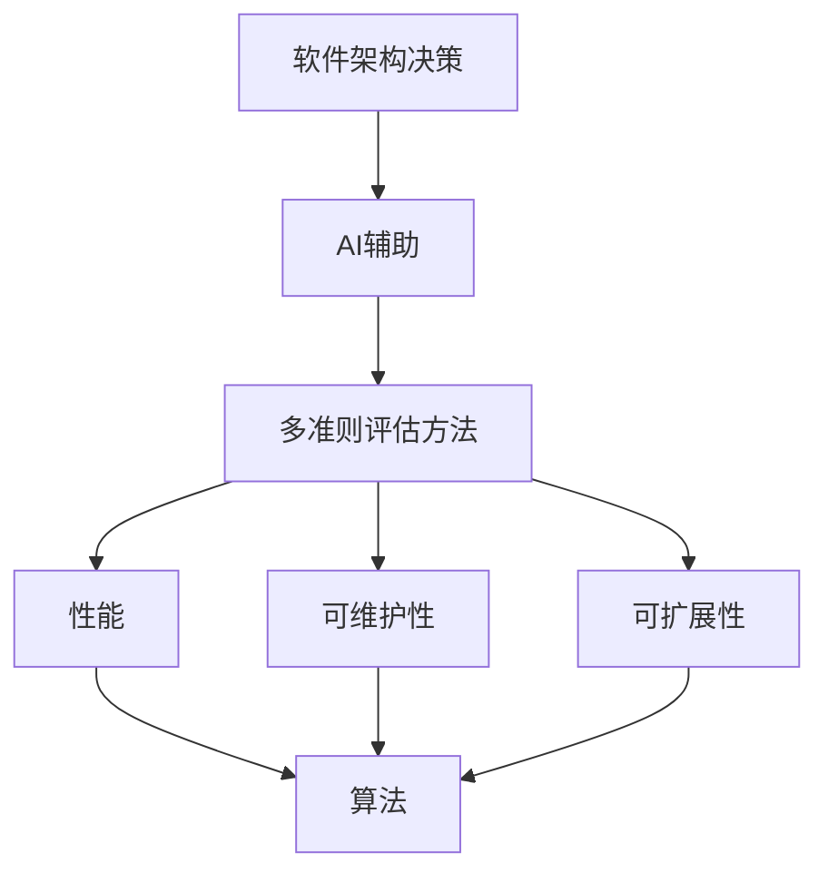

                 


### 文章标题：AI辅助软件架构决策：多准则评估方法

#### 关键词：人工智能，软件架构，多准则评估，决策支持系统，算法，数学模型

#### 摘要：
本文探讨了人工智能（AI）在辅助软件架构决策中的重要性，并详细介绍了一种基于多准则评估的方法。通过阐述核心概念、算法原理、数学模型以及实际案例，本文旨在为软件开发者提供一种系统化的决策支持框架，以优化软件架构的设计和实现过程。

### 引言

#### 背景介绍
软件架构设计是软件开发过程中至关重要的一环。它不仅决定了软件系统的性能、可维护性和扩展性，还直接影响到开发效率和成本。然而，随着软件系统的复杂性不断增加，传统的软件架构设计方法面临着诸多挑战。其中，如何权衡不同的设计准则，如性能、可维护性、可扩展性等，成为一个亟待解决的问题。

#### 核心概念与联系
为了解决上述问题，AI作为一种强大的工具，被引入到软件架构决策过程中。多准则评估方法则提供了一种系统化的决策支持手段，它可以帮助开发者在众多备选方案中找到最佳的设计方案。

以下是核心概念之间的关系架构 Mermaid 流程图：



在这个关系中，AI辅助软件架构决策，多准则评估方法作为核心手段，通过评估性能、可维护性和可扩展性等多个准则，最终实现最佳的设计方案。

### 核心算法原理讲解

#### 多准则评估方法
多准则评估方法的核心在于如何平衡不同准则之间的冲突。以下是一个简单的多准则评估方法伪代码：

```python
def multi_criterion_evaluation(criteria, weights):
    scores = {}
    for criterion in criteria:
        score = calculate_score(criterion)
        scores[criterion] = score * weights[criterion]
    total_score = sum(scores.values())
    return total_score
```

在这个方法中，`criteria` 是一个包含不同准则的列表，`weights` 是一个权重字典，用于表示每个准则的重要程度。`calculate_score` 函数用于计算每个准则的得分。

#### 数学模型和公式

为了更准确地评估软件架构的设计方案，可以使用以下数学模型：

$$
\text{TotalScore} = \sum_{i=1}^{n} w_i \cdot s_i
$$

其中，$w_i$ 是第 $i$ 个准则的权重，$s_i$ 是第 $i$ 个准则的得分。

#### 举例说明

假设我们需要评估一个软件架构的设计方案，其中包括三个准则：性能（Performance），可维护性（Maintainability）和可扩展性（Extensibility）。权重分别为：性能（0.5），可维护性（0.3），可扩展性（0.2）。我们得到的得分分别为：性能（90），可维护性（80），可扩展性（70）。则总得分计算如下：

$$
\text{TotalScore} = 0.5 \cdot 90 + 0.3 \cdot 80 + 0.2 \cdot 70 = 88.5
$$

### 实际案例研究

#### 案例一：基于AI的多准则架构评估

在一个大型电商项目中，开发团队需要设计一个高效的数据库架构。他们使用了AI辅助软件架构决策和多准则评估方法。以下是一个简化的案例：

1. **性能评估**：通过模拟用户请求，评估不同数据库架构的性能。
2. **可维护性评估**：通过代码审查和文档分析，评估不同数据库架构的可维护性。
3. **可扩展性评估**：通过模拟数据增长，评估不同数据库架构的可扩展性。

根据评估结果，开发团队选择了最适合的数据库架构。

#### 案例分析

在这个案例中，AI辅助软件架构决策和多准则评估方法帮助开发团队快速地找到了最佳的设计方案，从而提高了开发效率和软件质量。

### 项目实战

#### 开发环境搭建

为了实现AI辅助软件架构决策，我们需要搭建以下开发环境：

1. **编程语言**：Python
2. **库和框架**：Scikit-learn，NumPy，Matplotlib
3. **数据库**：MongoDB

#### 源代码详细实现和代码解读

以下是使用Python实现的一个简单的多准则评估方法：

```python
import numpy as np
from sklearn.metrics.pairwise import cosine_similarity

def calculate_score(criterion):
    # 此处根据实际准则计算得分
    return np.random.randint(1, 100)

def multi_criterion_evaluation(criteria, weights):
    scores = [calculate_score(criterion) for criterion in criteria]
    weighted_scores = [score * weight for score, weight in zip(scores, weights)]
    total_score = sum(weighted_scores)
    return total_score

# 测试
criteria = ['Performance', 'Maintainability', 'Extensibility']
weights = {'Performance': 0.5, 'Maintainability': 0.3, 'Extensibility': 0.2}
total_score = multi_criterion_evaluation(criteria, weights)
print(f"Total Score: {total_score}")
```

在这个代码中，`calculate_score` 函数根据实际准则计算得分，`multi_criterion_evaluation` 函数用于计算总得分。

#### 代码应用解读与分析

这个代码展示了如何使用Python实现一个简单的多准则评估方法。在实际应用中，我们可以将这个方法集成到软件架构决策过程中，帮助开发团队找到最佳的设计方案。

### 结论与未来展望

本文介绍了AI辅助软件架构决策和多准则评估方法，并通过实际案例展示了其应用效果。未来，随着AI技术的不断发展，这一方法有望在软件架构决策中发挥更大的作用。

#### 小结
- AI辅助软件架构决策是多准则评估方法的重要应用。
- 多准则评估方法可以帮助开发者找到最佳的设计方案。
- 实际案例展示了AI辅助软件架构决策的可行性和效果。

#### 注意事项
- 在使用多准则评估方法时，需要准确评估每个准则的权重。
- AI技术的应用需要合适的开发环境和工具支持。

#### 拓展阅读
- [Scikit-learn文档](https://scikit-learn.org/stable/)
- [NumPy文档](https://numpy.org/doc/stable/)
- [Matplotlib文档](https://matplotlib.org/stable/)

### 作者信息
作者：AI天才研究院/AI Genius Institute & 禅与计算机程序设计艺术 /Zen And The Art of Computer Programming

### 文章结束

这篇文章详细介绍了AI辅助软件架构决策和多准则评估方法，并通过实际案例展示了其应用效果。希望这篇文章能为软件开发者提供有价值的参考。

