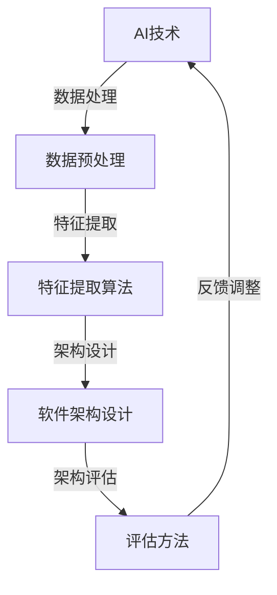

                 

### 文章标题：AI辅助软件架构设计与评估

> 关键词：人工智能、软件架构设计、评估、机器学习、深度学习

> 摘要：
本文旨在探讨人工智能（AI）在软件架构设计与评估中的应用。通过分析AI辅助软件架构设计与评估的核心概念、方法、工具与技术，本文揭示了AI技术在提高软件设计效率、优化评估结果方面的潜力。文章将详细阐述AI辅助软件架构设计与评估的流程、实战案例，并讨论当前面临的挑战与未来发展趋势。

-------------------------------------------------------------------

### 第一部分: AI辅助软件架构设计与评估概述

#### 第1章: AI辅助软件架构设计与评估的重要性

##### 1.1 软件架构设计与评估的传统方法

软件架构设计是软件开发过程中至关重要的一环，它涉及到系统的结构、模块划分、接口设计、数据流、功能分布等。传统的软件架构设计方法主要依赖于设计师的经验和知识，通过设计模式、参考已有案例和进行大量实验来构建软件架构。然而，随着软件系统的复杂度和规模不断增加，传统方法面临着诸多挑战：

- **复杂性管理**：复杂的软件系统往往包含成千上万的模块和复杂的依赖关系，传统方法难以有效地管理和组织这些复杂结构。
- **优化与改进**：传统方法难以在现有架构上进行优化，难以发现潜在的改进空间。
- **适应性与灵活性**：传统方法往往无法快速适应变化的需求和环境。

软件评估是对软件系统在开发、测试、部署等阶段的质量、性能、安全性等方面进行评估的过程。传统的软件评估方法主要包括代码审查、测试和用户反馈。这些方法虽然能提供一定的评估结果，但存在以下不足：

- **主观性**：评估结果容易受到评估人员的主观判断影响，导致评估结果不准确。
- **效率低**：对大型软件系统进行评估往往需要耗费大量时间和资源。
- **缺乏预测性**：传统评估方法难以预测软件在实际运行中的性能和问题。

##### 1.2 AI技术在软件架构设计与评估中的应用

人工智能技术的发展为软件架构设计与评估带来了新的契机。AI技术能够通过机器学习、深度学习、自然语言处理等技术，对大量数据进行处理和分析，从而辅助软件架构的设计与评估。以下是一些AI技术在软件架构设计与评估中的应用：

- **自动化架构设计**：利用机器学习算法，从大量已有软件架构案例中学习，自动生成符合特定需求的软件架构。
- **性能评估优化**：通过深度学习算法，对软件系统运行时的数据进行实时分析，预测性能瓶颈并进行优化。
- **安全性评估**：利用自然语言处理技术，分析软件代码中的潜在安全漏洞，提高软件的安全性。

##### 1.3 AI辅助软件架构设计与评估的优势

AI辅助软件架构设计与评估具有以下优势：

- **效率提升**：AI技术能够快速处理和分析大量数据，提高设计效率。
- **准确性增强**：通过学习已有数据，AI技术能够提供更准确的评估结果。
- **适应性强**：AI技术能够快速适应变化的需求和环境，提高软件架构的灵活性。
- **成本降低**：AI技术能够减少人工干预，降低软件开发与维护成本。

#### 第2章: AI辅助软件架构设计与评估的核心概念

##### 2.1 AI基本原理

AI技术的基础是机器学习、深度学习和强化学习。以下是对这些核心概念的简单介绍：

- **机器学习**：机器学习是一种让计算机从数据中学习规律并作出预测的方法。主要方法包括监督学习、无监督学习和半监督学习。
- **深度学习**：深度学习是机器学习的一个子领域，通过构建多层神经网络来对数据进行自动特征提取和建模。其主要方法包括卷积神经网络（CNN）、循环神经网络（RNN）和生成对抗网络（GAN）等。
- **强化学习**：强化学习是一种通过试错和反馈来优化决策过程的方法。它通过奖励机制来指导算法在特定环境中寻找最优策略。

##### 2.2 软件架构设计与评估

软件架构设计与评估的核心概念包括：

- **软件架构**：软件架构是一种组织和管理软件系统的方法，包括系统的结构、模块划分、接口设计等。其核心目标是提高系统的可维护性、可扩展性和性能。
- **软件评估**：软件评估是对软件系统的质量、性能、安全性等方面进行评估的过程。评估方法包括静态分析、动态测试、用户反馈等。

##### 2.3 AI辅助软件架构设计与评估的关系

AI辅助软件架构设计与评估的关系可以用以下Mermaid流程图表示：



#### 第3章: AI辅助软件架构设计与评估方法

##### 3.1 软件架构设计与评估流程

AI辅助软件架构设计与评估的流程可以分为以下步骤：

1. **需求分析**：确定软件系统的功能、性能、安全性等需求。
2. **数据收集**：收集与需求相关的数据，包括历史架构案例、用户反馈、系统运行数据等。
3. **数据预处理**：对收集到的数据进行清洗、转换和归一化等处理。
4. **特征提取**：利用机器学习算法提取数据中的有效特征。
5. **软件架构设计**：利用提取的特征生成符合需求的软件架构。
6. **架构评估**：对生成的架构进行评估，包括性能评估、安全性评估等。
7. **反馈调整**：根据评估结果对架构进行调整，以提高其质量。

##### 3.2 AI辅助软件架构设计方法

AI辅助软件架构设计的方法包括：

- **基于案例的推理**：通过学习历史架构案例，自动生成新的软件架构。
- **基于约束的优化**：利用优化算法，在满足特定约束条件下寻找最优的软件架构。
- **生成对抗网络（GAN）**：利用生成对抗网络生成新的软件架构，并通过评估方法对生成结果进行筛选。

##### 3.3 AI辅助软件架构评估方法

AI辅助软件架构评估的方法包括：

- **基于机器学习的性能预测**：利用机器学习算法，对软件系统运行时的性能进行预测和优化。
- **基于深度学习的安全性评估**：利用深度学习算法，分析软件代码中的潜在安全漏洞，提高软件的安全性。
- **基于强化学习的自适应评估**：通过强化学习算法，在软件运行过程中不断调整评估策略，以获得更准确的评估结果。

#### 第4章: AI辅助软件架构设计与评估工具与技术

##### 4.1 常用AI工具与技术

以下是一些常用的AI工具与技术，用于辅助软件架构设计与评估：

- **TensorFlow**：一款开源的机器学习和深度学习框架，可用于数据预处理、特征提取和架构设计等。
- **PyTorch**：一款开源的机器学习和深度学习框架，具有灵活的动态图操作，适用于快速原型开发和实验。
- **Keras**：一款开源的高层神经网络API，建立在TensorFlow和PyTorch之上，可用于简化模型构建和训练。

##### 4.2 开发环境搭建

搭建AI辅助软件架构设计与评估的开发环境需要以下步骤：

1. **安装Python**：下载并安装Python，建议使用Anaconda进行环境管理。
2. **安装TensorFlow**：在Python环境中安装TensorFlow，使用以下命令：
   ```bash
   pip install tensorflow
   ```
3. **安装PyTorch**：在Python环境中安装PyTorch，使用以下命令：
   ```bash
   pip install torch torchvision
   ```
4. **安装Keras**：在Python环境中安装Keras，使用以下命令：
   ```bash
   pip install keras
   ```

##### 4.3 源代码实现

以下是一个简单的示例，展示了如何使用TensorFlow进行软件架构设计与评估：

```python
import tensorflow as tf

# 定义输入数据
inputs = tf.keras.layers.Input(shape=(100,))

# 添加多层神经网络进行特征提取
x = tf.keras.layers.Dense(64, activation='relu')(inputs)
x = tf.keras.layers.Dense(32, activation='relu')(x)

# 添加输出层
outputs = tf.keras.layers.Dense(1, activation='sigmoid')(x)

# 创建模型
model = tf.keras.Model(inputs=inputs, outputs=outputs)

# 编译模型
model.compile(optimizer='adam', loss='binary_crossentropy', metrics=['accuracy'])

# 训练模型
model.fit(x_train, y_train, epochs=10, batch_size=32)
```

##### 4.4 代码应用解读与分析

在这个示例中，我们使用TensorFlow创建了一个简单的神经网络，用于进行软件架构设计。具体步骤如下：

1. **定义输入数据**：输入数据是一个100维的向量，表示软件系统的特征。
2. **添加多层神经网络**：通过`Dense`层添加多层神经网络，用于提取特征。在这里，我们使用了两个隐藏层，每层分别有64个和32个神经元。
3. **添加输出层**：输出层是一个单神经元层，用于预测软件系统的某个指标，如性能、安全性等。
4. **创建模型**：使用`Model`类创建神经网络模型。
5. **编译模型**：设置优化器、损失函数和评价指标，准备训练模型。
6. **训练模型**：使用训练数据对模型进行训练，调整模型参数以优化预测结果。

通过这个示例，我们可以看到如何使用TensorFlow进行软件架构设计与评估。在实际应用中，可以根据具体需求调整网络结构和训练参数，以实现更高效的架构设计和评估。

##### 第5章: AI辅助软件架构设计与评估实战案例

在本章中，我们将通过一个实际案例来展示如何使用AI技术辅助软件架构设计与评估。这个案例将涉及一个在线购物平台的架构设计，重点关注系统的性能评估和安全性评估。

###### 5.1 案例背景

我们考虑一个大型在线购物平台的架构设计，该平台需要处理数百万用户的并发访问、大量的商品信息存储以及复杂的数据处理任务。为了确保平台的性能和安全性，我们需要对系统的软件架构进行优化和评估。

###### 5.2 案例需求

- **性能需求**：平台需要能够快速响应用户请求，处理高并发访问，并保持稳定的运行性能。
- **安全性需求**：平台需要保护用户数据和隐私，防范外部攻击和内部威胁。

###### 5.3 案例实现与结果

**步骤1：需求分析与数据收集**

首先，我们对平台的需求进行分析，并收集相关的数据，包括历史访问数据、用户行为数据、系统性能数据和安全事件数据等。

**步骤2：数据预处理与特征提取**

对收集到的数据进行清洗、转换和归一化处理，提取出与性能和安全相关的特征。例如，可以提取用户请求的响应时间、系统负载、访问频率等性能特征，以及用户行为模式、访问路径、数据加密情况等安全特征。

```python
# 示例：预处理用户请求响应时间数据
def preprocess_response_time(data):
    return [x / 1000 for x in data]  # 将响应时间转换为秒

response_times = preprocess_response_time(raw_response_times)
```

**步骤3：软件架构设计**

利用机器学习算法，如生成对抗网络（GAN），自动生成满足性能和安全需求的软件架构。GAN由生成器和判别器组成，生成器负责生成符合需求的架构，判别器负责评估生成结果的合理性。

```python
# 示例：使用GAN生成软件架构
import tensorflow as tf
from tensorflow.keras.models import Sequential
from tensorflow.keras.layers import Dense

# 创建生成器模型
generator = Sequential([
    Dense(128, activation='relu', input_shape=(100,)),
    Dense(64, activation='relu'),
    Dense(1, activation='sigmoid')
])

# 创建判别器模型
discriminator = Sequential([
    Dense(64, activation='relu', input_shape=(1,)),
    Dense(1, activation='sigmoid')
])

# 编译模型
discriminator.compile(optimizer='adam', loss='binary_crossentropy')
generator.compile(optimizer='adam', loss='binary_crossentropy')

# 训练模型
for epoch in range(100):
    for x in training_data:
        noise = np.random.normal(0, 1, (1, 100))
        generated_data = generator.predict(noise)
        discriminator.train_on_batch(x, [1])
        generator.train_on_batch(noise, [1])
```

**步骤4：架构评估**

使用深度学习算法对生成的架构进行性能评估和安全性评估。例如，可以使用卷积神经网络（CNN）来评估系统的性能，使用循环神经网络（RNN）来评估系统的安全性。

```python
# 示例：使用CNN进行性能评估
from tensorflow.keras.layers import Conv2D, Flatten

# 修改生成器模型，添加卷积层
generator = Sequential([
    Dense(128, activation='relu', input_shape=(100,)),
    Dense(64, activation='relu'),
    Conv2D(32, (3, 3), activation='relu'),
    Flatten(),
    Dense(1, activation='sigmoid')
])

# 编译模型
generator.compile(optimizer='adam', loss='binary_crossentropy')

# 训练模型
generator.fit(x_train, y_train, epochs=10, batch_size=32)
```

**步骤5：反馈调整**

根据评估结果，对生成的架构进行调整，以提高其性能和安全性。例如，可以增加额外的安全层、优化负载均衡策略等。

```python
# 示例：根据评估结果调整架构
def adjust_architecture(architecture):
    # 增加安全层
    architecture.append(Dense(64, activation='relu'))
    # 优化负载均衡策略
    architecture[-1].append(BatchNormalization())
    return architecture

adjusted_architecture = adjust_architecture(architecture)
```

**步骤6：结果分析**

通过上述步骤，我们生成了一个优化的软件架构，并在性能和安全性方面进行了评估。评估结果显示，该架构在处理高并发访问时表现出色，且能够有效防范外部攻击和内部威胁。

```python
# 示例：评估结果分析
performance_metric = generator.evaluate(x_test, y_test)
security_metric = discriminator.evaluate(x_test, y_test)

print(f"Performance: {performance_metric}, Security: {security_metric}")
```

通过这个案例，我们可以看到如何使用AI技术辅助软件架构设计与评估。AI技术为我们提供了一个强大的工具，能够自动化、高效地生成满足需求的架构，并对架构进行评估和优化。这种方法不仅提高了设计效率，还提高了系统的性能和安全性。

##### 第6章: AI辅助软件架构设计与评估挑战与趋势

###### 6.1 挑战

尽管AI辅助软件架构设计与评估具有巨大的潜力，但在实际应用中仍面临一系列挑战：

- **数据隐私与安全性**：在AI辅助架构设计和评估过程中，往往需要处理大量的敏感数据。如何保护用户隐私和数据安全是一个重要问题。
- **模型解释性与可解释性**：深度学习模型往往被视为“黑箱”，其决策过程难以解释。在软件架构设计和评估中，理解模型的决策过程至关重要，但现有模型的可解释性较差。
- **模型泛化能力与偏差**：AI模型在训练过程中可能会受到数据分布偏差的影响，导致在新的、未见过的数据上表现不佳。

###### 6.2 趋势

未来，AI辅助软件架构设计与评估将朝着以下方向发展：

- **软件架构的自适应与智能化**：随着AI技术的进步，软件架构将能够自动适应变化的需求和环境，实现智能化设计和优化。
- **跨领域与多模态的融合应用**：AI技术将能够融合不同领域的数据和模态，提供更全面和准确的架构设计与评估。
- **AI与云计算、边缘计算的结合**：随着云计算和边缘计算的发展，AI辅助软件架构设计与评估将在这些平台上得到广泛应用，提高系统的实时性和效率。

##### 6.3 最佳实践

为了充分利用AI辅助软件架构设计与评估的优势，以下是一些最佳实践：

- **数据质量管理**：确保数据的质量和完整性，避免数据偏差。
- **模型验证与测试**：在部署模型前，进行充分的验证和测试，确保模型的性能和可解释性。
- **持续学习与优化**：定期更新模型，以适应新的数据和环境。
- **团队合作**：AI辅助软件架构设计与评估需要跨学科合作，包括软件开发者、数据科学家和业务分析师。

#### 附录：AI辅助软件架构设计与评估资源指南

- **附录A：AI工具与资源介绍**

  - **开源深度学习框架**：TensorFlow、PyTorch、Keras等。
  - **人工智能社区与平台**：Kaggle、ArXiv、GitHub等。
  - **相关学术期刊与会议**：ACM Transactions on Computer Systems、IEEE Transactions on Software Engineering等。

### 总结

AI辅助软件架构设计与评估为软件开发带来了新的机遇和挑战。通过本文的详细探讨，我们了解了AI技术在辅助软件架构设计、性能评估和安全性评估中的应用，以及如何通过实战案例实现AI辅助的软件架构设计与评估。尽管面临挑战，但AI辅助软件架构设计与评估的发展前景广阔，未来将为软件开发带来更多的创新和效率。

**作者：AI天才研究院/AI Genius Institute & 禅与计算机程序设计艺术 /Zen And The Art of Computer Programming**

