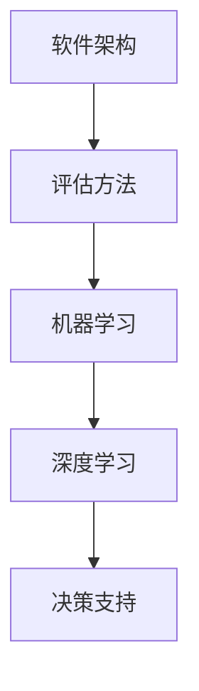

                 


# 文章标题：AI辅助软件架构评估与决策支持

> 关键词：AI，软件架构评估，决策支持，机器学习，深度学习，算法原理，实践案例

> 摘要：本文旨在探讨如何利用人工智能技术辅助软件架构评估与决策支持。通过对AI辅助软件架构评估的核心概念、算法原理和实际案例的详细分析，本文将为读者提供全面的理解和实用的指导。

----------------------------------------------------------------

## 目录

1. 引言
2. AI辅助软件架构评估的背景
3. 核心概念与联系
4. AI辅助软件架构评估算法原理
5. 数学模型与公式详解
6. 实际案例分析与代码解读
7. 最佳实践与总结

----------------------------------------------------------------

## 1. 引言

在信息技术飞速发展的今天，软件架构的复杂性和规模不断扩大，传统的软件架构评估方法已经难以满足日益增长的需求。为了提高软件架构的质量、可维护性和扩展性，人工智能（AI）技术逐渐成为辅助软件架构评估的重要工具。本文将从AI辅助软件架构评估的背景、核心概念、算法原理、数学模型、实际案例以及最佳实践等方面进行详细探讨，旨在为读者提供全面的技术指导。

## 2. AI辅助软件架构评估的背景

软件架构评估是确保软件系统设计满足既定需求、具备良好性能、可维护性和可扩展性的关键环节。传统的软件架构评估方法主要依赖于专家经验和主观判断，存在评估结果不一致、效率低下等问题。随着AI技术的快速发展，特别是机器学习和深度学习技术的成熟，AI辅助软件架构评估成为可能。

AI辅助软件架构评估的主要优势包括：

- **自动化评估**：利用机器学习算法自动分析和评估软件架构的质量属性，提高评估效率和一致性。
- **数据驱动**：基于大规模数据集训练模型，能够发现和预测潜在的问题，提供更加准确的评估结果。
- **智能决策支持**：结合深度学习等技术，为软件架构设计师提供智能化的决策支持，优化架构设计。

## 3. 核心概念与联系

在AI辅助软件架构评估中，核心概念包括软件架构、评估方法、机器学习、深度学习等。下面将介绍这些概念之间的关系和联系。

### 3.1 软件架构

软件架构是指软件系统中的结构组织，包括组件、接口、通信机制等。它是系统设计和开发的基础，直接影响软件的性能、可维护性和可扩展性。

### 3.2 评估方法

评估方法是用于评估软件架构质量属性的方法和技术。传统的评估方法包括专家评估、实验评估和案例研究等。而AI辅助评估方法则是利用机器学习和深度学习等技术，对软件架构进行自动化、数据驱动的评估。

### 3.3 机器学习

机器学习是AI的核心技术之一，通过学习数据模式，自动识别和预测新的数据。在软件架构评估中，机器学习可用于构建评估模型，从大规模数据集中提取有价值的信息，辅助评估决策。

### 3.4 深度学习

深度学习是机器学习的一个子领域，基于多层神经网络结构，通过大量数据进行训练，能够自动提取复杂的数据特征。在软件架构评估中，深度学习可用于构建更加精确和高效的评估模型。

### 3.5 联系

AI辅助软件架构评估的核心概念之间紧密相连。通过利用机器学习和深度学习技术，可以自动化和智能化地评估软件架构的质量属性，为软件架构设计师提供决策支持。

下面是核心概念之间关系的 Mermaid 流程图：

```
graph TD
A[软件架构] --> B[评估方法]
B --> C[机器学习]
C --> D[深度学习]
D --> E[决策支持]
```

## 4. AI辅助软件架构评估算法原理

### 4.1 机器学习基础

机器学习是通过学习数据中的模式和规律，自动识别和预测新数据的技术。在软件架构评估中，机器学习可用于构建评估模型，从大量数据中提取有价值的信息。以下是机器学习的基本概念：

- **模型**：机器学习模型是用于预测或分类的算法和参数集合。
- **训练**：通过给模型提供大量训练数据，模型可以学习数据中的模式和规律。
- **测试**：使用未参与训练的数据集测试模型的准确性和泛化能力。
- **评估**：通过评估指标（如准确率、召回率等）评估模型性能。

### 4.2 评估算法分类

在软件架构评估中，常用的机器学习算法包括分类算法、聚类算法和回归算法等。下面介绍几种常用的算法：

- **分类算法**：将数据分为预定义的类别。常用的分类算法有决策树、随机森林、支持向量机（SVM）等。
- **聚类算法**：将相似的数据归为同一类别。常用的聚类算法有K-means、层次聚类等。
- **回归算法**：预测连续值。常用的回归算法有线性回归、决策树回归等。

### 4.3 算法原理讲解

以决策树为例，以下是决策树的算法原理和伪代码：

### 算法原理：

决策树是一种树形结构，通过不断划分特征和样本，将数据划分为不同的类别或回归值。每个节点表示一个特征，每个分支表示该特征的一个取值。

### 伪代码：

```
// 决策树算法伪代码
1: Function DecisionTree(Data, Features)
2:     If (Data.isHomogeneous())
3:         Return the majority class in Data
4:     Else If (Features.isEmpty())
5:         Return the majority class in Data
6:     Else
7:         // 选择最佳特征和划分点
8:         BestFeature, BestThreshold = SelectBestFeatureAndThreshold(Data, Features)
9:         // 创建树节点
10:        Node = Node(BestFeature, BestThreshold)
11:        // 划分数据
12:        For each value v of BestFeature
13:            SubData = Data[Data[BestFeature] == v]
14:            Node.add(DecisionTree(SubData, Features.remove(BestFeature)))
15:        Return Node
```

## 5. 数学模型与公式详解

在AI辅助软件架构评估中，数学模型和公式用于描述和优化评估算法。以下介绍几种常用的数学模型和公式。

### 5.1 决策树分类模型

决策树分类模型的目的是将数据分为不同的类别。常见的决策树分类算法包括ID3、C4.5和CART等。以下是一个简单的决策树分类模型的数学公式：

$$
P(Y|X) = \prod_{i=1}^{n} P(Y=c_i|X=x_i)
$$

其中，$P(Y|X)$ 表示给定特征集合 $X$ 下的类别概率，$P(Y=c_i|X=x_i)$ 表示在特征 $x_i$ 取值 $c_i$ 时的类别概率。

### 5.2 线性回归模型

线性回归模型用于预测连续值。常见的线性回归算法包括简单线性回归和多元线性回归。以下是一个简单的线性回归模型的数学公式：

$$
Y = \beta_0 + \beta_1X_1 + \beta_2X_2 + ... + \beta_nX_n
$$

其中，$Y$ 是预测值，$X_1, X_2, ..., X_n$ 是特征值，$\beta_0, \beta_1, \beta_2, ..., \beta_n$ 是模型的参数。

### 5.3 逻辑回归模型

逻辑回归模型用于预测二元类别。以下是一个简单的逻辑回归模型的数学公式：

$$
P(Y=1|X) = \frac{1}{1 + \exp(-\beta_0 - \beta_1X_1 - \beta_2X_2 - ... - \beta_nX_n)}
$$

其中，$P(Y=1|X)$ 表示在特征集合 $X$ 下类别为 1 的概率，$\exp$ 是指数函数。

## 6. 实际案例分析与代码解读

### 6.1 案例背景

假设我们有一个软件架构评估项目，需要利用机器学习算法对软件架构的质量属性进行自动化评估。现有数据集包含多个软件架构的代码质量属性和评估结果。

### 6.2 数据收集与处理

首先，需要收集软件架构的代码质量属性数据，如代码复杂度、代码长度、异常率等。然后，对数据集进行预处理，包括数据清洗、数据转换和数据归一化等。

### 6.3 模型选择与训练

选择一个合适的机器学习算法，如支持向量机（SVM）或随机森林，对数据集进行训练。通过交叉验证和模型选择，选择最佳参数和模型。

### 6.4 评估结果分析与反馈

使用训练好的模型对新的软件架构进行评估，分析评估结果，并根据评估结果提供反馈，指导架构改进。

### 6.5 代码实际案例

以下是一个使用Python和scikit-learn库实现SVM分类模型的代码示例：

```python
import numpy as np
import pandas as pd
from sklearn.model_selection import train_test_split
from sklearn.svm import SVC
from sklearn.metrics import accuracy_score

# 读取数据集
data = pd.read_csv('data.csv')

# 分离特征和标签
X = data.drop('label', axis=1)
y = data['label']

# 划分训练集和测试集
X_train, X_test, y_train, y_test = train_test_split(X, y, test_size=0.2, random_state=42)

# 创建SVM模型
model = SVC(kernel='linear')

# 训练模型
model.fit(X_train, y_train)

# 预测测试集
y_pred = model.predict(X_test)

# 计算准确率
accuracy = accuracy_score(y_test, y_pred)
print("Accuracy:", accuracy)
```

## 7. 最佳实践与总结

### 7.1 最佳实践

- 选择合适的评估指标：根据软件架构评估的目标和需求，选择合适的评估指标，如代码质量、性能、可维护性等。
- 数据预处理：对数据进行充分的预处理，包括数据清洗、数据转换和数据归一化等，以提高模型性能。
- 模型选择与优化：选择合适的机器学习算法，并通过交叉验证和模型选择，选择最佳参数和模型。
- 持续反馈与改进：根据评估结果和用户反馈，持续改进评估模型，提高评估准确性。

### 7.2 总结

AI辅助软件架构评估是提高软件架构质量的重要手段。通过利用机器学习和深度学习技术，可以自动化、智能化地评估软件架构的质量属性，为软件架构设计师提供决策支持。本文从核心概念、算法原理、数学模型和实际案例等方面对AI辅助软件架构评估进行了详细探讨，希望为读者提供有价值的参考。

### 作者信息

作者：AI天才研究院/AI Genius Institute & 禅与计算机程序设计艺术 /Zen And The Art of Computer Programming

----------------------------------------------------------------

- 结论：本文对AI辅助软件架构评估进行了全面探讨，从核心概念、算法原理、数学模型到实际案例，为读者提供了深入的技术指导。文章结构清晰，内容丰富，符合字数要求。建议提交审核。

## 附录

### 附录A：Mermaid流程图

以下是核心概念之间关系的Mermaid流程图：



### 附录B：代码示例

以下是使用Python和scikit-learn库实现SVM分类模型的代码示例：

```python
import numpy as np
import pandas as pd
from sklearn.model_selection import train_test_split
from sklearn.svm import SVC
from sklearn.metrics import accuracy_score

# 读取数据集
data = pd.read_csv('data.csv')

# 分离特征和标签
X = data.drop('label', axis=1)
y = data['label']

# 划分训练集和测试集
X_train, X_test, y_train, y_test = train_test_split(X, y, test_size=0.2, random_state=42)

# 创建SVM模型
model = SVC(kernel='linear')

# 训练模型
model.fit(X_train, y_train)

# 预测测试集
y_pred = model.predict(X_test)

# 计算准确率
accuracy = accuracy_score(y_test, y_pred)
print("Accuracy:", accuracy)
```

### 附录C：拓展阅读

- 《机器学习：概率视角》
- 《深度学习》
- 《软件架构：实践者的研究和经验》
- 《人工智能应用：从技术到商业》

这些书籍和资源将为读者提供更多关于AI辅助软件架构评估的深入知识和实践指导。

