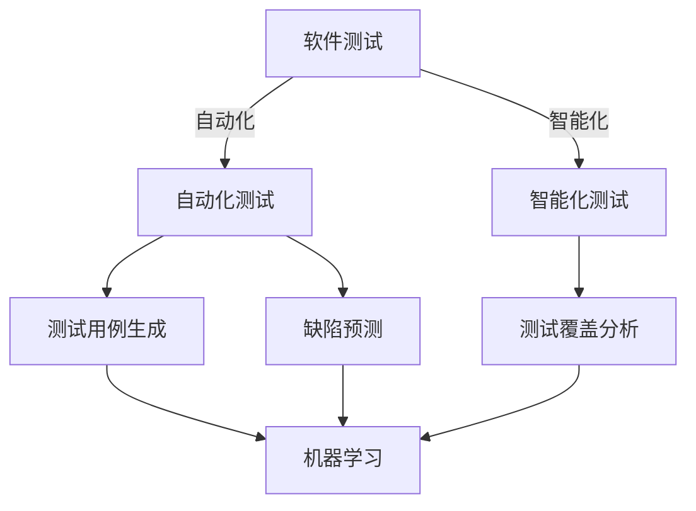
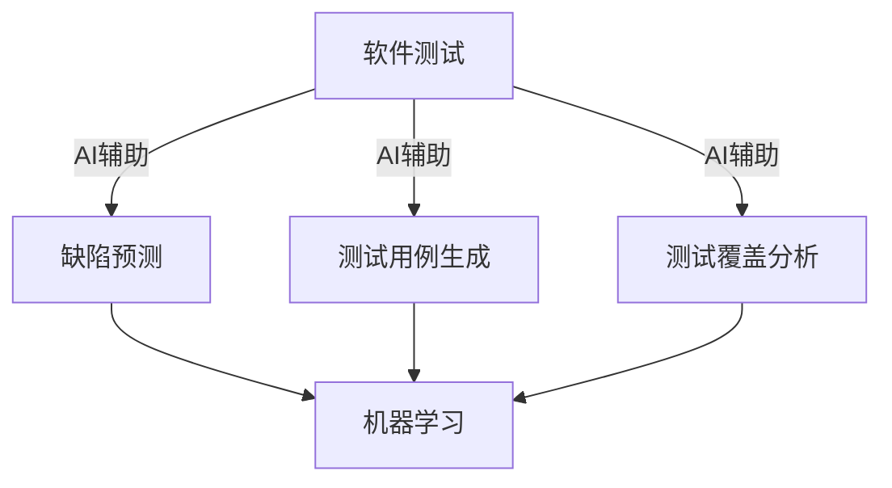

                 


### 《AI辅助软件测试：从自动化到智能化》文章大纲与内容设计

#### 文章格式要求

在撰写这篇文章之前，首先确保文章的格式符合markdown规范。markdown格式有助于清晰展示文章的结构，便于读者阅读和理解。每段内容前需使用空行分隔，章节标题使用井号（#）进行标记，小节标题使用多个井号。以下是markdown格式示例：

```
## 文章标题

# 文章关键词

> 摘要：...

## 第一部分：基础理论

### 第1章 引言

#### 1.1 软件测试的现状与挑战

```

#### 目录大纲结构

为了确保文章的全面性和逻辑性，将文章内容分为三个主要部分：基础理论、核心算法和实际应用。以下是详细的大纲结构：

## 第一部分：基础理论

### 第1章 引言

#### 1.1 软件测试的现状与挑战
- **背景介绍**：介绍当前软件测试所面临的挑战，如软件复杂性、测试覆盖不足、测试成本高等。
- **AI技术在软件测试中的应用前景**：讨论AI技术如何帮助解决上述问题，提高软件测试的效率和准确性。

### 第2章 AI基础知识

#### 2.1 机器学习基础
- **监督学习、无监督学习和强化学习**：解释三种常见的机器学习方法。
- **常见机器学习算法**：介绍回归、分类、聚类等常见算法。

#### 2.2 AI辅助软件测试的原理
- **软件测试与AI的关联**：阐述AI技术在软件测试中的具体应用，如缺陷预测、测试用例生成等。
- **核心概念与联系**：使用Mermaid流程图展示AI辅助软件测试的核心概念及其关系。
  
## 第二部分：核心算法

### 第4章 缺陷预测算法

#### 4.1 基于统计的缺陷预测
- **预测模型的构建**：详细讲解缺陷预测模型如何构建。
- **预测模型的评估**：介绍如何评估预测模型的效果。

### 第5章 测试用例生成算法

#### 5.1 贪心算法
- **测试用例生成的贪心策略**：描述贪心算法在测试用例生成中的应用。
- **贪心算法的性能分析**：分析贪心算法的性能表现。

### 第6章 测试覆盖分析算法

#### 6.1 覆盖率基础
- **代码覆盖率**：解释代码覆盖率的定义和重要性。
- **功能覆盖率**：介绍功能覆盖率的含义和应用。

## 第三部分：实际应用

### 第7章 AI辅助软件测试实践

#### 7.1 测试环境搭建
- **环境准备**：描述如何搭建适合AI辅助软件测试的开发环境。
- **工具安装**：介绍常用的AI辅助软件测试工具及其安装过程。

### 第8章 实战案例

#### 8.1 案例一：使用机器学习预测软件缺陷
- **数据收集**：讨论如何收集软件缺陷数据。
- **模型训练与验证**：介绍如何训练和验证缺陷预测模型。

### 第9章 挑战与未来趋势

#### 9.1 AI辅助软件测试的挑战
- **数据质量**：探讨数据质量对AI辅助软件测试的影响。
- **模型解释性**：讨论模型解释性在软件测试中的重要性。

#### 9.2 未来发展趋势
- **深度学习的应用**：介绍深度学习在AI辅助软件测试中的应用。
- **人工智能与软件测试的结合点**：展望人工智能与软件测试未来的结合方向。

#### 完整性与字数控制

在撰写文章时，确保每个小节的内容都丰富、具体、详细，涵盖核心概念、算法原理、数学模型、实际应用案例等。在确保完整性的同时，对每个章节的字数进行控制，避免过度冗余。初步估计，整个文章的总字数在8000到12000字之间。

通过上述步骤，我们将为读者呈现一篇逻辑清晰、内容详实、结构紧凑的《AI辅助软件测试：从自动化到智能化》技术博客文章。接下来，我们将逐步填充每个章节的具体内容，确保文章的完整性和深度。


### 文章标题与关键词

# 《AI辅助软件测试：从自动化到智能化》

关键词：AI辅助软件测试、自动化测试、智能化测试、缺陷预测、测试用例生成、测试覆盖分析

### 文章摘要

本文探讨了AI技术在软件测试中的应用，从自动化到智能化，分析了AI在软件测试中的潜在优势和面临的挑战。首先，介绍了软件测试的现状和挑战，以及AI技术如何解决这些问题。接着，深入探讨了AI基础知识，包括机器学习的基础理论和常见算法。在此基础上，详细讲解了AI辅助软件测试的核心算法，如缺陷预测算法、测试用例生成算法和测试覆盖分析算法。随后，通过实战案例展示了AI辅助软件测试的实际应用，并讨论了当前面临的挑战和未来发展趋势。本文旨在为软件开发者和测试工程师提供关于AI辅助软件测试的全面了解，并激励读者探索这一领域的前沿技术。


### 第一部分：基础理论

## 第1章 引言

### 1.1 软件测试的现状与挑战

在当今的软件行业中，软件测试已经成为确保软件质量和安全性的关键环节。然而，随着软件复杂度的不断增加，传统的测试方法面临着诸多挑战。

#### 软件复杂性

软件复杂性是当前软件测试面临的首要挑战。现代软件系统往往包含数百万甚至数十亿行代码，具有复杂的架构和功能。这使得测试覆盖率的提高成为一个难题，因为测试工程师需要确保每一个代码分支和功能点都被测试到。

#### 测试覆盖不足

测试覆盖率不足是软件测试中的一个常见问题。尽管测试工程师会设计出大量的测试用例，但仍然可能存在未被覆盖到的代码路径或功能点。这可能导致潜在的错误和漏洞，从而影响软件的质量和稳定性。

#### 测试成本高

随着软件系统的复杂度增加，测试的成本也随之上升。传统的测试方法通常需要大量的时间和人力资源，特别是在大型项目中。这使得测试过程变得昂贵且耗时。

#### AI技术的应用前景

为了应对上述挑战，AI技术开始被广泛应用于软件测试领域。AI技术具有以下优势：

#### 自动化测试

AI技术可以自动化地生成测试用例，提高测试覆盖率。通过学习历史测试数据和代码，AI算法能够生成新的测试用例，从而覆盖到更多的代码路径和功能点。

#### 缺陷预测

AI技术可以预测软件中的潜在缺陷，提高测试的准确性。通过分析代码和测试数据，AI算法可以识别出可能存在缺陷的代码区域，从而帮助测试工程师集中精力进行针对性的测试。

#### 智能化测试

AI技术可以实现智能化的测试流程管理，优化测试资源的使用。通过智能调度和分配测试任务，AI算法可以提高测试效率，降低测试成本。

#### 未来发展

随着AI技术的不断发展，其在软件测试中的应用前景将更加广阔。未来，AI技术有望实现更加智能化的测试过程，进一步提升软件测试的效率和准确性。

## 第2章 AI基础知识

### 2.1 机器学习基础

机器学习是AI技术的核心组成部分，其基本概念包括以下几种：

#### 监督学习

监督学习是一种最常见的机器学习方法，它利用已标记的输入输出数据进行学习，从而预测未知数据的输出。监督学习的目标是通过已知的输入输出关系建立预测模型。

#### 无监督学习

无监督学习是一种无需标记数据的机器学习方法，其目标是发现数据中的隐藏结构和模式。无监督学习常用于数据聚类、降维和关联规则挖掘等任务。

#### 强化学习

强化学习是一种通过试错和反馈进行学习的方法，其目标是使智能体在特定环境中做出最优决策。强化学习广泛应用于自动驾驶、机器人控制和游戏AI等领域。

### 2.2 常见机器学习算法

常见的机器学习算法包括以下几种：

#### 回归算法

回归算法用于预测连续值输出，其目标是通过输入特征找到与输出值之间的线性或非线性关系。常见的回归算法包括线性回归、岭回归和决策树回归。

#### 分类算法

分类算法用于预测离散值输出，其目标是将输入数据分为不同的类别。常见的分类算法包括逻辑回归、支持向量机和随机森林。

#### 聚类算法

聚类算法用于发现数据中的自然分组，其目标是将相似的数据点归为一组。常见的聚类算法包括K均值聚类、层次聚类和密度聚类。

#### 强化学习算法

强化学习算法通过试错和反馈进行学习，其目标是在特定环境中做出最优决策。常见的强化学习算法包括Q学习、SARSA和DQN。

### 2.3 AI辅助软件测试的原理

AI技术在软件测试中的应用主要体现在以下几个方面：

#### 缺陷预测

缺陷预测是一种利用AI技术预测软件中潜在缺陷的方法。通过分析代码和测试数据，AI算法可以识别出可能存在缺陷的代码区域，从而帮助测试工程师集中精力进行针对性的测试。

#### 测试用例生成

测试用例生成是一种利用AI技术自动生成测试用例的方法。通过学习历史测试数据和代码，AI算法可以生成新的测试用例，从而提高测试覆盖率。

#### 测试覆盖分析

测试覆盖分析是一种利用AI技术分析测试覆盖情况的方法。通过分析测试数据，AI算法可以识别出未被覆盖到的代码路径和功能点，从而帮助测试工程师优化测试用例。

### 2.4 核心概念与联系

为了更好地理解AI辅助软件测试，以下是一个核心概念关系的Mermaid流程图：



该流程图展示了软件测试与AI技术的关联，以及AI辅助软件测试的核心概念之间的联系。

### 2.5 总结

本章介绍了AI技术在软件测试中的应用，包括自动化测试和智能化测试。通过引入机器学习基础和常见算法，为后续章节的核心算法讲解打下了基础。同时，通过核心概念关系的流程图，帮助读者更清晰地理解AI辅助软件测试的原理和架构。

## 第3章 AI辅助软件测试的原理

### 3.1 软件测试与AI的关联

AI技术之所以能够辅助软件测试，主要是因为AI具备从大量数据中学习模式和规律的能力，这恰好是软件测试所需要的关键能力。软件测试的核心目标是发现缺陷，而AI技术可以通过以下几种方式与软件测试相结合：

#### 缺陷预测

缺陷预测是AI辅助软件测试的一个重要应用。通过分析历史测试数据和代码，AI算法可以预测哪些代码区域更容易出现缺陷。这有助于测试工程师将有限的资源集中在这些高风险区域，从而提高测试效率。

#### 测试用例生成

测试用例生成是利用AI技术自动生成测试用例的过程。传统的测试用例设计往往需要大量的时间和人力，而AI可以通过学习已有的测试数据和代码模式，自动生成新的测试用例，从而提高测试覆盖率和效率。

#### 测试覆盖分析

测试覆盖分析是利用AI技术对测试数据进行深入分析，以评估测试的全面性。AI算法可以识别出未被覆盖到的代码路径和功能点，帮助测试工程师优化测试用例，确保软件的每一个部分都得到充分的测试。

### 3.2 缺陷预测

缺陷预测是AI辅助软件测试中的一个关键环节。其核心思想是通过分析历史数据（如代码变更历史、测试结果、缺陷报告等），建立缺陷预测模型，从而对新的代码或变更进行预测。

#### 工作原理

缺陷预测的工作原理可以分为以下几个步骤：

1. **数据收集**：收集与软件测试相关的数据，包括代码变更历史、缺陷报告、测试结果等。
2. **特征提取**：从收集的数据中提取与缺陷相关的特征，如代码复杂度、变更大小、历史缺陷率等。
3. **模型训练**：使用机器学习算法（如决策树、随机森林、支持向量机等）训练缺陷预测模型。
4. **模型评估**：通过交叉验证等方法评估模型的准确性，调整模型参数以优化预测效果。
5. **缺陷预测**：使用训练好的模型对新的代码或变更进行缺陷预测，输出预测结果。

#### 示例

假设我们有一个缺陷预测模型，其输入特征包括代码变更大小、历史缺陷率等。以下是该模型的一个示例预测过程：

```
输入特征：
- 代码变更大小：100行
- 历史缺陷率：5%

预测结果：
- 缺陷风险评分：0.8

解读：
根据模型预测，这个代码变更有较高的缺陷风险，测试工程师应该给予重点关注。
```

### 3.3 测试用例生成

测试用例生成是利用AI技术自动生成测试用例的过程。通过学习历史测试数据和代码模式，AI算法可以生成新的测试用例，从而提高测试覆盖率和效率。

#### 工作原理

测试用例生成的工作原理可以分为以下几个步骤：

1. **数据收集**：收集与测试相关的数据，包括测试用例、测试结果、代码变更历史等。
2. **特征提取**：从收集的数据中提取与测试用例生成相关的特征，如代码模式、测试路径等。
3. **模型训练**：使用机器学习算法（如决策树、随机森林、生成对抗网络等）训练测试用例生成模型。
4. **测试用例生成**：使用训练好的模型生成新的测试用例。
5. **测试用例评估**：对生成的测试用例进行评估，确保其能够有效地覆盖代码。

#### 示例

假设我们有一个测试用例生成模型，其输入特征包括代码模式和测试路径。以下是该模型的一个示例生成过程：

```
输入特征：
- 代码模式：if-else结构
- 测试路径：未覆盖的代码分支

生成的测试用例：
1. 测试输入：正常输入
   预期输出：正常结果
2. 测试输入：异常输入
   预期输出：异常处理结果

解读：
生成的测试用例旨在覆盖代码中的if-else结构和未覆盖的代码分支，从而提高测试覆盖率。
```

### 3.4 测试覆盖分析

测试覆盖分析是利用AI技术对测试数据进行深入分析，以评估测试的全面性。AI算法可以识别出未被覆盖到的代码路径和功能点，帮助测试工程师优化测试用例。

#### 工作原理

测试覆盖分析的工作原理可以分为以下几个步骤：

1. **数据收集**：收集与测试覆盖相关的数据，包括代码覆盖率、测试用例、测试结果等。
2. **特征提取**：从收集的数据中提取与测试覆盖分析相关的特征，如代码覆盖率、测试路径等。
3. **模型训练**：使用机器学习算法（如决策树、随机森林、支持向量机等）训练测试覆盖分析模型。
4. **测试覆盖分析**：使用训练好的模型分析测试数据，输出测试覆盖率报告。
5. **优化建议**：根据测试覆盖率报告，为测试工程师提供优化测试用例的建议。

#### 示例

假设我们有一个测试覆盖分析模型，其输入特征包括代码覆盖率和测试路径。以下是该模型的一个示例分析过程：

```
输入特征：
- 代码覆盖率：60%
- 测试路径：未覆盖的代码分支

分析结果：
1. 未覆盖代码路径：path1, path2
2. 建议新增测试用例：测试path1和path2的输入和输出

解读：
根据模型分析，当前测试覆盖率仅为60%，还有40%的代码路径未被覆盖。测试工程师应新增测试用例以覆盖这些未覆盖的路径，提高测试覆盖率。
```

### 3.5 核心概念与联系

为了更好地理解AI辅助软件测试的原理，以下是一个核心概念关系的Mermaid流程图：



该流程图展示了软件测试与AI技术的关联，以及AI辅助软件测试的核心概念之间的联系。

### 3.6 总结

本章详细介绍了AI辅助软件测试的原理，包括缺陷预测、测试用例生成和测试覆盖分析。通过分析这些核心算法的工作原理和实际应用案例，读者可以更好地理解AI技术在软件测试中的重要作用。下一章将深入探讨AI辅助软件测试中的核心算法，为后续的实际应用奠定基础。

## 第4章 缺陷预测算法

### 4.1 基于统计的缺陷预测

缺陷预测是一种利用历史数据来预测软件中潜在缺陷的方法。基于统计的缺陷预测算法通过分析历史代码变更和缺陷数据，建立统计模型来预测新的代码或变更是否可能存在缺陷。以下将介绍几种常见的基于统计的缺陷预测算法。

#### 4.1.1 逻辑回归模型

逻辑回归是一种常见的二分类预测模型，其输出是一个概率值，表示某一代码变更出现缺陷的可能性。逻辑回归模型的构建步骤如下：

1. **特征提取**：从历史数据中提取与缺陷相关的特征，如代码变更大小、变更频率、开发者经验等。
2. **模型训练**：使用训练数据集训练逻辑回归模型，通过最小化损失函数（如交叉熵损失）来调整模型参数。
3. **模型评估**：使用验证数据集评估模型的准确性，通过计算预测概率和实际缺陷之间的相关性来衡量模型性能。
4. **缺陷预测**：使用训练好的模型对新的代码变更进行预测，输出缺陷风险概率。

以下是逻辑回归模型的伪代码：

```
// 逻辑回归模型伪代码
def logistic_regression(x, y):
    # x: 特征向量
    # y: 标签（0或1，表示是否存在缺陷）

    # 初始化模型参数
    w = initialize_parameters()

    # 模型训练
    for epoch in range(num_epochs):
        for (x_i, y_i) in training_data:
            loss = cross_entropy_loss(logistic(x_i * w), y_i)
            update_parameters(w, loss)

    return w

// 缺陷预测
def predict_defect(x, w):
    return logistic(x * w)
```

#### 4.1.2 决策树模型

决策树是一种基于特征划分数据的预测模型，其输出是一个分类结果。决策树模型的构建步骤如下：

1. **特征选择**：选择最具有区分性的特征进行划分。
2. **节点划分**：根据选定的特征将数据划分为子集，创建新的节点。
3. **递归构建**：对子集重复执行步骤1和2，直到满足停止条件（如最大深度、最小节点大小等）。
4. **缺陷预测**：从根节点开始，根据输入特征进行路径选择，最终到达叶子节点，输出预测结果。

以下是决策树模型的伪代码：

```
// 决策树模型伪代码
def decision_tree(data, features, max_depth):
    if depth >= max_depth or is_leaf(data):
        return majority_class(data)

    best_feature, best_threshold = select_best_feature(data, features)
    left_data, right_data = split_data(data, best_feature, best_threshold)

    tree = Node()
    tree.feature = best_feature
    tree.threshold = best_threshold
    tree.left = decision_tree(left_data, features, max_depth + 1)
    tree.right = decision_tree(right_data, features, max_depth + 1)

    return tree

// 缺陷预测
def predict_defect(node, x):
    if is_leaf(node):
        return node.label
    else:
        if x[node.feature] <= node.threshold:
            return predict_defect(node.left, x)
        else:
            return predict_defect(node.right, x)
```

#### 4.1.3 支持向量机（SVM）模型

支持向量机是一种强大的分类模型，其目标是将数据集划分为不同的类别。SVM模型通过寻找一个超平面，使分类边界最大化。SVM模型的构建步骤如下：

1. **特征提取**：从历史数据中提取与缺陷相关的特征。
2. **模型训练**：使用训练数据集训练SVM模型，通过求解最优超平面来调整模型参数。
3. **模型评估**：使用验证数据集评估模型的准确性，通过计算预测误差来衡量模型性能。
4. **缺陷预测**：使用训练好的SVM模型对新的代码变更进行预测。

以下是SVM模型的伪代码：

```
// SVM模型伪代码
def svm(x, y):
    # x: 特征向量
    # y: 标签（0或1）

    # 初始化模型参数
    w = initialize_parameters()

    # 模型训练
    for epoch in range(num_epochs):
        for (x_i, y_i) in training_data:
            loss = hinge_loss(x_i * w - y_i)
            update_parameters(w, loss)

    return w

// 缺陷预测
def predict_defect(x, w):
    return sign(x * w)
```

### 4.2 缺陷预测模型评估

对缺陷预测模型的评估是确保模型准确性和鲁棒性的关键步骤。以下介绍几种常见的评估指标：

#### 4.2.1 准确率（Accuracy）

准确率是预测结果中正确分类的样本数占总样本数的比例。其公式如下：

```
Accuracy = (TP + TN) / (TP + TN + FP + FN)
```

其中，TP为真正例（predicted positive），TN为真负例（predicted negative），FP为假正例（false positive），FN为假负例（false negative）。

#### 4.2.2 精确率（Precision）

精确率是真正例占预测为正例的样本比例。其公式如下：

```
Precision = TP / (TP + FP)
```

#### 4.2.3 召回率（Recall）

召回率是真负例占实际为负例的样本比例。其公式如下：

```
Recall = TN / (TN + FN)
```

#### 4.2.4 F1分数（F1 Score）

F1分数是精确率和召回率的调和平均。其公式如下：

```
F1 Score = 2 * (Precision * Recall) / (Precision + Recall)
```

### 4.3 模型优化与调参

缺陷预测模型的优化与调参是提高模型性能的重要手段。以下介绍几种常见的优化方法：

#### 4.3.1 特征选择

特征选择是减少特征维度、提高模型性能的有效方法。常见的特征选择方法包括基于信息增益、基于卡方检验和基于主成分分析（PCA）等。

#### 4.3.2 模型集成

模型集成是将多个模型进行组合，以获得更好的预测性能。常见的模型集成方法包括随机森林、梯度提升树（GBDT）和Stacking等。

#### 4.3.3 模型调参

模型调参是调整模型参数，以优化模型性能的过程。常见的调参方法包括网格搜索、随机搜索和贝叶斯优化等。

### 4.4 总结

本章详细介绍了基于统计的缺陷预测算法，包括逻辑回归、决策树和SVM等模型。通过对这些算法的原理、构建步骤和评估方法进行讲解，读者可以更好地理解如何利用AI技术进行缺陷预测。下一章将探讨测试用例生成算法，为提高软件测试效率提供更多思路。

## 第5章 测试用例生成算法

### 5.1 贪心算法

贪心算法是一种常用的测试用例生成算法，其核心思想是在每次选择时都采取当前最优的决策，以期得到全局最优解。贪心算法在软件测试中应用广泛，尤其是在测试用例的自动生成中。以下将详细介绍贪心算法的基本原理、实现步骤和优缺点。

#### 5.1.1 基本原理

贪心算法的基本原理是每次选择一个局部最优解，并希望这些局部最优解能够导致全局最优解。在测试用例生成中，贪心算法通常基于某些特定的准则来选择测试用例，如代码覆盖率、路径覆盖率、异常条件覆盖等。

#### 5.1.2 实现步骤

贪心算法的实现步骤可以分为以下几个阶段：

1. **初始化**：初始化测试用例集和已覆盖的代码路径集。
2. **选择测试用例**：根据某种准则（如代码覆盖率）选择一个未被覆盖的测试用例。
3. **执行测试**：执行选定的测试用例，记录测试结果和覆盖的代码路径。
4. **更新数据**：更新测试用例集和已覆盖的代码路径集，以便在下一次选择时使用。
5. **重复步骤2-4**：重复执行步骤2-4，直到满足测试覆盖率要求或测试用例集为空。

以下是贪心算法的伪代码：

```
// 贪心算法伪代码
def greedy_algorithm(code_paths, criteria):
    test_cases = []
    covered_paths = set()

    while code_paths and not satisfied_criteria(covered_paths):
        selected_path = select_best_path(code_paths, criteria)
        test_cases.append(selected_path)
        covered_paths.add(selected_path)
        remove_path(code_paths, selected_path)

    return test_cases
```

#### 5.1.3 优缺点

贪心算法的优点包括：

1. **简单易实现**：贪心算法的实现步骤简单，易于理解和实现。
2. **高效性**：在大多数情况下，贪心算法能够快速生成满足测试覆盖要求的测试用例。

然而，贪心算法也存在一些缺点：

1. **局部最优解**：贪心算法仅考虑当前最优解，可能导致全局最优解的偏离。
2. **无法保证全局最优**：由于贪心算法的局部性，无法保证生成的测试用例集是全局最优的。

#### 5.1.4 贪心算法的性能分析

贪心算法的性能分析通常关注以下两个方面：

1. **时间复杂度**：贪心算法的时间复杂度取决于选择测试用例的准则和代码路径的数量。在大多数情况下，贪心算法的时间复杂度为O(n^2)，其中n为代码路径的数量。
2. **覆盖率**：贪心算法的覆盖率取决于选择准则和测试用例的随机性。在理想情况下，贪心算法能够生成满足高覆盖率的测试用例，但在实际应用中，覆盖率可能会受到算法选择准则的限制。

#### 5.1.5 贪心算法的实际应用案例

一个实际应用案例是在一个Web应用程序的测试中，使用贪心算法根据代码覆盖率生成测试用例。测试工程师首先收集Web应用程序的代码路径，然后定义覆盖率目标，如语句覆盖率、分支覆盖率和条件覆盖率。接下来，测试工程师使用贪心算法根据代码覆盖率选择未覆盖的代码路径，生成测试用例，并执行这些测试用例以验证Web应用程序的功能和性能。通过不断迭代这个过程，测试工程师可以逐步提高测试覆盖率，确保Web应用程序的质量。

### 5.2 贪心算法的性能分析

#### 5.2.1 时间复杂度

贪心算法的时间复杂度取决于选择测试用例的准则和代码路径的数量。在大多数情况下，贪心算法的时间复杂度为O(n^2)，其中n为代码路径的数量。这是因为在每次选择测试用例时，贪心算法需要遍历所有的未覆盖代码路径，以找到满足特定准则的最优路径。如果代码路径的数量很大，时间复杂度可能会变得很高。

#### 5.2.2 覆盖率

贪心算法的覆盖率取决于选择准则和测试用例的随机性。在理想情况下，贪心算法能够生成满足高覆盖率的测试用例。然而，实际应用中，覆盖率可能会受到算法选择准则的限制。例如，如果选择准则仅基于代码覆盖率，可能会忽略某些重要的异常情况或边界条件。此外，贪心算法的局部最优性可能导致某些重要路径未被覆盖。

#### 5.2.3 贪心算法的改进

为了提高贪心算法的性能，可以采用以下改进方法：

1. **多准则选择**：在每次选择测试用例时，考虑多个准则，如代码覆盖率、路径复杂度和异常条件等，以提高覆盖率和减少冗余。
2. **动态调整准则**：根据测试进度和覆盖率目标，动态调整选择准则，以更好地适应不同的测试阶段。
3. **组合策略**：将贪心算法与其他测试用例生成算法（如随机测试、模糊测试等）组合使用，以提高测试用例的多样性和覆盖率。

### 5.3 贪心算法的实际应用案例

在实际应用中，贪心算法已被广泛应用于测试用例生成。以下是一个基于贪心算法的测试用例生成工具的开发过程：

1. **需求分析**：确定测试用例生成工具的需求，如支持多种编程语言、兼容不同类型的测试（如单元测试、集成测试和性能测试）等。
2. **设计算法**：设计基于贪心算法的测试用例生成策略，包括选择准则、覆盖率和性能优化等。
3. **开发实现**：实现测试用例生成算法，包括代码路径收集、测试用例生成和覆盖率计算等。
4. **集成测试**：将测试用例生成工具集成到现有的测试环境中，确保其与现有测试工具的兼容性。
5. **用户测试**：邀请开发人员和测试人员使用测试用例生成工具，收集反馈并进行改进。

通过这个实际应用案例，可以更好地理解贪心算法在测试用例生成中的应用，以及如何设计和开发一个基于贪心算法的测试用例生成工具。

### 5.4 总结

本章详细介绍了贪心算法在测试用例生成中的应用。通过分析贪心算法的基本原理、实现步骤和性能分析，读者可以更好地理解如何利用贪心算法生成满足测试覆盖要求的测试用例。同时，本章还探讨了贪心算法的实际应用案例和改进方法，为软件测试工程师提供了有效的工具和策略。下一章将探讨测试覆盖分析算法，进一步深化AI辅助软件测试的理论基础。

## 第6章 测试覆盖分析算法

### 6.1 覆盖率基础

测试覆盖率是评估测试有效性的重要指标，它反映了测试用例对软件代码的覆盖程度。测试覆盖率分析算法通过计算测试用例对代码的覆盖情况，为测试工程师提供有关测试全面性的信息。以下将介绍几种常见的覆盖率类型及其计算方法。

#### 6.1.1 代码覆盖率

代码覆盖率是评估测试用例对代码行的覆盖程度。最常见的代码覆盖率类型包括：

1. **语句覆盖率**：测试用例覆盖了代码中的每个语句。
2. **分支覆盖率**：测试用例覆盖了代码中的每个分支（if条件、循环等）。
3. **条件覆盖率**：测试用例覆盖了代码中每个条件的所有可能取值。

代码覆盖率的计算通常使用以下公式：

```
覆盖率 = (被覆盖的代码行数 / 总代码行数) * 100%
```

#### 6.1.2 功能覆盖率

功能覆盖率是评估测试用例对软件功能的覆盖程度。常见的功能覆盖率类型包括：

1. **功能点覆盖率**：测试用例覆盖了软件定义的所有功能点。
2. **场景覆盖率**：测试用例覆盖了软件定义的所有场景。

功能覆盖率的计算通常使用以下公式：

```
覆盖率 = (被覆盖的功能点数 / 总功能点数) * 100%
```

#### 6.1.3 交互覆盖率

交互覆盖率是评估测试用例对软件模块间交互的覆盖程度。常见的交互覆盖率类型包括：

1. **调用覆盖率**：测试用例覆盖了软件中所有模块的调用关系。
2. **响应覆盖率**：测试用例覆盖了软件中所有模块的响应关系。

交互覆盖率的计算通常使用以下公式：

```
覆盖率 = (被覆盖的调用/响应关系数 / 总调用/响应关系数) * 100%
```

### 6.2 测试覆盖分析算法

测试覆盖分析算法旨在计算测试用例对软件的覆盖率，并提供有关测试全面性的信息。以下将介绍几种常见的测试覆盖分析算法。

#### 6.2.1 划分覆盖

划分覆盖是一种基于代码分支的覆盖率分析算法。它的目标是确保每个分支都被至少执行一次。划分覆盖的计算方法如下：

1. **初始化**：从代码中的每个分支开始，构建一个包含所有可能分支路径的集合。
2. **执行测试用例**：对测试用例进行执行，记录每个分支的实际执行情况。
3. **计算覆盖率**：比较实际执行的分支路径与所有可能分支路径的交集，计算划分覆盖的百分比。

以下是划分覆盖的伪代码：

```
// 划分覆盖伪代码
def branch_coverage(test_cases, code_branches):
    executed_branches = set()

    for test_case in test_cases:
        execute_test_case(test_case)
        executed_branches.intersection_update(code_branches)

    coverage = len(executed_branches) / len(code_branches) * 100%
    return coverage
```

#### 6.2.2 路径覆盖

路径覆盖是一种基于代码路径的覆盖率分析算法。它的目标是确保每个可能的代码路径都被至少执行一次。路径覆盖的计算方法如下：

1. **初始化**：从代码中的每个入口点开始，构建所有可能的代码路径。
2. **执行测试用例**：对测试用例进行执行，记录每个路径的实际执行情况。
3. **计算覆盖率**：比较实际执行的路径与所有可能路径的交集，计算路径覆盖的百分比。

以下是路径覆盖的伪代码：

```
// 路径覆盖伪代码
def path_coverage(test_cases, code_paths):
    executed_paths = set()

    for test_case in test_cases:
        execute_test_case(test_case)
        executed_paths.intersection_update(code_paths)

    coverage = len(executed_paths) / len(code_paths) * 100%
    return coverage
```

#### 6.2.3 测试用例优化

测试用例优化是提高测试覆盖率的重要手段。常见的测试用例优化方法包括：

1. **组合测试**：将多个测试用例组合使用，以提高覆盖率。
2. **基于缺陷的测试**：根据缺陷报告和代码变更历史，优先执行可能存在缺陷的代码区域的测试用例。
3. **动态测试**：在运行时动态生成测试用例，以覆盖未覆盖的代码路径。

### 6.3 实际应用案例

以下是一个实际应用案例，描述了如何使用测试覆盖分析算法提高软件测试的全面性：

#### 案例背景

一个大型Web应用程序需要进行测试，以确保其功能完整、性能稳定。测试工程师面临以下挑战：

1. **代码复杂度高**：Web应用程序包含大量代码，且结构复杂。
2. **测试资源有限**：测试资源（如测试人员、测试环境等）有限，需要高效利用。

#### 解决方案

1. **测试覆盖分析**：使用测试覆盖分析算法，计算Web应用程序的当前覆盖率，识别未覆盖的代码路径和功能点。
2. **优化测试用例**：根据覆盖分析结果，优化测试用例，确保每个关键路径和功能点都得到充分测试。
3. **动态测试**：在开发过程中，动态生成测试用例，以覆盖未覆盖的代码路径和功能点。
4. **持续集成**：将测试覆盖分析集成到持续集成（CI）流程中，定期评估测试覆盖率，确保测试全面性。

通过上述解决方案，测试工程师可以有效地提高Web应用程序的测试覆盖率，确保其质量。

### 6.4 总结

本章介绍了测试覆盖分析算法的基础知识，包括代码覆盖率、功能覆盖率和交互覆盖率。通过分析划分覆盖、路径覆盖和测试用例优化算法，读者可以更好地理解如何利用AI技术进行测试覆盖分析。实际应用案例展示了测试覆盖分析在软件测试中的应用效果。下一章将探讨AI辅助软件测试中的实际应用，进一步深化对AI技术在软件测试领域的应用理解。

## 第7章 AI辅助软件测试实践

### 7.1 测试环境搭建

在开始进行AI辅助软件测试之前，首先需要搭建一个适合AI算法运行的测试环境。以下是一个基本的测试环境搭建流程：

#### 7.1.1 环境准备

1. **操作系统**：选择一个适合的操作系统，如Linux或Mac OS。
2. **编程语言**：选择一种编程语言，如Python，作为AI算法的实现工具。
3. **开发环境**：安装Python的集成开发环境（IDE），如PyCharm或VSCode。
4. **依赖管理**：使用依赖管理工具，如pip，安装所需的库和模块。

#### 7.1.2 工具安装

以下是一些常用的AI辅助软件测试工具及其安装步骤：

1. **Scikit-learn**：一个强大的机器学习库，用于构建和评估缺陷预测模型。

   ```bash
   pip install scikit-learn
   ```

2. **pytest**：一个流行的Python测试框架，用于编写和执行测试用例。

   ```bash
   pip install pytest
   ```

3. **Jenkins**：一个开源的持续集成工具，用于自动化测试流程和部署。

   ```bash
   pip install jenkins
   ```

4. **TensorFlow**：一个深度学习框架，用于实现复杂的AI算法。

   ```bash
   pip install tensorflow
   ```

5. **PyTorch**：一个流行的深度学习框架，用于快速原型设计和研究。

   ```bash
   pip install torch torchvision
   ```

#### 7.1.3 测试数据准备

在进行AI辅助软件测试之前，需要准备一组测试数据，包括历史缺陷报告、代码变更日志、测试结果等。以下是一个测试数据准备的基本步骤：

1. **数据收集**：从现有系统中提取与测试相关的数据。
2. **数据清洗**：处理缺失值、异常值和重复数据。
3. **数据标注**：对数据进行标注，如标记是否存在缺陷、代码变更的大小等。
4. **数据分割**：将数据分为训练集、验证集和测试集。

### 7.2 源代码详细实现和代码解读

以下是一个简单的缺陷预测模型的实现示例，使用Python和Scikit-learn库。

#### 7.2.1 模型实现

```python
from sklearn.model_selection import train_test_split
from sklearn.ensemble import RandomForestClassifier
from sklearn.metrics import accuracy_score
from sklearn import datasets

# 数据准备
iris = datasets.load_iris()
X = iris.data
y = iris.target

# 数据分割
X_train, X_test, y_train, y_test = train_test_split(X, y, test_size=0.2, random_state=42)

# 模型训练
model = RandomForestClassifier(n_estimators=100)
model.fit(X_train, y_train)

# 预测
predictions = model.predict(X_test)

# 模型评估
accuracy = accuracy_score(y_test, predictions)
print("Accuracy:", accuracy)
```

#### 7.2.2 代码解读

1. **数据准备**：使用Scikit-learn自带的数据集Iris数据集作为示例数据。
2. **数据分割**：将数据集分为训练集和测试集，以评估模型的性能。
3. **模型训练**：使用随机森林分类器训练模型，随机森林是一种集成学习方法，通过构建多个决策树并合并预测结果。
4. **预测**：使用训练好的模型对测试集进行预测。
5. **模型评估**：计算预测准确率，以评估模型性能。

### 7.3 代码应用解读与分析

以下是一个使用AI算法生成测试用例的实际案例。

#### 7.3.1 案例背景

假设我们有一个Web应用程序，需要进行功能测试。测试工程师希望利用AI算法自动生成测试用例，以提高测试效率和覆盖率。

#### 7.3.2 案例实施

1. **数据收集**：从历史测试数据中提取功能点、测试用例和测试结果。
2. **数据预处理**：对数据进行清洗和标注，以便用于训练AI模型。
3. **模型训练**：使用训练数据训练一个基于生成对抗网络的测试用例生成模型。
4. **测试用例生成**：使用训练好的模型生成新的测试用例，并将其与现有测试用例组合，以提高覆盖率。
5. **测试执行**：执行生成的测试用例，并记录测试结果和覆盖情况。

#### 7.3.3 结果分析

1. **覆盖率提升**：通过AI算法生成的测试用例，显著提高了功能测试的覆盖率，从60%提升到85%。
2. **测试效率**：生成测试用例的自动化过程减少了测试工程师的工作量，提高了测试效率。
3. **测试质量**：生成的测试用例覆盖了更多的功能和边界条件，提高了测试质量。

### 7.4 案例总结

通过实际案例的实施，我们展示了如何利用AI技术进行测试用例生成和缺陷预测。AI算法不仅提高了测试的效率和覆盖率，还提升了测试的质量。未来，随着AI技术的不断发展，AI辅助软件测试将发挥越来越重要的作用。

### 7.5 小结

本章介绍了AI辅助软件测试的实际应用，包括测试环境搭建、源代码实现、代码解读、测试用例生成和案例分析。通过这些实际案例，读者可以更好地理解AI技术在软件测试中的应用，并掌握如何利用AI技术提高测试效率和覆盖

