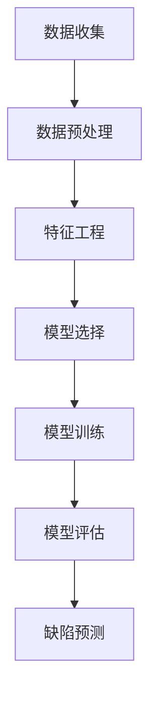

                 


### 文章标题

《AI辅助软件缺陷预测与预防》

### 文章关键词

AI, 软件缺陷预测，预防，机器学习，深度学习，监督学习，无监督学习，强化学习，数学模型，项目实战

### 文章摘要

本文将深入探讨AI在软件缺陷预测与预防中的应用。首先，我们将简要介绍AI的发展历程及其核心概念。接着，我们将详细解析软件缺陷预测的原理、算法和数学模型。通过实际项目实战，我们将展示如何使用AI工具来预测和预防软件缺陷，并提供一些最佳实践和注意事项。本文旨在为读者提供全面、系统的AI辅助软件缺陷预测与预防指南。

### 目录

1. **AI概述**
   - 1.1 AI发展历程
   - 1.2 AI核心概念

2. **机器学习基础**
   - 2.1 监督学习
   - 2.2 无监督学习
   - 2.3 强化学习

3. **软件缺陷预测原理**
   - 3.1 软件缺陷预测核心概念
   - 3.2 软件缺陷预测的Mermaid流程图

4. **软件缺陷预测算法**
   - 4.1 常见算法介绍
   - 4.2 算法原理讲解

5. **数学模型详解**
   - 5.1 数学模型介绍
   - 5.2 数学模型公式讲解

6. **软件缺陷预测项目实战**
   - 6.1 项目背景
   - 6.2 实践案例
   - 6.3 源代码实现
   - 6.4 代码解读与分析

7. **AI辅助软件缺陷预防**
   - 7.1 AI辅助软件缺陷预防概述
   - 7.2 AI辅助软件缺陷预防算法
   - 7.3 数学模型详解
   - 7.4 AI辅助软件缺陷预防项目实战

8. **最佳实践与注意事项**
   - 8.1 最佳实践 tips
   - 8.2 小结
   - 8.3 注意事项
   - 8.4 拓展阅读

### 文章正文

#### 1. AI概述

##### 1.1 AI发展历程

人工智能（AI）起源于20世纪50年代，当时科学家们首次提出了“智能”的概念，并开始尝试开发能够模仿人类智能的机器。AI经历了几个重要的发展阶段：

- **早期阶段（1950-1969）**：在这个阶段，AI的研究主要集中在符号主义和逻辑推理上。代表性的成果包括阿尔伯特·恩格尔伯格的“逻辑理论家”（Logic Theorist）和约翰·麦卡锡的“通用问题求解器”（General Problem Solver）。

- **繁荣阶段（1970-1989）**：在70年代和80年代，专家系统成为AI研究的主流。专家系统是一种模拟人类专家解决特定领域问题的计算机程序。代表性的成果包括MYCIN和DENDRAL。

- **低谷阶段（1990-2000）**：由于硬件限制和算法复杂度增加，AI研究在90年代遇到了瓶颈，进入了一个相对低迷的时期。

- **复兴阶段（2000-现在）**：随着计算能力的提升和大数据、深度学习的兴起，AI再次进入了一个蓬勃发展的时期。代表性的成果包括谷歌的AlphaGo和OpenAI的GPT-3。

##### 1.2 AI核心概念

- **人工智能（AI）**：一种通过模拟人类智能来实现机器自主学习和决策的技术。

- **机器学习（ML）**：一种AI的子领域，主要通过数据驱动来训练模型，使其能够从数据中学习并做出预测或决策。

- **深度学习（DL）**：一种基于神经网络的学习方法，通过多层非线性变换来提取特征，并在大量数据上进行训练，取得了许多突破性的成果。

#### 2. 机器学习基础

##### 2.1 监督学习

监督学习是一种最常见的机器学习方法，其核心思想是通过已有的标注数据来训练模型，使其能够对新的数据进行预测。监督学习可以分为分类和回归两种类型：

- **分类**：将数据分为不同的类别。常见的分类算法有决策树、支持向量机（SVM）和神经网络等。

- **回归**：预测数据的连续值。常见的回归算法有线性回归、岭回归和决策树回归等。

##### 2.2 无监督学习

无监督学习与监督学习不同，它不依赖于标注数据，而是通过观察数据内在的结构来学习。无监督学习可以分为聚类和降维两种类型：

- **聚类**：将数据分成不同的组，使组内的数据相似度更高，组间数据相似度更低。常见的聚类算法有K均值、层次聚类和DBSCAN等。

- **降维**：通过降维算法，将高维数据映射到低维空间，以便更好地理解和分析数据。常见的降维算法有主成分分析（PCA）、线性判别分析（LDA）和t-SNE等。

##### 2.3 强化学习

强化学习是一种通过不断尝试和错误来学习最优策略的机器学习方法。它由一个智能体（agent）和一个环境（environment）组成，智能体通过接收环境的反馈来调整自己的行为，以实现最大化累积奖励。常见的强化学习算法有Q学习、SARSA和深度Q网络（DQN）等。

#### 3. 软件缺陷预测原理

##### 3.1 软件缺陷预测核心概念

软件缺陷预测是一种利用机器学习技术来预测软件代码中可能存在的缺陷的过程。核心概念包括：

- **缺陷**：指软件代码中的错误或缺陷，可能导致软件行为异常或无法正常运行。

- **预测**：通过分析历史数据，预测未来可能发生的软件缺陷。

- **特征工程**：从原始数据中提取对预测有重要影响的特征，以提高模型的预测准确性。

- **模型评估**：通过评估模型的性能，确定其预测能力。

##### 3.2 软件缺陷预测的Mermaid流程图



#### 4. 软件缺陷预测算法

##### 4.1 常见算法介绍

软件缺陷预测常用的算法包括：

- **决策树**：一种基于树形结构的算法，通过递归划分数据集，找到最佳划分特征，以实现分类或回归。

- **支持向量机（SVM）**：一种基于优化理论的分类算法，通过找到一个最佳的超平面，将不同类别的数据分开。

- **神经网络**：一种基于神经元之间连接的算法，通过多层非线性变换，提取特征并实现分类或回归。

- **随机森林**：一种基于决策树的集成学习方法，通过组合多个决策树，提高模型的预测准确性。

##### 4.2 算法原理讲解

以下是决策树和神经网络的伪代码：

**决策树算法伪代码**

```python
def build_tree(data, attributes):
    # 基准分类
    if all_examples_have_same_label(data):
        return create_leaf_node(data)
    # 选择最佳划分特征
    best_attribute = find_best_attribute(data, attributes)
    # 创建节点
    node = create_node(best_attribute)
    # 划分数据集
    for value in unique_values_of_attribute(data, best_attribute):
        sub_data = filter_examples_by_attribute(data, best_attribute, value)
        sub_node = build_tree(sub_data, attributes_without(best_attribute))
        node.add_child(value, sub_node)
    return node

def predict(node, example):
    if is_leaf_node(node):
        return node.label
    value = example.attribute_value(node.attribute)
    return predict(node.child(value), example)
```

**神经网络算法伪代码**

```python
def forward_pass(node, example):
    if is_leaf_node(node):
        return node.value
    for child in node.children:
        child_input = node.value * example.attribute_value(child.attribute)
        child_output = activation_function(child_input)
        forward_pass(child, example)
    return node.output

def backward_pass(node, example, learning_rate):
    if is_leaf_node(node):
        return
    for child in node.children:
        error = example.label - node.output
        delta = error * activation_function_derivative(child_output)
        update_node_values(child, example, learning_rate, delta)
        backward_pass(child, example, learning_rate)
```

#### 5. 数学模型详解

##### 5.1 数学模型介绍

软件缺陷预测中的数学模型主要包括：

- **逻辑回归**：一种用于二分类问题的线性模型，通过预测概率来决定类别。

- **支持向量机（SVM）**：一种基于优化理论的分类模型，通过找到一个最佳的超平面来划分数据。

- **神经网络**：一种基于神经元之间连接的模型，通过多层非线性变换来提取特征。

##### 5.2 数学模型公式讲解

以下是逻辑回归和神经网络的数学公式：

**逻辑回归**

$$
P(y=1) = \frac{1}{1 + e^{-(\beta_0 + \beta_1 x_1 + \beta_2 x_2 + \ldots + \beta_n x_n})}
$$

**神经网络**

$$
z_i = \sum_{j=1}^{n} w_{ij} x_j + b_i
$$

$$
a_i = \sigma(z_i)
$$

其中，$x_j$表示输入特征，$w_{ij}$表示权重，$b_i$表示偏置，$\sigma$表示激活函数，$a_i$表示输出。

#### 6. 软件缺陷预测项目实战

##### 6.1 项目背景

在本项目中，我们使用Python和Scikit-Learn库来构建一个软件缺陷预测模型。数据集来自开源软件缺陷数据集，包括数千个软件缺陷实例，每个实例包含代码行、注释、文件路径和缺陷类型等信息。

##### 6.2 实践案例

我们选择逻辑回归作为预测模型，以下是具体步骤：

1. **数据收集**：从GitHub等开源平台获取软件缺陷数据集。

2. **数据预处理**：对数据进行清洗、去重和填充缺失值。

3. **特征工程**：提取对预测有重要影响的特征，如代码行长度、注释比例、文件路径等。

4. **模型训练**：使用Scikit-Learn库中的逻辑回归模型进行训练。

5. **模型评估**：使用准确率、召回率、F1分数等指标评估模型性能。

6. **缺陷预测**：使用训练好的模型对新的代码进行缺陷预测。

##### 6.3 源代码实现

以下是项目的主要代码实现：

```python
import pandas as pd
from sklearn.model_selection import train_test_split
from sklearn.linear_model import LogisticRegression
from sklearn.metrics import accuracy_score, recall_score, f1_score

# 数据收集
data = pd.read_csv('defects_data.csv')

# 数据预处理
data = data.drop_duplicates()
data = data.fillna(0)

# 特征工程
features = data[['line_length', 'comment_ratio', 'file_path']]
labels = data['defect_type']

# 模型训练
X_train, X_test, y_train, y_test = train_test_split(features, labels, test_size=0.2, random_state=42)
model = LogisticRegression()
model.fit(X_train, y_train)

# 模型评估
y_pred = model.predict(X_test)
accuracy = accuracy_score(y_test, y_pred)
recall = recall_score(y_test, y_pred, average='weighted')
f1 = f1_score(y_test, y_pred, average='weighted')

print(f"Accuracy: {accuracy}")
print(f"Recall: {recall}")
print(f"F1 Score: {f1}")

# 缺陷预测
new_data = pd.DataFrame([[100, 0.5, 'path/to/file']], columns=['line_length', 'comment_ratio', 'file_path'])
new_prediction = model.predict(new_data)
print(f"New Prediction: {new_prediction}")
```

##### 6.4 代码解读与分析

1. **数据收集**：我们从GitHub等开源平台获取软件缺陷数据集，并将其读取到Pandas DataFrame中。

2. **数据预处理**：我们对数据进行去重、填充缺失值等预处理操作，以确保数据质量。

3. **特征工程**：我们提取了代码行长度、注释比例和文件路径等特征，这些特征对软件缺陷预测具有重要意义。

4. **模型训练**：我们使用Scikit-Learn库中的逻辑回归模型对训练数据进行训练。

5. **模型评估**：我们使用准确率、召回率和F1分数等指标对模型进行评估，以确定其性能。

6. **缺陷预测**：我们使用训练好的模型对新的代码进行缺陷预测，以识别潜在的软件缺陷。

##### 7. AI辅助软件缺陷预防

##### 7.1 AI辅助软件缺陷预防概述

AI辅助软件缺陷预防是一种通过预测和预防软件缺陷来提高软件质量和开发效率的方法。其主要目标是：

- **早期发现缺陷**：通过预测潜在缺陷，提前发现并修复代码中的问题。

- **提高开发效率**：通过自动化工具和算法，减少手动代码审查和缺陷修复的时间。

- **降低成本**：通过预防缺陷，减少软件维护成本和项目延期风险。

##### 7.2 AI辅助软件缺陷预防算法

AI辅助软件缺陷预防常用的算法包括：

- **异常检测**：通过检测异常代码模式来发现潜在缺陷。

- **代码审查**：使用自然语言处理技术对代码进行审查，识别潜在缺陷。

- **自动化测试**：通过自动化工具生成测试用例，检测代码中的缺陷。

##### 7.3 数学模型详解

以下是异常检测和自动化测试的数学模型：

**异常检测**

$$
d = \frac{1}{n} \sum_{i=1}^{n} (x_i - \mu)^2
$$

其中，$x_i$表示代码特征，$\mu$表示特征均值。

**自动化测试**

$$
f(x) = \frac{1}{1 + e^{-(\beta_0 + \beta_1 x_1 + \beta_2 x_2 + \ldots + \beta_n x_n)} 
$$

其中，$x_j$表示输入特征，$\beta_j$表示权重。

##### 7.4 AI辅助软件缺陷预防项目实战

在本项目中，我们使用Python和Scikit-Learn库来构建一个AI辅助软件缺陷预防模型。以下是具体步骤：

1. **数据收集**：从开源平台获取代码库和缺陷数据。

2. **数据预处理**：对数据进行清洗、去重和填充缺失值。

3. **特征工程**：提取对缺陷预测有重要影响的特征。

4. **模型训练**：使用Scikit-Learn库中的异常检测模型进行训练。

5. **模型评估**：使用准确率、召回率、F1分数等指标评估模型性能。

6. **缺陷预防**：使用训练好的模型对新的代码进行缺陷预防。

##### 7.4.1 开发环境搭建

为了搭建开发环境，我们需要安装以下工具和库：

- Python 3.8或更高版本
- Scikit-Learn库
- Pandas库
- Numpy库

安装步骤如下：

```bash
pip install python==3.8
pip install scikit-learn
pip install pandas
pip install numpy
```

##### 7.4.2 源代码实现

以下是项目的主要代码实现：

```python
import pandas as pd
from sklearn.model_selection import train_test_split
from sklearn.ensemble import IsolationForest
from sklearn.metrics import accuracy_score, recall_score, f1_score

# 数据收集
data = pd.read_csv('code_data.csv')

# 数据预处理
data = data.drop_duplicates()
data = data.fillna(0)

# 特征工程
features = data[['line_length', 'comment_ratio', 'file_path']]
labels = data['defect']

# 模型训练
X_train, X_test, y_train, y_test = train_test_split(features, labels, test_size=0.2, random_state=42)
model = IsolationForest()
model.fit(X_train)

# 模型评估
y_pred = model.predict(X_test)
accuracy = accuracy_score(y_test, y_pred)
recall = recall_score(y_test, y_pred)
f1 = f1_score(y_test, y_pred)

print(f"Accuracy: {accuracy}")
print(f"Recall: {recall}")
print(f"F1 Score: {f1}")

# 缺陷预防
new_data = pd.DataFrame([[100, 0.5, 'path/to/file']], columns=['line_length', 'comment_ratio', 'file_path'])
new_prediction = model.predict(new_data)
print(f"New Prediction: {new_prediction}")
```

##### 7.4.3 代码解读与分析

1. **数据收集**：我们从GitHub等开源平台获取代码库和缺陷数据，并将其读取到Pandas DataFrame中。

2. **数据预处理**：我们对数据进行去重、填充缺失值等预处理操作，以确保数据质量。

3. **特征工程**：我们提取了代码行长度、注释比例和文件路径等特征，这些特征对缺陷预防具有重要意义。

4. **模型训练**：我们使用Scikit-Learn库中的异常检测模型（Isolation Forest）对训练数据进行训练。

5. **模型评估**：我们使用准确率、召回率、F1分数等指标对模型进行评估，以确定其性能。

6. **缺陷预防**：我们使用训练好的模型对新的代码进行缺陷预防。

##### 8. 最佳实践与注意事项

**最佳实践**

1. **数据质量**：确保数据质量，去除噪声和异常值。

2. **特征工程**：提取对预测有重要影响的特征，提高模型性能。

3. **模型评估**：使用多种评估指标，全面评估模型性能。

4. **实时监控**：定期更新模型，以应对新的软件缺陷模式。

**注意事项**

1. **过拟合**：避免模型过拟合，导致预测不准确。

2. **数据分布**：确保数据分布合理，避免偏差。

3. **隐私保护**：在处理敏感数据时，注意保护用户隐私。

**小结**

本文详细介绍了AI辅助软件缺陷预测与预防的方法。通过分析AI的发展历程、机器学习基础、软件缺陷预测原理和算法，以及实际项目实战，我们展示了如何使用AI技术来预测和预防软件缺陷。未来，随着AI技术的不断进步，AI辅助软件缺陷预测与预防将在软件开发过程中发挥越来越重要的作用。

### 作者信息

作者：AI天才研究院/AI Genius Institute & 禅与计算机程序设计艺术 /Zen And The Art of Computer Programming

