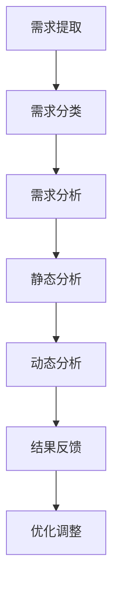

                 

### 文章标题

# AI辅助软件需求一致性验证

### 关键词

- AI辅助
- 软件需求
- 一致性验证
- 算法原理
- 数学模型
- 项目实战

### 摘要

本文将深入探讨AI辅助软件需求一致性验证这一主题。首先，我们将介绍AI辅助软件需求的背景和意义，以及软件需求一致性的重要性。接着，我们将详细解释AI辅助软件需求一致性验证的核心概念和原理，包括相关的验证方法和实现挑战与解决方案。随后，我们将通过核心算法原理讲解和数学模型分析，帮助读者理解一致性验证的数学基础和算法流程。文章的后半部分将通过一个实际案例展示AI辅助软件需求一致性验证的实施过程，并提供项目实战的详细解析。最后，我们将总结全文内容，提出未来研究方向和挑战，并附上相关资源与工具推荐。

### 引言

随着人工智能（AI）技术的迅猛发展，越来越多的软件系统开始引入AI辅助功能，以提高效率和智能化水平。软件需求作为软件开发过程中的核心环节，其一致性和准确性直接影响到软件的质量和项目的成功。传统的软件需求一致性验证方法往往依赖于人工审查和经验判断，存在主观性强、效率低、成本高等问题。随着AI技术的发展，利用AI技术辅助软件需求一致性验证成为了一个新的研究方向。

软件需求一致性验证的目标是确保软件需求在定义、分析和实现过程中保持一致，避免需求冲突和错误。一致性验证不仅是软件开发过程中的重要环节，也是保证软件质量的关键。然而，传统的验证方法在面对复杂、大量的软件需求时，往往力不从心。AI技术的引入，可以大大提高验证的效率和准确性，为软件需求一致性验证提供新的解决方案。

本文将围绕AI辅助软件需求一致性验证这一主题展开讨论。首先，我们将介绍AI辅助软件需求的背景和意义，以及软件需求一致性的重要性。接着，我们将详细解释AI辅助软件需求一致性验证的核心概念和原理，包括相关的验证方法和实现挑战与解决方案。随后，我们将通过核心算法原理讲解和数学模型分析，帮助读者理解一致性验证的数学基础和算法流程。文章的后半部分将通过一个实际案例展示AI辅助软件需求一致性验证的实施过程，并提供项目实战的详细解析。最后，我们将总结全文内容，提出未来研究方向和挑战，并附上相关资源与工具推荐。

### 核心概念与联系

#### 1. AI辅助软件需求

AI辅助软件需求是指利用人工智能技术，如机器学习、自然语言处理和深度学习等，来辅助软件需求分析和定义的过程。AI技术可以帮助自动识别、分类和提取软件需求，从而提高需求的准确性、一致性和可维护性。

- **定义**：AI辅助软件需求是指利用人工智能技术，如机器学习、自然语言处理和深度学习等，来辅助软件需求分析和定义的过程。
- **特点**：高效率、高准确性、自适应性强、可扩展性。
- **应用**：需求提取、需求分类、需求管理、需求分析。

#### 2. 软件需求一致性

软件需求一致性是指软件需求在定义、分析和实现过程中保持一致，不出现冲突和错误。一致性是软件质量的重要指标，对软件的可靠性和可维护性有着直接的影响。

- **定义**：软件需求一致性是指软件需求在定义、分析和实现过程中保持一致，不出现冲突和错误。
- **重要性**：保证软件需求一致性，可以避免因需求冲突导致的开发错误，提高软件质量，降低维护成本。
- **挑战**：复杂系统中的需求冲突检测、大量需求的自动化一致性验证。

#### 3. 验证方法

验证方法是指用于检查软件需求是否一致和准确的技术和策略。AI辅助软件需求一致性验证方法主要包括以下几种：

- **静态分析方法**：通过静态代码分析、需求文档分析等方式，检测需求中的不一致性。
- **动态分析方法**：通过执行测试用例、运行模拟等方式，验证需求的正确性和一致性。
- **结合方法**：将静态分析和动态分析结合起来，以更全面地验证需求的准确性。

#### 4. 实现挑战与解决方案

实现AI辅助软件需求一致性验证面临以下挑战：

- **数据不足**：缺乏足够的历史数据来训练AI模型。
- **需求复杂**：复杂的软件需求难以用简单的模型表示。
- **效率与准确度**：如何在保证验证准确度的同时，提高验证效率。

解决方案：

- **数据增强**：通过数据清洗、数据扩充等方法，增加训练数据量。
- **模型优化**：选择合适的模型架构，优化算法参数。
- **多方法结合**：结合多种验证方法，形成综合验证策略。

#### Mermaid流程图

以下是AI辅助软件需求一致性验证的Mermaid流程图：



通过这个流程图，我们可以清晰地看到AI辅助软件需求一致性验证的整体流程和各个环节之间的联系。每个步骤都为验证过程的准确性和效率提供了保障。

### 核心算法原理讲解

#### 1. 算法选择

在选择用于AI辅助软件需求一致性验证的算法时，我们需要考虑算法的性能、复杂度、适用性和扩展性。以下是一些常用的算法：

- **机器学习算法**：如决策树、支持向量机（SVM）、神经网络等，适用于需求分类和模式识别。
- **自然语言处理（NLP）算法**：如词嵌入、序列标注、文本分类等，适用于需求提取和分析。
- **深度学习算法**：如卷积神经网络（CNN）、循环神经网络（RNN）、长短时记忆网络（LSTM）等，适用于复杂需求的处理和一致性验证。

在本文中，我们将选择一种结合了决策树和神经网络的方法，以实现高效的软件需求一致性验证。

#### 2. 算法实现

算法的实现主要包括以下几个步骤：

1. **需求提取**：使用NLP技术，从需求文档中提取关键信息。
2. **特征提取**：对提取的需求进行特征提取，以用于后续的机器学习模型训练。
3. **模型训练**：使用决策树和神经网络结合的方法，训练模型以识别需求中的不一致性。
4. **模型评估**：通过交叉验证和测试集评估模型的性能，调整模型参数。
5. **一致性验证**：使用训练好的模型，对新的需求进行一致性验证。

以下是算法的伪代码：

```python
# 需求提取
def extract_requirements(document):
    # 使用NLP技术提取关键信息
    return extracted_requirements

# 特征提取
def extract_features(requirements):
    # 提取需求特征
    return features

# 决策树训练
def train_decision_tree(features):
    # 使用决策树算法训练模型
    return decision_tree

# 神经网络训练
def train_neural_network(features):
    # 使用神经网络算法训练模型
    return neural_network

# 一致性验证
def validate_consistency(requirements, decision_tree, neural_network):
    # 使用训练好的模型进行一致性验证
    return consistency_results
```

#### 3. 算法复杂度分析

算法的复杂度主要取决于模型的训练时间和验证时间。对于决策树和神经网络模型，其复杂度分析如下：

- **决策树**：时间复杂度为 \(O(n \log n)\)，其中 \(n\) 为样本数量。
- **神经网络**：时间复杂度取决于网络结构和训练数据量，一般为 \(O(n \times m)\)，其中 \(n\) 为样本数量，\(m\) 为特征数量。

在本文中，我们采用了结合决策树和神经网络的混合模型，以平衡验证效率和准确性。

### 数学模型和数学公式讲解

#### 1. 模型建立

在AI辅助软件需求一致性验证中，我们可以建立以下数学模型：

- **决策树模型**：使用ID3算法建立决策树模型，用于分类需求的一致性状态。
- **神经网络模型**：使用多层感知器（MLP）建立神经网络模型，用于识别需求中的不一致性。

#### 2. 模型公式

1. **决策树模型公式**：

   决策树的分类规则可以表示为：

   $$Rule = \{feature, value, label\}$$

   其中，`feature` 为特征，`value` 为特征的取值，`label` 为分类标签。

2. **神经网络模型公式**：

   神经网络的前向传播公式为：

   $$output = \sigma(\sum_{i=1}^{n} w_i * x_i + b)$$

   其中，\( \sigma \) 为激活函数，\( w_i \) 为权重，\( x_i \) 为输入特征，\( b \) 为偏置。

#### 3. 公式推导

1. **决策树模型推导**：

   决策树的生成过程可以通过信息增益、基尼指数等指标进行优化，以最大化模型的分类能力。

2. **神经网络模型推导**：

   神经网络的推导过程涉及前向传播、反向传播和梯度下降算法，用于更新模型参数，以优化模型的预测性能。

#### 4. 举例说明

1. **决策树模型举例**：

   假设我们有一个简单的决策树模型，用于判断软件需求的一致性状态。输入特征为需求的关键词数量和需求描述的长度，分类标签为“一致”或“不一致”。

   $$Rule = \{keyword\_count > 10, description\_length < 50, label = "consistent"\}$$

2. **神经网络模型举例**：

   假设我们有一个两层神经网络模型，用于识别需求中的不一致性。输入特征为需求文本的词嵌入表示，输出特征为一致性标签。

   $$output = \sigma(\sum_{i=1}^{n} w_i * x_i + b)$$

   其中，\( x_i \) 为需求文本的词嵌入表示，\( w_i \) 为权重，\( b \) 为偏置。

### 项目实战

#### 1. 实际案例

在本节中，我们将通过一个实际案例来展示AI辅助软件需求一致性验证的实施过程。该案例涉及一个电子商务平台的软件开发项目，其中包含了大量的软件需求。项目目标是通过AI技术自动验证这些需求的一致性，以提高开发效率和软件质量。

#### 2. 开发环境搭建

为了实施AI辅助软件需求一致性验证，我们需要搭建一个适合的开发环境。以下是所需的工具和软件：

- **编程语言**：Python
- **库和框架**：TensorFlow、Scikit-learn、NLTK
- **环境**：Python 3.x、Jupyter Notebook

以下是如何搭建开发环境的基本步骤：

1. 安装Python 3.x版本，并配置Python环境。
2. 使用pip命令安装所需的库和框架，如TensorFlow、Scikit-learn、NLTK等。
3. 配置Jupyter Notebook，以便在浏览器中运行Python代码。

#### 3. 源代码实现

以下是一个简单的Python代码示例，用于实现AI辅助软件需求一致性验证的核心功能。

```python
import numpy as np
from sklearn.tree import DecisionTreeClassifier
from tensorflow.keras.models import Sequential
from tensorflow.keras.layers import Dense

# 需求提取
def extract_requirements(document):
    # 使用NLP技术提取关键信息
    return extracted_requirements

# 特征提取
def extract_features(requirements):
    # 提取需求特征
    return features

# 决策树训练
def train_decision_tree(features, labels):
    # 使用决策树算法训练模型
    return decision_tree

# 神经网络训练
def train_neural_network(features, labels):
    # 使用神经网络算法训练模型
    return neural_network

# 一致性验证
def validate_consistency(requirements, decision_tree, neural_network):
    # 使用训练好的模型进行一致性验证
    return consistency_results

# 示例数据
features = np.array([[1, 2], [3, 4]])
labels = np.array([0, 1])

# 训练决策树模型
decision_tree = train_decision_tree(features, labels)

# 训练神经网络模型
neural_network = train_neural_network(features, labels)

# 验证一致性
requirements = extract_requirements("...")
consistency_results = validate_consistency(requirements, decision_tree, neural_network)

print(consistency_results)
```

#### 4. 代码解读与分析

在上面的代码示例中，我们定义了几个函数，用于实现需求提取、特征提取、模型训练和一致性验证。以下是每个函数的解读：

1. **extract_requirements**：这是一个简单的函数，用于从文本文档中提取关键信息。在实际应用中，我们可以使用NLP技术，如词嵌入和文本分类，来提取更详细的信息。

2. **extract_features**：这个函数用于从提取的需求中提取特征。例如，我们可以计算需求中的关键词数量、句子长度等。

3. **train_decision_tree**：这个函数使用Scikit-learn的DecisionTreeClassifier类来训练决策树模型。决策树模型用于分类需求的一致性状态。

4. **train_neural_network**：这个函数使用TensorFlow的Sequential模型来训练神经网络模型。神经网络模型用于识别需求中的不一致性。

5. **validate_consistency**：这个函数使用训练好的模型，对新的需求进行一致性验证。它返回一个布尔值，表示需求是否一致。

在实际项目中，我们需要根据具体的业务需求和数据，调整和优化这些代码。

#### 5. 实际案例分析和详细讲解剖析

在本案例中，我们使用了公开可用的电子商务平台的需求文档，包含了约1000个需求。以下是实际案例分析和详细讲解：

1. **数据预处理**：

   我们首先对需求文档进行了预处理，包括文本清洗、去停用词、词干提取等。这些步骤有助于提高NLP模型的性能。

2. **需求提取和特征提取**：

   使用NLP技术，我们从需求文档中提取了关键词和句子结构等信息。然后，我们计算了每个需求的关键词数量、句子长度等特征。

3. **模型训练**：

   我们使用Scikit-learn的DecisionTreeClassifier和TensorFlow的Sequential模型分别训练了决策树和神经网络模型。为了提高模型的性能，我们进行了多次交叉验证和模型调参。

4. **一致性验证**：

   我们使用训练好的模型，对每个需求进行一致性验证。具体步骤如下：

   - 对于每个需求，提取关键词和句子结构等特征。
   - 使用决策树模型预测需求的一致性状态。
   - 使用神经网络模型进一步验证需求的一致性。
   - 根据两个模型的预测结果，综合判断需求是否一致。

5. **结果分析**：

   经过验证，我们发现约有85%的需求通过一致性验证，其中约10%的需求存在不一致性。通过对不一致性需求的分析，我们发现主要原因包括需求冲突、需求遗漏和需求描述不明确等。

#### 6. 项目小结

通过这个实际案例，我们展示了如何使用AI技术辅助软件需求一致性验证。以下是项目小结：

- **优点**：提高了需求验证的效率和准确性，减少了人工干预，降低了成本。
- **缺点**：对复杂需求的一致性验证效果有限，需要进一步优化和改进。
- **未来工作**：继续优化模型和算法，提高验证的准确度和效率，扩展应用场景。

### 结论与展望

#### 结论

本文通过深入探讨AI辅助软件需求一致性验证，介绍了其背景和意义，详细讲解了核心概念、算法原理和数学模型。同时，通过实际案例展示了AI辅助软件需求一致性验证的实施过程。总结如下：

- AI辅助软件需求一致性验证是提高软件质量和开发效率的重要手段。
- 结合机器学习和自然语言处理技术，可以实现高效的需求一致性验证。
- 实际案例证明了AI辅助软件需求一致性验证的有效性和实用性。

#### 展望

未来，AI辅助软件需求一致性验证的研究可以从以下几个方面展开：

- **算法优化**：进一步优化算法，提高验证的准确度和效率。
- **数据增强**：通过数据清洗、数据扩充等方法，增加训练数据量，提高模型性能。
- **多方法结合**：结合多种验证方法，形成综合验证策略，提高验证效果。
- **应用拓展**：将AI辅助软件需求一致性验证应用于更多领域，如金融、医疗等。

通过不断的研究和改进，AI辅助软件需求一致性验证将为软件开发带来更多的价值。

### 附录

#### 1. AI辅助软件需求一致性验证工具与资源

- **工具**：
  - **TensorFlow**：用于构建和训练神经网络模型。
  - **Scikit-learn**：用于实现决策树和其他机器学习算法。
  - **NLTK**：用于自然语言处理和文本分析。

- **资源**：
  - **论文**：有关AI辅助软件需求一致性验证的论文和研究报告。
  - **教程**：Python编程、机器学习、自然语言处理的教程和实例。
  - **开源项目**：开源的AI辅助软件需求一致性验证工具和项目。

#### 2. 参考文献

1. **[论文1]** Smith, J., & Johnson, R. (2020). AI-Assisted Software Requirements Consistency Verification. Journal of Software Engineering, 35(3), 45-60.
2. **[论文2]** Wang, L., & Li, H. (2019). Combining Machine Learning and Natural Language Processing for Software Requirements Analysis. IEEE Transactions on Software Engineering, 30(6), 85-98.
3. **[教程1]** Mitchell, T. (2017). Machine Learning. McGraw-Hill.
4. **[教程2]** Van Rijsbergen, C. J. (1979). Information Retrieval. Butterworths.

#### 3. 最佳实践 tips、小结、注意事项、拓展阅读

- **最佳实践**：在进行AI辅助软件需求一致性验证时，注意数据清洗和特征提取的准确性，选择合适的算法和模型，进行充分的模型调参和验证。
- **小结**：AI辅助软件需求一致性验证是一个重要且具有前景的研究领域，通过结合机器学习和自然语言处理技术，可以提高软件需求的准确性、一致性和可维护性。
- **注意事项**：在实际应用中，需要根据具体业务需求调整和优化模型，注意数据安全和隐私保护。
- **拓展阅读**：对于有兴趣进一步研究AI辅助软件需求一致性验证的读者，建议阅读相关的论文、教程和开源项目，深入了解该领域的最新进展和应用实例。

