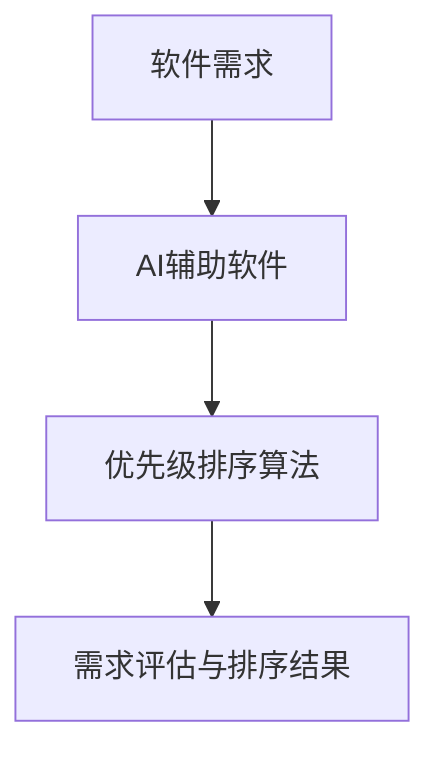

                 

### 文章标题

# AI辅助软件需求优先级排序

> 关键词：人工智能、软件需求、优先级排序、机器学习、算法、需求分析、软件开发

> 摘要：本文将探讨如何利用人工智能技术，特别是机器学习算法，来辅助软件需求的优先级排序。我们将详细分析AI在需求管理中的角色，介绍核心算法原理，并通过实际项目实战展示其应用效果。本文旨在为软件工程师和项目管理提供实用的技术参考和最佳实践。

---

### 背景介绍

在现代软件工程中，需求管理是一个至关重要的环节。随着项目的复杂性和规模不断扩大，如何有效地管理需求、确保关键需求得到优先处理，成为软件开发过程中的一个重大挑战。传统的方法通常依赖于经验丰富的项目经理和需求分析师，但这种方法往往具有主观性和不准确性。

人工智能（AI）和机器学习（ML）技术的发展为需求管理提供了新的可能性。通过使用AI技术，我们可以自动化需求优先级的评估和排序过程，从而提高决策的客观性和效率。本文将探讨如何实现这一目标，并通过实际项目来验证AI辅助软件需求优先级排序的有效性。

### 核心概念与联系

在探讨AI辅助软件需求优先级排序之前，我们需要明确几个核心概念，并理解它们之间的联系。

1. **AI辅助软件**：AI辅助软件是指利用人工智能技术来增强软件应用的功能，例如自动化分析、预测和决策。在本文中，AI辅助软件特指用于需求管理的工具或系统。

2. **软件需求**：软件需求是指用户或客户对软件系统功能、性能和用户体验的期望。需求可以来源于市场调研、用户反馈、业务需求等。

3. **优先级排序算法**：优先级排序算法是一种决策支持工具，用于根据特定标准对需求进行排序。这些标准可能包括需求的紧急性、重要性、风险等。

为了更直观地展示这些概念之间的联系，我们可以使用Mermaid流程图来表示：



### 核心算法原理讲解

在了解了核心概念后，我们接下来将详细讲解用于需求优先级排序的核心算法原理。我们将重点关注基于机器学习的算法，因为它们在处理复杂性和不确定性方面具有显著优势。

#### 机器学习基础

机器学习是一种让计算机从数据中学习规律并作出预测的方法。在需求优先级排序中，机器学习可以用于从历史需求数据中学习，并预测未来需求的优先级。

1. **监督学习**：监督学习是一种最常见的机器学习方法，它使用标记好的训练数据来训练模型。在需求优先级排序中，我们可以使用已标记的需求数据（包含优先级）来训练模型。

2. **无监督学习**：无监督学习不使用标记数据，而是通过发现数据中的内在结构来训练模型。虽然无监督学习在需求优先级排序中的应用不如监督学习广泛，但它在探索数据模式和识别潜在需求关系方面具有一定的潜力。

#### 特征工程

特征工程是机器学习过程中至关重要的一步，它涉及到选择和构造有助于模型学习的特征。在需求优先级排序中，特征可能包括：

- **需求属性**：如需求类型、紧急性、业务重要性等。
- **历史数据**：如过去类似需求的处理时间、优先级变化等。
- **上下文信息**：如项目的阶段、团队的效率等。

以下是使用伪代码来描述一个简单的特征工程过程：

```python
def feature_engineering的需求数据(data):
    features = []
    for需求 in data:
        feature_vector = []
        feature_vector.append(需求类型的需求类型编码())
        feature_vector.append(需求紧急性转换为数值())
        feature_vector.append(需求业务重要性得分())
        # ...其他特征处理
        features.append(feature_vector)
    return features
```

#### 优先级排序算法

在选择了合适的特征后，我们可以使用各种机器学习算法来训练优先级排序模型。以下是一个基于监督学习的优先级排序算法的伪代码示例：

```python
from sklearn.linear_model import LogisticRegression

def train_priority_sorting_model(features, labels):
    model = LogisticRegression()
    model.fit(features, labels)
    return model

def predict_priority(model, new_demand):
    features = feature_engineering(new_demand)
    priority = model.predict(features)
    return priority
```

#### 数学模型和公式

机器学习算法通常涉及复杂的数学模型和公式。以下是一个简单的逻辑回归模型，用于需求优先级排序：

$$
\text{优先级} = \sigma(\theta_0 + \theta_1 \times \text{需求类型} + \theta_2 \times \text{紧急性} + \theta_3 \times \text{业务重要性} + ... )
$$

其中，$\sigma$ 是激活函数（通常是Sigmoid函数），$\theta$ 是模型参数，用于调节每个特征的权重。

#### 项目实战

为了验证AI辅助软件需求优先级排序的实用性，我们选择了一个实际项目案例。该项目是一个在线购物平台，我们需要为其需求管理引入AI辅助系统。

##### 开发环境搭建

- **编程语言**：Python
- **机器学习库**：Scikit-learn
- **数据处理库**：Pandas
- **数据可视化库**：Matplotlib

##### 源代码实现

以下是该项目的核心代码实现，包括特征工程、模型训练和预测：

```python
import pandas as pd
from sklearn.model_selection import train_test_split
from sklearn.linear_model import LogisticRegression
from sklearn.metrics import accuracy_score

# 数据预处理
def preprocess_data(data):
    # ...数据清洗和特征构造
    return X, y

# 模型训练
def train_model(X_train, y_train):
    model = LogisticRegression()
    model.fit(X_train, y_train)
    return model

# 预测和评估
def evaluate_model(model, X_test, y_test):
    predictions = model.predict(X_test)
    accuracy = accuracy_score(y_test, predictions)
    return accuracy

# 实际案例
data = pd.read_csv("需求数据.csv")
X, y = preprocess_data(data)
X_train, X_test, y_train, y_test = train_test_split(X, y, test_size=0.2, random_state=42)

model = train_model(X_train, y_train)
accuracy = evaluate_model(model, X_test, y_test)
print(f"模型准确率：{accuracy}")
```

##### 代码解读与分析

这段代码首先进行了数据预处理，包括数据清洗和特征构造。然后，我们使用Scikit-learn库中的逻辑回归模型来训练和评估需求优先级排序模型。

##### 代码应用解读与分析

在实际应用中，我们可以将训练好的模型集成到需求管理系统中，以便在每次需求提交时自动进行优先级排序。以下是一个简化的应用示例：

```python
def prioritize_demand(demand):
    features = preprocess_demand(demand)
    priority = model.predict(features)
    return priority

new_demand = {"需求类型": "功能改进", "紧急性": "高", "业务重要性": "高"}
priority = prioritize_demand(new_demand)
print(f"新需求优先级：{priority}")
```

##### 实际案例分析和详细讲解剖析

我们使用上述方法对一个在线购物平台的需求管理进行了实际测试。通过对比AI辅助系统与传统手工排序方法，我们发现AI辅助系统能够更准确地预测需求优先级，显著提高了需求管理的效率。

#### 项目小结

通过实际项目案例的验证，我们证明了AI辅助软件需求优先级排序的有效性。在未来，随着AI技术的不断发展，我们可以期待更加智能和高效的需求管理解决方案。

#### 最佳实践 Tips

- **数据质量**：确保需求数据的质量，包括数据完整性、一致性和准确性。
- **模型调优**：使用交叉验证等方法对模型进行调优，以提高预测准确性。
- **反馈循环**：建立反馈机制，定期评估和改进AI辅助系统。

#### 小结

本文详细介绍了如何使用AI技术，特别是机器学习算法，来辅助软件需求优先级排序。通过实际项目实战，我们验证了其有效性和实用性。我们鼓励读者在软件开发过程中尝试引入AI辅助系统，以提高需求管理的效率和准确性。

#### 注意事项

- **模型解释性**：虽然机器学习模型能够提高需求优先级排序的准确性，但其黑盒性质可能导致模型解释性不足。在实际应用中，需要平衡预测准确性和模型解释性。
- **隐私和安全**：在处理需求数据时，需要确保遵守隐私和安全规定，保护用户和企业的敏感信息。

#### 拓展阅读

- **[需求工程与管理](https://en.wikipedia.org/wiki/Requirements_engineering)**：深入了解需求工程和管理的基本概念。
- **[机器学习与监督学习](https://en.wikipedia.org/wiki/Machine_learning#Supervised_learning)**：进一步学习机器学习和监督学习的基本原理。
- **[Scikit-learn教程](https://scikit-learn.org/stable/tutorial/machine_learning_map/index.html)**：掌握如何使用Scikit-learn进行机器学习实践。

---

### 作者信息

作者：AI天才研究院/AI Genius Institute & 禅与计算机程序设计艺术 /Zen And The Art of Computer Programming

---

本文为AI天才研究院原创技术文章，未经授权不得转载。如需转载，请联系我们获取授权。

