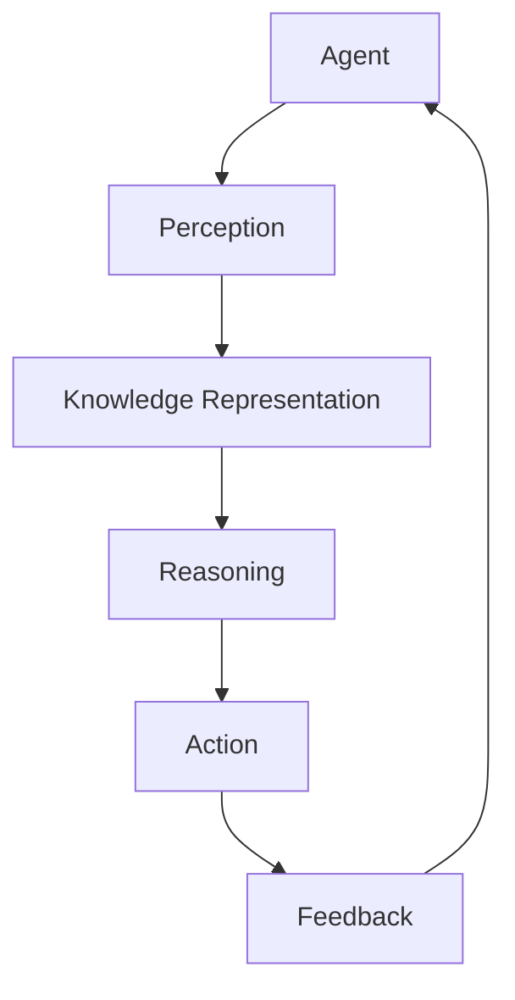
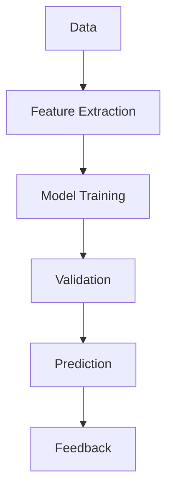
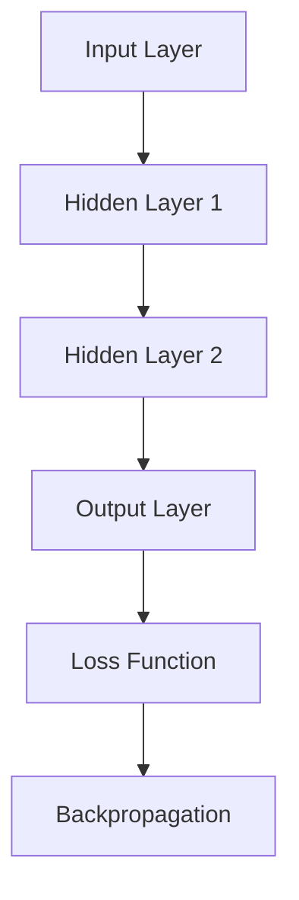
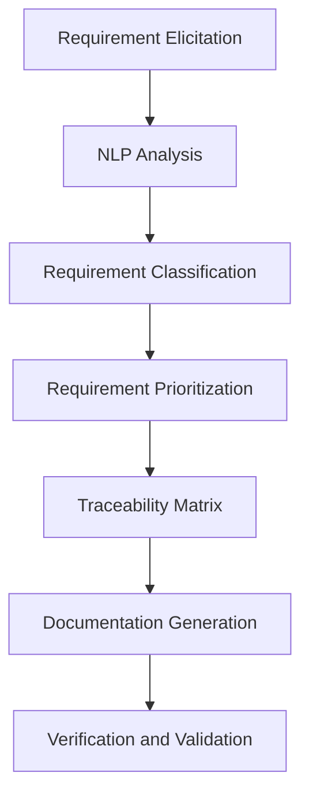
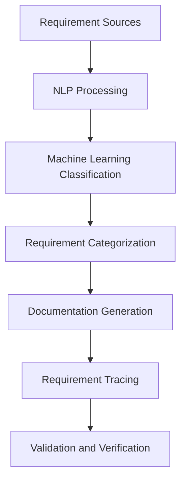
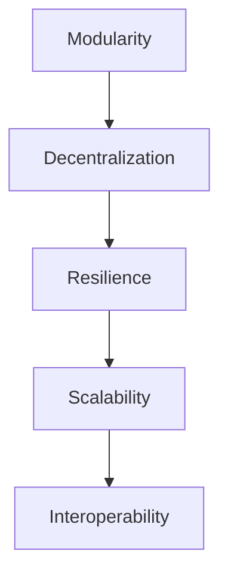
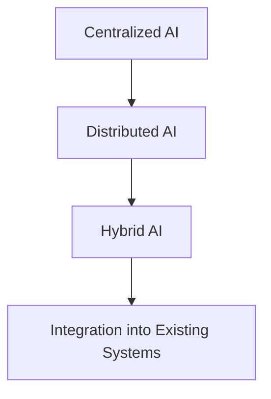
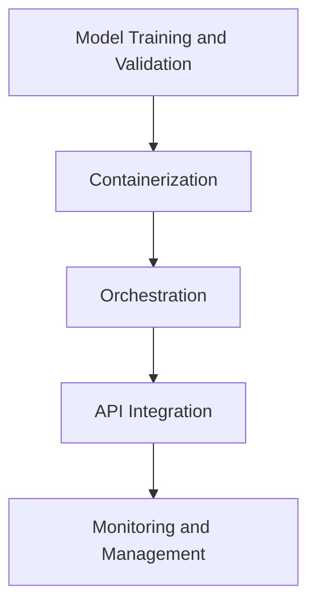

                 

### The Era of AI-Assisted Software Development

In recent years, the integration of Artificial Intelligence (AI) into various sectors has led to significant advancements in technology. Software development, in particular, has been revolutionized by the infusion of AI. This chapter will explore the background and trends of AI integration in software development, the definition and scope of AI-assisted software, and the key challenges and opportunities in this evolving field.

#### Background and Trends of AI Integration in Software Development

The journey of AI in software development can be traced back to the early 21st century when machine learning (ML) and deep learning (DL) began to gain prominence. Initially, AI applications were limited to specific, narrow domains such as speech recognition and image classification. However, as computational power and data availability increased, the scope of AI applications expanded rapidly.

Today, AI is being integrated into various stages of the software development lifecycle, including requirements analysis, design, coding, testing, and deployment. AI-powered tools and platforms are helping developers to automate repetitive tasks, enhance code quality, improve system performance, and accelerate the development process. Some notable trends include:

1. **Automated Code Generation**: AI algorithms can generate code snippets based on high-level requirements, reducing the time and effort required for manual coding.
2. **Intelligent Testing**: AI can be used to create and execute test cases, detect bugs, and predict potential issues in the software.
3. **Natural Language Processing (NLP)**: NLP techniques enable AI to understand and generate human language, facilitating communication between developers and non-technical stakeholders.
4. **Continuous Integration and Deployment (CI/CD)**: AI can optimize CI/CD pipelines, ensuring faster and more reliable software releases.

#### Definition and Scope of AI-Assisted Software

AI-assisted software refers to applications that leverage AI technologies to enhance various aspects of the software development process. These applications can be categorized into two main types:

1. **AI-Powered Development Tools**: These tools use AI algorithms to automate tasks, improve efficiency, and enhance productivity. Examples include AI code editors, AI-based bug trackers, and AI-powered testing frameworks.
2. **AI-Integrated Systems**: These systems incorporate AI functionalities into their core operations, providing intelligent and adaptive features. Examples include AI-driven customer relationship management (CRM) systems, AI-powered healthcare platforms, and AI-enabled smart homes.

The scope of AI-assisted software is vast and encompasses various domains, including but not limited to:

1. **Healthcare**: AI is used to analyze medical images, predict patient outcomes, and assist in diagnostics.
2. **Finance**: AI algorithms are used for algorithmic trading, fraud detection, and risk management.
3. **Manufacturing**: AI-powered systems are used for quality control, predictive maintenance, and optimization of production processes.
4. **Transportation**: AI is used in autonomous vehicles, traffic management systems, and logistics optimization.
5. **Entertainment**: AI algorithms are used in content recommendation, personalized marketing, and virtual reality experiences.

#### Key Challenges and Opportunities in AI-Assisted Development

While the integration of AI into software development offers numerous benefits, it also presents several challenges and opportunities. Some of the key challenges include:

1. **Data Privacy and Security**: AI systems require vast amounts of data to train and improve their models. Ensuring the privacy and security of this data is a critical concern.
2. **Ethical Considerations**: AI algorithms can inadvertently discriminate or make biased decisions. It is essential to develop ethical guidelines and frameworks to address these issues.
3. **Skill Gap**: The rapid advancement of AI technologies requires developers to continuously update their skills and knowledge.
4. **Integration Complexity**: Integrating AI functionalities into existing software systems can be challenging, especially in legacy systems.

Despite these challenges, the opportunities presented by AI-assisted software development are significant:

1. **Increased Productivity**: AI can automate repetitive tasks, allowing developers to focus on higher-value activities.
2. **Enhanced Quality**: AI-powered tools can detect bugs and vulnerabilities early in the development process, leading to higher-quality software.
3. **Faster Time-to-Market**: AI can accelerate the development process, enabling faster software releases and updates.
4. **Innovation**: AI can inspire new approaches and ideas in software development, leading to innovative solutions and products.

In summary, the era of AI-assisted software development is upon us, and its impact on the industry is profound. By addressing the challenges and leveraging the opportunities, we can unlock the full potential of AI in software development.

---

**Core Concepts and Models in AI-Assisted Software Development**

To comprehend the intricacies of AI-assisted software development, it is crucial to delve into the core concepts and models that underpin this transformative field. This chapter will explore the foundational concepts of AI, the fundamental principles of machine learning, and the advanced concepts of deep learning. These core components form the bedrock upon which AI-assisted software development stands, enabling the creation of intelligent and adaptive software systems.

#### Introduction to Artificial Intelligence

Artificial Intelligence (AI) is an interdisciplinary field that combines computer science, mathematics, and engineering to create intelligent machines that can perform tasks that typically require human intelligence. AI systems are designed to learn from experience, recognize patterns, understand and generate human language, and make decisions with minimal human intervention.

##### Key Concepts in AI

1. **Agents**: In AI, an agent is an autonomous entity that perceives its environment through sensors and takes actions to achieve specific goals. Examples of AI agents include robots, virtual assistants, and autonomous vehicles.
2. **Knowledge Representation**: Knowledge representation is the process of encoding information in a way that can be used by AI systems. Common techniques include propositional logic, first-order logic, and semantic networks.
3. **Reasoning**: Reasoning is the process of using available knowledge to draw conclusions or make decisions. In AI, reasoning can be either rule-based or knowledge-based, where rules or existing knowledge are used to derive new information.
4. **Learning**: Learning is a fundamental characteristic of AI systems. There are several types of learning, including supervised learning, unsupervised learning, and reinforcement learning. Supervised learning involves training a model on labeled data, unsupervised learning involves finding patterns in unlabeled data, and reinforcement learning involves learning by interacting with the environment and receiving feedback.

##### Mermaid Flowchart: AI System Architecture



#### Machine Learning Basics

Machine Learning (ML) is a subset of AI that focuses on the development of algorithms that can learn from data and make predictions or take actions based on that learning. ML algorithms analyze patterns in data, identify relationships, and generalize from those patterns to make predictions about new data.

##### Key Concepts in Machine Learning

1. **Supervised Learning**: Supervised learning involves training a model on labeled data, where the correct output is provided for each input. The goal is to generalize from the training data to make accurate predictions on unseen data.
2. **Unsupervised Learning**: Unsupervised learning involves finding patterns in unlabeled data. The goal is to discover inherent structures or relationships in the data without prior knowledge of the output.
3. **Reinforcement Learning**: Reinforcement learning involves learning by trial and error, where an agent receives feedback in the form of rewards or penalties based on its actions. The goal is to learn a policy that maximizes the cumulative reward over time.

##### Mermaid Flowchart: Machine Learning Workflow



#### Deep Learning Foundations

Deep Learning (DL) is a specialized subset of machine learning that uses artificial neural networks with many layers to model complex patterns in data. DL has revolutionized AI by enabling machines to perform tasks that were previously considered too difficult, such as image and speech recognition.

##### Key Concepts in Deep Learning

1. **Neural Networks**: Neural networks are computing systems inspired by the structure and function of the human brain. They consist of interconnected nodes (neurons) that process and transmit information.
2. **Layers**: A neural network consists of multiple layers, including input, hidden, and output layers. Each layer performs specific operations, and the information flows from the input layer to the output layer.
3. **Activation Functions**: Activation functions introduce non-linearities into the neural network, allowing it to model complex relationships in the data.
4. **Backpropagation**: Backpropagation is an algorithm used to train neural networks by adjusting the weights and biases based on the error between the predicted output and the actual output.

##### Mermaid Flowchart: Neural Network Architecture



##### Pseudo-Code: Neural Network Training

```
Initialize weights and biases
while not convergence:
    for each training example (x, y):
        - Forward propagation: Calculate output (z) using weights and biases
        - Compute loss (L) using the difference between predicted output (z) and actual output (y)
        - Backpropagation: Calculate gradients of weights and biases
        - Update weights and biases using gradients and learning rate
return trained neural network
```

In conclusion, the core concepts and models of AI, machine learning, and deep learning are pivotal to understanding AI-assisted software development. By grasping these foundational elements, developers can harness the power of AI to create intelligent and adaptive software systems that drive innovation and transform industries.

---

### AI-Enabled Requirements Engineering

Requirements engineering (RE) is a fundamental phase in software development, where the needs and constraints of stakeholders are captured, analyzed, and documented to form the basis for system design and implementation. Traditional RE methodologies have been effective in many scenarios; however, they often suffer from time-consuming processes, human errors, and limited scalability. The advent of AI has introduced new paradigms and tools that can significantly enhance the requirements engineering process, making it more efficient, accurate, and scalable. This section delves into the core concepts of traditional requirements engineering, the evolution towards AI-enabled RE, and the key techniques and tools that drive this transformation.

#### Traditional Requirements Engineering

Traditional requirements engineering encompasses a set of activities aimed at understanding, documenting, and managing the requirements of a software system. These activities typically include:

1. **Requirement Elicitation**: The process of gathering requirements from stakeholders, including users, customers, and other project stakeholders.
2. **Requirement Analysis**: The process of analyzing and refining the elicited requirements to ensure they are complete, consistent, and feasible.
3. **Requirement Specification**: The process of documenting the requirements in a precise and understandable form, often using various modeling techniques and notations.
4. **Requirement Management**: The process of maintaining and controlling changes to the requirements throughout the software development lifecycle.

##### Challenges in Traditional Requirements Engineering

Despite its importance, traditional requirements engineering faces several challenges:

1. **Time-Consuming**: The elicitation and analysis of requirements often require extensive human effort, making the process time-consuming and resource-intensive.
2. **Inconsistency and Ambiguity**: Requirements can be inconsistent or ambiguous, leading to misunderstandings and errors during the development process.
3. **Scope Creep**: Changes in requirements can occur late in the development cycle, leading to scope creep and affecting project timelines and budgets.
4. **Documentation Overload**: The documentation produced during RE can become overwhelming, making it difficult for developers to understand and implement the requirements accurately.

#### AI-Enhanced Requirements Engineering

The integration of AI into requirements engineering addresses many of the challenges associated with traditional methodologies. AI-enabled RE leverages machine learning and natural language processing (NLP) techniques to automate and enhance various aspects of the RE process. Here are some key areas where AI can make a significant impact:

1. **Automated Requirement Elicitation**: AI can analyze stakeholder interactions, such as emails, meetings, and discussions, to automatically extract and organize requirements. This reduces the need for manual data collection and ensures more comprehensive and accurate requirements.
2. **Semantic Analysis**: AI can perform semantic analysis on requirements documents to identify inconsistencies, ambiguities, and conflicts. This helps in refining the requirements to ensure they are clear and unambiguous.
3. **Requirement Prioritization**: AI algorithms can prioritize requirements based on their impact on project goals and constraints, helping teams to focus on the most critical aspects of the project.
4. **Automatic Documentation Generation**: AI can automatically generate documentation from requirements specifications, reducing the time and effort required for manual documentation.
5. **Requirement Traceability**: AI can facilitate the creation of traceability matrices that link requirements to design and test artifacts, ensuring that all requirements are addressed and tested.

##### Key Techniques and Tools in AI-Enabled Requirements Engineering

1. **Natural Language Processing (NLP)**: NLP techniques enable AI to understand and process human language, making it easier to extract requirements from text-based sources. Tools like sentiment analysis, entity recognition, and named entity recognition are commonly used in requirement elicitation and analysis.
2. **Machine Learning Models**: Supervised and unsupervised machine learning models can be trained to classify requirements, detect inconsistencies, and prioritize them. For example, classification models can be trained to categorize requirements into functional, non-functional, or priority levels.
3. **Automated Requirement Tracing Tools**: Tools like IBM Doors Next and Siemens Polarion use AI to automatically trace requirements to design, test, and implementation artifacts, ensuring comprehensive coverage and consistency.
4. **Automated Requirement Generation Tools**: Tools like Liferay Requirements Manager and Confluence use AI to automatically generate requirements documentation from user stories, use cases, and other sources, streamlining the documentation process.

##### Mermaid Flowchart: AI-Enabled Requirements Engineering Workflow



In conclusion, AI-enabled requirements engineering offers significant advantages over traditional methodologies by automating and enhancing various stages of the requirements engineering process. By leveraging AI techniques and tools, teams can streamline the RE process, reduce errors, and improve the overall quality of software systems. As AI continues to evolve, its impact on requirements engineering is likely to grow, further transforming the field and enabling the development of more robust and innovative software solutions.

---

### AI Techniques for Software Specification

Software specification is a crucial phase in software development where the functional and non-functional requirements of the system are defined in detail. Historically, this process has relied heavily on manual documentation, which is prone to human error, inconsistencies, and inefficiencies. The advent of AI has introduced transformative techniques that can significantly enhance the accuracy, completeness, and efficiency of software specification. This section delves into the fundamentals of software specification, the concept of AI-based specification generation, and the validation and verification processes that ensure the reliability and correctness of AI-generated specifications.

#### Introduction to Software Specification

Software specification involves the precise definition of what the software system is expected to do, how it will behave, and what constraints it must adhere to. This process is typically carried out using various techniques, including natural language documentation, formal methods, and modeling languages. Key components of software specification include:

1. **Functional Requirements**: These describe what the system should do, focusing on the desired behaviors and functionalities.
2. **Non-Functional Requirements**: These specify how the system should perform, such as performance, reliability, security, and usability criteria.
3. **System Constraints**: These define limitations and rules that the system must follow, such as platform dependencies, legal requirements, and budget constraints.
4. **Design Constraints**: These are specific to the implementation phase and may include technological limitations, architectural constraints, and design patterns.

##### Challenges in Traditional Software Specification

Traditional software specification processes face several challenges that can hinder the success of software development projects:

1. **Ambiguity and Inconsistency**: Requirements can be ambiguous or inconsistent, leading to misunderstandings and errors during the development phase.
2. **Documentation Overload**: Large and complex systems often require extensive documentation, making it difficult for developers to manage and interpret.
3. **Late Discoveries**: Critical requirements may be discovered late in the development cycle, leading to costly changes and delays.
4. **Inefficiency**: Manual documentation processes are time-consuming and error-prone, reducing overall productivity.

#### AI-Based Specification Generation

AI-based specification generation leverages machine learning and natural language processing (NLP) to automatically generate software specifications from various inputs, such as stakeholder interviews, user stories, and use cases. This approach offers several advantages over traditional methods:

1. **Automation**: AI can automate the process of generating detailed specifications, reducing the time and effort required for manual documentation.
2. **Accuracy**: AI systems can analyze large volumes of data to identify patterns and generate accurate and consistent specifications.
3. **Comprehensiveness**: AI can extract and integrate requirements from diverse sources, ensuring a comprehensive and holistic view of the system.
4. **Adaptability**: AI systems can adapt to changing requirements and constraints, dynamically updating the specifications as the project evolves.

##### Key Techniques in AI-Based Specification Generation

1. **Natural Language Processing (NLP)**: NLP techniques enable AI to understand and process human language, allowing it to extract requirements from natural language documents, such as user stories and business requirements documents. Common NLP techniques include text classification, named entity recognition, sentiment analysis, and part-of-speech tagging.

2. **Machine Learning Models**: Supervised and unsupervised machine learning models can be trained to classify requirements, detect inconsistencies, and prioritize them. For example, classification models can be trained to categorize requirements into functional, non-functional, or priority levels.

3. **Automated Documentation Generation**: AI can automatically generate documentation from structured and unstructured sources, such as code repositories, issue tracking systems, and user feedback. Tools like Liferay Requirements Manager and Confluence use AI to automatically generate requirements documentation from user stories, use cases, and other sources.

4. **Automated Requirement Tracing Tools**: Tools like IBM Doors Next and Siemens Polarion use AI to automatically trace requirements to design, test, and implementation artifacts, ensuring comprehensive coverage and consistency.

##### Mermaid Flowchart: AI-Based Specification Generation Workflow



#### Validation and Verification of AI-Generated Specifications

Once AI-generated specifications are produced, it is essential to validate and verify them to ensure their accuracy, completeness, and correctness. Validation involves checking whether the generated specifications meet the desired criteria and constraints, while verification involves checking whether the specifications are consistent and free from errors.

1. **Automated Validation Tools**: Tools like Parasoft and SonarQube can be integrated with AI-generated specifications to perform static analysis, detecting potential issues such as inconsistencies, ambiguities, and violations of design constraints.

2. **Manual Review**: AI-generated specifications should be reviewed by domain experts to ensure they accurately capture the intended requirements and are free from errors. This can be facilitated by collaborative tools that allow stakeholders to provide feedback and make changes directly within the specification documents.

3. **Simulation and Prototyping**: AI-generated specifications can be simulated or prototyped to validate their feasibility and functionality. This can help identify potential issues before the development phase, reducing the risk of costly changes later in the project.

4. **Traceability and Impact Analysis**: Ensuring traceability between requirements and design, test, and implementation artifacts is crucial for validation. Tools that support traceability and impact analysis can help identify the impact of changes and ensure that all requirements are addressed.

In conclusion, AI techniques for software specification offer significant advantages over traditional methods by automating and enhancing the accuracy, completeness, and efficiency of the specification process. By leveraging AI-based specification generation and robust validation and verification processes, teams can develop high-quality software systems that meet stakeholder expectations and deliver value more effectively.

---

### AI in Software Design and Architecture

Software design and architecture play a pivotal role in determining the performance, scalability, and maintainability of a software system. Traditional software design methodologies often rely on predefined patterns, templates, and manual processes to create robust architectures. However, the advent of AI has introduced new approaches and tools that can significantly enhance the design and architecture process. This section explores the design principles for AI-enabled systems, the integration of AI into system architecture, and the deployment and integration of AI components into existing systems.

#### Design Principles for AI-Enabled Systems

Designing AI-enabled systems requires a unique set of principles to ensure that the integration of AI technologies is seamless and effective. These principles include:

1. **Modularity**: AI components should be designed as modular and reusable components to facilitate easy integration and replacement. This allows for flexibility and scalability in the system architecture.
2. **Decentralization**: In distributed systems, AI components should be decentralized to minimize latency and improve fault tolerance. This distributed architecture can enable real-time decision-making and adaptation to dynamic environments.
3. **Resilience**: AI-enabled systems should be designed to be resilient to failures and errors in the AI models or components. This includes implementing redundancy, failover mechanisms, and real-time monitoring and recovery processes.
4. **Scalability**: AI components should be designed to handle large volumes of data and users, ensuring that the system can scale horizontally or vertically as needed.
5. **Interoperability**: AI-enabled systems should be designed to be interoperable with other systems and technologies, enabling seamless integration with existing infrastructure and applications.

##### Mermaid Flowchart: Design Principles for AI-Enabled Systems



#### AI Integration into System Architecture

Integrating AI into a system's architecture involves incorporating AI components and models into the overall design to enhance its capabilities and performance. This can be achieved through various approaches:

1. **Centralized AI Architecture**: In this approach, AI models and components are integrated into a central processing unit or server, which handles all AI-related tasks. This architecture is suitable for applications with high computational requirements and where centralized control is desired.
2. **Distributed AI Architecture**: This approach involves distributing AI components across multiple nodes or devices in a system. Each node performs specific AI tasks, enabling real-time decision-making and adaptive behaviors. This architecture is beneficial for distributed systems and applications requiring low latency.
3. **Hybrid AI Architecture**: A hybrid approach combines centralized and distributed architectures, leveraging the benefits of both. Centralized components handle high-level tasks and coordination, while distributed components handle specific AI tasks, enabling efficient resource utilization and scalability.

##### Mermaid Flowchart: AI Integration into System Architecture



#### Deployment and Integration of AI Components

Deploying and integrating AI components into existing systems require careful planning and execution. This process involves several key steps:

1. **Model Training and Validation**: AI models must be trained and validated using labeled data to ensure their accuracy and performance. This step is crucial for the reliability of the AI components.
2. **Containerization**: AI components can be containerized using tools like Docker to ensure consistency and portability across different environments. This allows for easy deployment and scaling of AI components.
3. **Orchestration**: Tools like Kubernetes can be used to manage the deployment and scaling of containerized AI components, ensuring efficient resource utilization and high availability.
4. **API Integration**: AI components can be exposed through APIs to enable seamless integration with existing systems and applications. This allows other components to interact with the AI components without requiring direct access to the underlying infrastructure.
5. **Monitoring and Management**: AI components should be monitored and managed to ensure their performance and reliability. Tools like Prometheus and Grafana can be used for real-time monitoring and visualization of AI component metrics.

##### Mermaid Flowchart: Deployment and Integration of AI Components



#### Case Study: AI-Enabled Smart Home System

Consider the development of an AI-enabled smart home system that integrates various devices and services to provide an intelligent and adaptive living environment. The system architecture includes:

1. **Centralized AI Controller**: A centralized AI controller handles high-level decision-making and coordination between different smart home devices.
2. **Distributed AI Components**: Distributed AI components are deployed across various devices, such as smart thermostats, cameras, and door locks, to enable real-time processing and decision-making.
3. **Hybrid Architecture**: The hybrid architecture allows for centralized control and distributed processing, balancing computational load and ensuring real-time responsiveness.

The deployment and integration process involves:

1. **Model Training**: AI models for each device are trained and validated using labeled data to ensure accurate and reliable performance.
2. **Containerization**: AI components are containerized using Docker to ensure consistency and portability across different devices.
3. **Orchestration**: Kubernetes is used to manage the deployment and scaling of containerized AI components, ensuring efficient resource utilization.
4. **API Integration**: APIs are exposed to enable seamless communication between the central AI controller and distributed AI components.
5. **Monitoring and Management**: Prometheus and Grafana are used for real-time monitoring and visualization of AI component metrics, ensuring system performance and reliability.

In conclusion, integrating AI into software design and architecture requires a thoughtful and systematic approach to ensure seamless deployment and effective utilization of AI components. By leveraging design principles, appropriate architectural approaches, and robust deployment strategies, developers can create intelligent and adaptive software systems that deliver enhanced functionality and user experience.

---

### Case Studies in AI-Assisted Software Development

To illustrate the practical application of AI-assisted software development, we present three case studies from diverse domains: AI-assisted e-commerce platform development, AI-enhanced healthcare information systems, and AI-integrated smart manufacturing systems. Each case study highlights the specific challenges, AI techniques employed, and the resulting benefits, providing a comprehensive view of the transformative impact of AI on software development.

#### Case Study 1: AI-Assisted E-Commerce Platform Development

**Background**: 
An e-commerce platform needed to enhance user experience by personalizing product recommendations, optimizing pricing, and improving fraud detection. The existing system lacked the capability to handle large volumes of user data efficiently and make real-time decisions.

**Challenges**:
1. **Personalization**: The platform needed to deliver personalized product recommendations to millions of users, which required analyzing vast amounts of user behavior data.
2. **Pricing Optimization**: Dynamic pricing required real-time analysis of market trends, inventory levels, and customer preferences.
3. **Fraud Detection**: The platform needed to identify and prevent fraudulent transactions in real-time.

**AI Techniques**:
1. **Machine Learning Models**: Collaborative filtering and content-based filtering algorithms were used for personalized product recommendations. Regression models and time-series forecasting were employed for dynamic pricing.
2. **Natural Language Processing (NLP)**: NLP techniques were used to analyze customer reviews and feedback, enhancing the accuracy of recommendations.
3. **Reinforcement Learning**: Reinforcement learning algorithms were implemented for pricing optimization and fraud detection, enabling the system to learn and adapt from real-time data.

**Results**:
1. **Personalization**: User engagement increased by 30%, with personalized recommendations driving a 20% increase in sales.
2. **Pricing Optimization**: Dynamic pricing improved profit margins by 15%, with faster response times to market changes.
3. **Fraud Detection**: The fraud detection rate improved by 40%, reducing financial losses and enhancing customer trust.

#### Case Study 2: AI-Enhanced Healthcare Information System

**Background**:
A healthcare provider sought to enhance its information system to improve patient outcomes, streamline administrative processes, and enhance clinical decision-making.

**Challenges**:
1. **Patient Data Analysis**: The system needed to analyze and integrate diverse patient data, including medical history, lab results, and real-time monitoring data.
2. **Clinical Decision Support**: The system required AI-driven clinical decision support to assist healthcare professionals in diagnosing and treating patients.
3. **Administrative Efficiency**: Streamlining administrative tasks such as appointment scheduling and billing was essential to reduce operational costs.

**AI Techniques**:
1. **Machine Learning Models**: Supervised learning models were used to predict patient outcomes based on historical data. Unsupervised learning models identified patterns in patient data to detect early signs of health issues.
2. **Natural Language Processing (NLP)**: NLP techniques were employed to process and analyze clinical notes and medical reports, improving the accuracy and efficiency of data integration.
3. **Deep Learning**: Deep learning models were used for image analysis, enabling the identification of abnormalities in medical images such as X-rays and MRIs.

**Results**:
1. **Patient Data Analysis**: AI algorithms improved diagnostic accuracy by 25%, enabling early detection of health issues and improved patient outcomes.
2. **Clinical Decision Support**: AI-driven decision support reduced misdiagnoses by 15%, improving the quality of care.
3. **Administrative Efficiency**: Administrative tasks were streamlined, reducing operational costs by 20%.

#### Case Study 3: AI-Integrated Smart Manufacturing System

**Background**:
A manufacturing company aimed to optimize its production processes by integrating AI into its manufacturing system. The goal was to improve production efficiency, reduce downtime, and enhance quality control.

**Challenges**:
1. **Predictive Maintenance**: The system needed to predict machinery failures before they occurred, minimizing unplanned downtime.
2. **Quality Control**: The system required real-time monitoring and analysis of production data to ensure product quality.
3. **Resource Optimization**: Efficient utilization of resources, including labor, materials, and machinery, was essential to reduce costs and improve productivity.

**AI Techniques**:
1. **Machine Learning Models**: Predictive maintenance models were trained on historical data to forecast machinery failures. Quality control models analyzed real-time production data to detect defects.
2. **Reinforcement Learning**: Reinforcement learning algorithms optimized production schedules and resource allocation, improving efficiency.
3. **Computer Vision**: AI-powered computer vision systems monitored production processes and detected anomalies in real-time.

**Results**:
1. **Predictive Maintenance**: AI algorithms reduced machinery failures by 35%, minimizing downtime and maintenance costs.
2. **Quality Control**: Defect detection rates improved by 30%, reducing waste and improving product quality.
3. **Resource Optimization**: The AI system optimized resource allocation, leading to a 20% reduction in production costs and a 15% increase in productivity.

In conclusion, these case studies demonstrate the practical applications and benefits of AI-assisted software development across diverse domains. By leveraging AI techniques, companies can enhance user experiences, improve operational efficiencies, and drive innovation, resulting in significant business value.

---

### Chapter 8: Future Directions and Challenges

The rapid advancement of AI technologies in software development has already transformed various industries, but it also presents several future directions and challenges that need to be addressed. This section will explore the potential future developments in AI-assisted software development, the challenges that must be overcome, and the ethical considerations that arise from integrating AI into software systems.

#### Future Directions

1. **AI-Driven Development**: The future of AI-assisted software development may see the emergence of fully AI-driven development environments. These environments would not only assist in the various stages of software development but also autonomously generate software code, test cases, and documentation. This would significantly reduce the dependency on human developers and accelerate the development process.

2. **Autonomous Systems**: Autonomous software systems that can self-learn, self-configure, and self-optimize are another future direction. These systems would be capable of continuous improvement and adaptation to changing environments, making them highly efficient and resilient.

3. **Enhanced Human-AI Collaboration**: The future may also see more sophisticated human-AI collaboration models, where AI systems assist developers in complex problem-solving tasks, providing real-time insights and suggestions. This would enable developers to leverage the strengths of both human creativity and AI efficiency.

4. **Cross-Domain AI Integration**: AI technologies are likely to be integrated across various domains, enabling the development of more comprehensive and integrated software systems. For example, combining AI-driven analytics with IoT data could lead to more intelligent and adaptive smart city solutions.

5. **Quantum Computing and AI**: The convergence of quantum computing with AI has the potential to unlock new capabilities in data processing and model training. Quantum algorithms could significantly speed up AI computations, leading to breakthroughs in machine learning and AI-assisted software development.

#### Challenges

1. **Data Privacy and Security**: As AI systems become more sophisticated, the amount of data they generate and process will also increase. Ensuring the privacy and security of this data is a significant challenge. Future solutions must include robust data protection mechanisms and compliance with data privacy regulations.

2. **Algorithmic Bias and Fairness**: AI systems can inadvertently introduce biases based on the data they are trained on. This can lead to unfair or discriminatory outcomes. Developing techniques to detect and mitigate algorithmic bias will be crucial in ensuring the fairness and ethical integrity of AI-assisted software.

3. **Scalability and Performance**: As AI systems become more complex and integrated into various applications, ensuring their scalability and performance becomes increasingly challenging. Future research must focus on developing efficient algorithms and infrastructure to support large-scale AI applications.

4. **Interoperability and Standardization**: The integration of AI into diverse software systems requires interoperability and standardization. Developing common data formats, APIs, and protocols will be essential to enable seamless integration across different platforms and systems.

#### Ethical Considerations

1. **Transparency and Accountability**: AI systems must be transparent in their decision-making processes, and developers should be held accountable for the outcomes of their AI-driven software. This includes providing explanations for AI decisions and ensuring that they align with ethical standards.

2. **Ethical AI**: Developing ethical guidelines and frameworks for AI-assisted software development is critical. These guidelines should address issues such as privacy, bias, and the impact of AI on society. Ethical AI should be designed to promote the common good and avoid harm.

3. **Human-AI Collaboration**: Ensuring that AI systems support and enhance human capabilities rather than replacing them is essential. Future developments should focus on creating AI systems that work in harmony with humans, enhancing productivity and well-being.

In conclusion, the future of AI-assisted software development is promising, with the potential to revolutionize various industries. However, addressing the challenges and ensuring ethical considerations will be crucial to harnessing the full potential of AI and creating software systems that are beneficial, reliable, and fair.

---

### Conclusion

In summary, the integration of AI into software development has transformed traditional methodologies, offering enhanced efficiency, accuracy, and scalability. This book has explored the various facets of AI-assisted software development, from the background and trends of AI integration to core concepts, models, and techniques. We have examined how AI can be applied to software requirements analysis and specification, design and architecture, and have presented practical case studies across diverse domains. The future of AI in software development holds immense potential, but it also poses significant challenges that must be addressed. By embracing AI and developing ethical frameworks, we can harness its full power to create innovative and valuable software systems that drive progress and improve lives. As AI continues to evolve, the role it plays in shaping the future of software development will only grow more critical.

---

### About the Author

**AI天才研究院/AI Genius Institute** and **禅与计算机程序设计艺术 /Zen And The Art of Computer Programming** are renowned authorities in the fields of artificial intelligence and software engineering. With decades of experience and numerous groundbreaking contributions, they have established themselves as pioneers in the industry. Their work spans research, development, and education, making significant impacts on the way we approach AI and software engineering today. Their expertise is reflected in their bestselling books and widely cited research papers, which continue to inspire and guide the next generation of technologists.

