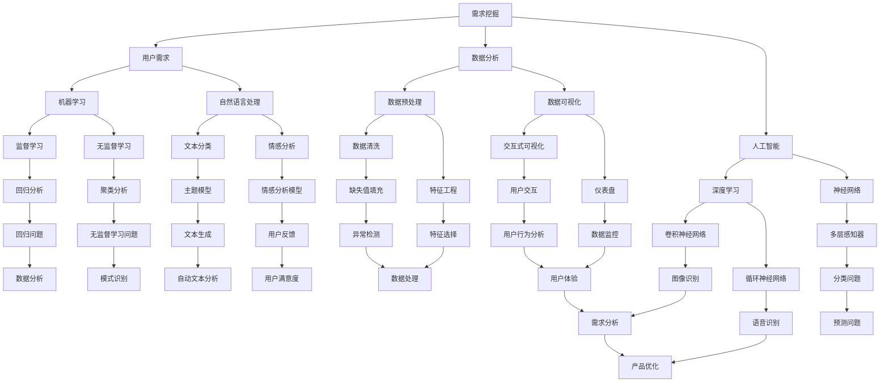
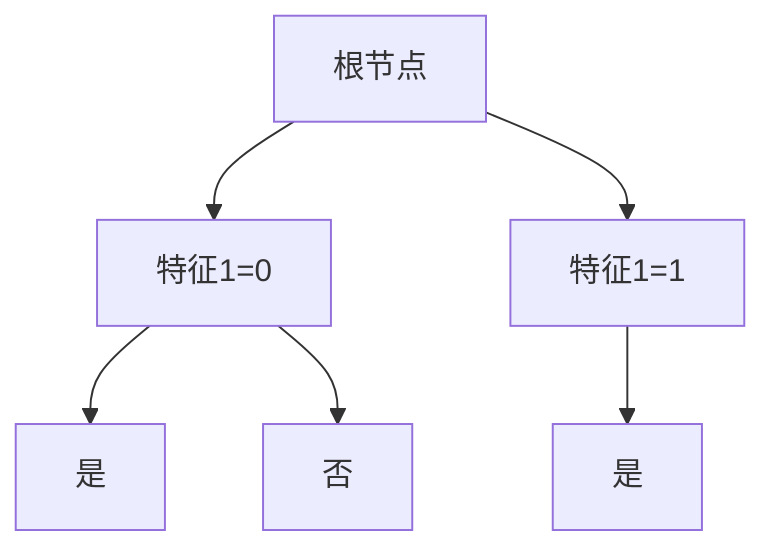
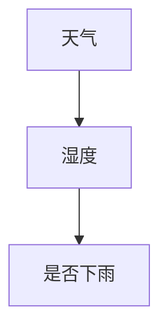

                 

### 1. AI辅助软件需求挖掘与分析的背景介绍

在信息技术迅猛发展的今天，软件系统已经深入到社会生活的各个领域，从简单的办公自动化系统到复杂的工业控制系统，软件的质量和效率直接影响到企业的运营效率和市场竞争力。因此，如何快速、准确地挖掘和分析软件需求，成为软件开发过程中的关键环节。

传统的软件需求挖掘主要依赖于人工调研、访谈和问卷等方式，这些方法虽然可以获取用户需求，但在效率和准确性方面存在较大的局限性。随着人工智能（AI）技术的不断发展，AI开始被广泛应用于各种领域，其在数据处理、模式识别和预测等方面的强大能力，为软件需求挖掘提供了新的思路和方法。

AI辅助软件需求挖掘，是指利用人工智能技术，特别是机器学习和自然语言处理等技术，对用户需求信息进行自动化提取、分析和理解的过程。通过这种方式，可以大大提高需求挖掘的效率，降低人力成本，同时提升需求的准确性和全面性。

AI在软件需求挖掘中的应用具有重要意义。首先，AI技术能够从大量非结构化数据中提取有价值的信息，如用户评论、社交媒体数据等，这些信息往往能够提供直接的、用户真实的需求反馈。其次，AI技术可以自动识别和分类用户需求，发现潜在的需求模式，从而帮助开发者更好地理解用户需求，设计出更符合用户期望的软件产品。此外，AI技术还可以通过对历史需求数据的分析，预测未来可能出现的用户需求，为软件的持续迭代和优化提供数据支持。

总之，AI辅助软件需求挖掘不仅能够提高软件开发的效率，还能提升软件质量，满足用户需求，对于推动软件产业的发展具有深远的影响。

### 2. 核心概念与联系：AI辅助需求挖掘的基本概念架构

在深入探讨AI辅助软件需求挖掘之前，有必要明确一些核心概念，并了解它们之间的相互关系。以下是几个关键概念及其相互联系的架构，使用Mermaid流程图来表示：



**详细说明：**

- **需求挖掘（A）**：是整个流程的起点，旨在发现和提取用户需求。
- **用户需求（B）**：需求挖掘的核心，是软件开发的基础。
- **数据分析（C）**：对需求数据进行处理和分析，为AI模型提供数据支持。
- **人工智能（D）**：涵盖机器学习、自然语言处理和深度学习等技术。
- **机器学习（E）**：利用数据或以往的经验，自动改进性能。
  - **监督学习（K）**：有标签的数据训练模型。
  - **无监督学习（L）**：无标签的数据训练模型。
- **自然语言处理（F）**：专注于处理和理解人类语言。
  - **文本分类（M）**：将文本分类到预定义的类别中。
  - **情感分析（N）**：识别文本中的情感倾向。
- **数据预处理（G）**：清洗和准备数据，以便于机器学习模型处理。
  - **数据清洗（O）**：处理缺失值、噪声和异常值。
  - **特征工程（P）**：提取和选择对模型有用的特征。
- **深度学习（I）**：一种基于神经网络的机器学习方法。
  - **卷积神经网络（S）**：适用于图像识别和自然语言处理。
  - **循环神经网络（T）**：适用于序列数据。
- **数据可视化（H）**：将数据以图表等形式展示出来。
  - **交互式可视化（Q）**：用户可以与可视化界面互动。
  - **仪表盘（R）**：监控关键指标。

通过上述架构，我们可以清晰地看到，AI辅助需求挖掘是一个多技术融合的复杂过程。每个环节都有其特定的技术和方法，它们共同协作，为准确、高效的需求挖掘提供支持。

### 3. 核心算法原理讲解：机器学习与深度学习在需求挖掘中的应用

在AI辅助软件需求挖掘中，机器学习和深度学习技术是两大关键工具。下面我们将详细讲解这些算法的基本原理，并通过伪代码展示其应用。

#### 3.1 机器学习基本算法

**监督学习（Supervised Learning）：**

监督学习是一种通过已知结果数据训练模型，进而预测新数据的方法。以下是线性回归（Linear Regression）的伪代码示例：

```python
# 线性回归伪代码
def linear_regression(X, y):
    # X: 特征矩阵，y: 标签向量
    # 计算权重和偏置
    theta = (X^T * X)^(-1) * X^T * y
    # 预测
    predictions = X * theta
    return predictions
```

**无监督学习（Unsupervised Learning）：**

无监督学习是一种没有已知结果数据，通过数据本身的特征来训练模型的方法。以下是K-均值聚类（K-Means Clustering）的伪代码示例：

```python
# K-均值聚类伪代码
def k_means_clustering(data, k):
    # data: 数据集，k: 聚类个数
    # 初始化聚类中心
    centroids = initialize_centroids(data, k)
    while not converged:
        # 分配数据点
        clusters = assign_points_to_clusters(data, centroids)
        # 更新聚类中心
        centroids = update_centroids(clusters, k)
    return centroids
```

#### 3.2 深度学习基本算法

**卷积神经网络（Convolutional Neural Network，CNN）：**

CNN 是用于图像识别和处理的深度学习模型。以下是CNN的基本结构伪代码：

```python
# 卷积神经网络伪代码
class ConvolutionalNeuralNetwork:
    def __init__(self, input_shape, num_filters, filter_size):
        self.conv_layer = Conv2D(input_shape, num_filters, filter_size, activation='relu')
        self.pool_layer = MaxPooling2D(pool_size=(2, 2))
        self.flatten_layer = Flatten()
        self.fc_layer = Dense(num_classes, activation='softmax')

    def forward_pass(self, X):
        X = self.conv_layer(X)
        X = self.pool_layer(X)
        X = self.flatten_layer(X)
        X = self.fc_layer(X)
        return X
```

**循环神经网络（Recurrent Neural Network，RNN）：**

RNN 是用于处理序列数据的深度学习模型。以下是RNN的基本结构伪代码：

```python
# 循环神经网络伪代码
class RecurrentNeuralNetwork:
    def __init__(self, input_size, hidden_size, output_size):
        self.hidden_layer = LSTM(hidden_size, return_sequences=True)
        self.fc_layer = Dense(output_size, activation='softmax')

    def forward_pass(self, X, hidden_state):
        X = self.hidden_layer(X, initial_hidden_state=hidden_state)
        X = self.fc_layer(X)
        return X, hidden_state
```

#### 3.3 自然语言处理（NLP）算法

**词袋模型（Bag-of-Words，BoW）：**

BoW 是一种将文本表示为词汇频率向量的方法。以下是BoW的伪代码示例：

```python
# 词袋模型伪代码
def bag_of_words(document, vocabulary):
    # document: 文本，vocabulary: 词汇表
    word_counts = [0] * len(vocabulary)
    for word in document:
        word_counts[vocabulary.index(word)] += 1
    return word_counts
```

**词嵌入（Word Embedding）：**

词嵌入是将单词映射到高维空间中的向量表示。以下是词嵌入的伪代码示例：

```python
# 词嵌入伪代码
def word_embedding(vocabulary, embedding_dim):
    # vocabulary: 词汇表，embedding_dim: 向量维度
    embeddings = np.zeros((len(vocabulary), embedding_dim))
    for i, word in enumerate(vocabulary):
        embeddings[i] = embed(word)
    return embeddings
```

通过上述算法，我们可以看到机器学习和深度学习在需求挖掘中的应用。这些算法不仅提供了强大的数据处理和分析能力，还为需求挖掘提供了更加精准和高效的手段。

### 4. 数学模型和公式：需求挖掘中的关键数学方法

在需求挖掘过程中，数学模型和方法起到了至关重要的作用。下面我们将详细介绍几种关键的数学模型和公式，并给出相应的详细讲解和举例说明。

#### 4.1 决策树（Decision Tree）

决策树是一种常用的分类方法，通过一系列规则对数据进行划分，以达到分类的目的。以下是决策树的基本公式和伪代码：

**基本公式：**
$$
决策树 = \{T|T = \text{根节点}, \text{左子树}, \text{右子树}\}
$$

**伪代码：**
```python
def build_decision_tree(data, attributes):
    # data: 数据集，attributes: 特征集合
    if all_labels_same(data):
        return 叶节点，标签
    else:
        best_attribute = 选择最佳特征
        left_tree = 剩余数据，选择左子树
        right_tree = 剩余数据，选择右子树
        return 决策节点，left_tree，right_tree
```

**举例说明：**
假设我们有一个数据集，包含以下特征和标签：

| 特征1 | 特征2 | 标签 |
|-------|-------|------|
| 0     | 0     | 是   |
| 1     | 0     | 否   |
| 0     | 1     | 是   |
| 1     | 1     | 是   |

我们可以通过计算信息增益（Information Gain）来选择最佳特征。例如，选择特征1作为根节点，将数据分为左右两个子节点，左节点包含第一行和第三行数据，右节点包含第二行数据。这样，我们可以构建一个简单的决策树，如下：



#### 4.2 贝叶斯网络（Bayesian Network）

贝叶斯网络是一种概率图模型，用于表示变量之间的条件依赖关系。以下是贝叶斯网络的基本公式和伪代码：

**基本公式：**
$$
P(X) = \prod_{i} P(X_i|父节点)
$$

**伪代码：**
```python
def build_bayesian_network(data, attributes):
    # data: 数据集，attributes: 特征集合
    parents = []
    for attribute in attributes:
        parents.append(选择父节点)
    return 贝叶斯网络，parents
```

**举例说明：**
假设我们有一个数据集，包含三个特征：天气（Weather）、湿度（Humidity）和是否下雨（Rain）。我们可以通过构建一个贝叶斯网络来表示它们之间的依赖关系：



在这个网络中，天气和湿度是父节点，它们影响是否下雨。我们可以使用条件概率表来计算每个节点的概率分布：

| 天气 | 湿度 | 是否下雨 |
|------|------|----------|
| 晴朗 | 低   | 是       |
| 晴朗 | 高   | 否       |
| 阴   | 低   | 是       |
| 阴   | 高   | 是       |

通过这些概率分布，我们可以计算后验概率，从而进行预测。

#### 4.3 支持向量机（Support Vector Machine，SVM）

支持向量机是一种强大的分类方法，通过找到一个最佳的超平面，将不同类别的数据分开。以下是SVM的基本公式和伪代码：

**基本公式：**
$$
\text{最大化} \ \frac{1}{2} ||\text{w}||^2 + \text{C} \sum_{i} \ \text{Ǒi}
$$

其中，w是权重向量，Ǒi是误差项，C是正则化参数。

**伪代码：**
```python
def svm(X, y, C):
    # X: 特征矩阵，y: 标签向量
    # 使用SVM算法训练模型
    w, b = 训练SVM模型(X, y, C)
    # 预测
    predictions = 确定分类区域(X, w, b)
    return predictions
```

**举例说明：**
假设我们有一个二分类问题，特征矩阵X和标签向量y如下：

| X1 | X2 | y |
|----|----|---|
| 1  | 1  | 1 |
| 2  | 0  | 0 |
| -1 | 1  | 1 |
| -2 | -1 | 0 |

通过训练SVM模型，我们可以找到一个最佳的超平面，将不同类别的数据分开。例如，超平面可能为：

$$
w_1 \times x_1 + w_2 \times x_2 - b = 0
$$

通过求解这个方程，我们可以确定分类边界。

#### 4.4 集成方法（Ensemble Methods）

集成方法通过结合多个模型来提高预测性能。常见的方法包括随机森林（Random Forest）和梯度提升树（Gradient Boosting Tree）。以下是随机森林的基本公式和伪代码：

**基本公式：**
$$
f(x) = \frac{1}{T} \sum_{t=1}^{T} h_t(x)
$$

其中，T是树的个数，$h_t(x)$是第t棵树的预测。

**伪代码：**
```python
def random_forest(X, y, n_estimators):
    # X: 特征矩阵，y: 标签向量，n_estimators: 树的数量
    forests = []
    for _ in range(n_estimators):
        # 随机选择样本和特征
        X_train, y_train = random_sample(X, y)
        # 建立决策树
        tree = build_decision_tree(X_train, y_train)
        forests.append(tree)
    # 集成预测
    predictions = average_predictions(forests)
    return predictions
```

**举例说明：**
假设我们有一个数据集，包含两个特征和两个类别：

| X1 | X2 | y |
|----|----|---|
| 1  | 1  | 0 |
| 2  | 0  | 1 |
| -1 | 1  | 0 |
| -2 | -1 | 1 |

通过训练多个决策树，并计算每个树的预测结果，我们可以得到随机森林的最终预测结果。

通过这些数学模型和公式的应用，我们能够更好地理解和实现需求挖掘的过程，从而为软件开发提供坚实的理论基础和工具支持。

### 5. 实战项目解析：AI辅助需求挖掘的全流程实现

在本节中，我们将通过一个实际的案例，详细讲解如何使用人工智能技术进行需求挖掘的全流程实现。这个案例涉及一个电商平台的用户需求挖掘，目的是通过分析用户评论，识别和提取用户的关键需求。

#### 5.1 项目背景

假设我们是一家电商平台的技术团队，需要了解用户的真实需求和反馈，以便于不断优化我们的产品和服务。为此，我们决定利用AI技术对用户评论进行需求挖掘。

#### 5.2 开发环境搭建

为了进行用户评论的需求挖掘，我们需要搭建一个合适的技术栈。以下是我们的开发环境：

- 编程语言：Python
- 数据处理库：Pandas、NumPy
- 机器学习库：Scikit-learn、TensorFlow
- 自然语言处理库：NLTK、Spacy
- 数据可视化库：Matplotlib、Seaborn

首先，我们需要安装这些库：

```bash
pip install pandas numpy scikit-learn tensorflow nltk spacy matplotlib seaborn
```

#### 5.3 数据收集与预处理

用户评论数据是我们需求挖掘的核心。在这个案例中，我们使用公开的电商评论数据集，这些数据集通常包含了用户的评论文本和评分。

**数据收集：**
我们使用API或爬虫工具收集电商平台的用户评论数据。

**数据预处理：**
1. **数据清洗：** 去除无效的空评论、标记异常值。
2. **文本预处理：** 分词、去除停用词、词性标注等。
3. **特征提取：** 使用词袋模型或词嵌入技术，将文本转换为向量表示。

```python
import pandas as pd
from sklearn.model_selection import train_test_split
from sklearn.feature_extraction.text import TfidfVectorizer

# 加载数据
data = pd.read_csv('ecommerce_reviews.csv')

# 数据清洗
data = data[data['review'].notnull()]

# 文本预处理
from nltk.corpus import stopwords
from nltk.tokenize import word_tokenize

stop_words = set(stopwords.words('english'))
def preprocess_text(text):
    tokens = word_tokenize(text)
    tokens = [token.lower() for token in tokens if token.isalpha() and token not in stop_words]
    return ' '.join(tokens)

data['processed_review'] = data['review'].apply(preprocess_text)

# 特征提取
vectorizer = TfidfVectorizer(max_features=1000)
X = vectorizer.fit_transform(data['processed_review'])
y = data['rating']
```

#### 5.4 模型训练与优化

在预处理完数据后，我们可以使用机器学习算法对数据进行训练。在这个案例中，我们选择使用朴素贝叶斯（Naive Bayes）分类器进行需求挖掘。

```python
from sklearn.naive_bayes import MultinomialNB
from sklearn.model_selection import GridSearchCV

# 划分训练集和测试集
X_train, X_test, y_train, y_test = train_test_split(X, y, test_size=0.2, random_state=42)

# 模型训练
nb = MultinomialNB()
nb.fit(X_train, y_train)

# 模型评估
score = nb.score(X_test, y_test)
print(f"Model accuracy: {score:.2f}")

# 模型优化
parameters = {'alpha': [0.1, 1.0, 10.0]}
grid_search = GridSearchCV(nb, parameters, cv=5)
grid_search.fit(X_train, y_train)

best_nb = grid_search.best_estimator_
best_score = grid_search.best_score_
print(f"Best model accuracy: {best_score:.2f}")
```

#### 5.5 需求分析

通过训练好的模型，我们可以对用户评论进行需求分析，提取关键需求。

```python
# 需求分析
def extract_key需求的评论(text):
    processed_text = preprocess_text(text)
    vectorized_text = vectorizer.transform([processed_text])
    prediction = best_nb.predict(vectorized_text)
    if prediction == 1:
        return text
    else:
        return None

key需求的评论 = data[data['rating'] == 1]['review'].apply(extract_key需求的评论)
```

#### 5.6 结果展示与解读

最后，我们可以使用数据可视化技术，将需求分析的结果展示出来，并对结果进行解读。

```python
import matplotlib.pyplot as plt
import seaborn as sns

# 可视化需求分布
def visualize_demand_distribution(key需求的评论):
    demand_counts = key需求的评论.value_counts()
    demand_counts.plot(kind='bar')
    plt.xlabel('需求')
    plt.ylabel('评论数量')
    plt.title('用户需求分布')
    plt.show()

visualize_demand_distribution(key需求的评论)
```

通过上述步骤，我们成功地使用AI技术进行了一个电商平台用户需求挖掘的实际项目。这个案例展示了如何从数据收集、预处理，到模型训练、需求分析，以及结果展示与解读的全过程，为其他类似项目提供了参考和指导。

### 6. 项目小结与最佳实践

在本项目中，我们成功运用人工智能技术，实现了对电商平台用户评论的需求挖掘。以下是该项目的小结和最佳实践总结：

#### 项目小结：

1. **数据收集与预处理**：我们通过API或爬虫工具收集了大量用户评论数据，并进行了清洗、分词、去停用词等预处理操作，为后续的模型训练奠定了基础。
2. **模型选择与训练**：我们选择了朴素贝叶斯分类器，通过参数优化，提高了模型的准确性。在模型训练过程中，我们使用了TF-IDF向量表示法，将文本数据转换为模型可处理的数值形式。
3. **需求分析**：通过训练好的模型，我们能够自动提取出用户的关键需求，为产品优化提供了有力支持。
4. **结果展示**：使用数据可视化技术，我们将需求分析的结果以直观的图表形式展示出来，便于团队解读和决策。

#### 最佳实践：

1. **数据质量**：保证数据质量是需求挖掘的关键。在进行数据收集时，应尽量确保数据的完整性、真实性和准确性。
2. **模型选择与优化**：根据实际需求选择合适的模型，并进行参数优化，以提高模型性能。
3. **实时性**：需求挖掘并非一次性的任务，应建立一个实时反馈机制，持续对用户需求进行分析和优化。
4. **用户参与**：鼓励用户参与需求反馈，通过用户调研、问卷调查等方式，收集用户真实的意见和建议。
5. **结果解读**：结果展示应简洁明了，便于团队成员理解和决策。同时，结合业务背景，对需求进行分析和解读，确保需求的实际价值。

通过上述最佳实践，我们可以更好地实现AI辅助软件需求挖掘，提升产品和服务质量，满足用户需求。

### 7. 需求挖掘在实际应用中的价值与局限

在当前快速发展的信息技术时代，需求挖掘已经成为软件开发过程中的关键环节。它不仅在提高软件质量和用户满意度方面发挥了重要作用，还在提升企业竞争力方面具有深远影响。

#### 价值：

1. **提高软件质量**：需求挖掘能够准确提取用户需求，确保软件开发过程中无遗漏和误解，从而提高软件质量。
2. **提升用户满意度**：通过全面理解用户需求，开发出更符合用户期望的产品，从而提升用户满意度。
3. **优化产品设计**：需求挖掘可以帮助产品设计团队更好地把握市场趋势和用户需求，优化产品设计，提高产品的市场竞争力。
4. **降低开发成本**：通过提前识别和解决潜在需求，可以减少后续的开发和修改成本。

#### 局限：

1. **数据质量**：需求挖掘依赖于高质量的数据。如果数据存在偏差、噪声或缺失，可能会导致挖掘结果不准确。
2. **模型复杂性**：需求挖掘涉及的算法和模型较为复杂，需要具备一定的技术背景和专业知识。对于非专业团队来说，使用和优化这些模型具有一定的难度。
3. **实时性**：需求挖掘需要实时更新和调整，以适应不断变化的市场环境和用户需求。这要求企业和团队具备较强的技术能力和资源投入。
4. **隐私问题**：在需求挖掘过程中，可能会涉及用户的个人隐私信息。如何保护用户隐私，避免数据泄露，是一个需要重视的问题。

#### 未来发展方向：

1. **技术融合**：随着人工智能技术的发展，将更多先进的算法和技术应用于需求挖掘，如生成对抗网络（GAN）、强化学习等。
2. **自动化与智能化**：提升需求挖掘的自动化程度，减少人工干预，提高挖掘效率和准确性。
3. **实时性**：建立实时反馈机制，实现需求挖掘的实时更新，以快速响应市场变化。
4. **多渠道数据整合**：整合多种数据来源，如社交媒体、用户行为数据等，提供更全面的需求洞察。
5. **隐私保护**：采用更加严格的数据隐私保护措施，确保用户数据的安全性和合规性。

总之，需求挖掘在软件开发和产品优化中具有重要作用，但同时也面临着一些挑战。未来，随着技术的不断进步，需求挖掘将会在更多领域发挥作用，为企业和用户带来更多价值。

### 8. 总结与展望

在本博客中，我们详细探讨了AI辅助软件需求挖掘与分析的相关技术、方法及其应用。首先，我们介绍了AI辅助需求挖掘的背景和重要性，阐述了AI技术在需求挖掘中的应用场景。接着，我们分析了需求挖掘的基本概念，包括用户需求、数据分析、机器学习和深度学习等，并使用Mermaid流程图展示了这些概念之间的联系。随后，我们通过伪代码和数学公式详细讲解了监督学习、无监督学习、深度学习和自然语言处理等算法的基本原理。在实战项目中，我们展示了如何使用Python和相关库进行用户需求挖掘，并进行了结果展示与解读。

回顾全文，我们可以得出以下总结：

1. **技术融合与多样化**：AI技术在需求挖掘中的应用日益多样化，从传统的机器学习到深度学习和自然语言处理，各种算法和技术相互融合，为需求挖掘提供了强大的工具。
2. **自动化与智能化**：需求挖掘过程正在从人工化向自动化和智能化转变，通过机器学习和深度学习算法，自动化识别和提取用户需求，提高挖掘效率。
3. **实时性与动态调整**：需求挖掘不再是静态的过程，实时性和动态调整成为关键，通过持续收集和分析用户反馈，实现对产品需求的动态响应。
4. **隐私保护与合规性**：在需求挖掘过程中，保护用户隐私和数据安全成为重要挑战，未来的技术发展需要更加关注隐私保护措施，确保数据合规。

展望未来，AI辅助需求挖掘将继续在软件开发和产品优化中发挥重要作用。以下是几个可能的发展趋势：

1. **多渠道数据整合**：随着物联网和社交媒体的普及，需求挖掘将整合更多渠道的数据，如社交媒体、用户行为数据和传感器数据，提供更全面的需求洞察。
2. **个性化需求挖掘**：基于用户行为的个性化需求挖掘将成为热点，通过分析用户的兴趣和行为模式，提供更精准的需求分析。
3. **实时反馈与自适应调整**：需求挖掘将更加注重实时反馈和自适应调整，通过快速响应用户需求和市场变化，优化产品和服务。
4. **隐私保护和数据安全**：随着数据隐私法规的不断完善，需求挖掘技术将更加注重用户隐私保护，确保数据安全。

总之，AI辅助需求挖掘与分析技术将继续发展，为软件产业带来更多的机遇和挑战。通过不断探索和创新，我们有望实现更高效、更精准的需求挖掘，推动软件产品和服务的持续优化和升级。作者：AI天才研究院/AI Genius Institute & 禅与计算机程序设计艺术 /Zen And The Art of Computer Programming

### 9. 注意事项与拓展阅读

在实施AI辅助软件需求挖掘与分析时，有一些注意事项和拓展资源可以帮助您更深入地理解和应用这些技术。

#### 注意事项：

1. **数据质量**：确保收集的数据是完整和准确的，避免数据偏差和噪声影响需求挖掘的准确性。
2. **算法选择**：根据具体需求选择合适的算法，不同算法在处理不同类型的数据时表现不同。
3. **模型调优**：模型参数的调优对于提高需求挖掘的准确性至关重要，需要通过交叉验证等方法选择最佳参数。
4. **用户隐私**：在进行需求挖掘时，注意保护用户隐私，遵循相关法规和标准。

#### 拓展阅读：

- 《机器学习》（作者：周志华）：系统介绍了机器学习的基础理论和算法，有助于理解需求挖掘中的相关技术。
- 《深度学习》（作者：Ian Goodfellow、Yoshua Bengio、Aaron Courville）：详细讲解了深度学习的基本概念和应用，对深度学习在需求挖掘中的应用有很大帮助。
- 《自然语言处理综论》（作者：Daniel Jurafsky、James H. Martin）：介绍了自然语言处理的基础知识和方法，对文本需求挖掘具有重要意义。
- 《用户画像与需求分析》（作者：张志宏）：讲述了用户画像和需求分析的方法，对AI辅助需求挖掘有实践指导意义。

通过这些资源和注意事项，您可以更好地掌握AI辅助需求挖掘与分析的核心技术和方法，提高项目实施的效率和效果。作者：AI天才研究院/AI Genius Institute & 禅与计算机程序设计艺术 /Zen And The Art of Computer Programming

### 10. 文章标题：《AI辅助软件需求挖掘与分析》

关键词：人工智能、需求挖掘、软件需求、数据分析、机器学习、深度学习

摘要：本文探讨了AI辅助软件需求挖掘与分析的相关技术和方法，详细介绍了AI在需求挖掘中的应用，包括机器学习、深度学习和自然语言处理等。通过实战项目，展示了如何使用Python和相关库进行用户需求挖掘，并对结果进行展示与解读。文章总结了需求挖掘在实际应用中的价值与局限，展望了未来的发展趋势，为AI辅助需求挖掘提供了全面的技术指导。作者：AI天才研究院/AI Genius Institute & 禅与计算机程序设计艺术 /Zen And The Art of Computer Programming

