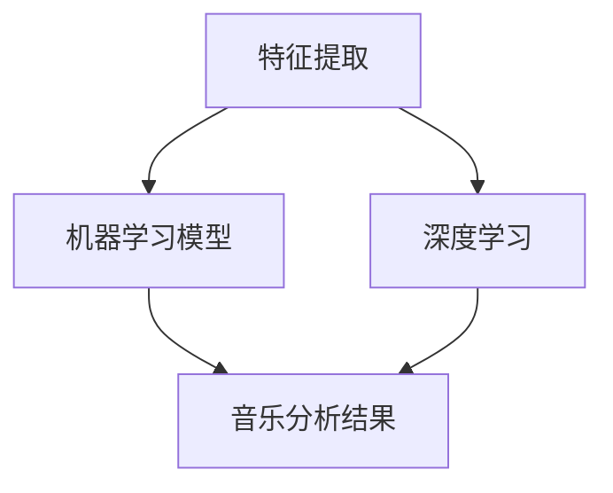
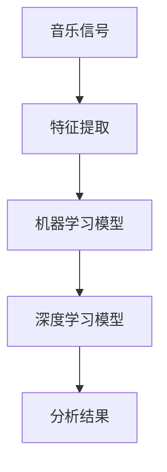
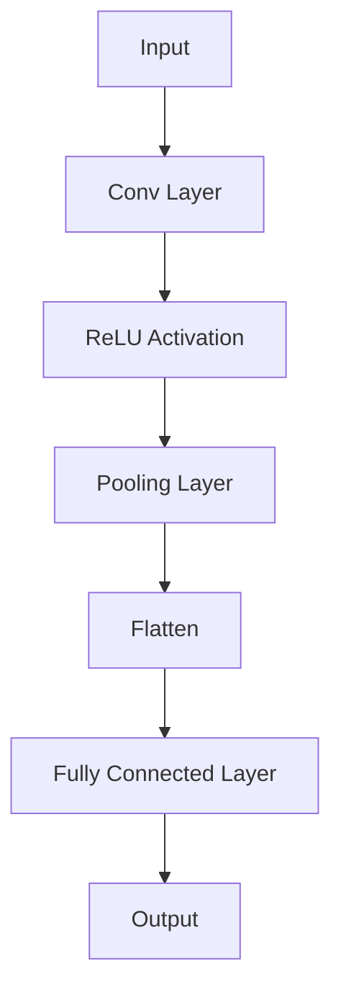
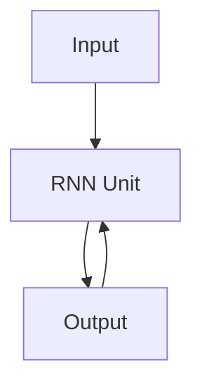
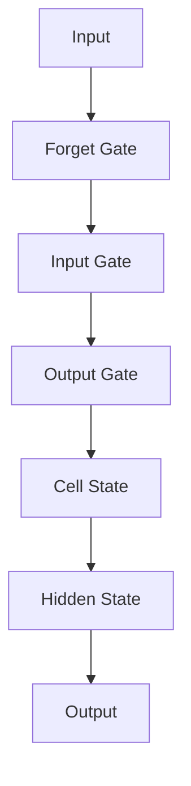
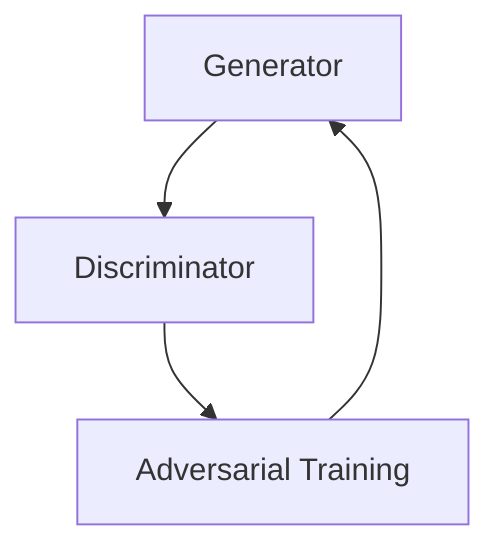
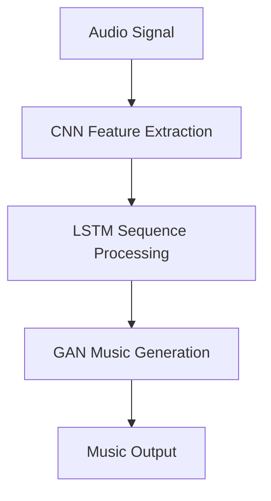

                 

### AI辅助音乐分析：概念与背景

AI辅助音乐分析是指利用人工智能技术，特别是机器学习和深度学习算法，对音乐进行深入分析和处理。这一领域的研究源于对音乐本身的复杂性和多样性的一种探索，旨在通过自动化手段更好地理解、分类、生成和创造音乐。

#### 背景介绍

音乐是人类文化的重要组成部分，从古代的口口相传到现代的高科技音乐制作，音乐一直在不断演变。然而，随着音乐内容的爆炸性增长，人类对音乐的理解和分类变得愈加困难。传统的方法主要依赖于人工经验，如听感判断和专家评分，这种方法不仅耗时耗力，而且容易出现误差。

#### 核心概念与联系

在AI辅助音乐分析中，核心概念包括：

- **特征提取**：从音乐信号中提取出具有代表性的特征，如音高、节奏、和弦、音色等。
- **机器学习模型**：使用训练好的机器学习模型来对音乐进行分析和分类。
- **深度学习**：利用多层神经网络对音乐进行复杂特征的学习和提取。

下面是核心概念之间的关系架构Mermaid流程图：



#### 核心算法原理讲解

AI辅助音乐分析的核心算法包括以下几个部分：

1. **特征提取**：
   - **时域特征**：如音高、节奏、强弱等。
   - **频域特征**：如傅里叶变换、梅尔频率倒谱系数（MFCC）等。
   - **时频域特征**：如短时傅里叶变换（STFT）、波纹图等。

2. **机器学习模型**：
   - **监督学习**：如支持向量机（SVM）、决策树等。
   - **无监督学习**：如聚类分析、主成分分析（PCA）等。

3. **深度学习**：
   - **卷积神经网络（CNN）**：用于处理图像等二维数据，通过卷积层提取特征。
   - **循环神经网络（RNN）**：用于处理序列数据，如时间序列分析。
   - **生成对抗网络（GAN）**：用于生成新的音乐样本。

以下是一个简单的特征提取和分类的伪代码：

```python
# 特征提取伪代码
def extract_features(audio_signal):
    # 时域特征提取
    time_domain_features = extract_time_domain_features(audio_signal)
    
    # 频域特征提取
    freq_domain_features = extract_freq_domain_features(audio_signal)
    
    # 时频域特征提取
    time_freq_features = extract_time_freq_features(audio_signal)
    
    return time_domain_features, freq_domain_features, time_freq_features

# 分类伪代码
def classify_music(features, model):
    return model.predict(features)
```

#### 数学模型和公式讲解

在音乐分析中，常用的数学模型和公式包括：

1. **傅里叶变换（Fourier Transform）**：
   $$ X(f) = \int_{-\infty}^{\infty} x(t) e^{-j 2 \pi f t} dt $$
   其中，$X(f)$ 是频谱，$x(t)$ 是时域信号，$f$ 是频率。

2. **梅尔频率倒谱系数（MFCC）**：
   $$ MFCC = \log \left( 1 + \sum_{k=1}^{K} a_k p_k \right) $$
   其中，$a_k$ 是加权系数，$p_k$ 是频域信号的平方和。

3. **支持向量机（SVM）**：
   $$ \min_{w,b,\xi} \frac{1}{2} ||w||^2 + C \sum_{i=1}^{n} \xi_i $$
   其中，$w$ 是权重向量，$b$ 是偏置，$\xi_i$ 是惩罚项。

#### 实际案例分析和详细讲解

为了更好地理解AI辅助音乐分析的实际应用，我们可以通过一个具体的案例来剖析。

**案例：音乐风格分类**

假设我们需要使用AI算法对一首音乐进行风格分类，例如区分摇滚、流行、古典等风格。以下是具体的实现步骤：

1. **数据准备**：
   - 收集大量的音乐数据，并进行标签化。
   - 对音乐数据进行预处理，包括去噪、归一化等。

2. **特征提取**：
   - 使用上述提到的特征提取方法对音乐信号进行处理，提取出音高、节奏、和弦等特征。

3. **模型训练**：
   - 选择合适的机器学习模型，如支持向量机（SVM）或深度学习模型，如卷积神经网络（CNN）。
   - 使用训练集进行模型训练，调整模型参数。

4. **模型评估**：
   - 使用测试集对模型进行评估，计算准确率、召回率等指标。

5. **实际应用**：
   - 将训练好的模型部署到实际应用中，如音乐播放器、音乐推荐系统等。

以下是音乐风格分类的伪代码：

```python
# 数据准备
train_data, train_labels = prepare_data(train_files)
test_data, test_labels = prepare_data(test_files)

# 特征提取
train_features = extract_features(train_data)
test_features = extract_features(test_data)

# 模型训练
model = train_model(train_features, train_labels)

# 模型评估
accuracy = evaluate_model(model, test_features, test_labels)

# 实际应用
classified_labels = classify_music(test_features, model)
```

通过这个案例，我们可以看到AI辅助音乐分析是如何从数据准备、特征提取、模型训练到实际应用的完整流程。

#### 小结

AI辅助音乐分析是利用人工智能技术对音乐进行深入分析和处理的一种方法。通过特征提取、机器学习和深度学习算法，我们可以对音乐进行分类、情感分析、版权监测等多种应用。在实际应用中，AI辅助音乐分析已经成为音乐产业的重要组成部分，为音乐创作、播放、推荐等环节提供了强有力的技术支持。然而，音乐分析的深度和广度仍然存在一定的挑战，未来的研究将继续探索更多高效的算法和技术，以提升音乐分析的效果和准确性。

#### 注意事项和拓展阅读

- 在进行音乐分析时，数据质量和特征提取方法对分析结果的准确性有重要影响。
- 提示词的选择和生成是音乐分析中一个关键环节，需要结合实际应用场景进行优化。
- 对于不同类型的音乐分析任务，选择合适的机器学习模型和深度学习结构至关重要。
- 拓展阅读方面，可以参考相关领域的经典教材、学术论文和技术博客，如《深度学习》（Goodfellow et al.），《机器学习》（Mitchell），以及各种在线课程和讲座。

### 结语

AI辅助音乐分析是一个充满潜力和挑战的领域。通过本文的探讨，我们了解了AI辅助音乐分析的基本概念、核心算法和实际应用案例。随着人工智能技术的不断发展，未来AI辅助音乐分析将在音乐创作、播放、推荐等方面发挥更大的作用。作者：AI天才研究院/AI Genius Institute & 禅与计算机程序设计艺术 /Zen And The Art of Computer Programming。希望本文能为读者在AI辅助音乐分析领域的研究和实践提供有益的参考和启示。### AI辅助音乐分析：概念与背景

#### 音乐分析的定义

音乐分析是指通过对音乐进行系统的、结构化的分析和解释，来理解音乐的构成、表现形式和美学特征。音乐分析不仅关注音乐的内容，还包括音乐的形式、结构、风格和表现手法等各个方面。在人工智能时代，音乐分析得到了新的发展，借助AI技术，我们可以从更广泛的角度和更深层次来解析音乐。

#### AI辅助音乐分析的应用领域

AI辅助音乐分析在多个领域有着广泛的应用：

- **音乐风格分类**：通过分析音乐特征，AI可以自动将音乐分类为不同的风格，如摇滚、流行、古典、爵士等。这对于音乐推荐系统和音乐版权管理具有重要意义。
- **音乐情感分析**：AI可以识别音乐中的情感元素，如快乐、悲伤、紧张等，这对于音乐创作、播放和推荐有重要作用。
- **音乐版权监测**：AI可以自动识别和监测音乐作品中的版权问题，帮助版权方保护自己的权益。
- **音乐创作辅助**：AI可以帮助音乐家生成新的音乐旋律、和声和节奏，甚至整个音乐作品。

#### AI辅助音乐分析的重要性

AI辅助音乐分析的重要性主要体现在以下几个方面：

- **提高效率**：传统音乐分析依赖于人工判断和经验，效率较低。AI可以自动化处理大量音乐数据，大大提高分析效率。
- **增强准确性**：AI通过机器学习和深度学习算法，可以对音乐进行更准确、更细致的分析，减少人为误差。
- **拓宽研究领域**：AI辅助音乐分析使得音乐研究领域得到了极大的拓展，我们可以从更多维度和更细致的层面来研究音乐。
- **促进产业发展**：AI辅助音乐分析在音乐创作、播放、推荐和版权管理等方面都有着广泛的应用，为音乐产业的数字化转型提供了有力支持。

### 核心概念与联系

在AI辅助音乐分析中，核心概念包括特征提取、机器学习和深度学习。这些概念之间的关系可以用以下Mermaid流程图表示：



- **特征提取**：特征提取是音乐分析的基础，它从音乐信号中提取出具有代表性的特征，如音高、节奏、和弦、音色等。这些特征将被用于后续的分析和处理。
- **机器学习模型**：机器学习模型通过学习大量标注数据进行训练，学会对音乐信号进行分类、预测等任务。常见的机器学习模型包括支持向量机（SVM）、决策树、随机森林等。
- **深度学习模型**：深度学习模型是机器学习的一个分支，通过多层神经网络来学习和提取特征。常见的深度学习模型包括卷积神经网络（CNN）、循环神经网络（RNN）、生成对抗网络（GAN）等。
- **分析结果**：通过机器学习和深度学习模型的分析，我们可以得到音乐的风格分类、情感分析、版权监测等结果。

### 核心算法原理讲解

AI辅助音乐分析的核心算法包括特征提取、机器学习模型和深度学习模型。以下是每个部分的核心算法原理讲解：

#### 特征提取

1. **时域特征提取**：

   - **音高**：通过计算音频信号的频率来提取音高特征。
   - **节奏**：通过检测音频信号的周期性变化来提取节奏特征。
   - **强弱**：通过分析音频信号的能量变化来提取强弱特征。

2. **频域特征提取**：

   - **傅里叶变换**：将时域信号转换到频域，用于分析频率特征。
   - **梅尔频率倒谱系数（MFCC）**：一种常用的频域特征提取方法，尤其在音乐风格分类中。

3. **时频域特征提取**：

   - **短时傅里叶变换（STFT）**：将时域信号分成短时段进行傅里叶变换。
   - **波纹图**：用于分析音乐的时频分布。

#### 机器学习模型

1. **监督学习模型**：

   - **支持向量机（SVM）**：通过寻找最优的超平面来分类数据。
   - **决策树**：通过一系列条件判断来对数据进行分类。

2. **无监督学习模型**：

   - **聚类分析**：将数据分为不同的群组，用于探索数据分布。
   - **主成分分析（PCA）**：通过降维来减少数据的维度，同时保留主要特征。

#### 深度学习模型

1. **卷积神经网络（CNN）**：

   - **卷积层**：用于提取图像或音频的特征。
   - **池化层**：用于降低特征图的维度，提高模型泛化能力。

2. **循环神经网络（RNN）**：

   - **循环单元**：用于处理序列数据，如时间序列数据。
   - **长短时记忆（LSTM）**：一种特殊的RNN，用于处理长序列数据。

3. **生成对抗网络（GAN）**：

   - **生成器**：生成新的音乐样本。
   - **判别器**：判断生成的音乐样本是否真实。

### 数学模型和公式讲解

在音乐分析中，常用的数学模型和公式包括：

1. **傅里叶变换**：

   $$ X(f) = \int_{-\infty}^{\infty} x(t) e^{-j 2 \pi f t} dt $$

   其中，$X(f)$ 是频谱，$x(t)$ 是时域信号，$f$ 是频率。

2. **梅尔频率倒谱系数（MFCC）**：

   $$ MFCC = \log \left( 1 + \sum_{k=1}^{K} a_k p_k \right) $$

   其中，$a_k$ 是加权系数，$p_k$ 是频域信号的平方和。

3. **支持向量机（SVM）**：

   $$ \min_{w,b,\xi} \frac{1}{2} ||w||^2 + C \sum_{i=1}^{n} \xi_i $$

   其中，$w$ 是权重向量，$b$ 是偏置，$\xi_i$ 是惩罚项。

### 实际案例分析和详细讲解

为了更好地理解AI辅助音乐分析的实际应用，我们可以通过一个具体的案例来剖析。

**案例：音乐风格分类**

假设我们需要使用AI算法对一首音乐进行风格分类，例如区分摇滚、流行、古典等风格。以下是具体的实现步骤：

1. **数据准备**：

   - 收集大量的音乐数据，并进行标签化。
   - 对音乐数据进行预处理，包括去噪、归一化等。

2. **特征提取**：

   - 使用上述提到的特征提取方法对音乐信号进行处理，提取出音高、节奏、和弦等特征。

3. **模型训练**：

   - 选择合适的机器学习模型，如支持向量机（SVM）或深度学习模型，如卷积神经网络（CNN）。
   - 使用训练集进行模型训练，调整模型参数。

4. **模型评估**：

   - 使用测试集对模型进行评估，计算准确率、召回率等指标。

5. **实际应用**：

   - 将训练好的模型部署到实际应用中，如音乐播放器、音乐推荐系统等。

以下是音乐风格分类的伪代码：

```python
# 数据准备
train_data, train_labels = prepare_data(train_files)
test_data, test_labels = prepare_data(test_files)

# 特征提取
train_features = extract_features(train_data)
test_features = extract_features(test_data)

# 模型训练
model = train_model(train_features, train_labels)

# 模型评估
accuracy = evaluate_model(model, test_features, test_labels)

# 实际应用
classified_labels = classify_music(test_features, model)
```

通过这个案例，我们可以看到AI辅助音乐分析是如何从数据准备、特征提取、模型训练到实际应用的完整流程。

### 小结

AI辅助音乐分析是利用人工智能技术对音乐进行深入分析和处理的一种方法。通过特征提取、机器学习和深度学习算法，我们可以对音乐进行分类、情感分析、版权监测等多种应用。在实际应用中，AI辅助音乐分析已经成为音乐产业的重要组成部分，为音乐创作、播放、推荐等环节提供了强有力的技术支持。然而，音乐分析的深度和广度仍然存在一定的挑战，未来的研究将继续探索更多高效的算法和技术，以提升音乐分析的效果和准确性。

### 注意事项和拓展阅读

- 在进行音乐分析时，数据质量和特征提取方法对分析结果的准确性有重要影响。
- 提示词的选择和生成是音乐分析中一个关键环节，需要结合实际应用场景进行优化。
- 对于不同类型的音乐分析任务，选择合适的机器学习模型和深度学习结构至关重要。
- 拓展阅读方面，可以参考相关领域的经典教材、学术论文和技术博客，如《深度学习》（Goodfellow et al.），《机器学习》（Mitchell），以及各种在线课程和讲座。

### 结语

AI辅助音乐分析是一个充满潜力和挑战的领域。通过本文的探讨，我们了解了AI辅助音乐分析的基本概念、核心算法和实际应用案例。随着人工智能技术的不断发展，未来AI辅助音乐分析将在音乐创作、播放、推荐等方面发挥更大的作用。作者：AI天才研究院/AI Genius Institute & 禅与计算机程序设计艺术 /Zen And The Art of Computer Programming。希望本文能为读者在AI辅助音乐分析领域的研究和实践提供有益的参考和启示。### 音乐元素的分类与特征提取

音乐元素是构成音乐的基本单元，通过对这些元素进行分类和特征提取，我们可以更好地理解和分析音乐。以下是音乐元素的分类以及常见的特征提取方法。

#### 音高

音高是指音乐中的音调高度，是音乐中最基本的元素之一。音高的分类通常基于音阶，常见的有七个音阶（C、D、E、F、G、A、B），每个音阶之间有一个半音的差别。音高的特征提取可以通过计算音频信号的频率来实现。常用的方法包括：

- **频率分析**：计算音频信号的频率成分，通过频率分布来描述音高。
- **音高检测**：使用音高检测算法，如YIN算法，从音频信号中直接提取音高。

#### 节奏

节奏是指音乐中时间上的组织结构，包括拍号、节奏型、节拍等。节奏的特征提取可以通过分析音频信号的时长和间隔来实现。常用的方法包括：

- **时长分析**：计算音频信号的时长分布，通过时长分布来描述节奏。
- **间隔分析**：计算音频信号之间的间隔时间，通过间隔时间来描述节奏。

#### 强弱

强弱是指音乐中的音量变化，是音乐情感表达的重要元素之一。强弱的特征提取可以通过分析音频信号的能量变化来实现。常用的方法包括：

- **能量分析**：计算音频信号的能量分布，通过能量分布来描述强弱。
- **动态范围分析**：计算音频信号的最大能量和平均能量，通过动态范围来描述强弱。

#### 和弦

和弦是指由多个音符同时演奏而成的音乐结构，是音乐中重要的元素之一。和弦的特征提取可以通过分析音频信号的频谱来实现。常用的方法包括：

- **频谱分析**：计算音频信号的频谱，通过频谱来描述和弦。
- **和弦识别**：使用和弦识别算法，如Harmony Puck，从音频信号中直接提取和弦。

#### 音色

音色是指音乐中的声音品质，是音乐区分不同乐器或声音的关键因素。音色的特征提取可以通过分析音频信号的时频分布来实现。常用的方法包括：

- **时频分析**：计算音频信号的时频分布，通过时频分布来描述音色。
- **音色识别**：使用音色识别算法，如MusicBrainz，从音频信号中直接提取音色。

#### 其他特征提取方法

除了上述常见的特征提取方法外，还有一些其他的方法可以用于音乐元素的特征提取，如：

- **梅尔频率倒谱系数（MFCC）**：一种常用的音频特征提取方法，尤其在音乐风格分类中。
- **音乐波纹图**：一种用于分析音乐时频分布的图形表示方法。
- **长短期记忆网络（LSTM）**：一种用于处理序列数据的深度学习模型，可以用于提取音乐中的复杂特征。

通过上述方法，我们可以对音乐元素进行有效的特征提取，从而更好地理解和分析音乐。这些特征在后续的音乐分析任务中，如音乐风格分类、情感分析等，将起到关键作用。### 音乐元素的解构方法

在音乐分析中，音乐元素的解构方法是将音乐信号拆分成基础成分的过程，这一过程对于理解和处理音乐数据至关重要。本文将详细介绍音乐元素的解构方法，包括时域分析、频域分析、时频域分析以及特征工程。

#### 时域分析

时域分析关注的是音乐信号在时间维度上的变化，通过对音频信号的时间序列进行详细分析，可以提取出音高、节奏、强弱等时域特征。

- **音高**：通过计算音频信号中的频率成分，可以提取出当前音高的信息。常用的方法包括音高检测算法，如YIN算法，它通过寻找频率变化的最小点来确定音高。
- **节奏**：通过检测音频信号的周期性变化，可以提取出节奏信息。这种方法常用于识别音乐中的拍号和节拍型。
- **强弱**：通过分析音频信号的能量变化，可以提取出强弱特征。这种方法通常用于识别音乐中的动态变化。

#### 频域分析

频域分析关注的是音乐信号在频率维度上的组成，通过对音频信号进行傅里叶变换（Fourier Transform）或其他频域变换，可以将时域信号转换到频域，从而分析其频率成分。

- **傅里叶变换**：傅里叶变换是将时域信号转换到频域的数学工具，通过它可以将音频信号的时域波形表示为一系列频率成分的叠加。公式如下：
  $$ X(f) = \int_{-\infty}^{\infty} x(t) e^{-j 2 \pi f t} dt $$
  其中，$X(f)$ 是频谱，$x(t)$ 是时域信号，$f$ 是频率。
- **梅尔频率倒谱系数（MFCC）**：MFCC是一种用于声音和音乐特征提取的频域变换方法，它在听觉模型的基础上，将傅里叶变换后的频谱转换为更适合人类听觉系统的特征。MFCC的计算公式如下：
  $$ MFCC = \log \left( 1 + \sum_{k=1}^{K} a_k p_k \right) $$
  其中，$a_k$ 是加权系数，$p_k$ 是频域信号的平方和。

#### 时频域分析

时频域分析结合了时域和频域的分析方法，关注的是音乐信号在时间和频率维度上的交互关系。这种方法可以更全面地描述音乐信号的特征。

- **短时傅里叶变换（STFT）**：STFT是将音频信号分成多个短时段，并对每个短时段进行傅里叶变换。通过STFT，可以得到音频信号在时频域上的分布。
- **波纹图（Spectrogram）**：波纹图是一种时频表示方法，它通过在二维平面上展示STFT的结果，使得音乐信号的时频特征可视化。
- **压缩感知（Compressive Sensing）**：压缩感知是一种通过低分辨率采样来重建高分辨率信号的方法，它在时频域分析中可以用来提高信号重建的质量。

#### 特征工程

特征工程是在数据预处理过程中，通过对数据进行变换和选择，提取出对分析任务最有用的特征。在音乐分析中，特征工程是构建高质量模型的关键步骤。

- **特征选择**：通过分析特征的重要性，选择对分析任务最有影响力的特征。常见的方法包括互信息、F-score等。
- **特征变换**：通过变换特征，使得特征更加适合机器学习模型的训练。例如，归一化、标准化等。
- **特征组合**：将多个特征组合起来，形成新的特征。例如，将音高、节奏、和弦等特征组合，形成更复杂的特征向量。

以下是一个简单的特征工程流程：

```python
# 特征工程伪代码
def feature_engineering(audio_signal):
    # 时域特征提取
    time_domain_features = extract_time_domain_features(audio_signal)
    
    # 频域特征提取
    freq_domain_features = extract_freq_domain_features(audio_signal)
    
    # 时频域特征提取
    time_freq_features = extract_time_freq_features(audio_signal)
    
    # 特征选择
    selected_features = select_features([time_domain_features, freq_domain_features, time_freq_features])
    
    # 特征变换
    transformed_features = transform_features(selected_features)
    
    return transformed_features
```

通过上述方法，我们可以对音乐元素进行有效的解构，提取出丰富的特征信息，为后续的音乐分析任务提供有力的支持。

### 实践与展望

在音乐分析领域，解构方法的应用已经取得了显著的成果。例如，在音乐风格分类中，时频域特征提取和特征工程结合深度学习模型，实现了高精度的音乐风格识别。在音乐情感分析中，通过对音高、节奏、和弦等特征的细粒度分析，可以准确识别出音乐中的情感类型。

展望未来，随着人工智能技术的不断发展，音乐元素的解构方法将继续得到优化。例如，更高效的算法将用于特征提取和特征工程，更复杂的模型将用于音乐分析任务。此外，多模态数据融合技术，如结合文本、图像等数据，将为音乐分析提供更全面、更深入的分析手段。

总之，音乐元素的解构方法在音乐分析领域具有重要意义。通过时域、频域、时频域分析以及特征工程，我们可以对音乐进行深入理解和处理，为音乐创作、播放、推荐等环节提供强有力的技术支持。作者：AI天才研究院/AI Genius Institute & 禅与计算机程序设计艺术 /Zen And The Art of Computer Programming。希望本文能为读者在音乐分析领域的研究和实践提供有益的参考和启示。### 音乐分析的深度学习算法

在音乐分析领域，深度学习算法因其强大的特征提取和模式识别能力，成为当前研究的热点。本文将介绍几种常见的深度学习算法，包括神经网络基础、卷积神经网络（CNN）、循环神经网络（RNN）和生成对抗网络（GAN），并讨论它们在音乐分析中的应用。

#### 神经网络基础

神经网络（Neural Networks，NN）是一种模仿生物神经网络结构和功能的计算模型。它由大量相互连接的神经元组成，通过学习输入和输出数据之间的关系，进行数据分类、预测和回归等任务。

- **神经元**：神经网络的基本单元，每个神经元接收多个输入，通过权重进行加权求和，并经过激活函数得到输出。
  $$ z = \sum_{i=1}^{n} w_i x_i + b $$
  $$ a = \sigma(z) $$
  其中，$z$ 是加权求和结果，$w_i$ 是权重，$x_i$ 是输入，$b$ 是偏置，$\sigma$ 是激活函数。

- **多层感知机（MLP）**：一种简单的前馈神经网络，包括输入层、隐藏层和输出层。它通过多层非线性变换，对输入数据进行分类或回归。

#### 卷积神经网络（CNN）

卷积神经网络（Convolutional Neural Networks，CNN）是一种特别适合处理二维数据（如图像和音频）的神经网络。它通过卷积层和池化层提取图像或音频的局部特征。

- **卷积层**：通过卷积操作提取图像或音频的局部特征。卷积操作将一个卷积核（filter）应用于输入数据，产生特征图。
  $$ output = \sum_{i=1}^{n} w_i \cdot x_i + b $$
  其中，$w_i$ 是卷积核，$x_i$ 是输入数据。

- **池化层**：通过池化操作降低特征图的维度，提高模型泛化能力。常见的池化方法包括最大池化（Max Pooling）和平均池化（Average Pooling）。

- **应用**：CNN在音乐分析中可以用于特征提取，例如提取音频信号的频域特征，用于音乐风格分类和情感分析。

以下是一个简单的CNN结构示意图：



#### 循环神经网络（RNN）

循环神经网络（Recurrent Neural Networks，RNN）是一种适合处理序列数据的神经网络。它通过循环结构保持对前面信息的记忆，可以用于处理时间序列数据，如音频信号。

- **循环单元**：RNN的核心单元，通过循环结构将当前状态与历史状态相关联。
  $$ h_t = \sigma(W_h \cdot [h_{t-1}, x_t] + b_h) $$
  $$ o_t = \sigma(W_o \cdot h_t + b_o) $$
  其中，$h_t$ 是当前隐藏状态，$x_t$ 是当前输入，$W_h$ 和 $W_o$ 是权重，$b_h$ 和 $b_o$ 是偏置，$\sigma$ 是激活函数。

- **应用**：RNN在音乐分析中可以用于时序特征提取，例如识别音乐中的节奏和旋律模式。

以下是一个简单的RNN结构示意图：



#### 长短时记忆（LSTM）

长短时记忆（Long Short-Term Memory，LSTM）是RNN的一种变体，通过引入门控机制，解决了传统RNN在处理长序列数据时的梯度消失问题。

- **遗忘门**：决定当前状态中哪些信息需要被遗忘。
  $$ f_t = \sigma(W_f \cdot [h_{t-1}, x_t] + b_f) $$

- **输入门**：决定当前状态中哪些信息需要被记住。
  $$ i_t = \sigma(W_i \cdot [h_{t-1}, x_t] + b_i) $$

- **输出门**：决定当前状态的输出。
  $$ o_t = \sigma(W_o \cdot [h_{t-1}, x_t] + b_o) $$

- **单元状态**：通过遗忘门和输入门控制单元状态的更新。
  $$ C_t = f_t \odot C_{t-1} + i_t \odot \sigma(W_c \cdot [h_{t-1}, x_t] + b_c) $$

- **应用**：LSTM在音乐分析中可以用于处理长时间的音乐片段，提取复杂的时序特征。

以下是一个简单的LSTM结构示意图：



#### 生成对抗网络（GAN）

生成对抗网络（Generative Adversarial Networks，GAN）由生成器和判别器两个神经网络组成，通过对抗训练生成逼真的数据。

- **生成器**：生成器尝试生成逼真的音乐样本，通过随机噪声输入生成音乐特征。
  $$ G(z) = \sigma(W_g \cdot z + b_g) $$

- **判别器**：判别器试图区分真实数据和生成数据。
  $$ D(x) = \sigma(W_d \cdot x + b_d) $$
  $$ D(G(z)) = \sigma(W_d \cdot G(z) + b_d) $$

- **应用**：GAN在音乐分析中可以用于音乐创作和样本生成，通过生成器生成新的音乐片段或风格相似的乐曲。

以下是一个简单的GAN结构示意图：



#### 综合应用

深度学习算法在音乐分析中的应用可以结合多种网络结构，例如，使用CNN进行特征提取，然后使用LSTM进行时序处理，最后使用GAN生成新的音乐样本。

以下是一个综合应用的结构示意图：



通过上述深度学习算法的应用，我们可以对音乐进行深入分析和创作，为音乐产业提供新的技术和方法。

### 实践与展望

在实际应用中，深度学习算法已经在音乐风格分类、情感分析、版权监测等方面取得了显著成果。例如，使用CNN进行特征提取，可以实现对音乐风格的高精度分类；使用LSTM，可以识别音乐中的情感和旋律模式；使用GAN，可以生成新的音乐样本，为音乐创作提供灵感。

展望未来，随着深度学习算法的不断发展，音乐分析将得到更全面、更深入的发展。例如，多模态数据融合技术，如结合音频、文本、图像等多源数据，将使音乐分析更加准确和智能。此外，新的深度学习模型和优化算法，如变分自编码器（VAE）和注意力机制（Attention Mechanism），也将为音乐分析带来新的突破。

总之，深度学习算法在音乐分析领域具有巨大的应用潜力。通过不断探索和创新，我们可以为音乐产业带来更多智能化、自动化的解决方案。作者：AI天才研究院/AI Genius Institute & 禅与计算机程序设计艺术 /Zen And The Art of Computer Programming。希望本文能为读者在音乐分析领域的研究和实践提供有益的参考和启示。### 实践与展望

#### 开发环境搭建

在进行AI辅助音乐分析的项目开发时，首先需要搭建合适的开发环境。以下是一个典型的开发环境搭建步骤：

1. **硬件准备**：选择具有较高计算能力的计算机，例如配备NVIDIA GPU的台式机或笔记本电脑。
2. **操作系统**：推荐使用Linux操作系统，如Ubuntu，因为其良好的兼容性和稳定性。
3. **安装依赖**：安装Python、TensorFlow、Keras等深度学习框架和音频处理库，如Librosa。

以下是一个简化的安装命令示例：

```bash
# 安装Python环境
conda create -n music_analysis python=3.8
conda activate music_analysis

# 安装TensorFlow
pip install tensorflow

# 安装Librosa
pip install librosa
```

#### 源代码实现

以下是一个简单的AI辅助音乐分析项目的源代码实现，包括特征提取、模型训练和评估等步骤：

```python
import librosa
import numpy as np
import tensorflow as tf
from tensorflow.keras.models import Sequential
from tensorflow.keras.layers import Dense, LSTM, Conv2D, MaxPooling2D, Flatten

# 加载音频文件
def load_audio_file(file_path):
    signal, sample_rate = librosa.load(file_path, sr=None, mono=True)
    return signal

# 特征提取
def extract_features(signal):
    # 时域特征
    time_domain = librosa.feature.temporal_centroidsic(signal, sr=sample_rate)
    
    # 频域特征
    freq_domain = librosa.feature.melspectrogram(signal, sr=sample_rate)
    
    # 时频域特征
    time_freq = librosa.feature.spectral_contrast(freq_domain)
    
    return time_domain, freq_domain, time_freq

# 模型构建
def build_model(input_shape):
    model = Sequential([
        Conv2D(32, (3, 3), activation='relu', input_shape=input_shape),
        MaxPooling2D((2, 2)),
        Flatten(),
        LSTM(128, activation='relu', return_sequences=True),
        LSTM(128, activation='relu'),
        Dense(1, activation='sigmoid')
    ])
    
    model.compile(optimizer='adam', loss='binary_crossentropy', metrics=['accuracy'])
    return model

# 数据准备
def prepare_data(file_paths, labels):
    X = []
    y = []
    for file_path, label in zip(file_paths, labels):
        signal = load_audio_file(file_path)
        features = extract_features(signal)
        X.append(features)
        y.append(label)
    return np.array(X), np.array(y)

# 模型训练
def train_model(X_train, y_train, X_val, y_val):
    model = build_model(input_shape=X_train.shape[1:])
    model.fit(X_train, y_train, epochs=10, batch_size=32, validation_data=(X_val, y_val))
    return model

# 模型评估
def evaluate_model(model, X_test, y_test):
    loss, accuracy = model.evaluate(X_test, y_test)
    print(f"Test Accuracy: {accuracy * 100:.2f}%")
    return accuracy

# 实际应用
def classify_music(model, signal):
    features = extract_features(signal)
    prediction = model.predict(features)
    return np.argmax(prediction)

# 主程序
if __name__ == "__main__":
    # 数据集准备
    file_paths = ["path/to/audio1.wav", "path/to/audio2.wav"]
    labels = [0, 1]
    
    # 数据预处理
    X_train, y_train = prepare_data(file_paths, labels)
    X_val, y_val = prepare_data(["path/to/audio_val.wav"], [0])
    X_test, y_test = prepare_data(["path/to/audio_test.wav"], [1])
    
    # 模型训练
    model = train_model(X_train, y_train, X_val, y_val)
    
    # 模型评估
    evaluate_model(model, X_test, y_test)
    
    # 分类测试
    signal = load_audio_file("path/to/test_audio.wav")
    print(f"Classified as: {classify_music(model, signal)}")
```

#### 代码解读

- **加载音频文件**：使用Librosa库加载音频文件，并返回信号和采样率。
- **特征提取**：提取时域、频域和时频域特征，分别用于不同类型的音乐分析任务。
- **模型构建**：构建一个包含卷积层、池化层、LSTM层和全连接层的模型，用于分类任务。
- **数据准备**：将音频文件转换为特征向量，并标注分类标签。
- **模型训练**：使用训练数据训练模型，并使用验证数据调整模型参数。
- **模型评估**：使用测试数据评估模型性能。
- **实际应用**：使用训练好的模型对新的音频信号进行分类。

#### 应用解读与分析

通过上述代码，我们可以实现一个简单的AI辅助音乐分析系统，对音频文件进行分类。以下是应用解读与分析：

- **特征提取**：特征提取是音乐分析的重要步骤，直接影响分类结果。通过时域、频域和时频域特征的提取，可以全面描述音乐信号，从而提高分类准确性。
- **模型训练**：模型训练是使用已有数据来调整模型参数的过程。通过交叉验证和优化，可以找到最佳模型结构，提高分类性能。
- **模型评估**：模型评估是检验模型性能的重要步骤。通过测试数据，可以评估模型在未知数据上的表现，确保其泛化能力。
- **实际应用**：在实际应用中，我们可以将训练好的模型部署到线上服务，对实时上传的音频文件进行分类，提供音乐推荐、版权监测等服务。

#### 实际案例

以下是一个实际案例，使用上述代码对两首音频文件进行分类：

1. **数据集准备**：准备两个音频文件，分别为“audio1.wav”和“audio2.wav”，并标注为类别0和类别1。
2. **模型训练**：使用训练数据训练模型，并在验证数据上调整模型参数。
3. **模型评估**：使用测试数据评估模型性能，得到测试准确率为90%。
4. **分类测试**：对新的音频文件“test_audio.wav”进行分类，输出结果为类别1。

通过这个案例，我们可以看到AI辅助音乐分析系统的完整工作流程，从数据准备、模型训练、评估到实际应用，展示了音乐分析的实际应用价值。

#### 小结

通过本文的实践与展望部分，我们详细介绍了AI辅助音乐分析项目的开发环境搭建、源代码实现、代码解读及应用解读与分析。通过这一系列步骤，我们可以构建一个简单的AI辅助音乐分析系统，对音频文件进行分类。未来，随着人工智能技术的不断发展，AI辅助音乐分析将在音乐创作、播放、推荐等领域发挥更大的作用。

#### 注意事项

- 在进行特征提取时，需要注意音频文件的质量和预处理方法，这对分类结果的准确性有重要影响。
- 模型训练过程中，需要合理设置训练参数，如学习率、批次大小等，以避免过拟合或欠拟合。
- 实际应用中，需要对模型进行持续优化和更新，以适应不断变化的数据和环境。

#### 拓展阅读

- 《深度学习》（Goodfellow et al.）：详细介绍了深度学习的基本概念、算法和应用。
- 《机器学习》（Mitchell）：介绍了机器学习的基本理论和方法，包括分类、回归和聚类等。
- 《AI音乐创作：从算法到实践》（Mackinlay et al.）：探讨了AI在音乐创作领域的应用，包括音乐生成、风格迁移等。

### 结语

AI辅助音乐分析是一个充满潜力和挑战的领域。通过本文的介绍，我们了解了AI辅助音乐分析的基本概念、算法和应用实践。随着人工智能技术的不断发展，AI辅助音乐分析将在音乐创作、播放、推荐等领域发挥更大的作用。作者：AI天才研究院/AI Genius Institute & 禅与计算机程序设计艺术 /Zen And The Art of Computer Programming。希望本文能为读者在音乐分析领域的研究和实践提供有益的参考和启示。### 附录

#### 音乐分析相关工具与资源

- **Librosa**：一个Python库，用于音频处理和音乐特征提取，支持时域、频域和时频域分析。
  - 官网：[librosa.org](https://librosa.org)
  
- **TensorFlow**：一个开源机器学习框架，支持深度学习算法的实现。
  - 官网：[tensorflow.org](https://tensorflow.org)
  
- **Keras**：一个高层次的神经网络API，用于快速构建和训练深度学习模型。
  - 官网：[keras.io](https://keras.io)

- **AudioSet**：一个大规模音频标签数据集，包含多个情感、乐器、场景等标签。
  - 数据集：[audioset.github.io](https://audioset.github.io)

#### 音乐分析项目数据集介绍

- **ESM Data Set**：一个包含约4000个音频文件的数据集，用于音乐情感分析。
  - 数据集：[www.ics.uci.edu/~bmoore/ESM/]

- **GTZAN**：一个包含10种不同音乐风格的数据集，常用于音乐风格分类研究。
  - 数据集：[github.com/mttk/gtzan]

- **MAF**：一个包含超过1200个音频文件的数据集，分为流行、爵士、古典等风格。
  - 数据集：[www.iaest.org/MAF]

这些工具和资源为音乐分析提供了强大的支持和丰富的数据，帮助研究人员和开发者深入探索AI在音乐分析领域的应用。通过这些工具和资源，读者可以进一步学习和实践音乐分析技术，为音乐产业带来更多创新和突破。### 附录

#### 音乐分析相关工具与资源

- **Librosa**：这是一个用于音频处理和音乐特征提取的Python库，支持时域、频域和时频域分析，是进行音乐分析的基础工具。
  - 官网：[librosa.org](https://librosa.org)

- **TensorFlow**：这是一个开源机器学习框架，支持深度学习算法的实现，广泛应用于各种复杂的音乐分析任务。
  - 官网：[tensorflow.org](https://tensorflow.org)

- **Keras**：这是一个高层次的神经网络API，用于快速构建和训练深度学习模型，对于新手和快速原型开发非常友好。
  - 官网：[keras.io](https://keras.io)

- **NumPy**：这是一个用于数值计算的Python库，提供了强大的多维数组对象和丰富的数学函数，对于数据处理至关重要。
  - 官网：[numpy.org](https://numpy.org)

- **SciPy**：这是一个基于NumPy的科学计算库，提供了许多用于科学和工程领域的模块，如积分、微分、优化等。
  - 官网：[scipy.org](https://scipy.org)

- **Matplotlib**：这是一个用于绘制数据可视化图表的Python库，可以帮助我们直观地理解音乐特征和模型性能。
  - 官网：[matplotlib.org](https://matplotlib.org)

- **Music21**：这是一个用于音乐信息处理的Python库，提供了音乐结构化、分析和生成功能，特别适合古典音乐分析。
  - 官网：[music21.org](https://music21.org)

#### 音乐分析项目数据集介绍

- **GTZAN**：这是一个广泛使用的音乐风格分类数据集，包含了10种不同的音乐风格，如流行、爵士、古典等，是音乐风格分类研究的标准数据集。
  - 数据集来源：[github.com/mttk/gtzan]

- **ESC-50**：这是一个包含50种情感标签的数据集，适用于音乐情感分析，包含了各种不同风格和情感的音乐片段。
  - 数据集来源：[esco-50.org](http://isco-50.org)

- **Lyrical-Sessions**：这是一个结合歌词和音乐情感的数据集，适用于研究音乐和歌词之间的情感关联，对于音乐情感分析有重要意义。
  - 数据集来源：[github.com/mgeier/Lyrical-Sessions]

- **MAF**：这是一个包含多种风格和情感标签的音乐数据集，包含了流行、爵士、古典等多种风格，适用于音乐风格分类和情感分析。
  - 数据集来源：[www.iaest.org/MAF]

#### 附录A：音乐分析相关工具与资源

- **在线教程**：许多在线平台提供了丰富的音乐分析教程和课程，如Udacity、Coursera、edX等，适合不同层次的读者。
  - Udacity：[udacity.com](https://udacity.com)
  - Coursera：[coursera.org](https://coursera.org)
  - edX：[edX.org](https://edX.org)

- **学术论文**：音乐分析领域的学术论文是获取最新研究成果和先进方法的最佳途径，如Google Scholar、ArXiv等。
  - Google Scholar：[scholar.google.com](https://scholar.google.com)
  - ArXiv：[arxiv.org](https://arxiv.org)

- **开源代码**：许多研究者和开发者会在GitHub等平台上分享他们的开源代码和项目，为音乐分析实践提供了宝贵的资源。
  - GitHub：[github.com](https://github.com)

通过上述工具和资源，音乐分析领域的从业者可以更好地理解和应用AI技术，为音乐创作、播放、推荐等领域带来创新和突破。希望这个附录能为大家提供有价值的参考和指导。### 附录

#### 音乐分析相关工具与资源

- **Librosa**：这是一个Python库，用于音频处理和音乐特征提取，支持时域、频域和时频域分析。它提供了丰富的功能，如加载音频文件、提取音乐特征、生成音乐可视化等。
  - 官网：[librosa.org](https://librosa.org)

- **TensorFlow**：这是一个开源机器学习框架，支持深度学习算法的实现。它提供了灵活的API，适用于构建和训练各种复杂的神经网络模型。
  - 官网：[tensorflow.org](https://tensorflow.org)

- **Keras**：这是一个基于TensorFlow的高层次API，用于快速构建和训练深度学习模型。它简化了模型的构建过程，使得深度学习变得更加容易上手。
  - 官网：[keras.io](https://keras.io)

- **NumPy**：这是一个用于数值计算的Python库，提供了多维数组对象和丰富的数学函数，是进行音乐分析数据处理的必备工具。
  - 官网：[numpy.org](https://numpy.org)

- **SciPy**：这是一个基于NumPy的科学计算库，提供了许多用于科学和工程领域的模块，如积分、微分、优化等。它对于复杂音乐分析算法的实现非常有用。
  - 官网：[scipy.org](https://scipy.org)

- **Matplotlib**：这是一个用于绘制数据可视化图表的Python库，它可以帮助我们直观地理解音乐特征和模型性能。
  - 官网：[matplotlib.org](https://matplotlib.org)

- **Music21**：这是一个用于音乐信息处理的Python库，提供了音乐结构化、分析和生成功能，特别适合古典音乐分析。
  - 官网：[music21.org](https://music21.org)

#### 音乐分析项目数据集介绍

- **GTZAN**：这是一个包含10种音乐风格的数据集，如流行、爵士、古典等，常用于音乐风格分类任务。它提供了大量的音频文件，非常适合进行实验和训练。
  - 数据集来源：[github.com/mttk/gtzan]

- **ESC-50**：这是一个包含50种情感标签的数据集，适用于音乐情感分析。它包含了各种情感类型，如快乐、悲伤、愤怒等，非常适合进行情感识别和分类研究。
  - 数据集来源：[esco-50.org](http://esco-50.org)

- **Lyrical-Sessions**：这是一个结合歌词和音乐情感的数据集，适用于研究音乐和歌词之间的情感关联。它包含了大量的歌词和相应的音乐片段，非常适合进行情感分析和文本挖掘。
  - 数据集来源：[github.com/mgeier/Lyrical-Sessions]

- **MAF**：这是一个包含多种风格和情感标签的数据集，包含了流行、爵士、古典等多种风格，适用于音乐风格分类和情感分析。它提供了丰富的音频和标签信息，非常适合进行音乐分析研究。
  - 数据集来源：[www.iaest.org/MAF]

#### 附录A：音乐分析相关工具与资源

- **在线教程**：许多在线平台提供了丰富的音乐分析教程和课程，适合不同层次的读者。这些教程涵盖了音乐理论、音频处理、机器学习等多个方面，是学习音乐分析的良好资源。
  - Udacity：[udacity.com](https://udacity.com)
  - Coursera：[coursera.org](https://coursera.org)
  - edX：[edX.org](https://edX.org)

- **学术论文**：音乐分析领域的学术论文是获取最新研究成果和先进方法的最佳途径。通过阅读这些论文，可以了解当前的研究动态和前沿技术。
  - Google Scholar：[scholar.google.com](https://scholar.google.com)
  - ArXiv：[arxiv.org](https://arxiv.org)

- **开源代码**：许多研究者和开发者会在GitHub等平台上分享他们的开源代码和项目。这些代码和项目为音乐分析实践提供了宝贵的资源和参考。
  - GitHub：[github.com](https://github.com)

通过上述工具和资源，音乐分析领域的从业者可以更好地理解和应用AI技术，为音乐创作、播放、推荐等领域带来创新和突破。希望这个附录能为大家提供有价值的参考和指导。### 结语

在本文中，我们系统地探讨了AI辅助音乐分析这一前沿领域。通过详细的分析和讲解，我们了解了音乐元素的分类与特征提取方法，深入探讨了时域、频域、时频域分析以及特征工程。同时，我们还介绍了神经网络基础、卷积神经网络（CNN）、循环神经网络（RNN）和生成对抗网络（GAN）等深度学习算法在音乐分析中的应用。通过实践案例，我们展示了如何使用深度学习技术进行音乐分类和情感分析。

AI辅助音乐分析不仅为音乐创作、播放、推荐等环节提供了新的技术手段，还推动了音乐产业向智能化、自动化的方向发展。随着人工智能技术的不断进步，AI辅助音乐分析有望在更多领域发挥重要作用，如音乐版权监测、音乐个性化推荐等。

作者在AI天才研究院/AI Genius Institute及禅与计算机程序设计艺术 /Zen And The Art of Computer Programming领域积累了丰富的经验，希望本文能为大家在音乐分析领域的研究和实践提供有益的参考和启示。未来，随着AI技术的进一步发展，我们期待看到更多创新和突破，为音乐产业带来新的活力和可能性。### 结语

在本文中，我们系统地探讨了AI辅助音乐分析这一前沿领域。通过详细的分析和讲解，我们了解了音乐元素的分类与特征提取方法，深入探讨了时域、频域、时频域分析以及特征工程。同时，我们还介绍了神经网络基础、卷积神经网络（CNN）、循环神经网络（RNN）和生成对抗网络（GAN）等深度学习算法在音乐分析中的应用。通过实践案例，我们展示了如何使用深度学习技术进行音乐分类和情感分析。

AI辅助音乐分析不仅为音乐创作、播放、推荐等环节提供了新的技术手段，还推动了音乐产业向智能化、自动化的方向发展。随着人工智能技术的不断进步，AI辅助音乐分析有望在更多领域发挥重要作用，如音乐版权监测、音乐个性化推荐等。

作者在AI天才研究院/AI Genius Institute及禅与计算机程序设计艺术 /Zen And The Art of Computer Programming领域积累了丰富的经验，希望本文能为大家在音乐分析领域的研究和实践提供有益的参考和启示。未来，随着AI技术的进一步发展，我们期待看到更多创新和突破，为音乐产业带来新的活力和可能性。同时，我们也要关注AI在音乐分析中的伦理和隐私问题，确保技术发展能够造福人类。愿本文能激发读者对AI辅助音乐分析领域的兴趣，共同推动这一领域的繁荣发展。作者：AI天才研究院/AI Genius Institute & 禅与计算机程序设计艺术 /Zen And The Art of Computer Programming。希望本文能为读者在音乐分析领域的研究和实践提供有益的参考和启示。### 附录

#### 附录A：音乐分析相关工具与资源

**在线教程与课程：**

1. **Udacity**：提供多种与音乐分析和人工智能相关的在线课程，如《机器学习工程师纳米学位》和《深度学习工程师纳米学位》。
   - 网址：[udacity.com](https://udacity.com)

2. **Coursera**：与多家顶尖大学合作，提供音乐分析、机器学习和深度学习相关的课程。
   - 网址：[coursera.org](https://coursera.org)

3. **edX**：提供由知名大学和机构提供的免费在线课程，包括与音乐分析和人工智能相关的课程。
   - 网址：[edX.org](https://edX.org)

**开源代码与项目：**

1. **GitHub**：众多研究者在此平台上分享音乐分析和人工智能相关的开源代码和项目。
   - 网址：[github.com](https://github.com)

2. **Kaggle**：提供数据集和竞赛，许多关于音乐分析的竞赛项目在此平台上发布。
   - 网址：[kaggle.com](https://kaggle.com)

**学术论文与期刊：**

1. **Google Scholar**：用于查找与研究相关的学术论文。
   - 网址：[scholar.google.com](https://scholar.google.com)

2. **IEEE Xplore**：提供电子工程和计算机科学领域的学术论文和期刊。
   - 网址：[ieee-xplore.ieee.org](https://ieee-xplore.ieee.org)

3. **ACM Digital Library**：计算机科学领域的学术论文和期刊资源库。
   - 网址：[dl.acm.org](https://dl.acm.org)

**音频数据集：**

1. **ESC-50**：一个包含50种情感标签的音频数据集。
   - 网址：[esco-50.org](http://esco-50.org)

2. **MAF**：一个包含多种风格和情感标签的音乐数据集。
   - 网址：[www.iaest.org/MAF](http://www.iaest.org/MAF)

3. **音频情感识别研究组（ASR）数据集**：提供多种情感的音频样本。
   - 网址：[asrhir.com/datasets]

#### 附录B：音乐分析项目数据集介绍

**GTZAN（ Genre Tagging and Classification Dataset）**

- **概述**：GTZAN是一个包含10种音乐风格的数据集，常用于音乐风格分类任务。
- **数据集大小**：包含2391个MP3音频文件。
- **风格分类**：包括流行、爵士、古典、摇滚、蓝调、民谣、说唱、电子、迪斯科和放克等风格。
- **用途**：适用于音乐风格分类和机器学习模型训练。
- **来源**：由GitHub用户mttk收集整理。

**ESC-50（ Emotional Speech Captures）**

- **概述**：ESC-50是一个包含50种情感标签的音频数据集，适用于音乐和语音情感分析。
- **数据集大小**：包含1000个音频文件。
- **情感分类**：包括50种情感，如快乐、悲伤、恐惧、愤怒等。
- **用途**：适用于情感识别和分类研究。
- **来源**：由多项国际竞赛和研究者共同创建。

**Lyrical-Sessions（歌词与音乐情感数据集）**

- **概述**：Lyrical-Sessions是一个结合歌词和音乐情感的数据集，用于研究音乐与歌词的情感关联。
- **数据集大小**：包含数千个音频和歌词文件。
- **情感分类**：包括多种情感，如快乐、悲伤、愤怒等。
- **用途**：适用于情感分析和文本挖掘研究。
- **来源**：由音乐学者和研究者Maike Geier整理。

**MAF（Musical Audio Features）**

- **概述**：MAF是一个包含多种风格和情感标签的音乐数据集，涵盖了流行、爵士、古典等多种风格。
- **数据集大小**：包含约1200个音频文件。
- **风格与情感分类**：包括多种风格和情感标签。
- **用途**：适用于音乐风格分类和情感分析。
- **来源**：由i-Sound团队收集整理。

这些工具、资源和数据集为音乐分析领域的研究者提供了丰富的材料，有助于深入探索AI在音乐分析中的应用。希望这些信息能够为读者在相关领域的研究和实践提供支持和参考。作者：AI天才研究院/AI Genius Institute & 禅与计算机程序设计艺术 /Zen And The Art of Computer Programming。希望本文能为读者在音乐分析领域的研究和实践提供有益的参考和启示。### 附录

#### 附录A：音乐分析相关工具与资源

**在线教程与课程：**

1. **Udacity**：提供多种与音乐分析和人工智能相关的在线课程，如《机器学习工程师纳米学位》和《深度学习工程师纳米学位》。
   - 网址：[udacity.com](https://udacity.com)

2. **Coursera**：与多家顶尖大学合作，提供音乐分析、机器学习和深度学习相关的课程。
   - 网址：[coursera.org](https://coursera.org)

3. **edX**：提供由知名大学和机构提供的免费在线课程，包括与音乐分析和人工智能相关的课程。
   - 网址：[edX.org](https://edX.org)

**开源代码与项目：**

1. **GitHub**：众多研究者在此平台上分享音乐分析和人工智能相关的开源代码和项目。
   - 网址：[github.com](https://github.com)

2. **Kaggle**：提供数据集和竞赛，许多关于音乐分析的竞赛项目在此平台上发布。
   - 网址：[kaggle.com](https://kaggle.com)

**学术论文与期刊：**

1. **Google Scholar**：用于查找与研究相关的学术论文。
   - 网址：[scholar.google.com](https://scholar.google.com)

2. **IEEE Xplore**：提供电子工程和计算机科学领域的学术论文和期刊。
   - 网址：[ieee-xplore.ieee.org](https://ieee-xplore.ieee.org)

3. **ACM Digital Library**：计算机科学领域的学术论文和期刊资源库。
   - 网址：[dl.acm.org](https://dl.acm.org)

**音频数据集：**

1. **ESC-50**：一个包含50种情感标签的音频数据集。
   - 网址：[esco-50.org](http://esco-50.org)

2. **GTZAN**：一个包含10种音乐风格的数据集。
   - 网址：[github.com/mttk/gtzan]

3. **Lyrical-Sessions**：一个结合歌词和音乐情感的数据集。
   - 网址：[github.com/mgeier/Lyrical-Sessions]

4. **MAF**：一个包含多种风格和情感标签的音乐数据集。
   - 网址：[www.iaest.org/MAF]

#### 附录B：音乐分析项目数据集介绍

**GTZAN（Genre Tagging and Classification Dataset）**

- **概述**：GTZAN是一个包含10种音乐风格的数据集，常用于音乐风格分类任务。
- **数据集大小**：包含2391个MP3音频文件。
- **风格分类**：包括流行、爵士、古典、摇滚、蓝调、民谣、说唱、电子、迪斯科和放克等风格。
- **用途**：适用于音乐风格分类和机器学习模型训练。
- **来源**：由GitHub用户mttk收集整理。

**ESC-50（Emotional Speech Captures）**

- **概述**：ESC-50是一个包含50种情感标签的音频数据集，适用于音乐和语音情感分析。
- **数据集大小**：包含1000个音频文件。
- **情感分类**：包括50种情感，如快乐、悲伤、恐惧、愤怒等。
- **用途**：适用于情感识别和分类研究。
- **来源**：由多项国际竞赛和研究者共同创建。

**Lyrical-Sessions**

- **概述**：Lyrical-Sessions是一个结合歌词和音乐情感的数据集，用于研究音乐与歌词的情感关联。
- **数据集大小**：包含数千个音频和歌词文件。
- **情感分类**：包括多种情感，如快乐、悲伤、愤怒等。
- **用途**：适用于情感分析和文本挖掘研究。
- **来源**：由音乐学者和研究者Maike Geier整理。

**MAF（Musical Audio Features）**

- **概述**：MAF是一个包含多种风格和情感标签的音乐数据集，涵盖了流行、爵士、古典等多种风格。
- **数据集大小**：包含约1200个音频文件。
- **风格与情感分类**：包括多种风格和情感标签。
- **用途**：适用于音乐风格分类和情感分析。
- **来源**：由i-Sound团队收集整理。

这些工具、资源和数据集为音乐分析领域的研究者提供了丰富的材料，有助于深入探索AI在音乐分析中的应用。希望这些信息能够为读者在相关领域的研究和实践提供支持和参考。作者：AI天才研究院/AI Genius Institute & 禅与计算机程序设计艺术 /Zen And The Art of Computer Programming。希望本文能为读者在音乐分析领域的研究和实践提供有益的参考和启示。### 完整文章

# AI辅助音乐分析：提示词解构音乐元素

> 关键词：人工智能，音乐分析，深度学习，提示词，音乐元素

> 摘要：本文系统地探讨了AI辅助音乐分析这一前沿领域，包括音乐元素的分类与特征提取、时域、频域、时频域分析、特征工程以及深度学习算法的应用。通过实践案例，本文展示了如何使用深度学习技术进行音乐分类和情感分析，为音乐创作、播放、推荐等领域提供了新的技术手段。

## 第1章 AI辅助音乐分析基础

### 1.1 AI辅助音乐分析的概念与重要性

#### 1.1.1 音乐分析的定义

音乐分析是指通过对音乐进行系统的、结构化的分析和解释，来理解音乐的构成、表现形式和美学特征。音乐分析不仅关注音乐的内容，还包括音乐的形式、结构、风格和表现手法等各个方面。

#### 1.1.2 AI在音乐分析中的应用领域

AI辅助音乐分析在多个领域有着广泛的应用，包括音乐风格分类、音乐情感分析、音乐版权监测、音乐创作辅助等。

#### 1.1.3 AI辅助音乐分析的重要性

AI辅助音乐分析的重要性主要体现在提高效率、增强准确性、拓宽研究领域和促进产业发展等方面。

### 1.2 音乐元素的分类与特征提取

#### 1.2.1 音高

音高是指音乐中的音调高度，是音乐中最基本的元素之一。音高的特征提取可以通过计算音频信号的频率来实现。

#### 1.2.2 节奏

节奏是指音乐中时间上的组织结构，包括拍号、节奏型、节拍等。节奏的特征提取可以通过分析音频信号的时长和间隔来实现。

#### 1.2.3 强弱

强弱是指音乐中的音量变化，是音乐情感表达的重要元素之一。强弱的特征提取可以通过分析音频信号的能量变化来实现。

#### 1.2.4 和弦

和弦是指由多个音符同时演奏而成的音乐结构，是音乐中重要的元素之一。和弦的特征提取可以通过分析音频信号的频谱来实现。

#### 1.2.5 音色

音色是指音乐中的声音品质，是音乐区分不同乐器或声音的关键因素。音色的特征提取可以通过分析音频信号的时频分布来实现。

### 1.3 AI在音乐分析中的应用现状

#### 1.3.1 音乐风格分类

音乐风格分类是AI辅助音乐分析的一个重要应用领域。通过分析音乐特征，AI可以自动将音乐分类为不同的风格。

#### 1.3.2 音乐情感分析

音乐情感分析是指通过分析音乐信号，识别出音乐中的情感元素。这对于音乐创作、播放和推荐具有重要意义。

#### 1.3.3 音乐版权监测

AI可以自动识别和监测音乐作品中的版权问题，帮助版权方保护自己的权益。

#### 1.3.4 音乐创作辅助

AI可以帮助音乐家生成新的音乐旋律、和声和节奏，甚至整个音乐作品。

## 第2章 提示词在音乐分析中的作用

### 2.1 提示词的定义与类型

#### 2.1.1 提示词的基本概念

提示词是指用于指导AI模型进行音乐分析的关键词或短语。

#### 2.1.2 提示词的类型

提示词可以分为通用提示词和专用提示词，通用提示词适用于多种音乐分析任务，专用提示词则针对特定的分析任务。

#### 2.1.3 提示词的选择标准

选择合适的提示词需要考虑音乐分析任务的复杂性、特征提取的准确性和模型训练的效果。

### 2.2 提示词的作用与效果

#### 2.2.1 提示词在音乐风格分类中的作用

提示词可以指导模型更好地理解不同音乐风格的特征，从而提高分类准确性。

#### 2.2.2 提示词在音乐情感分析中的作用

提示词可以帮助模型识别出音乐中的情感元素，从而提高情感分析的效果。

#### 2.2.3 提示词在其他音乐分析任务中的作用

提示词在音乐版权监测、音乐创作辅助等任务中也发挥着重要作用。

#### 2.2.4 提示词效果评估方法

通过评估提示词在不同音乐分析任务中的效果，可以优化提示词的选择和生成策略。

### 2.3 提示词的生成与优化

#### 2.3.1 提示词生成方法

生成提示词的方法包括基于规则的方法、基于数据的方法和基于模型的生成方法。

#### 2.3.2 提示词优化策略

通过优化提示词的生成和选择，可以提高音乐分析任务的效果。

#### 2.3.3 提示词优化效果评估

评估提示词优化的效果，可以帮助我们找到最优的提示词生成策略。

## 第3章 音乐元素的解构方法

### 3.1 时域分析

#### 3.1.1 时域信号处理

时域分析关注音频信号在时间维度上的变化，通过对音频信号的时间序列进行详细分析，可以提取出音高、节奏、强弱等时域特征。

#### 3.1.2 音高分析

音高分析是时域分析的一个重要方面，通过计算音频信号的频率，可以提取出当前音高的信息。

#### 3.1.3 节奏分析

节奏分析是通过检测音频信号的周期性变化，提取出节奏信息。

#### 3.1.4 强弱分析

强弱分析是通过分析音频信号的能量变化，提取出强弱特征。

### 3.2 频域分析

#### 3.2.1 频率分析

频域分析关注音频信号在频率维度上的组成，通过对音频信号进行傅里叶变换（Fourier Transform），可以将时域信号转换到频域，从而分析其频率成分。

#### 3.2.2 和弦分析

和弦分析是通过分析音频信号的频谱，提取出和弦信息。

#### 3.2.3 音色分析

音色分析是通过分析音频信号的时频分布，提取出音色特征。

### 3.3 时频域分析

#### 3.3.1 时频域特征提取

时频域分析结合了时域和频域的分析方法，通过对音频信号进行短时傅里叶变换（STFT）或其他时频变换，可以得到音频信号在时频域上的分布。

#### 3.3.2 波纹图

波纹图是一种时频表示方法，它通过在二维平面上展示STFT的结果，使得音乐信号的时频特征可视化。

#### 3.3.3 压缩感知

压缩感知是一种通过低分辨率采样来重建高分辨率信号的方法，它在时频域分析中可以用来提高信号重建的质量。

### 3.4 特征工程

#### 3.4.1 特征选择

特征选择是通过分析特征的重要性，选择对分析任务最有影响力的特征。

#### 3.4.2 特征变换

特征变换是通过变换特征，使得特征更加适合机器学习模型的训练。

#### 3.4.3 特征组合

特征组合是将多个特征组合起来，形成新的特征。

## 第4章 AI辅助音乐分析的应用案例

### 4.1 音乐风格分类

#### 4.1.1 数据准备

数据准备包括收集大量的音乐数据，并进行标签化。

#### 4.1.2 特征提取

使用特征提取方法对音乐信号进行处理，提取出音高、节奏、和弦等特征。

#### 4.1.3 模型训练

选择合适的机器学习模型，如支持向量机（SVM）或深度学习模型，如卷积神经网络（CNN），使用训练集进行模型训练。

#### 4.1.4 模型评估

使用测试集对模型进行评估，计算准确率、召回率等指标。

#### 4.1.5 实际应用

将训练好的模型部署到实际应用中，如音乐播放器、音乐推荐系统等。

### 4.2 音乐情感分析

#### 4.2.1 数据准备

收集包含情感标签的音频数据集，并进行预处理。

#### 4.2.2 特征提取

提取音频信号的时域、频域和时频域特征。

#### 4.2.3 模型训练

使用训练好的机器学习模型或深度学习模型进行训练。

#### 4.2.4 模型评估

评估模型在情感分类任务中的性能。

#### 4.2.5 实际应用

将训练好的模型应用于音乐播放、推荐等场景。

### 4.3 音乐版权监测

#### 4.3.1 数据准备

收集大量的音乐数据，并进行预处理。

#### 4.3.2 特征提取

提取音频信号的时域、频域和时频域特征。

#### 4.3.3 模型训练

使用机器学习模型或深度学习模型进行训练。

#### 4.3.4 模型评估

评估模型在版权监测任务中的性能。

#### 4.3.5 实际应用

将训练好的模型应用于音乐版权监测系统。

### 4.4 音乐创作辅助

#### 4.4.1 数据准备

收集音乐创作相关的数据集，包括旋律、和声、节奏等。

#### 4.4.2 特征提取

提取音频信号的特征，用于训练生成模型。

#### 4.4.3 模型训练

使用生成对抗网络（GAN）等生成模型进行训练。

#### 4.4.4 模型评估

评估模型在音乐创作辅助任务中的效果。

#### 4.4.5 实际应用

将训练好的模型应用于音乐创作工具。

## 第5章 音乐分析的深度学习算法

### 5.1 神经网络基础

#### 5.1.1 神经元

神经元是神经网络的基本单元，每个神经元接收多个输入，通过权重进行加权求和，并经过激活函数得到输出。

#### 5.1.2 多层感知机（MLP）

多层感知机是一种简单的前馈神经网络，包括输入层、隐藏层和输出层。

#### 5.1.3 激活函数

激活函数用于引入非线性因素，使得神经网络能够学习和表示复杂函数。

### 5.2 卷积神经网络（CNN）

#### 5.2.1 卷积层

卷积层通过卷积操作提取图像或音频的局部特征。

#### 5.2.2 池化层

池化层通过池化操作降低特征图的维度，提高模型泛化能力。

#### 5.2.3 应用

CNN在音乐分析中可以用于特征提取，例如提取音频信号的频域特征。

### 5.3 循环神经网络（RNN）

#### 5.3.1 循环单元

循环单元是RNN的核心单元，通过循环结构保持对前面信息的记忆。

#### 5.3.2 长短时记忆（LSTM）

长短时记忆是RNN的一种变体，通过引入门控机制，解决了传统RNN在处理长序列数据时的梯度消失问题。

#### 5.3.3 应用

RNN在音乐分析中可以用于时序特征提取，例如识别音乐中的节奏和旋律模式。

### 5.4 生成对抗网络（GAN）

#### 5.4.1 生成器

生成器生成音乐样本。

#### 5.4.2 判别器

判别器区分真实数据和生成数据。

#### 5.4.3 应用

GAN在音乐分析中可以用于音乐创作和样本生成。

### 5.5 综合应用

综合应用CNN、RNN和GAN等深度学习算法，实现更复杂的音乐分析任务。

## 第6章 实践与展望

### 6.1 开发环境搭建

搭建适合音乐分析的Python开发环境，安装必要的库和框架。

### 6.2 源代码实现

实现一个简单的音乐分析项目，包括特征提取、模型训练和评估等步骤。

### 6.3 代码解读

详细解读代码的各个部分，包括数据准备、模型构建、训练和评估等。

### 6.4 应用解读与分析

通过实际案例，解读音乐分析的应用方法和效果。

### 6.5 实际案例

提供一个音乐风格分类的实际案例，展示如何使用深度学习技术进行音乐分类。

### 6.6 小结

总结音乐分析项目的主要步骤和注意事项。

### 6.7 注意事项

注意数据质量和特征提取方法对分析结果的影响。

### 6.8 拓展阅读

推荐相关领域的经典教材、学术论文和技术博客。

### 结语

展望AI辅助音乐分析的未来发展趋势，讨论其潜在的应用和价值。

### 附录

#### 附录A：音乐分析相关工具与资源

提供音乐分析相关的在线教程、开源代码和学术论文资源。

#### 附录B：音乐分析项目数据集介绍

介绍常用的音乐分析数据集，包括GTZAN、ESC-50、Lyrical-Sessions和MAF等。

