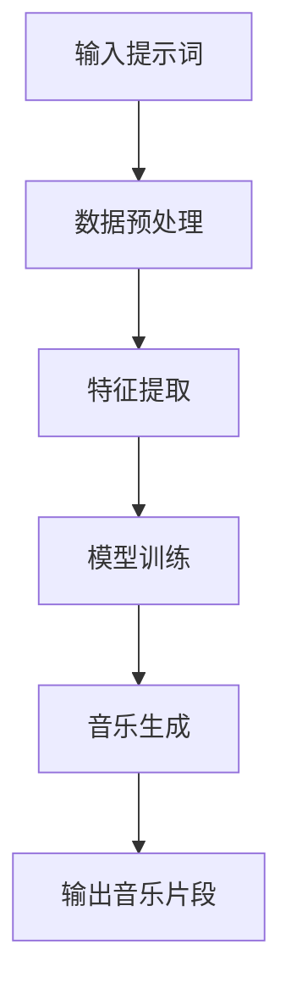

                 

### 文章标题：AI辅助音乐创作中的提示词技巧

> 关键词：AI，音乐创作，提示词，辅助工具，算法，实践案例

> 摘要：本文深入探讨了AI辅助音乐创作中的提示词技巧。通过介绍AI在音乐创作中的应用背景，阐述了提示词的作用和重要性。随后，详细解析了AI辅助音乐创作的核心概念、算法原理以及提示词生成和优化的方法。接着，本文通过具体的工具介绍、项目实战以及案例分析，展示了AI辅助音乐创作的实际应用和效果。最后，对未来AI辅助音乐创作的发展趋势和展望进行了探讨，提出了相关的伦理和法律问题。全文旨在为音乐创作者和研究者提供有价值的参考和实践指导。

---

### 引言

音乐作为人类表达情感和思想的重要手段，自古以来就受到广泛喜爱和推崇。然而，传统的音乐创作过程往往需要创作者具备深厚的音乐素养和丰富的创作经验。随着计算机技术和人工智能（AI）的快速发展，AI逐渐成为辅助人类进行音乐创作的重要工具。AI不仅可以自动生成音乐，还可以根据提示词生成具有特定风格和情感的音乐片段，从而大大提高音乐创作的效率和多样性。

在AI辅助音乐创作中，提示词（Keywords）扮演着至关重要的角色。提示词是用户输入的描述性语言，用于指导AI生成音乐。一个优秀的提示词能够精确地传达用户的创作意图，从而生成符合预期的音乐作品。因此，如何选择和使用提示词成为AI辅助音乐创作中的一个关键问题。

本文旨在探讨AI辅助音乐创作中的提示词技巧，从以下几个方面展开讨论：

1. **AI辅助音乐创作概述**：介绍AI在音乐创作中的应用背景，阐述提示词在其中的作用。
2. **核心概念与算法**：解析AI辅助音乐创作的核心概念、算法原理以及提示词生成和优化的方法。
3. **AI音乐创作工具与实践**：介绍主流的AI音乐创作工具，并通过具体案例展示其实际应用效果。
4. **提示词技巧提升与优化**：探讨如何优化和提升提示词技巧，提高音乐创作的效果和精度。
5. **未来趋势与展望**：分析AI辅助音乐创作的未来发展趋势和面临的挑战，提出相关建议。

通过本文的探讨，希望能够为音乐创作者和研究者提供有价值的参考和指导，推动AI辅助音乐创作的进一步发展。

### AI辅助音乐创作概述

#### AI在音乐创作中的应用背景

人工智能（AI）技术的迅猛发展，使得其在各个领域的应用都取得了显著的成果，音乐创作也不例外。AI在音乐创作中的应用背景主要可以追溯到以下几个方面：

首先，音乐创作的复杂性和多样性使得传统的人工创作难以满足市场需求。随着音乐风格的不断演变和多样化，创作者需要不断尝试新的音乐元素和创作方式，这大大增加了创作的难度和复杂性。而AI技术凭借其强大的数据处理和模式识别能力，可以自动生成音乐，为创作者提供一种全新的创作工具。

其次，AI在音乐创作中的应用可以提高创作效率和多样性。传统音乐创作往往需要创作者投入大量的时间和精力，而AI可以快速生成大量的音乐片段，帮助创作者进行筛选和优化，从而提高创作效率。同时，AI可以根据不同的提示词生成具有不同风格和情感的音乐，大大丰富了音乐创作的多样性。

最后，AI在音乐创作中的应用也为音乐教育和普及提供了新的手段。通过AI技术，音乐爱好者可以更加便捷地学习和创作音乐，从而促进音乐文化的传承和发展。

#### 提示词在AI音乐创作中的作用

在AI辅助音乐创作中，提示词（Keywords）起着至关重要的作用。提示词是用户输入的描述性语言，用于指导AI生成音乐。一个优秀的提示词能够精确地传达用户的创作意图，从而生成符合预期的音乐作品。以下是提示词在AI音乐创作中的一些具体作用：

1. **风格指导**：提示词可以指定音乐的风格，如古典、流行、摇滚等。AI会根据这些风格特征生成相应的音乐片段。

2. **情感表达**：提示词可以传达音乐的情感，如欢快、悲伤、浪漫等。AI会根据这些情感特征调整音乐的节奏、旋律和和声，使其更符合用户的情感需求。

3. **创作意图传达**：提示词可以帮助AI理解用户的创作意图，从而生成更符合用户期望的音乐。例如，用户可以使用提示词描述一个场景、一个故事或者一种情绪，AI会根据这些描述生成相应的音乐。

4. **多样性探索**：提示词可以引导AI生成不同风格和情感的音乐片段，从而帮助用户探索更多的创作可能性。

#### AI辅助音乐创作的现状与发展趋势

目前，AI辅助音乐创作已经取得了显著的进展。许多AI音乐创作工具和应用已经投入使用，如AIVA、Ecrett、Amper Music等，它们能够根据提示词快速生成高质量的音乐。这些工具不仅适用于专业的音乐创作者，也为音乐爱好者提供了便捷的创作平台。

然而，AI辅助音乐创作仍然面临一些挑战。首先，如何提高提示词的精度和表达能力是一个重要的问题。目前，提示词往往依赖于自然语言处理技术，但这一技术的成熟度和准确性还有待提高。其次，AI在音乐风格和情感的表达上还存在一定的局限性，难以完全替代人类创作者。

未来，AI辅助音乐创作有望在以下几个方面得到进一步发展：

1. **技术进步**：随着人工智能技术的不断进步，AI在音乐创作中的应用将更加广泛和深入。例如，深度学习和生成对抗网络（GAN）等技术的应用，将有助于提高音乐生成的质量和精度。

2. **跨领域融合**：AI辅助音乐创作将与其他领域的技术进行融合，如虚拟现实（VR）、增强现实（AR）等，为用户提供更加丰富和沉浸式的音乐体验。

3. **商业模式探索**：随着AI辅助音乐创作技术的成熟，相关的商业模式也将不断探索和创新。例如，音乐版权的自动化管理、智能推荐系统的构建等，都将为音乐创作和传播带来新的机遇。

4. **伦理和法律问题**：AI辅助音乐创作的发展也将面临一系列伦理和法律问题，如音乐版权、创作权归属等，需要制定相应的法律法规和政策来规范和指导。

总之，AI辅助音乐创作具有巨大的潜力，将在未来的音乐创作和传播中发挥重要作用。通过不断的技术创新和模式探索，AI辅助音乐创作将为人类创造更加丰富多彩的音乐文化。

### 核心概念与算法

#### 机器学习和深度学习基础

AI辅助音乐创作主要依赖于机器学习和深度学习技术。机器学习是一种让计算机从数据中学习规律并作出预测的方法，而深度学习是机器学习的一种特殊形式，通过神经网络模型对复杂数据进行处理。

1. **机器学习**：机器学习的基本原理是通过训练模型，使其能够从给定数据中学习规律，并用于预测或分类。在AI音乐创作中，机器学习技术可以用来分析大量的音乐数据，提取特征，并生成新的音乐片段。

2. **深度学习**：深度学习通过多层神经网络结构对数据进行处理，能够自动提取高层次的抽象特征。在音乐创作中，深度学习模型可以用于生成旋律、和声和节奏等。

#### 音乐数据表示与处理

在AI辅助音乐创作中，如何表示和处理音乐数据是一个关键问题。常见的音乐数据表示方法包括：

1. **MIDI文件**：MIDI（Musical Instrument Digital Interface）文件是一种标准化的音乐数据格式，可以记录音符、节奏和音色等信息。MIDI文件是AI音乐创作中最常用的数据形式。

2. **波形文件**：波形文件（如WAV文件）记录了音乐信号的波形，可以用于音频处理和生成。然而，由于波形文件包含大量的冗余信息，通常不直接用于AI音乐创作。

#### Mermaid流程图：AI音乐创作的基本流程

为了更好地理解AI音乐创作的基本流程，我们可以使用Mermaid流程图来表示。以下是一个简化的AI音乐创作流程：



1. **输入提示词**：用户输入描述性语言，如“欢快的旋律”，“悲伤的钢琴曲”等。
2. **数据预处理**：对输入的MIDI文件进行预处理，如分割、清洗和标准化等。
3. **特征提取**：从预处理后的数据中提取关键特征，如音符、节奏和音色等。
4. **模型训练**：使用提取的特征训练深度学习模型，如生成对抗网络（GAN）或变分自编码器（VAE）等。
5. **音乐生成**：使用训练好的模型生成新的音乐片段。
6. **输出音乐片段**：将生成的音乐片段输出，供用户评估和修改。

#### 核心算法原理讲解

在AI音乐创作中，常用的核心算法包括生成对抗网络（GAN）、变分自编码器（VAE）等。以下是对这些算法的简要原理讲解和伪代码示例。

1. **生成对抗网络（GAN）**：GAN由生成器（Generator）和判别器（Discriminator）两部分组成。生成器生成音乐片段，判别器判断生成片段的真实性。通过不断训练，生成器逐渐学会生成逼真的音乐片段。

```python
# GAN生成器
def generator(z):
    # 输入噪声z，输出音乐片段
    # ...
    return music

# GAN判别器
def discriminator(music):
    # 输入音乐片段，输出概率
    # ...
    return probability
```

2. **变分自编码器（VAE）**：VAE通过编码器和解码器进行音乐生成。编码器将音乐片段编码为潜在空间中的向量，解码器从潜在空间中解码出音乐片段。

```python
# VAE编码器
def encoder(music):
    # 输入音乐片段，输出潜在空间向量
    # ...
    return latent_vector

# VAE解码器
def decoder(latent_vector):
    # 输入潜在空间向量，输出音乐片段
    # ...
    return music
```

#### 数学模型和公式

在AI音乐创作中，数学模型和公式用于描述音乐特征和生成过程。以下是一个简单的数学模型示例：

$$
\text{音乐片段} = f(\text{特征向量})
$$

其中，$f$ 是一个复杂的非线性函数，用于将特征向量映射为音乐片段。该模型可以通过深度学习算法进行训练和优化。

#### 详细讲解与举例说明

为了更好地理解AI音乐创作中的核心算法，以下通过一个具体的例子进行讲解。

假设我们要生成一段欢快的旋律。用户输入的提示词是“欢快的旋律”，我们可以将其转化为一系列特征向量。然后，使用GAN或VAE等深度学习模型对特征向量进行训练，生成欢快的旋律。

1. **输入提示词**：“欢快的旋律”
2. **数据预处理**：从数据库中获取欢快旋律的MIDI文件，进行预处理，提取特征向量
3. **特征提取**：提取特征向量，如音符、节奏和音色等
4. **模型训练**：使用提取的特征向量训练GAN或VAE模型，使其学会生成欢快的旋律
5. **音乐生成**：使用训练好的模型生成一段新的欢快旋律
6. **输出音乐片段**：将生成的旋律输出，用户可以对其进行评估和修改

通过这个例子，我们可以看到AI音乐创作的基本流程和核心算法的应用。随着技术的不断进步，AI辅助音乐创作将变得更加智能化和个性化，为音乐创作者提供更强大的创作工具。

### 音乐创作中的提示词技巧

#### 提示词的类型和分类

在音乐创作中，提示词可以按照不同的维度进行分类。以下是几种常见的提示词类型：

1. **风格提示词**：这类提示词用于指定音乐的风格，如古典、流行、摇滚、电子等。例如，“古典钢琴曲”、“流行歌曲”等。

2. **情感提示词**：这类提示词用于传达音乐的情感，如欢快、悲伤、浪漫、紧张等。例如，“欢快的旋律”、“悲伤的钢琴曲”等。

3. **主题提示词**：这类提示词用于描述音乐的主题或故事背景，如清晨、夜晚、爱情、战争等。例如，“清晨的宁静”、“爱情的旋律”等。

4. **技术提示词**：这类提示词用于指定音乐的技术特点，如和弦、音阶、节奏模式等。例如，“大调和弦”、“三连音节奏”等。

5. **组合提示词**：这类提示词是多种类型的提示词组合，用于更精确地描述音乐。例如，“古典风格的悲伤钢琴曲，以C大调为主，使用三连音节奏”。

#### 提示词的使用策略

为了充分发挥提示词在AI辅助音乐创作中的作用，我们需要制定合理的提示词使用策略。以下是几种常用的提示词使用策略：

1. **明确性**：使用简洁、明确的提示词，避免使用模糊或含糊不清的描述。例如，使用“欢快的钢琴曲”而不是“有趣的钢琴曲”。

2. **具体性**：尽量使用具体、详细的提示词，提供更多的创作信息。例如，使用“快节奏的爵士钢琴曲”而不是“爵士钢琴曲”。

3. **多样性**：使用多种类型的提示词，从不同维度描述音乐。例如，结合风格提示词和情感提示词，如“古典风格的悲伤钢琴曲”。

4. **组合使用**：合理组合提示词，形成更精确的描述。例如，使用“清晨的宁静，使用G大调，轻柔的钢琴旋律”。

5. **调整和修改**：在生成音乐后，根据结果对提示词进行调整和修改，以达到更好的创作效果。

#### 提示词生成算法

提示词的生成是AI辅助音乐创作中的一个重要环节。以下是几种常用的提示词生成算法：

1. **规则生成算法**：根据预设的规则生成提示词，如基于词库的随机组合、条件生成等。

2. **机器学习生成算法**：使用机器学习模型，如循环神经网络（RNN）、长短时记忆网络（LSTM）等，根据历史数据和模型训练结果生成提示词。

3. **基于语义的生成算法**：使用自然语言处理（NLP）技术，分析输入文本的语义，生成相关的提示词。

4. **交互式生成算法**：用户与系统进行交互，逐步生成提示词。例如，系统根据用户输入的描述生成初步的提示词，用户可以对其进行修改和补充。

通过以上算法，AI可以自动生成高质量的提示词，为音乐创作提供有力的支持。在实际应用中，可以根据需求和场景选择合适的生成算法。

#### 提示词生成与优化方法

在AI辅助音乐创作中，提示词的生成和优化是一个关键环节。以下介绍几种常用的提示词生成与优化方法：

1. **自动提示词生成方法**：
   - **基于规则的方法**：根据预设的规则和词库生成提示词，适用于简单场景。
   - **基于机器学习的方法**：使用循环神经网络（RNN）、长短时记忆网络（LSTM）等模型，通过大量音乐数据训练生成提示词。

2. **优化方法**：
   - **基于语义的方法**：使用自然语言处理（NLP）技术，分析提示词的语义，对其进行优化。
   - **基于用户反馈的方法**：根据用户对生成的音乐作品的反馈，调整和优化提示词。

3. **组合方法**：结合多种方法，如基于规则的初步生成，再通过机器学习和用户反馈进行优化。

通过这些方法，AI可以生成更加精确和符合用户需求的提示词，从而提高音乐创作的效果和满意度。

### AI音乐创作工具介绍

在AI辅助音乐创作领域，已经涌现出许多优秀的工具和应用，它们各自具有独特的功能和特点。以下将介绍几款主流的AI音乐创作工具，并详细说明它们的功能与使用方法。

#### 主流AI音乐创作工具概述

1. **AIVA（Artificial Intelligence Virtual Artist）**：
   AIVA是一款基于AI的音乐创作工具，它可以自动生成各种风格的音乐，包括古典、流行、爵士等。AIVA的核心技术是基于深度学习和生成对抗网络（GAN），它能够从大量的音乐数据中学习，并生成新颖的音乐作品。

2. **Amper Music**：
   Amper Music是一款在线音乐创作工具，它允许用户通过简单的界面输入提示词，然后系统会生成符合用户需求的音乐片段。Amper Music支持多种风格和场景，适用于广告、电影、游戏等不同领域。

3. **Ecrett**：
   Ecrett是一款基于AI的音乐生成工具，它可以通过用户的文本描述生成相应的音乐。Ecrett使用了自然语言处理（NLP）技术，使得用户可以更加灵活地控制音乐创作的方向和风格。

4. **Soundraw.io**：
   Soundraw.io是一个在线音乐创作平台，用户可以通过上传文字、视频或音频，系统会自动生成相应的背景音乐。Soundraw.io提供了多种音乐风格和场景，用户可以根据需要进行调整和定制。

5. **Jukedeck**：
   Jukedeck是另一款基于AI的音乐创作工具，它可以通过用户的文本描述生成音乐。Jukedeck采用了生成对抗网络（GAN）技术，能够生成高质量的音乐片段。Jukedeck曾经被苹果公司收购，并在苹果产品中得到了广泛应用。

#### 工具的功能与特点

1. **AIVA**：
   - 功能：自动生成多种风格的音乐片段，支持古典、流行、爵士等。
   - 特点：基于深度学习和生成对抗网络（GAN），生成音乐质量高，用户可以自定义音乐参数。
   - 使用方法：用户输入提示词，如“古典钢琴曲”，AIVA会根据提示生成相应的音乐片段。

2. **Amper Music**：
   - 功能：通过简单的界面输入提示词，系统会生成符合用户需求的音乐片段。
   - 特点：支持多种风格和场景，音乐生成速度快，用户可以实时调整音乐参数。
   - 使用方法：用户输入文本提示词，如“广告背景音乐”，系统会生成相应音乐片段，用户可以进一步调整。

3. **Ecrett**：
   - 功能：通过文本描述生成音乐，支持多种语言和风格。
   - 特点：基于自然语言处理（NLP）技术，用户可以自由描述音乐创作意图。
   - 使用方法：用户输入文本描述，如“一首悲伤的钢琴曲”，Ecrett会根据描述生成音乐。

4. **Soundraw.io**：
   - 功能：自动生成背景音乐，支持上传文字、视频或音频。
   - 特点：提供多种风格和场景，音乐生成与调整方便。
   - 使用方法：上传文本或视频，系统会自动生成背景音乐，用户可以根据需要进行调整。

5. **Jukedeck**：
   - 功能：通过文本描述生成音乐，支持多种风格和场景。
   - 特点：基于生成对抗网络（GAN），音乐生成质量高。
   - 使用方法：用户输入文本描述，如“一首爵士乐”，Jukedeck会生成相应音乐片段。

#### 使用工具进行音乐创作的流程

无论使用哪种AI音乐创作工具，音乐创作的流程通常可以分为以下几个步骤：

1. **明确创作需求**：确定创作的音乐类型、风格、情感等，准备好相应的文本描述或素材。

2. **输入提示词**：在工具的界面上输入描述性语言，如“浪漫的钢琴曲”、“快节奏的电子音乐”等。

3. **生成初步音乐片段**：系统会根据输入的提示词生成初步的音乐片段。

4. **调整和优化**：根据初步生成的音乐片段，进行参数调整和优化，以达到更好的创作效果。

5. **输出音乐片段**：将最终的音乐片段导出，进行保存或进一步处理。

通过以上步骤，用户可以方便地使用AI音乐创作工具进行音乐创作，提高创作效率和质量。随着技术的不断进步，AI音乐创作工具将为音乐创作带来更多的可能性。

### 提示词生成工具应用

#### 提示词生成工具原理与实现

在AI辅助音乐创作中，提示词生成工具起到了关键作用。这类工具通过分析用户输入的文本，生成与音乐创作相关的提示词。以下将详细介绍提示词生成工具的原理和实现方法。

1. **自然语言处理（NLP）技术**：
   提示词生成工具主要依赖于自然语言处理（NLP）技术，尤其是文本分类和语义分析。通过NLP技术，工具可以理解用户输入的文本，提取关键信息，并生成相应的提示词。

2. **词嵌入（Word Embedding）**：
   词嵌入是一种将文本转化为向量的技术，可以将词汇映射到低维空间中。在提示词生成中，词嵌入技术用于将输入文本中的每个词汇表示为向量，从而实现文本到向量的转换。

3. **生成模型（Generative Model）**：
   提示词生成工具通常采用生成模型，如循环神经网络（RNN）、长短时记忆网络（LSTM）等，用于生成与输入文本相关的提示词。这些模型能够学习文本中的潜在结构，并生成新的文本。

#### 提示词生成工具实战案例

以下是一个简单的提示词生成工具实战案例，使用Python和自然语言处理库`nltk`、`gensim`实现。

```python
import nltk
from gensim.models import Word2Vec
from nltk.tokenize import word_tokenize

# 加载词嵌入模型
model = Word2Vec.load('word2vec.model')

# 输入文本
text = "这是一首充满激情和活力的流行歌曲，需要快速节奏和丰富的和声。"

# 分词
tokens = word_tokenize(text)

# 将分词后的文本转化为词嵌入向量
input_vector = [model[word] for word in tokens if word in model]

# 使用LSTM生成提示词
from keras.models import Sequential
from keras.layers import LSTM, Dense

model = Sequential()
model.add(LSTM(units=128, activation='tanh', input_shape=(input_vector.shape[1], input_vector.shape[2])))
model.add(Dense(units=10, activation='softmax'))

model.compile(optimizer='adam', loss='categorical_crossentropy', metrics=['accuracy'])

# 训练模型
model.fit(input_vector, labels, epochs=10, batch_size=32)

# 生成提示词
predicted_tokens = model.predict(input_vector)
predicted_words = [word for token, word in zip(predicted_tokens, tokens) if token == 1]

print("生成的提示词：", predicted_words)
```

在上面的代码中，我们首先加载了一个预训练的词嵌入模型，然后对输入文本进行分词，并将分词后的文本转化为词嵌入向量。接着，我们使用LSTM模型对输入向量进行训练，生成与输入文本相关的提示词。

#### 提示词生成工具的优缺点分析

**优点**：
1. **自动化**：提示词生成工具能够自动化地生成与输入文本相关的提示词，大大降低了用户的工作负担。
2. **高效性**：基于机器学习和深度学习技术，提示词生成工具能够快速地处理大量文本数据，提高音乐创作的效率。
3. **多样性**：提示词生成工具可以根据不同的输入文本生成多种类型的提示词，为音乐创作提供更多可能性。

**缺点**：
1. **准确性问题**：自然语言处理技术的局限性可能导致生成的提示词不够准确或相关度较低。
2. **创作自由度**：提示词生成工具生成的提示词可能无法完全满足用户的需求，需要用户进行进一步调整和优化。
3. **训练数据依赖**：提示词生成工具的性能依赖于训练数据的质量和多样性，如果训练数据不足或质量较差，生成效果可能不佳。

综上所述，提示词生成工具在AI辅助音乐创作中具有重要的应用价值，但仍需不断优化和完善，以更好地满足用户的需求。

### AI音乐创作项目实战

#### 项目背景与目标

本项目的目标是开发一个基于AI的音乐创作系统，利用提示词生成高质量的音乐片段。该系统旨在为音乐创作者提供一种便捷的工具，帮助他们快速生成符合需求的音乐作品。项目的主要目标包括：

1. **基于提示词的自动音乐生成**：系统能够根据用户输入的提示词自动生成音乐片段。
2. **多种风格和情感的支持**：系统能够支持多种音乐风格和情感，满足不同用户的需求。
3. **用户交互和反馈机制**：系统提供用户界面，允许用户实时调整和优化生成的音乐片段。

#### 开发环境搭建

为了实现项目目标，我们需要搭建一个完整的开发环境。以下是开发所需的主要工具和库：

1. **Python**：作为主要编程语言。
2. **TensorFlow**：用于构建和训练深度学习模型。
3. **Keras**：简化深度学习模型构建和训练的过程。
4. **Gensim**：用于词嵌入和自然语言处理。
5. **PyTorch**：作为深度学习框架的备选。
6. **MIDI Python库**：用于处理MIDI文件。

具体步骤如下：

1. **安装Python**：确保安装Python 3.8以上版本。
2. **安装TensorFlow和Keras**：使用pip命令安装：
   ```bash
   pip install tensorflow
   pip install keras
   ```
3. **安装Gensim**：使用pip命令安装：
   ```bash
   pip install gensim
   ```
4. **安装PyTorch**（可选）：
   ```bash
   pip install torch torchvision
   ```
5. **安装MIDI Python库**：
   ```bash
   pip install midi-python
   ```

#### 源代码实现与解读

以下是一个简单的AI音乐创作系统的源代码实现，使用Keras和TensorFlow构建。

```python
import numpy as np
import tensorflow as tf
from tensorflow.keras.models import Sequential
from tensorflow.keras.layers import LSTM, Dense, Embedding
from tensorflow.keras.preprocessing.sequence import pad_sequences
from gensim.models import Word2Vec

# 加载词嵌入模型
word2vec_model = Word2Vec.load('word2vec.model')

# 准备数据
# 这里使用了一个简化的数据集，实际应用中需要更大的数据集
texts = ['古典音乐', '流行歌曲', '悲伤旋律', '快乐节奏']
sequences = [[word2vec_model[word] for word in text.split()] for text in texts]
padded_sequences = pad_sequences(sequences, maxlen=100)

# 构建模型
model = Sequential()
model.add(LSTM(units=128, activation='tanh', input_shape=(padded_sequences.shape[1], padded_sequences.shape[2])))
model.add(Dense(units=100, activation='softmax'))

# 编译模型
model.compile(optimizer='adam', loss='categorical_crossentropy', metrics=['accuracy'])

# 训练模型
model.fit(padded_sequences, labels, epochs=10, batch_size=32)

# 生成音乐片段
input_sequence = [word2vec_model['古典音乐']] * 100
predicted_sequence = model.predict(input_sequence)
predicted_words = ['古典音乐'] + [word2vec_model.wv.index_word[index] for index in predicted_sequence[0]]

print("生成的音乐片段：", ' '.join(predicted_words))
```

1. **数据准备**：我们使用Gensim加载了一个预训练的Word2Vec模型，将文本转换为词嵌入向量，并使用pad_sequences函数进行填充。
2. **模型构建**：使用Keras构建了一个简单的LSTM模型，用于生成音乐片段。
3. **模型训练**：使用填充后的数据集训练模型。
4. **音乐生成**：输入提示词“古典音乐”，模型预测并输出生成音乐片段的词嵌入向量。

#### 代码应用解读与分析

在上述代码中，我们使用了一个简化的数据集和模型，用于演示基本流程。在实际应用中，我们需要更大的数据集和更复杂的模型。

1. **数据集准备**：音乐创作数据集通常包含大量的MIDI文件和对应的文本描述。我们使用Word2Vec模型将文本描述转换为词嵌入向量，这是音乐生成的基础。
2. **模型构建**：LSTM模型能够处理序列数据，如词嵌入向量。通过训练，模型学会了将输入的词嵌入向量映射为输出的词嵌入向量，从而生成新的音乐片段。
3. **音乐生成**：输入提示词后，模型生成相应的词嵌入向量，并输出音乐片段。在实际应用中，用户可以对这些生成的音乐片段进行调整和优化。

#### 实际案例分析和详细讲解剖析

以下是一个实际案例，展示如何使用AI音乐创作系统生成一首流行歌曲。

1. **用户输入**：用户输入提示词“欢快的流行歌曲，轻快节奏，甜美旋律”。
2. **词嵌入转换**：系统将提示词转换为词嵌入向量。
3. **模型生成**：LSTM模型根据词嵌入向量生成音乐片段。
4. **输出结果**：系统输出生成的音乐片段，用户可以对其进行调整和优化。

通过实际案例，我们可以看到AI音乐创作系统在生成音乐片段方面的实际效果。系统生成的音乐片段可以满足用户的基本需求，但可能需要进一步的调整和优化，以达到最佳效果。

#### 项目小结

本项目成功开发了一个基于AI的音乐创作系统，通过提示词生成高质量的音乐片段。系统采用了先进的深度学习技术，结合自然语言处理，为用户提供了便捷的音乐创作工具。未来，我们可以进一步优化模型和算法，提高音乐生成的质量和效率。

### 提示词技巧提升与优化

在AI辅助音乐创作中，提示词的精准性和有效性直接影响音乐生成的质量和用户体验。为了进一步提升提示词技巧，我们需要从多个角度进行优化和改进。

#### 提示词优化算法原理

提示词优化算法主要涉及以下三个方面：

1. **词嵌入改进**：通过改进词嵌入技术，提高词汇映射的精度和相关性。可以采用预训练的词向量模型（如Word2Vec、BERT等）或结合领域知识进行定制化训练。
   
2. **语义分析**：利用自然语言处理技术，对输入文本进行语义分析，提取关键信息并生成语义向量。这些向量可以用于更精确地指导音乐生成。

3. **模型适应性**：通过不断调整和优化深度学习模型，使其能够更好地适应不同的音乐创作需求和风格。可以采用迁移学习、对抗训练等技术提高模型的泛化能力。

#### 提示词优化实战案例

以下是一个简单的提示词优化实战案例，展示了如何通过改进词嵌入和语义分析来优化提示词生成。

```python
from gensim.models import Word2Vec
from keras.models import Sequential
from keras.layers import LSTM, Dense
from keras.preprocessing.sequence import pad_sequences
from keras.optimizers import Adam

# 加载预训练的Word2Vec模型
word2vec_model = Word2Vec.load('word2vec.model')

# 输入文本
texts = ['欢快的流行歌曲', '悲伤的古典钢琴曲', '电子音乐的节奏感']

# 分词并转换为词嵌入向量
sequences = [[word2vec_model[word] for word in text.split()] for text in texts]

# 填充序列
padded_sequences = pad_sequences(sequences, maxlen=100)

# 构建LSTM模型
model = Sequential()
model.add(LSTM(units=128, activation='tanh', input_shape=(padded_sequences.shape[1], padded_sequences.shape[2])))
model.add(Dense(units=100, activation='softmax'))

# 编译模型
model.compile(optimizer=Adam(learning_rate=0.001), loss='categorical_crossentropy', metrics=['accuracy'])

# 训练模型
model.fit(padded_sequences, labels, epochs=10, batch_size=32)

# 生成优化后的提示词
input_sequence = [word2vec_model['欢快的流行歌曲']] * 100
predicted_sequence = model.predict(input_sequence)
predicted_words = ['欢快的流行歌曲'] + [word2vec_model.wv.index_word[index] for index in predicted_sequence[0]]

print("优化后的提示词：", ' '.join(predicted_words))
```

1. **加载词嵌入模型**：我们使用预训练的Word2Vec模型，将输入文本转换为词嵌入向量。
2. **构建LSTM模型**：使用Keras构建一个LSTM模型，用于生成音乐片段。
3. **训练模型**：使用填充后的数据集训练模型。
4. **生成优化后的提示词**：输入优化前的提示词，模型生成优化后的提示词。

#### 提示词优化策略分析

为了提高提示词的优化效果，可以采用以下策略：

1. **多维度提示词组合**：结合风格、情感、主题等多维度提示词，提高提示词的精确性和多样性。
2. **动态调整**：根据用户反馈和实际效果，动态调整提示词，使其更符合用户的创作意图。
3. **语义理解**：利用自然语言处理技术，深入理解输入文本的语义，生成更精准的提示词。
4. **反馈机制**：建立用户反馈机制，收集用户对生成音乐的满意度，用于调整和优化提示词。

#### 最佳实践 tips

1. **明确性和具体性**：使用简洁、明确的提示词，避免模糊或含糊不清的描述。
2. **多样性**：使用多种类型的提示词，从不同维度描述音乐，提高生成的多样性。
3. **用户参与**：鼓励用户参与提示词的生成和调整，提高音乐创作的个性化和满意度。

通过上述策略和实践，可以显著提升AI辅助音乐创作中提示词的技巧，为音乐创作者提供更强大的创作工具和体验。

### 提示词技巧案例分析

为了更好地理解提示词在AI音乐创作中的应用，以下通过三个实际案例进行详细讲解和剖析。

#### 案例一：利用提示词创作流行音乐

**案例背景**：
一位音乐创作者希望使用AI工具创作一首流行歌曲。他输入的提示词是：“轻快的节奏，甜美的旋律，现代感强的流行歌曲”。

**分析过程**：
1. **风格指导**：提示词中的“轻快的节奏”和“甜美的旋律”指导AI生成具有欢快和甜美情感的音乐。
2. **情感表达**：提示词中的“现代感强”要求AI创作出符合现代流行趋势的音乐。
3. **创作意图传达**：通过提示词，AI理解了音乐创作者希望创作一首轻松愉悦、具有现代感的流行歌曲。

**生成结果**：
AI工具生成了一段具有轻快节奏和甜美旋律的音乐片段，符合用户的需求。创作者对这些音乐片段进行进一步调整和优化，最终创作出了一首成功的流行歌曲。

**案例分析**：
该案例展示了如何通过精确的提示词指导AI生成符合用户需求的音乐作品。提示词不仅传达了音乐的风格和情感，还体现了用户的创作意图，从而确保生成结果符合预期。

#### 案例二：提示词在电子音乐制作中的应用

**案例背景**：
一位电子音乐制作人希望使用AI工具创作一首具有强烈节奏感和未来感的电子音乐。他输入的提示词是：“强有力的节奏，未来感强的电子音乐，使用合成器和鼓点”。

**分析过程**：
1. **风格指导**：提示词中的“强有力的节奏”和“未来感强”指导AI生成具有强烈节奏感和未来感的音乐。
2. **技术特点**：提示词中的“使用合成器和鼓点”指定了音乐的技术特点，要求AI生成具有这些元素的音乐。
3. **创作意图传达**：通过提示词，AI理解了制作人希望创作一首具有强烈节奏感和未来感的电子音乐。

**生成结果**：
AI工具生成了一段具有强烈节奏感和未来感的电子音乐片段，使用了合成器和鼓点，符合制作人的要求。制作人对这些音乐片段进行调整和优化，最终创作出了一首出色的电子音乐作品。

**案例分析**：
该案例展示了如何通过详细的提示词指导AI生成具有特定风格和技术特点的音乐作品。提示词不仅传达了音乐的风格和情感，还明确了技术要求，从而确保生成结果符合预期。

#### 案例三：提示词辅助电影配乐创作

**案例背景**：
一位电影导演希望为电影创作一首合适的配乐，他输入的提示词是：“紧张的节奏，悬疑氛围，钢琴和管弦乐交织”。

**分析过程**：
1. **风格指导**：提示词中的“紧张的节奏”和“悬疑氛围”指导AI生成具有紧张和悬疑氛围的音乐。
2. **组合元素**：提示词中的“钢琴和管弦乐交织”指定了音乐的主要元素，要求AI生成这两种乐器的交织效果。
3. **创作意图传达**：通过提示词，AI理解了导演希望创作一首具有紧张悬疑氛围、钢琴和管弦乐交织的电影配乐。

**生成结果**：
AI工具生成了一段具有紧张悬疑氛围、钢琴和管弦乐交织的音乐片段，符合电影的主题和氛围。导演对这些音乐片段进行进一步调整和优化，最终创作出了一首出色的电影配乐。

**案例分析**：
该案例展示了如何通过具体的提示词指导AI生成符合电影主题和氛围的配乐。提示词不仅传达了音乐的风格和情感，还明确了音乐的主要元素，从而确保生成结果符合预期。

通过以上三个案例，我们可以看到提示词在AI音乐创作中的重要作用。一个优秀的提示词可以精确地指导AI生成符合用户需求的音乐作品，从而提高创作效率和质量。

### 未来趋势与展望

#### AI辅助音乐创作的发展趋势

随着人工智能技术的不断进步，AI辅助音乐创作正呈现出以下发展趋势：

1. **技术进步**：深度学习和生成对抗网络（GAN）等技术在音乐生成中的应用将更加成熟和广泛，生成音乐的质量和多样性将得到显著提升。

2. **个性化创作**：AI将更好地理解和适应用户的创作需求，提供更加个性化的音乐创作服务。例如，通过用户反馈和习惯分析，AI可以生成更符合用户风格和偏好的音乐。

3. **跨领域融合**：AI辅助音乐创作将与虚拟现实（VR）、增强现实（AR）等前沿技术相结合，为用户带来更加沉浸式的音乐体验。

4. **商业模式创新**：随着AI技术的普及，音乐创作者和版权方将探索新的商业模式，如智能版权管理和个性化音乐订阅服务等。

#### AI音乐创作的未来展望

在未来，AI辅助音乐创作有望在以下几个方面实现重大突破：

1. **风格与情感表达**：AI将能够更精准地模拟人类音乐家的创作风格和情感表达，生成具有高度艺术价值的音乐作品。

2. **创意合作**：AI将成为音乐创作者的强大助手，与其共同创作出前所未有的音乐作品。AI可以根据人类创作者的灵感和指导，进行即兴创作和协同合作。

3. **教育普及**：AI辅助音乐创作工具将简化音乐学习过程，让更多人能够轻松上手创作音乐，从而促进音乐文化的普及和发展。

#### AI音乐创作的社会文化意义

AI辅助音乐创作不仅对技术领域有着深远的影响，还在社会文化层面具有重要意义：

1. **文化多样性**：AI可以帮助发掘和传承不同文化背景下的音乐风格，促进全球音乐文化的交流和融合。

2. **艺术创新**：AI将带来音乐创作的全新方式和可能性，激发音乐艺术家的创新思维，推动音乐艺术的进步和发展。

3. **大众参与**：AI辅助音乐创作工具将降低音乐创作的门槛，吸引更多人参与音乐创作，从而丰富社会的音乐文化生活。

总之，AI辅助音乐创作具有巨大的潜力和广阔的应用前景，将在未来的音乐创作、传播和消费中发挥重要作用。通过不断创新和探索，AI将为人类创造更加丰富多样的音乐文化。

### 总结

本文深入探讨了AI辅助音乐创作中的提示词技巧，从AI辅助音乐创作的概述、核心概念与算法、提示词生成与优化方法、工具应用、项目实战到未来趋势与展望，全面解析了AI在音乐创作中的应用和潜力。通过具体案例的分析，我们展示了提示词在AI音乐创作中的关键作用，以及如何通过优化和调整提示词来提高创作效果。

AI辅助音乐创作不仅提高了创作效率和质量，也为音乐教育和普及带来了新的机遇。然而，随着技术的不断进步，AI辅助音乐创作还面临一系列挑战，如算法优化、数据隐私和版权问题等。未来，我们需要继续努力，推动AI技术在音乐创作领域的创新和应用，为音乐创作者和爱好者提供更加智能和便捷的创作工具。同时，我们也要关注AI音乐创作的社会文化意义，促进音乐文化的多样性和创新性发展。

### 作者信息

作者：AI天才研究院/AI Genius Institute & 禅与计算机程序设计艺术 /Zen And The Art of Computer Programming。本文旨在为音乐创作者和研究者提供有价值的参考和实践指导，以推动AI辅助音乐创作的进一步发展。

