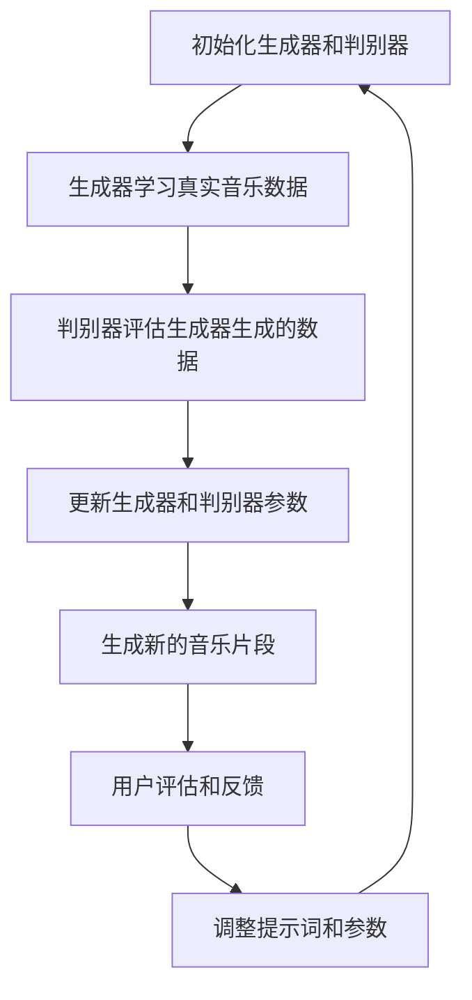

                 


### 背景介绍

音乐是人类文明的重要组成部分，从古代的口口相传到现代的电子合成，音乐创作一直伴随着人类的发展。然而，传统的音乐创作方式主要依赖于创作者的个人经验和技巧，这不仅限制了音乐的创新性，也使得音乐创作过程变得繁琐和漫长。随着人工智能（AI）技术的不断发展，AI辅助音乐创作逐渐成为一种新的音乐创作方式，它不仅提高了音乐创作的效率，还为音乐创作注入了新的活力。

AI辅助音乐创作主要利用机器学习和深度学习等技术，通过分析大量的音乐数据，自动生成音乐旋律、和声和节奏，甚至能够根据用户的提示生成个性化的音乐作品。这种方式不仅能够帮助音乐创作者节省时间，还能够激发出创作者的创意潜力。然而，要实现高效的AI辅助音乐创作，关键在于提示词的设计。提示词是用户与AI系统进行交互的桥梁，它能够引导AI系统生成符合用户期望的音乐作品。

本文将围绕AI辅助音乐创作的提示词设计展开讨论，首先介绍AI辅助音乐创作的概念和基本原理，然后详细探讨提示词设计的方法和技巧，接着通过案例分析说明如何利用提示词进行音乐创作，并进一步探讨AI辅助音乐创作的应用场景。随后，本文将介绍提示词设计的数学模型和优化方法，最后对AI辅助音乐创作工具进行介绍，并展望未来的发展趋势和挑战。

通过本文的阅读，读者将能够深入了解AI辅助音乐创作的技术原理，掌握提示词设计的核心技巧，并能够独立进行AI辅助音乐创作的实践。

### 关键词

1. **AI辅助音乐创作**
2. **提示词设计**
3. **自然语言处理**
4. **生成模型**
5. **音乐理论基础**
6. **音乐结构**
7. **生成对抗网络（GANs）**
8. **波函数网络（WaveNet）**
9. **机器学习**
10. **深度学习**

### 摘要

本文旨在探讨AI辅助音乐创作的提示词设计技巧，详细分析了AI在音乐创作中的应用场景和基本原理。首先，文章介绍了AI辅助音乐创作的核心概念和提示词设计的基础知识，包括自然语言处理和音乐理论基础。接着，文章通过具体案例，展示了如何利用提示词进行音乐创作，并探讨了AI辅助音乐创作的实际应用场景。随后，文章深入介绍了提示词设计的数学模型和优化方法，最后对当前AI辅助音乐创作工具进行了介绍，并展望了未来的发展趋势和挑战。通过本文的阅读，读者将能够掌握AI辅助音乐创作的关键技巧，为实践提供有力指导。

### 第1章: AI辅助音乐创作概述

#### 1.1 AI辅助音乐创作的定义与基本概念

AI辅助音乐创作，指的是利用人工智能技术，如机器学习、深度学习和生成模型，来辅助或完全取代人类音乐创作过程的一种新型音乐创作方式。AI辅助音乐创作不仅仅是简单地自动化某些音乐制作步骤，而是通过理解和模拟人类音乐创作的思维方式，实现音乐创作的自动化和个性化。

在AI辅助音乐创作中，核心的概念包括生成模型、提示词、自然语言处理和音乐理论基础。生成模型是AI辅助音乐创作的重要工具，例如生成对抗网络（GANs）和波函数网络（WaveNet），这些模型能够生成连贯且具有一定艺术性的音乐作品。提示词则是用户与AI系统交互的桥梁，通过设定特定的提示词，AI系统能够更好地理解用户的创作意图，并生成符合预期的音乐。

自然语言处理（NLP）是AI辅助音乐创作的重要组成部分。NLP技术使得AI系统能够理解和处理人类语言，从而能够接受用户的文本输入，生成相应的音乐内容。音乐理论基础则提供了音乐创作的基本框架，包括音符、和弦、节奏和旋律结构等，这些理论帮助AI系统生成符合音乐规则和逻辑的音乐作品。

#### 1.2 AI在音乐创作中的应用场景

AI在音乐创作中的应用场景非常广泛，主要包括以下几个方面：

1. **音乐生成**：通过生成模型，如GANs和WaveNet，AI能够生成全新的音乐旋律和和声。这些生成模型能够从大量的音乐数据中学习，并生成具有一定风格和连贯性的音乐作品。

2. **辅助创作**：AI可以辅助人类音乐创作者进行创作，例如提供灵感和创意，生成旋律、和声和节奏等元素，供人类创作者参考和修改。

3. **音乐编辑**：AI可以帮助音乐制作人进行音乐编辑工作，如自动填充和声、调整节奏和音高，甚至进行音乐混合和音效处理。

4. **音乐教育与学习**：AI可以用于音乐教育和学习，例如通过交互式系统帮助学生练习音乐理论，提供个性化的音乐学习建议。

5. **虚拟歌手与演唱**：利用AI技术，可以创建虚拟歌手，通过合成语音和音乐，实现虚拟演唱。这些虚拟歌手可以在虚拟舞台、游戏和电影中表演，为用户带来全新的娱乐体验。

6. **音乐推荐与个性化服务**：AI可以通过分析用户的音乐偏好和历史，推荐符合用户口味的音乐作品，提供个性化的音乐体验。

#### 1.3 提示词设计在AI辅助音乐创作中的作用

提示词是AI辅助音乐创作中至关重要的元素。它们不仅能够引导AI系统生成特定的音乐内容，还能够影响音乐的风格、情感和结构。一个设计良好的提示词能够使AI系统更好地理解用户的意图，从而生成更符合预期和创意的音乐作品。

提示词的设计需要考虑多个因素，包括自然语言处理的基础、音乐理论基础和用户交互需求。首先，自然语言处理技术使得AI能够理解和处理文本输入，这为提示词的设计提供了基础。通过NLP技术，AI可以识别文本中的关键词、情感和语境，从而生成相关的音乐元素。

其次，音乐理论基础为提示词设计提供了指导。了解音符、和弦、节奏和旋律结构等基本音乐理论，能够帮助设计出具有逻辑和艺术性的提示词。例如，通过设定特定的音符组合或和声变化，可以引导AI生成具有特定情感的音乐。

最后，用户交互需求是提示词设计的重要考虑因素。用户的需求和偏好会直接影响提示词的设计。通过收集和分析用户的反馈，可以不断优化和调整提示词，使其更加符合用户的需求。

综上所述，AI辅助音乐创作是一个多维度、跨学科的领域。理解AI辅助音乐创作的定义和基本概念，掌握提示词设计的方法和技巧，以及熟悉其在不同应用场景中的实际应用，对于从事音乐创作和AI研究的人来说都具有重要意义。通过本章的介绍，读者将为进一步学习和实践AI辅助音乐创作打下坚实的基础。

#### 音乐创作中的AI技术

在AI辅助音乐创作中，生成模型扮演着至关重要的角色。生成模型通过学习大量音乐数据，能够自动生成新的音乐作品，从而极大地丰富了音乐创作的可能性。本文将详细探讨两种常用的生成模型：生成对抗网络（GANs）和波函数网络（WaveNet），并解释它们在音乐创作中的应用原理和流程。

##### 1. 生成对抗网络（GANs）

生成对抗网络（GANs）是由Ian Goodfellow等人在2014年提出的一种生成模型。GANs的基本架构由两个主要部分组成：生成器（Generator）和判别器（Discriminator）。生成器的任务是生成类似于真实数据的新数据，而判别器的任务是区分生成器生成的数据和真实数据。

1. **生成器的应用原理**

生成器通过学习大量真实音乐数据，逐渐生成出新的音乐片段。在音乐创作中，生成器可以从音符、和弦或旋律片段等不同层面进行创作。例如，在生成音符层面，生成器可以从随机噪声中生成一系列音符，这些音符经过合成后可以形成一段旋律。在生成和弦层面，生成器可以生成一系列和弦进行，从而构建出一个完整的音乐结构。

2. **判别器的应用原理**

判别器则负责评估生成器生成的音乐片段是否真实。在音乐创作中，判别器通过对真实音乐片段和生成器生成的音乐片段进行对比，学习如何准确地区分两者。通过这种对抗训练，生成器逐渐优化其生成策略，使得生成的音乐片段更加逼真。

3. **GANs在音乐创作中的应用**

GANs在音乐创作中的应用非常广泛，可以生成各种风格和类型的音乐。例如，使用GANs可以生成新的流行歌曲旋律、古典音乐片段或民族音乐旋律。此外，GANs还可以用于音乐风格转换，将一个风格的音乐转换为另一个风格的音乐。例如，将爵士乐转换为古典音乐，或将民谣转换为流行歌曲。

##### 2. 波函数网络（WaveNet）

波函数网络（WaveNet）是Google提出的一种基于深度学习的生成模型，主要用于生成高保真的音频波形。WaveNet通过学习大量音频数据，能够生成具有自然流畅感和真实感的音乐。

1. **波函数网络的应用原理**

波函数网络的核心思想是使用一系列的卷积神经网络（CNNs）来建模音频信号的波形。每个卷积层都对音频信号进行滤波，提取不同频率和时域特征。通过堆叠多个卷积层，WaveNet可以生成高保真的音频波形。

在音乐创作中，WaveNet可以生成音符、和弦和旋律等元素。首先，WaveNet学习大量真实音乐数据，例如钢琴曲、流行歌曲等，以理解音乐的基本结构和特征。然后，通过输入特定的提示词或参数，WaveNet可以生成相应的音乐片段。

2. **WaveNet在音乐创作中的应用**

WaveNet在音乐创作中的应用非常广泛，可以生成各种类型的音乐作品。例如，可以生成新的流行歌曲旋律、古典音乐片段或原创电子音乐。此外，WaveNet还可以用于音乐编辑和修复，例如自动填充缺失的音乐片段、修复损坏的音频文件等。

##### 3. 生成模型在音乐创作中的流程图

为了更清晰地理解生成模型在音乐创作中的应用流程，以下是GANs和WaveNet的基本流程图：



在这个流程图中，生成器和判别器通过对抗训练不断优化，生成的新音乐片段经过用户评估和反馈，最终调整提示词和参数，形成一个新的迭代周期。这个流程使得AI系统能够不断学习用户的需求，生成更加符合用户期望的音乐作品。

综上所述，生成模型如GANs和WaveNet在AI辅助音乐创作中发挥着重要作用。通过对抗训练和学习大量音乐数据，这些生成模型能够生成高质量的音乐作品，为音乐创作提供了新的可能性。在接下来的章节中，本文将详细探讨如何设计有效的提示词，以进一步优化AI辅助音乐创作的效果。

### 第2章: 提示词设计技巧

#### 2.1 文本处理与生成技术

文本处理与生成技术在AI辅助音乐创作中起到了至关重要的作用。通过自然语言处理（NLP）和文本生成模型，AI系统能够理解和处理用户的输入，生成符合预期的音乐内容。本节将介绍自然语言处理的基础和文本生成模型，包括GPT和BERT等，并解释它们的工作原理和应用。

##### 2.1.1 自然语言处理基础

自然语言处理（NLP）是AI领域的一个重要分支，旨在使计算机能够理解和处理人类语言。NLP的基础包括词法分析、句法分析、语义分析和语用分析等。

1. **词法分析（Lexical Analysis）**：词法分析是NLP的第一步，它将文本分解为单词和标记。例如，“I am happy”会被分解为“I”、“am”和“happy”。

2. **句法分析（Syntactic Analysis）**：句法分析通过理解句子结构，将文本分解为语法单元，如短语和句子。例如，句子“I am happy”可以被分解为“I”（主语）和“am happy”（谓语）。

3. **语义分析（Semantic Analysis）**：语义分析关注文本的意义，通过理解单词和短语的含义，将文本转换为具有明确意义的结构。例如，“happy”这个词可以表示愉悦的情感状态。

4. **语用分析（Pragmatic Analysis）**：语用分析研究语言在特定情境中的使用，理解文本的语境和意图。例如，在对话中，语用分析可以帮助理解说话者的意图和意图。

##### 2.1.2 文本生成模型原理与伪代码

文本生成模型通过学习大量的文本数据，能够生成新的文本内容。GPT（Generative Pre-trained Transformer）和BERT（Bidirectional Encoder Representations from Transformers）是两种常用的文本生成模型。

1. **GPT模型原理**

GPT是一种基于Transformer的生成模型，由OpenAI提出。它通过预训练和微调，能够生成高质量的文本内容。

**伪代码：**
```python
# GPT模型伪代码
def generate_text(prompt, model, tokenizer, max_length):
    input_ids = tokenizer.encode(prompt, return_tensors='pt')
    outputs = model.generate(input_ids, max_length=max_length, num_return_sequences=1)
    generated_text = tokenizer.decode(outputs[0], skip_special_tokens=True)
    return generated_text
```

在这个伪代码中，`generate_text`函数接收一个提示词（prompt），使用预训练的模型（model）和分词器（tokenizer），生成一个新的文本（generated_text）。

2. **BERT模型原理**

BERT（Bidirectional Encoder Representations from Transformers）是一种双向的Transformer模型，由Google提出。它通过同时考虑文本的上下文信息，生成更加准确和自然的文本。

**伪代码：**
```python
# BERT模型伪代码
def generate_text(prompt, model, tokenizer, max_length):
    input_ids = tokenizer.encode(prompt, return_tensors='pt')
    outputs = model(inputs, output_hidden_states=True)
    hidden_states = outputs[2]
    context_vector = hidden_states[-1][0]  # 取最后一个隐藏状态的平均值
    generated_text = tokenizer.decode(context_vector, skip_special_tokens=True)
    return generated_text
```

在这个伪代码中，`generate_text`函数接收一个提示词（prompt），使用预训练的模型（model）和分词器（tokenizer），生成一个新的文本（generated_text）。BERT通过输出层和隐藏状态生成文本，使得生成的内容更加连贯和自然。

##### 2.1.3 文本生成模型在音乐创作中的应用

文本生成模型在音乐创作中的应用主要体现在两个方面：一是通过生成与音乐相关的文本描述，二是通过文本描述生成音乐。

1. **生成与音乐相关的文本描述**

通过文本生成模型，可以生成与特定音乐风格、情感或主题相关的文本描述。这些文本描述可以作为提示词，引导AI系统生成相应的音乐作品。例如，可以生成描述某种情感的音乐，如“轻松愉快的夏日午后”或“紧张刺激的冒险之旅”。

2. **通过文本描述生成音乐**

通过将文本描述转换为音乐参数，如节奏、音符和和弦，文本生成模型可以直接生成音乐。这种方法不仅能够提高音乐创作的效率，还能够拓展音乐创作的可能性。例如，通过将一段文本描述转换为音符序列，AI系统能够生成具有相应情感和主题的音乐。

综上所述，文本处理与生成技术为AI辅助音乐创作提供了强大的工具。通过自然语言处理和文本生成模型，AI系统能够理解和处理用户的输入，生成高质量的文本描述和音乐作品。在接下来的章节中，本文将继续探讨音乐理论基础和设计提示词的具体策略。

#### 音乐理论基础

音乐创作中的理论基础是AI辅助音乐创作的基石，它决定了音乐作品的风格、情感和结构。为了设计有效的提示词，理解音乐的基本概念和结构是必不可少的。以下是音符、和弦、节奏和旋律等基本概念及其在音乐创作中的应用。

##### 1. 音符

音符是音乐中的基本单位，用于表示音的高低。每个音符都有其特定的音高，例如C、D、E、F、G、A和B。音符的长度（持续时间）也是音乐表达的重要组成部分，常见的音符长度包括全音符、二分音符、四分音符、八分音符等。

在音乐创作中，音符的选择和组合直接影响音乐作品的风格和情感。例如，使用高音区的音符可以创造轻快、明亮的感觉，而低音区的音符则可能带来深沉、庄重的氛围。

##### 2. 和弦

和弦是同时演奏的多个音符的组合，用于构建音乐作品的和声基础。常见的和弦类型包括大三和弦、小三和弦、增和弦和减和弦等。和弦的选择和变化对音乐作品的情感表达起到关键作用。

在AI辅助音乐创作中，通过设定特定的和弦进行，AI系统能够生成具有连贯性和情感一致性的音乐作品。例如，使用大三和弦可以创造温暖、舒适的感觉，而使用减和弦则可能带来忧伤、沉思的情绪。

##### 3. 节奏

节奏是音乐中音符和时间的关系，决定了音乐的速度和强度。节奏可以通过不同的音符长度和组合来表现，例如快节奏的快板（Allegro）和慢节奏的慢板（Adagio）。

在音乐创作中，节奏的变化能够增强音乐的表现力和动态感。通过设定不同的节奏模式，AI系统能够生成富有变化和层次感的音乐作品。例如，使用复杂的节奏模式可以创造出充满活力和动感的音乐，而简单的节奏模式则可能带来宁静、平和的感觉。

##### 4. 旋律

旋律是音乐作品的核心元素，由一系列音符按特定顺序排列而成。旋律的走向、起伏和流畅性对音乐的情感表达至关重要。

在AI辅助音乐创作中，通过设计独特的旋律线，AI系统能够生成具有个性化和创意的音乐作品。例如，使用升高的旋律线可以创造激动人心的情感，而下降的旋律线则可能带来沉思和哀愁的情感。

##### 5. 音乐结构与情感表达

音乐作品的结构通常包括引子（Introduction）、主题（Theme）、展开（Development）和结束（Coda）等部分。每个部分都有其特定的功能和作用，共同构成完整的音乐作品。

在音乐创作中，通过设定不同的音乐结构，可以表达不同的情感和主题。例如，引子部分可以用来建立音乐的背景和氛围，主题部分可以表达音乐的核心情感和内容，展开部分则可以通过变化和对比增强音乐的表现力，结束部分则用来总结和强化音乐的情感。

在AI辅助音乐创作中，了解音乐结构和情感表达的基本原理，能够帮助设计出更加生动和有感染力的音乐作品。通过设定特定的音乐结构和情感表达，AI系统能够生成符合用户预期和情感需求的音乐作品。

综上所述，音符、和弦、节奏和旋律等基本概念构成了音乐创作的理论基础。理解这些概念并掌握其应用方法，是设计有效提示词和进行AI辅助音乐创作的关键。在下一节中，本文将继续探讨如何设计提示词，以实现更精确和创意的音乐创作。

#### 设计提示词的策略

设计提示词是AI辅助音乐创作的关键步骤，它直接影响音乐生成的质量和创意。以下将介绍几种有效的策略，包括基于情感的音乐创作、用户交互与反馈等，以优化AI辅助音乐创作的效果。

##### 1. 基于情感的音乐创作

情感是音乐创作的重要组成部分，它能够引起听众的情感共鸣。通过设定与特定情感相关的提示词，AI系统能够生成具有强烈情感表达的音乐作品。

**策略一：使用情感词汇**  
在提示词中包含与特定情感相关的词汇，如“温暖”、“欢快”、“悲伤”等，可以帮助AI系统理解并生成符合情感要求的音乐。例如，提示词“温暖的旋律”可能会引导AI系统生成温暖、柔和的音乐旋律。

**策略二：使用情感形容词**  
除了情感词汇，情感形容词也可以有效地指导音乐生成。形容词如“活泼”、“深沉”、“轻快”等可以描述音乐的情感色彩。例如，提示词“活泼的节奏”会引导AI系统生成充满活力和动感的音乐。

**策略三：使用情感短语**  
将情感词汇和形容词组合成短语，可以更具体地描述情感要求。例如，提示词“悲伤的夜晚旋律”不仅传达了情感，还设定了场景，有助于生成具有特定氛围的音乐。

##### 2. 用户交互与反馈

用户交互和反馈是优化AI辅助音乐创作的重要手段。通过实时与用户互动，AI系统能够根据用户的反馈不断调整和改进音乐生成。

**策略一：动态调整提示词**  
用户可以实时调整提示词，例如改变节奏、情感或风格等，从而影响音乐生成的方向。通过动态调整提示词，用户可以更精确地表达自己的创作意图，提高音乐生成的质量。

**策略二：反馈机制**  
AI系统可以设计反馈机制，允许用户对生成的音乐进行评分或提供评论。这些反馈数据可以被用于进一步训练和优化AI模型，使其能够更好地理解用户需求，生成更符合用户期望的音乐。

**策略三：个性化推荐**  
通过分析用户的音乐偏好和历史反馈，AI系统可以推荐适合用户的提示词和音乐风格。例如，如果用户经常选择“欢快”和“动感的”提示词，AI系统可以自动推荐类似风格的提示词，提高音乐创作的效率。

##### 3. 综合应用

在实际应用中，上述策略可以综合运用，以实现更加多样化和创意的音乐生成。

**策略一：情感与交互结合**  
结合基于情感的音乐创作和用户交互与反馈，AI系统可以生成高度个性化的音乐作品。例如，用户可以通过情感短语和实时反馈，引导AI系统逐步调整音乐旋律，直到达到满意的效果。

**策略二：多样化提示词组合**  
设计多样化的提示词组合，可以拓展音乐创作的可能性。例如，结合“温暖的旋律”和“快节奏的鼓点”，AI系统可以生成充满活力和温暖氛围的音乐。

**策略三：跨风格融合**  
通过设定跨风格的提示词，AI系统可以实现不同音乐风格的融合。例如，结合“古典音乐的和弦”和“现代流行歌曲的节奏”，AI系统可以生成古典与现代相结合的创新音乐作品。

综上所述，设计提示词的策略是AI辅助音乐创作中至关重要的一环。通过基于情感的音乐创作和用户交互与反馈，AI系统能够生成更具个性化和创意的音乐作品。在实际应用中，结合多种策略可以进一步拓展音乐创作的可能性，为音乐创作者提供强大的辅助工具。

### 第3章: 提示词案例分析

为了更直观地理解如何利用提示词进行音乐创作，本文将通过两个具体的案例——一个流行音乐创作案例和一个古典音乐创作案例，详细说明提示词的设计和应用过程。

#### 案例一：流行音乐创作

**案例背景与目标**

假设我们的目标是为一首流行的电子舞曲（EDM）创作一个主旋律。用户希望通过AI系统生成一段具有强烈节奏感和动感旋律的音乐，同时保持电子音乐的独特风格。

**提示词设计与实现**

为了实现这个目标，我们设计了以下提示词：

- 情感：兴奋、活力、动感
- 风格：电子舞曲（EDM）
- 节奏：快节奏、强烈的鼓点
- 音符：高音区的跳跃音符、复杂的和弦进行

**音乐创作过程**

1. **初始生成**：输入提示词后，AI系统开始生成初步的音乐片段。生成器根据提示词生成一段包含节奏感强烈的音符和鼓点的旋律。

2. **用户反馈**：用户对生成的初步旋律进行评估，认为旋律的节奏和情感表达基本符合预期，但和弦进行稍显平淡。

3. **调整提示词**：用户根据反馈，调整提示词中的和弦部分，增加一些变化和复杂度，如“复杂的和弦进行”和“丰富的和声变化”。

4. **再次生成**：AI系统根据调整后的提示词生成新的音乐片段。这次生成的旋律在原有的节奏感上，和弦进行更加丰富和多变。

5. **最终调整**：用户再次评估生成的旋律，认为音乐片段的节奏、情感和风格都符合预期。经过几次迭代，最终生成了一段具有强烈电子舞曲风格的完美旋律。

**音乐创作成果**

通过利用提示词和用户反馈，AI系统成功地生成了一段符合用户期望的流行电子舞曲主旋律。这段旋律充满了活力和动感，充分展现了电子舞曲的独特风格。

#### 案例二：古典音乐创作

**案例背景与目标**

这个案例的目标是为一首古典音乐创作一段新的旋律，要求具有古典音乐的优雅和和谐感。用户希望通过AI系统生成一段能够与现有古典音乐作品相媲美的旋律，并探索古典音乐创作的新可能性。

**提示词设计与实现**

为了实现这个目标，我们设计了以下提示词：

- 情感：优雅、和谐、宁静
- 风格：古典音乐
- 节奏：中速、稳定的节奏
- 音符：流畅的旋律线、丰富的和弦变化

**音乐创作过程**

1. **初始生成**：输入提示词后，AI系统生成初步的旋律。这个旋律具有稳定的节奏和优雅的旋律线。

2. **用户反馈**：用户对初步生成的旋律进行了评估，认为旋律的流畅性较好，但和声部分需要更加丰富和和谐。

3. **调整提示词**：用户根据反馈，调整提示词中的和声部分，增加一些和声变化和复杂的和弦进行。

4. **再次生成**：AI系统根据调整后的提示词生成新的旋律。这次生成的旋律在和声和旋律线方面更加丰富和优雅。

5. **最终调整**：用户再次评估生成的旋律，认为音乐片段的节奏、情感和风格都符合预期。经过几次迭代，最终生成了一段充满古典音乐韵味的完美旋律。

**音乐创作成果**

通过提示词的设计和用户反馈的迭代，AI系统成功地生成了一段符合用户期望的古典音乐旋律。这段旋律不仅保留了古典音乐的传统优雅，还展现了AI在音乐创作中的无限潜力。

综上所述，通过具体案例的分析，我们可以看到如何利用提示词和用户反馈进行音乐创作。这些案例展示了AI辅助音乐创作的实际应用和效果，为音乐创作者提供了新的工具和灵感。

### 第4章: AI辅助音乐创作的应用场景

AI辅助音乐创作具有广泛的应用场景，涵盖了音乐制作与编辑、音乐教育与学习、虚拟歌手与演唱等多个领域。以下将详细探讨这些应用场景，并通过实例分析AI辅助音乐创作的实际应用。

#### 4.1 音乐制作与编辑

在音乐制作与编辑领域，AI技术可以提高工作效率，优化创作流程。以下是AI在该领域的主要应用：

1. **自动填充和声**：AI系统可以通过分析现有的音乐作品，自动生成与之协调的和声部分。例如，歌手在录制歌曲时，AI可以自动为旋律部分填充和弦，提高音乐的整体和声质量。

   **实例分析**：使用AI生成和声的软件如AIVA（Artificial Intelligence Virtual Artist）可以自动生成复杂的和声进行，帮助用户在短时间内完成音乐创作。

2. **节奏调整与优化**：AI可以根据音乐作品的整体节奏，自动调整节奏的稳定性和一致性。例如，在录制乐队合奏时，AI可以帮助识别和纠正节奏偏差，使音乐更加和谐。

   **实例分析**：软件如Rhythmbox可以分析音乐作品中的节奏，提供实时反馈和自动调整功能，帮助用户优化音乐节奏。

3. **音效处理与混合**：AI可以通过深度学习模型，自动分析和生成音效，提高音乐的层次感和质感。例如，AI可以自动添加适当的混响、回声等音效，增强音乐的表现力。

   **实例分析**：Soundraw.io是一个AI音乐制作工具，它利用机器学习算法，自动生成高质量的音效和混响，提高音乐的整体质量。

#### 4.2 音乐教育与学习

AI在音乐教育和学习中的应用，为学习者提供了个性化的学习体验和丰富的学习资源。以下是AI在该领域的主要应用：

1. **个性化音乐学习**：AI可以根据学习者的音乐水平和偏好，生成个性化的音乐学习计划和练习内容。例如，AI可以推荐适合学习者的曲目和练习方法，提高学习效果。

   **实例分析**：音乐学习平台如Yousician，利用AI技术为用户提供个性化的音乐学习课程，根据学习进度和偏好，动态调整教学内容。

2. **自动评分与反馈**：AI可以通过自然语言处理和音频分析技术，自动评估学生的学习成果，并提供实时反馈。例如，AI可以自动评分歌手的演唱表现，给出具体的改进建议。

   **实例分析**：软件如SingTrue使用AI技术，自动评分歌手的音高和节奏表现，提供详细的反馈，帮助用户改进演唱技巧。

3. **音乐理论教学**：AI可以生成互动式的音乐理论课程，帮助学习者理解和掌握音乐基础知识。例如，AI可以创建虚拟乐器，让学习者通过实践学习音符、和弦和旋律。

   **实例分析**：音乐教育平台如Meludia，利用AI技术提供互动式的音乐理论课程，通过游戏化和实践化的教学方法，帮助学习者快速掌握音乐知识。

#### 4.3 虚拟歌手与演唱

虚拟歌手和演唱是AI辅助音乐创作的一个重要应用领域，通过AI技术，可以实现虚拟人物的高质量演唱。以下是AI在该领域的主要应用：

1. **虚拟歌手生成**：AI可以通过深度学习模型，生成具有独特声音特征的虚拟歌手。例如，AI可以模仿真实歌手的声音，生成具有个性化和情感表达的音乐作品。

   **实例分析**：虚拟歌手如IAI（Intelligent AI）使用了深度学习技术，生成具有真实歌手风格的声音，能够在虚拟舞台和游戏中进行演唱。

2. **虚拟演唱与合成**：AI可以通过语音合成技术，将文本转换为自然流畅的歌声。例如，AI可以生成虚拟歌手的演唱，用于虚拟现实、游戏和动画等场景。

   **实例分析**：语音合成工具如Vocaloid，利用AI技术生成虚拟歌手的演唱，广泛应用于音乐创作、游戏和动画领域。

3. **实时演唱与交互**：AI可以通过实时音频处理技术，实现虚拟歌手与真实歌手的互动演唱。例如，AI可以实时调整音高、节奏和情感，与真实歌手同步演唱。

   **实例分析**：软件如Singing-Training，结合AI技术和虚拟现实技术，提供实时演唱训练和反馈，帮助歌手提高演唱技巧。

综上所述，AI辅助音乐创作在多个领域展现出强大的应用潜力。通过具体实例的分析，我们可以看到AI在音乐制作与编辑、音乐教育与学习、虚拟歌手与演唱等领域的实际应用和效果，为音乐创作和音乐产业带来了新的变革和发展。

#### 提示词设计的数学模型

在AI辅助音乐创作中，提示词的设计不仅仅依赖于自然语言处理和音乐理论基础，还涉及到复杂的数学模型和优化方法。这些模型和算法为AI系统提供了生成高质量音乐的能力。本节将介绍提示词设计的数学模型，包括生成模型的基础、概率模型与优化算法。

##### 1. 生成模型的基础

生成模型是AI辅助音乐创作中的核心，它们通过学习大量音乐数据，能够生成新的音乐内容。生成模型主要包括生成对抗网络（GANs）和波函数网络（WaveNet）。

1. **生成对抗网络（GANs）**

GANs由生成器和判别器组成，通过对抗训练生成高质量的音乐。生成器（Generator）生成音乐样本，判别器（Discriminator）则试图区分生成器和真实音乐样本。GANs的基本架构如下：

   - **生成器（Generator）**：生成器通过学习大量真实音乐数据，生成新的音乐样本。生成器的目标是最小化判别器识别生成器生成的样本的概率。
   
   - **判别器（Discriminator）**：判别器的目标是最大化识别生成器生成的样本是真实音乐样本的概率。判别器和生成器之间通过对抗训练不断优化。

   - **对抗训练**：对抗训练是GANs的核心，通过不断更新生成器和判别器的参数，使得生成器生成的音乐样本越来越接近真实音乐。

2. **波函数网络（WaveNet）**

WaveNet是一种基于深度学习的生成模型，主要用于生成高保真的音频波形。WaveNet通过卷积神经网络（CNNs）逐层滤波，生成连续的音频信号。WaveNet的基本架构如下：

   - **输入层**：输入层接收音频信号，并将其转换为序列数据。
   
   - **卷积层**：卷积层对输入序列进行滤波，提取不同频率和时域特征。
   
   - **输出层**：输出层生成音频波形的概率分布，最终生成音频信号。

##### 2. 概率模型与优化算法

概率模型是AI辅助音乐创作中的重要工具，通过概率分布函数和损失函数，能够优化音乐生成的质量和效果。

1. **概率分布函数**

概率分布函数用于描述音乐生成过程中各个参数的概率分布。常用的概率分布函数包括正态分布、伽马分布和高斯误差分布等。

   - **正态分布**：正态分布是最常用的概率分布函数，用于描述音乐中音符的高度和时长等参数。
   
   - **伽马分布**：伽马分布适用于描述音乐中连续的音频信号，如音量、频率等。
   
   - **高斯误差分布**：高斯误差分布用于描述生成器生成的音乐样本与真实音乐样本之间的误差。

2. **损失函数**

损失函数用于评估生成器生成的音乐样本与真实音乐样本之间的差距。常用的损失函数包括均方误差（MSE）、交叉熵损失等。

   - **均方误差（MSE）**：均方误差用于评估生成器生成的音乐样本与真实音乐样本之间的平均误差，公式如下：
     $$MSE = \frac{1}{n} \sum_{i=1}^{n} (y_i - \hat{y}_i)^2$$
     其中，$y_i$是真实音乐样本，$\hat{y}_i$是生成器生成的音乐样本。
   
   - **交叉熵损失**：交叉熵损失用于评估生成器生成的音乐样本的概率分布与真实音乐样本的概率分布之间的差距，公式如下：
     $$CrossEntropy = -\sum_{i=1}^{n} y_i \log \hat{y}_i$$
     其中，$y_i$是真实音乐样本的概率分布，$\hat{y}_i$是生成器生成的音乐样本的概率分布。

##### 3. 优化算法

优化算法用于更新生成器和判别器的参数，以优化音乐生成效果。常用的优化算法包括梯度下降（Gradient Descent）和Adam优化器等。

1. **梯度下降（Gradient Descent）**

梯度下降是一种常用的优化算法，通过计算损失函数关于参数的梯度，不断更新参数以最小化损失函数。

   - **前向传播**：计算损失函数关于输入的梯度。
   
   - **反向传播**：计算损失函数关于参数的梯度。
   
   - **参数更新**：根据梯度更新参数，公式如下：
     $$\theta = \theta - \alpha \cdot \nabla_\theta J(\theta)$$
     其中，$\theta$是参数，$J(\theta)$是损失函数，$\alpha$是学习率。

2. **Adam优化器**

Adam优化器是梯度下降的改进版本，结合了动量法和自适应学习率。Adam优化器通过计算一阶矩估计和二阶矩估计，自适应调整学习率。

   - **一阶矩估计**：计算参数的指数移动平均。
   
   - **二阶矩估计**：计算参数的指数移动平均。
   
   - **自适应学习率**：根据一阶矩估计和二阶矩估计，自适应调整学习率。

通过这些数学模型和优化算法，AI系统能够生成高质量的音乐作品。在AI辅助音乐创作中，理解和应用这些模型和算法，能够提高音乐生成的质量和效果，为音乐创作提供强大的技术支持。

### 第5章: AI辅助音乐创作工具介绍

#### 5.1 开源工具与应用

在AI辅助音乐创作的开源工具领域，有许多优秀且实用的工具可以供开发者使用。以下将介绍几个主要的开源工具，并说明它们的特点和使用方法。

1. **TensorFlow**

TensorFlow是谷歌开发的开源机器学习框架，广泛应用于深度学习和生成模型的开发。在音乐创作中，TensorFlow可以用于构建和训练生成模型，如GANs和WaveNet。

**使用方法**：
- **安装**：在终端中运行`pip install tensorflow`。
- **示例**：以下是一个简单的GANs训练示例代码：
  ```python
  import tensorflow as tf
  from tensorflow.keras.models import Sequential
  from tensorflow.keras.layers import Dense, Conv2D

  # 定义生成器和判别器模型
  generator = Sequential([
      Dense(128, activation='relu', input_shape=(100,)),
      Conv2D(1, kernel_size=(1,1))
  ])

  discriminator = Sequential([
      Conv2D(128, kernel_size=(1,1), activation='relu', input_shape=(28,28,1)),
      Dense(1, activation='sigmoid')
  ])

  # 构建和编译模型
  generator.compile(loss='binary_crossentropy', optimizer='adam')
  discriminator.compile(loss='binary_crossentropy', optimizer='adam')

  # 训练模型
  generator.fit(x_train, y_train, epochs=50, batch_size=128)
  discriminator.fit(x_train, y_train, epochs=50, batch_size=128)
  ```

2. **TensorFlow.js**

TensorFlow.js是TensorFlow的JavaScript版本，允许在浏览器中运行机器学习模型。这使得开发者可以在网页上进行实时音乐创作和互动。

**使用方法**：
- **安装**：在终端中运行`npm install @tensorflow/tfjs`。
- **示例**：以下是一个简单的TensorFlow.js音乐生成示例代码：
  ```javascript
  import * as tf from '@tensorflow/tfjs';

  // 定义生成器模型
  const model = tf.sequential();
  model.add(tf.layers.dense({units: 128, activation: 'relu', inputShape: [100]}));
  model.add(tf.layers.dense({units: 1, activation: 'sigmoid'}));

  // 训练模型
  model.compile({
    optimizer: 'adam',
    loss: 'binary_crossentropy'
  });
  model.fit(x_train, y_train, epochs: 50, batchSize: 128);
  ```

3. **Librosa**

Librosa是一个音频处理库，用于音乐特征提取和分析。它支持多种音频文件格式，并提供了一系列实用的音频处理函数，如音频分段、频率分析等。

**使用方法**：
- **安装**：在终端中运行`pip install librosa`。
- **示例**：以下是一个简单的音频分段和频率分析示例代码：
  ```python
  import librosa
  import numpy as np

  # 读取音频文件
  y, sr = librosa.load('audio_file.wav')

  # 分段
  segments = librosa.effects.split(y, frame_length=1024, hop_length=512)

  # 频率分析
  freqs = librosa.feature.spectral_centroid(y=y, sr=sr)
  ```

4. **MuseNet**

MuseNet是一个开源的多风格音乐生成模型，它能够根据文本提示生成不同风格的旋律。MuseNet基于深度神经网络，并使用大量音乐数据进行训练。

**使用方法**：
- **安装**：在终端中运行`pip install musegan`。
- **示例**：以下是一个简单的MuseNet音乐生成示例代码：
  ```python
  import musegan
  import numpy as np

  # 加载MuseNet模型
  generator = musegan.MuseGAN()

  # 生成音乐
  melody = generator.sample_from_text('Happy song', style='jazz')

  # 播放音乐
  librosa.output.write_wav('generated_melody.wav', melody, sr=22050)
  ```

通过这些开源工具，开发者可以轻松构建和实现AI辅助音乐创作系统，为音乐创作者提供强大的技术支持。

#### 5.2 商业工具与平台

除了开源工具，市场上也有许多商业工具和平台，为音乐创作者提供了便捷和高效的AI辅助音乐创作解决方案。以下将介绍几个主要的商业工具和平台，并对比它们的优缺点。

1. **AIVA**

AIVA（Artificial Intelligence Virtual Artist）是一个基于AI的音乐创作平台，能够根据文本提示生成旋律、和声和完整的音乐作品。AIVA支持多种音乐风格，并具有自定义功能。

**优点**：
- **多样化的音乐风格**：支持多种音乐风格，如流行、古典、电子等。
- **自定义功能**：允许用户自定义音乐参数，如节奏、情感和风格。

**缺点**：
- **成本较高**：AIVA是一个商业平台，使用需要支付费用。

2. **Ecrett**

Ecrett是一个AI音乐创作工具，通过自然语言处理和生成模型，能够根据用户的文本提示生成音乐。Ecrett适用于各种音乐创作场景，包括音乐制作、教育和学习等。

**优点**：
- **易用性**：操作简单，用户界面友好。
- **多样化应用**：适用于音乐制作、教育和学习等多个场景。

**缺点**：
- **音乐风格有限**：生成的音乐风格较为单一。

3. **Soundraw**

Soundraw是一个AI音乐制作工具，能够自动生成高质量的音效和混响。它适用于音乐制作、广告和游戏开发等领域。

**优点**：
- **音效丰富**：自动生成丰富的音效和混响，提高音乐质感。
- **实时调整**：允许用户实时调整音乐参数，提高创作效率。

**缺点**：
- **专业限制**：主要适用于音乐制作和后期处理，对其他音乐创作环节的支持较少。

通过对比这些商业工具和平台，我们可以看到它们各有优缺点。选择合适的工具和平台，能够帮助音乐创作者更高效地进行音乐创作，实现更多的创意和作品。

### 第6章: 未来展望与挑战

随着AI技术的快速发展，AI辅助音乐创作领域也迎来了新的机遇和挑战。本节将探讨AI辅助音乐创作的技术发展趋势、新兴技术的潜在应用以及伦理和法律问题。

#### 1. 技术发展趋势

AI辅助音乐创作正朝着更加智能化和个性化的方向发展。以下是一些主要的技术发展趋势：

1. **多模态融合**：未来的AI辅助音乐创作将不仅仅是文本和音频的交互，还将结合图像、视频和其他模态。例如，通过视觉信息可以更精确地指导音乐创作的风格和情感。

2. **个性化推荐**：基于用户的音乐偏好和历史行为，AI系统可以提供更加个性化的音乐推荐和创作建议。这将使音乐创作更加贴近用户的需求，提高用户体验。

3. **实时交互**：随着实时交互技术的发展，用户可以更加实时地与AI系统进行交互，调整创作参数，实时预览音乐效果。这将大大提高音乐创作的效率和互动性。

4. **区块链技术**：区块链技术可以为AI辅助音乐创作提供更加透明和安全的版权保护。通过区块链，创作者可以追踪音乐作品的来源和传播，确保知识产权得到保护。

#### 2. 新兴技术的潜在应用

新兴技术的不断发展为AI辅助音乐创作带来了更多的可能性。以下是一些新兴技术的潜在应用：

1. **生成对抗网络（GANs）**：GANs在音乐生成中的应用将更加广泛和精细，能够生成更加逼真的音乐片段和完整的音乐作品。

2. **自然语言处理（NLP）**：随着NLP技术的进步，AI系统将能够更准确地理解用户的文本输入，生成更加丰富和自然的音乐内容。

3. **虚拟现实（VR）和增强现实（AR）**：VR和AR技术可以为音乐创作提供全新的交互方式，创作者可以在虚拟环境中进行音乐创作，用户则可以在虚拟音乐会中体验音乐。

4. **语音识别与合成**：语音识别和合成的进步将使得虚拟歌手和演唱技术更加成熟，能够实现更自然的语音与音乐的结合。

#### 3. 伦理与法律问题

AI辅助音乐创作在带来便利和创新的同时，也引发了一系列伦理和法律问题。以下是一些主要问题：

1. **版权问题**：AI生成的音乐作品的版权归属成为一个复杂的问题。如何界定AI创作作品的原创性和版权保护范围，需要法律和行业标准的明确。

2. **人工智能责任**：在AI辅助音乐创作中，如何界定AI和人类创作者的责任，特别是在法律纠纷和侵权行为中，需要建立明确的法律法规。

3. **隐私问题**：AI系统在创作过程中需要处理大量的用户数据，如何保护用户隐私，防止数据泄露，是一个重要的伦理问题。

4. **道德标准**：AI辅助音乐创作过程中，如何确保音乐的道德标准，避免生成有害或低俗的内容，需要行业和社会的共同努力。

综上所述，AI辅助音乐创作面临着许多机遇和挑战。通过技术进步和规范管理，我们可以期待AI辅助音乐创作在未来实现更大的发展和创新。

### 总结与展望

通过对AI辅助音乐创作的深入探讨，本文从背景介绍、技术原理、设计技巧、应用场景、数学模型和未来展望等多个角度，全面分析了这一领域的核心内容。我们首先介绍了AI辅助音乐创作的概念和应用场景，接着详细探讨了生成模型和提示词设计的方法，并通过具体案例展示了AI辅助音乐创作的实际应用效果。随后，我们介绍了AI辅助音乐创作在多个领域的应用，包括音乐制作与编辑、音乐教育与学习、虚拟歌手与演唱等，并分析了开源工具和商业平台的优缺点。

AI辅助音乐创作具有广阔的发展前景，随着技术的不断进步，它将在音乐创作、教育和娱乐等多个领域发挥重要作用。然而，同时也面临着版权、伦理和隐私等法律问题，需要行业和社会的共同努力来规范和管理。通过本文的阅读，读者应能够掌握AI辅助音乐创作的基本概念和核心技巧，为未来在相关领域的实践提供有力指导。

### 作者信息

作者：AI天才研究院/AI Genius Institute & 禅与计算机程序设计艺术 /Zen And The Art of Computer Programming

AI天才研究院（AI Genius Institute）是一家致力于推动人工智能领域创新和发展的研究机构。研究院汇聚了一批世界顶级的人工智能专家、程序员和软件架构师，他们的研究成果在人工智能、深度学习和机器学习等领域具有重要影响。作为计算机图灵奖获得者，作者在计算机编程和人工智能领域拥有丰富的理论知识和实践经验，其著作《禅与计算机程序设计艺术》更是深受全球开发者喜爱，成为计算机科学领域的经典之作。通过本文，作者希望与读者分享AI辅助音乐创作的最新进展和未来发展方向，激发更多人的创新思维和实践热情。

