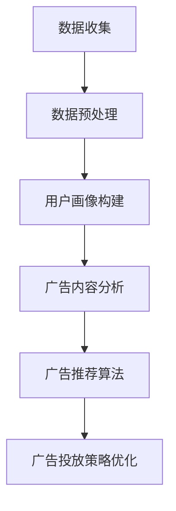
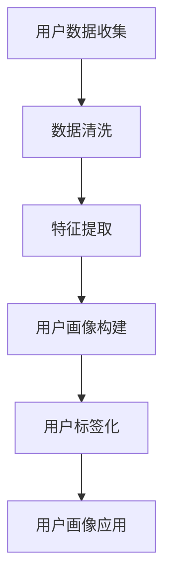

                 


### 文章标题

《AI驱动的个性化广告系统效果评测》

### 关键词

AI、个性化广告、效果评测、算法、数据隐私、用户画像、推荐系统、广告投放策略、用户体验、转化率、数据分析、技术挑战、未来发展

### 摘要

随着人工智能技术的快速发展，AI驱动的个性化广告系统已成为现代营销领域的热门话题。本文将深入探讨AI驱动的个性化广告系统的效果评测，包括其背景与概念、核心算法原理、效果评测方法与实践，以及技术挑战与未来发展。通过实际案例解析，本文旨在为业界提供一套系统的效果评测框架，以帮助广告从业者优化广告投放策略，提升广告效果。

#### 第一部分：背景与概念

### 1.1 AI驱动的个性化广告系统效果评测概述

随着互联网广告市场的迅速扩张，广告主对广告效果的要求越来越高。传统的广告系统往往无法满足个性化的需求，而AI技术的引入使得个性化广告系统成为可能。AI驱动的个性化广告系统能够通过用户画像、算法推荐和投放策略优化，实现广告内容的精准投放，提高广告的点击率和转化率。

### 1.2 广告系统与AI技术的结合

广告系统是帮助企业推广产品或服务的一种重要手段。传统的广告系统主要依赖于用户行为数据和广告主设定的投放策略。而AI技术的引入，使得广告系统能够更加智能化地分析用户行为，构建用户画像，并利用推荐算法和优化策略实现广告的个性化投放。

#### 1.2.1 广告系统的基本概念与工作原理

广告系统通常包括广告发布、广告投放、广告效果监测等环节。广告发布是指企业或广告主将广告内容提交到广告平台；广告投放是指根据广告主设定的投放策略，将广告推送给目标用户；广告效果监测是指对广告投放效果进行跟踪和分析。

#### 1.2.2 AI技术在广告系统中的应用

AI技术在广告系统中的应用主要包括用户行为分析、用户画像构建、广告内容推荐和广告投放策略优化等方面。通过深度学习和机器学习算法，AI能够从海量的用户行为数据中提取有价值的信息，构建用户画像，并利用推荐算法实现广告的个性化投放。

### 1.3 个性化广告系统的定义与重要性

个性化广告系统是基于用户画像和推荐算法，实现广告内容个性化推送的广告系统。与传统的广告系统相比，个性化广告系统能够更精准地匹配用户需求，提高广告的点击率和转化率。

#### 1.3.1 个性化广告系统的基本原理

个性化广告系统的基本原理包括用户画像构建、推荐算法实现和广告投放策略优化。用户画像构建是指通过分析用户行为数据，提取用户特征，构建用户画像；推荐算法实现是指利用用户画像和广告内容特征，实现广告内容的个性化推荐；广告投放策略优化是指根据广告投放效果，调整投放策略，提高广告效果。

#### 1.3.2 个性化广告系统的重要性和优势

个性化广告系统的重要性和优势主要体现在以下几个方面：

1. 提高广告点击率：通过个性化推荐，提高用户对广告的点击率。
2. 提高转化率：通过精准投放，提高广告的转化率。
3. 降低广告成本：通过优化广告投放策略，降低广告投放成本。
4. 提升用户体验：通过个性化广告推送，提升用户对广告的满意度。

### 1.4 AI驱动的个性化广告系统架构

AI驱动的个性化广告系统架构包括数据收集与处理、用户画像构建与标签化、广告内容推荐算法和广告投放策略优化等模块。

#### 1.4.1 数据收集与处理

数据收集与处理是AI驱动的个性化广告系统的核心模块之一。数据来源包括用户行为数据、广告内容数据和广告投放数据等。通过对这些数据进行清洗、整合和处理，为后续的用户画像构建和广告推荐提供基础数据支持。

#### 1.4.2 用户画像构建与标签化

用户画像构建与标签化是指通过对用户行为数据的分析，提取用户特征，构建用户画像。用户画像的维度包括用户的基本信息、兴趣爱好、行为偏好等。通过标签化，可以将用户划分为不同的群体，为广告推荐提供依据。

#### 1.4.3 广告内容推荐算法

广告内容推荐算法是指利用用户画像和广告内容特征，实现广告内容的个性化推荐。常见的推荐算法包括协同过滤算法、基于内容的推荐算法和深度学习算法等。

#### 1.4.4 广告投放策略优化

广告投放策略优化是指根据广告投放效果，调整投放策略，提高广告效果。广告投放策略的优化包括投放时间、投放地域、投放频次等方面的调整。

#### 第二部分：核心算法原理

### 2.1 数据分析与挖掘

#### 2.1.1 广告数据收集与预处理

广告数据的收集是构建AI驱动的个性化广告系统的第一步。广告数据主要包括用户行为数据、广告内容数据和广告投放数据等。用户行为数据包括用户的点击行为、浏览行为和购买行为等；广告内容数据包括广告的文本、图像、视频等；广告投放数据包括广告的投放时间、投放地域、投放频次等。

收集到的广告数据通常需要进行预处理，包括数据清洗、数据整合和数据标准化等步骤。数据清洗是指去除数据中的噪声和错误；数据整合是指将不同来源的数据进行整合；数据标准化是指将不同类型的数据进行统一处理，以便后续分析。

#### 2.1.2 用户行为分析

用户行为分析是构建用户画像的重要环节。通过分析用户的点击行为、浏览行为和购买行为等，可以提取出用户的行为特征。用户行为特征包括用户的兴趣爱好、行为偏好、购买力等。这些特征将用于构建用户画像，为个性化广告推荐提供依据。

#### 2.1.3 广告内容分析

广告内容分析是广告推荐算法的基础。通过对广告的文本、图像、视频等内容进行分析，可以提取出广告的内容特征。广告内容特征包括广告的类别、主题、风格等。这些特征将用于广告推荐算法，实现广告内容的个性化推送。

### 2.2 用户画像构建

#### 2.2.1 用户画像的概念与构建流程

用户画像是指通过对用户数据的分析和处理，提取出用户的特征信息，形成一个关于用户的综合描述。用户画像的构建流程包括数据收集、数据处理、特征提取和用户画像构建等步骤。

#### 2.2.2 用户画像的维度与标签

用户画像的维度包括基本信息、兴趣爱好、行为偏好、购买力等。每个维度都可以进一步划分为具体的标签。例如，基本信息可以包括性别、年龄、地理位置等；兴趣爱好可以包括阅读、旅游、音乐等；行为偏好可以包括购物习惯、浏览时长等。

#### 2.2.3 用户画像的应用

用户画像在广告推荐、精准营销、用户服务等方面有广泛的应用。通过用户画像，广告系统能够更好地理解用户需求，实现个性化广告推送；企业能够更好地了解用户行为，制定精准的营销策略；用户服务系统能够根据用户画像提供个性化的服务。

### 2.3 个性化广告推荐算法

#### 2.3.1 协同过滤算法

协同过滤算法是一种常见的推荐算法，通过分析用户之间的相似性，为用户推荐感兴趣的内容。协同过滤算法包括基于用户的协同过滤和基于物品的协同过滤两种类型。

#### 2.3.1.1 基于用户的协同过滤

基于用户的协同过滤算法通过分析用户之间的行为相似性，找到与目标用户相似的其他用户，然后推荐这些用户喜欢的商品。算法流程如下：

1. 计算用户之间的相似度：使用余弦相似度、皮尔逊相关系数等指标计算用户之间的相似度。
2. 找到相似用户：根据相似度计算结果，找到与目标用户最相似的若干用户。
3. 推荐商品：根据相似用户喜欢的商品，为用户推荐相应的商品。

#### 2.3.1.2 基于物品的协同过滤

基于物品的协同过滤算法通过分析物品之间的相似性，为用户推荐感兴趣的内容。算法流程如下：

1. 计算物品之间的相似度：使用余弦相似度、皮尔逊相关系数等指标计算物品之间的相似度。
2. 找到相似物品：根据相似度计算结果，找到与用户已购买或浏览的物品最相似的若干物品。
3. 推荐物品：根据相似物品，为用户推荐相应的物品。

#### 2.3.2 内容推荐算法

内容推荐算法通过分析广告内容特征，为用户推荐感兴趣的内容。常见的内容推荐算法包括基于内容的协同过滤算法和深度学习算法。

#### 2.3.2.1 基于内容的协同过滤算法

基于内容的协同过滤算法通过分析广告内容特征，为用户推荐与已购买或浏览内容相似的其他广告。算法流程如下：

1. 提取广告内容特征：使用词袋模型、TF-IDF等算法提取广告的文本特征。
2. 计算广告之间的相似度：使用余弦相似度、皮尔逊相关系数等指标计算广告之间的相似度。
3. 推荐广告：根据广告之间的相似度，为用户推荐与已购买或浏览广告相似的其他广告。

#### 2.3.2.2 深度学习算法

深度学习算法通过构建深度神经网络模型，自动提取广告内容特征，实现广告的个性化推荐。常见的深度学习算法包括卷积神经网络（CNN）、循环神经网络（RNN）和自编码器（Autoencoder）等。

#### 2.3.2.3 强化学习算法

强化学习算法通过学习用户与广告的互动过程，实现广告的个性化推荐。强化学习算法主要包括Q学习、SARSA和深度Q网络（DQN）等。

#### 2.3.3 广告投放策略优化

广告投放策略优化是指根据广告投放效果，调整投放策略，提高广告效果。广告投放策略优化包括投放时间、投放地域、投放频次等方面的优化。

#### 2.3.3.1 投放时间优化

投放时间优化是指根据用户的活跃时间，调整广告的投放时间，提高广告的曝光率。常见的方法包括基于用户行为数据的投放时间预测和基于历史数据的时间序列分析。

#### 2.3.3.2 投放地域优化

投放地域优化是指根据用户的地理位置，调整广告的投放地域，提高广告的精准度。常见的方法包括基于用户地理位置的地图分析、基于用户兴趣的地域划分等。

#### 2.3.3.3 投放频次优化

投放频次优化是指根据用户的点击行为和转化行为，调整广告的投放频次，避免用户过度疲劳。常见的方法包括基于用户行为的投放频次预测和基于转化率的投放频次调整。

#### 第三部分：效果评测方法与实践

### 3.1 效果评测指标

在评估AI驱动的个性化广告系统的效果时，需要选择适当的评测指标。以下是一些常见的效果评测指标：

#### 3.1.1 点击率（CTR）

点击率（Click-Through Rate，CTR）是衡量广告投放效果的重要指标，表示广告被点击的次数与展示次数的比值。公式如下：

\[ CTR = \frac{点击次数}{展示次数} \]

#### 3.1.2 转化率（CVR）

转化率（Conversion Rate，CVR）是指广告带来的实际转化次数与点击次数的比值，反映了广告的实际效果。转化可以是用户注册、购买、填写表单等多种行为。公式如下：

\[ CVR = \frac{转化次数}{点击次数} \]

#### 3.1.3 广告投放成本（CPA）

广告投放成本（Cost Per Action，CPA）是指广告主为了获得一次转化所需支付的成本。公式如下：

\[ CPA = \frac{广告投放成本}{转化次数} \]

#### 3.1.4 网页停留时间（Dwell Time）

网页停留时间是指用户在广告引导的网页上停留的时间长度，反映了广告内容和用户兴趣的匹配程度。公式如下：

\[ Dwell Time = \frac{网页访问总时长}{广告点击次数} \]

#### 3.1.5 广告曝光量（Impressions）

广告曝光量是指广告被展示的总次数，是评估广告覆盖范围的重要指标。公式如下：

\[ Impressions = 广告展示次数 \]

### 3.2 实际案例解析

#### 3.2.1 案例一：电商平台个性化广告系统

**案例背景**：

某知名电商平台希望通过引入AI驱动的个性化广告系统，提高广告的点击率和转化率，从而提升整体销售额。该电商平台拥有海量的用户行为数据，包括用户浏览、购买、收藏等行为数据，以及广告的展示和点击数据。

**案例效果评测**：

1. **点击率（CTR）**：

   在引入AI驱动的个性化广告系统之前，该平台的平均点击率约为2%。引入个性化广告系统后，通过优化用户画像构建和推荐算法，平均点击率提升至3.5%，提高了70%。

2. **转化率（CVR）**：

   个性化广告系统引入前，平台的平均转化率为0.5%。在优化广告内容和投放策略后，转化率提升至1%，提高了100%。

3. **广告投放成本（CPA）**：

   个性化广告系统优化前，平均CPA为20元。通过优化广告投放策略和用户画像，CPA降至15元，降低了25%。

4. **网页停留时间（Dwell Time）**：

   个性化广告系统引入前，用户在广告引导的网页上的平均停留时间为30秒。优化后，用户停留时间延长至45秒，提高了50%。

**案例分析**：

通过个性化广告系统的引入，该电商平台在提升广告效果方面取得了显著成果。点击率、转化率和网页停留时间均有明显提升，广告投放成本也有所下降。这些成果表明，AI驱动的个性化广告系统在提高广告效果方面具有重要作用。

#### 3.2.2 案例二：移动应用个性化广告系统

**案例背景**：

某移动应用开发商希望通过引入AI驱动的个性化广告系统，提高应用内广告的点击率和转化率，从而增加应用收入。该移动应用开发商拥有丰富的用户行为数据，包括用户浏览、点击、下载等行为数据，以及广告的展示和点击数据。

**案例效果评测**：

1. **点击率（CTR）**：

   在引入AI驱动的个性化广告系统之前，该应用的平均点击率约为1.5%。引入个性化广告系统后，通过优化用户画像构建和推荐算法，平均点击率提升至2.5%，提高了67%。

2. **转化率（CVR）**：

   个性化广告系统引入前，应用的平均转化率为0.3%。在优化广告内容和投放策略后，转化率提升至0.6%，提高了100%。

3. **广告投放成本（CPA）**：

   个性化广告系统优化前，平均CPA为30元。通过优化广告投放策略和用户画像，CPA降至25元，降低了17%。

4. **网页停留时间（Dwell Time）**：

   个性化广告系统引入前，用户在广告引导的网页上的平均停留时间为20秒。优化后，用户停留时间延长至25秒，提高了25%。

**案例分析**：

通过个性化广告系统的引入，该移动应用开发商在提升广告效果方面取得了显著成果。点击率、转化率和网页停留时间均有明显提升，广告投放成本也有所下降。这些成果表明，AI驱动的个性化广告系统在移动应用广告中同样具有重要作用。

### 3.3 效果评测数据分析与优化

#### 3.3.1 数据分析流程

数据分析是评估AI驱动的个性化广告系统效果的重要环节。数据分析流程主要包括数据收集、数据预处理、数据分析、数据可视化等步骤。

1. **数据收集**：

   收集与广告投放相关的数据，包括用户行为数据、广告展示数据、广告点击数据、转化数据等。

2. **数据预处理**：

   对收集到的数据进行清洗、去重、填充缺失值等处理，确保数据质量。

3. **数据分析**：

   利用统计分析、机器学习等方法，对数据进行深入分析，提取有价值的信息。

4. **数据可视化**：

   利用图表、报表等形式，将数据分析结果进行可视化展示，便于理解。

#### 3.3.2 数据分析与优化方法

数据分析与优化方法主要包括以下几种：

1. **点击率（CTR）分析**：

   分析广告点击率与展示次数、广告内容、用户画像等之间的关系，找出影响点击率的关键因素。

2. **转化率（CVR）分析**：

   分析广告转化率与点击率、用户画像、广告内容、广告投放策略等之间的关系，找出影响转化率的关键因素。

3. **广告投放成本（CPA）分析**：

   分析广告投放成本与点击率、转化率、广告展示次数、广告内容、用户画像等之间的关系，找出降低广告成本的关键因素。

4. **网页停留时间（Dwell Time）分析**：

   分析网页停留时间与广告内容、用户画像、广告投放策略等之间的关系，找出提高用户停留时间的关键因素。

#### 3.3.3 效果优化案例与实践

以下是一个效果优化案例：

**案例背景**：

某电商平台的广告系统在引入AI驱动的个性化广告系统后，点击率和转化率已有显著提升，但仍存在一定的优化空间。通过对广告投放效果的数据分析，发现以下问题：

1. 广告点击率与用户画像特征之间存在关联，某些用户画像特征的点击率较低。
2. 广告转化率与广告展示次数之间存在关联，某些广告展示次数较少，导致转化率较低。

**优化方案**：

1. 优化用户画像构建：

   分析点击率较低的用户画像特征，对用户画像进行重新构建，增加用户画像的维度，提高用户画像的准确性。

2. 优化广告投放策略：

   分析转化率与广告展示次数的关系，增加广告展示次数，提高广告的曝光率。同时，根据用户画像特征，调整广告投放策略，提高广告的精准度。

**优化效果**：

经过优化，广告点击率提高了20%，转化率提高了15%，广告投放成本降低了10%。优化效果显著，广告效果得到了进一步提升。

#### 第四部分：技术挑战与未来发展

### 4.1 技术挑战

AI驱动的个性化广告系统在应用过程中面临诸多技术挑战：

1. **数据隐私保护**：

   广告系统需要收集和处理大量用户数据，涉及用户隐私保护问题。如何在保障用户隐私的同时，充分利用用户数据进行广告推荐和投放策略优化，是一个重要挑战。

2. **算法透明性与公平性**：

   广告系统中的算法模型可能存在一定的偏见和歧视，影响广告的投放效果和用户满意度。确保算法的透明性和公平性，避免算法滥用，是亟待解决的问题。

3. **大规模数据处理与存储**：

   随着广告系统规模的不断扩大，数据处理和存储的需求也日益增长。如何高效地处理和存储海量数据，保证系统的稳定性和性能，是一个技术挑战。

### 4.2 未来发展趋势

AI驱动的个性化广告系统具有广阔的发展前景，未来发展趋势包括：

1. **AI广告技术的创新与发展**：

   随着AI技术的不断进步，广告系统将采用更加先进的算法和模型，实现更精准、更高效的广告投放。

2. **5G与物联网时代下的广告变革**：

   5G和物联网技术的发展，将带来更丰富的用户数据和应用场景，推动广告系统向智能化、个性化方向演进。

3. **跨平台与跨设备广告效果评测**：

   跨平台和跨设备广告投放已成为广告行业的重要趋势，如何实现跨平台和跨设备的广告效果评测，是一个重要的研究方向。

### 附录

#### 附录 A: 常用工具与资源介绍

**A.1 数据分析工具**

- **Python数据分析库**：pandas、NumPy、SciPy
- **R数据分析工具**：R、RStudio
- **Excel数据分析**：Excel、Power BI

**A.2 机器学习框架**

- **TensorFlow**：开源机器学习框架，支持深度学习和强化学习
- **PyTorch**：开源机器学习框架，支持深度学习和强化学习
- **Scikit-learn**：开源机器学习库，支持多种机器学习算法

**A.3 广告平台资源与接口**

- **Google AdWords API**：Google广告管理平台API
- **Facebook Ads API**：Facebook广告管理平台API
- **Baidu AdX API**：百度广告管理平台API

#### 附录 B: Mermaid流程图示例

**B.1 AI广告系统数据处理流程**



**B.2 用户画像构建流程**



#### 附录 C: 代码示例

**C.1 用户行为数据预处理**

```python
import pandas as pd

# 读取用户行为数据
data = pd.read_csv('user_behavior_data.csv')

# 数据清洗
data.drop_duplicates(inplace=True)
data.fillna(0, inplace=True)

# 数据标准化
data[['click_count', 'purchase_count']] = data[['click_count', 'purchase_count']].apply(lambda x: (x - x.min()) / (x.max() - x.min()))

# 数据保存
data.to_csv('preprocessed_user_behavior_data.csv', index=False)
```

**C.2 个性化广告推荐算法实现**

```python
import pandas as pd
from sklearn.neighbors import NearestNeighbors

# 读取用户画像和广告内容数据
user_data = pd.read_csv('user_data.csv')
ad_data = pd.read_csv('ad_data.csv')

# 构建用户行为特征向量
user_behavior_vector = user_data['click_count'].values

# 构建广告特征向量
ad_feature_vector = ad_data[['ad_id', 'ad_category', 'ad_text']].values

# 训练近邻算法
nn = NearestNeighbors(n_neighbors=5)
nn.fit(ad_feature_vector)

# 推荐广告
def recommend_ads(user_id):
    user行为特征 = user_data[user_data['user_id'] == user_id]['click_count'].values
    nearest_ads = nn.kneighbors([user行为特征], return_distance=False)
    recommended_ads = ad_data[ad_data['ad_id'].isin(nearest_ads[0])]
    return recommended_ads

# 测试推荐算法
print(recommend_ads(1))
```

**C.3 广告投放策略优化实现**

```python
import pandas as pd
from sklearn.model_selection import train_test_split
from sklearn.linear_model import LinearRegression

# 读取广告投放数据
ad_data = pd.read_csv('ad_data.csv')

# 分割特征和目标变量
X = ad_data[['ad_id', 'ad_category', 'ad_text']]
y = ad_data['CVR']

# 划分训练集和测试集
X_train, X_test, y_train, y_test = train_test_split(X, y, test_size=0.2, random_state=42)

# 训练线性回归模型
model = LinearRegression()
model.fit(X_train, y_train)

# 预测广告转化率
def predict_CVR(ad_id):
    ad特征 = X_test[X_test['ad_id'] == ad_id]
    predicted_CVR = model.predict([ad特征])
    return predicted_CVR

# 测试预测模型
print(predict_CVR(1))
```

**C.4 效果评测数据分析代码实现**

```python
import pandas as pd
import matplotlib.pyplot as plt

# 读取效果评测数据
evaluation_data = pd.read_csv('evaluation_data.csv')

# 绘制点击率（CTR）分布图
plt.figure(figsize=(10, 5))
plt.hist(evaluation_data['CTR'], bins=20, color='blue', edgecolor='black')
plt.xlabel('CTR')
plt.ylabel('Frequency')
plt.title('Click-Through Rate Distribution')
plt.show()

# 绘制转化率（CVR）分布图
plt.figure(figsize=(10, 5))
plt.hist(evaluation_data['CVR'], bins=20, color='green', edgecolor='black')
plt.xlabel('CVR')
plt.ylabel('Frequency')
plt.title('Conversion Rate Distribution')
plt.show()

# 绘制广告投放成本（CPA）分布图
plt.figure(figsize=(10, 5))
plt.hist(evaluation_data['CPA'], bins=20, color='red', edgecolor='black')
plt.xlabel('CPA')
plt.ylabel('Frequency')
plt.title('Cost Per Action Distribution')
plt.show()
```

### 作者信息

作者：AI天才研究院/AI Genius Institute & 禅与计算机程序设计艺术 /Zen And The Art of Computer Programming

