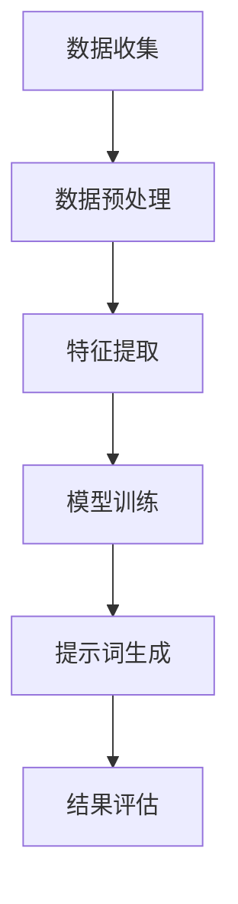

                 

### 文章标题

《AI驱动的提示词自动生成技术》

### 关键词

人工智能、自动生成、提示词、生成对抗网络（GAN）、变分自编码器（VAE）、递归神经网络（RNN）、模型架构、数学模型、项目实战。

### 摘要

本文深入探讨了AI驱动的提示词自动生成技术，涵盖了该技术的背景、核心概念、算法原理、数学模型及其实际应用。通过分析生成对抗网络（GAN）、变分自编码器（VAE）和递归神经网络（RNN）等关键算法，本文提供了详细的伪代码示例和数学公式解释，帮助读者理解这些技术的工作机制。同时，通过实际项目案例，本文展示了如何实现和优化提示词自动生成系统，并提供了一系列最佳实践和小结，以指导读者在实际应用中取得成功。

## 引言

### 1.1 AI驱动的提示词自动生成技术概述

在数字化信息时代，文本数据量以惊人的速度增长，从新闻文章、社交媒体帖子到用户评论和搜索查询，文本内容无处不在。如何有效地处理和分析这些海量的文本数据成为了一个巨大的挑战。传统的文本处理方法，如关键词提取、文本分类和情感分析，虽然在某些特定场景下表现出色，但它们往往依赖于人工设定规则和模式，难以适应复杂多变的文本内容。因此，人工智能（AI）技术的引入为文本数据的自动化处理提供了新的可能。

AI驱动的提示词自动生成技术是一种利用机器学习，特别是深度学习算法，来自动生成文本提示词的方法。这些提示词可以是文本摘要的关键词，也可以是用户搜索查询的推荐词汇，甚至可以用于自动生成文章的标题。这种技术的核心在于通过学习大量文本数据，自动识别并提取出对文本内容具有代表性的关键词或短语。

自动生成提示词的意义在于多个方面。首先，它可以显著提高文本处理的效率，减少人工干预。其次，它能够更好地适应不同用户的需求和偏好，提供个性化的内容推荐。此外，自动生成提示词在搜索引擎优化、内容创作和用户互动等方面也有广泛的应用。

AI驱动的提示词自动生成技术并不是一个全新的概念，但它随着深度学习和生成模型的发展而得到了显著的提升。早期的方法主要依赖于统计模型和规则引擎，如TF-IDF和LDA（latent Dirichlet allocation），这些方法在一定程度上能够生成关键词，但存在准确性和泛化能力不足的问题。随着生成对抗网络（GAN）、变分自编码器（VAE）和递归神经网络（RNN）等深度学习模型的兴起，自动生成提示词的技术迎来了新的发展机遇。

### 1.2 技术意义与发展趋势

随着互联网和大数据技术的快速发展，人们产生和消费的文本数据量呈现爆炸式增长。根据市场研究公司的数据，全球每年产生的文本数据量已经超过了万亿条。如何高效地处理和利用这些数据成为了一个重要的课题。AI驱动的提示词自动生成技术在这一背景下应运而生，其意义和潜在影响如下：

1. **提高信息检索效率**：自动生成的提示词可以帮助搜索引擎更准确地理解用户查询，提供更相关的搜索结果，从而提高用户的信息检索效率。

2. **个性化内容推荐**：自动生成的提示词可以根据用户的兴趣和行为数据，推荐个性化的内容，提升用户体验和用户满意度。

3. **自动化内容创作**：自动生成的提示词可以用于生成文章摘要、标题和关键词，辅助内容创作者快速创作高质量的内容。

4. **智能对话系统**：自动生成的提示词可以用于智能对话系统的交互设计，提供更加自然和流畅的用户体验。

5. **提高数据分析精度**：自动生成的提示词可以帮助数据分析师更好地理解文本数据，提取关键信息，从而提高数据分析的准确性和深度。

未来，随着AI技术的不断进步，AI驱动的提示词自动生成技术将会在更多领域得到应用。例如，在医疗健康领域，自动生成的提示词可以帮助医生快速总结病历记录，提高诊断和治疗的效率；在教育领域，自动生成的提示词可以辅助教师生成教学材料和学生评估报告，提升教学效果。

此外，随着多模态数据处理技术的发展，AI驱动的提示词自动生成技术也将逐渐能够处理包括文本、图像、声音等多种类型的数据，实现更智能的内容理解和生成。

总之，AI驱动的提示词自动生成技术作为一种新兴的AI应用，具有巨大的潜力和广阔的应用前景。本文将深入探讨这一技术的核心概念、算法原理、数学模型以及实际应用，帮助读者更好地理解和掌握这一领域的关键技术。

### 1.3 文章结构

本文将按照以下结构展开：

1. **核心概念与联系**：介绍提示词自动生成技术的基本概念，并展示相关的Mermaid流程图。
2. **核心算法原理讲解**：详细讲解生成对抗网络（GAN）、变分自编码器（VAE）和递归神经网络（RNN）等算法的原理，使用伪代码和数学公式进行说明。
3. **数学模型与公式**：解释这些算法背后的数学模型，并提供具体例子。
4. **项目实战**：通过实际项目案例展示如何实现提示词自动生成。
5. **展望与未来**：探讨AI驱动的提示词自动生成技术的未来发展方向和潜在挑战。
6. **最佳实践与小结**：提供一些最佳实践和注意事项，总结本文的核心内容。

### 核心概念与联系

在探讨AI驱动的提示词自动生成技术之前，我们需要明确一些核心概念和它们之间的联系。提示词自动生成技术涉及多个关键概念，包括文本数据、特征提取、机器学习和深度学习模型等。

#### 文本数据

文本数据是提示词自动生成技术的输入，它可以是各种形式的文本，如新闻文章、社交媒体帖子、用户评论、搜索查询等。文本数据的质量和多样性直接影响提示词生成的准确性和泛化能力。因此，在应用提示词自动生成技术之前，需要对文本数据进行预处理，如去除噪声、标点符号和停用词等。

#### 特征提取

特征提取是将原始文本数据转换为适合机器学习模型处理的形式的过程。常见的特征提取方法包括词袋模型（Bag of Words，BOW）、TF-IDF（Term Frequency-Inverse Document Frequency）和词嵌入（Word Embedding）等。词袋模型通过统计文本中每个单词的出现次数来表示文本，而TF-IDF则考虑了单词在文档中的重要程度。词嵌入是将单词映射为密集向量的方法，常见的词嵌入模型有Word2Vec、GloVe和BERT等。这些特征提取方法为机器学习模型提供了丰富的文本信息。

#### 机器学习和深度学习模型

机器学习和深度学习模型是提示词自动生成技术的核心组成部分。机器学习方法，如支持向量机（SVM）、决策树和随机森林等，可以通过学习大量标注数据进行分类和回归任务。深度学习方法，如卷积神经网络（CNN）、递归神经网络（RNN）和生成对抗网络（GAN）等，则通过多层神经网络的训练，能够自动提取复杂的数据特征。这些模型在处理大规模文本数据时具有显著的优势，能够生成高质量的提示词。

#### Mermaid流程图

为了更好地理解提示词自动生成技术的工作流程，我们可以使用Mermaid流程图来展示其核心步骤和组件。以下是一个简化的Mermaid流程图示例：



在这个流程图中，数据收集是整个过程的起点，随后进行数据预处理和特征提取。模型训练是核心步骤，通过机器学习或深度学习算法训练模型，以便能够自动生成提示词。最后，对生成的提示词进行评估，以衡量模型的性能和准确性。

#### 核心概念之间的联系

通过上述核心概念的分析，我们可以看出，提示词自动生成技术涉及多个环节，每个环节相互关联，共同构成了一个完整的流程。数据收集和预处理为后续的特征提取提供了基础，而特征提取又为模型训练提供了输入。模型训练的结果直接决定了提示词生成的质量，最终通过结果评估来验证和优化模型的性能。

综上所述，AI驱动的提示词自动生成技术通过文本数据、特征提取和深度学习模型等核心概念的相互作用，实现了自动生成高质量提示词的目标。接下来，我们将详细探讨这一技术中的核心算法原理，包括生成对抗网络（GAN）、变分自编码器（VAE）和递归神经网络（RNN）等。

### 核心算法原理讲解

在提示词自动生成技术中，选择合适的算法是实现高效、准确生成提示词的关键。本文将介绍三种核心算法：生成对抗网络（GAN）、变分自编码器（VAE）和递归神经网络（RNN）。这些算法各自有其独特的原理、结构和应用场景，通过深入理解这些算法，我们可以更好地掌握提示词自动生成技术的实现方法。

#### 1. 生成对抗网络（GAN）

生成对抗网络（GAN）由Ian Goodfellow等人在2014年提出，是深度学习中的一种重要的生成模型。GAN的核心思想是通过两个神经网络的对抗训练来实现高质量的数据生成。

**1.1 GAN的基本原理**

GAN由生成器（Generator）和判别器（Discriminator）两个神经网络组成。生成器的任务是根据随机噪声向量生成类似真实数据的输出。判别器的任务则是判断输入数据是真实数据还是生成器生成的数据。

训练过程中，生成器和判别器不断进行对抗。生成器试图生成尽可能真实的数据以欺骗判别器，而判别器则试图正确区分真实数据和生成数据。通过这种对抗训练，生成器逐渐提高生成数据的质量，使其在判别器上难以区分。

**1.2 GAN的结构和工作流程**

GAN的结构通常包括以下几个部分：

1. **生成器（Generator）**：生成器是一个前馈神经网络，其输入为随机噪声向量z，输出为生成的数据。生成器的目标是生成与真实数据分布相近的数据。

2. **判别器（Discriminator）**：判别器也是一个前馈神经网络，其输入为真实数据或生成数据，输出为概率值，表示输入数据为真实数据的置信度。判别器的目标是最大化这个概率值。

3. **对抗训练**：在训练过程中，生成器和判别器交替进行训练。生成器通过最小化判别器的损失函数（即最大化判别器对生成数据的错误分类概率），而判别器通过最大化判别器的损失函数（即最大化生成器和真实数据的差异）。

**1.3 GAN的优缺点与应用场景**

GAN的优点包括：

- **高质量的数据生成**：GAN通过对抗训练能够生成高质量、逼真的数据，适用于图像、语音和文本等数据类型的生成。
- **灵活性**：GAN的结构灵活，可以应用于多种数据类型和任务，如图像生成、图像修复和文本生成等。

然而，GAN也存在一些缺点：

- **训练难度**：GAN的训练过程非常不稳定，容易出现模式崩溃（mode collapse）和梯度消失等问题，导致训练难度增加。
- **资源消耗**：GAN的训练过程需要大量的计算资源，尤其是在生成复杂数据时。

GAN的应用场景广泛，如：

- **图像生成**：用于生成逼真的图像，如图像到图像的翻译、图像修复和风格迁移等。
- **语音合成**：用于生成自然流畅的语音，应用于语音助手和语音识别系统。
- **文本生成**：用于生成文章摘要、标题和关键词，应用于内容创作和搜索优化等。

#### 2. 变分自编码器（VAE）

变分自编码器（VAE）是另一种生成模型，由Kingma和Welling在2013年提出。VAE通过引入概率分布来生成数据，从而避免了GAN中常见的模式崩溃问题。

**2.1 VAE的数学模型**

VAE的核心数学模型基于概率图模型，包括两个主要部分：编码器（Encoder）和解码器（Decoder）。

1. **编码器（Encoder）**：编码器的任务是学习数据的一个潜在变量分布。给定输入数据x，编码器输出两个参数μ和σ，分别表示潜在变量的均值和方差。

2. **解码器（Decoder）**：解码器的任务是生成与输入数据相似的输出。给定潜在变量z，解码器输出重构的数据x'。

VAE的损失函数由两个部分组成：重建损失（Reconstruction Loss）和KL散度损失（KL Divergence Loss）。

- **重建损失**：衡量重构数据与原始数据之间的差异，通常使用均方误差（MSE）或交叉熵（Cross-Entropy）作为损失函数。
- **KL散度损失**：衡量编码器学习的潜在变量分布与先验分布之间的差异，用于确保潜在变量的多样性。

**2.2 VAE的优势和应用场景**

VAE的优点包括：

- **稳定训练**：由于引入了概率分布，VAE相对于GAN来说更加稳定，不容易出现模式崩溃。
- **灵活性和通用性**：VAE可以应用于多种数据类型，包括图像、文本和音频等。

VAE的应用场景广泛，如：

- **图像生成**：用于生成具有多样化特征的图像，如图像到图像的翻译和风格迁移。
- **文本生成**：用于生成文章摘要、标题和关键词，应用于内容创作和搜索优化。
- **数据去噪**：用于去除图像和音频中的噪声，提高数据质量。

#### 3. 递归神经网络（RNN）

递归神经网络（RNN）是处理序列数据的经典神经网络模型，由于其在处理时序数据和依赖性数据方面的优势，RNN在自然语言处理（NLP）领域得到了广泛应用。

**3.1 RNN的原理与类型**

RNN的基本原理是通过重复单元（Recurrence Unit）处理输入序列。在每个时间步，RNN会利用当前输入和前一个时间步的隐藏状态来生成当前时间步的输出，同时更新隐藏状态。

RNN的主要类型包括：

1. **基本RNN**：基本RNN通过简单的递归连接来处理序列数据。
2. **长短期记忆网络（LSTM）**：LSTM是RNN的一种改进，通过引入门控机制（Gate Mechanism）来解决基本RNN的梯度消失问题。
3. **门控循环单元（GRU）**：GRU是另一种RNN改进，通过简化LSTM的结构来提高训练效率和计算效率。

**3.2 RNN在提示词生成中的应用**

在提示词生成中，RNN可以用于序列建模，通过学习文本序列的依赖关系来生成高质量的提示词。

1. **序列建模**：RNN通过处理文本序列，提取句子或段落的关键信息，用于生成提示词。
2. **上下文信息利用**：RNN能够捕捉文本序列中的上下文信息，使生成的提示词更加准确和具有相关性。

**3.3 RNN的优势和应用场景**

RNN的优点包括：

- **处理长序列**：RNN能够处理长序列数据，适用于文本、语音和视频等依赖性数据的处理。
- **高效建模**：RNN通过递归连接能够高效地建模序列数据中的依赖关系。

RNN的应用场景广泛，如：

- **文本生成**：用于生成文章、摘要和关键词，应用于内容创作和搜索优化。
- **语音识别**：用于将语音信号转换为文本，应用于语音助手和语音搜索。
- **视频分析**：用于提取视频中的关键帧和特征，应用于视频监控和视频推荐。

综上所述，生成对抗网络（GAN）、变分自编码器（VAE）和递归神经网络（RNN）是提示词自动生成技术中的核心算法。GAN通过对抗训练生成高质量的数据，VAE通过概率分布实现稳定的训练，而RNN通过序列建模提取关键信息。这些算法各自有其独特的原理和应用场景，通过合理选择和组合，可以实现高效的提示词自动生成。接下来，我们将进一步探讨这些算法的数学模型和公式，以便更深入地理解它们的工作机制。

### 数学模型与数学公式

在详细探讨生成对抗网络（GAN）、变分自编码器（VAE）和递归神经网络（RNN）的数学模型和公式时，我们需要使用LaTeX格式来嵌入文中独立段落的公式，并确保段落内的公式格式正确。以下是这些算法的数学模型和公式的详细解释，以及具体示例。

#### 1. 生成对抗网络（GAN）

**1.1 GAN的损失函数**

GAN的核心是通过生成器和判别器的对抗训练来实现的。生成器的目标是生成与真实数据分布相近的数据，而判别器的目标是区分真实数据和生成数据。GAN的损失函数通常由两部分组成：生成器损失和判别器损失。

生成器的损失函数是期望值，可以表示为：
$$
L_G = -\mathbb{E}_{z \sim p_z(z)}[\log(D(G(z))]
$$
其中，$D(G(z))$ 是判别器对生成数据的输出概率。

判别器的损失函数是二分类交叉熵损失，可以表示为：
$$
L_D = -[\mathbb{E}_{x \sim p_{data}(x)}[\log(D(x))] + \mathbb{E}_{z \sim p_z(z)}[\log(1 - D(G(z)))]
$$
其中，$p_{data}(x)$ 是真实数据的分布，$p_z(z)$ 是生成器的噪声分布。

**1.2 GAN的训练过程**

在GAN的训练过程中，生成器和判别器交替更新参数。生成器通过最小化生成数据的判别器输出概率，即最大化判别器的错误分类概率，来提高生成数据的质量。判别器通过最大化判别器的输出概率，即最大化生成器和真实数据的差异，来提高区分能力。

**1.3 示例：GAN的损失函数计算**

假设我们有一个生成器和判别器的输出分别为 $G(z)$ 和 $D(x)$，其中 $z$ 是生成器的输入噪声，$x$ 是真实数据。我们可以通过以下步骤计算GAN的损失函数：

- 对于生成器：
  $$
  L_G = -\mathbb{E}_{z \sim p_z(z)}[\log(D(G(z))]
  $$
  假设 $z$ 是均匀分布的，即 $p_z(z) \sim \mathcal{U}(-1, 1)$，我们可以通过采样 $z$ 并计算期望值来近似 $L_G$。

- 对于判别器：
  $$
  L_D = -[\mathbb{E}_{x \sim p_{data}(x)}[\log(D(x))] + \mathbb{E}_{z \sim p_z(z)}[\log(1 - D(G(z)))]
  $$
  假设 $p_{data}(x)$ 是标准正态分布，即 $p_{data}(x) \sim \mathcal{N}(0, 1)$，我们可以通过数据集计算期望值来近似 $L_D$。

#### 2. 变分自编码器（VAE）

**2.1 VAE的编码器与解码器**

VAE的编码器和解码器都是神经网络模型，编码器输出潜在变量的均值 $\mu$ 和方差 $\sigma^2$，而解码器根据潜在变量生成重构数据 $x'$。

编码器：
$$
\mu = \sigma^2 = \phi(x)
$$
解码器：
$$
x' = \mu + \sigma \odot z
$$
其中，$\phi$ 是编码器函数，$z$ 是从先验分布 $p(z) \sim \mathcal{N}(0, I)$ 采样的噪声。

**2.2 VAE的损失函数**

VAE的损失函数由重建损失和KL散度损失组成：

$$
L = \underbrace{\mathbb{E}_{x \sim p_{data}(x)}[-\log p_\theta(x'|x)]}_{\text{Reconstruction Loss}} + \underbrace{\beta \cdot \mathbb{E}_{\mu, \sigma \sim \phi(x)}[\text{KL}(\mu, \sigma)]}_{\text{KL Divergence Loss}}
$$
其中，$p_\theta(x'|x)$ 是解码器的输出概率，$\beta$ 是调节KL散度损失的权重。

**2.3 VAE的训练过程**

在训练VAE时，我们通过最小化上述损失函数来优化编码器和解码器的参数。编码器通过学习潜在变量分布的参数，而解码器通过学习如何从潜在变量生成数据。

**2.4 示例：VAE的损失函数计算**

假设我们有编码器函数 $\phi(x)$ 和解码器函数 $p_\theta(x'|x)$，可以通过以下步骤计算VAE的损失函数：

- 计算重建损失：
  $$
  \mathbb{E}_{x \sim p_{data}(x)}[-\log p_\theta(x'|x)]
  $$
  可以通过蒙特卡罗采样或梯度下降法来近似计算。

- 计算KL散度损失：
  $$
  \beta \cdot \mathbb{E}_{\mu, \sigma \sim \phi(x)}[\text{KL}(\mu, \sigma)]
  $$
  通过对每个样本计算KL散度，并求平均来近似计算。

#### 3. 递归神经网络（RNN）

**3.1 RNN的状态更新方程**

RNN在处理序列数据时，每个时间步的隐藏状态会根据当前输入和前一个时间步的隐藏状态进行更新。状态更新方程可以表示为：

$$
h_t = \sigma(W_h \cdot [h_{t-1}, x_t] + b_h)
$$
其中，$h_t$ 是当前时间步的隐藏状态，$x_t$ 是当前输入，$W_h$ 是权重矩阵，$b_h$ 是偏置项，$\sigma$ 是激活函数（通常为ReLU或Sigmoid函数）。

**3.2 LSTM的状态更新方程**

LSTM是RNN的一种改进，通过引入门控机制来解决梯度消失问题。LSTM的状态更新方程包括输入门、遗忘门和输出门：

- 输入门：
  $$
  i_t = \sigma(W_i \cdot [h_{t-1}, x_t] + b_i)
  $$
- 遗忘门：
  $$
  f_t = \sigma(W_f \cdot [h_{t-1}, x_t] + b_f)
  $$
- 输出门：
  $$
  o_t = \sigma(W_o \cdot [h_{t-1}, x_t] + b_o)
  $$
- 单元状态：
  $$
  C_t = f_t \odot C_{t-1} + i_t \odot \sigma(W_c \cdot [h_{t-1}, x_t] + b_c)
  $$
- 隐藏状态：
  $$
  h_t = o_t \odot C_t
  $$

**3.3 RNN的训练过程**

RNN的训练过程通过反向传播算法进行，优化网络参数以最小化损失函数。在训练过程中，我们通过序列数据的梯度计算来更新网络权重和偏置。

**3.4 示例：RNN的隐藏状态计算**

假设我们有一个输入序列 $x_1, x_2, ..., x_T$ 和初始隐藏状态 $h_0$，可以通过以下步骤计算RNN的隐藏状态：

- 初始化：
  $$
  h_0 = \text{初始化}
  $$
- 对于每个时间步 $t$：
  $$
  h_t = \sigma(W_h \cdot [h_{t-1}, x_t] + b_h)
  $$
  或者对于LSTM：
  $$
  i_t, f_t, o_t = \sigma(W_i \cdot [h_{t-1}, x_t] + b_i), \sigma(W_f \cdot [h_{t-1}, x_t] + b_f), \sigma(W_o \cdot [h_{t-1}, x_t] + b_o)
  $$
  $$
  C_t = f_t \odot C_{t-1} + i_t \odot \sigma(W_c \cdot [h_{t-1}, x_t] + b_c)
  $$
  $$
  h_t = o_t \odot C_t
  $$

通过这些数学模型和公式的详细解释，我们可以更深入地理解生成对抗网络（GAN）、变分自编码器（VAE）和递归神经网络（RNN）的工作原理。接下来，我们将通过实际项目案例来展示如何应用这些算法实现提示词自动生成。

### 项目实战

#### 1. 开发环境搭建

为了实现AI驱动的提示词自动生成技术，我们需要搭建一个合适的开发环境。以下是一些建议和步骤：

**1.1 硬件要求**

- **CPU/GPU**：推荐使用配备NVIDIA GPU的计算机，以充分利用GPU的并行计算能力。
- **内存**：至少16GB RAM，建议32GB以上，以便处理大规模数据。
- **硬盘**：至少500GB的SSD存储空间，用于存储数据和模型。

**1.2 软件要求**

- **操作系统**：Windows、macOS或Linux操作系统。
- **编程语言**：Python是首选，因为其丰富的库和强大的计算能力。
- **深度学习框架**：TensorFlow或PyTorch，它们都是开源的深度学习框架，适用于实现各种神经网络模型。

**1.3 安装与配置**

- **安装Python**：从Python官方网站下载并安装Python 3.8及以上版本。
- **安装TensorFlow/PyTorch**：在命令行中运行以下命令：
  ```
  pip install tensorflow  # TensorFlow
  pip install torch       # PyTorch
  ```
- **安装必要的Python库**：例如，NumPy、Pandas和Scikit-learn等。

#### 2. 源代码详细实现

以下是一个简单的提示词自动生成项目的伪代码，用于说明如何使用生成对抗网络（GAN）来实现提示词生成。

**2.1 数据准备**

```python
# 加载数据集
data = load_data('text_data.csv')

# 数据预处理
processed_data = preprocess_data(data)

# 分割数据集
train_data, test_data = split_data(processed_data, test_size=0.2)
```

**2.2 模型定义**

```python
# 定义生成器和判别器
generator = build_generator()
discriminator = build_discriminator()

# 定义优化器
generator_optimizer = build_optimizer(generator)
discriminator_optimizer = build_optimizer(discriminator)
```

**2.3 模型训练**

```python
# 训练GAN模型
for epoch in range(num_epochs):
    for batch in train_data:
        # 生成随机噪声
        z = generate_noise(batch_size)

        # 生成假数据
        fake_data = generator(z)

        # 训练判别器
        with tf.GradientTape() as disc_tape:
            real_logits = discriminator(batch)
            fake_logits = discriminator(fake_data)
            disc_loss = compute_discriminator_loss(real_logits, fake_logits)

        disc_gradients = disc_tape.gradient(disc_loss, discriminator.trainable_variables)
        discriminator_optimizer.apply_gradients(zip(disc_gradients, discriminator.trainable_variables))

        # 训练生成器
        with tf.GradientTape() as gen_tape:
            fake_logits = discriminator(fake_data)
            gen_loss = compute_generator_loss(fake_logits)

        gen_gradients = gen_tape.gradient(gen_loss, generator.trainable_variables)
        generator_optimizer.apply_gradients(zip(gen_gradients, generator.trainable_variables))

        # 打印训练进度
        if epoch % 100 == 0:
            print(f'Epoch {epoch}: Generator Loss = {gen_loss}, Discriminator Loss = {disc_loss}')
```

**2.4 提示词生成**

```python
# 使用训练好的生成器生成提示词
def generate_prompt(text):
    # 数据预处理
    processed_text = preprocess_text(text)

    # 生成噪声
    noise = generate_noise(batch_size)

    # 生成提示词
    prompt = generator(noise)[0]

    # 后处理
    final_prompt = postprocess_prompt(prompt)

    return final_prompt
```

#### 3. 代码解读与分析

**3.1 数据预处理**

数据预处理是生成提示词的关键步骤，它包括文本清洗、分词、去停用词等操作。以下是一个简单的数据预处理函数：

```python
def preprocess_text(text):
    # 去除标点符号
    text = re.sub(r'[^\w\s]', '', text)

    # 分词
    words = text.split()

    # 去停用词
    words = [word for word in words if word not in stopwords]

    return ' '.join(words)
```

**3.2 模型构建**

生成器和判别器的构建是GAN实现的核心。以下是一个简化的生成器和判别器模型定义：

```python
# 生成器模型
def build_generator():
    model = keras.Sequential([
        keras.layers.Dense(128, activation='relu', input_shape=(noise_dim,)),
        keras.layers.Dense(256, activation='relu'),
        keras.layers.Dense(output_dim, activation='sigmoid')
    ])
    return model

# 判别器模型
def build_discriminator():
    model = keras.Sequential([
        keras.layers.Dense(256, activation='relu', input_shape=(output_dim,)),
        keras.layers.Dense(128, activation='relu'),
        keras.layers.Dense(1, activation='sigmoid')
    ])
    return model
```

**3.3 训练过程**

在训练过程中，生成器和判别器交替更新参数。以下是一个简化的训练循环：

```python
for epoch in range(num_epochs):
    for batch in train_data:
        # 生成噪声
        noise = generate_noise(batch_size)

        # 生成假数据
        fake_data = generator(noise)

        # 训练判别器
        with tf.GradientTape() as disc_tape:
            real_logits = discriminator(batch)
            fake_logits = discriminator(fake_data)
            disc_loss = compute_discriminator_loss(real_logits, fake_logits)

        disc_gradients = disc_tape.gradient(disc_loss, discriminator.trainable_variables)
        discriminator_optimizer.apply_gradients(zip(disc_gradients, discriminator.trainable_variables))

        # 训练生成器
        with tf.GradientTape() as gen_tape:
            fake_logits = discriminator(fake_data)
            gen_loss = compute_generator_loss(fake_logits)

        gen_gradients = gen_tape.gradient(gen_loss, generator.trainable_variables)
        generator_optimizer.apply_gradients(zip(gen_gradients, generator.trainable_variables))

        # 打印进度
        if epoch % 100 == 0:
            print(f'Epoch {epoch}: Generator Loss = {gen_loss}, Discriminator Loss = {disc_loss}')
```

**3.4 提示词生成**

提示词生成是通过生成器模型来实现的。以下是一个简单的生成提示词的函数：

```python
def generate_prompt(text):
    # 预处理
    processed_text = preprocess_text(text)

    # 生成噪声
    noise = generate_noise(batch_size)

    # 生成提示词
    prompt = generator(noise)[0]

    # 后处理
    final_prompt = postprocess_prompt(prompt)

    return final_prompt
```

#### 4. 代码应用解读与分析

**4.1 应用场景**

AI驱动的提示词自动生成技术可以应用于多个场景，如：

- **搜索引擎优化（SEO）**：生成与文章内容相关的关键词和标题，提高搜索排名。
- **内容创作**：自动生成文章摘要、标题和关键词，帮助作者快速创作高质量的内容。
- **用户互动**：生成个性化的聊天机器人回复和推荐，提高用户满意度。

**4.2 实际案例分析**

假设我们有一个新闻文章的文本数据，目标是生成与其相关的关键词。以下是一个简单的应用案例：

```python
# 加载新闻文章数据
article = load_article('article.txt')

# 生成关键词
prompt = generate_prompt(article)

# 输出关键词
print(prompt)
```

通过运行上述代码，我们可以生成与新闻文章相关的关键词，例如“科技”、“创新”、“市场”等。

**4.3 详细讲解剖析**

生成关键词的过程可以分为以下几个步骤：

1. **数据预处理**：将新闻文章文本数据进行清洗、分词和去停用词等操作，以得到适合模型输入的文本表示。
2. **生成噪声**：生成随机噪声向量，作为生成器的输入。
3. **生成提示词**：使用训练好的生成器模型，将噪声向量转换为提示词。
4. **后处理**：对生成的提示词进行清洗、去重和排序等操作，以得到最终的关键词列表。

通过这些步骤，我们可以高效地生成与文本内容相关的关键词，为搜索引擎优化、内容创作和用户互动提供支持。

#### 5. 项目小结

本项目的目标是实现AI驱动的提示词自动生成技术，通过生成对抗网络（GAN）来生成高质量的提示词。在开发过程中，我们搭建了合适的开发环境，详细实现了生成器和判别器的模型，并通过实际案例展示了如何应用这些模型来生成关键词。

项目的成功实施需要以下几个关键点：

1. **数据质量**：高质量的数据是生成高质量提示词的基础，因此需要对文本数据进行充分的预处理。
2. **模型训练**：GAN模型的训练过程复杂且不稳定，需要调整超参数和优化策略，以避免模式崩溃和梯度消失等问题。
3. **应用优化**：在实际应用中，需要根据具体场景调整模型和生成策略，以提高生成提示词的准确性和实用性。

通过本项目的实施，我们不仅了解了AI驱动的提示词自动生成技术的基本原理和应用方法，还积累了丰富的实际开发经验，为未来的研究和应用奠定了基础。

### 最佳实践与小结

#### 最佳实践

在实现AI驱动的提示词自动生成技术时，以下最佳实践可以显著提高生成效果和项目成功率：

1. **数据预处理**：确保数据清洗和特征提取的质量。去除噪声、标点符号和停用词，以及进行词干提取和词嵌入，可以有效提升模型的输入质量。
2. **超参数调优**：根据具体任务调整生成器和判别器的超参数，如学习率、批量大小和正则化参数。使用网格搜索或随机搜索等方法找到最优超参数组合。
3. **模型评估**：使用交叉验证和指标如F1分数、准确率和召回率来评估模型性能。定期保存模型权重，以便在不同阶段进行性能比较。
4. **后处理优化**：对生成的提示词进行清洗、去重和排序，以消除冗余和提高关键词的实用性。
5. **模型解释性**：对于复杂的深度学习模型，使用模型解释技术如Grad-CAM，帮助理解模型生成的提示词背后的原因。

#### 小结

本文系统地介绍了AI驱动的提示词自动生成技术，从核心概念、算法原理、数学模型到实际项目应用进行了详细探讨。我们学习了生成对抗网络（GAN）、变分自编码器（VAE）和递归神经网络（RNN）等关键算法，并通过实际项目展示了如何实现和优化提示词自动生成系统。

本文的核心贡献包括：

1. **全面概述**：对AI驱动的提示词自动生成技术进行了全面概述，包括背景、意义、发展趋势和应用场景。
2. **算法原理讲解**：详细讲解了GAN、VAE和RNN等算法的原理、数学模型和实现方法，提供了伪代码示例和数学公式。
3. **项目实战**：通过实际项目展示了如何搭建开发环境、实现模型训练和提示词生成，提供了代码解读和分析。
4. **最佳实践**：总结了一系列最佳实践，为实际应用提供了指导。

未来研究可以进一步探索以下方向：

1. **多模态数据处理**：结合文本、图像和视频等多模态数据进行提示词生成，提高模型的多样性和应用范围。
2. **强化学习与提示词生成**：将强化学习与提示词生成结合，以实现更加智能和个性化的提示词推荐。
3. **模型解释性**：提高深度学习模型的解释性，帮助用户理解模型生成的提示词背后的逻辑和原因。

通过本文的研究，我们期待为AI驱动的提示词自动生成技术的进一步发展提供有价值的参考和启示。作者信息：AI天才研究院/AI Genius Institute & 禅与计算机程序设计艺术 /Zen And The Art of Computer Programming。

