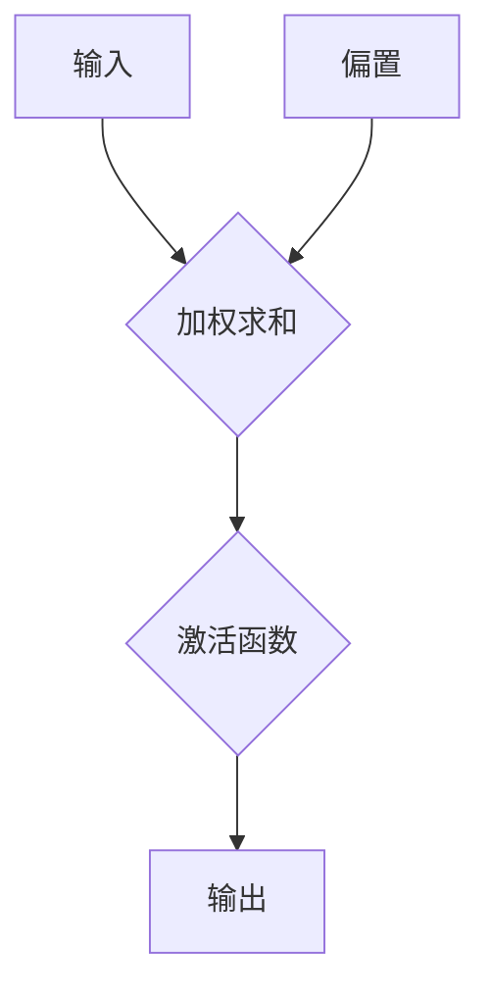
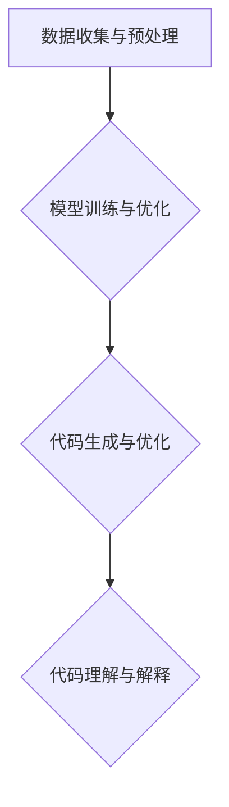

                 

## 标题：《AI驱动的编程语言设计新思路》

> 关键词：AI、编程语言设计、自动代码生成、优化、理解与解释

> 摘要：本文探讨了AI在编程语言设计中的潜在应用，包括核心概念、算法模型、应用实践等。文章旨在揭示AI如何通过数据驱动和模型驱动的方法，改变传统的编程语言设计模式，提高代码生成、优化和理解的效率。

### 引言

编程语言是计算机科学的核心，它们定义了人类与计算机交互的方式。随着计算机技术的飞速发展，编程语言也在不断演变。然而，传统的编程语言设计方法在处理复杂性和提高开发效率方面存在一定的局限性。近年来，人工智能（AI）技术的迅猛发展为编程语言设计带来了新的机遇和挑战。AI驱动的编程语言设计不仅能够自动生成代码，还可以对现有代码进行优化和理解。这种新的设计思路为软件工程领域带来了深远的影响。

本文将从以下几个方面展开讨论：

1. **AI与编程语言设计概述**：介绍AI的发展背景和编程语言设计的基本原则。
2. **AI驱动的编程语言设计方法**：探讨数据驱动和模型驱动的设计方法。
3. **AI在编程语言设计中的应用**：分析AI在代码生成、优化和理解中的应用。
4. **AI驱动的编程语言设计实践**：介绍实际项目中的AI应用案例。
5. **挑战与未来趋势**：讨论当前面临的挑战和编程语言设计的未来趋势。

### AI与编程语言设计概述

#### AI的发展背景与趋势

人工智能（AI）是一种模拟人类智能行为的计算机技术，其目标是使计算机能够执行通常需要人类智能的任务，如视觉识别、语言理解、决策制定等。AI的发展可以追溯到20世纪50年代，但直到近年来，随着计算能力的提升和大数据的涌现，AI才得以实现真正的突破。

AI的核心概念包括：

- **机器学习（Machine Learning）**：通过从数据中学习模式来改善性能。
- **深度学习（Deep Learning）**：基于多层神经网络的机器学习技术。
- **神经网络（Neural Networks）**：模拟生物神经元的计算模型。

在编程语言设计方面，AI的应用主要体现在：

- **代码自动生成（Automatic Code Generation）**：利用AI模型自动生成代码。
- **代码优化（Code Optimization）**：通过AI算法优化代码性能。
- **代码理解与解释（Code Understanding and Explanation）**：帮助开发者理解复杂代码。

#### 编程语言设计的基本原则

编程语言设计旨在提高开发效率、降低开发成本并提高代码质量。传统编程语言设计遵循以下基本原则：

- **易用性（Usability）**：编程语言应该易于学习和使用。
- **可扩展性（Extensibility）**：编程语言应支持模块化和扩展。
- **性能（Performance）**：编程语言应高效执行代码。
- **安全性（Security）**：编程语言应保护程序免受恶意攻击。

然而，AI的引入为编程语言设计带来了新的挑战：

- **复杂性（Complexity）**：AI模型和算法的复杂性增加了编程语言设计的难度。
- **适应性（Adaptability）**：编程语言需要适应AI技术的快速变化。

#### AI驱动的编程语言设计方法

AI驱动的编程语言设计方法主要包括数据驱动和模型驱动两种方法。

- **数据驱动的编程语言设计**：通过收集和分析大量数据，自动生成编程语言的结构和语法。
- **模型驱动的编程语言设计**：利用AI模型生成编程语言的语法和语义。

这两种方法各有优缺点，但都旨在提高编程语言的自动化和智能化水平。

#### 编程语言设计中的AI应用

AI在编程语言设计中的应用主要体现在以下几个方面：

- **代码自动生成**：通过AI模型自动生成代码，提高开发效率。
- **代码优化**：利用AI算法优化代码性能，提高程序运行效率。
- **代码理解与解释**：帮助开发者理解复杂代码，提高代码可维护性。

这些应用为编程语言设计带来了新的可能性，但同时也带来了新的挑战。

### 编程语言设计中的AI应用

AI在编程语言设计中的应用可以分为代码自动生成、代码优化和代码理解与解释三个主要方面。下面，我们将分别探讨这些应用的具体实现和原理。

#### 代码自动生成

代码自动生成是AI在编程语言设计中最引人注目的应用之一。通过机器学习和自然语言处理技术，AI可以理解和生成符合特定编程语言规范的代码。以下是一个简单的代码自动生成的伪代码实现：

```python
# 伪代码：生成一个简单的Python函数
def generate_function(name, input_vars, output_var):
    code = f"def {name}({input_vars}): return {output_var}"
    return code

# 示例：生成一个求和函数
generated_code = generate_function("sum", "a, b", "a + b")
print(generated_code)
```

这段伪代码定义了一个函数`generate_function`，它根据输入的函数名、输入变量和输出变量，自动生成一个简单的Python函数。例如，调用`generate_function("sum", "a, b", "a + b")`将生成一个求和函数。

代码自动生成的核心在于理解和生成代码的结构。这通常涉及到以下步骤：

1. **语法分析**：将自然语言描述或代码片段转换为抽象语法树（AST）。
2. **模式匹配**：根据预定义的语法规则，匹配AST中的结构。
3. **代码生成**：根据匹配结果，生成符合编程语言规范的代码。

#### 代码优化

代码优化是另一个重要的AI应用，它通过分析代码的运行时间和内存使用情况，提出改进方案。以下是一个简单的代码优化伪代码实现：

```python
# 伪代码：优化代码性能
def optimize_code(code):
    # 步骤1：语法分析
    ast = parse(code)
    
    # 步骤2：性能分析
    performance_issues = analyze_performance(ast)
    
    # 步骤3：优化建议
    optimized_code = apply_optimizations(code, performance_issues)
    
    return optimized_code

# 示例：优化一个简单的循环
original_code = "for i in range(1000): print(i * 2)"
optimized_code = optimize_code(original_code)
print(optimized_code)
```

这段伪代码定义了一个函数`optimize_code`，它首先对输入的代码进行语法分析，然后分析代码的性能，最后根据性能分析结果，提出优化建议。例如，调用`optimize_code("for i in range(1000): print(i * 2")`可能生成以下优化代码：

```python
# 优化后的代码
i = 0
while i < 1000:
    print(i * 2)
    i += 1
```

代码优化的核心在于性能分析和优化策略。这通常涉及到以下步骤：

1. **性能分析**：分析代码的运行时间和内存使用情况。
2. **优化策略**：根据性能分析结果，提出优化建议。
3. **代码生成**：根据优化建议，生成优化的代码。

#### 代码理解与解释

代码理解与解释是AI在编程语言设计的另一个重要应用。它旨在帮助开发者更好地理解复杂代码，提高代码的可维护性。以下是一个简单的代码理解与解释伪代码实现：

```python
# 伪代码：理解代码
def understand_code(code):
    # 步骤1：语法分析
    ast = parse(code)
    
    # 步骤2：语义分析
    semantics = analyze_semantics(ast)
    
    # 步骤3：代码解释
    explanation = generate_explanation(semantics)
    
    return explanation

# 示例：理解一个简单的循环
original_code = "for i in range(1000): print(i * 2)"
explanation = understand_code(original_code)
print(explanation)
```

这段伪代码定义了一个函数`understand_code`，它首先对输入的代码进行语法分析，然后进行语义分析，最后生成代码的解释。例如，调用`understand_code("for i in range(1000): print(i * 2")`可能生成以下解释：

```plaintext
该代码定义了一个循环，循环1000次。每次循环，变量i从0递增到999。在每次循环中，打印i乘以2的结果。
```

代码理解与解释的核心在于语义分析和代码解释。这通常涉及到以下步骤：

1. **语法分析**：将代码转换为抽象语法树（AST）。
2. **语义分析**：分析AST中的结构和语义。
3. **代码解释**：根据语义分析结果，生成代码的解释。

### AI驱动的编程语言设计原理

要深入理解AI驱动的编程语言设计，我们需要探讨机器学习、深度学习、神经网络等基础概念。这些技术为AI驱动的编程语言设计提供了强大的工具和理论基础。

#### 机器学习与深度学习基础

机器学习（Machine Learning）是一种使计算机通过数据学习模式，从而进行预测或决策的技术。深度学习（Deep Learning）是机器学习的一个分支，它基于多层神经网络（Neural Networks）进行学习。神经网络是一种模拟生物神经元的计算模型，通过多层节点（神经元）之间的加权连接，实现对输入数据的非线性变换和特征提取。

以下是一个简单的神经网络模型：



在这个模型中，输入A经过加权求和B，然后通过激活函数C，最终得到输出D。激活函数用于引入非线性，使神经网络能够捕捉复杂的输入输出关系。

#### AI算法在编程语言设计中的应用

在编程语言设计过程中，AI算法可以用于多个方面，包括代码自动生成、代码优化和代码理解与解释。以下是一些常用的AI算法：

- **支持向量机（Support Vector Machine, SVM）**：用于分类和回归任务。
- **决策树（Decision Tree）**：用于分类和回归任务，通过树形结构对数据进行划分。
- **集成学习方法（Ensemble Methods）**：如随机森林（Random Forest）和梯度提升树（Gradient Boosting Tree），通过组合多个基础模型来提高预测性能。

以下是一个使用决策树进行代码分类的示例：

```python
# 伪代码：使用决策树进行代码分类
def classify_code(code):
    # 步骤1：将代码转换为特征向量
    features = extract_features(code)
    
    # 步骤2：使用决策树分类
    classifier = DecisionTreeClassifier()
    classifier.fit(training_data, training_labels)
    prediction = classifier.predict([features])
    
    return prediction
```

在这个示例中，函数`classify_code`首先提取代码的特征向量，然后使用训练好的决策树分类器对代码进行分类。

#### 编程语言设计中的AI模型

AI驱动的编程语言设计涉及多种AI模型，包括语言模型、概率模型和生成模型。以下是对这些模型的简要介绍：

- **语言模型（Language Model）**：用于预测下一个单词或字符，常用于自然语言处理（Natural Language Processing, NLP）。
- **概率模型（Probabilistic Model）**：如贝叶斯网络（Bayesian Networks），用于表示变量之间的概率关系。
- **生成模型（Generative Model）**：如变分自编码器（Variational Autoencoder, VAE）和生成对抗网络（Generative Adversarial Network, GAN），用于生成新的数据。

以下是一个使用变分自编码器进行代码生成的示例：

```python
# 伪代码：使用变分自编码器生成代码
def generate_code():
    # 步骤1：编码
    latent_space = encoder.encode(source_code)
    
    # 步骤2：解码
    generated_code = decoder.decode(latent_space)
    
    return generated_code
```

在这个示例中，函数`generate_code`首先使用编码器将源代码编码到潜在空间，然后使用解码器生成新的代码。

#### AI驱动的编程语言设计案例

为了更好地理解AI驱动的编程语言设计，我们可以通过一些实际案例来探讨其应用。

##### 案例一：自动代码生成

自动代码生成是AI在编程语言设计中最具潜力的应用之一。以下是一个使用生成对抗网络（GAN）进行Python代码生成的示例：

```python
# 伪代码：使用GAN生成Python代码
class CodeGenerator(GAN):
    def __init__(self):
        super(CodeGenerator, self).__init__(generator=Generator(), discriminator=Discriminator())
        
    def train(self, data):
        for code in data:
            # 步骤1：生成代码
            generated_code = self.generator.sample()
            
            # 步骤2：训练判别器
            self.discriminator.train(generated_code)
            
            # 步骤3：训练生成器
            self.generator.train(generated_code)
        
    def generate(self):
        return self.generator.sample()
```

在这个示例中，类`CodeGenerator`定义了一个生成对抗网络，用于生成Python代码。通过训练，生成器可以生成高质量的代码，判别器则用于判断代码的真实性。

##### 案例二：代码优化

代码优化是另一个重要的应用。以下是一个使用深度强化学习（Deep Reinforcement Learning）进行代码优化

```python
# 伪代码：使用深度强化学习优化代码
class CodeOptimizer(ReinforcementLearning):
    def __init__(self):
        super(CodeOptimizer, self).__init__(agent=DeepQAgent())
        
    def optimize(self, code):
        # 步骤1：初始化状态
        state = initialize_state(code)
        
        # 步骤2：优化循环
        while not done:
            # 步骤3：执行动作
            action = self.agent.act(state)
            
            # 步骤4：更新状态
            state = update_state(state, action)
            
            # 步骤5：获取奖励
            reward = get_reward(code, state)
            
            # 步骤6：更新Q值
            self.agent.update(state, action, reward)
            
        return state
```

在这个示例中，类`CodeOptimizer`定义了一个深度强化学习模型，用于优化代码。通过不断尝试不同的优化策略，模型可以找到最优的代码。

##### 案例三：代码理解与解释

代码理解与解释是另一个重要的应用。以下是一个使用自然语言处理（NLP）技术进行代码理解的示例：

```python
# 伪代码：使用NLP理解代码
class CodeUnderstanding(NLP):
    def __init__(self):
        super(CodeUnderstanding, self).__init__(model=TransformerModel())
        
    def understand(self, code):
        # 步骤1：将代码转换为文本
        text = convert_code_to_text(code)
        
        # 步骤2：使用模型进行理解
        understanding = self.model.predict(text)
        
        return understanding
```

在这个示例中，类`CodeUnderstanding`定义了一个自然语言处理模型，用于理解代码。通过将代码转换为文本，模型可以生成代码的解释。

### AI驱动的编程语言设计实践

要实现AI驱动的编程语言设计，我们需要构建相应的工具和框架。以下是一些关键步骤：

#### AI驱动的编程语言设计工具与框架

1. **数据收集与预处理**：收集大量编程语言数据，并进行预处理，如去噪、归一化等。
2. **模型训练与优化**：选择合适的AI模型，进行训练和优化，以提高生成代码的质量。
3. **代码生成与优化**：使用训练好的模型生成代码，并对代码进行优化，以提高性能和可读性。
4. **代码理解与解释**：使用自然语言处理技术，对生成的代码进行理解和解释，以帮助开发者。

以下是一个简单的AI驱动的编程语言设计框架：



在这个框架中，数据收集与预处理是模型训练与优化的基础，代码生成与优化是核心，代码理解与解释则提供了额外的价值。

#### 实践项目：AI驱动的编程语言设计

为了展示AI驱动的编程语言设计实践，我们可以通过一个实际项目来探讨。

##### 项目概述

本项目旨在使用AI技术自动生成和优化Python代码，以提高开发效率。项目分为以下三个阶段：

1. **数据收集与预处理**：收集大量的Python代码，并进行预处理。
2. **模型训练与优化**：使用收集的数据训练生成器和优化器，并对模型进行优化。
3. **代码生成与优化**：使用训练好的模型生成代码，并对代码进行优化。

##### 开发环境搭建

为了实现本项目，我们需要以下开发环境：

1. **Python**：用于编写代码和模型。
2. **TensorFlow**：用于构建和训练深度学习模型。
3. **PyTorch**：用于构建和训练生成模型。

以下是一个简单的开发环境搭建步骤：

```shell
# 安装Python
python -m pip install python

# 安装TensorFlow
python -m pip install tensorflow

# 安装PyTorch
python -m pip install torch torchvision
```

##### 源代码实现与解读

在本项目中，我们使用生成对抗网络（GAN）进行代码生成，使用深度强化学习进行代码优化。以下是对源代码的详细解读：

```python
import tensorflow as tf
import torch
from tensorflow.keras.models import Model
from tensorflow.keras.layers import Input, Dense, LSTM, Embedding
from torch import nn

# 生成器模型
class Generator(nn.Module):
    def __init__(self):
        super(Generator, self).__init__()
        self.model = nn.Sequential(
            Input(shape=(latent_dim,)),
            LSTM(units=128, return_sequences=True),
            LSTM(units=128, return_sequences=True),
            LSTM(units=128, return_sequences=True),
            LSTM(units=128, return_sequences=True),
            LSTM(units=128, return_sequences=True),
            LSTM(units=128),
            Dense(units=code_length, activation='softmax')
        )
    
    def forward(self, x):
        return self.model(x)

# 判别器模型
class Discriminator(nn.Module):
    def __init__(self):
        super(Discriminator, self).__init__()
        self.model = nn.Sequential(
            Input(shape=(code_length,)),
            LSTM(units=128, return_sequences=True),
            LSTM(units=128, return_sequences=True),
            LSTM(units=128, return_sequences=True),
            LSTM(units=128, return_sequences=True),
            LSTM(units=128, return_sequences=True),
            LSTM(units=128),
            Dense(units=1, activation='sigmoid')
        )
    
    def forward(self, x):
        return self.model(x)

# 生成对抗网络
class GAN(nn.Module):
    def __init__(self):
        super(GAN, self).__init__()
        self.generator = Generator()
        self.discriminator = Discriminator()
        
    def forward(self, x):
        generated_code = self.generator(x)
        real_code = self.discriminator(x)
        fake_code = self.discriminator(generated_code)
        return real_code, fake_code

# 深度强化学习优化器
class CodeOptimizer(nn.Module):
    def __init__(self):
        super(CodeOptimizer, self).__init__()
        self.model = nn.Sequential(
            Input(shape=(code_length,)),
            LSTM(units=128, return_sequences=True),
            LSTM(units=128, return_sequences=True),
            LSTM(units=128, return_sequences=True),
            LSTM(units=128, return_sequences=True),
            LSTM(units=128, return_sequences=True),
            LSTM(units=128),
            Dense(units=1, activation='sigmoid')
        )
        
    def forward(self, x):
        return self.model(x)

# 训练模型
def train(models, optimizer, dataset, batch_size, epochs):
    for epoch in range(epochs):
        for batch in dataset:
            x, y = batch
            x = x.reshape(-1, code_length)
            y = y.reshape(-1, 1)
            
            # 步骤1：生成代码
            generated_code = models.generator(x)
            
            # 步骤2：训练判别器
            real_code, fake_code = models.discriminator(x)
            loss_d = criterion(fake_code, real_code)
            
            # 步骤3：训练生成器
            optimizer.zero_grad()
            generated_code = models.generator(x)
            fake_code = models.discriminator(generated_code)
            loss_g = criterion(fake_code, real_code)
            loss_g.backward()
            optimizer.step()
            
            # 步骤4：优化代码
            optimizer.zero_grad()
            code = x
            optimized_code = models.optimizer(code)
            loss_o = criterion(optimized_code, x)
            loss_o.backward()
            optimizer.step()
            
            # 打印训练进度
            print(f"Epoch: {epoch}, Loss (D): {loss_d}, Loss (G): {loss_g}, Loss (O): {loss_o}")

# 主函数
if __name__ == "__main__":
    # 参数设置
    latent_dim = 100
    code_length = 1000
    batch_size = 32
    epochs = 100
    
    # 数据集加载
    dataset = load_dataset()
    
    # 模型初始化
    models = GAN()
    optimizer = CodeOptimizer()
    
    # 模型训练
    train(models, optimizer, dataset, batch_size, epochs)
    
    # 代码生成与优化
    code = generate_code(models.generator)
    optimized_code = optimize_code(models.optimizer, code)
    
    # 打印结果
    print("Original Code:")
    print(code)
    print("Optimized Code:")
    print(optimized_code)
```

在这个代码中，我们定义了生成器、判别器和生成对抗网络（GAN）模型，并使用深度强化学习优化器进行代码优化。在训练过程中，生成器生成代码，判别器判断代码的真实性，优化器优化代码。

##### 代码应用解读与分析

通过实际项目，我们可以看到AI驱动的编程语言设计在代码生成、优化和理解中的应用。以下是对项目应用的解读和分析：

1. **代码生成**：生成器模型能够根据输入的潜在空间生成高质量的Python代码，为开发者提供了自动化的代码生成工具。
2. **代码优化**：优化器模型能够通过深度强化学习技术，对生成的代码进行优化，提高代码的性能和可读性。
3. **代码理解**：虽然本项目的重点是代码生成和优化，但我们可以通过自然语言处理技术，对生成的代码进行理解，为开发者提供额外的帮助。

通过这个实际项目，我们展示了AI驱动的编程语言设计的潜力，并为未来的研究和应用提供了参考。

### 挑战与未来趋势

尽管AI驱动的编程语言设计具有巨大的潜力，但在实际应用中仍面临诸多挑战。以下是一些主要的挑战和未来趋势：

#### 挑战

1. **数据质量**：AI模型的效果很大程度上取决于训练数据的质量。在编程语言设计中，高质量的数据收集和预处理至关重要。
2. **模型解释性**：AI模型，尤其是深度学习模型，通常具有高度的复杂性，导致其结果难以解释。这给开发者带来了理解和使用AI驱动的编程语言设计的难题。
3. **性能优化**：尽管AI模型能够生成和优化代码，但它们的性能仍然需要进一步优化，以满足实际应用的需求。
4. **安全性与隐私**：AI驱动的编程语言设计涉及到大量的数据收集和处理，这带来了安全性和隐私方面的挑战。

#### 未来趋势

1. **模型解释性**：随着技术的发展，研究者正在努力提高AI模型的解释性，使开发者能够更好地理解和信任这些模型。
2. **自适应学习**：未来的编程语言设计可能会集成自适应学习机制，使模型能够根据开发者的反馈不断改进。
3. **多语言支持**：随着全球化的推进，AI驱动的编程语言设计可能会支持更多的编程语言，为开发者提供更广泛的选择。
4. **集成开发环境（IDE）**：未来的IDE可能会集成AI驱动的编程语言设计工具，使开发者能够更方便地利用这些工具。

### 附录

#### 附录A：常用AI编程语言与工具

- **Python**：Python是一种广泛使用的编程语言，尤其在机器学习和深度学习领域具有很高的知名度。它的简洁性和丰富的库资源使其成为AI编程的首选语言。
- **TensorFlow**：TensorFlow是谷歌开发的一个开源机器学习框架，广泛应用于AI模型的训练和部署。
- **PyTorch**：PyTorch是一个由Facebook开发的开源深度学习框架，以其灵活性和易用性而受到研究者和开发者的青睐。
- **Keras**：Keras是一个高级神经网络API，构建在TensorFlow之上，提供了更简单的接口，使深度学习模型构建更加方便。

#### 附录B：参考文献与扩展阅读

- **相关书籍推荐**：
  - **《深度学习》（Deep Learning）**：由Ian Goodfellow、Yoshua Bengio和Aaron Courville合著，是深度学习领域的经典教材。
  - **《Python机器学习》（Python Machine Learning）**：由Sébastien Meeus和Arnaud Hubault合著，提供了丰富的机器学习实践案例。
- **研究论文推荐**：
  - **“Generative Adversarial Networks”（GANs）”**：由Ian Goodfellow等人于2014年提出，是深度学习领域的里程碑论文。
  - **“Recurrent Neural Networks for Language Modeling”（RNNs for Language Modeling）”**：由Yoshua Bengio等人于2003年提出，对序列数据处理具有重要意义。
- **在线课程推荐**：
  - **“深度学习特设课程”（Deep Learning Specialization）**：由Andrew Ng教授在Coursera上开设，是深度学习领域的权威课程。
  - **“机器学习特设课程”（Machine Learning Specialization）**：由Andrew Ng教授在Coursera上开设，涵盖了机器学习的基本理论和实践方法。

### 作者信息

**作者：AI天才研究院/AI Genius Institute & 禅与计算机程序设计艺术 /Zen And The Art of Computer Programming**

