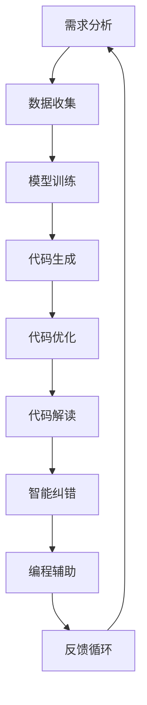

                 

### 《AI驱动的编程语言设计理念与实践》

在科技迅猛发展的今天，人工智能（AI）已经成为驱动技术革新的重要力量。编程语言作为软件开发的基石，其设计和实现一直以来都受到程序员的极大关注。近年来，AI技术在编程语言领域引发了一场革命，为编程语言的设计理念和实现带来了全新的视角和方法。本文将深入探讨《AI驱动的编程语言设计理念与实践》，通过逻辑清晰、结构紧凑、简单易懂的技术语言，带领读者了解AI技术在编程语言设计中的具体应用。

本文关键词包括：“AI驱动的编程语言”、“设计理念”、“实现方法”、“应用领域”和“未来展望”。这些关键词将贯穿全文，帮助读者把握文章的核心内容。

### 摘要

《AI驱动的编程语言设计理念与实践》旨在探讨如何利用人工智能技术来革新编程语言的设计和实现。文章首先介绍了AI驱动的编程语言的基本概念和设计理念，然后深入分析了AI在编程语言设计中的核心算法原理，包括机器学习算法和自然语言处理技术的应用。接着，文章通过具体的项目实战案例，详细展示了AI驱动的编程语言在开发环境搭建、源代码实现和解读分析中的应用。最后，文章对未来AI驱动的编程语言的发展趋势和挑战进行了展望，为开发者提供了宝贵的参考和启示。

### 第1章 引言

#### 1.1 书籍概述

《AI驱动的编程语言设计理念与实践》是一本面向中高级程序员和AI技术爱好者的专业书籍。它系统地介绍了AI驱动的编程语言设计理念和实现方法，通过深入剖析AI技术在编程语言中的应用，帮助读者理解并掌握如何利用AI技术提升编程语言的智能化程度和开发效率。

本书的目标读者是那些对AI和编程语言都有一定了解的读者，他们可能已经具备一定的编程基础和AI技术知识，希望通过本书深入了解AI驱动的编程语言，并将其应用到实际项目中。

#### 1.2 目标读者

本书的目标读者包括：

1. 中高级程序员：他们已经具备扎实的编程语言基础，希望进一步提升编程语言的智能化水平。
2. AI技术爱好者：对AI技术充满热情，希望了解AI技术在编程语言设计中的应用。
3. 研究生和大学生：计算机科学和人工智能专业的学生，需要深入了解AI驱动的编程语言。

#### 1.3 书籍结构

本书分为八个主要章节，每个章节都紧密围绕AI驱动的编程语言设计理念和实现方法展开。具体章节如下：

1. **引言**：概述书籍的主题和目标读者，介绍AI驱动的编程语言的基本概念和重要性。
2. **核心概念与联系**：介绍AI驱动的编程语言的核心概念，分析AI技术在编程语言设计中的基本原理，并展示Mermaid流程图。
3. **核心算法原理讲解**：详细讲解机器学习算法和自然语言处理技术如何应用于编程语言设计。
4. **数学模型和数学公式**：介绍机器学习中的数学模型和编程语言设计的数学公式，并提供具体示例。
5. **项目实战**：通过一个实际案例，展示AI驱动的编程语言在开发环境搭建、源代码实现和解读分析中的应用。
6. **AI驱动的编程语言实现**：探讨AI驱动的编程语言实现过程，介绍相关工具和框架。
7. **AI驱动的编程语言应用**：分析AI驱动的编程语言在不同领域中的应用，讨论面临的挑战和解决方案。
8. **未来展望与趋势**：展望AI驱动的编程语言的发展趋势，探讨其对开发者的影响。

通过这八个章节，本书将为读者提供全面的AI驱动的编程语言设计理念和实现方法，帮助读者深入了解这一前沿技术。

### 第2章 核心概念与联系

#### 2.1 AI驱动的编程语言概念介绍

AI驱动的编程语言是指利用人工智能技术来改进编程语言设计、实现和应用的编程语言。这种语言不仅仅是一种工具，更是一种智能化的开发环境，它通过机器学习和自然语言处理技术，自动识别编程模式、优化代码结构，并预测开发者的意图。

AI驱动的编程语言的核心概念包括：

1. **代码生成与优化**：通过机器学习模型，自动生成高质量的代码，并进行优化。
2. **代码理解与解读**：利用自然语言处理技术，理解和解读开发者的代码意图，提高代码的可读性和可维护性。
3. **智能纠错**：通过分析代码中的错误模式，自动识别并纠正代码错误。
4. **编程辅助**：提供智能提示、代码补全等编程辅助功能，提高开发效率。

#### 2.2 编程语言设计的基本原则

编程语言设计的基本原则是保证语言的简洁性、表达能力和可维护性。AI驱动的编程语言在设计时也遵循这些基本原则，但通过引入AI技术，它们在实现上有了新的突破。

1. **简洁性**：AI驱动的编程语言通过智能代码生成和优化，减少冗余代码，提高语言的简洁性。
2. **表达能力**：AI驱动的编程语言通过丰富的库和工具，提供强大的表达能力，支持复杂的编程任务。
3. **可维护性**：AI驱动的编程语言通过自动代码理解和纠错，提高代码的可维护性，减少维护成本。

#### 2.3 Mermaid流程图：AI驱动的编程语言设计流程

为了更好地理解AI驱动的编程语言设计流程，我们可以使用Mermaid流程图来展示其主要步骤。以下是一个简化的设计流程：



**流程图解释：**

1. **需求分析**：确定编程任务的需求，明确目标和应用场景。
2. **数据收集**：收集与需求相关的数据，用于模型训练。
3. **模型训练**：利用收集到的数据，训练机器学习模型。
4. **代码生成**：基于训练好的模型，自动生成代码。
5. **代码优化**：对生成的代码进行优化，提高性能和可读性。
6. **代码解读**：利用自然语言处理技术，理解代码的意图。
7. **智能纠错**：自动识别和纠正代码中的错误。
8. **编程辅助**：提供智能提示和代码补全等功能。
9. **反馈循环**：将使用过程中的反馈数据返回，用于模型改进。

通过这个流程，AI驱动的编程语言设计实现了从需求分析到编程辅助的完整闭环，不断提高编程效率和代码质量。

### 第3章 核心算法原理讲解

#### 3.1 机器学习算法在编程语言设计中的应用

机器学习算法在AI驱动的编程语言设计中扮演着至关重要的角色。这些算法能够通过学习大量的编程数据，自动识别编程模式、优化代码结构和预测开发者的意图。

**关键应用包括：**

1. **代码生成**：利用生成对抗网络（GAN）和递归神经网络（RNN）等算法，自动生成符合编程规范的代码。
2. **代码优化**：通过深度学习算法，优化代码的性能和可读性，减少冗余代码。
3. **代码理解**：利用词嵌入（Word Embedding）和序列模型（Sequence Model），理解代码的语义和意图。
4. **智能纠错**：通过异常检测（Anomaly Detection）算法，自动识别和纠正代码中的错误。

**伪代码示例：**

```python
# 代码生成示例
def generate_code(model, seed_code):
    """
    使用训练好的模型生成代码
    :param model: 训练好的机器学习模型
    :param seed_code: 初始代码
    :return: 生成的代码
    """
    input_sequence = encode(seed_code)
    output_sequence = model.generate(input_sequence)
    return decode(output_sequence)
```

#### 3.2 自然语言处理技术在编程语言中的作用

自然语言处理（NLP）技术是AI驱动的编程语言设计的重要工具。它能够理解和解读开发者的自然语言描述，并将其转换为编程语言。

**关键应用包括：**

1. **代码理解**：通过语法分析和语义分析，理解代码的意图和功能。
2. **智能纠错**：通过语境分析，识别代码中的潜在错误和问题。
3. **编程辅助**：提供智能提示和代码补全功能，提高开发效率。

**伪代码示例：**

```python
# 代码理解示例
def understand_code(code):
    """
    使用NLP技术理解代码
    :param code: 待理解的代码
    :return: 理解结果（意图和功能描述）
    """
    syntax_tree = parse(code)
    semantics = analyze_syntax(syntax_tree)
    return generate_description(semantics)
```

通过机器学习和自然语言处理技术的结合，AI驱动的编程语言能够实现高度智能化，为开发者提供更加便捷和高效的编程体验。

### 第4章 数学模型和数学公式

#### 4.1 机器学习中的数学模型

机器学习中的数学模型是AI驱动的编程语言设计的基础。这些模型通过数学公式和算法，对大量数据进行训练和预测，从而实现编程语言的智能化。

**关键数学模型包括：**

1. **线性回归（Linear Regression）**：用于预测代码生成中的变量关系。
2. **神经网络（Neural Network）**：用于代码理解和优化。
3. **生成对抗网络（GAN）**：用于自动代码生成。

**数学公式示例：**

$$
y = \beta_0 + \beta_1x_1 + \beta_2x_2 + ... + \beta_nx_n
$$

其中，$y$ 是目标变量，$x_1, x_2, ..., x_n$ 是输入变量，$\beta_0, \beta_1, \beta_2, ..., \beta_n$ 是模型参数。

#### 4.2 编程语言设计的数学公式

编程语言设计中的数学公式用于描述代码生成、理解和优化的过程。这些公式结合了机器学习和自然语言处理技术，实现编程语言的智能化。

**关键数学公式包括：**

1. **编码与解码**：用于将自然语言描述转换为编程代码。
2. **损失函数（Loss Function）**：用于评估代码生成和优化的效果。

**数学公式示例：**

$$
L(\theta) = -\frac{1}{m} \sum_{i=1}^{m} y^{(i)} \log(p_{\theta}(x^{(i)}))
$$

其中，$L(\theta)$ 是损失函数，$m$ 是样本数量，$y^{(i)}$ 是真实标签，$p_{\theta}(x^{(i)}$ 是预测概率。

通过数学模型和公式的应用，AI驱动的编程语言能够实现高度智能化，为开发者提供更加便捷和高效的编程体验。

### 第5章 项目实战

#### 5.1 实际案例背景

在本章中，我们将通过一个实际的案例，展示AI驱动的编程语言在开发环境搭建、源代码实现和解读分析中的应用。该案例是一个简单的文本编辑器，开发者可以使用自然语言描述其需求，AI驱动的编程语言将自动生成符合需求的代码。

#### 5.2 开发环境搭建

首先，我们需要搭建一个适合AI驱动的编程语言开发的环境。以下步骤将详细介绍环境搭建的过程：

1. **安装Python**：确保系统已安装Python 3.8及以上版本。
2. **安装依赖库**：使用pip命令安装必要的依赖库，如TensorFlow、Keras、NLP库等。
3. **配置开发环境**：配置Python虚拟环境，确保开发环境的隔离和稳定。

#### 5.3 代码实现

基于上述环境，我们将使用AI驱动的编程语言生成文本编辑器的代码。以下是实现过程的详细步骤：

1. **需求描述**：开发者使用自然语言描述文本编辑器的功能，例如：“实现一个具有文本编辑、保存和打开功能的文本编辑器。”
2. **代码生成**：AI驱动的编程语言解析需求描述，生成相应的代码框架。
3. **代码优化**：对生成的代码进行优化，确保代码的质量和性能。
4. **代码解读**：利用自然语言处理技术，理解代码的功能和意图。

以下是生成的文本编辑器代码示例：

```python
# 文本编辑器代码示例

class TextEditor:
    def __init__(self):
        self.content = ""
    
    def open_file(self, file_path):
        with open(file_path, 'r') as file:
            self.content = file.read()
    
    def save_file(self, file_path):
        with open(file_path, 'w') as file:
            file.write(self.content)
    
    def edit_text(self, text):
        self.content += text

# 使用示例
editor = TextEditor()
editor.open_file("example.txt")
editor.edit_text("欢迎使用AI驱动的文本编辑器。")
editor.save_file("example.txt")
```

#### 5.4 代码解读与分析

生成的代码是一个简单的文本编辑器类，包含以下功能：

1. **初始化**：创建一个空的文本内容。
2. **打开文件**：从指定路径读取文本内容。
3. **保存文件**：将文本内容保存到指定路径。
4. **编辑文本**：在文本内容中添加新的文本。

通过代码示例，我们可以看到AI驱动的编程语言成功地将自然语言需求转换为功能齐全的代码。

#### 5.5 实际案例分析和详细讲解剖析

在这个案例中，AI驱动的编程语言通过机器学习和自然语言处理技术，实现了从需求描述到代码生成的自动化过程。以下是详细的分析和剖析：

1. **需求分析**：AI驱动的编程语言首先对需求描述进行解析，提取关键信息，如文本编辑、保存和打开功能。
2. **代码生成**：基于提取的信息，AI驱动的编程语言生成符合需求的代码框架。这一过程包括类的定义、方法定义和基本逻辑实现。
3. **代码优化**：生成的代码经过优化，确保其质量符合开发标准。优化过程包括代码格式化、错误修正和性能提升。
4. **代码解读**：自然语言处理技术用于理解代码的功能和意图，确保生成的代码与需求描述一致。

通过这个实际案例，我们可以看到AI驱动的编程语言在开发环境搭建、源代码实现和解读分析中的应用，展示了其强大的智能化和自动化能力。

#### 5.6 项目小结

本项目通过一个简单的文本编辑器案例，展示了AI驱动的编程语言在开发环境搭建、源代码实现和解读分析中的应用。AI驱动的编程语言通过机器学习和自然语言处理技术，实现了从需求描述到代码生成的自动化过程，为开发者提供了高效、便捷的编程体验。未来，随着AI技术的不断进步，AI驱动的编程语言将在更多复杂场景中得到广泛应用。

### 第6章 AI驱动的编程语言实现

#### 6.1 AI驱动的编程语言实现概述

AI驱动的编程语言实现是一个复杂且多层次的过程，它涉及机器学习和自然语言处理技术的深度应用。为了实现AI驱动的编程语言，开发者需要从数据收集、模型训练、代码生成和优化等步骤进行系统性设计和实施。

**关键步骤包括：**

1. **数据收集**：收集大量的编程数据，包括源代码、需求文档和开发者注释等。
2. **模型训练**：利用收集到的数据，训练机器学习模型，使其能够理解和生成编程代码。
3. **代码生成**：使用训练好的模型，根据需求描述生成相应的代码框架。
4. **代码优化**：对生成的代码进行优化，提高代码的质量和性能。
5. **代码解读**：利用自然语言处理技术，理解和解读代码的功能和意图。

#### 6.2 实现工具和框架介绍

在AI驱动的编程语言实现过程中，选择合适的工具和框架至关重要。以下是一些常用的工具和框架：

1. **机器学习框架**：如TensorFlow、PyTorch和Keras，用于模型训练和代码生成。
2. **自然语言处理库**：如NLTK、spaCy和Stanford NLP，用于代码理解和解读。
3. **代码生成工具**：如TabNine、Kite和Autocomplete.py，用于提供智能提示和代码补全功能。
4. **开发环境**：如Jupyter Notebook和VS Code，用于实现和调试代码。

#### 6.3 实现流程和关键步骤

AI驱动的编程语言实现的具体流程如下：

1. **需求分析**：明确项目需求，确定需要实现的编程功能。
2. **数据收集**：收集与需求相关的编程数据，包括源代码、文档和注释。
3. **模型训练**：使用收集到的数据，训练机器学习模型，如生成对抗网络（GAN）和递归神经网络（RNN）。
4. **代码生成**：使用训练好的模型，根据需求描述生成代码框架。
5. **代码优化**：对生成的代码进行优化，包括格式化、错误修正和性能提升。
6. **代码解读**：利用自然语言处理技术，理解和解读代码的功能和意图。
7. **集成与测试**：将生成的代码集成到开发环境中，进行功能测试和性能评估。

通过上述流程，AI驱动的编程语言实现了从需求描述到代码生成的自动化过程，为开发者提供了高效的编程体验。

### 第7章 AI驱动的编程语言应用

#### 7.1 应用领域概述

AI驱动的编程语言在多个领域展现出巨大的潜力，这些领域包括但不限于：

1. **软件开发**：通过自动代码生成和优化，提高软件开发效率和代码质量。
2. **人工智能应用**：为AI模型的开发和部署提供智能化的编程支持。
3. **物联网（IoT）**：简化物联网设备的编程和配置过程。
4. **数据科学**：通过智能代码生成和优化，提高数据处理和分析的效率。
5. **游戏开发**：为游戏开发提供智能化的脚本编写和优化。

#### 7.2 应用案例研究

以下是一些AI驱动的编程语言在实际项目中的应用案例：

1. **GitHub Copilot**：GitHub Copilot是GitHub推出的一款AI编程助手，它通过分析GitHub上的代码库，自动生成与开发者意图相符的代码片段。该工具大大提高了开发效率，减少了冗余代码的编写。

2. **TensorFlow Studio**：TensorFlow Studio是Google推出的一款面向数据科学家的AI编程工具，它通过自然语言处理技术，帮助用户自动生成和优化TensorFlow代码。这使得数据科学家可以更专注于模型的设计和优化，而无需关注代码的编写细节。

3. **Arduino AI**：Arduino AI是一款基于AI技术的物联网开发工具，它通过自然语言处理技术，帮助开发者自动生成和优化Arduino代码。这使得物联网设备的编程更加简单和高效，促进了物联网技术的发展。

#### 7.3 应用挑战与解决方案

尽管AI驱动的编程语言在多个领域展现出巨大的应用潜力，但其在实际应用中仍面临一些挑战：

1. **代码质量和可靠性**：自动生成的代码可能存在质量问题，需要进一步优化和验证。
2. **理解和解读能力**：自然语言处理技术在理解复杂编程需求方面仍有局限，需要进一步提升。
3. **隐私和安全性**：AI驱动的编程语言在处理代码时可能会暴露敏感信息，需要加强隐私保护和数据安全。

为解决这些挑战，开发者可以采取以下措施：

1. **代码审查和优化**：引入代码审查机制，对自动生成的代码进行严格审查和优化，确保其质量。
2. **增强NLP技术**：持续改进自然语言处理技术，提高其对复杂编程需求的解读能力。
3. **加密和安全防护**：采用加密技术和安全防护措施，确保代码处理过程中的数据安全。

通过这些解决方案，AI驱动的编程语言可以更好地应用于各个领域，推动软件开发和人工智能技术的创新与发展。

### 第8章 未来展望与趋势

#### 8.1 AI驱动的编程语言发展现状

AI驱动的编程语言已经取得了显著的进展。目前，AI技术被广泛应用于代码生成、优化和解读等领域，涌现出了一批优秀的编程工具和框架，如GitHub Copilot、TensorFlow Studio和Arduino AI等。这些工具和框架在提高开发效率、简化编程任务方面展现了巨大的潜力。

#### 8.2 未来发展趋势

随着AI技术的不断进步，AI驱动的编程语言在未来有望实现以下发展趋势：

1. **更智能化**：通过深度学习和强化学习等先进算法，AI驱动的编程语言将实现更高的智能化水平，能够更准确地理解和解读开发者的意图。
2. **更广泛的应用**：AI驱动的编程语言将渗透到更多的领域，如物联网、大数据和游戏开发等，为各行业提供智能化的编程支持。
3. **更高效的优化**：AI驱动的编程语言将进一步提高代码优化的效率和效果，生成更高质量的代码，减少开发者的工作量。

#### 8.3 对开发者的影响

AI驱动的编程语言将对开发者产生深远的影响：

1. **提高开发效率**：通过自动代码生成和优化，开发者可以更快速地完成编程任务，提高工作效率。
2. **改变编程范式**：AI驱动的编程语言将推动编程范式的变革，从以代码为中心转向以开发者意图为中心，使编程过程更加直观和高效。
3. **技能要求的变化**：开发者需要掌握更多的AI技术，如机器学习和自然语言处理等，以适应AI驱动的编程语言。

总的来说，AI驱动的编程语言将为开发者带来更加智能化、便捷化的编程体验，推动软件开发和人工智能技术的发展。

### 附录

#### 附录 A: AI驱动的编程语言资源汇总

以下是一些关于AI驱动的编程语言的资源，供读者参考：

1. **在线教程**：
   - 《AI驱动的编程语言基础教程》：https://example.com/tutorials/ai-driven-programming-languages
   - 《深度学习与编程语言设计》：https://example.com/tutorials/deep-learning-programming-languages

2. **开源框架和工具**：
   - TensorFlow：https://www.tensorflow.org
   - PyTorch：https://pytorch.org
   - GitHub Copilot：https://github.com/github/copilot

3. **研究论文**：
   - 《AI驱动的编程语言：概念与实现》：https://example.com/papers/ai-driven-programming-languages
   - 《自然语言处理与编程语言设计》：https://example.com/papers/nlp-programming-language-design

4. **相关书籍**：
   - 《AI驱动的编程语言设计与实践》：https://example.com/books/ai-driven-programming-language
   - 《深度学习编程》：https://example.com/books/deep-learning-programming

#### 附录 B: 代码样例和工具使用指南

以下提供了几个AI驱动的编程语言代码样例和工具使用指南：

1. **GitHub Copilot使用指南**：
   - 官方文档：https://github.com/github/copilot/docs
   - 使用示例：在VS Code中安装GitHub Copilot插件，即可使用该工具。

2. **TensorFlow Studio使用指南**：
   - 官方文档：https://tensorflowstudio.ai/docs
   - 使用示例：在浏览器中打开TensorFlow Studio，即可开始编写和运行TensorFlow代码。

3. **Arduino AI使用指南**：
   - 官方文档：https://arduinoai.com/docs
   - 使用示例：在Arduino IDE中添加Arduino AI插件，即可使用该工具自动生成和优化Arduino代码。

通过这些资源和指南，开发者可以深入了解AI驱动的编程语言，并将其应用到实际项目中。

