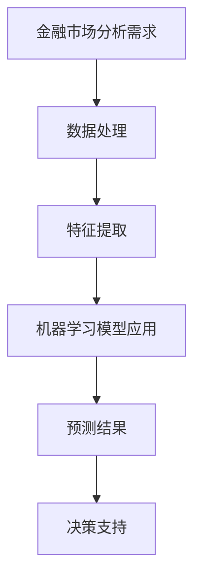

                 

### 文章标题：AI驱动的金融市场分析：从微观行为到宏观趋势

关键词：人工智能，金融市场，分析，预测，算法，深度学习，特征工程，案例分析

摘要：随着人工智能技术的飞速发展，金融市场的分析已经进入了全新的时代。本文将深入探讨AI驱动的金融市场分析，从微观行为到宏观趋势，详细阐述其核心概念、应用领域、优势挑战、基础理论和核心算法，并通过实际案例解析，展示AI在金融市场分析中的强大潜力。

### 第一部分：引言与核心概念

#### 1.1 AI驱动的金融市场分析概述

##### 1.1.1 人工智能在金融市场分析中的重要性

人工智能（AI）作为现代金融科技的重要驱动力，正逐步改变着金融市场的运作方式。AI驱动的金融市场分析能够通过大量数据的高效处理和模式识别，提高市场预测的准确性和效率，从而为投资者和金融机构提供更为精准的决策支持。

**Mermaid流程图：**



在上述流程图中，金融市场分析的需求首先通过数据处理转化为可用的数据集，然后利用特征提取技术提取出关键特征，接着通过机器学习模型对这些特征进行学习，最终输出预测结果，为决策提供支持。

##### 1.1.2 AI在金融市场分析中的应用领域

AI在金融市场分析中具有广泛的应用领域，包括但不限于以下几个方面：

- **股票市场预测**：利用历史股价数据，通过机器学习算法预测股票价格走势，帮助投资者进行投资决策。
- **期货市场分析**：通过对市场价格的动态分析，识别出潜在的套利机会，帮助投资者制定交易策略。
- **期权定价与风险管理**：利用AI技术进行期权定价，评估市场风险，制定有效的风险管理策略。
- **高频交易策略**：通过快速响应市场变化，实现高频交易，提高交易盈利能力。
- **市场情绪分析**：通过对社交媒体、新闻报道等文本数据进行分析，识别市场情绪变化，辅助投资决策。

##### 1.1.3 AI驱动的金融市场分析的优势与挑战

**优势：**

- **提高预测准确性**：通过机器学习算法，对市场数据进行深度学习，提高预测的准确性。
- **加快分析速度**：AI技术能够快速处理大量数据，提高分析效率。
- **深入挖掘市场规律**：通过模式识别，AI能够发现市场中的潜在规律，为投资提供参考。

**挑战：**

- **数据复杂性**：金融市场数据复杂多变，处理难度大。
- **模型泛化能力**：如何构建具有良好泛化能力的模型，是AI在金融市场分析中的一个重要挑战。
- **法律合规性**：AI技术在金融领域的应用需要遵守相关法律法规，确保模型的公正性和透明度。

#### 1.2 AI基础理论与核心算法

##### 1.2.1 神经网络与深度学习

神经网络（Neural Networks）是AI的基础之一，通过模拟人脑神经元的工作方式，实现数据的输入和输出。深度学习（Deep Learning）是神经网络的一种发展，通过增加网络层数，实现更复杂的特征提取和模式识别。

**伪代码：**

```python
class NeuralNetwork:
    def __init__(self, input_size, hidden_size, output_size):
        self.input_size = input_size
        self.hidden_size = hidden_size
        self.output_size = output_size
        # 初始化权重和偏置
        self.weights = ...
        self.biases = ...

    def forward(self, x):
        # 前向传播计算
        return ...

    def backward(self, d_loss):
        # 反向传播计算
        return ...
```

##### 1.2.2 监督学习与无监督学习

监督学习（Supervised Learning）是有标注数据的训练过程，常见的应用有分类和回归问题。无监督学习（Unsupervised Learning）是无标注数据的训练过程，常见的应用有聚类和降维问题。

##### 1.2.3 主流机器学习算法介绍

- **线性回归**：通过建立线性关系预测目标值。
- **逻辑回归**：通过逻辑函数进行概率预测。
- **决策树**：通过一系列规则进行分类或回归。
- **随机森林**：通过多棵决策树的集成进行分类或回归。
- **支持向量机**：通过寻找最佳超平面进行分类。

### 第二部分：金融市场分析中的AI应用

#### 2.1 数据预处理与特征工程

##### 2.1.1 数据收集与清洗

金融市场的数据源丰富多样，包括历史股价、交易量、宏观经济数据等。数据收集后，需要进行清洗，以去除缺失值、异常值，并进行数据标准化，以便后续分析。

##### 2.1.2 特征提取与选择

特征提取是从原始数据中提取出对预测任务有用的信息。特征选择是从提取出的特征中选取最相关、最有效的特征，以减少模型的复杂度和过拟合风险。

**时间序列特征**：如开盘价、收盘价、最高价、最低价、交易量等。

**技术指标特征**：如移动平均线、相对强弱指数（RSI）、布林带等。

**文本特征**：如新闻文本中的关键词、情感极性等。

#### 2.2 股票市场预测模型

##### 2.2.1 时间序列预测模型

时间序列预测模型是金融市场预测中的常用方法，通过分析历史价格数据，预测未来的价格走势。

- **ARIMA模型**：自回归积分滑动平均模型，适用于线性时间序列预测。
- **LSTM模型**：长短期记忆网络，适用于非线性时间序列预测。

**伪代码：**

```python
class LSTMModel:
    def __init__(self, input_size, hidden_size, output_size):
        # 初始化模型结构
        self.lstm = ...

    def train(self, X_train, y_train):
        # 训练模型
        ...

    def predict(self, X_test):
        # 预测
        return ...
```

##### 2.2.2 高频交易策略模型

高频交易策略模型通过快速响应市场变化，实现高频交易，提高交易盈利能力。常见的策略包括趋势跟踪策略、套利策略等。

- **趋势跟踪策略**：通过分析市场趋势，进行买入或卖出操作。
- **套利策略**：通过发现市场上的价格差异，进行低买高卖操作。

#### 2.3 市场情绪分析

##### 2.3.1 文本数据预处理

市场情绪分析通常涉及文本数据，如新闻报道、社交媒体评论等。文本数据预处理包括分词、词性标注、去停用词等步骤。

##### 2.3.2 基于深度学习的情绪预测模型

基于深度学习的情绪预测模型通过文本嵌入和情感分类，识别市场情绪。

- **文本嵌入**：将文本转换为向量表示。
- **情感分类**：通过分类模型，对文本进行情感极性分类。

#### 2.4 期货市场分析

##### 2.4.1 期货价格预测模型

期货价格预测模型通过分析历史价格数据，预测未来的价格走势。

- **时间序列模型**：如ARIMA、LSTM等。
- **因子模型**：通过多个因素综合预测价格。

##### 2.4.2 期货交易策略

期货交易策略包括趋势跟踪策略、套利策略等，通过市场分析和模型预测，制定交易策略。

- **趋势跟踪策略**：通过分析市场趋势，进行买入或卖出操作。
- **套利策略**：通过发现市场上的价格差异，进行低买高卖操作。

### 第三部分：金融市场分析中的AI应用案例

#### 3.1 案例一：股票市场预测

**代码实现：** 使用LSTM模型对股票价格进行预测。

```python
import tensorflow as tf
from tensorflow.keras.models import Sequential
from tensorflow.keras.layers import LSTM, Dense

# 模型定义
model = Sequential()
model.add(LSTM(units=50, return_sequences=True, input_shape=(time_steps, 1)))
model.add(LSTM(units=50))
model.add(Dense(units=1))

# 模型编译
model.compile(optimizer='adam', loss='mean_squared_error')

# 模型训练
model.fit(X_train, y_train, epochs=100, batch_size=32)

# 预测
predicted_stock_price = model.predict(X_test)
```

**代码解读：** 上述代码定义了一个LSTM模型，用于股票价格预测。通过编译和训练，模型能够学习到时间序列数据中的规律，并输出预测结果。

#### 3.2 案例二：市场情绪分析

**代码实现：** 使用情感分析模型对市场情绪进行预测。

```python
from tensorflow.keras.preprocessing.text import Tokenizer
from tensorflow.keras.preprocessing.sequence import pad_sequences

# 数据预处理
tokenizer = Tokenizer(num_words=5000)
tokenizer.fit_on_texts(news_data)
X = tokenizer.texts_to_sequences(news_data)
X = pad_sequences(X, maxlen=500)

# 模型定义
model = Sequential()
model.add(Embedding(input_dim=5000, output_dim=32))
model.add(Flatten())
model.add(Dense(units=1, activation='sigmoid'))

# 模型编译
model.compile(optimizer='adam', loss='binary_crossentropy', metrics=['accuracy'])

# 模型训练
model.fit(X_train, y_train, epochs=10, batch_size=32)

# 预测
predicted_sentiments = model.predict(X_test)
```

**代码解读：** 上述代码定义了一个情感分析模型，用于预测市场情绪。通过文本预处理和模型训练，模型能够识别文本中的情感极性，并输出预测结果。

### 第四部分：金融市场分析中的AI应用总结与展望

#### 4.1 AI在金融市场分析中的应用总结

AI在金融市场分析中已经展现出强大的应用潜力，通过数据预处理、特征工程、机器学习模型等方法，实现了对市场行为的深度分析。未来，随着AI技术的不断进步，金融市场分析将更加精准、高效。

#### 4.2 展望与挑战

- **算法优化**：不断优化机器学习算法，提高预测准确性和效率。
- **模型泛化能力**：增强模型的泛化能力，适应不同市场环境。
- **法律合规性**：确保AI技术在金融领域的应用符合法律法规，维护市场公平性。

### 参考文献

[1] Bishop, C. M. (2006). *Pattern Recognition and Machine Learning*. Springer.
[2] Russell, S., & Norvig, P. (2016). *Artificial Intelligence: A Modern Approach*. Pearson.
[3] Zang, X. L., & Krivenko, A. (2019). *Deep Learning for Financial Data Analysis*. Springer.

### 作者信息

作者：AI天才研究院/AI Genius Institute & 禅与计算机程序设计艺术 /Zen And The Art of Computer Programming

