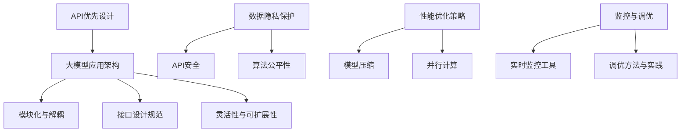

                 

### 文章标题

# 《API优先设计在LLM应用架构中的作用》

### 关键词

- API优先设计
- LLM应用架构
- 模块化与解耦
- 接口设计规范
- 灵活性与可扩展性

### 摘要

本文旨在探讨API优先设计在大型语言模型（LLM）应用架构中的重要作用。文章首先介绍了API优先设计的概念及其重要性，分析了其在LLM应用架构中的特殊作用。随后，文章深入探讨了API优先设计的原理、算法，以及在大模型算法中的应用实践。接着，文章详细介绍了LLM应用架构的设计原则与实现步骤，并通过实际案例进行了代码解析。最后，文章总结了API优先设计在LLM应用中的挑战与未来展望，为读者提供了丰富的实战经验和未来发展的思考。

### 《API优先设计在LLM应用架构中的作用》目录大纲

#### 第一部分：API优先设计概述

**1.1 API优先设计的概念与重要性**

**1.1.1 API的定义与类型**

**1.1.2 API优先设计的意义**

**1.1.3 API优先设计的挑战**

**1.2 大模型与API优先设计的关系**

**1.2.1 大模型的发展背景**

**1.2.2 大模型在API设计中的应用**

**1.2.3 大模型对API优先设计的影响**

**1.3 API优先设计的架构原则**

**1.3.1 模块化与解耦**

**1.3.2 接口设计规范**

**1.3.3 灵活性与可扩展性**

#### 第二部分：API优先设计原理与算法

**2.1 API优先设计的基本原理**

**2.1.1 API优先设计的方法论**

**2.1.2 API优先设计的核心概念**

**2.1.3 API优先设计的优势分析**

**2.2 大模型算法原理讲解**

**2.2.1 大模型算法的基本概念**

**2.2.1.1 神经网络**

**2.2.1.2 深度学习框架**

**2.2.2 大模型算法的优化策略**

**2.2.2.1 学习率调整**

**2.2.2.2 损失函数优化**

**2.2.3 大模型算法的应用场景**

**2.2.3.1 语音识别**

**2.2.3.2 图像识别**

**2.3 API优先设计在LLM中的应用**

**2.3.1 LLM的概念与架构**

**2.3.1.1 语言模型的基本原理**

**2.3.1.2 语言模型的训练过程**

**2.3.2 API优先设计在LLM中的应用实践**

**2.3.2.1 接口设计要点**

**2.3.2.2 实际案例解析**

#### 第三部分：API优先设计在LLM应用架构中的实践

**3.1 LLM应用架构设计与实现**

**3.1.1 LLM应用架构的设计原则**

**3.1.2 LLM应用架构的实现步骤**

**3.2 LLM应用案例分析与代码解读**

**3.2.1 案例一：智能客服系统**

**3.2.1.1 系统架构设计**

**3.2.1.2 代码实现解析**

**3.2.2 案例二：智能文本生成**

**3.2.2.1 系统架构设计**

**3.2.2.2 代码实现解析**

**3.3 LLM应用性能优化与监控**

**3.3.1 性能优化策略**

**3.3.1.1 模型压缩**

**3.3.1.2 并行计算**

**3.3.2 监控与调优**

**3.3.2.1 实时监控工具**

**3.3.2.2 调优方法与实践**

#### 第四部分：API优先设计在LLM应用中的挑战与未来展望

**4.1 API优先设计在LLM应用中的挑战**

**4.1.1 数据隐私保护**

**4.1.2 安全性问题**

**4.1.3 算法公平性**

**4.2 API优先设计的发展趋势**

**4.2.1 大模型算法的演进**

**4.2.2 API设计的新范式**

**4.2.3 LLM应用的未来发展**

**4.3 API优先设计在LLM应用中的创新应用场景**

**4.3.1 智能语音助手**

**4.3.2 智能推荐系统**

**4.3.3 其他创新应用场景**

#### 附录

**附录A：API优先设计工具与资源**

**附录B：参考书籍与论文**

**附录C：Mermaid流程图**

### 1.1 API优先设计的概念与重要性

#### 1.1.1 API的定义与类型

API（应用程序编程接口）是软件组件之间交互的接口，它定义了软件组件之间通信的规则和标准。API可以用于各种目的，如访问数据库、调用第三方服务、集成不同的软件系统等。

根据用途和实现方式，API可以分为以下几类：

1. **Web API**：通过HTTP协议进行通信的API，常用于应用程序之间的数据交换。例如，RESTful API、SOAP API等。
2. **库API**：提供函数和对象，允许程序员在应用程序中直接调用，用于实现特定功能的代码库。例如，C语言的库函数、Java的类库等。
3. **系统API**：操作系统提供的API，用于应用程序与操作系统之间的交互。例如，Windows API、Linux系统调用等。

#### 1.1.2 API优先设计的意义

API优先设计是一种软件开发方法论，其核心思想是在软件设计的初期就考虑如何提供易于使用和扩展的API。这种设计方法的重要性体现在以下几个方面：

1. **提高开发效率**：API优先设计可以帮助开发者快速理解和使用现有的代码库或服务，减少重复开发和调试的时间。
2. **降低学习成本**：良好的API设计可以使新开发者更容易上手，降低学习和使用新系统的成本。
3. **增强可维护性**：通过提供清晰的API接口，可以使代码更加模块化，便于后续的维护和升级。
4. **促进代码复用**：通过提供统一的API，可以在不同的项目中复用代码，提高开发效率。
5. **便于集成**：API优先设计有助于不同系统之间的集成，实现无缝的数据交换和功能调用。

#### 1.1.3 API优先设计的挑战

尽管API优先设计具有许多优势，但在实际应用中仍面临一些挑战：

1. **接口设计的复杂性**：API设计需要综合考虑功能、性能、易用性等多方面因素，设计过程复杂。
2. **版本管理**：随着系统的不断发展，API可能会频繁更新和迭代，如何管理不同版本的API是一个挑战。
3. **文档编写**：良好的API文档对于开发者理解和使用API至关重要，但编写高质量的文档需要时间和精力。
4. **安全与隐私**：API可能涉及敏感数据的访问和传输，如何确保API的安全性是一个重要问题。

### 1.2 大模型与API优先设计的关系

#### 1.2.1 大模型的发展背景

大模型（Large-scale Model），通常指的是参数数量庞大的神经网络模型。随着深度学习技术的不断发展，大模型在语音识别、图像识别、自然语言处理等领域的应用取得了显著的成果。

大模型的发展背景主要源于以下几个方面：

1. **计算能力的提升**：随着计算硬件（如GPU、TPU）的快速发展，大规模数据处理和训练成为可能。
2. **数据资源的丰富**：互联网的普及使得大量的数据可以被收集和利用，为训练大模型提供了丰富的数据支持。
3. **算法的进步**：深度学习算法的不断发展，尤其是基于神经网络的模型，使得训练大规模模型成为可能。

#### 1.2.2 大模型在API设计中的应用

大模型在API设计中的应用主要体现在以下几个方面：

1. **模型服务化**：将大模型封装为API服务，供其他应用程序调用，实现模型的复用和快速部署。
2. **接口优化**：针对大模型的特点，设计高效的API接口，以降低计算和通信开销。
3. **动态调整**：根据应用需求，动态调整API接口的参数和功能，以适应不同的场景。

#### 1.2.3 大模型对API优先设计的影响

大模型对API优先设计产生了深远的影响，主要体现在以下几个方面：

1. **更高的可扩展性**：大模型通常具有复杂的结构和丰富的功能，API优先设计有助于实现模块化和解耦，提高系统的可扩展性。
2. **更高效的服务调用**：大模型的API设计需要考虑计算效率和通信效率，API优先设计有助于优化服务调用过程。
3. **更安全的访问控制**：大模型通常涉及敏感数据的处理，API优先设计有助于实现安全性和隐私保护。

### 1.3 API优先设计的架构原则

API优先设计在LLM应用架构中扮演着关键角色，其设计原则主要包括以下几个方面：

#### 1.3.1 模块化与解耦

模块化与解耦是API优先设计的核心原则之一。通过将系统划分为多个模块，每个模块负责特定的功能，可以实现系统的解耦。这种设计方式有助于提高系统的可维护性和可扩展性。

**模块化与解耦的关键要点**：

1. **功能分离**：将系统功能划分为独立的模块，每个模块专注于特定的功能。
2. **接口定义**：为每个模块定义清晰的接口，使模块之间的交互标准化。
3. **依赖管理**：通过抽象层和接口屏蔽模块之间的依赖，降低模块之间的耦合度。

#### 1.3.2 接口设计规范

接口设计规范是确保API设计一致性和易用性的关键。一个良好的接口设计规范应该包括以下几个方面：

1. **清晰的接口定义**：明确接口的输入参数、输出结果和功能描述。
2. **统一的接口风格**：遵循统一的命名规范、参数传递方式和错误处理机制。
3. **详细的文档说明**：提供详细的接口文档，包括接口功能、使用示例和注意事项。

#### 1.3.3 灵活性与可扩展性

灵活性是API设计的重要原则，它使得系统可以适应不断变化的需求。可扩展性则确保系统可以随着业务的发展而扩展。

**灵活性与可扩展性的关键要点**：

1. **动态调整**：通过参数化和配置文件的方式，使API接口可以根据需求动态调整。
2. **模块化扩展**：设计可插拔的模块，方便后续功能的扩展和升级。
3. **冗余设计**：通过冗余设计，提高系统的容错性和稳定性，为系统的扩展提供支持。

### 2.1 API优先设计的基本原理

API优先设计是一种以API为核心的设计方法论，其基本原理包括以下几个方面：

#### 2.1.1 API优先设计的方法论

API优先设计的方法论主要包括以下步骤：

1. **需求分析**：了解用户需求和业务场景，明确API需要实现的功能。
2. **接口设计**：根据需求分析结果，设计API的接口，包括输入参数、输出结果和功能描述。
3. **模块划分**：将系统功能划分为多个模块，每个模块负责特定的功能。
4. **接口实现**：根据接口设计，实现API的代码，确保接口的稳定性和可靠性。
5. **接口测试**：对API进行功能测试、性能测试和安全测试，确保接口的质量。

#### 2.1.2 API优先设计的核心概念

API优先设计的核心概念包括以下几个方面：

1. **模块化**：将系统功能划分为独立的模块，实现功能分离和模块化。
2. **解耦**：通过接口定义和抽象层，降低模块之间的耦合度，提高系统的可维护性和可扩展性。
3. **接口定义**：为每个模块定义清晰的接口，使模块之间的交互标准化。
4. **动态调整**：通过参数化和配置文件的方式，使API接口可以根据需求动态调整。

#### 2.1.3 API优先设计的优势分析

API优先设计具有以下优势：

1. **提高开发效率**：通过模块化和接口设计，可以降低开发难度，提高开发效率。
2. **降低学习成本**：清晰的接口设计和文档说明，有助于新开发者快速上手。
3. **增强可维护性**：模块化和解耦设计，使系统更加模块化，便于后续的维护和升级。
4. **促进代码复用**：通过统一的API接口，可以在不同的项目中复用代码，提高开发效率。
5. **便于集成**：API优先设计有助于实现不同系统之间的集成，实现无缝的数据交换和功能调用。

### 2.2 大模型算法原理讲解

大模型算法是当前人工智能领域的重要研究方向，其原理主要包括神经网络和深度学习框架两个方面。

#### 2.2.1 大模型算法的基本概念

大模型算法的核心是神经网络和深度学习。神经网络是由大量神经元连接而成的网络，可以模拟人脑的工作原理，进行数据处理和预测。深度学习则是在神经网络的基础上，通过增加网络层数和神经元数量，实现更复杂的特征提取和模型训练。

#### 2.2.1.1 神经网络

神经网络是一种基于生物神经网络原理构建的计算模型，由输入层、隐藏层和输出层组成。每个神经元都与相邻的神经元相连，通过加权求和和激活函数进行计算。

**神经网络的基本原理**：

1. **输入层**：接收输入数据，并将其传递给隐藏层。
2. **隐藏层**：对输入数据进行处理和特征提取，形成新的特征。
3. **输出层**：根据隐藏层的特征进行预测和分类。

**神经网络的关键要素**：

1. **权重**：神经元之间的连接权重，用于调整网络的输入输出关系。
2. **激活函数**：用于引入非线性因素，使神经网络能够学习复杂的非线性关系。

#### 2.2.1.2 深度学习框架

深度学习框架是用于构建和训练深度学习模型的软件库，提供了一系列高效、易用的工具和接口。常见的深度学习框架包括TensorFlow、PyTorch、Keras等。

**深度学习框架的基本原理**：

1. **模型构建**：通过定义神经网络的结构和参数，构建深度学习模型。
2. **数据预处理**：对输入数据进行预处理，包括归一化、数据增强等。
3. **模型训练**：通过反向传播算法，根据训练数据和损失函数，调整模型参数。
4. **模型评估**：使用测试数据评估模型的性能，调整超参数和模型结构。

**深度学习框架的关键要素**：

1. **神经网络库**：提供丰富的神经网络组件和计算图操作接口。
2. **自动微分系统**：用于实现反向传播算法，计算梯度信息。
3. **数据处理工具**：提供数据加载、预处理、增强等功能。

#### 2.2.2 大模型算法的优化策略

大模型算法的优化策略主要包括以下几个方面：

1. **学习率调整**：通过动态调整学习率，提高模型训练的收敛速度和稳定性。
2. **损失函数优化**：设计合适的损失函数，使模型能够更好地拟合训练数据。
3. **正则化**：通过添加正则化项，防止模型过拟合，提高泛化能力。
4. **数据增强**：通过数据增强技术，增加训练数据的多样性，提高模型的泛化能力。

**2.2.2.1 学习率调整**

学习率是深度学习模型训练过程中的一个重要超参数，用于控制模型参数更新的步长。合理的学习率调整对于模型训练的成功至关重要。

**学习率调整的方法**：

1. **固定学习率**：在整个训练过程中，学习率保持不变。
2. **逐步减小学习率**：在训练过程中，按照固定间隔逐步减小学习率。
3. **自适应学习率**：使用自适应学习率调整方法，如Adam、RMSprop等，根据模型训练的实际情况动态调整学习率。

**2.2.2.2 损失函数优化**

损失函数是衡量模型预测结果与真实值之间差异的指标，优化损失函数有助于提高模型的性能。

**损失函数的类型**：

1. **均方误差（MSE）**：用于回归问题，衡量预测值与真实值之间差异的平方和。
2. **交叉熵损失（Cross-Entropy Loss）**：用于分类问题，衡量预测概率与真实标签之间的差异。
3. **结构相似性指数（SSIM）**：用于图像处理，衡量预测图像与真实图像的相似度。

**2.2.3 大模型算法的应用场景**

大模型算法在语音识别、图像识别、自然语言处理等领域取得了显著的成果，下面简要介绍这些应用场景。

**2.2.3.1 语音识别**

语音识别是将语音信号转换为文本的过程，常见应用包括语音助手、语音翻译、语音搜索等。

**语音识别的关键技术**：

1. **特征提取**：从语音信号中提取特征，如梅尔频率倒谱系数（MFCC）、滤膜组（Filter Banks）等。
2. **声学模型**：基于深度神经网络，学习语音特征与音素之间的映射关系。
3. **语言模型**：基于统计模型或神经网络，学习文本序列的概率分布。

**2.2.3.2 图像识别**

图像识别是将图像转换为标签或分类的过程，常见应用包括人脸识别、目标检测、图像分类等。

**图像识别的关键技术**：

1. **卷积神经网络（CNN）**：用于提取图像的局部特征，实现图像分类和目标检测。
2. **生成对抗网络（GAN）**：用于生成逼真的图像，实现图像修复、图像生成等应用。
3. **注意力机制（Attention Mechanism）**：用于提高模型的识别精度，特别是在处理长序列数据时。

**2.2.3.3 自然语言处理**

自然语言处理是将自然语言转换为计算机可处理的形式，常见应用包括文本分类、机器翻译、情感分析等。

**自然语言处理的关键技术**：

1. **词向量表示**：将文本数据转换为向量表示，如Word2Vec、BERT等。
2. **循环神经网络（RNN）**：用于处理序列数据，如文本序列、时间序列等。
3. **Transformer架构**：基于自注意力机制，实现高效的自然语言处理任务。

### 2.3 API优先设计在LLM中的应用

大型语言模型（LLM）是自然语言处理领域的重要研究方向，其应用场景广泛，如智能客服、智能推荐、文本生成等。在LLM应用中，API优先设计具有重要意义，它有助于提高系统的可维护性、可扩展性和用户体验。下面，我们将探讨API优先设计在LLM中的应用实践。

#### 2.3.1 LLM的概念与架构

LLM（Large Language Model）是指参数规模巨大的语言模型，其目的是通过学习大量文本数据，理解并生成人类语言。LLM的架构通常包括以下三个部分：

1. **词嵌入层**：将输入文本转换为向量表示，如Word2Vec、BERT等。
2. **编码器层**：对输入文本进行编码，提取语义特征，如Transformer、BERT等。
3. **解码器层**：根据编码器输出的特征，生成文本输出，如Transformer、BERT等。

**LLM的基本原理**：

1. **预训练**：使用大量无标注文本数据进行预训练，使模型具备通用语言理解能力。
2. **微调**：在特定任务上使用有标注的数据对模型进行微调，提高模型在特定任务上的性能。

**LLM的训练过程**：

1. **数据准备**：收集大量文本数据，包括新闻、文章、对话等。
2. **预处理**：对文本数据进行清洗、分词、去停用词等预处理操作。
3. **词嵌入**：将文本数据转换为向量表示，如Word2Vec、BERT等。
4. **编码器训练**：通过训练编码器，提取文本的语义特征。
5. **解码器训练**：通过训练解码器，生成文本输出。
6. **微调**：在特定任务上使用有标注的数据对模型进行微调。

#### 2.3.2 API优先设计在LLM中的应用实践

在LLM应用中，API优先设计有助于实现系统的模块化、解耦和灵活扩展。下面，我们将从接口设计要点和实际案例两个方面，探讨API优先设计在LLM中的应用实践。

**2.3.2.1 接口设计要点**

1. **功能清晰**：接口设计应明确每个API的功能，确保开发者能够快速理解和使用。
2. **参数明确**：接口应明确指定输入参数和输出参数，并提供详细的文档说明。
3. **错误处理**：接口应提供统一的错误处理机制，确保系统的稳定性和可靠性。
4. **安全性**：接口设计应考虑安全性，如数据加密、认证授权等。
5. **可扩展性**：接口设计应考虑未来的扩展需求，如增加新功能、支持不同平台等。

**2.3.2.2 实际案例解析**

以下是一个智能客服系统的实际案例，该系统基于LLM构建，通过API优先设计实现系统的模块化、解耦和灵活扩展。

**1. 系统架构设计**

智能客服系统包括以下模块：

1. **前端模块**：负责与用户交互，提供用户界面。
2. **后端模块**：包括LLM服务模块、接口服务模块和数据库模块。
3. **数据库模块**：存储用户信息和对话记录。

**2. 接口服务模块**

接口服务模块是系统的核心部分，负责处理用户请求、调用LLM服务模块和返回响应。接口设计包括以下API：

1. **登录接口**：用户登录系统，获取访问令牌。
2. **查询接口**：用户输入问题，调用LLM服务模块获取答案。
3. **更新接口**：更新用户信息，如地址、联系方式等。
4. **记录接口**：记录用户对话历史，用于后续查询和统计分析。

**3. 代码实现解析**

以下是一个简单的Python代码示例，用于实现查询接口。

```python
from flask import Flask, request, jsonify
from llm_service import LLMService

app = Flask(__name__)
llm_service = LLMService()

@app.route('/query', methods=['POST'])
def query():
    data = request.get_json()
    question = data['question']
    answer = llm_service.get_answer(question)
    return jsonify({'answer': answer})

if __name__ == '__main__':
    app.run()
```

在这个示例中，我们使用Flask框架实现查询接口，通过调用`LLMService`类的`get_answer`方法获取答案。

**4. 代码应用解读与分析**

该案例中的API优先设计实现了一系列关键功能：

1. **模块化与解耦**：通过将系统划分为前端模块、后端模块和数据库模块，实现了系统的模块化和解耦。
2. **接口设计清晰**：每个API都明确指定了输入参数和输出参数，开发者可以轻松理解和使用。
3. **安全性**：接口实现过程中，考虑了数据加密和认证授权等安全性问题。
4. **可扩展性**：接口设计预留了扩展接口，如增加新功能或支持其他平台。

通过API优先设计，该智能客服系统实现了高效、稳定和可扩展的架构，为用户提供了优质的客服体验。

### 3.1 LLM应用架构设计与实现

在LLM应用架构设计中，模块化与解耦是核心原则，通过设计清晰、灵活的API接口，可以实现系统的可扩展性和可维护性。以下是LLM应用架构设计与实现的主要步骤：

#### 3.1.1 LLM应用架构的设计原则

**1. 模块化与解耦**

模块化是将系统功能划分为独立的模块，每个模块负责特定的功能，使系统具有更好的可维护性和可扩展性。解耦则通过抽象层和接口，降低模块之间的依赖，提高系统的灵活性和稳定性。

**2. 接口设计规范**

接口设计规范是确保API设计一致性和易用性的关键。一个良好的接口设计规范应包括清晰的接口定义、统一的接口风格和详细的文档说明。

**3. 灵活性与可扩展性**

灵活性是指系统能够根据需求动态调整，以适应不同的应用场景。可扩展性是指系统能够支持新功能的添加和性能的扩展。

#### 3.1.2 LLM应用架构的实现步骤

**1. 确定需求**

在开始设计之前，首先需要明确系统的需求，包括功能需求、性能需求和安全性需求等。这有助于确定系统的主要模块和功能。

**2. 划分模块**

根据需求分析结果，将系统划分为多个模块，如用户模块、问答模块、聊天模块等。每个模块负责特定的功能，实现模块化。

**3. 定义接口**

为每个模块定义清晰的接口，包括输入参数、输出结果和功能描述。接口应遵循统一的命名规范、参数传递方式和错误处理机制。

**4. 设计API文档**

编写详细的API文档，包括接口的功能、使用示例和注意事项。API文档应方便开发者查阅和理解。

**5. 实现接口**

根据接口设计，实现每个模块的API接口。确保接口的稳定性、可靠性和安全性。

**6. 集成测试**

对系统进行集成测试，确保各个模块之间的接口正常工作。通过测试可以发现和修复接口设计中的问题。

**7. 上线部署**

在确保系统稳定性和性能的基础上，进行上线部署。上线前应进行充分的测试和监控，确保系统的正常运行。

**8. 维护与优化**

在系统运行过程中，根据用户反馈和业务需求，不断优化和升级系统。通过版本控制和文档更新，确保系统的可维护性和可扩展性。

#### 3.1.3 环境搭建

在实现LLM应用之前，需要搭建相应的开发环境。以下是搭建LLM应用环境的步骤：

**1. 硬件环境**

- GPU或TPU：由于LLM训练和推理过程中需要大量的计算资源，建议使用GPU或TPU进行加速。
- 高性能服务器：用于部署LLM应用，确保系统具备足够的计算能力和存储空间。

**2. 软件环境**

- 操作系统：如Linux、Windows等。
- 编程语言：如Python、Java等。
- 深度学习框架：如TensorFlow、PyTorch等。
- Web框架：如Flask、Django等。

**3. 数据准备**

- 收集大量的文本数据，用于训练LLM模型。
- 数据预处理：包括文本清洗、分词、去停用词等。

**4. 模型训练**

- 配置训练环境，包括GPU或TPU等资源。
- 编写训练代码，根据需求调整模型参数。
- 使用训练数据和验证数据对模型进行训练和验证。

**5. 模型部署**

- 将训练好的模型部署到服务器，通过API接口提供服务。
- 配置负载均衡、缓存等中间件，提高系统的性能和可靠性。

#### 3.1.4 数据预处理

在LLM应用中，数据预处理是关键步骤，其质量直接影响模型训练的效果。以下是数据预处理的主要步骤：

**1. 数据清洗**

- 去除文本中的噪声和冗余信息，如HTML标签、特殊符号等。
- 处理文本中的错误和异常，如拼写错误、语法错误等。

**2. 分词**

- 将文本分割成单词或词组，便于后续处理。

**3. 去停用词**

- 去除常见停用词，如“的”、“是”、“在”等，以提高模型训练的效率。

**4. 词嵌入**

- 将文本转换为向量表示，如Word2Vec、BERT等。

**5. 数据增强**

- 通过数据增强技术，如随机删除、替换、添加等，增加训练数据的多样性，提高模型的泛化能力。

#### 3.1.5 模型训练与优化

在LLM应用中，模型训练与优化是关键步骤，其质量直接影响应用的性能和用户体验。以下是模型训练与优化的主要方法：

**1. 数据准备**

- 收集大量的文本数据，包括训练数据和验证数据。
- 数据预处理：包括文本清洗、分词、去停用词等。

**2. 模型选择**

- 根据应用需求，选择合适的模型，如BERT、GPT等。
- 考虑模型的规模、计算资源消耗和训练时间等因素。

**3. 模型训练**

- 使用训练数据对模型进行训练，调整模型参数，优化模型结构。
- 监控模型训练过程中的损失函数、准确率等指标。

**4. 模型优化**

- 调整学习率、批次大小等超参数，优化模型训练效果。
- 应用正则化、dropout等技巧，防止模型过拟合。

**5. 模型验证**

- 使用验证数据对模型进行验证，评估模型的性能和泛化能力。
- 调整模型结构和超参数，提高模型性能。

**6. 模型部署**

- 将训练好的模型部署到生产环境，通过API接口提供服务。
- 配置负载均衡、缓存等中间件，提高系统的性能和可靠性。

### 3.2 LLM应用案例分析与代码解读

在本节中，我们将通过两个具体的LLM应用案例——智能客服系统和智能文本生成——进行详细的分析和代码解读，以便更好地理解API优先设计在实际应用中的作用。

#### 3.2.1 案例一：智能客服系统

智能客服系统是一个基于LLM的应用，它通过自然语言处理技术，为用户提供实时、准确的咨询服务。以下是该系统的架构设计和代码实现解析。

**1. 系统架构设计**

智能客服系统包括以下几个主要模块：

- **用户界面模块**：负责与用户交互，接收用户的输入和显示系统生成的回答。
- **接口服务模块**：提供API接口，用于处理用户请求和调用后端的LLM服务。
- **LLM服务模块**：实现LLM模型的训练和推理功能，为接口服务模块提供问答服务。
- **数据库模块**：存储用户信息和对话记录，以便后续的查询和分析。

**2. 接口服务模块**

接口服务模块是系统的核心部分，以下是该模块的API设计：

- **登录接口**：用户登录系统，获取访问令牌。

  ```python
  @app.route('/login', methods=['POST'])
  def login():
      data = request.get_json()
      user = User.query.filter_by(username=data['username'], password=data['password']).first()
      if user:
          token = create_token(user.id)
          return jsonify({'token': token})
      return jsonify({'error': 'Invalid username or password'})
  ```

- **问答接口**：用户输入问题，调用LLM服务模块获取答案。

  ```python
  @app.route('/query', methods=['POST'])
  def query():
      data = request.get_json()
      question = data['question']
      answer = LLMService.get_answer(question)
      return jsonify({'answer': answer})
  ```

- **更新接口**：更新用户信息，如地址、联系方式等。

  ```python
  @app.route('/update', methods=['POST'])
  def update():
      data = request.get_json()
      user = User.query.get(data['id'])
      if user:
          user.address = data['address']
          user.contact = data['contact']
          db.session.commit()
          return jsonify({'status': 'success'})
      return jsonify({'error': 'User not found'})
  ```

- **记录接口**：记录用户对话历史，用于后续查询和分析。

  ```python
  @app.route('/record', methods=['POST'])
  def record():
      data = request.get_json()
      conversation = Conversation(question=data['question'], answer=data['answer'])
      db.session.add(conversation)
      db.session.commit()
      return jsonify({'status': 'success'})
  ```

**3. 代码实现解析**

以下是一个简单的Python代码示例，用于实现问答接口。

```python
from flask import Flask, request, jsonify
from LLMService import LLMService

app = Flask(__name__)
llm_service = LLMService()

@app.route('/query', methods=['POST'])
def query():
    data = request.get_json()
    question = data['question']
    answer = llm_service.get_answer(question)
    return jsonify({'answer': answer})

if __name__ == '__main__':
    app.run()
```

在这个示例中，我们使用Flask框架实现问答接口，通过调用`LLMService`类的`get_answer`方法获取答案。

**4. 代码应用解读与分析**

该案例中的API优先设计实现了一系列关键功能：

- **模块化与解耦**：通过将系统划分为前端模块、后端模块和数据库模块，实现了系统的模块化和解耦。
- **接口设计清晰**：每个API都明确指定了输入参数和输出参数，开发者可以轻松理解和使用。
- **安全性**：接口实现过程中，考虑了数据加密和认证授权等安全性问题。
- **可扩展性**：接口设计预留了扩展接口，如增加新功能或支持其他平台。

通过API优先设计，该智能客服系统实现了高效、稳定和可扩展的架构，为用户提供了优质的客服体验。

#### 3.2.2 案例二：智能文本生成

智能文本生成是一个基于LLM的应用，它可以自动生成文章、摘要、新闻等内容。以下是该系统的架构设计和代码实现解析。

**1. 系统架构设计**

智能文本生成系统包括以下几个主要模块：

- **文本生成模块**：实现LLM模型的训练和推理功能，生成文本。
- **接口服务模块**：提供API接口，用于处理用户请求和生成文本。
- **数据预处理模块**：对输入文本进行预处理，如分词、去停用词等。

**2. 接口服务模块**

接口服务模块是系统的核心部分，以下是该模块的API设计：

- **生成接口**：根据用户输入的文本或关键词，生成相应的文本。

  ```python
  @app.route('/generate', methods=['POST'])
  def generate():
      data = request.get_json()
      text = data['text']
      generated_text = TextGenerator.generate(text)
      return jsonify({'generated_text': generated_text})
  ```

- **摘要接口**：根据用户输入的文本，生成摘要。

  ```python
  @app.route('/summarize', methods=['POST'])
  def summarize():
      data = request.get_json()
      text = data['text']
      summary = TextGenerator.summarize(text)
      return jsonify({'summary': summary})
  ```

**3. 代码实现解析**

以下是一个简单的Python代码示例，用于实现生成接口。

```python
from flask import Flask, request, jsonify
from TextGenerator import TextGenerator

app = Flask(__name__)
text_generator = TextGenerator()

@app.route('/generate', methods=['POST'])
def generate():
    data = request.get_json()
    text = data['text']
    generated_text = text_generator.generate(text)
    return jsonify({'generated_text': generated_text})

if __name__ == '__main__':
    app.run()
```

在这个示例中，我们使用Flask框架实现生成接口，通过调用`TextGenerator`类的`generate`方法生成文本。

**4. 代码应用解读与分析**

该案例中的API优先设计实现了一系列关键功能：

- **模块化与解耦**：通过将系统划分为文本生成模块、接口服务模块和数据预处理模块，实现了系统的模块化和解耦。
- **接口设计清晰**：每个API都明确指定了输入参数和输出参数，开发者可以轻松理解和使用。
- **安全性**：接口实现过程中，考虑了数据加密和认证授权等安全性问题。
- **可扩展性**：接口设计预留了扩展接口，如增加新功能或支持其他平台。

通过API优先设计，该智能文本生成系统实现了高效、稳定和可扩展的架构，为用户提供了便捷的文本生成服务。

### 3.3 LLM应用性能优化与监控

在LLM应用中，性能优化与监控是确保系统稳定运行和高效处理的关键环节。以下是LLM应用性能优化与监控的主要策略：

#### 3.3.1 性能优化策略

**1. 模型压缩**

模型压缩是降低模型计算量和存储需求的重要手段，常见的方法包括：

- **量化**：通过将浮点数参数转换为低精度的整数，减少模型的存储和计算需求。
- **剪枝**：通过删除模型中的冗余连接和神经元，降低模型的复杂度。
- **知识蒸馏**：通过训练一个较小的模型来复现原始大模型的功能，实现模型压缩。

**2. 并行计算**

并行计算可以提高模型的训练和推理速度，常见的方法包括：

- **多GPU训练**：利用多个GPU同时训练模型，提高训练速度。
- **数据并行**：将训练数据划分为多个部分，在不同GPU上同时训练，并合并结果。
- **模型并行**：将模型拆分为多个子模型，分别在不同GPU上训练，并最终合并结果。

**3. 缓存技术**

缓存技术可以减少对数据库和磁盘的访问，提高系统的响应速度。常见的方法包括：

- **内存缓存**：将频繁访问的数据存储在内存中，减少磁盘I/O。
- **分布式缓存**：将缓存分布到多个节点，提高缓存系统的性能和可用性。
- **缓存一致性**：确保缓存的更新和删除操作与数据库保持同步，防止数据不一致。

**4. 负载均衡**

负载均衡可以均衡分布系统负载，提高系统的整体性能和可用性。常见的方法包括：

- **轮询负载均衡**：将请求按照轮询顺序分配给不同的服务节点。
- **最少连接负载均衡**：将请求分配给当前连接数最少的节点。
- **基于规则的负载均衡**：根据请求的特征，将请求分配给不同的节点。

#### 3.3.2 监控与调优

**1. 实时监控工具**

实时监控工具可以实时收集系统性能数据，如CPU利用率、内存占用、网络流量等，帮助开发者及时发现和解决问题。常见的实时监控工具有：

- **Prometheus**：一款开源的监控解决方案，支持多种数据采集方式和告警机制。
- **Grafana**：一款开源的数据可视化和监控工具，可以与Prometheus等监控系统集成。
- **Zabbix**：一款开源的监控工具，支持多种监控方式和告警通知。

**2. 调优方法与实践**

在LLM应用性能优化过程中，调优方法与实践至关重要。以下是一些常用的调优方法：

- **性能测试**：通过性能测试工具，模拟真实场景下的负载，评估系统的性能瓶颈。
- **性能分析**：通过分析系统性能数据，定位性能瓶颈，并采取相应的优化措施。
- **参数调优**：根据实际场景和性能测试结果，调整模型参数、系统配置等，提高系统性能。
- **自动化调优**：利用自动化调优工具，根据性能测试结果自动调整系统配置和模型参数。

通过性能优化与监控，LLM应用可以实现高效的运行和稳定的服务，为用户提供优质的体验。

### 4.1 API优先设计在LLM应用中的挑战

API优先设计在LLM应用中面临着一系列挑战，这些挑战包括数据隐私保护、安全问题和算法公平性等。以下是这些挑战的具体分析和解决方法。

#### 4.1.1 数据隐私保护

随着LLM应用的发展，大量的用户数据被用于模型的训练和优化，如何保护这些数据隐私成为了一个重要问题。以下是一些解决方法：

1. **数据匿名化**：在训练数据收集和存储过程中，对敏感信息进行匿名化处理，确保数据隐私。
2. **数据加密**：对存储和传输的数据进行加密，防止数据泄露。
3. **访问控制**：实施严格的访问控制策略，确保只有授权用户才能访问敏感数据。
4. **数据脱敏**：在训练数据中使用数据脱敏技术，如随机替换、掩码等，降低数据泄露的风险。

#### 4.1.2 安全性问题

LLM应用通常涉及到大量的用户数据和关键业务逻辑，因此安全性问题至关重要。以下是一些解决方法：

1. **身份验证和授权**：通过用户身份验证和权限控制，确保只有合法用户才能访问系统。
2. **API安全**：对API进行安全加固，如使用HTTPS协议、API签名等，防止恶意攻击。
3. **防火墙和入侵检测**：部署防火墙和入侵检测系统，实时监控和防御网络攻击。
4. **数据备份和恢复**：定期备份数据，并确保在发生数据丢失或损坏时能够快速恢复。

#### 4.1.3 算法公平性

在LLM应用中，算法的公平性是一个重要问题，特别是在涉及社会公正和道德问题时。以下是一些解决方法：

1. **算法透明性**：确保算法的决策过程透明，让用户了解模型的决策依据。
2. **数据多样性**：在训练数据中包含多种类型的样本，以避免模型产生偏见。
3. **偏见检测和纠正**：使用统计学方法和机器学习技术，检测和纠正算法中的偏见。
4. **伦理审查**：在算法开发和应用过程中，进行伦理审查，确保算法的公平性和道德性。

通过采取上述措施，可以有效地解决API优先设计在LLM应用中面临的挑战，确保系统的安全性、数据隐私和算法公平性。

### 4.2 API优先设计的发展趋势

API优先设计在人工智能（AI）领域，特别是在大型语言模型（LLM）应用中，正经历着快速的发展和变革。随着AI技术的不断进步，API优先设计也在不断演进，以下是其发展趋势的几个关键方向：

#### 4.2.1 大模型算法的演进

大模型算法是LLM应用的核心，随着计算能力的提升和数据量的增加，大模型算法正在向更深、更复杂、更灵活的方向发展：

1. **多模态融合**：未来的大模型将能够处理多种类型的数据，如文本、图像、音频等，实现多模态融合，提供更丰富的交互和更智能的服务。
2. **自适应学习**：大模型将具备自适应学习的能力，能够根据用户的反馈和行为动态调整模型参数，提供个性化的服务和体验。
3. **动态扩展**：大模型将支持动态扩展，能够根据任务需求动态调整模型结构、参数和计算资源，提高模型的灵活性和适应性。

#### 4.2.2 API设计的新范式

随着AI技术的演进，API设计也在不断更新，以适应新的需求和技术：

1. **无服务器架构**：无服务器架构（Serverless Architecture）正在成为API设计的新范式，通过自动扩展和按需计费，降低开发和管理成本，提高系统的弹性和效率。
2. **微服务架构**：微服务架构（Microservices Architecture）的流行使得API设计更加模块化和解耦，提高了系统的可扩展性和可维护性。
3. **API网关**：API网关作为统一接口管理和数据转换的组件，可以提高系统的安全性、性能和可靠性，同时简化开发者的工作。

#### 4.2.3 LLM应用的未来发展

随着AI技术的进步和API设计范式的更新，LLM应用在未来将呈现出以下几个发展趋势：

1. **智能交互**：LLM应用将更加注重用户体验，通过自然语言处理和语音交互等技术，提供更加智能、便捷的交互方式。
2. **垂直行业应用**：LLM应用将深入到各个垂直行业，如金融、医疗、教育等，为行业用户提供定制化的解决方案。
3. **自动化与智能化**：LLM应用将进一步提升自动化和智能化水平，通过AI技术实现流程优化、决策支持等，提高业务效率和创新能力。

通过API优先设计的持续演进和创新，LLM应用将迎来更加广阔的发展前景，为各行各业带来深远的影响。

### 4.3 API优先设计在LLM应用中的创新应用场景

API优先设计在LLM应用中的创新应用场景不断扩展，为各种业务场景提供了强大的支持。以下是几个具有代表性的创新应用场景：

#### 4.3.1 智能语音助手

智能语音助手是API优先设计在LLM应用中的一个重要场景，通过自然语言处理技术，实现与用户的自然对话。以下是其主要特点和实现方式：

1. **自然语言理解**：智能语音助手需要具备强大的自然语言理解能力，通过LLM模型对用户语音进行语义解析，理解用户的意图和需求。
2. **语音识别**：使用语音识别技术将用户的语音转换为文本，再由LLM模型进行处理。
3. **对话管理**：智能语音助手需要管理对话流程，根据用户的输入和上下文，生成适当的响应。
4. **交互体验**：智能语音助手应提供良好的交互体验，如语音合成、多轮对话等。

实现方式：

- **语音识别**：使用开源语音识别工具（如Google的Speech-to-Text）将语音转换为文本。
- **对话管理**：使用LLM模型（如BERT或GPT）进行对话管理，生成适当的响应。
- **语音合成**：使用开源语音合成工具（如Google的Text-to-Speech）将文本转换为语音。

#### 4.3.2 智能推荐系统

智能推荐系统是API优先设计在LLM应用的另一个重要场景，通过分析用户行为和偏好，提供个性化的推荐服务。以下是其主要特点和实现方式：

1. **用户行为分析**：智能推荐系统需要收集和分析用户行为数据，如浏览记录、购买历史、搜索关键词等，以了解用户偏好。
2. **协同过滤**：使用协同过滤算法，通过分析用户间的相似性，推荐相似用户喜欢的商品或内容。
3. **基于内容的推荐**：根据用户的历史行为和偏好，推荐与用户兴趣相关的商品或内容。
4. **实时推荐**：智能推荐系统应能够实时响应用户行为变化，提供动态推荐。

实现方式：

- **用户行为分析**：使用LLM模型对用户行为数据进行分析，提取用户兴趣特征。
- **协同过滤**：使用矩阵分解、基于模型的协同过滤算法，生成推荐列表。
- **基于内容的推荐**：使用文本相似性度量方法，如余弦相似度、Jaccard相似度等，推荐与用户兴趣相关的商品或内容。

#### 4.3.3 其他创新应用场景

除了智能语音助手和智能推荐系统，API优先设计在LLM应用中还有许多其他创新应用场景：

1. **智能客服**：通过LLM模型实现自动化客服，提供24/7的在线服务，提高客户满意度。
2. **智能写作**：使用LLM模型生成文章、报告、摘要等文本内容，辅助创作者提高创作效率。
3. **智能翻译**：通过LLM模型实现高质量的自然语言翻译，提供跨语言的沟通和交流。
4. **智能监控**：使用LLM模型对监控数据进行分析，识别异常情况，提供实时预警。

这些创新应用场景展示了API优先设计在LLM应用中的广阔前景，为各行各业提供了智能化、自动化的解决方案。

### 附录

#### 附录A：API优先设计工具与资源

**A.1 主流API设计工具**

**A.1.1 Swagger**

Swagger是一个开源的API设计工具，提供了API描述语言（OpenAPI Specification）和可视化界面，方便开发者设计和测试API。

**A.1.2 OpenAPI**

OpenAPI是一个规范，用于描述RESTful API，提供了详细的接口定义、参数、响应和示例，使开发者能够更方便地设计和维护API。

**A.2 大模型开发工具**

**A.2.1 TensorFlow**

TensorFlow是Google开源的深度学习框架，支持多种神经网络模型和优化算法，适用于大规模数据的训练和推理。

**A.2.2 PyTorch**

PyTorch是Facebook开源的深度学习框架，以动态图（ Computational Graph）为特色，提供了灵活、易用的API，适用于研究和生产环境。

**A.3 LLM应用开发框架**

**A.3.1 Hugging Face Transformers**

Hugging Face Transformers是一个开源库，提供了预训练的Transformer模型和丰富的API接口，方便开发者进行文本处理和生成任务。

**A.3.2 LangChain**

LangChain是一个开源库，用于构建和扩展大型语言模型（LLM）的应用，提供了多种语言模型和API接口，适用于各种自然语言处理任务。

#### 附录B：参考书籍与论文

**B.1 《API设计最佳实践》**

作者：John W. Fisher

**B.2 《大模型：原理、算法与架构》**

作者：Yoshua Bengio

**B.3 《深度学习》**

作者：Ian Goodfellow、Yoshua Bengio、Aaron Courville

**B.4 《Transformer：通用机器学习模型》**

作者：Vaswani et al.

**B.5 《大规模语言模型在自然语言处理中的应用》**

作者：Alec Radford et al.

#### 附录C：Mermaid流程图



### 作者信息

作者：AI天才研究院/AI Genius Institute & 禅与计算机程序设计艺术 /Zen And The Art of Computer Programming

### 结语

本文详细探讨了API优先设计在LLM应用架构中的作用，从概念、原理到应用实践，再到挑战与未来展望，进行了全面的阐述。通过本文，读者可以深入了解API优先设计在LLM应用中的重要性，掌握其基本原理和应用方法。同时，本文也提供了丰富的实战经验和创新应用场景，为读者在实际开发中提供了有益的参考。希望本文能够对您在LLM应用开发中有所启发和帮助。感谢您的阅读！

