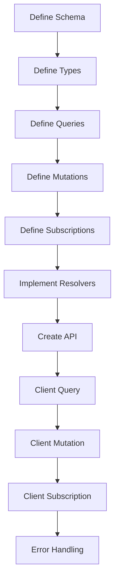
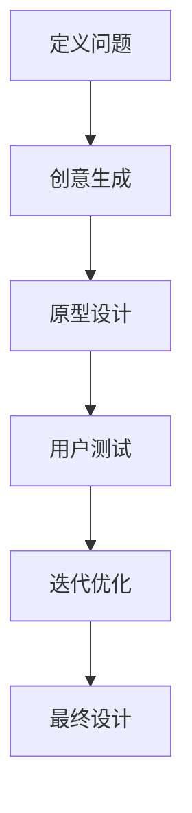
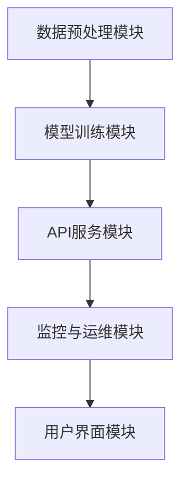
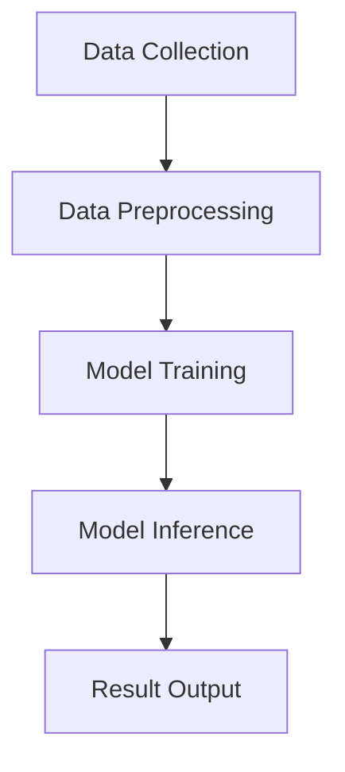

                 

## 第1章：API优先设计与敏捷LLM架构概述

### 1.1 API优先设计的理念与价值

**API优先设计**是一种软件开发的方法论，其核心理念是将应用程序编程接口（API）设计作为项目开发的首要任务。这一方法强调，API是应用程序的核心组件，良好的API设计不仅影响开发效率，还直接影响用户体验、系统的可维护性和扩展性。

#### **API优先设计原则**

1. **用户中心设计**：API设计应以用户需求为中心，确保API具有易用性和直观性。这意味着在设计过程中，需要深入理解用户的操作流程和期望结果。

2. **模块化设计**：将系统功能分解为独立的模块，每个模块负责一项具体的功能，这样可以提高代码的可维护性和可扩展性。

3. **可扩展性设计**：在API设计时，需要考虑未来可能的扩展和变化，预留扩展接口，以便在不修改现有代码的情况下，能够方便地添加新功能。

4. **安全性设计**：确保API的安全性，防止潜在的安全威胁，如SQL注入、跨站脚本攻击（XSS）等。

#### **API优先设计在敏捷开发中的应用**

- **快速迭代**：API优先设计使得开发团队能够在早期阶段就定义出清晰的接口，从而能够快速实现功能，并进行迭代和优化。

- **可测试性**：独立的API模块便于单元测试和集成测试，提高了测试覆盖率，从而确保API的质量。

- **可维护性**：模块化设计使得代码易于维护，降低系统复杂性，提高了开发效率。

### 1.2 敏捷LLM架构的背景与优势

**敏捷开发**是一种以人为核心、迭代、循序渐进的开发方法。其核心理念是及时响应变化，快速迭代和持续交付有价值的软件。敏捷开发模式强调团队协作、用户参与和灵活应变。

#### **敏捷开发概述**

- **迭代开发**：将项目划分为多个迭代周期，每次迭代产出可运行的软件。

- **持续交付**：通过自动化测试和部署流程，确保软件持续交付。

- **团队协作**：强调团队成员之间的沟通和协作，提高开发效率。

#### **敏捷LLM架构的优势**

- **灵活性**：敏捷架构能够快速适应市场需求和技术变化，确保项目能够在不断变化的环境中保持竞争力。

- **高效率**：通过自动化和模块化，敏捷架构能够显著提高开发、测试和部署的效率。

- **高质量**：通过持续集成和持续交付，敏捷架构能够确保软件质量，减少缺陷和故障。

### 1.3 本书的目的与结构

**目的**：本书旨在全面介绍API优先设计与敏捷LLM架构的理论和实践，帮助读者理解和掌握这两种技术。

**结构**：本书分为五个部分：

1. **引言与基础**：介绍API优先设计和敏捷LLM架构的基本概念和理念。
2. **API优先设计**：详细阐述API设计原则、最佳实践和方法论。
3. **敏捷LLM架构**：深入讲解敏捷LLM架构的原理、设计原则和实现方法。
4. **案例研究**：通过实际案例，解析API优先设计与敏捷LLM架构的应用和实践。
5. **总结与展望**：总结全书内容，展望API优先设计与敏捷LLM架构的未来发展趋势。

通过以上结构和内容的梳理，读者可以逐步了解和掌握API优先设计与敏捷LLM架构的核心要点，为后续章节的学习奠定坚实的基础。

### 1.4 敏捷LLM架构的实践与挑战

在敏捷LLM架构的实践过程中，开发团队需要面对一系列的挑战。这些挑战不仅影响到项目的进展，也可能对项目的最终成功产生重大影响。

#### **技术挑战**

1. **技术选型**：敏捷开发中，技术栈的选择非常关键。不同的技术栈适用于不同的场景，团队需要根据项目需求和技术背景，选择最合适的工具和框架。

2. **性能优化**：在快速迭代的过程中，如何确保系统的高性能是一个重要的挑战。这需要开发团队在设计和开发过程中，充分考虑性能优化策略，如缓存、数据库优化、异步处理等。

3. **持续集成与持续交付**：敏捷开发强调自动化测试和持续交付，这需要团队建立完善的CI/CD流程，以确保代码的质量和交付的效率。

#### **团队协作挑战**

1. **沟通与协作**：敏捷开发强调团队协作，但这并不意味着沟通和协作就会自动发生。团队成员之间的有效沟通和协作，需要建立良好的沟通机制和协作工具。

2. **角色定位**：在敏捷团队中，角色的定位和职责划分也需要明确。团队成员需要清楚自己的角色和责任，以便更好地协同工作。

3. **跨职能合作**：敏捷团队通常由多个跨职能成员组成，如开发、测试、产品等。如何确保这些不同职能的成员能够高效合作，是一个重要的挑战。

#### **组织挑战**

1. **文化转变**：敏捷开发需要组织的文化和工作方式发生转变。这涉及到管理层的支持、流程的优化和员工的培训等。

2. **资源分配**：在敏捷开发中，资源分配需要更加灵活和动态。这要求组织能够快速响应需求变化，合理分配资源。

3. **风险管理**：敏捷开发中，项目风险的管理需要更加细致和灵活。团队需要建立有效的风险管理机制，确保项目能够在面对不确定性时保持稳定。

通过上述分析和讨论，我们可以看到，敏捷LLM架构的实践不仅涉及到技术层面，还涉及到团队协作和组织文化等方面。只有解决了这些挑战，才能充分发挥敏捷LLM架构的优势，实现项目的成功。

### 1.5 API优先设计在敏捷开发中的实际应用

在敏捷开发实践中，API优先设计不仅是一种理念，更是具体可操作的方法。通过以下案例，我们将详细探讨API优先设计在敏捷开发中的实际应用，包括其优势和实践步骤。

#### **案例背景**

假设我们正在开发一个在线购物平台，该平台需要支持商品检索、购物车管理、订单处理等功能。在这个案例中，API优先设计将帮助我们确保系统的高效、可扩展和易于维护。

#### **优势**

1. **高效开发**：通过提前定义API接口，开发团队可以专注于实现具体的功能，而不是在设计和实现接口上花费过多时间。

2. **可扩展性**：清晰的API接口使得后续功能的扩展变得简单，开发者可以在不修改现有代码的情况下，添加新功能。

3. **测试和调试**：独立的API接口便于单元测试和集成测试，提高测试覆盖率，减少代码错误。

4. **团队协作**：API优先设计促进了团队之间的协作，不同职能的团队成员可以同时进行开发、测试和部署。

#### **实践步骤**

1. **需求分析**：在项目初期，与产品经理和业务分析师密切合作，明确系统的功能需求，并将其转化为用户故事。

2. **定义API接口**：基于用户故事，定义API接口，包括URL、HTTP方法、请求和响应的数据格式等。

3. **文档化**：编写详细的API文档，包括接口描述、参数说明、请求示例和错误处理等，便于其他团队成员理解和使用。

4. **编码实现**：根据定义的API接口，开始编码实现具体的功能。开发者可以按照接口规范，独立完成各自模块的编码任务。

5. **测试**：编写单元测试和集成测试，确保API接口的稳定性和可靠性。测试过程中，需要覆盖各种边界情况和异常情况。

6. **反馈与优化**：在测试过程中，收集反馈，对API接口进行优化。根据反馈，调整接口设计，改进功能实现。

7. **部署与监控**：将API接口部署到生产环境，并进行监控，确保系统的稳定运行。在运行过程中，持续收集用户反馈，进行进一步的优化。

通过以上步骤，我们可以看到，API优先设计在敏捷开发中的应用，不仅提高了开发效率，还确保了系统的可扩展性和可维护性。

### **总结**

API优先设计是敏捷开发中的重要方法之一，其核心理念是将API设计作为项目开发的首要任务。通过定义清晰的API接口，开发团队可以更好地协作，提高开发效率，确保系统的可扩展性和可维护性。在实际应用中，开发团队需要遵循一系列实践步骤，从需求分析到测试和部署，每个环节都需要精心设计和实施。

通过本文的介绍，我们希望读者能够对API优先设计在敏捷开发中的应用有更深入的理解，并在实际项目中灵活运用这一方法，以实现项目的成功。

### 2.2 GraphQL API设计原则

GraphQL 是一种基于查询的API设计语言，它允许客户端指定需要哪些数据，从而减少了无效数据的传输，提高了API的性能和可扩展性。GraphQL API设计遵循以下原则：

#### **1. 强类型系统**

GraphQL 强类型系统意味着所有的数据类型都必须在API定义时明确声明。这有助于减少数据类型不匹配的错误，并提高了API的可预测性。

- **声明数据类型**：例如，定义一个`User`类型，包含`id`、`name`和`email`字段。
  ```graphql
  type User {
    id: ID!
    name: String!
    email: String!
  }
  ```

- **枚举类型**：使用枚举类型来表示一组预定义的值，例如性别。
  ```graphql
  enum Gender {
    MALE
    FEMALE
    NON_BINARY
  }
  ```

#### **2. 强制查询**

GraphQL 要求客户端必须明确查询所需的数据。这种强制查询的设计减少了无效数据的传输，提高了API的性能。

- **简单查询**：客户端可以查询单个对象或多个对象。
  ```graphql
  query {
    user(id: "123") {
      id
      name
      email
    }
  }
  ```

- **嵌套查询**：支持嵌套查询，可以获取相关联的数据。
  ```graphql
  query {
    user(id: "123") {
      id
      name
      email
      orders {
        id
        total
      }
    }
  }
  ```

#### **3. 强灵活性**

GraphQL 提供了极大的灵活性，客户端可以根据需要查询任意深度的数据。

- **动态查询**：允许客户端动态指定查询字段，无需事先定义固定的查询结构。
  ```graphql
  query {
    user(id: "123") {
      id
      name
      ... on User {
        orders {
          id
          total
        }
      }
    }
  }
  ```

- **自定义查询**：支持自定义查询，允许客户端自定义查询结构。
  ```graphql
  query getTopSellingProducts {
    products(orderBy: "SALES") {
      id
      name
      price
    }
  }
  ```

#### **4. 零延迟更新**

GraphQL 提供了实时更新功能，客户端可以订阅数据变化，实现零延迟更新。

- **订阅查询**：客户端可以订阅特定数据的变化，并在数据变化时立即收到通知。
  ```graphql
  subscription onOrderUpdated {
    orderUpdated(id: "456") {
      id
      status
    }
  }
  ```

#### **5. 丰富的错误处理**

GraphQL 提供了详细的错误处理机制，客户端可以清晰地了解API调用失败的原因。

- **错误信息**：当API调用失败时，GraphQL返回详细的错误信息，包括错误类型和错误描述。
  ```json
  {
    "errors": [
      {
        "message": "User not found",
        "locations": [{"line": 2, "column": 3}],
        "path": ["user"]
      }
    ]
  }
  ```

### **Mermaid 流程图**

下面是一个简单的Mermaid流程图，展示了GraphQL API设计的基本流程：



通过遵循这些原则，开发者可以设计出高效、灵活和易于使用的GraphQL API，从而提高系统的性能和用户体验。

### 2.3 API安全性设计

在API设计过程中，安全性是一个不可忽视的重要方面。良好的API安全性设计不仅能保护数据的安全，还能增强用户对系统的信任。以下是一些关键的API安全性设计原则和最佳实践。

#### **1. 鉴权和认证**

鉴权和认证是API安全性的基础。鉴权确保用户有权访问API，认证则确认用户的身份。

- **OAuth 2.0**：OAuth 2.0是一种广泛使用的授权协议，允许第三方应用程序代表用户与API进行交互，而无需泄露用户的密码。
  ```plaintext
  POST /token
  Content-Type: application/x-www-form-urlencoded

  grant_type=client_credentials
  & client_id={client_id}
  & client_secret={client_secret}
  ```

- **JWT（JSON Web Tokens）**：JWT是一种基于JSON的开放标准，用于在用户和服务器之间传递安全信息。

#### **2. 访问控制**

访问控制确保用户只能访问其有权访问的资源。

- **基于角色的访问控制（RBAC）**：通过为用户分配角色，限制用户对资源的访问。
  ```plaintext
  Query {
    booksByUser(userId: "123") {
      id
      title
      author
    }
  }
  ```

- **基于属性的访问控制（ABAC）**：除了角色外，还可以根据用户的属性（如部门、权限级别等）进行访问控制。

#### **3. 数据加密**

数据加密保护数据在传输过程中的安全性。

- **HTTPS**：使用HTTPS加密所有API通信，防止数据在传输过程中被窃听或篡改。
- **TLS/SSL**：使用TLS/SSL协议对数据进行加密，确保数据传输的安全。

#### **4. 安全编码实践**

确保API实现过程中遵循安全编码实践，减少安全漏洞。

- **输入验证**：对输入数据进行严格验证，防止SQL注入、XSS攻击等。
  ```javascript
  app.get('/users', (req, res) => {
    const { id } = req.params;
    if (isValidId(id)) {
      // 处理请求
    } else {
      res.status(400).send('Invalid ID');
    }
  });
  ```

- **错误处理**：避免暴露系统内部错误，仅返回必要的错误信息。
  ```javascript
  app.get('/users/:id', (req, res) => {
    const { id } = req.params;
    try {
      const user = getUserById(id);
      res.json(user);
    } catch (error) {
      res.status(500).send('An error occurred');
    }
  });
  ```

#### **5. 监控和日志**

通过监控和日志记录，及时发现潜在的安全威胁。

- **审计日志**：记录所有API请求和响应，以便在发生安全事件时进行审计。
- **异常检测**：使用机器学习等方法，对API访问行为进行分析，发现异常行为。

### **伪代码示例**

以下是一个简单的API安全性设计的伪代码示例：

```plaintext
// 鉴权和认证
function authenticate(credentials) {
  if (isOAuth2TokenValid(credentials.token)) {
    return createJWT(credentials);
  }
  return null;
}

// 访问控制
function checkPermission(user, resource) {
  if (user.role === 'admin') {
    return true;
  }
  if (user.department === 'sales' && resource.type === 'sales_data') {
    return true;
  }
  return false;
}

// 数据加密
function encryptData(data) {
  return encryptWithTLS(data);
}

// 错误处理
function handleRequestError(error) {
  if (error.isInputValidationFailure) {
    return respondWithBadRequest('Invalid input');
  }
  if (error.isDatabaseError) {
    return respondWithInternalServerError('Database error');
  }
  return respondWithInternalServerError('An unknown error occurred');
}
```

通过上述方法和示例，开发者可以设计出安全的API，保护系统的数据和用户隐私，提高系统的安全性和可靠性。

### 2.4 API性能优化策略

API性能优化是确保系统高效、稳定运行的关键。以下是一些关键的API性能优化策略，包括缓存策略、数据压缩和限流机制。

#### **1. 缓存策略**

缓存是提高API性能的有效手段。通过将经常访问的数据存储在缓存中，可以减少对后端系统的访问频率，提高响应速度。

- **本地缓存**：在客户端或服务器端使用本地缓存，如Redis或Memcached，存储常用的数据。
  ```javascript
  app.get('/users/:id', cacheMiddleware, (req, res) => {
    const { id } = req.params;
    const user = cache.get(id);
    if (user) {
      res.json(user);
    } else {
      // 从数据库获取数据并缓存
      user = getUserById(id);
      cache.set(id, user);
      res.json(user);
    }
  });
  ```

- **分布式缓存**：在分布式系统中，使用分布式缓存可以减少单点故障的风险，提高系统的可用性。

#### **2. 数据压缩**

数据压缩可以显著减少API响应的数据量，提高传输速度。

- **GZIP压缩**：在服务器端使用GZIP压缩响应数据，客户端在请求时指定`Accept-Encoding: gzip`。
  ```javascript
  app.use(compression());
  ```

- **Brotli压缩**：相较于GZIP，Brotli压缩可以提供更高的压缩率，但兼容性较差。

#### **3. 限流机制**

限流机制用于限制API的访问频率，防止恶意攻击或过度使用，保护系统资源。

- **固定窗口限流**：在固定的时间窗口内，限制请求的频率。
  ```javascript
  rateLimiter({
    windowMs: 60 * 1000, // 1分钟
    max: 100 // 每分钟最多100次请求
  });
  ```

- **令牌桶限流**：允许一定频率的请求通过，但保持一个令牌桶的容量，超过容量后的请求将被丢弃。

#### **4. 其他优化策略**

- **异步处理**：使用异步处理减少请求响应时间，提高系统并发能力。
  ```javascript
  app.get('/users/:id', async (req, res) => {
    const user = await getUserById(req.params.id);
    res.json(user);
  });
  ```

- **数据库优化**：对数据库进行优化，如使用索引、分库分表等，减少数据库查询的响应时间。

- **服务端渲染**：对于需要大量计算或复杂渲染的API，考虑使用服务端渲染，减少客户端的加载时间。

通过以上策略的综合应用，可以显著提升API的性能，确保系统的高效、稳定运行。

### 2.5 API优先设计方法论

API优先设计方法论是将API设计贯穿于整个软件开发过程的一种方法。它强调在软件开发初期就进行详细的API设计，以确保系统的模块化、可维护性和可扩展性。以下详细讨论API优先设计方法论中的设计思维、用户故事映射到API、API迭代与反馈循环，以及API设计与敏捷开发的融合。

#### **1. 设计思维**

设计思维是一种以人为本的设计方法论，其核心在于理解用户需求，并通过迭代和实验，创造性地解决问题。在API优先设计过程中，设计思维的应用可以确保API设计真正满足用户的需求。

- **用户研究**：通过访谈、问卷调查、用户画像等方法，深入了解用户的需求和行为模式。
- **概念验证**：使用原型设计工具，如Sketch或Figma，快速构建API原型，验证设计概念。
- **迭代优化**：基于用户反馈，不断优化API设计，确保最终设计能够满足用户需求。

#### **2. 用户故事映射到API**

用户故事是敏捷开发中描述用户需求的一种方法。将用户故事映射到API，是将用户需求转化为具体API接口的关键步骤。

- **故事提取**：与产品经理和业务分析师合作，提取用户故事，明确用户的需求和期望。
  ```plaintext
  As a user, I want to retrieve my order history so that I can manage my purchases.
  ```

- **故事细化**：将用户故事细化为具体的API操作，如查询、更新、删除等。
  ```plaintext
  GET /orders - Retrieve order history
  POST /orders - Create a new order
  DELETE /orders/{orderId} - Delete an order
  ```

- **故事实现**：根据细化后的用户故事，设计具体的API接口，并编写API文档。

#### **3. API迭代与反馈循环**

API迭代与反馈循环是API优先设计方法论中的重要环节。通过不断的迭代和反馈，可以确保API设计不断优化，满足用户需求。

- **迭代设计**：在每次迭代中，根据用户故事，设计具体的API接口，并进行实现和测试。
  ```plaintext
  Iteration 1:
  - Design and implement /orders endpoint
  - Write unit tests for /orders endpoint
  ```

- **用户反馈**：在API上线后，收集用户的反馈，识别API使用中的问题和不足。
  ```plaintext
  User Feedback:
  - The response format for the /orders endpoint is not intuitive
  ```

- **反馈优化**：根据用户反馈，对API进行优化和调整，提升用户体验。
  ```plaintext
  Optimizations:
  - Update the /orders endpoint to use a more intuitive response format
  ```

#### **4. API设计与敏捷开发的融合**

API优先设计与敏捷开发方法论的融合，可以充分发挥两者的优势，提高开发效率和系统质量。

- **快速迭代**：通过敏捷开发的迭代模式，快速实现API设计，并不断优化和调整。
  ```plaintext
  Agile Iteration:
  - Define API requirements in the backlog
  - Prioritize API tasks based on business value
  - Implement and test API in short iterations
  ```

- **持续集成与交付**：通过自动化测试和持续集成工具，确保API的稳定性和可靠性。
  ```plaintext
  CI/CD Pipeline:
  - Write automated tests for API
  - Integrate API changes into the main branch
  - Deploy API to production environment
  ```

- **团队协作**：通过敏捷团队的协作模式，确保API设计与开发、测试、运维等环节的无缝衔接。
  ```plaintext
  Team Collaboration:
  - Hold daily stand-ups to discuss API progress
  - Schedule review meetings to evaluate API design and implementation
  - Participate in retrospective meetings to identify improvements
  ```

通过以上方法论的应用，API优先设计可以有效地融入敏捷开发过程，确保系统的模块化、可维护性和可扩展性，从而提高开发效率和系统质量。

### 第3章：API优先设计方法论

#### **3.1 设计思维与API设计**

设计思维（Design Thinking）是一种以人为本的创新方法论，其核心理念是通过深入理解用户需求，进行迭代和实验，以创造性地解决问题。在API优先设计过程中，设计思维的应用能够确保API设计不仅满足技术需求，更能够满足用户的实际使用体验。

#### **1. 设计思维的步骤**

1. **定义问题**：通过用户访谈、问卷调查等方法，明确用户面临的具体问题和需求。

2. **创意生成**：基于用户需求，生成多个可能的解决方案，进行头脑风暴和创意构思。

3. **原型设计**：使用原型设计工具（如Sketch、Figma等）创建API原型，进行用户测试和反馈。

4. **迭代优化**：根据用户反馈，不断优化原型设计，确保最终API设计满足用户需求。

#### **2. 设计思维在API设计中的应用**

在API设计中，设计思维的应用可以帮助开发者更好地理解用户需求，从而设计出更加直观、易用的API。

- **用户研究**：通过用户访谈、用户画像等方法，了解用户的使用场景、行为习惯和期望。

- **原型设计**：使用API原型工具，快速构建API原型，进行用户测试。通过原型，开发者可以直观地了解用户对API接口的反应，从而进行优化。

- **用户反馈**：在原型测试过程中，收集用户反馈，识别API设计中的不足和需要改进的地方。

- **迭代优化**：根据用户反馈，不断优化API设计，确保最终设计能够满足用户需求。

#### **3. 设计思维的优势**

- **用户中心**：设计思维以人为本，确保API设计满足用户需求，提升用户体验。

- **快速迭代**：通过快速原型设计和迭代优化，减少开发时间，提高开发效率。

- **创意构思**：设计思维鼓励创新思维，帮助开发者从不同角度思考问题，设计出独特的API解决方案。

### **Mermaid 流程图**

下面是一个简单的Mermaid流程图，展示了设计思维在API设计中的应用流程：



通过设计思维的运用，开发者可以确保API设计不仅符合技术要求，更能够满足用户的实际使用需求，从而提高系统的可维护性和用户满意度。

### **3.2 用户故事映射到API**

用户故事是敏捷开发中描述用户需求的一种方法，它以用户为中心，通过简洁、具体的描述，帮助开发团队理解用户的需求和目标。将用户故事映射到API，是将用户需求转化为具体接口和功能的关键步骤。

#### **1. 用户故事的定义**

用户故事通常遵循以下格式：

```plaintext
As a [用户角色], I want to [目标功能] so that [业务价值].
```

例如：

```plaintext
As a user, I want to search for products by category so that I can find items of interest.
```

#### **2. 用户故事映射到API**

将用户故事映射到API，需要将故事中的需求转化为具体的API接口。以下是一个简单的映射过程：

1. **确定用户操作**：从用户故事中提取用户需要执行的操作，如查询、添加、更新、删除等。

2. **定义API接口**：根据用户操作，定义相应的API接口，包括URL、HTTP方法、请求和响应的数据结构等。

3. **编写API文档**：详细描述API接口的参数、返回值、错误处理等内容，确保开发者能够准确理解和使用API。

以下是一个用户故事映射到API的示例：

**用户故事**：

```plaintext
As a user, I want to create a new order so that I can purchase items.
```

**映射后的API接口**：

```plaintext
POST /orders
Body:
{
  "userId": "123",
  "products": [
    { "productId": "456", "quantity": 1 },
    { "productId": "789", "quantity": 2 }
  ]
}

Response:
{
  "orderId": "987",
  "status": "pending"
}
```

#### **3. 用户故事映射的步骤**

1. **故事提取**：与产品经理和业务分析师合作，从用户故事中提取具体的需求。

2. **故事细化**：将用户故事细化为具体的API操作，如查询、添加、更新、删除等。

3. **接口设计**：根据细化后的用户故事，设计具体的API接口，并编写API文档。

4. **用户确认**：与用户或产品经理确认API设计是否满足用户需求，进行迭代优化。

通过以上步骤，可以将用户故事准确映射到API接口，确保API设计能够满足用户的实际需求。

### **3.3 API迭代与反馈循环**

API迭代与反馈循环是API优先设计方法论中的重要环节。通过不断的迭代和用户反馈，可以确保API设计不断优化，满足用户需求。

#### **1. 迭代过程**

1. **需求分析**：从用户故事中提取需求，明确API的功能和接口。

2. **设计API**：根据需求，设计具体的API接口，并编写API文档。

3. **开发实现**：开发团队根据设计，实现API接口，并进行单元测试。

4. **部署上线**：将API部署到生产环境，进行功能测试和性能测试。

5. **用户反馈**：收集用户的实际使用反馈，识别API设计中的问题和不足。

#### **2. 反馈机制**

1. **用户调研**：通过用户访谈、问卷调查等方式，了解用户对API的使用体验和反馈。

2. **日志分析**：分析API的访问日志，识别高频错误、性能瓶颈等问题。

3. **错误报告**：通过错误报告系统，收集用户在使用API时遇到的错误信息。

#### **3. 反馈优化**

1. **问题识别**：根据用户反馈和日志分析，识别API设计中的问题和不足。

2. **设计优化**：对API接口进行优化，改进数据结构、接口参数、错误处理等。

3. **重新部署**：优化后的API重新部署到生产环境，验证优化效果。

#### **4. 迭代与反馈循环**

1. **定期回顾**：定期回顾API的设计和优化过程，总结经验和教训。

2. **持续改进**：根据用户反馈和业务需求，持续优化API设计。

3. **快速迭代**：通过快速迭代，确保API设计能够及时响应用户需求和市场变化。

通过API迭代与反馈循环，开发者可以持续优化API设计，提升用户体验，确保系统的高效、稳定运行。

### **3.4 API设计与敏捷开发的融合**

API优先设计与敏捷开发方法的融合，使得开发团队能够更加高效地响应变化，确保API设计与实现的质量。以下是如何在敏捷开发环境中，将API设计与迭代流程相结合的详细步骤。

#### **1. 敏捷开发中的迭代周期**

敏捷开发通常采用短周期的迭代模式，每个迭代周期（通常称为Sprint）持续2-4周。在迭代周期内，团队会进行需求分析、设计、开发、测试、部署和回顾。

#### **2. API设计在迭代中的角色**

1. **需求分析阶段**：在Sprint开始时，产品经理和业务分析师会与开发团队一起，基于用户故事提取API需求。这些需求将转化为API设计任务。

2. **设计阶段**：API设计师负责根据需求，设计API接口和数据模型。设计文档包括API规范、接口定义、数据结构等。

3. **开发阶段**：开发人员根据设计文档实现API接口，编写接口代码，并进行单元测试。

4. **测试阶段**：测试人员负责编写集成测试，验证API的稳定性和性能。在此阶段，还会进行用户体验测试，确保API设计符合用户期望。

5. **部署阶段**：将经过测试的API部署到开发环境或生产环境，确保API能够正常运行。

6. **回顾阶段**：团队回顾整个迭代周期，讨论API设计的优点和不足，总结经验教训，为下一个迭代做准备。

#### **3. API设计与敏捷开发的融合步骤**

1. **故事映射**：将用户故事精确映射到API需求，确保每个API任务都与用户需求紧密相关。

2. **迭代计划**：在迭代计划会议上，团队根据API设计和需求，确定每个迭代的目标和任务。

3. **持续集成**：使用CI工具（如Jenkins、GitLab CI等），确保API代码的持续集成和自动化测试。

4. **迭代迭代**：每个迭代周期内，团队按照设计-开发-测试-部署的流程，逐步实现API功能。

5. **用户反馈**：在迭代末期，通过用户测试和反馈，评估API的实用性和用户体验。

6. **回顾优化**：根据用户反馈和迭代结果，对API设计进行优化和调整，为下一个迭代做好准备。

#### **4. 融合的优势**

- **快速响应**：敏捷开发允许团队快速迭代，确保API设计与实现能够及时响应用户需求和市场变化。

- **质量保证**：通过持续集成和自动化测试，确保API的稳定性和可靠性。

- **用户中心**：用户反馈循环确保API设计始终以用户需求为中心，提升用户体验。

- **持续改进**：通过回顾和优化，团队可以不断改进API设计，提升开发效率和质量。

通过将API优先设计方法论与敏捷开发方法融合，开发团队能够更高效、更高质量地实现API开发，确保系统的高效、稳定运行。

### 4.1 敏捷LLM架构原理与框架

敏捷LLM（Large Language Model）架构是一种结合了敏捷开发和大型语言模型特性的软件架构方法。它旨在应对现代人工智能应用中快速变化的需求和复杂的数据处理需求，确保系统能够灵活、高效地适应不同的业务场景。

#### **1. 敏捷开发与传统软件开发的对比**

- **传统软件开发**：传统软件开发方法（如瀑布模型）通常遵循严格的顺序流程，从需求分析到设计、开发、测试和部署，每个阶段都需完成后再进入下一个阶段。这种方法在需求明确、变化较少的情况下较为有效，但难以应对快速变化的需求和市场环境。

- **敏捷开发**：敏捷开发则强调迭代和增量式开发，每个迭代周期（Sprint）产出可运行的产品版本。敏捷开发注重团队协作、用户反馈和快速响应变化，适用于需求变化频繁的项目。

#### **2. 敏捷LLM架构的基本概念**

- **敏捷LLM架构**：敏捷LLM架构结合了敏捷开发的灵活性和大型语言模型（如GPT、BERT等）的强大数据处理能力。其核心在于通过模块化设计和微服务架构，实现快速迭代和高效数据处理。

- **模块化设计**：将系统功能分解为独立的模块，每个模块负责特定的功能，如数据预处理、模型训练、API服务、监控等。

- **微服务架构**：将系统划分为多个微服务，每个微服务独立运行，负责特定功能。微服务之间通过API进行通信，可以独立部署和扩展。

#### **3. 敏捷LLM架构的关键组件**

1. **数据预处理模块**：负责处理和清洗原始数据，将其转换为适合训练的格式。该模块通常包括数据采集、数据清洗、数据转换等功能。

2. **模型训练模块**：使用预训练的LLM模型进行定制化训练，以适应特定的业务场景。该模块需要实现模型选择、训练参数调整、模型评估等功能。

3. **API服务模块**：提供API接口，供外部系统调用。该模块需要实现RESTful API或GraphQL API，确保接口的高性能和易用性。

4. **监控与运维模块**：负责监控系统的运行状态，包括性能监控、错误监控、日志管理等。该模块需要实现自动化运维，确保系统的高可用性和可靠性。

5. **用户界面模块**：为用户提供友好的交互界面，支持用户输入、查询和反馈。该模块需要与API服务模块紧密集成，确保用户操作能够实时反映在系统中。

#### **4. 敏捷LLM架构的优势**

- **灵活性**：通过模块化和微服务架构，敏捷LLM架构能够快速适应需求变化，灵活扩展功能。

- **高性能**：使用高性能的LLM模型和数据预处理技术，确保系统的高性能和低延迟。

- **高可用性**：通过自动化运维和监控，确保系统的高可用性和可靠性。

- **易于维护**：模块化设计使得系统易于维护和扩展，降低系统的复杂性。

- **用户中心**：通过快速迭代和用户反馈，确保系统设计始终以用户需求为中心。

### **Mermaid 流程图**

下面是一个简单的Mermaid流程图，展示了敏捷LLM架构的基本组件和流程：



通过敏捷LLM架构，开发团队能够高效地实现大型语言模型的应用，快速响应业务需求，提升用户体验。

### 4.2 敏捷LLM架构设计原则

在敏捷LLM架构中，设计原则是确保系统灵活性、性能和可维护性的关键。以下详细讨论模块化与微服务设计、自动化部署与持续交付、容器化与云计算等设计原则。

#### **1. 模块化与微服务设计**

模块化与微服务设计是敏捷LLM架构的核心原则之一，其目的是将系统功能分解为独立的、可管理的模块，提高系统的灵活性和可扩展性。

- **模块化设计**：将系统功能按照业务需求和技术逻辑划分为多个模块，每个模块负责一个具体的功能。例如，数据预处理模块、模型训练模块、API服务模块等。模块化设计使得系统功能清晰，易于维护和扩展。

- **微服务架构**：在模块化的基础上，进一步将每个模块划分为微服务，每个微服务独立运行，负责特定的功能。微服务通过API进行通信，可以独立部署和扩展。这种设计方式使得系统可以灵活应对需求变化，提高系统的可扩展性和可维护性。

#### **2. 自动化部署与持续交付**

自动化部署与持续交付是敏捷开发的重要组成部分，它确保了系统的快速迭代和高效交付。

- **自动化部署**：通过自动化工具（如Jenkins、Docker等），实现自动构建、测试和部署。自动化部署可以减少人工干预，提高部署效率，降低部署风险。

- **持续交付**：通过持续集成和持续交付，确保代码变更及时集成和部署到生产环境。持续交付流程包括代码检查、自动化测试、构建、部署等环节，确保系统的稳定性和可靠性。

#### **3. 容器化与云计算**

容器化和云计算是现代敏捷开发中常用的技术，它们为敏捷LLM架构提供了强大的支持。

- **容器化**：容器化技术（如Docker）可以将应用程序及其依赖环境打包成一个独立的容器，实现应用程序的轻量级部署和管理。容器化提高了系统的可移植性、可扩展性和可维护性。

- **云计算**：云计算平台（如AWS、Azure、Google Cloud等）提供了强大的计算资源和管理能力。通过云计算，开发团队可以快速部署和扩展系统，提高系统的性能和可靠性。

#### **4. 监控与运维**

在敏捷LLM架构中，监控与运维是确保系统稳定运行的重要环节。

- **监控**：通过监控工具（如Prometheus、Grafana等），实时监控系统的运行状态，包括性能指标、错误日志等。监控可以帮助开发团队及时发现和解决系统问题。

- **运维**：通过自动化运维工具（如Ansible、Terraform等），实现系统的自动化部署、配置管理和故障恢复。自动化运维可以降低运维成本，提高运维效率。

### **伪代码示例**

下面是一个简单的伪代码示例，展示了敏捷LLM架构中模块化与微服务设计、自动化部署与持续交付的实现过程：

```plaintext
// 模块化与微服务设计
module DataPreprocessing {
  // 数据预处理功能
}

module ModelTraining {
  // 模型训练功能
}

module APIService {
  // API服务功能
}

module Monitoring {
  // 监控功能
}

// 自动化部署与持续交付
function deployService(serviceName) {
  buildImage(serviceName)
  runTests(serviceName)
  if (allTestsPassed) {
    deployToCloud(serviceName)
  } else {
    logErrors()
  }
}

// 容器化与云计算
docker build -t {serviceName}:latest .
docker push {serviceName}:latest
cloudProvider.deploy({serviceName}, "latest")
```

通过上述设计原则和示例，敏捷LLM架构能够实现系统的模块化、自动化和高效管理，确保系统在快速迭代过程中保持稳定性和可靠性。

### 4.3 数据流设计与数据处理

在敏捷LLM架构中，数据流设计是确保系统高效、可靠运行的关键。数据流设计涉及数据从采集、处理到存储的整个生命周期，包括数据预处理、模型训练、模型推理等环节。以下详细讨论数据流设计在敏捷LLM架构中的应用。

#### **1. 数据采集**

数据采集是数据流设计的起点，涉及从不同来源获取数据，如数据库、文件系统、实时流等。数据采集工具（如Kafka、Fluentd等）负责收集和传输数据。

- **批量数据采集**：从数据库或文件系统中批量导入数据。
  ```python
  import_data('db', 'table_name', 'output_file.csv')
  ```

- **实时数据采集**：从实时流处理平台（如Kafka）中采集数据。
  ```python
  subscribe_to_topic('realtime_data', process_message)
  ```

#### **2. 数据预处理**

数据预处理是确保数据质量、一致性、完整性和可用性的重要环节。预处理过程通常包括数据清洗、数据转换、特征工程等。

- **数据清洗**：去除重复数据、缺失值和异常值，确保数据质量。
  ```python
  clean_data('input_file.csv', 'output_file.csv')
  ```

- **数据转换**：将数据转换为适合模型训练的格式，如将文本数据转换为向量表示。
  ```python
  transform_data('input_file.csv', 'output_file.csv', 'text_to_vector')
  ```

- **特征工程**：根据业务需求，提取和构建特征，提高模型的性能。
  ```python
  extract_features('input_file.csv', 'output_file.csv', features_list)
  ```

#### **3. 模型训练**

模型训练是将预处理后的数据输入到模型中，通过学习数据中的模式和规律，生成预测结果。训练过程通常包括模型选择、参数调整、训练和评估等步骤。

- **模型选择**：根据业务需求和数据特点，选择合适的模型架构。
  ```python
  select_model('model_name', 'data_type')
  ```

- **参数调整**：通过调整模型参数，优化模型性能。
  ```python
  adjust_parameters('model_name', 'learning_rate', 'batch_size')
  ```

- **训练**：将数据输入模型进行训练。
  ```python
  train_model('model_name', 'input_data', 'output_data')
  ```

- **评估**：评估模型性能，选择最佳模型。
  ```python
  evaluate_model('model_name', 'test_data')
  ```

#### **4. 模型推理**

模型推理是将训练好的模型应用于新的数据，生成预测结果。推理过程需要高效、实时地处理大量数据。

- **推理**：将新数据输入模型进行推理。
  ```python
  predict('model_name', 'input_data')
  ```

- **结果输出**：将推理结果输出，供用户或下游系统使用。
  ```python
  output_results('prediction_file.csv')
  ```

#### **5. 数据流设计示例**

以下是一个简单的数据流设计示例，展示了数据从采集、预处理到模型推理的全过程：



通过合理的数据流设计，敏捷LLM架构能够高效、可靠地处理数据，确保模型训练和推理的顺利进行。

### 4.4 模型训练与评估

模型训练与评估是敏捷LLM架构中的重要环节，决定了模型的性能和预测准确性。以下详细讨论模型训练的方法、评估指标、优化策略，以及如何确保模型的高效训练和评估。

#### **1. 模型训练方法**

模型训练是指通过输入数据和相应的标签，使模型学习到数据中的模式和规律，从而能够进行预测。以下是一些常用的模型训练方法：

- **监督学习**：在监督学习中，每个数据点都有一个已知的标签。模型通过学习这些标签，预测未知数据点的标签。
  ```python
  from sklearn.linear_model import LinearRegression
  model = LinearRegression()
  model.fit(X_train, y_train)
  ```

- **无监督学习**：无监督学习不需要标签信息，模型通过自身学习数据中的结构或模式。
  ```python
  from sklearn.cluster import KMeans
  model = KMeans(n_clusters=3)
  model.fit(X_train)
  ```

- **强化学习**：强化学习通过试错法，在环境中不断探索和优化行为策略。
  ```python
  from gym import make
  env = make('CartPole-v0')
  model = QLearning(env.action_space.n, env.observation_space.shape[0])
  model.train()
  ```

#### **2. 评估指标**

评估指标用于衡量模型在训练数据和测试数据上的性能。以下是一些常用的评估指标：

- **准确率（Accuracy）**：准确率是指模型正确预测的样本数占总样本数的比例。
  ```python
  accuracy = (y_pred == y_test).mean()
  ```

- **召回率（Recall）**：召回率是指模型能够正确识别为正例的样本数与实际正例样本数的比例。
  ```python
  recall = (y_pred[y_pred == 1].sum() / y_test.sum()) * 100
  ```

- **精确率（Precision）**：精确率是指模型正确预测为正例的样本数与预测为正例的样本总数的比例。
  ```python
  precision = (y_pred[y_pred == 1].sum() / len(y_pred)) * 100
  ```

- **F1分数（F1 Score）**：F1分数是精确率和召回率的调和平均，用于综合衡量模型的性能。
  ```python
  f1_score = 2 * (precision * recall) / (precision + recall)
  ```

#### **3. 优化策略**

为了提高模型性能，可以采用以下优化策略：

- **超参数调整**：通过调整模型超参数（如学习率、批量大小等），优化模型性能。
  ```python
  from sklearn.model_selection import GridSearchCV
  params = {'learning_rate': [0.1, 0.01], 'batch_size': [32, 64]}
  model = LinearRegression()
  grid_search = GridSearchCV(model, params)
  grid_search.fit(X_train, y_train)
  ```

- **数据增强**：通过增加数据多样性，提高模型泛化能力。
  ```python
  from torchvision import transforms
  transform = transforms.Compose([transforms.RandomHorizontalFlip(), transforms.RandomRotation(20)])
  X_train = transform(X_train)
  ```

- **集成学习**：通过集成多个模型，提高整体模型性能。
  ```python
  from sklearn.ensemble import VotingClassifier
  ensemble = VotingClassifier(estimators=[('lr', LinearRegression()), ('rf', RandomForestClassifier()), ('gb', GradientBoostingClassifier())])
  ensemble.fit(X_train, y_train)
  ```

#### **4. 确保高效训练和评估**

为了确保模型的高效训练和评估，可以采用以下策略：

- **分布式训练**：通过分布式计算，提高训练速度。
  ```python
  from keras.utils import multi_gpu_model
  model = Sequential()
  model = multi_gpu_model(model, gpus=4)
  model.compile(...)
  model.fit(X_train, y_train, batch_size=128, epochs=10)
  ```

- **并行处理**：通过并行处理，提高数据处理速度。
  ```python
  from joblib import Parallel, delayed
  results = Parallel(n_jobs=-1)(delayed(process_data)(data) for data in X_train)
  ```

- **自动化调优**：使用自动化调优工具，如Hyperopt、Optuna等，自动寻找最优超参数。
  ```python
  from hyperopt import fmin, tpe, hp
  space = hp.choice('learning_rate', [0.1, 0.01, 0.001])
  fmin(fn=lambda x: evaluate_model(x), space=space, algo=tpe.suggest)
  ```

通过以上方法和策略，可以确保模型训练和评估的高效性和准确性，从而提高模型的性能和应用价值。

### **7.1 案例背景与目标**

在本案例中，我们以一个在线问答平台为例，探讨API优先设计与敏捷LLM架构的实际应用。该平台旨在提供用户通过输入问题，获取准确、有用的答案。为实现这一目标，我们采用API优先设计，确保系统的高效性和扩展性，并应用敏捷LLM架构，快速迭代和优化模型。

#### **1. 案例背景**

在线问答平台面临的主要挑战包括：

- **海量数据**：平台需要处理大量的用户问题和答案数据，这些数据需要高效、准确地处理和分析。

- **实时性**：用户期望能够在短时间内获取问题的答案，因此系统的响应速度至关重要。

- **可扩展性**：随着用户数量的增加，系统需要能够动态扩展，以应对更高的并发访问。

- **个性化**：平台需要根据用户的历史问题和答案记录，提供个性化的答案推荐。

#### **2. 项目目标**

本案例的主要目标如下：

- **高效数据处理**：通过API优先设计，确保数据处理的模块化和高效性，提高系统性能。

- **实时问答**：通过敏捷LLM架构，快速迭代和优化模型，实现实时问答功能。

- **个性化推荐**：利用用户历史数据，提供个性化的答案推荐。

- **可扩展性**：采用微服务架构，确保系统能够灵活扩展，应对更高的并发访问。

### **7.2 API优先设计过程**

在项目初期，我们首先进行了需求分析和用户故事提取，确保API设计满足用户需求。以下是具体的API优先设计过程：

#### **1. 需求分析**

通过与产品经理和业务分析师的合作，我们提取了以下用户故事：

- **用户输入问题**：用户可以通过API提交问题，并获取答案。
  ```plaintext
  As a user, I want to submit a question so that I can get an answer.
  ```

- **获取答案**：系统需要根据用户提交的问题，提供准确的答案。
  ```plaintext
  As a user, I want to get an answer for my question so that I can resolve my query.
  ```

- **个性化推荐**：系统根据用户的历史问题和答案记录，提供个性化的答案推荐。
  ```plaintext
  As a user, I want personalized answer recommendations based on my past interactions.
  ```

#### **2. API设计**

基于用户故事，我们设计了以下API接口：

- **提交问题**（POST /questions）
  ```plaintext
  Body:
  {
    "user_id": "123",
    "question": "What is the capital of France?"
  }

  Response:
  {
    "question_id": "456",
    "status": "pending"
  }
  ```

- **获取答案**（GET /questions/{question_id}/answer）
  ```plaintext
  Response:
  {
    "answer": "Paris",
    "confidence": 0.95
  }
  ```

- **个性化推荐**（GET /users/{user_id}/recommendations）
  ```plaintext
  Response:
  [
    {
      "question": "What is the capital of Spain?",
      "confidence": 0.85
    }
  ]
  ```

#### **3. API文档**

我们编写了详细的API文档，包括接口描述、参数说明、请求示例和错误处理等，以便其他团队成员理解和使用。

### **7.3 敏捷LLM架构设计与应用**

在系统架构设计方面，我们采用了敏捷LLM架构，确保系统能够灵活、高效地处理用户请求。以下是具体的架构设计与应用：

#### **1. 数据处理模块**

数据处理模块负责接收用户输入的问题，并进行预处理，如文本清洗、分词、编码等。

- **数据采集**：通过Kafka等工具，实时接收用户提交的问题。
- **数据预处理**：使用NLP技术，对文本进行清洗、分词、编码等处理。

#### **2. 模型训练模块**

模型训练模块负责训练和优化问答模型，以提高答案的准确性和可靠性。

- **模型选择**：根据业务需求，选择合适的模型架构（如BERT、GPT等）。
- **数据预处理**：对训练数据进行预处理，如文本清洗、编码等。
- **模型训练**：使用GPU加速训练过程，提高训练效率。
- **模型评估**：通过交叉验证和测试集，评估模型性能。

#### **3. API服务模块**

API服务模块负责提供API接口，供用户使用。

- **API接口**：设计简洁、直观的API接口，便于用户使用。
- **API文档**：编写详细的API文档，包括接口描述、参数说明、请求示例等。

#### **4. 监控与运维模块**

监控与运维模块负责监控系统的运行状态，确保系统的高可用性和可靠性。

- **性能监控**：使用Prometheus等工具，实时监控系统性能指标。
- **日志管理**：使用ELK（Elasticsearch、Logstash、Kibana）等工具，收集和管理系统日志。
- **自动化运维**：使用Ansible等工具，实现自动化部署和运维。

### **7.4 项目成果与经验总结**

通过本案例，我们取得了以下成果：

- **高效数据处理**：采用API优先设计和敏捷LLM架构，系统实现了高效的数据处理，提高了响应速度。
- **实时问答**：系统实现了实时问答功能，用户能够快速获取问题的答案。
- **个性化推荐**：系统根据用户历史数据，提供个性化的答案推荐，提升了用户体验。
- **可扩展性**：采用微服务架构，系统能够灵活扩展，应对更高的并发访问。

在项目实践中，我们总结了一些经验：

- **API优先设计**：在项目初期，通过API优先设计，明确了系统的功能需求和技术实现，提高了开发效率。
- **敏捷迭代**：通过敏捷开发方法，快速迭代和优化系统，确保系统能够适应快速变化的需求。
- **数据驱动**：充分利用用户数据，实现个性化推荐和实时问答，提升了用户体验。
- **自动化运维**：采用自动化工具，实现系统的高可用性和可靠性，降低了运维成本。

通过本案例，我们深刻认识到API优先设计和敏捷LLM架构在实际应用中的重要性，为后续项目的开发提供了宝贵的经验和参考。

### **8.1 新趋势与新技术**

在API优先设计与敏捷LLM架构的不断发展中，新技术和新趋势不断涌现，为系统的设计、开发、部署和维护带来了新的机遇和挑战。以下是当前一些重要的新趋势和新技术：

#### **1. 服务网格（Service Mesh）**

服务网格是一种新兴的架构模式，用于管理和服务之间的通信。服务网格通过独立的控制平面（如Istio、Linkerd等）来实现服务间的动态路由、负载均衡、安全控制和监控等功能。服务网格的优势在于，它将服务通信的复杂性从应用程序中分离出来，使得开发者可以专注于业务逻辑的实现。

#### **2. serverless架构**

serverless架构通过提供完全无服务器的方式，将基础设施的管理和运维完全交给了云服务提供商。开发者只需编写和部署代码，无需关心底层基础设施的管理。例如，AWS Lambda、Google Cloud Functions和Azure Functions等平台，使得开发者可以轻松实现按需调用的计算服务，降低了开发成本和复杂度。

#### **3. AI与大数据融合**

随着人工智能和大数据技术的不断进步，将AI与大数据融合已经成为一种趋势。通过大数据平台（如Hadoop、Spark等），可以高效地处理海量数据，为AI模型提供丰富的训练数据。AI模型则可以从中学习和提取有价值的信息，为企业提供智能决策支持。

#### **4. 多云与混合云**

随着企业业务需求的多样化，多云和混合云架构成为了一种趋势。通过将业务分布在不同的云平台上，企业可以实现更灵活的资源管理和更优的成本效益。同时，多云和混合云架构也提高了系统的可靠性和容灾能力。

#### **5. 边缘计算**

边缘计算将计算能力下沉到网络的边缘，靠近数据源进行处理，以减少数据传输延迟和网络带宽消耗。这对于实时性要求高的应用（如智能交通、智能制造等）具有重要意义。边缘计算结合AI技术，可以实现实时数据分析、智能决策和智能控制。

#### **6. 容器化与Kubernetes**

容器化技术（如Docker）和Kubernetes等容器编排工具已经成为现代分布式系统的标准配置。容器化提高了应用程序的可移植性和可扩展性，而Kubernetes则提供了强大的容器管理能力，可以实现自动部署、扩展和运维。

### **8.2 跨领域应用与挑战**

API优先设计与敏捷LLM架构在跨领域应用中展现出巨大的潜力，但同时也面临一系列挑战。

#### **1. 行业特定需求**

不同行业对系统的需求各不相同，例如，金融行业对安全性要求高，医疗行业对数据隐私保护要求严格。在跨领域应用中，如何设计通用性高、适应性强的API和架构，以满足不同行业的需求，是一个重要挑战。

#### **2. 数据质量和标准化**

数据质量和标准化是跨领域应用中的关键问题。不同行业的数据格式、结构、质量参差不齐，如何确保数据的一致性和准确性，为AI模型提供高质量的训练数据，是一个亟待解决的问题。

#### **3. 系统集成与互操作性**

跨领域应用通常涉及多个系统、平台和技术的集成。如何设计高可扩展、高可维护的系统架构，确保不同系统之间的互操作性，是实现跨领域应用的关键。

#### **4. 法律法规和合规性**

不同国家和地区有不同的法律法规和合规要求，如数据保护法（如GDPR）、金融监管等。在跨领域应用中，如何确保系统符合相关法律法规，避免法律风险，是一个重要的挑战。

### **8.3 行业影响与前景**

API优先设计与敏捷LLM架构在各个行业的应用，正在深刻改变传统的业务模式和工作方式。

#### **1. 金融行业**

在金融行业，API优先设计与敏捷LLM架构有助于金融机构提高数据处理和分析能力，实现精准营销、风险评估和智能投顾等业务。例如，通过AI模型分析客户行为和交易数据，金融机构可以更准确地预测市场走势，提供个性化的投资建议。

#### **2. 医疗行业**

在医疗行业，API优先设计与敏捷LLM架构可以帮助医疗机构实现智能诊断、疾病预测和个性化治疗方案。通过分析海量的医疗数据，AI模型可以为医生提供辅助诊断和治疗方案，提高医疗服务的质量和效率。

#### **3. 零售行业**

在零售行业，API优先设计与敏捷LLM架构可以帮助零售企业实现精准营销、库存管理和客户服务。通过分析用户行为数据，AI模型可以预测消费者需求，优化库存和供应链管理，提高销售额和客户满意度。

#### **4. 制造业**

在制造业，API优先设计与敏捷LLM架构可以实现生产过程的智能化和自动化。通过AI模型分析生产数据，制造企业可以优化生产流程、提高生产效率和产品质量，实现智能制造和工业4.0。

### **总结**

API优先设计与敏捷LLM架构作为现代软件开发的两大核心方法，正在各个行业展现出强大的影响力。尽管在跨领域应用中面临一系列挑战，但通过不断的技术创新和最佳实践，我们有理由相信，API优先设计与敏捷LLM架构将继续推动行业变革，带来更多的机遇和可能。未来，随着新趋势和新技术的不断涌现，API优先设计与敏捷LLM架构将在更多领域得到广泛应用，为企业和行业带来更深远的影响。

### **附录A：API优先设计与敏捷LLM架构资源**

#### **A.1 开发工具与框架**

- **API开发框架**：Spring Boot、Express.js、Django REST framework
- **API测试工具**：Postman、Swagger、Insomnia
- **持续集成工具**：Jenkins、Travis CI、Circle CI
- **容器化与编排工具**：Docker、Kubernetes
- **监控与日志工具**：Prometheus、Grafana、ELK Stack（Elasticsearch、Logstash、Kibana）
- **服务网格**：Istio、Linkerd

#### **A.2 相关书籍与论文推荐**

- **《API设计：从理论到实践》**：详细介绍了API设计的原则、方法和最佳实践。
- **《敏捷软件开发：原则、模式与实践》**：阐述了敏捷开发的核心原则和实际应用。
- **《Large-scale Language Models in Machine Learning》**：探讨了大型语言模型在机器学习中的应用。
- **《服务网格：构建分布式微服务架构的新方法》**：介绍了服务网格的原理和实现。

#### **A.3 实践指南与案例**

- **《API优先设计实战》**：提供了一系列API优先设计的实践案例，涵盖从需求分析到API实现的各个环节。
- **《敏捷LLM架构实践指南》**：详细介绍了敏捷LLM架构的设计原则、实现方法和最佳实践。
- **《云原生应用架构与实践》**：探讨了云原生应用架构的原理、实现方法和实际应用案例。

这些资源为读者提供了丰富的学习和实践机会，有助于深入理解和掌握API优先设计与敏捷LLM架构的相关知识和技能。通过阅读和实践，读者可以更好地应对实际项目中的挑战，实现系统的模块化、高效性和可扩展性。

