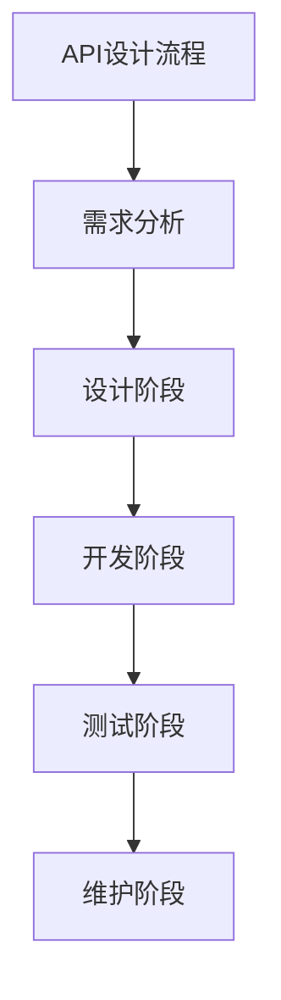

                 

### 文章标题

《API设计合理性评估：优化接口使用体验》

API（应用程序编程接口）是现代软件开发中的核心组成部分，它们定义了不同软件模块之间的交互方式，是系统功能扩展和集成的重要桥梁。然而，API的设计并非易事，合理的API设计对系统的性能、可维护性和用户体验都有着至关重要的影响。本文旨在探讨API设计的合理性评估方法，通过一系列的逻辑推理和实际案例分析，帮助开发者在设计API时避免常见问题，优化接口使用体验。

关键词：API设计、合理性评估、性能优化、安全优化、可扩展性、最佳实践

摘要：本文从API设计的基本原理出发，详细阐述了API设计的原则、工具与框架，以及API质量评估的方法和流程。在此基础上，文章重点讨论了API设计的合理性评估标准，提出了性能、安全、可扩展性等方面的优化策略，并结合实际案例分析了优秀API设计的实例。通过本文的阅读，读者可以深入了解API设计的核心要点，掌握评估和优化API设计的实用技巧。

### 目录

**第一部分：API设计与评估基础**

**第1章：API设计原理**

1.1 API设计的基本概念

1.2 API设计的原则

1.3 API设计的生命周期

**第2章：API设计工具与框架**

2.1 API设计工具介绍

2.2 API设计框架概述

2.3 常用API设计框架分析

**第3章：API质量评估方法**

3.1 API质量评估指标

3.2 API质量评估工具

3.3 API质量评估实践

**第二部分：API设计合理性与优化**

**第4章：API设计合理性评估**

4.1 API设计合理性的定义

4.2 API设计合理性的评估标准

4.3 API设计合理性的评估流程

**第5章：API优化策略**

5.1 API性能优化

5.2 API安全优化

5.3 API可扩展性优化

**第6章：API设计经验与最佳实践**

6.1 设计经验的总结

6.2 最佳实践的介绍

6.3 案例分析：优秀API设计实例解析

**第三部分：API设计实战**

**第7章：API设计实战案例**

7.1 实战案例1：电商平台的API设计

7.2 实战案例2：社交媒体平台的API设计

7.3 实战案例3：金融服务的API设计

**第8章：API设计项目管理**

8.1 项目管理概述

8.2 API设计需求分析

8.3 API设计项目计划与实施

**第9章：API设计测试与维护**

9.1 API设计测试方法

9.2 API设计测试实践

9.3 API设计维护策略

**第四部分：附录**

**附录A：API设计资源汇总**

A.1 相关书籍推荐

A.2 在线课程资源

A.3 API设计社区与论坛

**附录B：API设计流程图**



**第10章：API设计相关算法与数学模型**

10.1 API性能评估算法

10.1.1 平均响应时间计算

10.1.2 API调用量统计

10.2 API安全评估算法

10.2.1 防止SQL注入

10.2.2 防止XSS攻击

10.3 API可扩展性评估算法

10.3.1 负载均衡算法

**第11章：API设计项目实战**

11.1 实战项目概述

11.2 实战项目实施

11.2.1 需求分析

11.2.2 API设计实现

11.2.3 API测试与优化

### 文章正文

**第一部分：API设计与评估基础**

**第1章：API设计原理**

**1.1 API设计的基本概念**

API，即应用程序编程接口，是一套预先定义的规则、协议和工具，用于构建和交互软件应用程序。API设计指的是制定一套规则和标准，使得不同软件组件能够高效、安全地相互通信。API设计的目标包括提供简单易用的接口、保证接口的稳定性、提高系统的可维护性和可扩展性。

API的基本概念包括：

- **端点（Endpoint）**：API的访问入口点，通常是一个URL。
- **请求（Request）**：客户端发送给服务器的数据包，包括请求方法和请求体。
- **响应（Response）**：服务器返回给客户端的数据包，包括状态码和响应体。
- **参数（Parameters）**：用于指定API行为的变量。

**1.2 API设计的原则**

合理的API设计需要遵循一些基本原则，以确保接口的质量和易用性。以下是几个核心原则：

- **简洁性（Simplicity）**：API应尽可能简单，避免过度设计，减少用户的学习成本。
- **一致性（Consistency）**：API的命名、参数和返回值应保持一致性，遵循统一的命名规范和设计风格。
- **无状态性（Statelessness）**：每次请求之间独立，不依赖于之前的请求状态。
- **可扩展性（Extensibility）**：设计应考虑未来的扩展，易于添加新功能或修改现有功能。
- **安全性（Security）**：保护API免受恶意攻击，如防止SQL注入、XSS攻击等。

**1.3 API设计的生命周期**

API设计有一个完整的发展周期，包括以下几个阶段：

- **需求分析**：确定API需要实现的功能和性能要求。
- **设计阶段**：制定API的详细规格，包括端点、参数、返回值和错误处理。
- **开发阶段**：根据设计文档实现API接口。
- **测试阶段**：测试API的功能和性能，确保满足设计要求。
- **维护阶段**：根据用户反馈和技术发展进行API的迭代和更新。

**第2章：API设计工具与框架**

**2.1 API设计工具介绍**

API设计工具可以帮助开发者更高效地创建和管理API。以下是一些常用的API设计工具：

- **Swagger**：一个强大的API设计工具，能够生成详细的API文档和接口代码。
- **Postman**：一个流行的API调试工具，支持API设计、测试和文档生成。
- **RAPID**：一个基于Node.js的API设计工具，提供图形界面和代码生成功能。

**2.2 API设计框架概述**

API设计框架是一套标准化的API设计指南，用于提高API的一致性和可维护性。以下是一些常用的API设计框架：

- **RESTful API**：基于HTTP协议，使用URL表示资源，通过GET、POST、PUT、DELETE等HTTP方法进行操作。
- **GraphQL**：一个灵活的查询语言，允许客户端指定需要的数据，减少数据传输量。
- **SOAP**：基于XML的Web服务协议，适用于跨平台、跨语言的通信。

**2.3 常用API设计框架分析**

- **RESTful API**：简单易用，但可能不适合复杂的数据模型。适用于资源较少的场景。
- **GraphQL**：提供更灵活的数据查询方式，但需要额外的服务器处理。适用于数据量大的场景。
- **SOAP**：提供强大的安全和事务处理功能，但复杂度较高。适用于需要高安全性和高可靠性的场景。

**第3章：API质量评估方法**

**3.1 API质量评估指标**

API质量评估指标用于衡量API的性能、安全性、可维护性和易用性。以下是一些常见的质量评估指标：

- **响应时间**：API返回响应所需的时间，用于衡量性能。
- **调用量**：API被调用的次数，用于衡量使用频率。
- **错误率**：API返回错误响应的次数，用于衡量稳定性。
- **安全性**：API的安全性指标，如SQL注入、XSS攻击的防护能力。
- **易用性**：API的易用性指标，如文档的清晰程度、接口的简洁性。

**3.2 API质量评估工具**

API质量评估工具可以帮助开发者自动评估API的质量。以下是一些常用的评估工具：

- **APIMetrics**：提供API性能和安全的全面评估。
- **API Console**：Google提供的API测试工具，支持多种API设计框架。
- **API Inspector**：一个在线API测试工具，支持GraphQL和RESTful API。

**3.3 API质量评估实践**

API质量评估实践包括以下几个步骤：

1. **需求分析**：确定API需要满足的功能和性能要求。
2. **设计评审**：评审API的设计文档，确保符合质量评估指标。
3. **测试执行**：执行自动化测试，评估API的性能和安全性。
4. **持续反馈**：根据测试结果和用户反馈，持续优化API设计。

**第二部分：API设计合理性与优化**

**第4章：API设计合理性评估**

**4.1 API设计合理性的定义**

API设计合理性是指API设计是否符合既定的设计原则和需求，能够满足用户的使用需求，并具有较高的性能和安全性。合理的API设计应该具备以下几个特点：

- **易用性**：API接口简单明了，用户易于理解和使用。
- **一致性**：API的命名、参数和返回值保持一致性，遵循统一的命名规范。
- **无状态性**：每次请求独立，不依赖于之前的请求状态。
- **可扩展性**：设计考虑未来的扩展，易于添加新功能或修改现有功能。
- **安全性**：API设计具备较强的安全性，能够防止常见的网络安全攻击。

**4.2 API设计合理性的评估标准**

API设计合理性的评估标准包括以下几个方面：

1. **功能性**：API是否实现了预期的功能，能够满足用户的需求。
2. **性能**：API的响应时间和调用量是否满足性能要求。
3. **安全性**：API是否具备防止SQL注入、XSS攻击等安全措施。
4. **一致性**：API的命名、参数和返回值是否保持一致性。
5. **可扩展性**：API设计是否考虑了未来的扩展，是否易于添加新功能。
6. **可维护性**：API代码是否清晰，易于维护和调试。

**4.3 API设计合理性的评估流程**

API设计合理性的评估流程包括以下几个步骤：

1. **需求分析**：确定API需要实现的功能和性能要求。
2. **设计评审**：评审API的设计文档，确保符合评估标准。
3. **代码审查**：审查API的代码，确保符合编程规范和安全要求。
4. **测试执行**：执行自动化测试，评估API的性能和安全性。
5. **用户反馈**：收集用户反馈，评估API的易用性和满意度。
6. **持续优化**：根据评估结果和用户反馈，持续优化API设计。

**第5章：API优化策略**

**5.1 API性能优化**

API性能优化是提高系统性能和用户体验的关键。以下是一些常见的API性能优化策略：

1. **缓存**：使用缓存减少数据库查询次数，提高响应速度。
2. **数据库优化**：优化数据库索引和查询语句，提高数据检索速度。
3. **分页**：对于大量数据，使用分页技术减少响应数据量。
4. **异步处理**：使用异步处理减少阻塞，提高系统并发能力。

**5.2 API安全优化**

API安全优化是保护系统免受恶意攻击的关键。以下是一些常见的API安全优化策略：

1. **身份验证**：使用OAuth、JWT等身份验证机制，确保只有授权用户能够访问API。
2. **权限控制**：根据用户角色和权限限制API访问，防止越权操作。
3. **防止SQL注入**：使用参数化查询，避免直接拼接SQL语句。
4. **防止XSS攻击**：对用户输入进行编码或转义，防止恶意脚本注入。

**5.3 API可扩展性优化**

API可扩展性优化是确保系统能够适应未来变化的关键。以下是一些常见的API可扩展性优化策略：

1. **模块化设计**：将API拆分为多个模块，易于添加新功能或修改现有功能。
2. **版本控制**：为API版本化，保持旧版API的兼容性，方便后续升级。
3. **标准化**：遵循统一的API设计标准和规范，提高系统的可维护性。
4. **监控与日志**：实时监控API性能和安全情况，记录详细的日志信息，便于问题定位和排查。

**第6章：API设计经验与最佳实践**

**6.1 设计经验的总结**

在设计API时，以下经验值得总结：

1. **简洁性**：避免过度设计，简化接口，降低用户学习成本。
2. **一致性**：遵循统一的命名规范和设计风格，提高代码可读性。
3. **无状态性**：确保每次请求独立，避免状态依赖。
4. **可扩展性**：设计考虑未来的扩展，便于功能添加和修改。
5. **安全性**：采取措施防止常见的安全攻击。

**6.2 最佳实践的介绍**

以下是一些API设计最佳实践：

1. **使用RESTful API**：对于资源较少的接口，使用RESTful API设计。
2. **使用GraphQL**：对于数据量较大的接口，使用GraphQL提供更灵活的数据查询。
3. **使用标准化协议**：如HTTP、HTTPS、JSON、XML等，提高接口的通用性和兼容性。
4. **编写详细的文档**：提供详细的API文档，包括接口描述、参数说明、错误处理等。
5. **持续测试与优化**：定期进行API测试，根据用户反馈进行优化。

**6.3 案例分析：优秀API设计实例解析**

以下分析几个优秀的API设计实例：

1. **GitHub API**：GitHub API遵循RESTful设计原则，简洁、易用，支持多种编程语言，提供了丰富的功能。
2. **OpenWeatherMap API**：OpenWeatherMap API提供了丰富的气象数据，接口设计清晰，文档详细，支持多种数据格式。
3. **Twilio API**：Twilio API提供了强大的通信功能，如短信、语音、视频等，接口设计考虑了安全性、性能和可扩展性。

**第三部分：API设计实战**

**第7章：API设计实战案例**

**7.1 实战案例1：电商平台的API设计**

本案例介绍如何设计一个电商平台的API。首先，确定API的功能需求，如商品查询、购物车管理、订单处理等。然后，设计具体的API接口，如商品查询接口、购物车添加接口、订单创建接口等。在设计过程中，遵循简洁性、一致性和安全性原则，确保接口易用、稳定和安全。

**7.2 实战案例2：社交媒体平台的API设计**

本案例介绍如何设计一个社交媒体平台的API。首先，分析用户的需求，如发布动态、评论、点赞等。然后，设计相应的API接口，如发布动态接口、评论接口、点赞接口等。在设计过程中，考虑数据传输效率和安全性，遵循RESTful设计原则，提高接口的可扩展性。

**7.3 实战案例3：金融服务的API设计**

本案例介绍如何设计一个金融服务的API。首先，确定API的功能需求，如账户查询、转账、交易查询等。然后，设计具体的API接口，如账户查询接口、转账接口、交易查询接口等。在设计过程中，注重数据的安全性和稳定性，采用OAuth等身份验证机制，确保接口的安全可靠。

**第8章：API设计项目管理**

**8.1 项目管理概述**

API设计项目管理是确保API设计项目顺利进行的重要环节。项目管理包括以下关键步骤：

1. **需求分析**：明确API的功能需求和性能要求。
2. **设计阶段**：制定API的详细设计文档。
3. **开发阶段**：实现API接口，并进行单元测试。
4. **测试阶段**：进行集成测试和性能测试，确保API符合预期。
5. **部署阶段**：将API部署到生产环境，并进行监控和优化。
6. **维护阶段**：根据用户反馈和技术发展，持续优化API设计。

**8.2 API设计需求分析**

API设计需求分析是API设计的基础，包括以下内容：

1. **功能需求**：明确API需要实现的功能，如查询、添加、删除等。
2. **性能需求**：确定API的性能指标，如响应时间、调用量等。
3. **安全需求**：分析API的安全性要求，如身份验证、权限控制等。
4. **兼容性需求**：考虑API与现有系统和其他API的兼容性。
5. **可扩展性需求**：评估API的扩展性，如添加新功能或修改现有功能。

**8.3 API设计项目计划与实施**

API设计项目计划与实施是确保项目按期完成的重要步骤。项目计划包括以下内容：

1. **项目目标**：明确项目的目标和预期成果。
2. **任务分解**：将项目分解为具体的任务，如需求分析、设计、开发、测试等。
3. **时间安排**：为每个任务分配时间和资源，确保项目按期完成。
4. **资源分配**：确定项目所需的资源和人员，如开发人员、测试人员等。
5. **风险管理**：识别项目中的潜在风险，并制定应对措施。

项目实施过程中，需要遵循以下原则：

1. **敏捷开发**：采用敏捷开发方法，快速迭代和反馈。
2. **文档管理**：及时更新和整理项目文档，确保项目透明和可追溯。
3. **代码审查**：进行代码审查，确保代码质量和安全性。
4. **测试覆盖**：进行全面测试，确保API功能的正确性和稳定性。
5. **持续集成**：采用持续集成和持续交付，确保API的可靠性和可扩展性。

**第9章：API设计测试与维护**

**9.1 API设计测试方法**

API设计测试是确保API质量和性能的重要环节。以下是一些常用的API测试方法：

1. **功能测试**：测试API是否实现了预期的功能，如查询、添加、删除等。
2. **性能测试**：测试API的响应时间和调用量，确保性能满足要求。
3. **安全测试**：测试API的安全性，如防止SQL注入、XSS攻击等。
4. **兼容性测试**：测试API与不同系统和环境的兼容性。
5. **压力测试**：测试API在高负载情况下的性能和稳定性。

**9.2 API设计测试实践**

API设计测试实践包括以下步骤：

1. **测试计划**：制定测试计划，明确测试目标和测试方法。
2. **测试用例设计**：设计测试用例，包括输入数据、预期结果和实际结果。
3. **执行测试**：执行测试用例，记录测试结果。
4. **缺陷管理**：记录和跟踪缺陷，确保缺陷得到修复。
5. **测试报告**：编写测试报告，总结测试结果和发现的问题。

**9.3 API设计维护策略**

API设计维护策略是确保API长期稳定运行的重要措施。以下是一些常见的API维护策略：

1. **定期检查**：定期检查API的运行状况，发现潜在问题。
2. **更新文档**：及时更新API文档，确保文档的准确性和完整性。
3. **代码审查**：定期进行代码审查，确保代码的质量和安全性。
4. **版本控制**：采用版本控制机制，确保代码的稳定性和可追溯性。
5. **用户反馈**：收集用户反馈，根据用户需求进行优化和改进。

**第四部分：附录**

**附录A：API设计资源汇总**

**A.1 相关书籍推荐**

1. 《RESTful Web API设计》
2. 《API设计与最佳实践》
3. 《API设计实战》

**A.2 在线课程资源**

1. Coursera - API设计与开发
2. Udemy - RESTful API设计与开发
3. Pluralsight - API设计与最佳实践

**A.3 API设计社区与论坛**

1. Stack Overflow - API设计相关讨论区
2. Reddit - API设计相关论坛
3. GitHub - API设计开源项目

**附录B：API设计流程图**


**第10章：API设计相关算法与数学模型**

**10.1 API性能评估算法**

**10.1.1 平均响应时间计算**

平均响应时间（Average Response Time, ART）是衡量API性能的重要指标，计算公式如下：

$$
ART = \frac{\sum_{i=1}^{n} RT_i}{n}
$$

其中，$RT_i$ 表示第 $i$ 次请求的响应时间，$n$ 表示请求的总次数。

**10.1.2 API调用量统计**

API调用量（API Call Count, ACC）是衡量API使用频率的重要指标，计算公式如下：

$$
ACC = \sum_{i=1}^{n} C_i
$$

其中，$C_i$ 表示第 $i$ 次请求的调用次数，$n$ 表示请求的总次数。

**10.2 API安全评估算法**

**10.2.1 防止SQL注入**

SQL注入（SQL Injection）是一种常见的网络安全攻击，通过在输入数据中插入恶意的SQL语句，篡改数据库查询。防止SQL注入的关键在于使用参数化查询，避免直接拼接SQL语句。

以下是一个简单的防止SQL注入的伪代码示例：

```python
def query_user_by_id(id):
    query = "SELECT * FROM Users WHERE id = ?"
    params = [id]
    result = execute_query(query, params)
    return result
```

**10.2.2 防止XSS攻击**

XSS攻击（Cross-Site Scripting）是一种常见的网络安全攻击，通过在输入数据中插入恶意脚本，欺骗用户执行恶意操作。防止XSS攻击的关键在于对用户输入进行编码或转义。

以下是一个简单的防止XSS攻击的HTML代码示例：

```html
<p>Welcome, {{ username }}!</p>
```

**10.3 API可扩展性评估算法**

**10.3.1 负载均衡算法**

负载均衡（Load Balancing）是一种将请求分配到多个服务器以优化性能和可用性的技术。以下是一个简单的负载均衡算法的伪代码示例：

```python
def load_balance(requests):
    servers = get_servers()
    for request in requests:
        server = select_server(servers)
        send_request_to_server(server, request)
        remove_server(server)
```

**第11章：API设计项目实战**

**11.1 实战项目概述**

本案例将介绍一个实际项目：设计一个用于天气查询的API。项目背景是为一个移动应用提供实时天气信息，用户可以通过API获取特定地点的天气数据。项目目标是在确保性能和安全性满足需求的前提下，提供一个简洁易用的天气查询API。

**11.2 实战项目实施**

**11.2.1 需求分析**

需求分析阶段，明确了以下功能需求：

- 用户可以通过城市名称或经纬度查询天气信息。
- 支持实时天气和未来几天的天气预报。
- 返回的数据格式为JSON，包含温度、湿度、风速等信息。

**11.2.2 API设计实现**

在API设计实现阶段，根据需求分析设计了以下接口：

- `/weather/{city_name}`：获取指定城市的实时天气信息。
- `/forecast/{city_name}`：获取指定城市的天气预报。

以下是一个简单的API接口实现的伪代码示例：

```python
from flask import Flask, jsonify, request

app = Flask(__name__)

@app.route('/weather/<city_name>', methods=['GET'])
def get_weather(city_name):
    # 获取天气数据逻辑
    weather_data = get_weather_data(city_name)
    return jsonify(weather_data)

@app.route('/forecast/<city_name>', methods=['GET'])
def get_forecast(city_name):
    # 获取天气预报逻辑
    forecast_data = get_forecast_data(city_name)
    return jsonify(forecast_data)

if __name__ == '__main__':
    app.run()
```

**11.2.3 API测试与优化**

在API测试与优化阶段，执行了以下测试：

- 功能测试：验证API是否正确实现了预期功能。
- 性能测试：测量API的响应时间和调用量。
- 安全测试：验证API是否易于受到SQL注入、XSS攻击等安全攻击。

根据测试结果，对API进行了以下优化：

- 使用缓存减少数据库查询次数。
- 对用户输入进行编码或转义，防止XSS攻击。
- 对敏感数据进行加密，确保数据安全。

**项目小结**

本案例通过设计一个天气查询API，展示了API设计的全过程，包括需求分析、接口设计、实现和测试。通过遵循最佳实践和持续优化，成功实现了一个高性能、高安全性的API，为移动应用提供了实时天气信息。

**最佳实践 tips、小结、注意事项、拓展阅读等内容**

- **最佳实践 tips**：在设计API时，遵循RESTful设计原则、使用标准化协议、编写详细的文档、进行全面的测试。

- **小结**：合理的API设计对于系统的性能、可维护性和用户体验至关重要。通过本文的探讨，读者可以了解API设计的核心要点和优化策略。

- **注意事项**：在设计API时，要关注性能、安全、可扩展性等方面的优化，确保API能够满足用户的需求。

- **拓展阅读**：可以参考《RESTful Web API设计》、《API设计与最佳实践》等书籍，深入了解API设计的相关知识。同时，加入API设计社区和论坛，与同行交流和学习。

