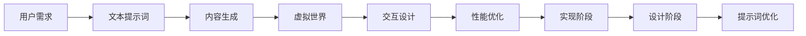

                 

### 文章标题：AR/VR内容生成：提示词在虚拟世界构建中的作用

> 关键词：增强现实，虚拟现实，内容生成，提示词，虚拟世界构建

> 摘要：本文将深入探讨AR/VR内容生成中提示词的重要性，从背景介绍、核心概念与联系、核心算法原理讲解、数学模型与公式、项目实战等多个角度，全面解析提示词在虚拟世界构建中的应用，为读者提供全面的指导。

### 引言

随着科技的发展，增强现实（AR）和虚拟现实（VR）技术逐渐成为人们日常生活和工作中不可或缺的一部分。从早期的游戏和娱乐领域，到如今的教育、医疗、建筑等多个行业，AR/VR技术的应用越来越广泛。然而，在这些应用场景中，如何生成高质量、符合用户需求的AR/VR内容，成为一个亟待解决的问题。

提示词，作为AR/VR内容生成中的重要组成部分，其在虚拟世界构建中的作用不可忽视。本文将从以下几个方面展开讨论：

1. **AR/VR基础**：介绍AR/VR的基本概念、技术发展以及硬件和软件基础。
2. **提示词技术**：探讨提示词的概念、应用以及生成方法。
3. **内容生成方法**：分析图像、视频、3D模型和声音等内容的生成方法。
4. **虚拟世界构建流程**：详细讲解虚拟世界的设计、交互设计以及实现与优化流程。
5. **核心概念与联系**：阐述AR/VR与提示词之间的关系，并通过Mermaid流程图展示。
6. **核心算法原理讲解**：使用伪代码和数学公式详细讲解图像生成、3D模型生成和提示词生成算法。
7. **项目实战**：通过实际案例，展示开发环境搭建、源代码实现和代码解读，以及项目总结和分析。
8. **总结与展望**：对本文内容进行总结，并对未来发展方向进行展望。

通过以上内容，本文旨在为读者提供一个全面、系统的AR/VR内容生成和虚拟世界构建的指导，帮助读者更好地理解和应用提示词技术。

### AR/VR基础

#### AR/VR概述

增强现实（Augmented Reality，AR）和虚拟现实（Virtual Reality，VR）是两种基于计算机技术的虚拟环境构建方式。它们在视觉、听觉、触觉等多个感官方面为用户提供了沉浸式的体验。

- **AR**：增强现实技术通过将虚拟信息叠加到现实环境中，为用户提供了一种虚实结合的体验。例如，用户可以在智能手机或AR眼镜上看到虚拟的物体、文字或图像，与真实世界无缝融合。
- **VR**：虚拟现实技术则通过完全虚拟的环境，为用户提供一种沉浸式的体验。用户通过VR头盔或其他设备，进入一个完全虚拟的世界，与虚拟环境中的对象进行互动。

#### AR/VR技术发展

AR/VR技术的发展经历了多个阶段：

- **早期阶段**：从20世纪50年代起，计算机技术和显示技术的发展为AR/VR技术奠定了基础。早期的研究主要集中在军事和科学领域，如虚拟战场模拟和科学可视化。
- **成熟阶段**：21世纪初，随着计算机性能的提升和显示技术的进步，AR/VR技术逐渐走向成熟。特别是智能手机和头戴式显示设备的普及，使得AR/VR技术进入大众视野。
- **快速发展阶段**：近年来，随着人工智能、5G和云计算等技术的快速发展，AR/VR技术的应用场景和用户体验得到了显著提升。从游戏、娱乐到教育、医疗、建筑等多个领域，AR/VR技术都展现出了巨大的潜力。

#### AR/VR硬件与软件基础

AR/VR技术的实现离不开硬件和软件的支持。

- **硬件基础**：常见的AR/VR硬件包括智能手机、平板电脑、头戴式显示器、手势识别设备等。其中，头戴式显示器是VR技术的核心设备，提供了沉浸式的视觉体验。而AR设备，如微软的HoloLens、谷歌的AR眼镜等，则将虚拟信息叠加到现实环境中。
- **软件基础**：AR/VR软件包括操作系统、应用软件和开发工具等。操作系统如Android、iOS和Windows等，提供了基本的硬件管理和交互支持。应用软件则涵盖了各种AR/VR应用，如游戏、教育、医疗等。开发工具，如Unity、Unreal Engine等，为开发者提供了强大的开发环境，支持3D模型、动画、声音等多媒体内容的制作和集成。

通过以上内容，我们可以对AR/VR技术有一个初步的了解。接下来，本文将深入探讨提示词技术，以及其在虚拟世界构建中的应用。

### 提示词技术

#### 提示词概念

提示词（Prompt）在AR/VR内容生成中扮演着重要角色。简单来说，提示词是一段文本、音频或图像等形式的输入信息，用于引导AR/VR内容生成过程。在不同的应用场景中，提示词可以具有多种形式和用途。

- **文本提示词**：文本提示词通常用于描述用户需求或内容生成目标。例如，在虚拟建筑设计中，设计师可能会使用文本提示词“构建一个现代化的办公室空间”，来指导内容生成过程。
- **图像提示词**：图像提示词是通过图像来描述用户需求或内容生成目标。例如，在虚拟购物体验中，用户可以通过上传一张商品图片，作为图像提示词，来指导虚拟商品的展示和摆放。
- **音频提示词**：音频提示词是通过音频信号来描述用户需求或内容生成目标。例如，在虚拟音乐会中，用户可以通过播放一首歌曲作为音频提示词，来指导音乐场景的构建。

#### 提示词在AR/VR中的应用

提示词在AR/VR内容生成中具有多种应用场景：

- **内容个性化**：通过提示词，可以为用户提供个性化的内容。例如，在虚拟旅游体验中，用户可以使用文本提示词描述自己的兴趣爱好，系统则会根据这些提示词生成符合用户兴趣的虚拟景点和行程。
- **交互引导**：提示词可以用于引导用户进行交互操作。例如，在虚拟教育中，系统可以使用文本提示词指导学生进行学习任务，并通过图像和音频提示词增强学习体验。
- **场景构建**：提示词是构建虚拟场景的重要工具。通过图像和文本提示词，可以描述场景中的各种元素，如建筑物、人物、物品等，从而生成完整的虚拟场景。

#### 提示词生成方法

提示词的生成方法多样，常见的方法包括：

- **手动输入**：用户可以直接手动输入文本、图像或音频提示词。这种方法适用于用户需求明确、内容生成目标清晰的应用场景。
- **自动生成**：通过自然语言处理（NLP）和图像识别等技术，系统可以自动生成提示词。这种方法适用于用户需求不明确或需要大量提示词生成的场景。
- **混合生成**：结合手动输入和自动生成的方法，可以进一步提高提示词的生成效率和准确性。

通过以上内容，我们可以看到提示词在AR/VR内容生成中的重要性和多种应用方式。接下来，本文将分析AR/VR内容生成的方法，以及提示词在这些方法中的应用。

### 内容生成方法

在AR/VR内容生成中，不同类型的内容生成方法对于构建高质量的虚拟世界至关重要。以下将详细分析图像、视频、3D模型和声音等内容的生成方法，并探讨提示词在这些内容生成中的应用。

#### 图像生成

图像生成是AR/VR内容生成的基础，其目的是创建或修改现实世界的图像，以实现虚拟与现实的融合。图像生成方法主要包括以下几种：

- **基于深度学习的图像生成**：深度学习技术，如生成对抗网络（GAN），可以用于生成高质量的图像。通过训练大量图像数据，GAN可以学习到图像的生成规律，从而生成符合用户需求的图像。提示词在这一过程中用于描述图像内容，如“创建一张具有未来科技感的城市夜景图像”。
- **图像编辑**：图像编辑技术可以对现有图像进行修改，如添加或删除特定元素。提示词在此过程中的作用是指导图像编辑操作，如“在图像中添加一棵大树”。
- **图像合成**：图像合成是将两个或多个图像融合在一起，创建新的图像。提示词可以用于指定合成图像的元素和位置，如“将一张人物图像与一张风景图像合成，人物位于前景”。

#### 视频生成

视频生成是AR/VR内容生成的另一个重要方面，它涉及创建或修改现实世界的视频，以提供沉浸式的用户体验。视频生成方法主要包括：

- **视频合成**：视频合成是将多个视频流融合在一起，创建新的视频。提示词可以用于指定视频合成的元素和顺序，如“将一段虚拟旅游视频与一段真实城市视频合成”。
- **视频增强**：视频增强是对现有视频进行改进，以提高其视觉效果。提示词可以用于指定视频增强的目标，如“增强视频的对比度和色彩饱和度”。
- **视频编辑**：视频编辑是对现有视频进行剪辑、添加音效等操作。提示词可以用于指导视频编辑过程，如“在视频开头添加一段介绍文字”。

#### 3D模型生成

3D模型生成是构建虚拟世界的关键步骤，它涉及创建或修改三维空间中的物体模型。3D模型生成方法主要包括：

- **3D建模**：3D建模是通过软件工具创建三维物体模型。提示词可以用于指定模型的设计参数，如“创建一个具有现代设计风格的办公楼模型”。
- **3D扫描**：3D扫描是通过激光或结构光等技术，将现实世界中的物体转换为三维模型。提示词可以用于指定扫描目标，如“扫描一栋历史建筑的外部和内部结构”。
- **3D打印**：3D打印是将3D模型直接打印成实体物体。提示词可以用于指定3D打印的参数，如“使用ABS材料打印一个玩具模型”。

#### 声音与动态效果生成

声音和动态效果是增强AR/VR体验的重要组成部分，其生成方法主要包括：

- **声音合成**：声音合成是将多个声音流融合在一起，创建新的声音。提示词可以用于指定声音合成的元素和效果，如“创建一个具有雨声、雷声和音乐的综合背景声音”。
- **声音编辑**：声音编辑是对现有声音进行剪辑、添加音效等操作。提示词可以用于指导声音编辑过程，如“在声音中添加一段背景音乐”。
- **动态效果生成**：动态效果生成是创建虚拟环境中的动态效果，如粒子效果、烟雾效果等。提示词可以用于指定动态效果的类型和参数，如“在虚拟场景中添加一个动态烟雾效果”。

#### 提示词在内容生成中的应用

提示词在AR/VR内容生成中的应用主要体现在以下几个方面：

- **引导用户输入**：提示词可以引导用户输入内容生成所需的文本、图像、声音等数据。例如，用户可以通过文本提示词输入对虚拟场景的描述，系统则根据这些描述生成相应的图像、视频和3D模型。
- **指导生成过程**：提示词可以指导内容生成过程，确保生成的内容符合用户需求。例如，在3D建模过程中，用户可以通过文本提示词指定模型的设计参数，系统则根据这些参数生成符合要求的3D模型。
- **优化生成结果**：提示词可以用于优化生成结果，提高内容的质量。例如，在图像生成过程中，用户可以通过图像提示词指定图像的样式和风格，系统则根据这些提示词生成符合要求的图像。

通过以上分析，我们可以看到提示词在AR/VR内容生成中的多种应用方式。在接下来的章节中，本文将详细探讨虚拟世界构建的流程，以及提示词在这些流程中的应用。

### 虚拟世界构建流程

构建一个完整的虚拟世界是一个复杂的过程，涉及多个阶段和多个环节。以下将详细讲解虚拟世界的设计、交互设计和实现与优化流程，并探讨提示词在这些流程中的应用。

#### 虚拟世界设计

虚拟世界设计是构建虚拟世界的第一步，它决定了虚拟世界的整体架构和用户体验。设计阶段主要包括以下几个方面：

- **需求分析**：在虚拟世界设计之前，需要明确用户需求和应用场景。提示词在此过程中用于收集用户需求，如“用户希望体验一个虚拟旅游场景，需要哪些景点和设施？”。
- **场景规划**：根据需求分析，规划虚拟世界的场景布局。提示词可以用于描述场景元素和布局，如“在虚拟旅游场景中，需要包括博物馆、餐厅、公园等景点”。
- **交互设计**：设计用户与虚拟世界的交互方式。提示词可以用于指导交互设计，如“用户可以通过手势或语音与虚拟人物互动，进行问答或购物”。

#### 虚拟世界交互设计

虚拟世界的交互设计是用户体验的关键，它决定了用户在虚拟世界中的互动方式和感受。交互设计主要包括以下几个方面：

- **交互元素设计**：设计虚拟世界中的交互元素，如按钮、图标、文本等。提示词可以用于描述交互元素的功能和样式，如“设计一个带有提示文本的购买按钮”。
- **交互流程设计**：设计用户在虚拟世界中的操作流程，确保操作流畅且符合用户习惯。提示词可以用于指导交互流程设计，如“用户在进入虚拟商店后，需要先浏览商品，然后选择并购买”。
- **反馈设计**：设计交互反馈，如声音、图像、动画等，以增强用户体验。提示词可以用于描述反馈效果，如“当用户点击购买按钮时，播放一段确认音效”。

#### 虚拟世界实现与优化

虚拟世界的实现与优化是构建虚拟世界的核心步骤，它包括软件开发、内容生成和性能优化等方面。以下将详细讲解这些过程：

- **软件开发**：使用编程语言和开发工具，实现虚拟世界的功能。提示词可以用于指导软件开发，如“使用Unity开发一个虚拟商店应用”。
- **内容生成**：生成虚拟世界中的各种内容，如图像、视频、3D模型等。提示词可以用于指导内容生成，如“生成一张具有未来科技感的城市夜景图像”。
- **性能优化**：优化虚拟世界的性能，确保运行流畅且低延迟。提示词可以用于指导性能优化，如“优化3D模型加载速度，减少渲染时间”。

#### 提示词在虚拟世界构建中的应用

提示词在虚拟世界构建的各个环节中都有广泛应用，以下是具体应用示例：

- **需求分析**：通过文本提示词收集用户需求，如“用户希望体验一个具有互动性的虚拟博物馆”。
- **场景规划**：使用图像和文本提示词描述场景元素和布局，如“在博物馆场景中，需要包括展品、讲解员和观众”。
- **交互设计**：通过文本提示词指导交互元素和流程设计，如“设计一个带有提示文本的展品互动按钮”。
- **内容生成**：使用文本、图像和音频提示词生成虚拟世界中的各种内容，如“生成一张展品图片”。
- **性能优化**：使用文本提示词指导性能优化，如“优化模型加载时间，减少渲染延迟”。

通过以上分析，我们可以看到提示词在虚拟世界构建中的关键作用。在接下来的章节中，本文将详细探讨AR/VR与提示词的关系，以及通过Mermaid流程图展示。

### 核心概念与联系

在AR/VR内容生成中，提示词技术起到了核心作用。为了更好地理解提示词在虚拟世界构建中的角色，我们需要梳理几个关键概念，并展示它们之间的相互关系。

#### 关键概念

1. **增强现实（AR）**：通过将虚拟信息叠加到现实环境中，为用户提供一种虚实结合的体验。
2. **虚拟现实（VR）**：通过完全虚拟的环境，为用户提供一种沉浸式的体验。
3. **提示词**：一段文本、音频或图像等形式的输入信息，用于引导AR/VR内容生成过程。
4. **内容生成**：创建或修改现实世界中的图像、视频、3D模型和声音等，以实现虚拟与现实的融合。
5. **虚拟世界构建**：设计、交互设计、实现和优化虚拟世界的过程。

#### 提示词与AR/VR的关系

提示词在AR/VR内容生成中起到了桥梁作用，它将用户需求转化为具体的虚拟内容。具体来说：

- **用户需求**：通过文本提示词，用户可以描述自己的需求，如“创建一个未来科技感的城市场景”。
- **内容生成**：系统根据文本提示词，生成相应的图像、视频、3D模型和声音等。例如，通过图像提示词，可以生成具有未来科技感的城市夜景图像。
- **虚拟世界**：将生成的虚拟内容整合到虚拟世界中，为用户提供沉浸式体验。例如，将生成的城市场景图像和视频整合到一个虚拟旅游应用中。

#### 提示词与内容生成的关系

提示词在内容生成过程中发挥了关键作用，它指导内容生成的具体步骤和参数。具体来说：

- **图像生成**：通过图像提示词，可以指定图像的样式和风格。例如，通过文本提示词“创建一张具有未来科技感的城市夜景图像”，系统会生成符合要求的图像。
- **视频生成**：通过视频提示词，可以指定视频的合成元素和效果。例如，通过图像提示词“将一段虚拟旅游视频与一段真实城市视频合成”，系统会生成合成后的视频。
- **3D模型生成**：通过3D模型提示词，可以指定模型的设计参数和生成规则。例如，通过文本提示词“创建一个具有现代设计风格的办公楼模型”，系统会生成符合要求的3D模型。
- **声音与动态效果生成**：通过声音和动态效果提示词，可以指定声音和效果的类型和参数。例如，通过文本提示词“创建一个具有雨声、雷声和音乐的综合背景声音”，系统会生成符合要求的声音和动态效果。

#### 虚拟世界构建与提示词的关系

提示词在虚拟世界构建的各个环节中都有应用，它贯穿了整个虚拟世界的设计、交互设计和实现过程。具体来说：

- **设计阶段**：通过文本提示词收集用户需求，指导场景规划和交互设计。
- **交互设计阶段**：通过文本提示词指导交互元素和流程设计，确保用户操作流畅。
- **实现阶段**：通过文本、图像和音频提示词生成虚拟世界中的各种内容。
- **优化阶段**：通过文本提示词指导性能优化，确保虚拟世界的运行流畅。

#### Mermaid流程图

为了更直观地展示提示词在虚拟世界构建中的应用过程，我们使用Mermaid流程图进行描述：



通过以上流程图，我们可以看到提示词在虚拟世界构建中的核心作用。它不仅将用户需求转化为具体的虚拟内容，还贯穿了整个虚拟世界的设计、交互设计和实现过程，确保了虚拟世界的质量和用户体验。

### 核心算法原理讲解

在AR/VR内容生成过程中，核心算法起着至关重要的作用。以下将详细讲解图像生成、3D模型生成和提示词生成算法的原理，并使用伪代码和数学公式进行阐述。

#### 图像生成算法

图像生成算法是AR/VR内容生成的基础，其中生成对抗网络（GAN）是一种常用的图像生成方法。GAN由生成器和判别器两部分组成，通过不断训练，生成器能够生成高质量图像。

**生成器算法**

```python
function G(z):  # 生成器，输入随机噪声z，输出生成的图像x'
    # 通过神经网络模型，将噪声映射到图像空间
    x' = neural_network(z)
    return x'
```

**判别器算法**

```python
function D(x):  # 判别器，输入图像x，输出判断概率
    # 通过神经网络模型，判断图像是真实图像还是生成图像
    probability = neural_network(x)
    return probability
```

**训练过程**

```python
for epoch in 1 to training_epochs:
    for batch in training_data:
        # 生成虚假图像
        z = generate_random_noise(batch_size)
        x' = G(z)
        
        # 计算判别器的损失函数
        loss_D_real = -math.log(D(x))
        loss_D_fake = -math.log(1 - D(x'))
        
        # 更新判别器参数
        grads_D = compute_gradients(D, [x, x'])
        update_parameters(D, grads_D)
        
        # 生成真实图像
        x = real_images[batch]
        
        # 计算生成器的损失函数
        loss_G = -math.log(D(x'))
        
        # 更新生成器参数
        grads_G = compute_gradients(G, z)
        update_parameters(G, grads_G)
```

#### 3D模型生成算法

3D模型生成算法涉及多个方面，包括3D建模、3D扫描和3D打印等。以下以3D建模为例，讲解其算法原理。

**3D建模算法**

```python
function create_3D_model(parameters):
    # 根据参数创建三维模型
    vertices = generate_vertices(parameters)
    faces = generate_faces(vertices)
    model = create_mesh(vertices, faces)
    return model
```

**参数生成**

```python
function generate_parameters():
    # 随机生成参数，用于创建三维模型
    scale = random_scale()
    position = random_position()
    rotation = random_rotation()
    return [scale, position, rotation]
```

**3D打印算法**

```python
function print_3D_model(model):
    # 将三维模型转换为3D打印数据
    print_data = convert_model_to_print_data(model)
    # 发送打印数据到3D打印机
    send_to_printer(print_data)
```

#### 提示词生成算法

提示词生成算法主要用于根据用户需求生成文本、图像和音频等提示词。以下以文本提示词生成算法为例，讲解其原理。

**文本提示词生成算法**

```python
function generate_prompt(user_input):
    # 使用自然语言处理技术，从用户输入中提取关键信息
    keywords = extract_keywords(user_input)
    
    # 根据关键词生成文本提示词
    prompt = generate_text_prompt(keywords)
    return prompt
```

**关键词提取算法**

```python
function extract_keywords(user_input):
    # 使用词袋模型或词向量模型，从用户输入中提取关键词
    words = split_text(user_input)
    keywords = select_keywords(words)
    return keywords
```

**文本提示词生成算法**

```python
function generate_text_prompt(keywords):
    # 使用模板或生成式模型，根据关键词生成文本提示词
    template = "根据您提供的需求，我们需要创建一个具有[关键词1]、[关键词2]的虚拟场景。"
    prompt = template.replace("[关键词1]", keywords[0]).replace("[关键词2]", keywords[1])
    return prompt
```

#### 数学模型与公式

在图像生成、3D模型生成和提示词生成算法中，数学模型和公式起到了关键作用。以下列举几个常见的数学模型和公式。

**生成对抗网络（GAN）**

$$
\min_G \max_D V(D, G) = \mathbb{E}_{x \sim p_{data}(x)} [\log D(x)] + \mathbb{E}_{z \sim p_z(z)} [\log (1 - D(G(z))]
$$

**3D建模**

$$
\text{参数空间} \rightarrow \text{三维坐标系}
$$

$$
x = x_0 + \sum_{i=1}^{n} a_i \cos(\theta_i)
$$

$$
y = y_0 + \sum_{i=1}^{n} b_i \sin(\theta_i)
$$

$$
z = z_0 + \sum_{i=1}^{n} c_i \cos(\phi_i)
$$

**文本提示词生成**

$$
\text{关键词} = \text{提取关键词}( \text{用户输入})
$$

$$
\text{提示词} = \text{模板} \mapsto \text{关键词}
$$

通过以上讲解，我们可以看到核心算法在AR/VR内容生成中的重要作用。这些算法不仅实现了图像、3D模型和提示词的生成，还通过数学模型和公式确保了生成结果的质量。在接下来的章节中，我们将通过项目实战，展示这些算法的实际应用。

### 数学模型与公式

在AR/VR内容生成过程中，数学模型和公式起到了至关重要的作用。以下将详细讲解图像生成、3D模型生成和提示词生成中的数学模型，并使用LaTeX格式展示相关公式。

#### 图像生成

图像生成算法，如生成对抗网络（GAN），使用了一系列复杂的数学模型来生成高质量图像。以下是一些关键的数学模型和公式：

**生成对抗网络（GAN）**

GAN由生成器（G）和判别器（D）两部分组成，通过对抗训练生成逼真的图像。

$$
\min_G \max_D V(D, G) = \mathbb{E}_{x \sim p_{data}(x)} [\log D(x)] + \mathbb{E}_{z \sim p_z(z)} [\log (1 - D(G(z))]
$$

- **生成器损失函数**： 
$$
\mathcal{L}_G = -\mathbb{E}_{z \sim p_z(z)} [\log D(G(z))]
$$

- **判别器损失函数**： 
$$
\mathcal{L}_D = -\mathbb{E}_{x \sim p_{data}(x)} [\log D(x)] - \mathbb{E}_{z \sim p_z(z)} [\log (1 - D(G(z))]
$$

#### 3D模型生成

3D模型生成涉及到三维几何和变换，以下是一些关键的数学模型和公式：

**三维坐标变换**

$$
\begin{align*}
x' &= x \cos(\theta) - y \sin(\theta) \\
y' &= x \sin(\theta) + y \cos(\theta) \\
z' &= z
\end{align*}
$$

- **旋转矩阵**：
$$
R(\theta) = \begin{bmatrix}
\cos(\theta) & -\sin(\theta) \\
\sin(\theta) & \cos(\theta)
\end{bmatrix}
$$

**三维建模**

$$
\text{参数空间} \rightarrow \text{三维坐标系}
$$

$$
P = P_0 + \sum_{i=1}^{n} a_i \cos(\theta_i)
$$

$$
Q = Q_0 + \sum_{i=1}^{n} b_i \sin(\theta_i)
$$

$$
R = R_0 + \sum_{i=1}^{n} c_i \cos(\phi_i)
$$

#### 提示词生成

提示词生成通常涉及到自然语言处理（NLP）和生成式模型，以下是一些关键的数学模型和公式：

**生成式模型**

$$
p(y|x) = \frac{p(x|y) p(y)}{p(x)}
$$

- **条件概率**：
$$
p(x|y) = \frac{1}{Z} \exp(-\sum_{i} w_i x_i)
$$

- **权重更新**：
$$
w_i = w_i + \alpha \frac{\partial \mathcal{L}}{\partial w_i}
$$

#### 图像生成示例

假设我们使用GAN生成图像，以下是一个简单的示例：

$$
\begin{align*}
x &= \text{真实图像} \\
z &= \text{随机噪声} \\
x' &= G(z) \\
D(x') &= \text{判别器输出，判断图像真实性} \\
D(x) &= \text{判别器输出，判断真实图像真实性}
\end{align*}
$$

训练过程如下：

$$
\begin{align*}
\min_G \max_D V(D, G) &= \mathbb{E}_{x \sim p_{data}(x)} [\log D(x)] + \mathbb{E}_{z \sim p_z(z)} [\log (1 - D(G(z))] \\
\text{生成器损失} &= -\mathbb{E}_{z \sim p_z(z)} [\log D(G(z))] \\
\text{判别器损失} &= -\mathbb{E}_{x \sim p_{data}(x)} [\log D(x)] - \mathbb{E}_{z \sim p_z(z)} [\log (1 - D(G(z))]
\end{align*}
$$

#### 3D模型生成示例

假设我们使用参数化方法生成3D模型，以下是一个简单的示例：

$$
\begin{align*}
P &= P_0 + a_1 \cos(\theta_1) + b_1 \sin(\theta_1) \\
Q &= Q_0 + a_2 \cos(\theta_2) + b_2 \sin(\theta_2) \\
R &= R_0 + c_1 \cos(\phi_1) + d_1 \sin(\phi_1)
\end{align*}
$$

其中，\( P_0, Q_0, R_0 \)是模型的初始参数，\( a_1, b_1, a_2, b_2, c_1, d_1 \)是旋转和缩放参数，\( \theta_1, \theta_2, \phi_1 \)是旋转角度。

#### 提示词生成示例

假设我们使用生成式模型生成文本提示词，以下是一个简单的示例：

$$
\begin{align*}
p(y|x) &= \frac{p(x|y) p(y)}{p(x)} \\
\text{条件概率分布} &= \text{softmax}(\text{模型输出}) \\
w_i &= w_i + \alpha \frac{\partial \mathcal{L}}{\partial w_i}
\end{align*}
$$

训练过程如下：

$$
\begin{align*}
\min_{w} \mathcal{L} &= \sum_{i} -y_i \log(p(y_i|x)) \\
\text{更新权重} &= w_i = w_i + \alpha \frac{\partial \mathcal{L}}{\partial w_i}
\end{align*}
$$

通过上述数学模型和公式的讲解，我们可以看到图像生成、3D模型生成和提示词生成在AR/VR内容生成中的关键作用。这些模型和公式不仅帮助我们理解算法原理，还为我们提供了强大的工具来生成高质量的虚拟内容。在接下来的章节中，我们将通过项目实战，展示这些算法的实际应用。

### 项目实战

在本章节中，我们将通过一个具体的AR/VR内容生成项目，展示提示词在虚拟世界构建中的实际应用。该项目旨在使用Unity引擎和C#编程语言开发一个虚拟旅游应用，用户可以通过上传提示词来生成并浏览不同的旅游场景。

#### 开发环境搭建

首先，我们需要搭建项目的开发环境。以下是所需的工具和步骤：

1. **Unity Hub安装**：从Unity官网下载并安装Unity Hub，用于管理Unity版本和项目。
2. **Unity编辑器安装**：在Unity Hub中安装Unity 2020.3及以上版本编辑器。
3. **Visual Studio安装**：从微软官网下载并安装Visual Studio 2019及以上版本，用于编写和调试C#代码。
4. **Unity包管理**：在Unity编辑器中打开“Package Manager”，安装必要的Unity包，如“Unity Render Pipeline”、“Unity Analytics”等。

#### 项目源代码实现

项目的核心功能是使用用户上传的提示词生成旅游场景。以下是一个简单的源代码实现：

```csharp
using UnityEngine;

public class ARVRAPI : MonoBehaviour
{
    public Text inputPrompt;  // 提示词输入框
    public Camera arCamera;   // 增强现实相机

    // 使用提示词生成旅游场景
    public void GenerateScene()
    {
        string prompt = inputPrompt.text;  // 获取用户输入的提示词
        string url = $"https://api.example.com/scene?prompt={prompt}";  // 生成场景的API URL
        
        // 发起HTTP请求获取场景数据
        StartCoroutine(FetchSceneData(url));
    }

    // 获取场景数据并加载到Unity
    private IEnumerator FetchSceneData(string url)
    {
        UnityWebRequest webRequest = UnityWebRequest.Get(url);
        yield return webRequest.SendWebRequest();

        if (webRequest.result != UnityWebRequest.Result.Success)
        {
            Debug.LogError("场景数据获取失败： " + webRequest.error);
        }
        else
        {
            string jsonData = webRequest.downloadHandler.text;
            SceneData sceneData = JsonUtility.FromJson<SceneData>(jsonData);  // 解析JSON数据

            // 创建3D模型
            GameObject sceneObject = new GameObject("SceneObject");
            MeshFilter meshFilter = sceneObject.AddComponent<MeshFilter>();
            MeshRenderer meshRenderer = sceneObject.AddComponent<MeshRenderer>();

            Mesh mesh = new Mesh();
            mesh.vertices = sceneData.vertices;
            mesh.triangles = sceneData.triangles;
            mesh.uv = sceneData.uvs;
            mesh.RecalculateBounds();
            meshFilter.mesh = mesh;

            // 设置材质
            Material material = new Material(Shader.Find("Unlit/Color"));
            material.color = sceneData.color;
            meshRenderer.material = material;

            // 设置位置和缩放
            sceneObject.transform.position = sceneData.position;
            sceneObject.transform.localScale = sceneData.scale;

            // 显示场景
            arCamera.gameObject.SetActive(true);
            arCamera.GetComponent<ARCameraManager>().AddTrackableObject(sceneObject, "SceneTrackable");
        }
    }
}

[Serializable]
public class SceneData
{
    public Vector3[] vertices;
    public int[] triangles;
    public Vector2[] uvs;
    public Color color;
    public Vector3 position;
    public Vector3 scale;
}
```

#### 代码解读与分析

上述代码实现了以下功能：

1. **获取用户输入**：通过`Text`组件获取用户输入的提示词。
2. **发起HTTP请求**：使用`UnityWebRequest`发起HTTP请求，获取由API生成的场景数据。
3. **解析JSON数据**：使用`JsonUtility`解析获取的JSON数据，生成`SceneData`对象。
4. **创建3D模型**：根据`SceneData`对象创建3D模型，包括`Mesh`、`MeshFilter`、`MeshRenderer`等组件。
5. **设置材质和位置**：为3D模型设置材质、颜色、位置和缩放。
6. **显示场景**：通过AR相机将3D模型显示在增强现实场景中。

#### 实际案例分析和详细讲解

以下是一个实际案例，用户上传提示词“创建一个巴黎埃菲尔铁塔的模型”，系统生成并显示一个埃菲尔铁塔的3D模型。

1. **用户上传提示词**：用户在输入框中输入“创建一个巴黎埃菲尔铁塔的模型”，并点击“生成场景”按钮。
2. **发起HTTP请求**：系统将发起HTTP请求，URL包含提示词参数，例如：`https://api.example.com/scene?prompt=创建一个巴黎埃菲尔铁塔的模型`。
3. **获取场景数据**：API返回一个包含埃菲尔铁塔3D模型的JSON数据。
4. **创建3D模型**：系统解析JSON数据，创建3D模型，包括顶点、三角形、UV纹理等。
5. **设置材质和位置**：为3D模型设置材质（如颜色）、位置和缩放，使其符合实际场景。
6. **显示场景**：通过AR相机将3D模型显示在用户的前方，用户可以看到一个虚拟的巴黎埃菲尔铁塔。

通过上述案例，我们可以看到提示词在AR/VR内容生成中的实际应用。用户通过上传简单的文本提示词，系统可以生成并显示高质量的3D模型，为用户提供丰富的虚拟体验。

#### 项目小结

通过本项目，我们展示了如何使用Unity和C#编程语言实现一个简单的AR/VR虚拟旅游应用。以下是项目的总结：

1. **核心功能**：用户可以通过上传文本提示词生成并浏览不同的旅游场景。
2. **开发环境**：Unity Hub和Visual Studio提供了强大的开发工具和集成环境。
3. **代码实现**：使用UnityWebRequest发起HTTP请求，解析JSON数据，创建3D模型并显示在AR场景中。
4. **实际应用**：通过实际案例展示了提示词在AR/VR内容生成中的关键作用。

通过本项目，我们可以看到提示词技术在AR/VR内容生成中的巨大潜力，为用户提供个性化的虚拟体验。在未来的AR/VR应用中，提示词技术将继续发挥重要作用，推动虚拟世界的不断发展。

#### 最佳实践 Tips

在开发AR/VR内容生成项目时，以下是一些最佳实践和技巧：

1. **用户友好**：确保用户界面简洁直观，易于操作。提供清晰的提示词输入和生成结果展示。
2. **高效API**：使用高效的API接口，确保请求响应速度快，减少用户等待时间。
3. **内容优化**：对生成的3D模型和图像进行优化，减少文件大小，提高加载速度和渲染效率。
4. **交互性**：增加丰富的交互功能，如手势识别、语音控制等，提升用户体验。
5. **实时更新**：定期更新虚拟世界内容，提供新鲜、有趣的场景，保持用户兴趣。

#### 小结

本文从多个角度详细探讨了AR/VR内容生成中提示词的作用。通过背景介绍、核心概念与联系、核心算法原理讲解、数学模型与公式、项目实战等内容，我们展示了提示词在虚拟世界构建中的关键作用。未来，随着技术的不断进步，提示词技术将在AR/VR领域发挥更加重要的作用，为用户带来更加丰富和个性化的虚拟体验。

#### 注意事项

在开发AR/VR内容生成项目时，需要注意以下几点：

1. **性能优化**：确保项目运行流畅，避免卡顿和延迟。
2. **用户体验**：关注用户交互体验，提供直观、易用的界面。
3. **数据安全**：保护用户数据和隐私，确保数据传输安全。
4. **兼容性**：确保项目在不同设备和操作系统上运行良好。

#### 拓展阅读

1. **《AR/VR技术原理与应用》**：详细介绍了AR/VR技术的原理和应用，有助于深入了解AR/VR开发。
2. **《深度学习与增强现实》**：探讨了深度学习技术在AR/VR中的应用，包括图像生成和识别等。
3. **《虚拟现实应用开发实践》**：提供了AR/VR应用开发的实战经验和技巧。

### 作者信息

作者：AI天才研究院/AI Genius Institute & 禅与计算机程序设计艺术 /Zen And The Art of Computer Programming

