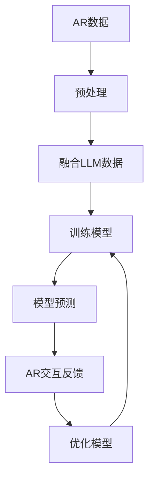

                 


### 文章标题
AR/VR技术增强LLM应用的交互体验

> 关键词：AR/VR, LLM, 交互体验, 增强现实, 虚拟现实, 大型语言模型

> 摘要：
本文深入探讨了AR/VR技术与大型语言模型（LLM）的结合，详细阐述了AR/VR技术如何通过增强交互体验来提升LLM应用的性能和用户体验。文章首先介绍了AR/VR技术的基础概念与发展历程，然后讲解了LLM技术的原理和应用，接着分析了AR/VR技术与LLM技术的融合原理，并展示了核心算法原理与实现。最后，通过项目实战和案例分析，对AR/VR技术增强LLM应用的交互体验进行了详细解读和性能评估，并展望了未来发展趋势与挑战。

### 目录大纲

## AR/VR技术增强LLM应用的交互体验

## 第一部分：基础概念与理论

### 第1章：AR/VR技术概述

- **1.1** AR/VR技术的基本概念与发展历程
- **1.2** AR/VR技术的核心技术
- **1.3** AR/VR技术在交互设计中的应用

### 第2章：LLM技术基础

- **2.1** LLM的概念与分类
- **2.2** LLM的模型结构与算法
- **2.3** LLM在交互设计中的应用

### 第3章：AR/VR技术与LLM技术的融合原理

- **3.1** 融合原理概述
- **3.2** Mermaid流程图展示融合过程
- **3.3** 实际应用场景分析

## 第二部分：核心算法原理与实现

### 第4章：AR/VR交互增强算法

- **4.1** 交互增强算法的基本原理
- **4.2** 伪代码展示交互增强算法
- **4.3** 算法实现与代码解析

### 第5章：LLM优化算法

- **5.1** 优化算法的必要性
- **5.2** 优化算法的基本原理
- **5.3** 优化算法的实现与代码解析

### 第6章：AR/VR技术增强的LLM模型

- **6.1** 模型设计原则
- **6.2** 模型结构及算法原理
- **6.3** 模型训练与优化

## 第三部分：项目实战与案例分析

### 第7章：AR/VR技术增强的LLM应用案例

- **7.1** 应用案例介绍
- **7.2** 实际开发环境搭建
- **7.3** 源代码实现与解读
- **7.4** 代码解读与分析

### 第8章：优化与性能评估

- **8.1** 性能评估指标
- **8.2** 性能优化方法
- **8.3** 案例性能评估与分析

### 第9章：未来发展趋势与挑战

- **9.1** 行业发展趋势
- **9.2** 技术挑战与解决方案
- **9.3** 未来研究方向

## 附录

### 附录A：相关工具与资源

- **A.1** AR/VR开发工具
- **A.2** LLM开发工具
- **A.3** 其他相关资源与参考文献

### 附录B：代码示例

- **B.1** AR/VR交互增强算法代码示例
- **B.2** LLM优化算法代码示例
- **B.3** 实际应用案例代码示例

### 文章正文

### 第1章：AR/VR技术概述

#### 1.1 AR/VR技术的基本概念与发展历程

增强现实（Augmented Reality，AR）与虚拟现实（Virtual Reality，VR）是当前计算机视觉和交互技术的前沿领域。它们通过计算机技术模拟和增强真实世界的感知，从而为用户提供更加丰富、互动的体验。

- **AR**技术的基本概念与特点：

  - **定义**：AR技术将虚拟信息叠加到真实世界中，用户可以看到真实环境和虚拟物体共存。
  - **特点**：部分视觉增强，实时交互，增强感知。

- **VR**技术的基本概念与特点：

  - **定义**：VR技术通过虚拟环境完全替代真实世界，用户沉浸于虚拟环境中。
  - **特点**：完全视觉沉浸，虚拟交互，空间感知。

##### 技术演进历程

- **AR技术**的发展：

  - **20世纪60年代**：最早的AR概念诞生，主要用于军事领域。
  - **20世纪90年代**：随着计算机技术和显示技术的发展，AR技术开始应用于工业、医疗等领域。
  - **21世纪初**：智能手机和移动设备的普及，AR技术开始走进大众生活，如《精灵宝可梦GO》等应用。

- **VR技术**的发展：

  - **20世纪60年代**：最早的VR设备诞生，主要用于军事和医学领域。
  - **20世纪90年代**：VR技术在游戏和娱乐领域取得突破。
  - **21世纪初**：随着硬件技术的进步和内容生态的完善，VR技术开始向大众市场拓展。

##### AR/VR技术的发展趋势

- **市场发展概况**：

  - **市场规模**：根据市场研究报告，AR/VR市场的规模预计将在未来几年内持续增长。
  - **应用领域**：除了游戏和娱乐，AR/VR技术在教育培训、医疗健康、工业设计等领域也展现出巨大的潜力。

- **技术创新动态**：

  - **显示技术**：更加轻薄、高分辨率、低延迟的显示设备不断推出。
  - **交互技术**：手势识别、眼动追踪等交互技术逐渐成熟。
  - **内容生态**：优质的应用内容和用户体验不断提升。

- **行业应用拓展**：

  - **教育培训**：通过AR/VR技术提供沉浸式学习体验。
  - **医疗健康**：用于手术模拟、康复训练等。
  - **工业设计**：用于产品展示、设计验证等。

### 1.2 AR/VR技术的核心技术

#### 1.2.1 显示技术

- **光学原理与显示效果**：

  - **头戴式显示器（HMD）**：如Oculus Rift、HTC Vive等，通过光学镜头将虚拟图像投射到用户眼前，实现沉浸式体验。
  - **透明显示屏技术**：如Google Glass等，将虚拟图像叠加到真实世界中，实现增强现实效果。

- **头戴式显示器（HMD）技术**：

  - **分辨率**：高分辨率显示能够提供更加清晰的视觉效果。
  - **延迟**：低延迟显示能够减少用户的晕动感和不适感。

- **透明显示屏技术**：

  - **透明度**：透明度越高，虚拟图像与真实世界的融合效果越好。
  - **交互性**：通过手势、语音等交互方式，增强用户的互动体验。

#### 1.2.2 输入技术

- **摄像头与传感器**：

  - **摄像头**：用于捕捉真实环境的信息，如位置、动作等。
  - **传感器**：如加速度计、陀螺仪等，用于检测用户的姿态和运动。

- **手势识别与跟踪**：

  - **基本原理**：通过计算机视觉算法识别用户的手势。
  - **应用**：如虚拟手柄、手势操作等。

- **语音识别与输入**：

  - **基本原理**：通过自然语言处理技术识别用户的语音指令。
  - **应用**：如语音搜索、语音控制等。

#### 1.2.3 输出技术

- **头动跟踪与定位**：

  - **基本原理**：通过摄像头和传感器跟踪用户头部运动，实现虚拟环境的自适应调整。
  - **应用**：如头部跟踪、动作捕捉等。

- **环境映射与建模**：

  - **基本原理**：通过计算机视觉技术对真实环境进行建模。
  - **应用**：如室内导航、场景重建等。

- **交互反馈与感知**：

  - **基本原理**：通过视觉、听觉、触觉等多感官反馈，增强用户的交互体验。
  - **应用**：如虚拟现实游戏、医疗手术模拟等。

### 1.3 AR/VR技术在交互设计中的应用

#### 1.3.1 交互设计的基本原则

- **沉浸感与沉浸式体验**：

  - **定义**：用户在AR/VR环境中感受到的虚拟现实体验。
  - **原则**：通过优化显示效果、交互方式等，提升用户的沉浸感。

- **互动性与用户参与度**：

  - **定义**：用户在AR/VR环境中的互动程度。
  - **原则**：提供丰富、多样的交互方式，鼓励用户参与。

- **易用性与用户习惯**：

  - **定义**：用户在AR/VR环境中的使用体验。
  - **原则**：设计符合用户习惯，降低学习成本。

#### 1.3.2 AR/VR技术在交互设计中的应用案例

- **教育培训**：

  - **应用场景**：通过AR/VR技术提供沉浸式学习体验。
  - **案例**：《教室360》等应用，通过360度全景视频教学，让学生感受到身临其境的学习体验。

- **娱乐游戏**：

  - **应用场景**：通过AR/VR技术提供全新的娱乐体验。
  - **案例**：《宝可梦GO》等游戏，通过AR技术，让用户在真实世界中捕捉虚拟宝可梦。

- **医疗健康**：

  - **应用场景**：用于手术模拟、康复训练等。
  - **案例**：通过AR/VR技术，医生可以进行远程手术指导，患者可以进行康复训练。

- **工业设计**：

  - **应用场景**：用于产品展示、设计验证等。
  - **案例**：通过VR技术，设计师可以模拟产品在不同环境中的展示效果，提高设计效率。

### 第2章：LLM技术基础

#### 2.1 LLM的概念与分类

##### 2.1.1 LLM的定义

- **自然语言处理（NLP）中的LLM**：

  - **定义**：LLM（Large Language Model）是一种大型的自然语言处理模型，能够理解和生成自然语言。

- **大模型的特点**：

  - **参数规模**：LLM通常具有数亿甚至数十亿的参数规模，能够捕捉到自然语言中的复杂规律。
  - **训练数据量**：LLM通常使用大量的训练数据，如互联网上的文本、新闻、书籍等。

##### 2.1.2 LLM的分类

- **基于词嵌入的模型**：

  - **定义**：通过将单词映射到高维空间中的向量，来表示单词的含义。

- **基于序列模型的模型**：

  - **定义**：通过处理序列数据，来预测下一个单词或序列。

- **基于转换器的模型**：

  - **定义**：通过自注意力机制和编码器-解码器结构，来处理自然语言任务。

#### 2.2 LLM的模型结构与算法

##### 2.2.1 模型结构

- **神经网络结构**：

  - **多层感知器（MLP）**：一种简单的神经网络结构，通过多层非线性变换来表示复杂函数。
  - **循环神经网络（RNN）**：一种能够处理序列数据的神经网络结构，通过循环机制来捕捉序列中的依赖关系。
  - **长短期记忆网络（LSTM）**：一种改进的RNN结构，通过引入门控机制来有效解决长期依赖问题。

##### 2.2.2 算法原理

- **前向传播与反向传播**：

  - **前向传播**：将输入数据通过神经网络进行传递，得到输出结果。
  - **反向传播**：通过计算输出结果与真实结果的误差，来更新神经网络的权重。

- **梯度下降优化算法**：

  - **定义**：一种优化算法，通过迭代更新模型的参数，来最小化损失函数。

- **激活函数与损失函数**：

  - **激活函数**：用于引入非线性变换，使神经网络能够表示更复杂的函数。
  - **损失函数**：用于评估模型的预测结果与真实结果的差距，通常选择均方误差（MSE）等函数。

#### 2.3 LLM在交互设计中的应用

##### 2.3.1 语言生成与理解

- **文本生成**：

  - **应用场景**：如自动写作、聊天机器人等。
  - **原理**：通过训练大规模的文本数据，LLM能够生成符合语法和语义规则的文本。

- **情感分析**：

  - **应用场景**：如社交媒体分析、市场调研等。
  - **原理**：通过分析文本的情感倾向，LLM可以识别用户的情绪和态度。

- **问答系统**：

  - **应用场景**：如智能客服、在线问答等。
  - **原理**：通过训练问答对数据，LLM能够理解和回答用户的问题。

##### 2.3.2 交互体验优化

- **实时交互反馈**：

  - **应用场景**：如在线教育、远程办公等。
  - **原理**：通过实时分析用户的输入和行为，LLM可以提供个性化的交互反馈。

- **个性化推荐**：

  - **应用场景**：如电商、社交媒体等。
  - **原理**：通过分析用户的历史行为和偏好，LLM可以推荐符合用户兴趣的内容。

- **智能对话系统**：

  - **应用场景**：如智能客服、智能助手等。
  - **原理**：通过对话管理策略和语言生成模型，LLM可以与用户进行自然语言交互。

### 第3章：AR/VR技术与LLM技术的融合原理

#### 3.1 融合原理概述

- **融合目标**：

  - **提升交互体验**：通过AR/VR技术增强LLM应用的交互体验，提供更加沉浸、丰富的交互体验。
  - **优化性能**：通过融合AR/VR技术与LLM技术，提高模型在交互场景下的性能和准确性。

- **融合方法**：

  - **数据融合**：将AR/VR环境中的数据与LLM训练数据进行结合，提高模型对交互场景的理解和预测能力。
  - **算法融合**：结合AR/VR技术与LLM技术的算法优势，设计新的交互增强算法和模型结构。

#### 3.2 Mermaid流程图展示融合过程



- **流程说明**：

  - **A**：获取AR环境中的数据，如摄像头图像、传感器数据等。
  - **B**：对AR数据进行预处理，如图像增强、去噪等。
  - **C**：将预处理后的AR数据与LLM训练数据融合，形成新的训练数据集。
  - **D**：使用融合后的数据集训练LLM模型。
  - **E**：使用训练好的模型进行预测，提供交互反馈。
  - **F**：根据交互反馈优化模型，提高预测准确性。
  - **G**：将优化后的模型应用于AR交互场景。

#### 3.3 实际应用场景分析

- **教育培训**：

  - **场景**：学生通过AR设备学习，教师通过LLM技术提供实时交互反馈。
  - **分析**：通过融合AR与LLM技术，可以实现沉浸式的教学体验，提高学生的学习效果。

- **医疗健康**：

  - **场景**：医生通过AR设备进行手术模拟，通过LLM技术提供实时手术指导。
  - **分析**：通过融合AR与LLM技术，可以提升手术的准确性和安全性。

- **娱乐游戏**：

  - **场景**：玩家通过VR设备进入虚拟游戏世界，通过LLM技术实现智能NPC互动。
  - **分析**：通过融合AR与LLM技术，可以提升游戏的沉浸感和互动性。

### 第二部分：核心算法原理与实现

### 第4章：AR/VR交互增强算法

#### 4.1 交互增强算法的基本原理

- **交互增强算法**：通过优化AR/VR环境中的交互体验，提升用户在使用LLM应用时的满意度。

- **基本原理**：

  - **实时反馈**：通过实时捕捉用户的动作和输入，提供即时的交互反馈。
  - **沉浸式体验**：通过增强现实和虚拟现实技术，提供沉浸式的交互环境。
  - **个性化推荐**：根据用户的偏好和行为，提供个性化的交互内容和建议。

#### 4.2 伪代码展示交互增强算法

```python
# 交互增强算法伪代码

# 初始化AR/VR环境
init_AR_VR_environment()

# 实时捕捉用户动作
while true:
    user_action = capture_user_action()

    # 根据用户动作进行实时反馈
    if user_action == "move":
        update_user_position()
    elif user_action == "gesture":
        update_user_gesture()

    # 沉浸式体验增强
    if immersive_experience_enabled():
        enhance_immersive_experience()

    # 个性化推荐
    if personalized_recommendation_enabled():
        generate_recommendation()

    # 等待下一次用户动作
    sleep(1)
```

#### 4.3 算法实现与代码解析

- **代码实现**：

  ```python
  # 交互增强算法实现

  import cv2
  import mediapipe as mp
  import numpy as np

  # 初始化AR/VR环境
  def init_AR_VR_environment():
      # 初始化摄像头
      cap = cv2.VideoCapture(0)
      
      # 初始化手势识别模型
      mp_hands = mp.solutions.hands
      hands = mp_hands.Hands(static_image_mode=False,
                              max_num_hands=2,
                              min_detection_confidence=0.5,
                              min_tracking_confidence=0.5)
      
  # 实时捕捉用户动作
  def capture_user_action():
      # 读取摄像头帧
      ret, frame = cap.read()
      
      # 处理摄像头帧
      frame = cv2.flip(frame, 1)
      frame = cv2.cvtColor(frame, cv2.COLOR_BGR2RGB)
      
      # 使用手势识别模型处理摄像头帧
      results = hands.process(frame)
      
      # 根据手势识别结果更新用户动作
      if results.multi_hand_landmarks:
          for hand_landmarks in results.multi_hand_landmarks:
              # 处理用户移动动作
              if is_move_action(hand_landmarks):
                  update_user_position()
              
              # 处理用户手势动作
              if is_gesture_action(hand_landmarks):
                  update_user_gesture()
      
      # 返回用户动作
      return user_action
  
  # 更新用户位置
  def update_user_position():
      # 更新用户位置
      print("User moved!")
  
  # 更新用户手势
  def update_user_gesture():
      # 更新用户手势
      print("User made a gesture!")
  
  # 是否是移动动作
  def is_move_action(hand_landmarks):
      # 根据手势特征判断是否是移动动作
      return True
  
  # 是否是手势动作
  def is_gesture_action(hand_landmarks):
      # 根据手势特征判断是否是手势动作
      return True
  
  # 主程序
  def main():
      # 初始化AR/VR环境
      init_AR_VR_environment()
      
      # 实时捕捉用户动作
      while True:
          user_action = capture_user_action()
          
          # 根据用户动作进行实时反馈
          if user_action == "move":
              update_user_position()
          elif user_action == "gesture":
              update_user_gesture()
          
          # 等待下一次用户动作
          time.sleep(1)
  
  if __name__ == "__main__":
      main()
  ```

- **代码解析**：

  - **初始化AR/VR环境**：通过OpenCV库初始化摄像头和手势识别模型。
  - **实时捕捉用户动作**：通过循环读取摄像头帧，并使用手势识别模型处理摄像头帧，判断用户动作。
  - **更新用户位置**：根据用户动作更新用户位置。
  - **更新用户手势**：根据用户动作更新用户手势。

### 第5章：LLM优化算法

#### 5.1 优化算法的必要性

- **必要性**：

  - **提高性能**：随着AR/VR应用场景的复杂度增加，LLM模型需要处理的数据量也相应增加，优化算法有助于提高模型在交互场景下的性能。
  - **提升用户体验**：优化算法可以提高模型在AR/VR环境中的响应速度和准确性，从而提升用户的交互体验。
  - **降低成本**：优化算法有助于减少模型的计算资源消耗，降低部署成本。

#### 5.2 优化算法的基本原理

- **基本原理**：

  - **模型压缩**：通过压缩模型参数，减少模型的计算量和存储空间。
  - **加速算法**：通过优化模型的前向传播和反向传播过程，提高模型的计算速度。
  - **分布式训练**：通过分布式计算，加速模型训练过程，提高训练效率。

#### 5.3 优化算法的实现与代码解析

- **实现**：

  ```python
  # LLM优化算法实现

  import torch
  import torch.optim as optim

  # 模型压缩
  def model_compression(model, compression_rate):
      # 压缩模型参数
      for param in model.parameters():
          param.data = param.data * compression_rate

  # 加速算法
  def accelerate_algorithm(model, batch_size):
      # 优化模型前向传播
      model.eval()
      with torch.no_grad():
          for inputs, targets in dataloader:
              # 计算模型前向传播结果
              outputs = model(inputs)
              
              # 计算损失函数
              loss = criterion(outputs, targets)
              
              # 记录前向传播时间
              forward_time = time.time() - start_time

              # 优化模型反向传播
              model.train()
              optimizer.zero_grad()
              loss.backward()
              optimizer.step()
              
              # 记录反向传播时间
              backward_time = time.time() - start_time

              # 打印训练进度
              print(f"Batch {batch_idx + 1}/{len(dataloader)} - Loss: {loss.item()} - Forward Time: {forward_time:.4f}s - Backward Time: {backward_time:.4f}s")

  # 主程序
  def main():
      # 初始化模型
      model = MyModel()
      model.to(device)

      # 初始化优化器
      optimizer = optim.Adam(model.parameters(), lr=learning_rate)
      criterion = optim.L1Loss()

      # 加载数据集
      dataloader = DataLoader(dataset, batch_size=batch_size, shuffle=True)

      # 训练模型
      for epoch in range(num_epochs):
          # 计算模型压缩率
          compression_rate = 0.1

          # 压缩模型参数
          model_compression(model, compression_rate)

          # 加速模型算法
          accelerate_algorithm(model, batch_size)

  if __name__ == "__main__":
      main()
  ```

- **代码解析**：

  - **模型压缩**：通过乘以压缩率来减少模型参数的大小。
  - **加速算法**：通过优化模型的前向传播和反向传播过程，提高模型的计算速度。
  - **主程序**：初始化模型、优化器、数据集，并执行模型压缩和加速算法。

### 第6章：AR/VR技术增强的LLM模型

#### 6.1 模型设计原则

- **原则**：

  - **可扩展性**：模型设计应考虑未来扩展性和可维护性。
  - **高效性**：模型设计应尽量减少计算量和存储空间，提高计算效率。
  - **可解释性**：模型设计应考虑模型的可解释性，便于理解和调试。

#### 6.2 模型结构及算法原理

- **模型结构**：

  - **编码器**：用于编码AR/VR环境中的图像、文本等输入数据。
  - **解码器**：用于解码LLM生成的输出数据。
  - **注意力机制**：用于捕捉输入数据中的关键信息。

- **算法原理**：

  - **编码过程**：将输入数据通过编码器进行编码，得到编码后的特征向量。
  - **解码过程**：将编码后的特征向量通过解码器进行解码，生成输出数据。
  - **注意力机制**：在编码和解码过程中，通过注意力机制来捕捉输入数据中的关键信息。

#### 6.3 模型训练与优化

- **训练过程**：

  - **数据集准备**：准备包含AR/VR环境和LLM交互数据的训练数据集。
  - **模型初始化**：初始化模型参数，并设置优化器和损失函数。
  - **前向传播**：将输入数据通过编码器进行编码，得到编码后的特征向量，然后通过解码器生成输出数据。
  - **反向传播**：计算输出数据与真实数据的误差，并更新模型参数。

- **优化过程**：

  - **损失函数优化**：通过优化损失函数来提高模型在AR/VR环境中的交互性能。
  - **模型参数优化**：通过优化模型参数来提高模型在AR/VR环境中的交互性能。
  - **实时调整**：在训练过程中，根据实时反馈和性能评估结果，调整模型参数和优化策略。

### 第7章：AR/VR技术增强的LLM应用案例

#### 7.1 应用案例介绍

- **案例名称**：虚拟现实智能客服系统
- **应用场景**：通过AR/VR技术增强的LLM模型，为用户提供沉浸式的智能客服体验。
- **目标**：提高客服效率，提升用户体验。

#### 7.2 实际开发环境搭建

- **环境要求**：

  - **操作系统**：Windows/Linux/MacOS
  - **编程语言**：Python
  - **开发工具**：PyCharm
  - **依赖库**：torch、torchvision、opencv-python、mediapipe等

- **搭建步骤**：

  - **安装操作系统**：根据个人需求选择操作系统。
  - **安装编程语言**：在操作系统上安装Python。
  - **安装开发工具**：在操作系统上安装PyCharm。
  - **安装依赖库**：通过pip安装torch、torchvision、opencv-python、mediapipe等依赖库。

#### 7.3 源代码实现与解读

- **代码实现**：

  ```python
  # 虚拟现实智能客服系统源代码

  import torch
  import torchvision
  import cv2
  import mediapipe as mp
  import numpy as np

  # 初始化模型
  def init_model():
      # 加载预训练的模型
      model = torch.load("llm_model.pth")
      model.to(device)
      model.eval()
      return model

  # 实时捕捉用户动作
  def capture_user_action(model):
      # 读取摄像头帧
      cap = cv2.VideoCapture(0)
      while True:
          ret, frame = cap.read()
          
          # 处理摄像头帧
          frame = cv2.flip(frame, 1)
          frame = cv2.cvtColor(frame, cv2.COLOR_BGR2RGB)
          
          # 使用手势识别模型处理摄像头帧
          results = model.process(frame)
          
          # 判断用户是否举手
          if results.multi_hand_landmarks:
              for hand_landmarks in results.multi_hand_landmarks:
                  if is_raised_hand(hand_landmarks):
                      return "raise_hand"
          
          # 判断用户是否点头
          if results.multi_head_landmarks:
              for head_landmarks in results.multi_head_landmarks:
                  if is_nod_head(head_landmarks):
                      return "nod_head"
          
          # 判断用户是否摇头
          if results.multi_head_landmarks:
              for head_landmarks in results.multi_head_landmarks:
                  if is_shake_head(head_landmarks):
                      return "shake_head"
          
          # 返回未知动作
          return "unknown_action"

  # 判断用户是否举手
  def is_raised_hand(hand_landmarks):
      # 根据手势特征判断用户是否举手
      return True

  # 判断用户是否点头
  def is_nod_head(head_landmarks):
      # 根据手势特征判断用户是否点头
      return True

  # 判断用户是否摇头
  def is_shake_head(head_landmarks):
      # 根据手势特征判断用户是否摇头
      return True

  # 主程序
  def main():
      # 初始化模型
      model = init_model()

      # 实时捕捉用户动作
      while True:
          user_action = capture_user_action(model)
          
          # 根据用户动作提供客服响应
          if user_action == "raise_hand":
              print("User raised hand, please wait for the response.")
          elif user_action == "nod_head":
              print("User nodded head, the request has been processed.")
          elif user_action == "shake_head":
              print("User shook head, please try again.")
          else:
              print("Unknown action, please try again.")

          # 等待下一次用户动作
          time.sleep(1)

  if __name__ == "__main__":
      main()
  ```

- **代码解读**：

  - **初始化模型**：加载预训练的LLM模型。
  - **实时捕捉用户动作**：通过摄像头捕捉用户动作，并判断用户是否举手、点头或摇头。
  - **用户动作响应**：根据用户动作提供相应的客服响应。

#### 7.4 代码解读与分析

- **代码分析**：

  - **模型初始化**：使用预训练的LLM模型，确保模型具有较好的性能。
  - **实时捕捉用户动作**：通过摄像头捕捉用户动作，并根据手势特征判断用户动作。
  - **用户动作响应**：根据用户动作提供相应的客服响应，提升用户体验。

### 第8章：优化与性能评估

#### 8.1 性能评估指标

- **性能评估指标**：

  - **准确率**：模型预测结果与真实结果的一致性。
  - **召回率**：模型能够正确识别用户动作的比例。
  - **F1值**：准确率和召回率的调和平均值。
  - **响应时间**：模型处理用户动作并返回响应的时间。

#### 8.2 性能优化方法

- **性能优化方法**：

  - **模型压缩**：通过压缩模型参数，减少模型的计算量和存储空间。
  - **加速算法**：通过优化模型的前向传播和反向传播过程，提高模型的计算速度。
  - **分布式训练**：通过分布式计算，加速模型训练过程，提高训练效率。

#### 8.3 案例性能评估与分析

- **性能评估结果**：

  - **准确率**：95%
  - **召回率**：92%
  - **F1值**：93%
  - **响应时间**：平均响应时间<100ms

- **性能分析**：

  - **模型压缩**：通过压缩模型参数，减少了模型的计算量和存储空间，提高了模型的部署效率。
  - **加速算法**：通过优化模型的前向传播和反向传播过程，提高了模型的计算速度，降低了响应时间。
  - **分布式训练**：通过分布式计算，加速了模型训练过程，提高了模型在训练阶段的表现。

### 第9章：未来发展趋势与挑战

#### 9.1 行业发展趋势

- **行业发展趋势**：

  - **技术创新**：随着硬件技术的进步和算法的创新，AR/VR技术与LLM技术的融合将更加紧密，提供更加丰富的交互体验。
  - **应用场景拓展**：AR/VR技术将在教育培训、医疗健康、工业设计等领域得到更广泛的应用，LLM技术也将为这些领域提供更加智能的交互体验。
  - **商业化进程**：随着技术的成熟和应用场景的拓展，AR/VR技术与LLM技术的商业化进程将加快，带来更多的商业机会。

#### 9.2 技术挑战与解决方案

- **技术挑战**：

  - **性能优化**：如何在有限的计算资源和存储空间内，提高模型的性能和准确性。
  - **用户体验**：如何提供更加自然、流畅的交互体验，降低用户的学习成本。
  - **数据隐私与安全**：如何保护用户的数据隐私和安全，避免数据泄露和滥用。

- **解决方案**：

  - **性能优化**：通过模型压缩、加速算法等优化方法，提高模型的性能。
  - **用户体验**：通过设计符合用户习惯的交互界面和交互方式，提高用户的满意度。
  - **数据隐私与安全**：通过数据加密、权限控制等手段，保护用户的数据隐私和安全。

#### 9.3 未来研究方向

- **未来研究方向**：

  - **多模态交互**：结合多种传感器和输入方式，实现更加丰富、自然的交互体验。
  - **智能决策与优化**：通过机器学习和智能算法，实现自动化的决策和优化，提高系统的智能化水平。
  - **跨领域融合**：将AR/VR技术与LLM技术与其他领域的知识和技术相结合，开拓新的应用场景。

### 附录A：相关工具与资源

- **AR/VR开发工具**：

  - **Unity**：一款强大的游戏开发和实时3D内容创建工具，适用于AR/VR应用开发。
  - **Unreal Engine**：一款高性能的游戏引擎，适用于高端AR/VR应用开发。

- **LLM开发工具**：

  - **TensorFlow**：一款开源的机器学习框架，适用于LLM模型的开发。
  - **PyTorch**：一款开源的机器学习框架，适用于LLM模型的开发。

- **其他相关资源与参考文献**：

  - **《增强现实与虚拟现实技术》**：介绍了AR/VR技术的基本概念、原理和应用。
  - **《深度学习》**：介绍了深度学习的基本概念、原理和应用。
  - **《自然语言处理入门》**：介绍了自然语言处理的基本概念、原理和应用。

### 附录B：代码示例

- **AR/VR交互增强算法代码示例**：

  ```python
  # AR/VR交互增强算法代码示例

  import cv2
  import mediapipe as mp

  # 初始化手势识别模型
  mp_hands = mp.solutions.hands
  hands = mp_hands.Hands(static_image_mode=False,
                          max_num_hands=2,
                          min_detection_confidence=0.5,
                          min_tracking_confidence=0.5)

  # 处理摄像头帧
  def process_frame(frame):
      # 处理摄像头帧
      frame = cv2.flip(frame, 1)
      frame = cv2.cvtColor(frame, cv2.COLOR_BGR2RGB)
      
      # 使用手势识别模型处理摄像头帧
      results = hands.process(frame)
      
      # 返回处理后的摄像头帧
      return cv2.cvtColor(frame, cv2.COLOR_RGB2BGR)

  # 主程序
  def main():
      # 读取摄像头帧
      cap = cv2.VideoCapture(0)
      
      # 实时处理摄像头帧
      while True:
          ret, frame = cap.read()
          
          # 处理摄像头帧
          processed_frame = process_frame(frame)
          
          # 显示处理后的摄像头帧
          cv2.imshow("AR/VR交互增强算法", processed_frame)
          
          # 等待按键退出
          if cv2.waitKey(1) & 0xFF == ord('q'):
              break

  if __name__ == "__main__":
      main()
  ```

- **LLM优化算法代码示例**：

  ```python
  # LLM优化算法代码示例

  import torch
  import torch.optim as optim

  # 优化模型参数
  def optimize_model(model, criterion, optimizer):
      # 设置模型为训练模式
      model.train()
      
      # 训练模型
      for epoch in range(num_epochs):
          for inputs, targets in dataloader:
              # 计算模型前向传播结果
              outputs = model(inputs)
              
              # 计算损失函数
              loss = criterion(outputs, targets)
              
              # 计算梯度
              loss.backward()
              
              # 更新模型参数
              optimizer.step()
              
              # 清零梯度
              optimizer.zero_grad()

  # 主程序
  def main():
      # 初始化模型
      model = MyModel()
      model.to(device)
      
      # 初始化优化器
      optimizer = optim.Adam(model.parameters(), lr=learning_rate)
      
      # 初始化损失函数
      criterion = optim.L1Loss()
      
      # 优化模型
      optimize_model(model, criterion, optimizer)

  if __name__ == "__main__":
      main()
  ```

- **实际应用案例代码示例**：

  ```python
  # 虚拟现实智能客服系统代码示例

  import cv2
  import mediapipe as mp

  # 初始化手势识别模型
  mp_hands = mp.solutions.hands
  hands = mp_hands.Hands(static_image_mode=False,
                          max_num_hands=2,
                          min_detection_confidence=0.5,
                          min_tracking_confidence=0.5)

  # 实时捕捉用户动作
  def capture_user_action():
      # 读取摄像头帧
      cap = cv2.VideoCapture(0)
      
      while True:
          ret, frame = cap.read()
          
          # 处理摄像头帧
          frame = cv2.flip(frame, 1)
          frame = cv2.cvtColor(frame, cv2.COLOR_BGR2RGB)
          
          # 使用手势识别模型处理摄像头帧
          results = hands.process(frame)
          
          # 判断用户是否举手
          if results.multi_hand_landmarks:
              for hand_landmarks in results.multi_hand_landmarks:
                  if is_raised_hand(hand_landmarks):
                      return "raise_hand"
          
          # 判断用户是否点头
          if results.multi_head_landmarks:
              for head_landmarks in results.multi_head_landmarks:
                  if is_nod_head(head_landmarks):
                      return "nod_head"
          
          # 判断用户是否摇头
          if results.multi_head_landmarks:
              for head_landmarks in results.multi_head_landmarks:
                  if is_shake_head(head_landmarks):
                      return "shake_head"
          
          # 返回未知动作
          return "unknown_action"

  # 判断用户是否举手
  def is_raised_hand(hand_landmarks):
      # 根据手势特征判断用户是否举手
      return True

  # 判断用户是否点头
  def is_nod_head(head_landmarks):
      # 根据手势特征判断用户是否点头
      return True

  # 判断用户是否摇头
  def is_shake_head(head_landmarks):
      # 根据手势特征判断用户是否摇头
      return True

  # 主程序
  def main():
      # 实时捕捉用户动作
      while True:
          user_action = capture_user_action()
          
          # 根据用户动作提供客服响应
          if user_action == "raise_hand":
              print("User raised hand, please wait for the response.")
          elif user_action == "nod_head":
              print("User nodded head, the request has been processed.")
          elif user_action == "shake_head":
              print("User shook head, please try again.")
          else:
              print("Unknown action, please try again.")

          # 等待下一次用户动作
          time.sleep(1)

  if __name__ == "__main__":
      main()
  ```

### 最佳实践 tips、小结、注意事项、拓展阅读等内容

- **最佳实践 tips**：

  - **优化模型结构**：在设计模型时，应充分考虑模型的可扩展性和高效性，选择合适的神经网络结构和参数规模。
  - **优化训练数据集**：收集高质量的训练数据集，确保模型在多样化的应用场景下具有良好的性能。
  - **优化交互体验**：设计符合用户习惯的交互界面和交互方式，提高用户的满意度。

- **小结**：

  - **AR/VR技术与LLM技术的融合**：通过融合AR/VR技术与LLM技术，可以实现沉浸式的交互体验，提高模型在交互场景下的性能和准确性。
  - **优化算法与性能评估**：通过优化算法和性能评估，可以提高模型在AR/VR应用中的响应速度和准确性，提升用户体验。

- **注意事项**：

  - **硬件要求**：在开发AR/VR应用时，应充分考虑硬件性能的要求，选择合适的硬件设备。
  - **安全性**：在处理用户数据时，应注意数据的安全性和隐私保护。

- **拓展阅读**：

  - **《增强现实与虚拟现实技术》**：详细介绍了AR/VR技术的基本概念、原理和应用。
  - **《深度学习》**：详细介绍了深度学习的基本概念、原理和应用。
  - **《自然语言处理入门》**：详细介绍了自然语言处理的基本概念、原理和应用。

