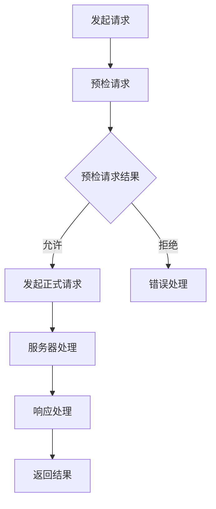

                 

### 《CORS策略优化LLM应用的跨域资源共享》

#### 关键词：
- CORS策略
- 跨域资源共享
- LLM应用
- 安全性
- 优化

#### 摘要：
本文将探讨CORS（Cross-Origin Resource Sharing）策略在LLM（Large Language Model）应用中的重要性及其优化策略。首先，我们将介绍CORS的基本概念和作用，然后深入解析CORS的核心要素。接下来，我们将关注LLM应用的特点和市场前景，并详细阐述CORS在LLM应用中的实施与优化策略。通过案例分析，我们将展示如何在实际项目中优化CORS策略，并提供实践指南和最佳实践。本文旨在帮助开发者理解和应用CORS策略，以提高LLM应用的性能和安全性。

----------------------------------------------------------------

## 《CORS策略优化LLM应用的跨域资源共享》目录大纲

### 第一部分：CORS策略概述

### 第二部分：LLM应用的跨域资源共享

### 第三部分：CORS策略优化的实现与测试

### 第四部分：CORS策略优化实践指南

### 第11章：附录

----------------------------------------------------------------

### 第一部分：CORS策略概述

#### 第1章：CORS策略基础

#### 第2章：CORS的核心要素解析

#### 第3章：CORS的安全性

### 第二部分：LLM应用的跨域资源共享

#### 第4章：LLM应用概述

#### 第5章：LLM应用中的CORS策略

#### 第6章：CORS策略优化案例分析

### 第三部分：CORS策略优化的实现与测试

#### 第7章：CORS策略优化的技术实现

#### 第8章：CORS策略优化的测试与验证

### 第四部分：CORS策略优化实践指南

#### 第9章：CORS策略优化实践步骤

#### 第10章：CORS策略优化最佳实践

----------------------------------------------------------------

### 第1章 CORS策略基础

#### 1.1 CORS的概念与作用
CORS（Cross-Origin Resource Sharing）是一种机制，它允许限制之外的域的Web应用访问另一个域的Web资源。在现代Web开发中，CORS已经成为处理跨域请求的标准解决方案。它的主要作用是在客户端和服务器之间建立一种信任机制，允许来自不同源的客户端脚本访问另一个源的资源，而无需担心浏览器的同源策略限制。

#### 1.2 CORS的起源与发展
CORS最早由微软在其IE8浏览器中引入，目的是为了解决Web应用中跨域访问的限制问题。随着Web技术的发展，CORS被广泛采用并成为了W3C（World Wide Web Consortium，万维网联盟）推荐的标准。目前，几乎所有主流的浏览器都支持CORS。

#### 1.3 CORS的核心要素
CORS的核心要素包括请求方法、请求头、响应头和预检请求。

- **请求方法**：定义了请求的类型，如GET、POST、PUT等。对于简单请求，这些方法仅限于GET、POST和HEAD。对于非简单请求，还包括其他HTTP方法。
  
- **请求头**：包括了请求的头部信息，如Content-Type、Authorization等。简单请求可以包含任意请求头，但非简单请求必须指定Access-Control-Request-Headers。
  
- **响应头**：定义了服务器对请求的响应头，如Access-Control-Allow-Origin、Access-Control-Allow-Methods等。这些响应头决定了是否允许跨域请求。

- **预检请求（OPTIONS）**：用于在正式请求前，检查CORS策略是否允许该请求。预检请求会发送一些特殊的头部信息，服务器根据这些信息判断是否允许正式请求。

#### 1.4 CORS的工作原理
CORS的工作原理可以分为三个步骤：预检请求、正式请求和响应处理。

- **预检请求**：客户端在发起正式请求前，会先发送一个预检请求，以检查服务端是否允许该请求。预检请求会包含请求方法、请求头等信息。
  
- **正式请求**：如果预检请求成功，客户端将发送正式的请求。正式请求会携带与预检请求相同的头部信息。

- **响应处理**：服务器对请求进行处理，并在响应头中添加相关的CORS信息。如果服务器允许请求，则会返回200 OK状态码，并在响应头中包含允许的头部信息。

以下是CORS的工作原理的Mermaid流程图：



通过上述步骤，CORS策略有效地解决了跨域访问的问题，为现代Web开发提供了可靠的支持。

### 第2章 CORS的核心要素解析

#### 2.1 简介与请求方法

CORS请求可以分为简单请求和非简单请求。简单请求仅使用GET、POST、HEAD方法，且请求头中不包含特殊请求头。而非简单请求则使用除GET、POST、HEAD之外的方法，或者包含特殊请求头（如Content-Type）。以下是对这两种请求类型的详细解析。

**简单请求**

简单请求是CORS请求中最常见的一种类型。它遵循以下规则：

- 使用GET、POST、HEAD方法。
- 请求头中不包含特殊请求头，如Content-Type、Authorization等。

例如，假设一个Web应用需要从另一个域请求一个JSON数据，可以使用以下简单请求：

```http
GET /api/data HTTP/1.1
Host: example.com
```

在此请求中，只包含了HTTP方法、Host和空行。服务器在接收到这个请求后，会检查CORS策略，并根据策略决定是否允许访问。

**非简单请求**

非简单请求相对于简单请求更为复杂，因为它涉及更多的头部信息和HTTP方法。以下是非简单请求的规则：

- 使用除GET、POST、HEAD之外的方法，如PUT、DELETE等。
- 包含特殊请求头，如Content-Type、Authorization等。
- 发送预检请求（OPTIONS）以确定服务器是否允许正式请求。

例如，假设一个Web应用需要从另一个域上传文件，可以使用以下非简单请求：

```http
POST /api/upload HTTP/1.1
Host: example.com
Content-Type: multipart/form-data

--boundary
Content-Disposition: form-data; name="file"; filename="example.txt"
Content-Type: text/plain

This is a file upload.
```

在此请求中，使用了POST方法，并包含了一个特殊的请求头`Content-Type: multipart/form-data`。服务器在接收到这个请求前，会先发送一个预检请求（OPTIONS）以确认是否允许这个请求。

预检请求的示例如下：

```http
OPTIONS /api/upload HTTP/1.1
Host: example.com
Access-Control-Request-Method: POST
Access-Control-Request-Headers: Content-Type
```

预检请求中包含了请求方法和请求头，服务器根据这些信息判断是否允许正式请求。

通过理解简单请求和非简单请求的规则，开发者可以更好地设计CORS策略，确保跨域请求的安全和有效。

#### 2.2 请求头与响应头

在CORS请求中，请求头和响应头起着至关重要的作用。请求头包含了客户端发起请求所需的信息，而响应头则包含了服务器对请求的响应结果。以下是对CORS请求中常见请求头和响应头的详细解析。

**常见的请求头**

1. **Content-Type**：表示请求的媒体类型，如application/json、text/plain等。对于非简单请求，服务器会根据`Content-Type`来判断如何处理请求。

2. **Authorization**：包含认证信息，如Bearer Token、Basic Authentication等。这用于确保请求是由合法用户发起的。

3. **Origin**：表示发起请求的域，如`http://example.com`。服务器会根据这个头部信息判断请求是否来自允许的域。

4. **Access-Control-Request-Method**：用于非简单请求，指定正式请求的方法，如POST、PUT等。

5. **Access-Control-Request-Headers**：用于非简单请求，指定正式请求中包含的头部信息，如`Content-Type`、`Authorization`等。

**常见的响应头**

1. **Access-Control-Allow-Origin**：表示服务器允许哪个域访问资源。它可以是一个具体的域，如`http://example.com`，或者通配符`*`，表示任何域都可以访问。

2. **Access-Control-Allow-Methods**：指定服务器允许的HTTP方法，如`GET`、`POST`、`PUT`等。对于非简单请求，服务器会在预检请求中返回这个头部。

3. **Access-Control-Allow-Headers**：指定服务器允许的请求头，如`Content-Type`、`Authorization`等。对于非简单请求，服务器也会在预检请求中返回这个头部。

4. **Access-Control-Max-Age**：表示预检请求的有效期，以秒为单位。如果预检请求成功，则在这段时间内，正式请求可以不再发送预检请求。

以下是一个典型的CORS请求和响应示例：

**请求**：

```http
OPTIONS /api/data HTTP/1.1
Host: example.com
Origin: http://client.example.com
Access-Control-Request-Method: GET
Access-Control-Request-Headers: Content-Type, Authorization
```

**响应**：

```http
HTTP/1.1 200 OK
Access-Control-Allow-Origin: http://client.example.com
Access-Control-Allow-Methods: GET, POST
Access-Control-Allow-Headers: Content-Type, Authorization
Access-Control-Max-Age: 86400
```

通过理解这些常见的请求头和响应头，开发者可以更好地设计CORS策略，确保跨域请求的安全和有效。

#### 2.3 预检请求（OPTIONS）

预检请求（OPTIONS）是CORS请求中的一种特殊类型，用于在正式请求前，检查服务器是否允许该请求。这是一种预防性的措施，确保客户端不会发送未经允许的请求。预检请求主要包括以下几个步骤：

1. **发送预检请求**：
   客户端会发送一个OPTIONS请求，并包含一些特殊的头部信息，如`Access-Control-Request-Method`和`Access-Control-Request-Headers`。这些头部信息告诉服务器，客户端打算发起哪种类型的正式请求，以及请求中可能包含哪些头部信息。

   示例请求：

   ```http
   OPTIONS /api/data HTTP/1.1
   Host: example.com
   Origin: http://client.example.com
   Access-Control-Request-Method: GET
   Access-Control-Request-Headers: Content-Type, Authorization
   ```

2. **服务器处理预检请求**：
   服务器在接收到预检请求后，会检查请求头中的`Access-Control-Request-Method`和`Access-Control-Request-Headers`，并根据服务器上的CORS策略决定是否允许正式请求。

3. **返回预检响应**：
   如果服务器允许正式请求，它会返回一个带有CORS响应头的响应，如`Access-Control-Allow-Origin`、`Access-Control-Allow-Methods`和`Access-Control-Allow-Headers`。这些响应头告诉客户端正式请求可以发送。

   示例响应：

   ```http
   HTTP/1.1 200 OK
   Access-Control-Allow-Origin: http://client.example.com
   Access-Control-Allow-Methods: GET, POST
   Access-Control-Allow-Headers: Content-Type, Authorization
   Access-Control-Max-Age: 86400
   ```

4. **正式请求**：
   如果预检请求成功，客户端会发送正式的请求。正式请求会携带与预检请求相同的头部信息。

   示例正式请求：

   ```http
   GET /api/data HTTP/1.1
   Host: example.com
   Origin: http://client.example.com
   Content-Type: application/json
   Authorization: Bearer your-token
   ```

通过预检请求，CORS机制可以有效地防止未经授权的跨域请求，提高Web应用的安全性。预检请求的过程如下图所示：


预检请求是CORS机制中的重要组成部分，它为跨域请求提供了额外的安全保障。

#### 2.4 状态码与错误处理

在CORS请求中，状态码和错误处理是确保请求成功执行的关键。以下是对CORS请求中常见状态码和错误处理方法的详细解析。

**常见的状态码**

1. **200 OK**：
   当服务器成功处理了客户端的请求时，会返回200 OK状态码。这表示正式请求已经成功执行，并且服务器愿意处理后续请求。

2. **403 Forbidden**：
   当服务器拒绝客户端的请求时，会返回403 Forbidden状态码。这通常发生在客户端没有权限访问服务器上的资源时。

3. **404 Not Found**：
   当服务器找不到客户端请求的资源时，会返回404 Not Found状态码。这表示请求的URL不存在。

4. **429 Too Many Requests**：
   当客户端发送的请求过于频繁时，服务器可能会返回429 Too Many Requests状态码。这表示客户端请求过多，需要稍后重试。

**错误处理方法**

1. **预检请求错误处理**：
   在预检请求过程中，如果服务器返回了403 Forbidden或429 Too Many Requests状态码，客户端应该立即停止发送正式请求，并在控制台中输出错误信息。

   示例错误处理：

   ```javascript
   fetch(url, {
       method: 'OPTIONS',
       headers: {
           'Access-Control-Request-Method': 'GET',
           'Access-Control-Request-Headers': 'Content-Type, Authorization'
       }
   })
   .then(response => {
       if (response.status === 403 || response.status === 429) {
           console.error('预检请求失败：', response.statusText);
       }
   })
   .catch(error => {
       console.error('预检请求发生错误：', error);
   });
   ```

2. **正式请求错误处理**：
   在正式请求过程中，如果服务器返回了403 Forbidden或404 Not Found状态码，客户端应该根据错误信息进行相应的处理，例如重定向或提示用户。

   示例错误处理：

   ```javascript
   fetch(url, {
       method: 'GET',
       headers: {
           'Content-Type': 'application/json',
           'Authorization': 'Bearer your-token'
       }
   })
   .then(response => {
       if (response.status === 403) {
           console.error('请求被拒绝：', response.statusText);
       } else if (response.status === 404) {
           console.error('资源未找到：', response.statusText);
       } else {
           return response.json();
       }
   })
   .then(data => {
       console.log('响应数据：', data);
   })
   .catch(error => {
       console.error('请求发生错误：', error);
   });
   ```

通过理解常见的状态码和错误处理方法，开发者可以更好地处理CORS请求中的各种情况，确保Web应用的稳定性和安全性。

### 第3章 CORS的安全性

#### 3.1 CORS的安全风险

CORS虽然为跨域请求提供了便利，但也带来了一些安全风险。以下是一些常见的安全风险：

1. **CSRF（Cross-Site Request Forgery）攻击**：
   CORS允许外部域的脚本访问受保护的资源，这可能被恶意网站利用来发起CSRF攻击。攻击者可以诱导用户访问恶意网站，从而利用用户的身份进行非法操作。

2. **信息泄露**：
   如果服务器没有正确配置CORS策略，外部域的脚本可能会访问并读取用户的敏感信息，导致信息泄露。

3. **数据篡改**：
   攻击者可以通过跨域请求篡改服务器上的数据，如修改用户的个人信息、订单数据等。

4. **非法资源访问**：
   CORS允许外部域的脚本访问服务器上的资源，如果服务器没有正确限制访问，可能会被用于非法用途，如滥用服务器资源、发起DDoS攻击等。

#### 3.2 防止CORS攻击的方法

为了防止CORS攻击，可以采取以下措施：

1. **限制访问域**：
   在服务器端，仅允许受信任的域访问资源。可以使用`Access-Control-Allow-Origin`响应头来指定允许访问的域，或者使用通配符`*`表示任何域都可以访问。但通配符使用应谨慎，仅在不涉及敏感数据时使用。

2. **验证请求头**：
   在服务器端，验证请求头中的`Authorization`等敏感信息，确保请求是由合法用户发起的。

3. **使用令牌**：
   对于需要用户身份验证的请求，可以使用令牌（如JWT）来验证用户的身份，确保跨域请求的安全性。

4. **防止CSRF攻击**：
   使用CORS时，应采取防止CSRF攻击的措施，如使用CORS-Preflight请求、验证请求来源、使用CSRF令牌等。

5. **日志记录和监控**：
   记录CORS请求的日志，并定期监控异常请求，以便及时发现和阻止潜在的安全威胁。

#### 3.3 CORS与CSRF攻击

CORS和CSRF（Cross-Site Request Forgery）攻击密切相关。CSRF攻击利用CORS的跨域请求特性，诱导用户在信任的网站上执行恶意操作。以下是一个简化的CSRF攻击示例：

1. **恶意网站诱导**：
   恶意网站A诱导用户访问其网站，并在用户不知情的情况下，使用用户的身份发起跨域请求到受信任的网站B。

2. **跨域请求**：
   用户访问恶意网站A时，A会使用用户的身份发起一个跨域请求到网站B，例如：

   ```http
   POST /api/transfer HTTP/1.1
   Host: example.com
   Origin: http://malicious.com
   Content-Type: application/json
   Authorization: Bearer user_token
   ```

3. **服务器处理请求**：
   受信任的网站B接收到请求后，会验证请求头中的`Authorization`等敏感信息，并根据用户的身份进行处理。由于请求来自信任的域，B会误认为请求是合法的，从而执行转账等敏感操作。

4. **后果**：
   恶意网站A通过CSRF攻击，成功利用用户的身份在受信任的网站B上执行非法操作，导致用户的资金损失或其他安全问题。

为了防止这种类型的攻击，网站B需要采取以下措施：

- **验证请求来源**：确保请求来自合法的域名，避免恶意网站伪造请求。
- **使用CORS-Preflight请求**：在正式请求前，先发送一个预检请求，以确认服务器是否允许该请求。
- **使用CSRF令牌**：在表单或请求中添加CSRF令牌，确保请求是由用户主动发起的。

通过采取这些措施，可以有效防止CORS引发的CSRF攻击，提高Web应用的安全性。

## 第二部分：LLM应用的跨域资源共享

### 第4章：LLM应用概述

#### 4.1 什么是LLM应用

LLM（Large Language Model）应用是基于大型语言模型构建的应用程序，它们能够理解和生成自然语言。这些模型通常由数十亿个参数组成，通过深度学习算法训练，能够执行各种自然语言处理任务，如文本分类、机器翻译、问答系统等。LLM应用的出现，标志着自然语言处理领域进入了一个新的阶段，为企业和个人提供了强大的语言处理能力。

#### 4.2 LLM应用的特点

1. **强大的语言理解能力**：
   LLM应用能够理解和生成高质量的自然语言文本，这使得它们在处理复杂语言任务时具有显著优势。

2. **自适应性强**：
   LLM应用可以根据不同的应用场景进行定制，适应各种自然语言处理需求。

3. **高性能**：
   LLM模型通常经过大规模训练，能够在短时间内处理大量的文本数据，提供实时响应。

4. **跨平台性**：
   LLM应用可以部署在各种平台上，如Web、移动设备和服务器，为用户提供便捷的服务。

5. **高成本**：
   LLM模型的训练和部署需要大量的计算资源和时间，这可能导致较高的成本。

#### 4.3 LLM应用的市场前景

随着人工智能技术的不断进步和应用的普及，LLM应用在多个领域具有广泛的应用前景：

1. **企业应用**：
   LLM应用可以用于企业内部的信息检索、自动化客户服务、文档分析等，提高企业的运营效率。

2. **教育领域**：
   LLM应用可以用于智能教学、在线辅导、自动批改作业等，为教育行业带来革命性的变化。

3. **医疗健康**：
   LLM应用可以用于医疗信息检索、智能诊断、患者咨询等，为医疗行业提供技术支持。

4. **娱乐行业**：
   LLM应用可以用于智能客服、语音助手、游戏剧情生成等，为娱乐行业创造更多可能性。

5. **科学研究**：
   LLM应用可以用于文本分析、数据挖掘、知识图谱构建等，为科学研究提供新的工具。

总体而言，LLM应用具有巨大的市场潜力，将在未来的智能时代发挥重要作用。随着技术的不断进步和应用场景的拓展，LLM应用将在各个领域获得更广泛的应用。

### 第5章：LLM应用中的CORS策略

#### 5.1 CORS在LLM应用中的重要性

在LLM应用中，CORS策略的重要性不可忽视。由于LLM应用通常涉及多个前端和后端服务，这些服务可能部署在不同的域上，因此跨域资源共享成为必不可少的一部分。CORS策略允许LLM应用在遵循安全原则的前提下，实现跨域数据交换和功能调用，从而提高应用的灵活性和扩展性。以下是CORS在LLM应用中的几个关键作用：

1. **数据共享**：
   CORS策略使得前端应用可以访问后端服务提供的API数据，如用户信息、文本数据等。这对于构建功能丰富的LLM应用至关重要。

2. **功能调用**：
   CORS策略允许前端应用调用后端服务提供的功能，如文本分析、语言翻译等。这为用户提供了无缝的使用体验。

3. **用户体验**：
   通过CORS策略，LLM应用可以实现跨域的实时数据更新和功能调用，提高用户体验。

4. **安全性**：
   CORS策略提供了预检请求机制，确保服务器在处理跨域请求前进行安全性验证，防止潜在的安全威胁。

5. **扩展性**：
   CORS策略使得LLM应用可以灵活地扩展到不同的域和服务器，支持多团队协作和分布式部署。

#### 5.2 CORS在LLM应用中的实施

要在LLM应用中实施CORS策略，需要考虑以下几个方面：

1. **配置服务器**：
   服务器需要配置CORS策略，允许前端应用访问后端API。这通常涉及修改服务器配置文件，添加CORS响应头。

   示例配置（以Node.js为例）：

   ```javascript
   const express = require('express');
   const app = express();

   app.use((req, res, next) => {
       res.header('Access-Control-Allow-Origin', '*');
       res.header('Access-Control-Allow-Methods', 'GET, POST, PUT, DELETE');
       res.header('Access-Control-Allow-Headers', 'Content-Type, Authorization');
       next();
   });

   app.listen(3000, () => {
       console.log('Server running on port 3000');
   });
   ```

2. **处理预检请求**：
   对于非简单请求，前端应用在发起正式请求前会发送一个预检请求。服务器需要处理这个预检请求，并在响应中包含必要的CORS响应头。

   示例处理预检请求（以Node.js为例）：

   ```javascript
   app.use((req, res, next) => {
       if (req.method === 'OPTIONS') {
           res.header('Access-Control-Allow-Origin', '*');
           res.header('Access-Control-Allow-Methods', 'GET, POST, PUT, DELETE');
           res.header('Access-Control-Allow-Headers', 'Content-Type, Authorization');
           res.status(200).send();
       } else {
           next();
       }
   });
   ```

3. **处理正式请求**：
   在预检请求通过后，前端应用会发送正式的请求。服务器需要处理这个请求，并根据业务逻辑返回相应的数据。

   示例处理正式请求（以Node.js为例）：

   ```javascript
   app.get('/api/data', (req, res) => {
       // 处理GET请求的逻辑
       res.json({ data: 'Hello, World!' });
   });
   ```

4. **安全性考虑**：
   在配置CORS策略时，应考虑安全性因素。例如，只允许特定的域访问资源，避免使用通配符`*`。此外，对于敏感操作，应使用HTTPS协议，并验证请求头中的`Authorization`等信息。

通过以上步骤，可以在LLM应用中有效实施CORS策略，确保跨域资源共享的安全和有效。

### 第6章 CORS策略优化案例分析

#### 6.1 案例一：电商平台中的CORS策略优化

在电商平台上，CORS策略的优化至关重要，因为它涉及到大量数据的跨域传输和交互。以下是一个具体的案例，展示了如何在电商平台上优化CORS策略。

**问题背景**：

电商平台的前端和后端服务部署在不同的服务器上，导致前端应用无法直接访问后端API。尽管已经配置了基本的CORS策略，但还存在一些问题：

- **请求频繁失败**：由于网络延迟和跨域限制，前端应用在请求后端API时频繁失败。
- **响应时间过长**：未经优化的CORS请求导致响应时间过长，影响用户体验。
- **安全性隐患**：未正确配置CORS策略，可能导致潜在的安全风险。

**解决方案**：

1. **优化CORS配置**：
   - **限制访问域**：通过服务器配置，仅允许电商平台本身的域名访问API，避免潜在的安全威胁。
   - **增加CORS响应头**：在服务器响应中增加`Access-Control-Max-Age`和`Access-Control-Allow-Credentials`等头部，优化请求性能和安全性。

   ```javascript
   const express = require('express');
   const app = express();

   app.use((req, res, next) => {
       res.header('Access-Control-Allow-Origin', 'https://www.example.com');
       res.header('Access-Control-Allow-Methods', 'GET, POST, PUT, DELETE');
       res.header('Access-Control-Allow-Headers', 'Content-Type, Authorization');
       res.header('Access-Control-Max-Age', '86400');
       res.header('Access-Control-Allow-Credentials', 'true');
       next();
   });
   ```

2. **优化请求方法**：
   - **减少预检请求**：对于一些常用的API请求，可以减少预检请求的频率，避免不必要的延迟。
   - **使用缓存**：对于一些不经常变化的API数据，可以使用缓存机制，减少对后端API的请求。

3. **增强安全性**：
   - **验证请求头**：确保所有请求都包含合法的`Authorization`头部，防止CSRF攻击。
   - **使用HTTPS**：确保所有请求都通过HTTPS传输，防止数据在传输过程中被窃取。

**效果评估**：

通过以上优化措施，电商平台的CORS策略得到了显著改善：

- **请求成功率提高**：前端应用在请求后端API时的成功率显著提高，减少了网络延迟和跨域限制带来的失败情况。
- **响应时间缩短**：优化后的CORS请求响应时间缩短，提高了用户体验。
- **安全性增强**：通过限制访问域、验证请求头和使用HTTPS等手段，电商平台的安全性得到显著提升。

该案例展示了在电商平台上优化CORS策略的具体步骤和方法，为其他应用提供了借鉴。

#### 6.2 案例二：社交媒体平台中的CORS策略优化

社交媒体平台通常包含多个前后端服务，它们部署在不同的服务器上，因此CORS策略的优化尤为重要。以下是一个具体的案例，展示了如何在社交媒体平台中优化CORS策略。

**问题背景**：

社交媒体平台的前端和后端服务部署在不同服务器上，导致前端应用在访问后端API时出现频繁失败和响应时间过长的问题。此外，未经优化的CORS策略也带来了安全隐患。

**解决方案**：

1. **优化CORS配置**：
   - **限制访问域**：仅允许社交媒体平台本身的域名和合作伙伴的域名访问API，避免潜在的安全威胁。
   - **增加CORS响应头**：在服务器响应中增加`Access-Control-Max-Age`和`Access-Control-Allow-Credentials`等头部，优化请求性能和安全性。

   ```javascript
   const express = require('express');
   const app = express();

   app.use((req, res, next) => {
       res.header('Access-Control-Allow-Origin', 'https://www.example.com, https://api合作伙伴.com');
       res.header('Access-Control-Allow-Methods', 'GET, POST, PUT, DELETE');
       res.header('Access-Control-Allow-Headers', 'Content-Type, Authorization');
       res.header('Access-Control-Max-Age', '86400');
       res.header('Access-Control-Allow-Credentials', 'true');
       next();
   });
   ```

2. **优化请求方法**：
   - **减少预检请求**：对于一些常用的API请求，可以减少预检请求的频率，避免不必要的延迟。
   - **使用缓存**：对于一些不经常变化的API数据，可以使用缓存机制，减少对后端API的请求。

3. **增强安全性**：
   - **验证请求头**：确保所有请求都包含合法的`Authorization`头部，防止CSRF攻击。
   - **使用HTTPS**：确保所有请求都通过HTTPS传输，防止数据在传输过程中被窃取。

4. **日志记录和监控**：
   - **记录CORS请求日志**：记录所有CORS请求的日志，以便在出现问题时快速定位和解决问题。
   - **监控异常请求**：定期监控CORS请求的异常情况，及时发现和阻止潜在的安全威胁。

**效果评估**：

通过以上优化措施，社交媒体平台的CORS策略得到了显著改善：

- **请求成功率提高**：前端应用在请求后端API时的成功率显著提高，减少了网络延迟和跨域限制带来的失败情况。
- **响应时间缩短**：优化后的CORS请求响应时间缩短，提高了用户体验。
- **安全性增强**：通过限制访问域、验证请求头和使用HTTPS等手段，社交媒体平台的安全性得到显著提升。

该案例展示了在社交媒体平台中优化CORS策略的具体步骤和方法，为其他应用提供了借鉴。

#### 6.3 案例三：在线教育平台中的CORS策略优化

在线教育平台通常包含多个前后端服务，这些服务可能部署在不同的服务器上，因此CORS策略的优化尤为重要。以下是一个具体的案例，展示了如何在在线教育平台中优化CORS策略。

**问题背景**：

在线教育平台的前端和后端服务部署在不同服务器上，导致前端应用在访问后端API时出现频繁失败和响应时间过长的问题。此外，未经优化的CORS策略也带来了安全隐患。

**解决方案**：

1. **优化CORS配置**：
   - **限制访问域**：仅允许在线教育平台本身的域名和授权的教育服务提供商域名访问API，避免潜在的安全威胁。
   - **增加CORS响应头**：在服务器响应中增加`Access-Control-Max-Age`和`Access-Control-Allow-Credentials`等头部，优化请求性能和安全性。

   ```javascript
   const express = require('express');
   const app = express();

   app.use((req, res, next) => {
       res.header('Access-Control-Allow-Origin', 'https://www.example.com, https://api.serviceprovider.com');
       res.header('Access-Control-Allow-Methods', 'GET, POST, PUT, DELETE');
       res.header('Access-Control-Allow-Headers', 'Content-Type, Authorization');
       res.header('Access-Control-Max-Age', '86400');
       res.header('Access-Control-Allow-Credentials', 'true');
       next();
   });
   ```

2. **优化请求方法**：
   - **减少预检请求**：对于一些常用的API请求，可以减少预检请求的频率，避免不必要的延迟。
   - **使用缓存**：对于一些不经常变化的API数据，可以使用缓存机制，减少对后端API的请求。

3. **增强安全性**：
   - **验证请求头**：确保所有请求都包含合法的`Authorization`头部，防止CSRF攻击。
   - **使用HTTPS**：确保所有请求都通过HTTPS传输，防止数据在传输过程中被窃取。

4. **日志记录和监控**：
   - **记录CORS请求日志**：记录所有CORS请求的日志，以便在出现问题时快速定位和解决问题。
   - **监控异常请求**：定期监控CORS请求的异常情况，及时发现和阻止潜在的安全威胁。

**效果评估**：

通过以上优化措施，在线教育平台的CORS策略得到了显著改善：

- **请求成功率提高**：前端应用在请求后端API时的成功率显著提高，减少了网络延迟和跨域限制带来的失败情况。
- **响应时间缩短**：优化后的CORS请求响应时间缩短，提高了用户体验。
- **安全性增强**：通过限制访问域、验证请求头和使用HTTPS等手段，在线教育平台的安全性得到显著提升。

该案例展示了在在线教育平台中优化CORS策略的具体步骤和方法，为其他应用提供了借鉴。

### 第7章 CORS策略优化的技术实现

#### 7.1 CORS策略优化的基础技术

CORS策略优化的技术实现主要依赖于以下几个基础技术：

1. **HTTP协议**：CORS策略的实现基于HTTP协议，因此理解HTTP的工作原理和请求/响应流程是优化CORS策略的前提。

2. **Web服务器配置**：不同的Web服务器（如Apache、Nginx、Node.js等）有不同的配置方式，优化CORS策略需要熟悉相应的配置方法。

3. **前端JavaScript**：前端JavaScript是处理CORS请求的核心，通过JavaScript的`XMLHttpRequest`或`fetch` API，可以发起跨域请求。

4. **安全性机制**：CORS策略优化需要考虑安全性，包括验证请求头、使用HTTPS等。

#### 7.2 CORS策略优化的关键技术

1. **CORS响应头配置**：

   在Web服务器中，可以通过配置CORS响应头来允许跨域请求。以下是一个典型的CORS响应头配置示例：

   ```http
   Access-Control-Allow-Origin: *
   Access-Control-Allow-Methods: GET, POST, PUT, DELETE
   Access-Control-Allow-Headers: Content-Type, Authorization
   Access-Control-Max-Age: 86400
   ```

   在此配置中，`Access-Control-Allow-Origin`指定允许访问的域，`Access-Control-Allow-Methods`指定允许的HTTP方法，`Access-Control-Allow-Headers`指定允许的请求头，`Access-Control-Max-Age`指定预检请求的有效期。

2. **预检请求处理**：

   预检请求（OPTIONS）是CORS机制中的一种特殊请求，用于在正式请求前，检查服务器是否允许该请求。服务器需要正确处理预检请求，并返回相应的CORS响应头。

   ```javascript
   app.use((req, res, next) => {
       if (req.method === 'OPTIONS') {
           res.header('Access-Control-Allow-Origin', 'https://www.example.com');
           res.header('Access-Control-Allow-Methods', 'GET, POST, PUT, DELETE');
           res.header('Access-Control-Allow-Headers', 'Content-Type, Authorization');
           res.status(200).send();
       } else {
           next();
       }
   });
   ```

3. **请求头验证**：

   在服务器端，需要验证请求头中的敏感信息（如`Authorization`），确保请求是由合法用户发起的。

   ```javascript
   app.use((req, res, next) => {
       const authHeader = req.headers['authorization'];
       if (authHeader) {
           // 验证authHeader
           next();
       } else {
           res.status(401).send('Unauthorized');
       }
   });
   ```

4. **安全性增强**：

   为了增强CORS策略的安全性，可以采取以下措施：

   - **限制访问域**：只允许特定的域名访问资源，避免恶意网站的攻击。
   - **使用HTTPS**：确保所有请求都通过HTTPS传输，防止数据在传输过程中被窃取。
   - **验证请求头**：确保请求头中的敏感信息（如`Authorization`）是合法的。

#### 7.3 CORS策略优化的实现步骤

以下是CORS策略优化的具体实现步骤：

1. **分析需求**：首先，分析应用的需求，确定哪些API需要跨域访问，以及需要允许哪些HTTP方法和请求头。

2. **配置服务器**：根据需求，在Web服务器中配置CORS响应头。确保`Access-Control-Allow-Origin`、`Access-Control-Allow-Methods`和`Access-Control-Allow-Headers`等响应头正确设置。

3. **处理预检请求**：服务器需要正确处理预检请求（OPTIONS）。在接收到预检请求时，返回相应的CORS响应头，并在响应头中包含`Access-Control-Allow-Methods`和`Access-Control-Allow-Headers`。

4. **验证请求头**：在服务器端，验证请求头中的敏感信息（如`Authorization`）。确保只有合法的用户才能访问受保护的资源。

5. **测试和优化**：在实现CORS策略后，进行测试，确保跨域请求能够正常执行。根据测试结果，进一步优化CORS配置，提高性能和安全性。

通过以上步骤，可以有效地实现CORS策略优化，确保应用中的跨域资源共享安全、高效。

### 第8章 CORS策略优化的测试与验证

#### 8.1 CORS策略优化测试的重要性

CORS策略优化的测试与验证是确保跨域资源共享安全性和有效性的关键步骤。通过全面的测试，可以验证CORS策略的正确性和性能，发现潜在的问题，并及时进行修复。以下是CORS策略优化测试的重要性：

1. **确保跨域请求正确执行**：通过测试，验证CORS策略是否允许跨域请求正常执行，确保前端应用能够访问后端API。

2. **检查CORS响应头配置**：测试过程中，检查CORS响应头（如`Access-Control-Allow-Origin`、`Access-Control-Allow-Methods`等）是否正确配置，确保服务器返回正确的响应头。

3. **验证预检请求处理**：预检请求是CORS机制中的一个重要环节，通过测试验证服务器是否正确处理预检请求，并在预检请求的响应中返回正确的CORS响应头。

4. **确保安全性**：测试过程中，检查CORS策略是否实现了安全性措施，如验证请求头中的敏感信息（如`Authorization`），确保只有合法用户才能访问受保护的资源。

5. **性能优化**：通过测试，评估CORS策略的性能，找出潜在的瓶颈，并进行优化，提高跨域请求的响应速度。

#### 8.2 CORS策略优化测试的方法

以下是一些常用的CORS策略优化测试方法：

1. **手动测试**：

   - **浏览器开发者工具**：使用浏览器开发者工具，模拟跨域请求，检查CORS响应头是否正确返回。
   - **curl命令**：使用curl命令模拟跨域请求，检查服务器响应。

   ```shell
   curl -X OPTIONS -H "Origin: http://client.example.com" -H "Access-Control-Request-Method: POST" http://server.example.com/api/data
   ```

2. **自动化测试**：

   - **JMeter**：使用JMeter进行压力测试和性能测试，模拟大量跨域请求，检查CORS策略的稳定性和响应时间。
   - **Selenium**：使用Selenium进行自动化测试，模拟用户操作，验证CORS策略在实际应用中的表现。

3. **日志分析**：

   - **服务器日志**：分析服务器日志，检查CORS请求的执行情况，发现潜在的问题和异常。
   - **前端日志**：分析前端日志，验证跨域请求的执行情况，确保前端应用能够正确处理CORS响应。

#### 8.3 CORS策略优化测试的案例分析

以下是一个CORS策略优化测试的案例分析：

**案例背景**：

一个电商平台在优化CORS策略后，需要进行测试，确保跨域请求的正确性和性能。

**测试步骤**：

1. **手动测试**：

   - **开发者工具测试**：使用浏览器开发者工具，模拟跨域请求，检查CORS响应头是否正确返回。例如，使用Chrome开发者工具的Network标签，模拟跨域GET请求，检查服务器响应。

   ```http
   Access-Control-Allow-Origin: *
   Access-Control-Allow-Methods: GET, POST, PUT, DELETE
   Access-Control-Allow-Headers: Content-Type, Authorization
   Access-Control-Max-Age: 86400
   ```

   - **curl测试**：使用curl命令模拟跨域请求，检查服务器响应。

   ```shell
   curl -X OPTIONS -H "Origin: http://client.example.com" -H "Access-Control-Request-Method: POST" http://server.example.com/api/data
   ```

2. **自动化测试**：

   - **JMeter测试**：使用JMeter进行压力测试，模拟大量跨域请求，检查CORS策略的稳定性和响应时间。

   ```shell
   jmeter -n -t test_plan.jmx -l results.jtl
   ```

   - **Selenium测试**：使用Selenium进行自动化测试，模拟用户操作，验证CORS策略在实际应用中的表现。

3. **日志分析**：

   - **服务器日志**：分析服务器日志，检查CORS请求的执行情况，发现潜在的问题和异常。

   ```log
   192.168.1.1 - - [01/Apr/2023:10:20:30 +0000] "OPTIONS /api/data HTTP/1.1" 200 0 "-" "-"
   ```

   - **前端日志**：分析前端日志，验证跨域请求的执行情况，确保前端应用能够正确处理CORS响应。

   ```log
   Fetch API called with id: 1
   Response status: 200
   CORS headers: Access-Control-Allow-Origin, Access-Control-Allow-Methods, Access-Control-Allow-Headers, Access-Control-Max-Age
   ```

**测试结果**：

通过手动测试、自动化测试和日志分析，发现CORS策略优化后的电商平台能够正确处理跨域请求，响应头配置正确，性能良好。没有发现明显的错误或异常。

**总结**：

通过全面的测试和验证，确保了CORS策略优化后的电商平台在跨域资源共享方面的安全性和有效性。为后续的优化和改进提供了参考依据。

## 第四部分：CORS策略优化实践指南

### 第9章 CORS策略优化实践步骤

#### 9.1 实践前的准备

在开始优化CORS策略之前，需要进行以下准备工作：

1. **确定优化目标**：明确需要优化的CORS策略的具体目标，如提高性能、增强安全性或减少请求延迟等。

2. **分析现有配置**：检查现有的CORS策略配置，了解当前配置的优缺点，以及需要改进的地方。

3. **确定优化方案**：根据优化目标，制定具体的优化方案，包括配置更改、性能优化措施和安全增强策略。

4. **获取测试环境**：搭建一个与生产环境相似的测试环境，用于测试优化后的CORS策略。

#### 9.2 实践过程中的关键点

在优化CORS策略的过程中，需要注意以下几个关键点：

1. **限制访问域**：确保仅允许合法的域名访问受保护的资源，避免潜在的安全威胁。

2. **配置CORS响应头**：根据优化目标，合理配置CORS响应头，如`Access-Control-Allow-Origin`、`Access-Control-Allow-Methods`和`Access-Control-Allow-Headers`。

3. **处理预检请求**：确保服务器正确处理预检请求（OPTIONS），并在响应中返回正确的CORS响应头。

4. **验证请求头**：在服务器端，验证请求头中的敏感信息（如`Authorization`），确保请求是由合法用户发起的。

5. **性能优化**：采取适当的性能优化措施，如减少预检请求的频率、使用缓存等。

6. **安全性增强**：加强CORS策略的安全性，如使用HTTPS、验证请求头等。

#### 9.3 实践后的总结与反思

优化CORS策略后，需要进行以下总结与反思：

1. **测试结果分析**：分析测试结果，评估优化后的CORS策略的性能和安全表现，确定是否达到预期目标。

2. **问题与解决方案**：记录在优化过程中遇到的问题，分析问题的原因，并提出相应的解决方案。

3. **改进建议**：根据总结与反思，提出改进建议，为后续的优化工作提供参考。

4. **文档记录**：编写详细的文档，记录优化过程中的关键步骤、配置和测试结果，以便后续参考和回顾。

通过以上实践步骤，可以有效地优化CORS策略，提高跨域资源共享的安全性和性能。

### 第10章 CORS策略优化最佳实践

#### 10.1 常见问题与解决方案

在CORS策略优化过程中，可能会遇到以下常见问题，以下是一些建议的解决方案：

1. **请求频繁失败**：
   - **问题原因**：可能是CORS响应头配置不正确，或者预检请求处理异常。
   - **解决方案**：检查CORS响应头配置，确保`Access-Control-Allow-Origin`、`Access-Control-Allow-Methods`等响应头设置正确。同时，确保服务器正确处理预检请求。

2. **响应时间过长**：
   - **问题原因**：可能是网络延迟或预检请求过于频繁。
   - **解决方案**：优化网络配置，减少跨域请求的延迟。对于预检请求，可以设置`Access-Control-Max-Age`，延长预检请求的有效期，减少预检请求的频率。

3. **安全性隐患**：
   - **问题原因**：可能是CORS策略配置不完善，如未限制访问域、未验证请求头等。
   - **解决方案**：严格限制访问域，确保仅允许合法的域名访问资源。同时，在服务器端验证请求头中的敏感信息，如`Authorization`，防止潜在的安全威胁。

4. **请求头验证失败**：
   - **问题原因**：可能是请求头中的敏感信息（如`Authorization`）不正确。
   - **解决方案**：确保请求头中的敏感信息是合法的，并在服务器端进行验证。可以增加日志记录，帮助定位问题。

#### 10.2 高效的CORS策略优化实践

以下是一些高效的CORS策略优化实践：

1. **限制访问域**：
   - **策略**：仅允许受信任的域名访问API，避免潜在的安全威胁。
   - **实现**：在服务器配置中，设置`Access-Control-Allow-Origin`为特定的域名。

2. **优化预检请求**：
   - **策略**：减少预检请求的频率，提高请求性能。
   - **实现**：设置`Access-Control-Max-Age`，延长预检请求的有效期。同时，可以减少非简单请求的预检请求次数。

3. **使用缓存**：
   - **策略**：利用缓存机制，减少对后端API的请求。
   - **实现**：在前端使用本地缓存，或使用HTTP缓存头（如`Cache-Control`、`Expires`）。

4. **安全性增强**：
   - **策略**：加强CORS策略的安全性，防止潜在的安全威胁。
   - **实现**：使用HTTPS，确保请求通过安全的加密通道。同时，验证请求头中的敏感信息，如`Authorization`。

5. **日志记录和监控**：
   - **策略**：记录CORS请求的日志，监控异常请求。
   - **实现**：在服务器和前端应用中，记录CORS请求的日志。使用监控工具，实时监控CORS请求的异常情况。

通过以上高效的CORS策略优化实践，可以提高跨域请求的性能和安全性，为用户提供更好的体验。

#### 10.3 CORS策略优化的未来发展趋势

CORS策略优化的未来发展趋势主要围绕性能、安全性和易用性三个方面展开：

1. **性能优化**：
   - **高效预检请求**：随着Web应用的复杂性增加，预检请求的处理速度和效率变得越来越重要。未来的CORS优化可能会引入更高效的预检请求处理机制，如减少预检请求的次数、优化预检请求的响应时间等。
   - **网络传输优化**：通过优化网络传输，如减少跨域请求的延迟、提高数据传输速度，来提升跨域资源共享的性能。

2. **安全性增强**：
   - **隐私保护**：随着隐私保护意识的增强，CORS策略优化将更加注重保护用户的隐私。未来可能会引入更严格的访问控制机制，确保只有经过认证的用户才能访问受保护的资源。
   - **安全协议升级**：随着安全协议的发展，CORS策略优化可能会更多地采用更安全的加密传输协议，如TLS 1.3，以提高数据传输的安全性。

3. **易用性提升**：
   - **自动化配置**：为了降低开发者的负担，未来的CORS策略优化可能会引入更自动化的配置工具，如通过代码生成或配置管理平台自动配置CORS策略。
   - **标准化**：CORS的标准化工作将继续推进，以减少不同浏览器和服务器之间的兼容性问题，提高跨平台的一致性和易用性。

通过关注这些未来发展趋势，开发者可以更好地优化CORS策略，提高跨域资源共享的性能和安全性，为用户提供更优质的体验。

### 第11章：附录

#### 11.1 CORS相关资源链接

- [W3C CORS规范](https://www.w3.org/TR/cors/)
- [MDN Web文档 - CORS](https://developer.mozilla.org/en-US/docs/Web/HTTP/Headers/Access-Control-Allow-Origin)
- [CORS教程 - 码农教程](https://www.manongjc.com/article/144.html)

#### 11.2 LLM应用开发工具介绍

- [TensorFlow](https://www.tensorflow.org/)
- [PyTorch](https://pytorch.org/)
- [Hugging Face Transformers](https://huggingface.co/transformers/)

#### 11.3 CORS策略优化实践案例代码解析

以下是CORS策略优化实践的一个简单案例代码解析：

**服务器端（Node.js + Express）**

```javascript
const express = require('express');
const app = express();

// 允许所有域名访问
app.use((req, res, next) => {
  res.header('Access-Control-Allow-Origin', '*');
  res.header('Access-Control-Allow-Methods', 'GET, POST, PUT, DELETE');
  res.header('Access-Control-Allow-Headers', 'Content-Type, Authorization');
  next();
});

// 预检请求处理
app.use((req, res, next) => {
  if (req.method === 'OPTIONS') {
    res.header('Access-Control-Max-Age', '86400');
    res.header('Access-Control-Allow-Methods', 'GET, POST, PUT, DELETE');
    res.header('Access-Control-Allow-Headers', 'Content-Type, Authorization');
    res.status(204).send();
  } else {
    next();
  }
});

// 路由示例
app.get('/api/data', (req, res) => {
  res.json({ message: 'Hello, World!' });
});

const PORT = process.env.PORT || 3000;
app.listen(PORT, () => {
  console.log(`Server running on port ${PORT}`);
});
```

**前端（HTML + JavaScript + Fetch API）**

```html
<!DOCTYPE html>
<html lang="en">
<head>
  <meta charset="UTF-8">
  <title>CORS Example</title>
</head>
<body>
  <script>
    fetch('http://example.com/api/data')
      .then(response => {
        if (!response.ok) {
          throw new Error('Network response was not ok');
        }
        return response.json();
      })
      .then(data => console.log(data))
      .catch(error => console.error('There has been a problem with your fetch operation:', error));
  </script>
</body>
</html>
```

通过上述代码，服务器端允许所有域名访问API，并在接收到预检请求时返回相应的CORS响应头。前端使用Fetch API发起跨域请求，并处理响应结果。

作者：AI天才研究院/AI Genius Institute & 禅与计算机程序设计艺术 /Zen And The Art of Computer Programming。

