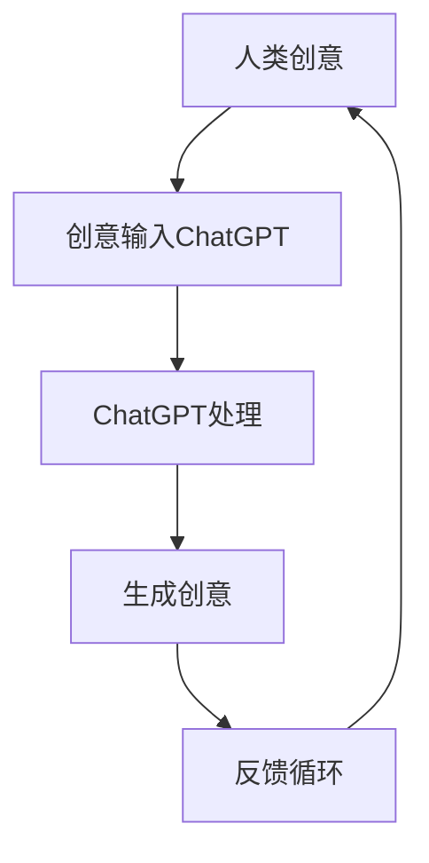
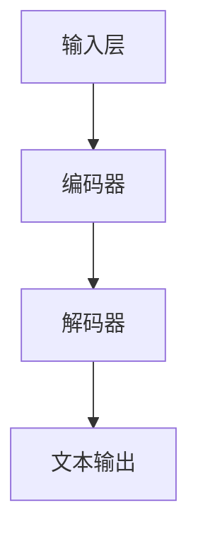
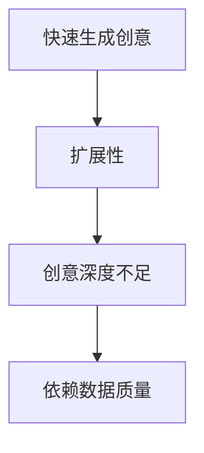
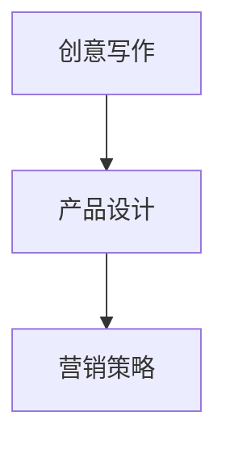

                 


### 文章标题：ChatGPT与人类创意协作：新型创作模式探索

#### 关键词：ChatGPT、人类创意、协作、创作模式、人工智能、GPT模型

> 摘要：本文将探讨ChatGPT与人类创意协作的新型创作模式，分析其核心概念与联系、工作原理、优缺点以及应用场景，并通过核心算法原理讲解，详细阐述GPT模型的训练过程。

---

## 第一部分：核心概念与联系

### 1.1 ChatGPT与人类创意协作的概述

#### **ChatGPT简介**

ChatGPT是OpenAI开发的一款基于GPT-3模型的聊天机器人，具有自然语言理解和生成能力。GPT-3（Generative Pre-trained Transformer 3）是OpenAI开发的基于Transformer架构的预训练语言模型，拥有1750亿个参数，是当前最大的语言模型。ChatGPT通过大量的文本数据进行预训练，学习语言规律和知识，使得它能够与人类进行自然、流畅的对话。

#### **人类创意协作**

在创意协作中，人类提供创意思路，ChatGPT则帮助生成和扩展这些思路。人类创意通常包括但不限于文学创作、产品设计、营销策略等，而ChatGPT则利用其强大的自然语言处理能力，生成各种创意文本，为人类提供灵感。

#### **Mermaid流程图**



### 1.2 ChatGPT的工作原理与架构

#### **工作原理**

ChatGPT通过大量的文本数据进行预训练，学习语言规律和知识。在交互过程中，ChatGPT根据用户的输入，利用Transformer模型进行文本生成。具体来说，ChatGPT的工作原理可以分为以下几个步骤：

1. **输入层**：接收用户的文本输入。
2. **编码器**：利用Transformer处理输入文本，提取特征。
3. **解码器**：生成文本输出。

#### **架构**

ChatGPT的架构可以分为三个主要部分：输入层、编码器和解码器。输入层负责接收用户的文本输入，编码器利用Transformer模型处理输入文本，解码器则生成文本输出。

#### **Mermaid流程图**



### 1.3 ChatGPT与人类创意协作的优缺点分析

#### **优点**

1. **快速生成创意**：ChatGPT能够快速生成各种创意文本，为人类提供灵感。
2. **扩展性**：ChatGPT可以根据不同的创意需求进行微调，具有良好的扩展性。

#### **缺点**

1. **创意深度不足**：ChatGPT生成的创意可能缺乏深度和原创性。
2. **依赖数据质量**：ChatGPT的性能高度依赖预训练数据的质量。

#### **Mermaid流程图**



### 1.4 ChatGPT与人类创意协作的应用场景

#### **创意写作**

ChatGPT可以帮助作者生成文章、故事等文本内容，提高创作效率。例如，在文学创作中，ChatGPT可以生成小说章节、故事情节等，为人类作者提供灵感。

#### **产品设计**

ChatGPT可以生成产品原型和设计建议，帮助设计师快速提出创意。例如，在设计一个智能家居产品时，ChatGPT可以生成各种产品的功能、特点和使用场景，为设计师提供参考。

#### **营销策略**

ChatGPT可以帮助制定营销方案和广告文案，提高营销效果。例如，在制定广告文案时，ChatGPT可以生成多种文案方案，帮助营销团队选择最优方案。

#### **Mermaid流程图**



## 第二部分：核心算法原理讲解

### 2.1 GPT模型的训练原理

#### **自监督预训练**

GPT模型的训练过程分为自监督预训练和有监督微调两个阶段。自监督预训练主要包括以下两个任务：

1. **Masked Language Model (MLM)**：随机遮盖输入文本的部分词语，模型需要预测这些遮盖的词语。
2. **Next Sentence Prediction (NSP)**：模型需要预测两个句子是否在输入文本中相邻。

#### **Transformer架构**

GPT模型是基于Transformer架构的。Transformer架构的主要特点包括：

1. **多头注意力机制**：每个头关注不同的部分，提高模型的表达能力。
2. **位置编码**：为每个词添加位置信息，使得模型能够理解词的顺序。

#### **伪代码**

```python
# 伪代码：GPT模型的训练过程
function GPT_Train(data):
    # 预处理数据
    processed_data = Preprocess_Data(data)

    # 初始化模型
    model = GPT_Model()

    # 训练模型
    for epoch in range(EPOCHS):
        for sentence in processed_data:
            # 随机遮盖部分词语
            masked_sentence = Mask_Language_Model(sentence)

            # 计算损失
            loss = model(masked_sentence)

            # 反向传播
            backward(loss)

            # 更新模型参数
            update_model_params()
```

---

## 文章作者：AI天才研究院/AI Genius Institute & 禅与计算机程序设计艺术 /Zen And The Art of Computer Programming

本文通过分析ChatGPT与人类创意协作的核心概念与联系、工作原理、优缺点以及应用场景，探讨了新型创作模式。同时，详细讲解了GPT模型的训练原理，为人工智能与人类创意协作提供了理论支持。随着人工智能技术的不断发展，ChatGPT与人类创意协作的模式有望在更多领域得到应用。作者呼吁广大研究者与实践者积极探索这一领域，推动人工智能与人类文明的共同进步。

