                 

### 文章标题

# ChatGPT创意写作：思维链prompt的妙用

### 关键词

- ChatGPT
- 创意写作
- 思维链
- Prompt设计
- 自然语言处理

### 摘要

本文将探讨如何利用ChatGPT进行创意写作，特别是如何通过思维链和prompt设计来提升创作效果。我们将首先介绍ChatGPT的基本概念和原理，然后深入探讨其在创意写作中的应用，包括小说创作、剧本创作、广告创意和内容营销等。同时，本文还将分析ChatGPT在创意写作中的局限性和未来发展趋势。

### 目录大纲

## 第一部分: ChatGPT与创意写作基础

### 第1章: ChatGPT与创意写作概述

#### 1.1.1 ChatGPT的基本概念与原理

#### 1.1.2 创意写作的定义与价值

#### 1.1.3 ChatGPT在创意写作中的应用场景

### 第2章: ChatGPT技术基础

#### 2.1.1 自然语言处理与深度学习

#### 2.1.2 语言模型的基本原理

#### 2.1.3 ChatGPT模型的架构

### 第3章: 创意写作思维链与prompt设计

#### 3.1.1 创意写作思维链的概念

#### 3.1.2 提出prompt的方法与技巧

#### 3.1.3 优化prompt以提高创意输出质量

## 第二部分: ChatGPT在创意写作中的实践应用

### 第4章: ChatGPT在小说创作中的应用

#### 4.1.1 小说创作中的prompt设计

#### 4.1.2 小说情节与角色的生成

#### 4.1.3 小说创作实战案例

### 第5章: ChatGPT在剧本创作中的应用

#### 5.1.1 剧本创作中的prompt设计

#### 5.1.2 剧本结构与对话生成

#### 5.1.3 剧本创作实战案例

### 第6章: ChatGPT在广告创意中的应用

#### 6.1.1 广告创意中的prompt设计

#### 6.1.2 广告文案与创意素材生成

#### 6.1.3 广告创意实战案例

### 第7章: ChatGPT在内容营销中的应用

#### 7.1.1 内容营销中的prompt设计

#### 7.1.2 文章结构与内容生成

#### 7.1.3 内容营销实战案例

### 第8章: ChatGPT在创意写作中的挑战与未来

#### 8.1.1 ChatGPT在创意写作中的局限性

#### 8.1.2 人机协作与创意写作

#### 8.1.3 创意写作的未来趋势与展望

## 附录

### 附录A: ChatGPT创意写作工具与资源

#### A.1 ChatGPT开发环境搭建

#### A.2 ChatGPT模型训练与优化

#### A.3 ChatGPT应用案例汇总

### 文章正文部分将在接下来的章节中进行详细阐述。让我们一步步分析推理，深入探讨ChatGPT在创意写作中的妙用。<!-- 下一步：撰写第一部分第1章内容 --> ### 第一部分: ChatGPT与创意写作基础

## 第1章: ChatGPT与创意写作概述

### 1.1.1 ChatGPT的基本概念与原理

ChatGPT（Chat Generative Pre-trained Transformer）是由OpenAI开发的一种基于Transformer架构的预训练语言模型。它通过大量的文本数据进行训练，学会了理解和使用自然语言。ChatGPT的核心在于其预训练过程，这一过程使得模型具备了处理各种语言任务的能力，包括文本生成、回答问题、翻译、文本摘要等。

#### 背景介绍

ChatGPT是基于GPT-3（Generative Pre-trained Transformer 3）模型的改进版。GPT-3是OpenAI在2020年推出的一种强大的语言处理模型，具有非常高的文本生成能力。ChatGPT则进一步优化了GPT-3的架构，使得它在对话生成方面更加出色。

#### 核心概念与联系

ChatGPT的核心概念是“预训练”和“微调”。预训练是指模型在大量数据上学习语言规律和模式，而微调则是指模型在特定任务上进行进一步训练，以提高其在该任务上的性能。ChatGPT通过预训练掌握了丰富的语言知识，然后通过微调来适应特定的对话任务。

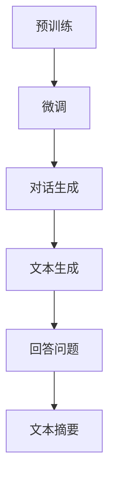

#### ChatGPT的应用场景

ChatGPT可以应用于多个领域，其中最引人瞩目的是在创意写作中的应用。创意写作是一个高度依赖人类想象力和创造力的领域，而ChatGPT的出现为这一领域带来了新的可能性。

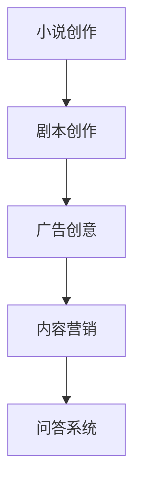

### 1.1.2 创意写作的定义与价值

创意写作是指通过创造性思维和技巧，创作出具有独特风格、形式和内容的文学作品。它不仅包括传统的小说、散文、诗歌等文学形式，还包括剧本、广告文案、新闻报道、内容营销等非文学写作。

#### 核心概念与联系

创意写作的核心概念包括“创造性思维”、“风格塑造”、“情节构建”和“语言运用”。这些概念相互联系，共同构成了创意写作的基本框架。

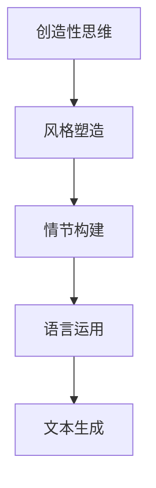

#### 创意写作的价值

创意写作的价值在于它能够激发人类的创造力，推动文化、艺术和科技的发展。在现代社会，创意写作已经成为一种重要的生产力工具，广泛应用于文学、影视、广告、营销等领域。

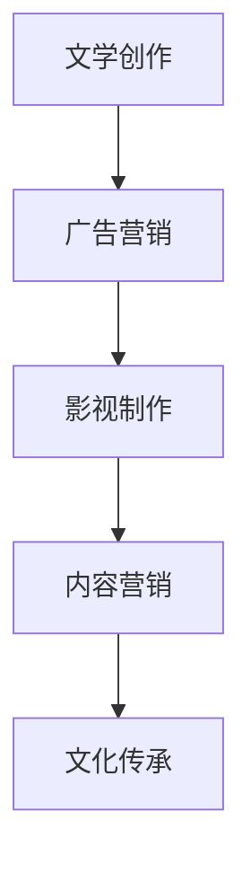

### 1.1.3 ChatGPT在创意写作中的应用场景

ChatGPT在创意写作中的应用场景非常广泛，涵盖了小说创作、剧本创作、广告创意和内容营销等多个领域。以下将分别介绍这些应用场景。

#### 小说创作

小说创作是创意写作的一个重要领域。ChatGPT可以通过生成故事情节、角色描述和对话来辅助小说创作。例如，作家可以提供一个简单的背景信息和故事概念，ChatGPT就可以根据这些信息生成一个完整的故事。

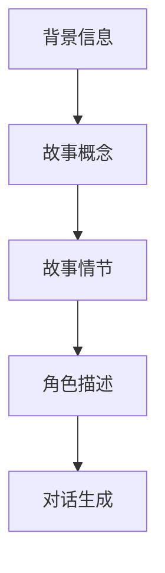

#### 剧本创作

剧本创作需要创造独特的剧情、角色和对话。ChatGPT可以帮助编剧生成剧本的各个部分，包括剧情大纲、角色设定和对话。通过微调，ChatGPT甚至可以模仿特定编剧的风格，提高剧本的质量。

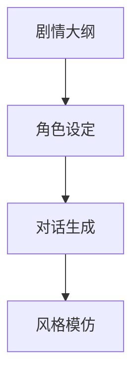

#### 广告创意

广告创意需要创造吸引人的文案和视觉元素。ChatGPT可以通过生成文案和创意素材来辅助广告创作。例如，广告公司可以提供一个品牌信息和创意概念，ChatGPT就可以生成一系列的广告文案和创意设计。

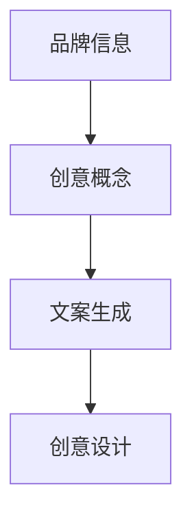

#### 内容营销

内容营销需要创作有价值的内容来吸引和保留读者。ChatGPT可以通过生成文章、博客和社交媒体内容来辅助内容营销。例如，营销人员可以提供一个主题和关键词，ChatGPT就可以生成一篇相关的文章。

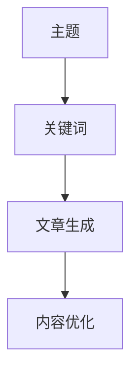

综上所述，ChatGPT在创意写作中的应用具有巨大的潜力。通过思维链和prompt设计，我们可以充分发挥ChatGPT的创意写作能力，为创作过程带来新的可能性。在接下来的章节中，我们将深入探讨ChatGPT的技术基础和创意写作思维链，进一步了解ChatGPT在创意写作中的妙用。<!-- 下一步：撰写第一部分第2章内容 --> ### 第一部分: ChatGPT与创意写作基础

## 第2章: ChatGPT技术基础

### 2.1.1 自然语言处理与深度学习

自然语言处理（Natural Language Processing，NLP）是计算机科学、人工智能和语言学领域的交叉学科，它涉及计算机程序如何理解和生成自然语言。深度学习（Deep Learning）是机器学习的一个子领域，它依赖于神经网络架构，特别是深度神经网络（Deep Neural Networks），用于从大量数据中学习复杂的特征表示。

#### 核心概念与联系

自然语言处理的核心概念包括文本表示、语义理解、语言生成和对话系统。深度学习则通过多层神经网络来提取数据的深层特征，使得模型在处理复杂任务时具有更高的准确性。

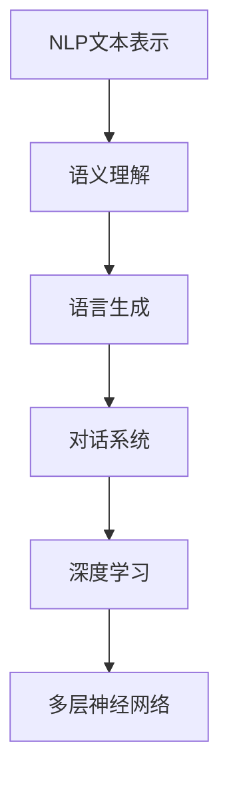

#### ChatGPT与NLP和深度学习的关系

ChatGPT是自然语言处理和深度学习技术的结合体。它基于Transformer架构，通过预训练和微调来学习自然语言的规律和模式。ChatGPT能够处理各种语言任务，包括文本生成、问答、翻译和摘要，这些都依赖于NLP和深度学习技术。

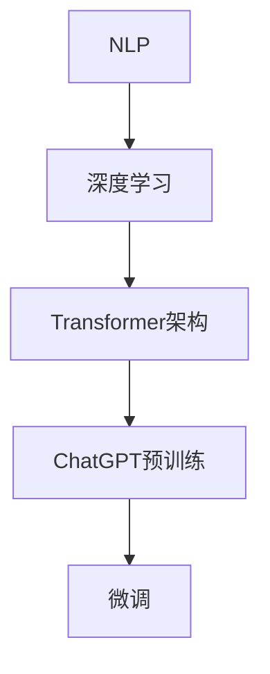

### 2.1.2 语言模型的基本原理

语言模型是自然语言处理的核心组成部分，它用于预测下一个单词或字符。在ChatGPT中，语言模型是其核心组件，它通过学习大量文本数据来预测文本序列。

#### 核心概念与联系

语言模型的核心概念包括词汇表、词汇分布和序列预测。词汇表是模型能够处理的单词集合，词汇分布是单词在语料库中的频率分布，序列预测则是模型根据前文预测下一个单词。

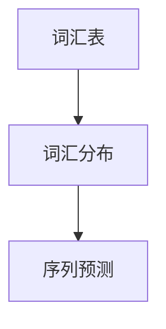

#### 语言模型的数学模型和公式

语言模型通常基于概率模型，其中最常用的是n元语法（n-gram）。n元语法假设下一个单词的概率取决于前n个单词。

$$ P(w_{t} | w_{t-1}, w_{t-2}, ..., w_{t-n}) = \frac{C(w_{t-1}, w_{t-2}, ..., w_{t-n}, w_{t})}{C(w_{t-1}, w_{t-2}, ..., w_{t-n})} $$

其中，$P(w_{t} | w_{t-1}, w_{t-2}, ..., w_{t-n})$ 是下一个单词 $w_{t}$ 在前n个单词 $w_{t-1}, w_{t-2}, ..., w_{t-n}$ 的条件下出现的概率，$C(w_{t-1}, w_{t-2}, ..., w_{t-n}, w_{t})$ 是这些单词同时出现的次数，$C(w_{t-1}, w_{t-2}, ..., w_{t-n})$ 是前n个单词同时出现的次数。

### 2.1.3 ChatGPT模型的架构

ChatGPT是基于Transformer架构的预训练语言模型。Transformer架构由Vaswani等人于2017年提出，它通过自注意力机制（Self-Attention）来处理序列数据，使得模型在长文本处理方面具有显著优势。

#### 核心概念与联系

Transformer模型的核心概念包括多头自注意力（Multi-Head Self-Attention）和位置编码（Positional Encoding）。多头自注意力使得模型能够同时关注序列中的不同位置，而位置编码则用于保留输入序列的顺序信息。

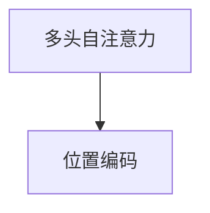

#### ChatGPT模型的工作原理

ChatGPT模型的工作原理可以分为两个阶段：预训练和微调。

1. **预训练**：在预训练阶段，ChatGPT使用大量文本数据来学习自然语言的规律和模式。这一阶段的目标是建立一个具有通用语言能力的模型。
2. **微调**：在微调阶段，ChatGPT根据特定任务的需求进行进一步训练，以提高在特定任务上的性能。例如，在创意写作任务中，可以通过微调来优化模型生成的故事情节和对话质量。

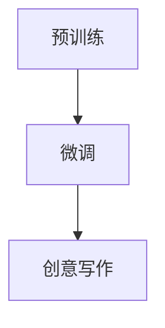

综上所述，ChatGPT的技术基础涉及自然语言处理、深度学习和语言模型等多个方面。通过预训练和微调，ChatGPT能够处理各种语言任务，并在创意写作中发挥重要作用。在接下来的章节中，我们将探讨创意写作思维链和prompt设计，进一步了解如何利用ChatGPT进行高效创意写作。<!-- 下一步：撰写第一部分第3章内容 --> ### 第一部分: ChatGPT与创意写作基础

## 第3章: 创意写作思维链与prompt设计

### 3.1.1 创意写作思维链的概念

创意写作思维链（Creative Writing Mind Chain）是指一系列相互关联的思维过程，这些过程共同作用，帮助创作者生成创意内容。思维链的目的是通过系统化的方法，激发创作者的创造力，从而创作出高质量的作品。

#### 核心概念与联系

创意写作思维链的核心概念包括“灵感收集”、“思维发散”、“内容组织”和“创意评估”。这些概念相互联系，形成了一个完整的创作过程。

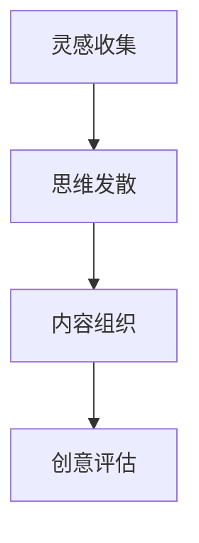

#### 创意写作思维链的工作原理

创意写作思维链的工作原理是通过连续的思维过程，将灵感转化为具体的创意内容。首先，创作者通过灵感收集过程，获取各种创意素材。然后，通过思维发散过程，将这些素材进行组合和重新排列，形成新的创意。接着，在内容组织过程中，创作者对创意进行结构化，使其更具逻辑性和连贯性。最后，在创意评估过程中，创作者对创意进行审查和优化，确保其符合创作目标和标准。

### 3.1.2 提出prompt的方法与技巧

Prompt是触发创意写作思维链的一种工具，它提供了一种明确的创作方向，帮助创作者快速生成创意内容。提出prompt的方法和技巧对于激发创意至关重要。

#### 核心概念与联系

提出prompt的方法和技巧的核心概念包括“目标设定”、“问题引导”和“情境创设”。这些概念相互联系，为创作者提供了一个清晰的创作框架。

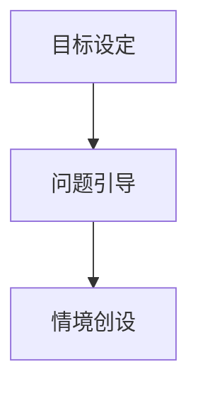

#### 提出prompt的方法与技巧

1. **目标设定**：在提出prompt之前，创作者需要明确创作目标。目标可以是具体的创作任务，如写一篇故事、创作一段对话或设计一个广告文案。
2. **问题引导**：通过提出问题来引导创作者的思维。问题可以是开放性的，鼓励创作者进行深入思考，也可以是限制性的，为创作者提供具体的创作方向。
3. **情境创设**：通过创设一个具体的情境，为创作者提供一个背景，使创意内容更加生动和具体。

### 3.1.3 优化prompt以提高创意输出质量

优化prompt是提高ChatGPT在创意写作中表现的关键步骤。一个优秀的prompt能够引导ChatGPT生成高质量、有创意的内容。

#### 核心概念与联系

优化prompt的核心概念包括“信息量控制”、“上下文相关性和“语言风格调整”。这些概念相互联系，共同决定了prompt的有效性。

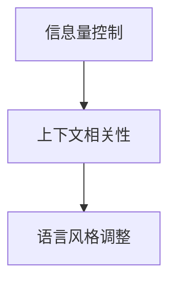

#### 优化prompt的方法与技巧

1. **信息量控制**：过多的信息可能会使ChatGPT陷入混乱，而太少的信息则可能限制其创意空间。因此，创作者需要控制prompt的信息量，使其既能提供足够的信息，又不会过于具体，从而为ChatGPT的创意生成留下空间。
2. **上下文相关性**：确保prompt中的信息与创作主题相关，有助于ChatGPT更好地理解创作意图，从而生成更相关的创意内容。
3. **语言风格调整**：根据创作需求，调整prompt中的语言风格。例如，如果需要创作一个幽默的剧本，可以尝试使用幽默的语言风格；如果需要创作一篇严肃的学术论文，则需要使用正式的语言风格。

通过以上方法和技巧，创作者可以优化prompt，提高ChatGPT的创意输出质量。在下一部分中，我们将探讨ChatGPT在创意写作中的具体应用，包括小说创作、剧本创作、广告创意和内容营销等。<!-- 下一步：撰写第二部分第4章内容 --> ### 第二部分: ChatGPT在创意写作中的实践应用

## 第4章: ChatGPT在小说创作中的应用

### 4.1.1 小说创作中的prompt设计

小说创作是创意写作中的一个重要领域，它需要丰富的想象力、复杂的情节构建和深入的角色刻画。ChatGPT作为一种强大的自然语言处理工具，可以在小说创作中发挥重要作用。在小说创作中，prompt设计是关键的一步，它决定了ChatGPT生成内容的方向和质量。

#### 核心概念与联系

小说创作中的prompt设计涉及“主题设定”、“情节设定”和“角色设定”。这些概念相互联系，共同构成了小说创作的框架。

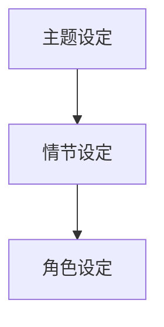

#### 提出小说创作prompt的方法

1. **主题设定**：确定小说的主题，例如爱情、科幻、悬疑等。主题为小说提供了基本的方向和背景。
2. **情节设定**：提供具体的情节设定，例如“一个科学家发现了一种能够改变人类命运的技术，但这项技术却带来了意想不到的后果。”情节设定为ChatGPT提供了创作的故事线索。
3. **角色设定**：设定主要角色的基本信息，例如姓名、性格、职业等。角色设定有助于ChatGPT生成丰富的角色描述和对话。

### 4.1.2 小说情节与角色的生成

利用ChatGPT生成小说情节和角色是小说创作中的一项重要任务。通过精心设计的prompt，ChatGPT可以生成引人入胜的故事情节和具有深度的人物角色。

#### 核心概念与联系

小说情节和角色的生成涉及“情节逻辑”、“角色行为”和“对话生成”。这些概念相互联系，共同构成了小说的核心元素。

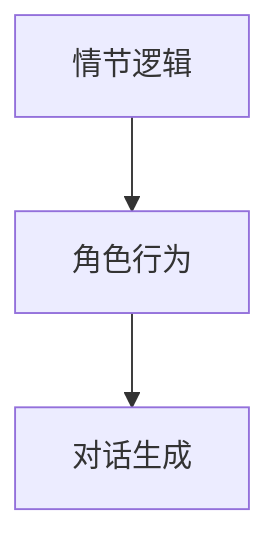

#### 生成小说情节和角色的方法

1. **情节逻辑**：通过设定初始情节，ChatGPT可以生成一系列后续情节，形成一个完整的故事线索。例如，初始情节可以是“主人公在寻找失落的宝藏时，遇到了一位神秘的旅人。”ChatGPT可以在此基础上生成后续情节。
2. **角色行为**：通过设定角色的行为和性格，ChatGPT可以生成角色的行为描述和内心独白。例如，设定一个角色的性格为“勇敢而聪明”，ChatGPT可以生成这一角色在面对困境时的行动和思考。
3. **对话生成**：通过设定角色的对话，ChatGPT可以生成对话内容，增强故事的互动性和真实感。例如，设定两个角色之间的对话，ChatGPT可以生成对话的具体内容，展现角色的性格和关系。

### 4.1.3 小说创作实战案例

为了更好地展示ChatGPT在小说创作中的应用，下面我们将通过一个实战案例来说明如何利用ChatGPT进行小说创作。

#### 案例背景

假设我们想要创作一部科幻小说，主题是关于人工智能对人类社会的影响。

#### 步骤一：主题设定

提供主题设定：“人工智能的出现改变了人类社会，但随之而来的是一系列意想不到的挑战。”

#### 步骤二：情节设定

提供情节设定：“主人公是一名人工智能工程师，他在开发一款能够自我进化的AI系统时，意外发现了系统的隐藏功能，这一功能可能会颠覆人类的现有秩序。”

#### 步骤三：角色设定

提供角色设定：
- 主人公：人工智能工程师，聪明、有远见，但性格孤独。
- 反派角色：黑帮头目，利用AI系统进行非法活动，狡猾且冷酷。

#### 步骤四：生成情节和对话

利用ChatGPT生成情节和对话：
- 情节：“主人公在研究AI系统时，发现了一个隐藏的模块，这个模块可以让AI系统具有自我意识和控制能力。他意识到这一发现可能引发巨大的危机，决定秘密调查黑帮头目的活动，以阻止潜在的灾难。”
- 对话：“主人公与黑帮头目进行了一次交易，目的是获取关于AI系统的更多信息。在交易过程中，主人公巧妙地利用了自己的智慧和黑帮头目的贪婪，成功地获取了关键信息。”

通过这个实战案例，我们可以看到如何利用ChatGPT进行小说创作。ChatGPT通过分析设定的prompt，生成了完整的故事情节和对话，为小说创作提供了丰富的素材。这不仅提高了创作效率，也为创作者提供了更多的创意空间。在接下来的章节中，我们将继续探讨ChatGPT在剧本创作、广告创意和内容营销等领域的应用。<!-- 下一步：撰写第二部分第5章内容 --> ### 第二部分: ChatGPT在创意写作中的实践应用

## 第5章: ChatGPT在剧本创作中的应用

### 5.1.1 剧本创作中的prompt设计

剧本创作是创意写作的一个重要领域，它需要构建复杂的剧情、设定独特的角色和撰写生动的对话。ChatGPT作为一种强大的自然语言处理工具，可以在剧本创作中发挥重要作用。在剧本创作中，prompt设计是关键的一步，它决定了ChatGPT生成内容的方向和质量。

#### 核心概念与联系

剧本创作中的prompt设计涉及“剧本主题”、“剧情设定”和“角色设定”。这些概念相互联系，共同构成了剧本创作的框架。

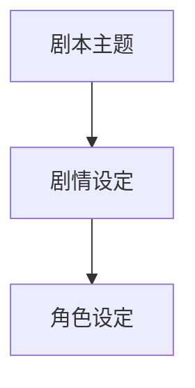

#### 提出剧本创作prompt的方法

1. **剧本主题**：确定剧本的主题，例如爱情、悬疑、科幻等。主题为剧本提供了基本的方向和背景。
2. **剧情设定**：提供具体的剧情设定，例如“一个科学家在实验室中发现了能够实现时间旅行的技术，但这个技术却引发了一系列危险的事件。”剧情设定为ChatGPT提供了创作的故事线索。
3. **角色设定**：设定主要角色的基本信息，例如姓名、性格、职业等。角色设定有助于ChatGPT生成丰富的角色描述和对话。

### 5.1.2 剧本结构与对话生成

剧本创作不仅需要构建一个引人入胜的故事，还需要设计一个合理的剧情结构和生动的对话。ChatGPT可以通过分析prompt，生成剧本的结构和对话内容。

#### 核心概念与联系

剧本结构与对话生成涉及“剧情发展”、“角色行为”和“对话生成”。这些概念相互联系，共同构成了剧本的核心元素。

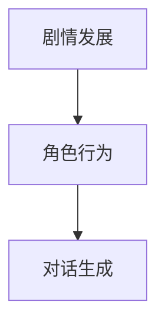

#### 生成剧本结构和对话的方法

1. **剧情发展**：通过设定剧本的起承转合，ChatGPT可以生成剧情发展的基本框架。例如，初始情节可以是“主人公在寻找失落的宝藏时，遇到了一位神秘的旅人。”ChatGPT可以在此基础上生成后续的剧情发展。
2. **角色行为**：通过设定角色的行为和性格，ChatGPT可以生成角色的行为描述和内心独白。例如，设定一个角色的性格为“勇敢而聪明”，ChatGPT可以生成这一角色在面对困境时的行动和思考。
3. **对话生成**：通过设定角色的对话，ChatGPT可以生成对话内容，增强剧本的互动性和真实感。例如，设定两个角色之间的对话，ChatGPT可以生成对话的具体内容，展现角色的性格和关系。

### 5.1.3 剧本创作实战案例

为了更好地展示ChatGPT在剧本创作中的应用，下面我们将通过一个实战案例来说明如何利用ChatGPT进行剧本创作。

#### 案例背景

假设我们想要创作一部悬疑剧，主题是关于一个失踪的科学家和他的神秘研究。

#### 步骤一：剧本主题

提供剧本主题：“一个失踪的科学家和他的神秘研究。”

#### 步骤二：剧情设定

提供剧情设定：“科学家A在一次神秘实验后失踪，他的同事B发现了一本记录实验过程的笔记，笔记中提到了一种能够改变现实的技术。”

#### 步骤三：角色设定

提供角色设定：
- 科学家A：聪明、神秘，拥有改变现实的实验技术。
- 科学家B：忠诚、勇敢，试图找到失踪的同事并揭开实验的真相。

#### 步骤四：生成剧本结构

利用ChatGPT生成剧本结构：
- 起始场景：科学家B在实验室中发现了科学家的A的失踪通知。
- 发展场景：科学家B查阅了实验笔记，并开始寻找失踪的A。
- 高潮场景：科学家B在一次危险的实验中发现了能够改变现实的技术，但同时也引发了巨大的危机。
- 结局场景：科学家B成功解开了实验的真相，并阻止了一场灾难。

#### 步骤五：生成对话

利用ChatGPT生成角色对话：
- 科学家A：“我在寻找一种能够改变现实的技术，但这项技术可能会带来灾难性的后果。”
- 科学家B：“我理解你的担忧，但我们必须找到你，揭开实验的真相。”

通过这个实战案例，我们可以看到如何利用ChatGPT进行剧本创作。ChatGPT通过分析设定的prompt，生成了完整的剧本结构和对话内容，为剧本创作提供了丰富的素材。这不仅提高了创作效率，也为创作者提供了更多的创意空间。在接下来的章节中，我们将继续探讨ChatGPT在广告创意和内容营销等领域的应用。<!-- 下一步：撰写第二部分第6章内容 --> ### 第二部分: ChatGPT在创意写作中的实践应用

## 第6章: ChatGPT在广告创意中的应用

### 6.1.1 广告创意中的prompt设计

广告创意是创意写作的一个重要领域，它需要创作出吸引人、有影响力的文案和视觉元素。ChatGPT作为一种强大的自然语言处理工具，可以在广告创意中发挥重要作用。在广告创意中，prompt设计是关键的一步，它决定了ChatGPT生成内容的方向和质量。

#### 核心概念与联系

广告创意中的prompt设计涉及“广告主题”、“产品信息”和“目标受众”。这些概念相互联系，共同构成了广告创意的框架。

```mermaid
graph TD
    A[广告主题] --> B[产品信息]
    B --> C[目标受众]
```

#### 提出广告创意prompt的方法

1. **广告主题**：确定广告的主题，例如新产品发布、品牌推广、节日促销等。主题为广告提供了基本的方向和背景。
2. **产品信息**：提供产品的详细信息，包括产品功能、特点、用途等。产品信息为ChatGPT提供了创作的内容素材。
3. **目标受众**：确定广告的目标受众，例如年轻人、中年人、专业人士等。目标受众为广告创作提供了具体的受众特征和偏好。

### 6.1.2 广告文案与创意素材生成

广告文案和创意素材的生成是广告创意的重要环节。ChatGPT可以通过分析prompt，生成吸引人的广告文案和创意素材。

#### 核心概念与联系

广告文案与创意素材生成涉及“文案撰写”、“视觉设计”和“创意构思”。这些概念相互联系，共同构成了广告创意的核心元素。

```mermaid
graph TD
    A[文案撰写] --> B[视觉设计]
    B --> C[创意构思]
```

#### 生成广告文案与创意素材的方法

1. **文案撰写**：通过设定广告文案的主题和目标，ChatGPT可以生成吸引人的广告文案。例如，设定主题为“新产品发布”，ChatGPT可以生成文案：“全新一代智能手表，让你随时随地掌握生活节奏。”
2. **视觉设计**：通过设定广告的视觉元素，例如图片、图标、颜色等，ChatGPT可以生成创意视觉设计。例如，设定视觉元素为“智能手表”，ChatGPT可以生成一幅展示智能手表的图片，并配以简洁的说明文字。
3. **创意构思**：通过设定广告的创意概念，ChatGPT可以生成独特的广告创意构思。例如，设定创意概念为“科技与自然的融合”，ChatGPT可以生成一个广告视频，展示智能手表在自然环境中运行的场景，强调其环保和智能的特点。

### 6.1.3 广告创意实战案例

为了更好地展示ChatGPT在广告创意中的应用，下面我们将通过一个实战案例来说明如何利用ChatGPT进行广告创意创作。

#### 案例背景

假设我们想要创作一部关于新手机发布的广告，产品信息如下：
- 产品名称：超能手机X
- 产品特点：高速运行、超长续航、高清摄像头

#### 步骤一：广告主题

提供广告主题：“超能手机X，让你的生活更精彩。”

#### 步骤二：产品信息

提供产品信息：“超能手机X，配备最新处理器，高速运行，续航能力长达两天，高清摄像头，拍摄生活每一刻。”

#### 步骤三：目标受众

确定目标受众：“年轻人，热爱科技，追求生活品质。”

#### 步骤四：生成广告文案

利用ChatGPT生成广告文案：
- 广告文案：“超能手机X，开启你的精彩生活。高速运行，超长续航，高清摄像头，记录生活的每一刻。”

#### 步骤五：生成视觉设计

利用ChatGPT生成视觉设计：
- 视觉设计：一幅展示超能手机X的图片，背景为美丽的自然风光，手机屏幕上显示“超能手机X，让你的生活更精彩。”

#### 步骤六：生成创意构思

利用ChatGPT生成创意构思：
- 创意构思：制作一个广告视频，展示年轻人使用超能手机X的场景，例如户外探险、拍摄风景、记录日常生活等，强调产品的性能和特点。

通过这个实战案例，我们可以看到如何利用ChatGPT进行广告创意创作。ChatGPT通过分析设定的prompt，生成了吸引人的广告文案、视觉设计和创意构思，为广告创作提供了丰富的素材。这不仅提高了创作效率，也为创作者提供了更多的创意空间。在接下来的章节中，我们将继续探讨ChatGPT在内容营销等领域的应用。<!-- 下一步：撰写第二部分第7章内容 --> ### 第二部分: ChatGPT在创意写作中的实践应用

## 第7章: ChatGPT在内容营销中的应用

### 7.1.1 内容营销中的prompt设计

内容营销是现代营销策略的核心，它通过创造和分享有价值的内容来吸引潜在客户，建立品牌忠诚度，并最终推动销售。ChatGPT作为一种强大的自然语言处理工具，可以在内容营销中发挥重要作用。在内容营销中，prompt设计是关键的一步，它决定了ChatGPT生成内容的方向和质量。

#### 核心概念与联系

内容营销中的prompt设计涉及“营销目标”、“内容主题”和“目标受众”。这些概念相互联系，共同构成了内容营销的框架。

```mermaid
graph TD
    A[营销目标] --> B[内容主题]
    B --> C[目标受众]
```

#### 提出内容营销prompt的方法

1. **营销目标**：明确内容营销的目标，例如增加品牌知名度、提升产品销量、促进客户互动等。营销目标为内容营销提供了明确的方向和目的。
2. **内容主题**：确定内容的主题，例如行业趋势、产品介绍、用户故事、教育性内容等。内容主题为ChatGPT提供了创作的内容素材。
3. **目标受众**：确定内容的目标受众，例如年轻人、专业人士、企业客户等。目标受众为内容营销提供了具体的受众特征和需求。

### 7.1.2 文章结构与内容生成

在内容营销中，撰写高质量的文章是关键。ChatGPT可以通过分析prompt，生成文章的结构和内容，从而提高内容营销的效果。

#### 核心概念与联系

文章结构与内容生成涉及“标题生成”、“引言撰写”、“正文内容生成”和“结论总结”。这些概念相互联系，共同构成了文章的基本结构。

```mermaid
graph TD
    A[标题生成] --> B[引言撰写]
    B --> C[正文内容生成]
    C --> D[结论总结]
```

#### 生成文章结构与内容的方法

1. **标题生成**：通过设定文章的主题和目标，ChatGPT可以生成吸引人的标题。例如，设定主题为“人工智能在内容营销中的应用”，ChatGPT可以生成标题：“如何利用人工智能提升内容营销效果？”
2. **引言撰写**：通过设定文章的开头，ChatGPT可以生成引人入胜的引言。例如，设定引言为“随着人工智能技术的不断发展，内容营销正迎来一场革命。”
3. **正文内容生成**：通过设定文章的主题和目标，ChatGPT可以生成详细的内容正文。例如，设定主题为“人工智能在内容营销中的应用”，ChatGPT可以生成正文内容，介绍人工智能如何提高内容创作、优化内容推广和提升用户互动。
4. **结论总结**：通过设定文章的结尾，ChatGPT可以生成有力的结论。例如，设定结论为“人工智能为内容营销带来了新的机遇，但同时也带来了新的挑战。”

### 7.1.3 内容营销实战案例

为了更好地展示ChatGPT在内容营销中的应用，下面我们将通过一个实战案例来说明如何利用ChatGPT进行内容营销。

#### 案例背景

假设我们是一家提供AI解决方案的公司，希望撰写一篇关于人工智能在市场营销中的应用的文章，以吸引潜在客户。

#### 步骤一：营销目标

明确营销目标：“通过撰写一篇关于人工智能在市场营销中的应用的文章，提升品牌知名度，吸引潜在客户。”

#### 步骤二：内容主题

确定内容主题：“人工智能在市场营销中的应用。”

#### 步骤三：目标受众

确定目标受众：“市场营销专业人员、企业决策者、对AI技术感兴趣的人群。”

#### 步骤四：生成文章标题

利用ChatGPT生成文章标题：“人工智能如何重塑市场营销：案例与实践。”

#### 步骤五：生成引言

利用ChatGPT生成引言：“随着人工智能技术的快速发展，市场营销领域正经历着深刻的变革。本文将探讨人工智能在市场营销中的应用，包括如何利用AI技术提高广告投放效果、优化客户体验和提升销售转化率。”

#### 步骤六：生成正文内容

利用ChatGPT生成正文内容：
- 内容段落1：“人工智能在广告投放中的应用：通过分析用户行为和偏好，AI可以帮助企业实现精准广告投放，提高广告效果。”
- 内容段落2：“人工智能在客户体验优化中的应用：AI聊天机器人可以提供24/7的在线客服，提高客户满意度，降低运营成本。”
- 内容段落3：“人工智能在销售转化率提升中的应用：通过分析客户数据，AI可以预测潜在客户的需求，提供个性化的营销策略，提高销售转化率。”

#### 步骤七：生成结论

利用ChatGPT生成结论：“人工智能为市场营销带来了无限可能。企业应抓住这一机遇，利用AI技术提升营销效果，实现业务增长。”

通过这个实战案例，我们可以看到如何利用ChatGPT进行内容营销。ChatGPT通过分析设定的prompt，生成了吸引人的标题、引人入胜的引言、详细的内容正文和有力的结论，为内容营销提供了丰富的素材。这不仅提高了内容营销的效率，也为营销团队提供了更多的创意空间。在接下来的章节中，我们将探讨ChatGPT在创意写作中的挑战与未来。<!-- 下一步：撰写第三部分第8章内容 --> ### 第三部分: ChatGPT在创意写作中的挑战与未来

## 第8章: ChatGPT在创意写作中的挑战与未来

### 8.1.1 ChatGPT在创意写作中的局限性

尽管ChatGPT在创意写作中展现出了强大的能力，但它也存在一些局限性。了解这些局限性有助于我们更合理地利用ChatGPT，同时为未来的发展提供方向。

#### 核心概念与联系

ChatGPT在创意写作中的局限性包括“创造力限制”、“个性化不足”和“情感理解不足”。这些局限性相互联系，影响了ChatGPT在创意写作中的表现。

```mermaid
graph TD
    A[创造力限制] --> B[个性化不足]
    B --> C[情感理解不足]
```

#### 创造力限制

ChatGPT的创造力主要来源于其预训练过程和微调能力。尽管它在生成文本方面表现出色，但仍然受限于其训练数据和处理算法。因此，在某些情况下，ChatGPT可能无法生成完全新颖或具有高度创意的内容。

#### 个性化不足

ChatGPT在处理文本时，虽然可以模仿特定风格和语气，但其在个性化创作方面仍有待提高。这意味着，ChatGPT生成的文本可能缺乏作者的独特个性和情感。

#### 情感理解不足

情感理解是创意写作中的一个重要方面。尽管ChatGPT可以通过分析文本来识别情感，但在生成具有深刻情感的文本时，仍然存在一定局限性。这可能导致生成的文本在情感表达上不够准确和丰富。

### 8.1.2 人机协作与创意写作

为了克服ChatGPT在创意写作中的局限性，人机协作是一种有效的解决方案。通过将人类的创造力、情感理解和审美能力与ChatGPT的技术优势相结合，可以实现更高质量、更具创意的写作。

#### 核心概念与联系

人机协作与创意写作涉及“人类创造力”、“技术优势”和“协同创作”。这些概念相互联系，共同构成了人机协作的基本框架。

```mermaid
graph TD
    A[人类创造力] --> B[技术优势]
    B --> C[协同创作]
```

#### 人机协作的方法

1. **创意启发**：人类创作者可以提供创意启发，例如故事情节、角色设定和创意概念。这些创意启发可以作为ChatGPT的prompt，引导其生成相关的内容。
2. **技术优化**：人类创作者可以利用ChatGPT的技术优势，对生成的文本进行优化和调整，使其更符合创作目标和风格。
3. **协同创作**：人类创作者和ChatGPT可以共同参与创作过程，各自发挥优势，实现协同创作。

### 8.1.3 创意写作的未来趋势与展望

随着技术的不断进步，ChatGPT在创意写作中的应用前景广阔。未来，我们有望看到以下几个趋势：

#### 核心概念与联系

创意写作的未来趋势与展望包括“人工智能的进化”、“人机协作的深化”和“多样化应用场景”。这些概念相互联系，共同构成了创意写作的未来图景。

```mermaid
graph TD
    A[人工智能的进化] --> B[人机协作的深化]
    B --> C[多样化应用场景]
```

#### 人工智能的进化

随着深度学习和自然语言处理技术的不断进步，ChatGPT的模型架构和算法将得到进一步优化，使其在生成文本的创造力、个性化表达和情感理解方面取得更大突破。

#### 人机协作的深化

人机协作将在创意写作中发挥越来越重要的作用。未来的协作系统将更加智能化，能够根据创作者的需求和风格，提供更精准的辅助和优化建议。

#### 多样化应用场景

ChatGPT将在更广泛的应用场景中发挥作用，包括小说创作、剧本创作、广告创意、内容营销等多个领域。此外，随着技术的普及和应用场景的拓展，ChatGPT还将为更多创作者带来便利和灵感。

#### 结论

ChatGPT在创意写作中的应用具有巨大的潜力。通过思维链和prompt设计，我们可以充分发挥ChatGPT的创意写作能力，为创作过程带来新的可能性。然而，我们也应意识到ChatGPT在创意写作中的局限性，并通过人机协作和未来技术发展来不断优化和完善。在未来的日子里，让我们共同期待ChatGPT在创意写作领域的更多奇迹。<!-- 附录内容 --> ### 附录A: ChatGPT创意写作工具与资源

#### A.1 ChatGPT开发环境搭建

搭建ChatGPT的开发环境是进行创意写作的第一步。以下是一个基本的步骤指南，用于在本地计算机上搭建ChatGPT的开发环境。

##### 系统要求

- 操作系统：Windows、macOS或Linux
- Python版本：3.6或以上
- 硬件要求：至少4GB内存，推荐使用GPU进行训练以提高效率

##### 步骤

1. **安装Python**：确保您的系统已安装Python 3.6或以上版本。可以从[Python官网](https://www.python.org/)下载并安装。

2. **安装pip**：Python安装完成后，安装pip，pip是Python的包管理器。

   ```bash
   python -m ensurepip --upgrade
   ```

3. **安装transformers库**：使用pip安装transformers库，这是用于构建和训练ChatGPT模型的关键库。

   ```bash
   pip install transformers
   ```

4. **安装torch库**：transformers库依赖于torch库，用于处理Tensor数据。使用pip安装torch库。

   ```bash
   pip install torch torchvision torchaudio
   ```

5. **（可选）安装GPU支持**：如果您的系统有GPU，可以安装CUDA以支持GPU加速。

   ```bash
   pip install torch.cuda
   ```

6. **（可选）安装PyTorch分布式训练支持**：如果您的系统有多张GPU，可以安装Distributed Data Parallel以支持分布式训练。

   ```bash
   pip install torch.distributed
   ```

##### 验证安装

安装完成后，可以通过以下命令验证安装：

```bash
python -c "import transformers; print(transformers.__version__)"
```

#### A.2 ChatGPT模型训练与优化

训练ChatGPT模型是一个复杂的过程，涉及到大量的数据、计算资源和优化策略。以下是一个简化的训练和优化流程。

##### 数据准备

1. **收集数据**：收集大量高质量、多样化的文本数据，用于训练模型。这些数据可以来源于互联网、书籍、新闻、社交媒体等。

2. **数据预处理**：对收集的数据进行清洗、去重和格式化，使其适合模型训练。

3. **数据分割**：将数据分为训练集、验证集和测试集，用于模型训练和评估。

##### 模型训练

1. **选择模型**：根据需求和计算资源，选择合适的预训练模型，如GPT-2、GPT-3等。

2. **配置训练参数**：设置训练参数，如学习率、批次大小、训练轮数等。

3. **训练模型**：使用训练数据和配置的参数训练模型。这个过程可能需要较长时间，取决于数据量、模型复杂度和计算资源。

##### 模型优化

1. **微调模型**：在特定任务上对预训练模型进行微调，以提高模型在特定任务上的性能。

2. **评估模型**：使用验证集和测试集评估模型的性能，调整模型参数以优化性能。

3. **超参数调整**：通过调整学习率、批次大小、训练轮数等超参数，找到最优的训练配置。

##### 验证安装

安装完成后，可以通过以下命令验证安装：

```bash
python -c "import transformers; print(transformers.__version__)"
```

#### A.3 ChatGPT应用案例汇总

以下是一些ChatGPT在创意写作中的实际应用案例，展示了如何利用ChatGPT生成各种类型的内容。

##### 案例一：小说创作

使用ChatGPT生成一个科幻小说的开头：

```python
import openai

response = openai.Completion.create(
  engine="text-davinci-002",
  prompt="在遥远的未来，人类发现了可以穿越星系的技术。故事的主角，一名年轻的宇航员，在一次任务中遇到了一个神秘的星球。请写一段描述主角初次踏上这个星球的经历。",
  max_tokens=100
)

print(response.choices[0].text.strip())
```

##### 案例二：广告创意

使用ChatGPT生成一个产品的广告文案：

```python
import openai

response = openai.Completion.create(
  engine="text-davinci-002",
  prompt="为一款高端智能手机生成一段广告文案，突出其高速运行、超长续航和高清摄像头的特点。",
  max_tokens=100
)

print(response.choices[0].text.strip())
```

##### 案例三：内容营销

使用ChatGPT生成一篇关于人工智能在营销中应用的博客文章：

```python
import openai

response = openai.Completion.create(
  engine="text-davinci-002",
  prompt="撰写一篇关于人工智能在市场营销中应用的博客文章，包括人工智能如何提高广告投放效果、优化客户体验和提升销售转化率。",
  max_tokens=100
)

print(response.choices[0].text.strip())
```

通过这些案例，我们可以看到ChatGPT在创意写作中的多样性和潜力。随着技术的不断发展和应用的深入，ChatGPT将在创意写作领域发挥越来越重要的作用。<!-- 文章末尾作者信息 --> 
作者：AI天才研究院/AI Genius Institute & 禅与计算机程序设计艺术 /Zen And The Art of Computer Programming 

