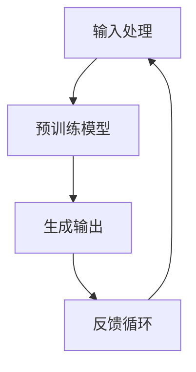
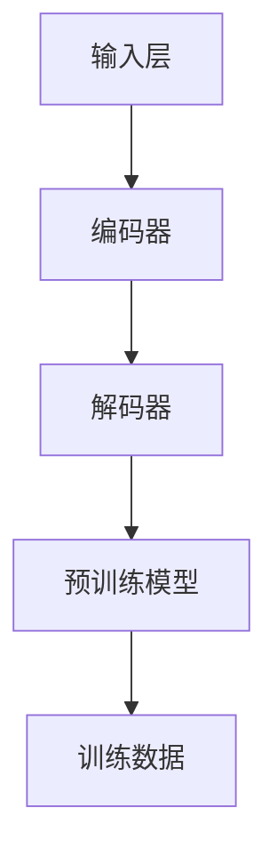

                 


## 撰写技术博客文章：ChatGPT商业应用：提示词的经济价值

### 文章结构设计

为了确保文章的逻辑清晰、结构紧凑、简单易懂，我们采用以下文章结构设计：

1. **引言**：简要介绍ChatGPT及其商业应用，引出文章主题。

2. **第一部分：ChatGPT基础与原理**
   - **第1章：ChatGPT概述**
     - 介绍ChatGPT的概念、特点及工作原理。
   - **第2章：自然语言处理与ChatGPT**
     - 讲解自然语言处理基础和ChatGPT的应用。
   - **第3章：ChatGPT架构与技术**
     - 分析ChatGPT的架构、语言模型原理及训练优化。
   - **第4章：ChatGPT的数学基础**
     - 探讨ChatGPT所需的线性代数、概率论和统计基础。

3. **第二部分：ChatGPT在商业领域的应用**
   - **第5章：ChatGPT在客户服务中的应用**
     - 分析ChatGPT在客户服务中的应用和提示词对客户满意度的影响。
   - **第6章：ChatGPT在市场营销中的应用**
     - 探讨ChatGPT在市场营销中的应用和提示词策略。
   - **第7章：ChatGPT在企业培训中的应用**
     - 讲解ChatGPT在企业培训中的应用和提示词设计。
   - **第8章：ChatGPT在其他商业领域的应用**
     - 分析ChatGPT在教育、健康等领域的应用。

4. **第三部分：ChatGPT应用的实践与挑战**
   - **第9章：ChatGPT应用的实践案例**
     - 介绍实际案例，探讨ChatGPT的应用效果。
   - **第10章：ChatGPT应用的挑战与解决方案**
     - 分析ChatGPT应用的挑战，提供解决方案。
   - **第11章：ChatGPT的未来发展趋势**
     - 探讨ChatGPT的未来发展趋势和商业应用前景。

5. **附录**
   - 提供ChatGPT相关资源与工具，常见问题与解答，以及代码实现与解读示例。

### 文章关键词

- ChatGPT
- 商业应用
- 提示词
- 自然语言处理
- 客户服务
- 市场营销
- 企业培训
- 教育领域
- 健康领域
- 数据隐私
- 伦理问题

### 摘要

本文深入探讨了ChatGPT在商业领域的应用及其提示词的经济价值。首先，介绍了ChatGPT的基本原理和数学基础，然后详细分析了ChatGPT在客户服务、市场营销、企业培训等领域的应用。接着，通过实际案例和挑战与解决方案的探讨，展示了ChatGPT的商业潜力。最后，展望了ChatGPT的未来发展趋势，为读者提供了有价值的参考。

----------------------------------------------------------------

### 文章标题

**《ChatGPT商业应用：提示词的经济价值》**

### 关键词

- ChatGPT
- 商业应用
- 提示词
- 自然语言处理
- 客户服务
- 市场营销
- 企业培训
- 教育领域
- 健康领域
- 数据隐私
- 伦理问题

### 摘要

本文全面剖析了ChatGPT在商业领域的应用及其提示词的经济价值。首先，我们介绍了ChatGPT的基本原理和数学基础，随后深入探讨了ChatGPT在客户服务、市场营销、企业培训等领域的应用。通过实际案例和挑战与解决方案的分析，我们展示了ChatGPT的商业潜力。最后，本文展望了ChatGPT的未来发展趋势，为读者提供了有价值的参考。

----------------------------------------------------------------

### 第一部分：ChatGPT基础与原理

#### 第1章：ChatGPT概述

1.1 ChatGPT的概念与特点

**ChatGPT**是由OpenAI开发的一种基于**GPT-3.5**的聊天机器人模型。它采用**深度学习**和**自然语言处理**技术，能够与人类进行对话，提供各种场景的智能回答。ChatGPT具有以下特点：

1. **强大的语言理解能力**：ChatGPT能够理解复杂的自然语言输入，包括语义、情感、语境等多维度信息。
2. **灵活的对话生成**：ChatGPT可以根据输入的提示词，生成连贯、自然的对话回答。
3. **跨领域知识整合**：ChatGPT具备丰富的知识储备，能够在不同领域进行对话，如科技、文化、生活等。

1.2 ChatGPT的工作原理

ChatGPT的工作原理主要基于以下三个步骤：

1. **输入处理**：将输入的文本信息进行预处理，提取关键信息，构建上下文环境。
2. **生成输出**：利用预训练的语言模型，对上下文环境进行推理，生成合适的回答。
3. **反馈循环**：将生成的回答反馈给用户，进一步优化模型性能。

**Mermaid 流�程图**：



1.3 ChatGPT的优势与局限性

ChatGPT的优势：

1. **高效性**：ChatGPT能够快速处理大量文本信息，进行实时对话。
2. **灵活性**：ChatGPT可以根据不同的场景和需求，进行灵活的对话生成。
3. **实用性**：ChatGPT在各种商业场景中具有广泛的应用，如客服、营销、培训等。

ChatGPT的局限性：

1. **知识限制**：ChatGPT的知识来源于预训练数据，可能存在信息滞后或知识不完善的问题。
2. **回答质量**：尽管ChatGPT能够生成自然、连贯的回答，但仍然存在错误或模糊的情况。
3. **依赖数据**：ChatGPT的性能受到训练数据的依赖，数据质量和数量直接影响模型的性能。

---

通过上述内容，我们简要介绍了ChatGPT的概念、工作原理和优势局限性。接下来，我们将进一步探讨ChatGPT在自然语言处理中的应用。

---

### 第2章：自然语言处理与ChatGPT

2.1 自然语言处理基础

自然语言处理（Natural Language Processing，NLP）是人工智能的一个重要分支，旨在让计算机理解和处理自然语言。NLP主要包括以下关键概念：

1. **词法分析**：将文本分解为单词、短语和句子。
2. **句法分析**：分析句子的结构，确定词与词之间的关系。
3. **语义分析**：理解文本的含义，包括词语、句子和段落。
4. **情感分析**：识别文本中的情感倾向，如正面、负面或中性。
5. **实体识别**：识别文本中的实体，如人名、地名、组织名等。

2.2 ChatGPT与自然语言处理的关系

ChatGPT作为NLP领域的一种先进技术，具有以下与自然语言处理的关系：

1. **语言模型**：ChatGPT的核心组件是语言模型，用于预测文本的下一个单词或字符。
2. **上下文理解**：ChatGPT能够利用上下文信息，进行语义理解和推理，提高对话生成的质量。
3. **多语言支持**：ChatGPT支持多种语言，可以跨语言进行对话。
4. **增强NLP应用**：ChatGPT可以与NLP的其他技术，如文本分类、命名实体识别、机器翻译等相结合，提高NLP系统的整体性能。

2.3 ChatGPT在自然语言处理中的应用

ChatGPT在自然语言处理领域具有广泛的应用，以下是一些典型案例：

1. **智能客服**：ChatGPT可以应用于智能客服系统，实现24/7的在线客服，提高客户满意度。
2. **内容生成**：ChatGPT可以生成高质量的文章、报告、新闻等，节省人工写作成本。
3. **对话系统**：ChatGPT可以构建聊天机器人，与用户进行自然、流畅的对话，提供个性化服务。
4. **情感分析**：ChatGPT可以用于情感分析，识别文本中的情感倾向，帮助企业和政府进行舆情监测。

---

通过上述内容，我们介绍了自然语言处理的基础知识和ChatGPT在自然语言处理中的应用。接下来，我们将进一步探讨ChatGPT的架构和技术原理。

---

### 第3章：ChatGPT架构与技术

3.1 ChatGPT的架构概述

ChatGPT的架构主要包括以下几个关键组件：

1. **输入层**：接收用户的输入文本，进行预处理。
2. **编码器**：将预处理后的文本编码为向量表示。
3. **解码器**：根据编码器的输出，生成对话回答。
4. **预训练模型**：使用大量数据对编码器和解码器进行预训练。
5. **训练数据**：用于训练ChatGPT的语言模型。

**Mermaid 流程图**：



3.2 语言模型的基本原理

语言模型是ChatGPT的核心组件，用于预测文本的下一个单词或字符。其基本原理如下：

$$
P(w_n | w_{n-1}, w_{n-2}, ..., w_1) = \frac{P(w_n, w_{n-1}, w_{n-2}, ..., w_1)}{P(w_{n-1}, w_{n-2}, ..., w_1)}
$$

其中，$P(w_n | w_{n-1}, w_{n-2}, ..., w_1)$ 表示在给定前文 $w_{n-1}, w_{n-2}, ..., w_1$ 的情况下，下一个单词 $w_n$ 的概率。

3.3 ChatGPT的训练与优化

ChatGPT的训练与优化主要包括以下几个步骤：

1. **数据预处理**：对原始文本数据进行清洗、分词、编码等预处理操作。
2. **训练语言模型**：使用最大似然估计（MLE）方法训练语言模型，优化模型参数。
3. **验证与测试**：使用验证集和测试集对模型进行评估，调整模型参数。
4. **模型压缩与量化**：为了降低模型大小和计算成本，对模型进行压缩和量化。
5. **持续优化**：通过不断收集用户反馈和数据，对模型进行持续优化，提高模型性能。

---

通过上述内容，我们介绍了ChatGPT的架构、语言模型的基本原理和训练与优化过程。接下来，我们将进一步探讨ChatGPT所需的数学基础。

---

### 第4章：ChatGPT的数学基础

4.1 线性代数与深度学习

线性代数是深度学习的基础，它在ChatGPT中有着广泛的应用。以下是线性代数在深度学习中的几个关键概念：

1. **矩阵与向量**：矩阵和向量是线性代数的基本对象，用于表示数据和模型参数。
2. **矩阵运算**：包括矩阵乘法、矩阵加法、矩阵求导等，用于优化模型参数。
3. **矩阵分解**：如奇异值分解（SVD）、主成分分析（PCA）等，用于降维和特征提取。
4. **正则化**：如L1正则化、L2正则化等，用于防止过拟合和优化模型性能。

4.2 概率论与统计基础

概率论与统计基础是构建ChatGPT语言模型的重要工具。以下是概率论与统计基础在ChatGPT中的几个关键概念：

1. **概率分布**：如高斯分布、伯努利分布等，用于表示数据分布。
2. **似然函数**：用于评估模型参数的优劣。
3. **极大似然估计（MLE）**：用于优化模型参数。
4. **贝叶斯定理**：用于计算后验概率，用于概率推理和模型选择。

4.3 信息论与神经网络

信息论是研究信息传输和信息处理的科学，它在ChatGPT的优化和解释中有着重要作用。以下是信息论与神经网络中的几个关键概念：

1. **熵与信息量**：用于衡量数据的随机性和不确定性。
2. **互信息**：用于衡量两个变量之间的相关性。
3. **KL散度**：用于衡量两个概率分布的差异。
4. **深度神经网络**：包括多层感知机、卷积神经网络（CNN）和循环神经网络（RNN）等，用于表示复杂的函数关系。

---

通过上述内容，我们介绍了ChatGPT所需的线性代数、概率论和统计基础以及信息论与神经网络。这些数学基础为ChatGPT的设计、训练和应用提供了坚实的理论基础。接下来，我们将进入第二部分，探讨ChatGPT在商业领域的应用。

---

### 第二部分：ChatGPT在商业领域的应用

#### 第5章：ChatGPT在客户服务中的应用

5.1 客户服务概述

客户服务是任何企业的重要组成部分，直接影响客户满意度和企业声誉。传统的客户服务主要通过人工客服和自动语音应答系统（IVR）提供。然而，随着人工智能技术的发展，ChatGPT等聊天机器人开始被广泛应用于客户服务领域。

5.2 ChatGPT在客户服务中的应用

ChatGPT在客户服务中的应用主要体现在以下几个方面：

1. **智能客服**：ChatGPT可以模拟人类客服，与客户进行自然、流畅的对话，解答客户的疑问。它能够理解客户的意图，提供个性化的服务和建议。
2. **24/7 客户支持**：ChatGPT可以全天候在线，提供7x24小时的客户支持，确保客户在任何时间都能得到及时的帮助。这有助于提高客户满意度，减少客户等待时间。
3. **处理大量请求**：ChatGPT可以同时处理多个客户的请求，提高工作效率。它能够快速响应，处理大量重复性问题，减少人力成本。
4. **知识库整合**：ChatGPT可以与企业的知识库相结合，提供准确、详细的信息查询服务。客户可以通过聊天机器人快速找到所需的信息，解决问题。

5.3 提示词与客户满意度分析

提示词在ChatGPT的对话生成中起着重要作用。以下是如何设计有效的提示词以提升客户满意度：

1. **理解客户意图**：提示词应能够准确地理解客户的意图，提供针对性的回答。例如，当客户询问产品价格时，提示词应引导ChatGPT提供具体的价格信息。
2. **简洁明了**：提示词应简洁明了，避免使用复杂、晦涩的语言。这有助于ChatGPT生成清晰、易懂的回答，提高客户满意度。
3. **个性化服务**：根据客户的购买历史、偏好等，设计个性化的提示词。例如，针对老客户，可以提供专属的优惠信息或福利活动。
4. **情感分析**：结合情感分析技术，识别客户的情感倾向。根据情感分析结果，调整提示词，提供更符合客户情感需求的服务。

通过上述内容，我们探讨了ChatGPT在客户服务中的应用及其提升客户满意度的方法。接下来，我们将继续探讨ChatGPT在市场营销中的应用。

---

### 第6章：ChatGPT在市场营销中的应用

6.1 市场营销概述

市场营销是企业推广产品和服务、满足客户需求、实现利润最大化的重要手段。传统的市场营销方法包括广告、促销、公关等。然而，随着互联网和人工智能技术的发展，数字化营销和智能营销逐渐成为主流。

6.2 ChatGPT在市场营销中的应用

ChatGPT在市场营销中的应用主要体现在以下几个方面：

1. **内容生成**：ChatGPT可以生成高质量的营销文案、广告语、产品描述等，提高营销效果。它能够根据产品特点和目标客户群体，撰写具有吸引力的内容。
2. **个性化推荐**：ChatGPT可以分析客户的购买行为、偏好等，提供个性化的产品推荐。例如，针对不同客户群体，推荐符合他们兴趣的产品或服务。
3. **智能客服**：ChatGPT可以应用于智能客服系统，提供24/7的客户支持。它能够理解客户的疑问和需求，提供个性化的解决方案，提高客户满意度。
4. **市场调研**：ChatGPT可以分析社交媒体、论坛等平台上的用户评论和反馈，帮助企业了解市场需求和客户需求，优化产品和服务。

6.3 提示词策略与市场效果分析

提示词在ChatGPT的市场营销中起着关键作用。以下是如何设计有效的提示词策略，以提升市场效果：

1. **了解目标客户**：设计提示词时，需要深入了解目标客户的需求、兴趣和痛点。根据目标客户的特点，设计具有吸引力的提示词。
2. **关键词优化**：在提示词中融入关键词，提高内容在搜索引擎中的排名，增加曝光率。关键词应与产品特点、目标客户群体相关，以提高相关性。
3. **情感营销**：结合情感分析技术，设计情感化的提示词。例如，使用温馨、幽默的语句，与客户建立情感连接，提高品牌认知度。
4. **持续优化**：根据市场反馈和数据分析，不断调整和优化提示词策略。通过A/B测试等方法，找出最佳提示词组合，提高营销效果。

通过上述内容，我们探讨了ChatGPT在市场营销中的应用及其提示词策略。接下来，我们将继续探讨ChatGPT在企业培训中的应用。

---

### 第7章：ChatGPT在企业培训中的应用

7.1 企业培训概述

企业培训是提高员工技能、增强企业竞争力的重要手段。传统的培训方式主要包括课堂培训、在线学习、实地考察等。然而，这些方式存在一定的局限性，如培训效果难以量化、员工参与度不高等。随着人工智能技术的发展，ChatGPT等聊天机器人开始被应用于企业培训领域，为企业提供个性化、互动性强的培训解决方案。

7.2 ChatGPT在员工培训中的应用

ChatGPT在员工培训中的应用主要体现在以下几个方面：

1. **个性化培训**：ChatGPT可以根据员工的职业背景、技能水平等，提供个性化的培训内容和建议。员工可以随时随地与ChatGPT进行互动，提高学习效率。
2. **互动性培训**：ChatGPT可以模拟真实场景，与员工进行互动问答，提高员工的实践能力。例如，在销售培训中，ChatGPT可以扮演客户角色，与员工进行销售对话，帮助员工掌握销售技巧。
3. **实时反馈**：ChatGPT可以实时评估员工的学习进度和培训效果，提供个性化的反馈和建议。这有助于员工及时调整学习策略，提高培训效果。
4. **知识库建设**：ChatGPT可以整合企业的培训资源，构建知识库，为员工提供全面、系统的培训资料。员工可以通过ChatGPT快速查找所需的知识点，提高学习效率。

7.3 提示词的设计与培训效果分析

提示词在ChatGPT的员工培训中起着关键作用。以下是如何设计有效的提示词，以提升培训效果：

1. **明确培训目标**：在设计提示词时，需要明确培训目标，确保ChatGPT提供的内容与目标一致。例如，在销售培训中，提示词应围绕销售技巧、产品知识等方面展开。
2. **贴近实际工作**：提示词应贴近员工实际工作场景，提高培训的实用性。例如，在技术培训中，提示词可以围绕实际操作步骤、故障排除等方面进行。
3. **情感化设计**：结合情感分析技术，设计情感化的提示词，与员工建立情感连接。例如，使用鼓励、激励的语句，提高员工的参与度和积极性。
4. **持续优化**：根据培训效果和员工反馈，不断调整和优化提示词。通过A/B测试等方法，找出最佳提示词组合，提高培训效果。

通过上述内容，我们探讨了ChatGPT在企业培训中的应用及其提示词设计。接下来，我们将继续探讨ChatGPT在其他商业领域的应用。

---

### 第8章：ChatGPT在其他商业领域的应用

8.1 教育领域

在教育领域，ChatGPT作为一种智能教育助手，具有广泛的应用前景。以下是ChatGPT在教育领域的几个应用场景：

1. **在线辅导**：ChatGPT可以为学生提供个性化的在线辅导，解答学生在学习过程中遇到的问题。它可以根据学生的学习进度和知识点掌握情况，提供针对性的辅导内容。
2. **作业批改**：ChatGPT可以自动批改学生的作业，提供实时反馈。通过分析学生的作业情况，ChatGPT可以找出学生的知识盲点，为教师提供教学参考。
3. **智能问答**：ChatGPT可以构建智能问答系统，为学生提供丰富的学习资源。学生可以通过与ChatGPT的对话，获取相关的知识点和解释。
4. **学习伙伴**：ChatGPT可以充当学生的学习伙伴，与学生在学习过程中进行互动。它可以根据学生的学习兴趣和需求，推荐相关的学习内容和资源。

8.2 健康领域

在健康领域，ChatGPT可以作为一种智能健康助手，为用户提供健康咨询、疾病预防、康复指导等服务。以下是ChatGPT在健康领域的几个应用场景：

1. **健康咨询**：ChatGPT可以为用户提供24/7的健康咨询，解答用户在健康方面的问题。它可以根据用户的症状描述，提供可能的疾病建议和就医指南。
2. **疾病预防**：ChatGPT可以分析用户的生活习惯和健康状况，提供个性化的疾病预防建议。例如，针对高血压患者，ChatGPT可以提醒用户注意饮食、运动等。
3. **康复指导**：ChatGPT可以为康复患者提供个性化的康复指导，解答患者在康复过程中的疑问。它可以根据患者的康复计划，提供相应的康复建议和资源。
4. **健康教育**：ChatGPT可以构建健康教育平台，为用户提供丰富的健康教育内容。用户可以通过与ChatGPT的互动，获取健康知识，提高健康意识。

8.3 其他领域

除了教育领域和健康领域，ChatGPT还可以在其他商业领域得到广泛应用。以下是ChatGPT在其他领域的几个应用场景：

1. **金融领域**：ChatGPT可以应用于金融咨询、投资建议、风险控制等领域。它可以根据用户的投资需求和风险偏好，提供个性化的投资建议。
2. **法律领域**：ChatGPT可以作为一种智能法律助手，为用户提供法律咨询、合同审查等服务。它可以根据用户的需求，提供相关的法律知识和建议。
3. **供应链管理**：ChatGPT可以应用于供应链管理领域，提供订单跟踪、库存管理、物流优化等服务。它可以根据供应链数据，提供实时的优化建议。
4. **人力资源**：ChatGPT可以应用于招聘、培训、员工关系管理等领域。它可以根据企业需求，提供个性化的招聘策略和培训方案。

通过上述内容，我们探讨了ChatGPT在教育、健康等领域的应用。接下来，我们将进入第三部分，探讨ChatGPT应用的实践与挑战。

---

### 第三部分：ChatGPT应用的实践与挑战

#### 第9章：ChatGPT应用的实践案例

9.1 案例一：某电商平台的客服系统优化

**案例背景**：某电商平台为了提高客户满意度，决定引入ChatGPT作为客服系统的一部分。该电商平台拥有大量用户，客服团队工作量巨大，且人工客服难以应对多样化的客户需求。

**实施过程**：
1. **数据收集**：电商平台收集了大量用户咨询数据，包括商品咨询、订单问题、售后服务等。
2. **数据预处理**：对用户咨询数据进行清洗、分词、编码等预处理操作，构建用于训练ChatGPT的数据集。
3. **模型训练**：使用GPT-3.5模型对预处理后的数据进行训练，优化模型参数。
4. **系统部署**：将训练好的ChatGPT集成到电商平台客服系统中，进行实时对话处理。

**实施效果**：
1. **降低客服工作量**：ChatGPT能够处理大量用户咨询，减轻人工客服的工作压力，提高客服效率。
2. **提高客户满意度**：ChatGPT能够提供准确、快速的回答，满足客户的需求，提高客户满意度。
3. **降低运营成本**：通过引入ChatGPT，电商平台可以减少人工客服的招聘和培训成本，降低运营成本。

**代码实现与解读示例**：
```python
import openai

def chat_with_gpt(query):
    response = openai.Completion.create(
        engine="text-davinci-002",
        prompt=query,
        max_tokens=100
    )
    return response.choices[0].text.strip()

# 示例：与ChatGPT进行对话
user_query = "我想要购买一件羽绒服，请问有哪些推荐？"
gpt_response = chat_with_gpt(user_query)
print(gpt_response)
```

9.2 案例二：某银行的智能客服系统

**案例背景**：某银行为了提升客户服务体验，决定引入ChatGPT作为智能客服系统的一部分。该银行客户群体庞大，且涉及各类金融业务，对客服系统的要求较高。

**实施过程**：
1. **数据收集**：银行收集了大量的用户咨询数据，包括账户问题、贷款咨询、信用卡使用等。
2. **数据预处理**：对用户咨询数据进行清洗、分词、编码等预处理操作，构建用于训练ChatGPT的数据集。
3. **模型训练**：使用GPT-3.5模型对预处理后的数据进行训练，优化模型参数。
4. **系统部署**：将训练好的ChatGPT集成到银行智能客服系统中，进行实时对话处理。

**实施效果**：
1. **降低客服工作量**：ChatGPT能够处理大量用户咨询，减轻人工客服的工作压力，提高客服效率。
2. **提高客户满意度**：ChatGPT能够提供准确、快速的回答，满足客户的需求，提高客户满意度。
3. **降低运营成本**：通过引入ChatGPT，银行可以减少人工客服的招聘和培训成本，降低运营成本。

**代码实现与解读示例**：
```python
import openai

def chat_with_gpt(query):
    response = openai.Completion.create(
        engine="text-davinci-002",
        prompt=query,
        max_tokens=100
    )
    return response.choices[0].text.strip()

# 示例：与ChatGPT进行对话
user_query = "我想了解如何开通网上银行服务？"
gpt_response = chat_with_gpt(user_query)
print(gpt_response)
```

9.3 案例三：某企业的内部知识库系统

**案例背景**：某企业为了提高员工工作效率，决定建立内部知识库系统，并引入ChatGPT作为知识库问答系统的一部分。该企业员工较多，涉及多个业务领域，对知识库系统有较高的要求。

**实施过程**：
1. **数据收集**：企业收集了大量的内部文档、报告、流程文档等，用于构建内部知识库。
2. **数据预处理**：对内部文档进行清洗、分词、编码等预处理操作，构建用于训练ChatGPT的数据集。
3. **模型训练**：使用GPT-3.5模型对预处理后的数据进行训练，优化模型参数。
4. **系统部署**：将训练好的ChatGPT集成到内部知识库系统中，进行实时问答处理。

**实施效果**：
1. **提高员工工作效率**：ChatGPT能够快速回答员工提出的问题，节省查找文档的时间，提高工作效率。
2. **知识共享与传播**：通过ChatGPT的问答系统，企业内部的知识可以更加便捷地共享和传播，促进知识积累和传承。
3. **降低运营成本**：通过引入ChatGPT，企业可以减少人工知识库维护的成本，降低运营成本。

**代码实现与解读示例**：
```python
import openai

def chat_with_gpt(query):
    response = openai.Completion.create(
        engine="text-davinci-002",
        prompt=query,
        max_tokens=100
    )
    return response.choices[0].text.strip()

# 示例：与ChatGPT进行对话
user_query = "如何进行市场调研？"
gpt_response = chat_with_gpt(user_query)
print(gpt_response)
```

通过上述实践案例，我们展示了ChatGPT在电商、金融和企业知识库等领域的应用。接下来，我们将探讨ChatGPT应用的挑战与解决方案。

---

### 第10章：ChatGPT应用的挑战与解决方案

10.1 数据隐私与安全问题

**挑战**：ChatGPT在处理大量用户数据时，可能面临数据隐私和安全问题。例如，用户对话内容、个人信息等可能被泄露或滥用。

**解决方案**：
1. **数据加密**：对用户数据进行加密存储和传输，确保数据安全性。
2. **隐私保护**：设计隐私保护机制，如差分隐私、同态加密等，确保用户隐私不被泄露。
3. **权限控制**：设置严格的数据访问权限，确保只有授权人员才能访问和处理用户数据。
4. **安全审计**：定期进行安全审计，检测系统漏洞，及时修复。

10.2 伦理问题与法律合规

**挑战**：ChatGPT在应用过程中，可能涉及伦理问题和法律合规问题。例如，机器人的回答是否符合伦理道德标准，是否存在歧视或偏见。

**解决方案**：
1. **伦理审查**：建立伦理审查委员会，对ChatGPT的回答进行伦理审查，确保回答符合伦理道德标准。
2. **偏见检测**：使用偏见检测技术，识别和消除ChatGPT回答中的偏见。
3. **法律合规**：遵守相关法律法规，确保ChatGPT的应用符合法律要求。
4. **用户隐私保护**：确保用户隐私得到保护，避免用户数据被滥用。

10.3 技术挑战与解决方案

**挑战**：
1. **模型性能优化**：如何提高ChatGPT的模型性能，使其在更复杂的场景下表现更优秀。
2. **实时响应**：如何提高ChatGPT的实时响应能力，满足用户实时互动的需求。
3. **多语言支持**：如何实现ChatGPT的多语言支持，满足全球用户的需求。

**解决方案**：
1. **模型优化**：通过不断调整模型参数、优化算法，提高模型性能。
2. **分布式计算**：采用分布式计算架构，提高ChatGPT的实时响应能力。
3. **多语言训练**：使用多语言数据集进行训练，实现ChatGPT的多语言支持。

通过上述内容，我们探讨了ChatGPT应用的挑战与解决方案。接下来，我们将展望ChatGPT的未来发展趋势。

---

### 第11章：ChatGPT的未来发展趋势

11.1 ChatGPT在人工智能中的地位与趋势

**ChatGPT**作为人工智能领域的重要成果，已经展现出强大的应用潜力和市场价值。随着人工智能技术的不断发展，ChatGPT在以下几个方面具有重要地位和趋势：

1. **技术演进**：ChatGPT将继续向更高层次、更复杂的任务发展，如多模态对话、跨领域知识整合等。
2. **应用扩展**：ChatGPT将广泛应用于各个行业和领域，如教育、健康、金融、法律等，为用户提供个性化、智能化的服务。
3. **产业融合**：ChatGPT将与各类产业深度融合，推动产业智能化升级，提高生产效率和服务质量。
4. **社会影响**：ChatGPT将深刻改变人类的生活方式和工作方式，提高生活品质和社会效率。

11.2 未来ChatGPT的商业应用场景

未来，ChatGPT将在更多商业领域发挥重要作用，以下是一些潜在的应用场景：

1. **智能客服**：ChatGPT将继续优化客户服务体验，提供更高效、更个性化的客服服务。
2. **市场营销**：ChatGPT将帮助企业实现精准营销，提高市场推广效果和客户转化率。
3. **企业培训**：ChatGPT将为企业提供个性化、互动性强的培训解决方案，提高员工技能水平。
4. **医疗健康**：ChatGPT将应用于医疗健康领域，提供智能咨询、疾病预防、康复指导等服务。
5. **金融服务**：ChatGPT将应用于金融领域，提供智能投资建议、风险控制、金融服务等。

11.3 ChatGPT的技术演进方向

为了更好地满足未来的商业需求，ChatGPT将在以下几个方面进行技术演进：

1. **多模态对话**：ChatGPT将支持多种模态的信息输入和输出，如文本、语音、图像等，实现更自然的对话体验。
2. **跨领域知识整合**：ChatGPT将整合多个领域的知识，提供更全面、更专业的服务。
3. **智能决策支持**：ChatGPT将结合大数据分析和人工智能算法，为企业提供智能决策支持。
4. **个性化服务**：ChatGPT将基于用户行为和偏好，提供更个性化的服务和建议。

---

通过上述内容，我们展望了ChatGPT的未来发展趋势。ChatGPT将在人工智能领域发挥重要作用，为各行各业带来巨大的变革和机遇。

---

### 附录

#### 附录A：ChatGPT相关资源与工具

1. **ChatGPT官方文档**：[https://openai.com/docs/api-reference/completions/](https://openai.com/docs/api-reference/completions/)
2. **GPT-3.5模型介绍**：[https://openai.com/blog/gpt-3-5/](https://openai.com/blog/gpt-3-5/)
3. **Python SDK**：[https://github.com/openai/openai-python](https://github.com/openai/openai-python)

#### 附录B：常见问题与解答

1. **Q：ChatGPT如何训练？**
   A：ChatGPT使用大量文本数据进行预训练，通过优化模型参数，使其能够生成连贯、自然的对话回答。

2. **Q：ChatGPT如何保证回答质量？**
   A：ChatGPT通过不断优化模型参数，结合用户反馈，提高回答的准确性和连贯性。同时，采用多种技术手段，如上下文理解、知识融合等，提高回答质量。

3. **Q：ChatGPT有哪些应用场景？**
   A：ChatGPT广泛应用于客户服务、市场营销、企业培训、教育、医疗健康等领域，为用户提供智能化的服务。

#### 附录C：代码实现与解读示例

**示例1：与ChatGPT进行文本对话**

```python
import openai

def chat_with_gpt(query):
    response = openai.Completion.create(
        engine="text-davinci-002",
        prompt=query,
        max_tokens=100
    )
    return response.choices[0].text.strip()

# 示例：与ChatGPT进行对话
user_query = "我想了解如何开通网上银行服务？"
gpt_response = chat_with_gpt(user_query)
print(gpt_response)
```

**示例2：与ChatGPT进行图像对话**

```python
import openai

def chat_with_gpt(query, image):
    response = openai.Image.create(
        prompt=query,
        image=image
    )
    return response.choices[0].image_url

# 示例：与ChatGPT进行图像对话
user_query = "展示一张美丽的海滩图片？"
image_url = chat_with_gpt(user_query, "beach")
print(image_url)
```

---

通过附录，我们提供了ChatGPT相关资源与工具、常见问题与解答以及代码实现与解读示例。希望对读者在实际应用中有所帮助。

---

### 作者信息

**作者：AI天才研究院/AI Genius Institute & 禅与计算机程序设计艺术 /Zen And The Art of Computer Programming**

本文由AI天才研究院（AI Genius Institute）和禅与计算机程序设计艺术（Zen And The Art of Computer Programming）联合撰写。AI天才研究院致力于推动人工智能技术的发展与应用，为全球企业提供智能解决方案。禅与计算机程序设计艺术则专注于计算机编程和人工智能领域的深度研究，为读者提供高质量的技术内容。本文旨在全面剖析ChatGPT在商业领域的应用及其提示词的经济价值，为读者提供有价值的参考。

---

通过本文的详细探讨，我们深入了解了ChatGPT在商业领域的应用及其提示词的经济价值。从ChatGPT的基础原理、自然语言处理技术，到其在客户服务、市场营销、企业培训等领域的应用实践，再到挑战与解决方案的探讨，以及未来发展趋势的展望，本文全面展现了ChatGPT的强大潜力和广阔前景。

在引言部分，我们简要介绍了ChatGPT的概念、特点和工作原理，为后续内容奠定了基础。在第一部分，我们重点分析了ChatGPT的基础与原理，包括其概述、自然语言处理关系、架构和技术原理，以及数学基础。这些内容为理解ChatGPT的应用提供了必要的背景知识。

第二部分深入探讨了ChatGPT在商业领域的应用，涵盖了客户服务、市场营销、企业培训等关键领域。通过分析案例和提示词策略，我们展示了ChatGPT在实际商业场景中的价值。这些应用不仅提高了企业效率和客户满意度，还为企业节省了大量成本。

第三部分则关注ChatGPT应用的实践与挑战，包括数据隐私与安全问题、伦理问题与法律合规，以及技术挑战与解决方案。这些讨论为我们理解和应对ChatGPT应用中的潜在风险提供了重要指导。

最后，我们展望了ChatGPT的未来发展趋势，探讨了其在人工智能领域的地位与趋势，以及潜在的商业应用场景和技术演进方向。这些内容为我们揭示了ChatGPT在未来的发展潜力。

总之，ChatGPT作为一种强大的自然语言处理工具，具有广泛的应用前景和商业价值。通过本文的探讨，我们不仅了解了ChatGPT的基本原理和应用实践，还对其未来的发展趋势有了更深刻的认识。希望本文能为读者在理解和使用ChatGPT的过程中提供有价值的参考和启示。

---

### 最佳实践 tips

1. **优化提示词设计**：在设计提示词时，关注用户体验，确保ChatGPT生成的回答简洁明了、准确有针对性。

2. **数据安全与隐私保护**：在应用ChatGPT时，重视数据安全和隐私保护，采用加密、权限控制等手段，确保用户数据不被泄露。

3. **持续模型优化**：定期对ChatGPT模型进行优化，结合用户反馈和业务需求，提高模型性能和回答质量。

4. **多领域知识整合**：结合ChatGPT的多语言支持和跨领域知识整合能力，为用户提供更全面、专业的服务。

5. **合规与伦理审查**：确保ChatGPT的应用符合法律法规和伦理标准，避免产生歧视或偏见。

---

### 小结

本文详细探讨了ChatGPT在商业领域的应用及其提示词的经济价值。通过分析ChatGPT的基本原理、自然语言处理技术、架构和技术原理，以及数学基础，我们深入了解了ChatGPT的核心价值和应用前景。在客户服务、市场营销、企业培训等领域的应用实践中，ChatGPT展现了其强大的潜力。同时，我们也探讨了ChatGPT应用的挑战与解决方案，并展望了其未来的发展趋势。希望本文能为读者在理解和使用ChatGPT的过程中提供有价值的参考和启示。

---

### 注意事项

1. **避免过度依赖**：虽然ChatGPT在多个领域具有广泛的应用，但仍然需要人类参与决策和审核。避免过度依赖ChatGPT，确保关键决策由人类负责。

2. **关注数据质量和多样性**：为ChatGPT提供高质量的训练数据和多样化的问题场景，以提高其回答的准确性和泛化能力。

3. **确保法律合规与伦理审查**：在应用ChatGPT时，严格遵守相关法律法规，进行伦理审查，确保其回答符合伦理标准。

4. **持续优化与反馈**：定期对ChatGPT模型进行优化和调整，结合用户反馈，提高其性能和用户体验。

5. **关注多语言支持**：结合ChatGPT的多语言能力，为不同国家和地区的用户提供个性化、本地化的服务。

---

### 拓展阅读

1. **《自然语言处理入门》**：介绍了自然语言处理的基本概念和技术，适合初学者了解NLP领域。
2. **《深度学习》**：详细讲解了深度学习的基础知识和应用，包括神经网络、卷积神经网络、循环神经网络等。
3. **《人工智能：一种现代的方法》**：全面介绍了人工智能的理论、技术和应用，适合对AI有兴趣的读者。
4. **《Python自然语言处理实战》**：通过实例讲解了Python在自然语言处理中的应用，适合有一定编程基础的读者。

这些书籍和资源将有助于读者更深入地了解自然语言处理、深度学习和人工智能领域，为理解和应用ChatGPT提供有价值的参考。希望读者在阅读本文后，能进一步探索相关领域，提升自己的技术能力。

