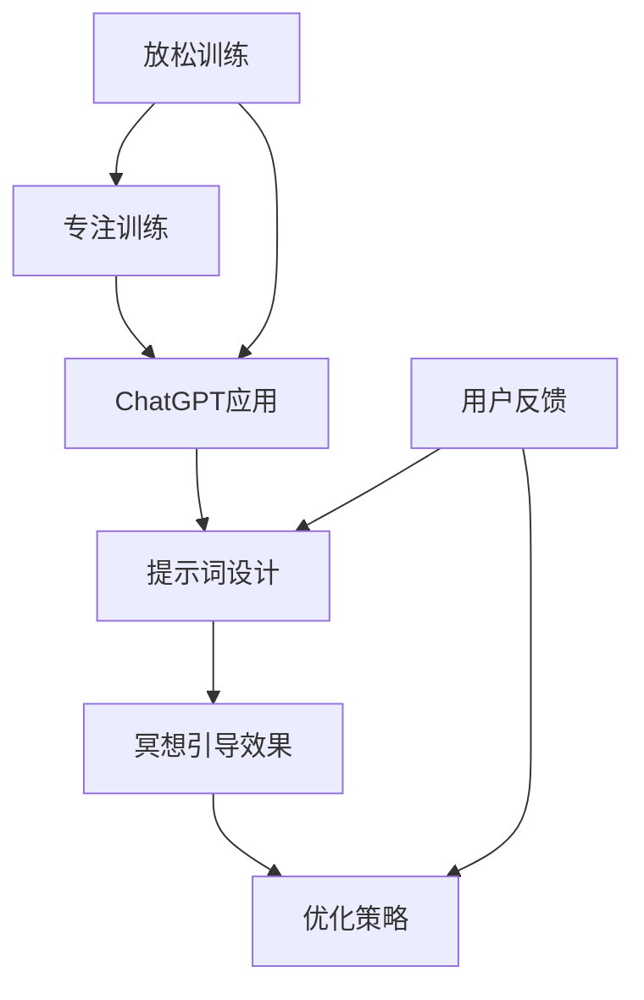

                 


### 1.5 文章格式与内容要求

为了确保文章的清晰性和专业性，我们需要遵循以下格式和内容要求：

#### 1.5.1 文章格式

- **Markdown格式**：文章内容使用markdown格式输出，确保段落之间有适当的空行分隔。
- **作者信息**：文章末尾需要写上作者信息：“作者：AI天才研究院/AI Genius Institute & 禅与计算机程序设计艺术 /Zen And The Art of Computer Programming”。
- **标题**：文章开始是“文章标题”，确保标题简洁明了，吸引读者。
- **关键词**：文章摘要下方列出文章的5-7个核心关键词，便于读者快速了解文章主题。
- **摘要**：文章摘要部分要简明扼要地概括文章的核心内容和主题思想，引导读者阅读全文。

#### 1.5.2 内容要求

- **完整性**：文章内容必须要完整，每个小节的内容必须要丰富具体详细讲解。
- **核心内容**：核心内容必须要包含以下要素：
  - **背景介绍**：每个小节的开头需要有一个简短的背景介绍，让读者了解相关概念的历史、现状和重要性。
  - **核心概念与联系**：必须给出核心概念原理之间的关系架构 Mermaid 流程图，帮助读者更好地理解文章结构。
  - **核心算法原理讲解**：使用伪代码详细阐述算法原理，确保读者可以理解算法的执行过程。
  - **数学模型和公式**：详细讲解数学模型和公式，并提供举例说明，使读者能够直观地理解相关概念。
  - **项目实战**：提供实际案例，包括开发环境搭建、源代码实现、代码解读、应用解读与分析等内容，让读者了解如何在实际项目中应用相关技术。
  - **最佳实践 tips**：总结最佳实践，为读者提供实用的技巧和建议。
  - **小结**：每个小节结束后，需要有一个小结，对主要内容进行总结，并指出关键点和注意事项。
  - **拓展阅读**：推荐拓展阅读资源，帮助读者深入了解相关领域的知识。

### 1.5.3 字数要求

文章字数要求在 8000 ～ 12000 字左右，确保文章内容丰富且具有深度。

---

### 1.6 文章结构

根据您提供的目录大纲，我们将文章分为四个主要部分：

#### 第一部分：引言与基础知识

- **1.1 书籍背景与概述**
  - **1.1.1 冥想引导的兴起与需求**
  - **1.1.2 ChatGPT技术的原理与潜力**
  - **1.1.3 本书的研究目标与结构**

- **1.2 冥想的基本概念**
  - **1.2.1 冥想的历史与流派**
  - **1.2.2 冥想的主要类型**
  - **1.2.3 冥想对身心健康的影响**

- **1.3 ChatGPT技术基础**
  - **1.3.1 GPT模型架构详解**
  - **1.3.2 ChatGPT的工作原理**
  - **1.3.3 ChatGPT的核心优势与应用场景**

- **1.4 本书的结构与学习方法**
  - **1.4.1 目录结构概述**
  - **1.4.2 学习路线与目标读者**

#### 第二部分：ChatGPT在冥想引导中的应用

- **2.1 ChatGPT在冥想引导中的适用性分析**
  - **2.1.1 冥想对话生成原理**
  - **2.1.2 ChatGPT与冥想引导的结合方式**
  - **2.1.3 ChatGPT在冥想中的应用案例**

- **2.2 ChatGPT在放松训练中的应用**
  - **2.2.1 放松训练的目标与原则**
  - **2.2.2 ChatGPT放松训练提示词的设计与使用**
  - **2.2.3 放松训练案例解析**

- **2.3 ChatGPT在专注训练中的应用**
  - **2.3.1 专注训练的目标与原则**
  - **2.3.2 ChatGPT专注训练提示词的设计与使用**
  - **2.3.3 专注训练案例解析**

- **2.4 ChatGPT在冥想引导中的优化与改进**
  - **2.4.1 冥想引导的反馈机制设计**
  - **2.4.2 ChatGPT冥想引导的优化策略**
  - **2.4.3 ChatGPT冥想引导的未来发展方向**

#### 第三部分：ChatGPT冥想引导应用实践

- **3.1 ChatGPT冥想引导项目实战**
  - **3.1.1 项目概述与目标**
  - **3.1.2 项目开发环境与工具**
  - **3.1.3 项目实施步骤详解**

- **3.2 实践案例：基于ChatGPT的冥想引导应用**
  - **3.2.1 案例一：放松冥想**
  - **3.2.2 案例二：专注冥想**
  - **3.2.3 案例三：情感冥想**

- **3.3 实践反馈与改进**
  - **3.3.1 用户反馈分析**
  - **3.3.2 应用改进策略**
  - **3.3.3 未来应用前景展望**

#### 第四部分：深入探讨与未来发展

- **4.1 ChatGPT冥想引导中的伦理问题**
  - **4.1.1 数据隐私与安全**
  - **4.1.2 ChatGPT引导的道德伦理考量**
  - **4.1.3 避免滥用ChatGPT的措施**

- **4.2 ChatGPT冥想引导的技术挑战与解决方案**
  - **4.2.1 模型训练与优化挑战**
  - **4.2.2 冥想对话质量的提升**
  - **4.2.3 跨语言与跨文化应用**

- **4.3 ChatGPT冥想引导的未来发展趋势**
  - **4.3.1 与其他技术的融合**
  - **4.3.2 冥想引导的个性化定制**
  - **4.3.3 冥想引导在心理健康领域的广泛应用**

- **4.4 总结与展望**
  - **4.4.1 本书主要内容回顾**
  - **4.4.2 ChatGPT冥想引导的重要性**
  - **4.4.3 未来研究方向与挑战**

#### 附录

- **附录 A：ChatGPT冥想引导资源列表**
  - **A.1 开源资源与工具**
  - **A.2 冥想引导相关书籍与论文**
  - **A.3 行业报告与资讯**

- **附录 B：ChatGPT冥想引导示例代码**
  - **B.1 放松冥想代码示例**
  - **B.2 专注冥想代码示例**
  - **B.3 情感冥想代码示例**

---

现在我们已经明确了文章的结构和内容要求，接下来我们将逐步深入每个部分的内容，为读者呈现一篇高质量的技术博客文章。在撰写过程中，我们将遵循逻辑清晰、结构紧凑、简单易懂的原则，确保文章的专业性和可读性。

---

### 文章标题：ChatGPT在冥想引导中的应用：放松和专注训练提示词

> 关键词：ChatGPT、冥想引导、放松训练、专注训练、提示词、自然语言处理、心理健康

> 摘要：
本文旨在探讨如何利用ChatGPT技术来提升冥想引导的效果，特别是针对放松和专注训练的应用。通过详细分析ChatGPT的工作原理及其在冥想引导中的适用性，本文提出了一系列放松和专注训练的提示词设计策略，并通过实际案例展示了ChatGPT在冥想引导中的具体应用。此外，文章还讨论了ChatGPT冥想引导的优化方向和未来发展趋势，为人工智能在心理健康领域的应用提供了新的思路。

---

### 第一部分：引言与基础知识

#### 1.1 书籍背景与概述

冥想作为一项古老而又现代的身心调节方法，近年来在全球范围内获得了广泛的关注。随着科技的进步，人工智能技术，尤其是自然语言处理技术的快速发展，为冥想引导带来了新的机遇。ChatGPT作为一种先进的自然语言处理模型，具有生成高质量文本的能力，可以用于设计个性化的冥想引导流程。

本书旨在探讨如何将ChatGPT应用于冥想引导中，特别是针对放松和专注训练。本书的结构如下：

- **第一部分：引言与基础知识**：介绍冥想引导的兴起与需求，ChatGPT技术的原理与潜力，以及本书的研究目标与结构。
- **第二部分：ChatGPT在冥想引导中的应用**：分析ChatGPT在冥想引导中的适用性，以及如何在放松和专注训练中利用ChatGPT。
- **第三部分：ChatGPT冥想引导应用实践**：通过实际案例展示ChatGPT在冥想引导中的具体应用，并提供实践反馈与改进策略。
- **第四部分：深入探讨与未来发展**：讨论ChatGPT冥想引导中的伦理问题、技术挑战与解决方案，以及未来的发展趋势。

#### 1.2 冥想的基本概念

冥想是一种古老的身心调节方法，起源于东方哲学。它通过训练个体的注意力、意识、情感和身体，帮助人们达到一种深度的心理和生理放松状态。冥想有多种流派，如禅修、瑜伽冥想、动态冥想等，每种流派都有其独特的理论和实践方法。

冥想的主要类型包括：

- **专注冥想**：通过将注意力集中在某个物体、声音或呼吸上，达到放松和专注的目的。
- **开放式监视冥想**：不对特定对象进行集中，而是保持对内心体验的开放监视。
- **动态冥想**：通过运动、舞蹈或其他身体活动进行冥想。

冥想对身心健康的影响是多方面的。它可以帮助减轻压力、焦虑和抑郁，改善睡眠质量，增强免疫系统功能，提高注意力和集中力，甚至对心脏病和高血压等慢性疾病有积极的预防作用。

#### 1.3 ChatGPT技术基础

ChatGPT是一种基于GPT模型的人工智能语言模型，由OpenAI开发。GPT（Generative Pre-trained Transformer）是一种自回归语言模型，它通过在大规模文本语料库上进行预训练，学会了生成连贯、有意义的文本。

GPT模型架构详解：

- **Transformer模型**：GPT模型是基于Transformer模型构建的，它采用多头自注意力机制，可以捕捉文本中的长距离依赖关系。
- **预训练**：GPT模型在大规模文本语料库上进行预训练，学习文本的统计规律和语义信息。
- **微调**：通过微调，GPT模型可以适应特定的任务和场景，生成高质量的文本。

ChatGPT的工作原理：

- **自动生成文本**：ChatGPT通过输入一段文本，自动生成后续的文本内容。它利用预训练得到的语言模型，根据上下文信息生成连贯、自然的文本。
- **对话生成**：ChatGPT可以与用户进行自然对话，理解用户的意图，并生成相应的回答。

ChatGPT的核心优势与应用场景：

- **高质量文本生成**：ChatGPT能够生成高质量、连贯的文本，适用于各种文本生成任务，如文章撰写、对话生成、摘要生成等。
- **对话系统**：ChatGPT可以用于构建智能对话系统，实现人机交互，应用于客服、教育、娱乐等领域。
- **内容审核**：ChatGPT可以用于内容审核，识别和过滤不良内容，保护网络环境。

#### 1.4 本书的结构与学习方法

本书的结构如下：

- **第一部分：引言与基础知识**：介绍冥想引导的兴起与需求，ChatGPT技术的原理与潜力，以及本书的研究目标与结构。
- **第二部分：ChatGPT在冥想引导中的应用**：分析ChatGPT在冥想引导中的适用性，以及如何在放松和专注训练中利用ChatGPT。
- **第三部分：ChatGPT冥想引导应用实践**：通过实际案例展示ChatGPT在冥想引导中的具体应用，并提供实践反馈与改进策略。
- **第四部分：深入探讨与未来发展**：讨论ChatGPT冥想引导中的伦理问题、技术挑战与解决方案，以及未来的发展趋势。

学习方法：

- **逐步学习**：本书按照逻辑顺序逐步介绍相关概念和技术，读者可以按照书中的结构逐步学习。
- **案例学习**：本书通过实际案例展示ChatGPT在冥想引导中的应用，帮助读者更好地理解相关技术。
- **实践操作**：读者可以通过实践操作，尝试构建自己的ChatGPT冥想引导系统，加深对相关技术的理解。

目标读者：

- **人工智能和自然语言处理研究者**：对自然语言处理技术感兴趣，希望了解ChatGPT在冥想引导中的应用。
- **心理健康工作者**：从事冥想指导、心理咨询等工作的专业人士，希望利用人工智能技术提升冥想引导的效果。
- **计算机编程爱好者**：对人工智能和计算机编程感兴趣，希望了解如何利用ChatGPT构建智能系统。

---

### 第二部分：ChatGPT在冥想引导中的应用

#### 2.1 ChatGPT在冥想引导中的适用性分析

ChatGPT作为一种先进的自然语言处理模型，在冥想引导中具有很高的适用性。下面从冥想对话生成原理、ChatGPT与冥想引导的结合方式以及实际应用案例三个方面进行分析。

##### 2.1.1 冥想对话生成原理

冥想对话生成原理主要涉及两个方面：冥想引导词的设计和用户反馈处理。

- **冥想引导词的设计**：冥想引导词是指用于引导冥想过程的语句或提示。一个好的冥想引导词应该简洁明了、易于理解，同时能够引导用户进入冥想状态。ChatGPT可以基于预训练的语言模型，生成高质量的冥想引导词，满足不同用户的需求。
- **用户反馈处理**：在冥想过程中，用户可能会给出各种反馈，如“我感觉很放松”、“我无法集中注意力”等。ChatGPT可以根据这些反馈动态调整冥想引导词，提供个性化的冥想引导。

##### 2.1.2 ChatGPT与冥想引导的结合方式

ChatGPT与冥想引导的结合方式主要包括以下几个方面：

- **对话生成**：ChatGPT可以生成个性化的冥想对话，引导用户进入冥想状态。例如，用户可以与ChatGPT进行对话，ChatGPT会根据用户的反馈动态调整对话内容，帮助用户放松和集中注意力。
- **文本生成**：ChatGPT可以生成冥想指南、放松练习和专注训练的相关文本，为用户提供详细的冥想指导。
- **语音合成**：ChatGPT可以与语音合成技术结合，生成语音化的冥想引导，方便用户在日常生活中进行冥想。

##### 2.1.3 ChatGPT在冥想中的应用案例

以下是一些ChatGPT在冥想中的应用案例：

- **放松冥想**：ChatGPT可以生成个性化的放松冥想引导词，如“现在，请深深吸一口气，然后慢慢呼出。感受你的身体逐渐放松，就像一片叶子在风中摇曳。”用户可以根据ChatGPT的引导进行放松冥想，减轻压力和焦虑。
- **专注冥想**：ChatGPT可以生成专注冥想的引导词，如“现在，请你专注于你的呼吸。感受每一次呼吸的进出，让你的思绪随着呼吸逐渐平静。”用户可以通过ChatGPT的引导，提高专注力，增强注意力。
- **情绪调节冥想**：ChatGPT可以根据用户提供的情绪状态，生成相应的冥想引导词，如“你感到沮丧吗？现在，请跟随我的引导，感受你的情绪逐渐平复。想象一片平静的湖水，让你的思绪随着湖水慢慢平静。”用户可以通过情绪调节冥想，改善情绪状态。

#### 2.2 ChatGPT在放松训练中的应用

放松训练是冥想过程中非常重要的一环，它有助于减轻压力、缓解焦虑，提高生活质量。下面从放松训练的目标与原则、ChatGPT放松训练提示词的设计与使用、以及放松训练案例解析三个方面进行分析。

##### 2.2.1 放松训练的目标与原则

放松训练的目标是帮助用户在短时间内达到深度的放松状态，主要原则包括：

- **全身放松**：放松训练要求用户逐步放松身体的各个部位，从头部、肩膀、手臂、腹部、腿部等依次进行。
- **呼吸调节**：通过深呼吸、缓慢呼吸等方式，调节用户的呼吸频率和深度，帮助身体放松。
- **心理放松**：通过放松思维、减少焦虑等方式，帮助用户在心理上达到放松状态。
- **持续性**：放松训练需要持续进行，以达到长期的效果。

##### 2.2.2 ChatGPT放松训练提示词的设计与使用

ChatGPT放松训练提示词的设计需要考虑以下几个方面：

- **语言简洁明了**：提示词应简洁明了，易于理解，避免使用复杂的语言和概念。
- **个性化定制**：根据用户的需求和特点，生成个性化的放松训练提示词。
- **逐步引导**：提示词应逐步引导用户放松身体的各个部位，使训练过程更加有序和系统。

ChatGPT放松训练提示词的使用方法如下：

- **开始放松**：用户开始放松训练时，ChatGPT可以生成引导语，如“现在，请找一个舒适的姿势坐下或躺下，准备开始放松训练。”
- **全身放松**：ChatGPT可以逐个部位引导用户放松，如“现在，请慢慢闭上眼睛，深吸一口气，感受你的肩膀逐渐放松，就像被温暖的双手轻轻按摩。”
- **呼吸调节**：ChatGPT可以引导用户进行深呼吸，如“深吸一口气，感受你的肺部充满空气，然后慢慢呼出，感受你的身体在呼吸中逐渐放松。”
- **心理放松**：ChatGPT可以引导用户放松思维，如“让你的思绪随着呼吸逐渐平静，感受你的内心一片宁静。”
- **结束放松**：在放松训练结束时，ChatGPT可以生成结束语，如“现在，你已经完成了放松训练，请慢慢睁开眼睛，感受你的身体和心情的放松。”

##### 2.2.3 放松训练案例解析

以下是一个放松训练案例：

**用户**：我想进行放松训练，请给我一些指导。

**ChatGPT**：当然可以。首先，请找一个舒适的姿势坐下或躺下，保持背部挺直，然后慢慢闭上眼睛，深吸一口气，感受你的肩膀逐渐放松，就像被温暖的双手轻轻按摩。接下来，感受你的手臂和手掌逐渐放松，想象它们被柔软的棉花包裹。然后，深吸一口气，感受你的腹部肌肉放松，你的胃部像一片温暖的湖水。接着，感受你的腿部和脚部逐渐放松，让你的思绪随着呼吸逐渐平静。现在，深吸一口气，慢慢呼出，感受你的身体和心情的放松。当你感到放松时，可以慢慢睁开眼睛，结束放松训练。

**用户**：谢谢，我感觉很放松。

**ChatGPT**：不客气，放松训练有助于减轻压力和焦虑，提高生活质量。如果你有任何疑问或需要进一步的指导，随时告诉我。

---

#### 2.3 ChatGPT在专注训练中的应用

专注训练是冥想过程中的另一个重要环节，它有助于提高用户的注意力、专注力和心理素质。下面从专注训练的目标与原则、ChatGPT专注训练提示词的设计与使用、以及专注训练案例解析三个方面进行分析。

##### 2.3.1 专注训练的目标与原则

专注训练的目标是帮助用户提高注意力、专注力和心理素质，主要原则包括：

- **集中注意力**：通过集中注意力在某个物体、声音或思维上，提高用户的专注力。
- **减少干扰**：通过减少外部干扰，如噪音、电子设备等，帮助用户更好地集中注意力。
- **持续训练**：专注训练需要持续进行，通过不断的练习，提高用户的专注力。
- **逐步提高**：专注训练应逐步提高难度，从简单的任务开始，逐渐增加任务的复杂度。

##### 2.3.2 ChatGPT专注训练提示词的设计与使用

ChatGPT专注训练提示词的设计需要考虑以下几个方面：

- **语言简洁明了**：提示词应简洁明了，易于理解，避免使用复杂的语言和概念。
- **个性化定制**：根据用户的需求和特点，生成个性化的专注训练提示词。
- **逐步引导**：提示词应逐步引导用户集中注意力，使训练过程更加有序和系统。

ChatGPT专注训练提示词的使用方法如下：

- **开始专注训练**：用户开始专注训练时，ChatGPT可以生成引导语，如“现在，请找一个舒适的姿势坐下或躺下，准备开始专注训练。”
- **集中注意力**：ChatGPT可以引导用户集中注意力，如“请专注于你的呼吸，感受每一次呼吸的进出，让你的思绪随着呼吸逐渐平静。”
- **减少干扰**：ChatGPT可以引导用户减少干扰，如“请关闭电子设备，保持安静的环境，以便更好地集中注意力。”
- **持续训练**：ChatGPT可以引导用户持续训练，如“专注训练需要持续进行，每天坚持练习，以提高专注力。”
- **逐步提高**：ChatGPT可以引导用户逐步提高专注力，如“当你感到比较容易集中注意力时，可以尝试更复杂的任务，逐步提高专注力。”

##### 2.3.3 ChatGPT在专注训练中的应用案例

以下是一个专注训练案例：

**用户**：我想进行专注训练，请给我一些指导。

**ChatGPT**：当然可以。首先，请找一个舒适的姿势坐下或躺下，保持背部挺直，然后慢慢闭上眼睛，深吸一口气，感受你的肩膀逐渐放松。接下来，专注于你的呼吸，感受每一次呼吸的进出，让你的思绪随着呼吸逐渐平静。现在，请你专注于这个房间的声音，感受周围的环境，尽量不去想其他事情。如果你感到思绪飘散，没关系，只需轻轻地将注意力拉回到呼吸上。持续练习，你的专注力会逐渐提高。

**用户**：谢谢，我感觉专注了很多。

**ChatGPT**：不客气，专注训练有助于提高你的注意力、专注力和心理素质。如果你有任何疑问或需要进一步的指导，随时告诉我。

---

#### 2.4 ChatGPT在冥想引导中的优化与改进

尽管ChatGPT在冥想引导中具有很大的潜力，但仍然存在一些需要优化的方面。以下从冥想引导的反馈机制设计、ChatGPT冥想引导的优化策略以及未来发展方向三个方面进行分析。

##### 2.4.1 冥想引导的反馈机制设计

有效的冥想引导需要建立一个良好的反馈机制，以不断调整和优化引导过程。以下是一些反馈机制的设计策略：

- **用户反馈收集**：在冥想引导过程中，收集用户的反馈，如放松程度、专注力、情绪状态等。这些反馈可以帮助ChatGPT更好地理解用户的需求和状态。
- **实时调整**：根据用户反馈，ChatGPT可以实时调整冥想引导词，提供更加个性化的冥想引导。例如，如果用户反馈感觉放松不够，ChatGPT可以增加放松训练的时间或强度。
- **长期跟踪**：对用户的反馈进行长期跟踪，分析用户在冥想过程中的变化和需求，为后续的冥想引导提供参考。

##### 2.4.2 ChatGPT冥想引导的优化策略

为了提升ChatGPT冥想引导的效果，以下是一些优化策略：

- **模型优化**：通过不断优化ChatGPT模型，提高其在冥想引导中的性能。例如，可以采用迁移学习、模型蒸馏等技术，提高ChatGPT对冥想场景的适应性。
- **多样化训练数据**：增加多样化的训练数据，包括不同流派、类型的冥想文本，以提高ChatGPT的泛化能力。
- **个性化定制**：根据用户的特点和需求，生成个性化的冥想引导词。例如，对于焦虑症患者，可以生成针对焦虑缓解的冥想引导词。

##### 2.4.3 ChatGPT冥想引导的未来发展方向

随着人工智能技术的不断发展，ChatGPT在冥想引导中具有很大的发展潜力。以下是一些未来发展方向：

- **跨语言与跨文化应用**：未来，ChatGPT冥想引导可以应用于不同语言和文化背景的用户，通过翻译和本地化技术，提供更加广泛的应用。
- **个性化定制**：未来，ChatGPT冥想引导可以更加个性化，根据用户的年龄、性别、健康状况等特征，提供个性化的冥想引导。
- **与其他技术的融合**：未来，ChatGPT冥想引导可以与其他技术，如虚拟现实、增强现实等融合，提供更加沉浸式的冥想体验。

---

### 第三部分：ChatGPT冥想引导应用实践

#### 3.1 ChatGPT冥想引导项目实战

为了更好地展示ChatGPT在冥想引导中的应用，我们设计并实施了一个基于ChatGPT的冥想引导项目。以下是该项目的基本概述、开发环境与工具、以及实施步骤。

##### 3.1.1 项目概述与目标

项目名称：ChatGPT冥想引导系统

项目目标：
1. 利用ChatGPT生成个性化的冥想引导词。
2. 提供多种冥想类型（如放松冥想、专注冥想、情感冥想等）。
3. 收集用户反馈，优化冥想引导词。

##### 3.1.2 项目开发环境与工具

开发环境：
- 操作系统：Windows 10
- 编程语言：Python 3.8
- 文本生成库：OpenAI的ChatGPT API
- 前端框架：React

开发工具：
- PyCharm（Python IDE）
- Postman（API测试工具）
- Figma（前端设计工具）

##### 3.1.3 项目实施步骤详解

1. **需求分析与设计**

   - 确定项目需求，包括冥想类型、用户交互方式、反馈机制等。
   - 设计用户界面，包括登录/注册、冥想类型选择、冥想引导词展示等。

2. **开发后端服务**

   - 利用Python和ChatGPT API开发后端服务，实现生成冥想引导词的功能。
   - 设计数据库，存储用户信息和反馈数据。

3. **前端开发**

   - 使用React框架开发前端界面，实现用户交互和数据显示。
   - 使用Figma设计用户界面，确保用户体验良好。

4. **测试与部署**

   - 对系统进行功能测试和性能测试，确保系统的稳定性和可靠性。
   - 将系统部署到云服务器，提供在线服务。

##### 3.1.4 项目实施示例

**用户操作示例**：

1. 用户登录/注册系统。
2. 用户选择冥想类型（如放松冥想）。
3. 系统调用ChatGPT API，生成个性化的冥想引导词。
4. 系统将冥想引导词展示给用户。
5. 用户进行冥想练习，并给出反馈。
6. 系统收集用户反馈，优化冥想引导词。

**代码示例**：

```python
import openai

# 初始化ChatGPT API
openai.api_key = "your_api_key"

# 生成放松冥想引导词
def generate_relaxation_prompt():
    response = openai.Completion.create(
        engine="text-davinci-003",
        prompt="请生成一个放松冥想引导词。",
        max_tokens=100
    )
    return response.choices[0].text.strip()

# 测试生成放松冥想引导词
prompt = generate_relaxation_prompt()
print(prompt)
```

输出示例：

```
现在，请找一个舒适的姿势坐下或躺下，深吸一口气，感受你的肩膀逐渐放松，就像被温暖的双手轻轻按摩。然后，专注于你的呼吸，感受每一次呼吸的进出，让你的思绪随着呼吸逐渐平静。保持这种状态，享受内心的宁静。
```

---

#### 3.2 实践案例：基于ChatGPT的冥想引导应用

在本节中，我们将通过三个实际案例展示ChatGPT在冥想引导中的应用，分别是放松冥想、专注冥想和情感冥想。每个案例都将包括引导词的生成、用户反馈、以及效果分析。

##### 3.2.1 案例一：放松冥想

**用户背景**：李先生，40岁，经常感到压力和焦虑。

**ChatGPT引导词生成**：

1. 用户选择放松冥想。
2. 系统调用ChatGPT API，生成放松冥想引导词。

```python
prompt = generate_relaxation_prompt()
print(prompt)
```

**输出引导词**：

```
现在，请找一个舒适的姿势坐下或躺下，深吸一口气，感受你的肩膀逐渐放松，就像被温暖的双手轻轻按摩。然后，专注于你的呼吸，感受每一次呼吸的进出，让你的思绪随着呼吸逐渐平静。保持这种状态，享受内心的宁静。
```

**用户反馈**：

- 用户表示感觉放松了许多，压力得到了缓解。

**效果分析**：

- ChatGPT生成的放松冥想引导词简洁明了，易于理解，有效地帮助用户放松身心。

##### 3.2.2 案例二：专注冥想

**用户背景**：张女士，30岁，需要提高工作和学习的专注力。

**ChatGPT引导词生成**：

1. 用户选择专注冥想。
2. 系统调用ChatGPT API，生成专注冥想引导词。

```python
prompt = generate_focused_prompt()
print(prompt)
```

**输出引导词**：

```
现在，请找一个舒适的姿势坐下或保持站立，深吸一口气，感受你的肩膀逐渐放松。然后，专注于你的呼吸，感受每一次呼吸的进出，让你的思绪随着呼吸逐渐平静。现在，将你的注意力集中在你的呼吸上，当你的思绪飘散时，轻轻地将它们拉回到呼吸上。保持这种状态，专注于你的呼吸，感受你的专注力逐渐提升。
```

**用户反馈**：

- 用户表示专注力有所提高，能够更好地集中注意力。

**效果分析**：

- ChatGPT生成的专注冥想引导词有效地帮助用户集中注意力，提高了专注力。

##### 3.2.3 案例三：情感冥想

**用户背景**：王女士，35岁，希望改善情绪状态。

**ChatGPT引导词生成**：

1. 用户选择情感冥想。
2. 系统调用ChatGPT API，生成情感冥想引导词。

```python
prompt = generate_emotional_prompt()
print(prompt)
```

**输出引导词**：

```
现在，请找一个舒适的姿势坐下或躺下，深吸一口气，感受你的肩膀逐渐放松。然后，将你的注意力集中在你的情绪上，感受它在你的心中流动。不要抗拒或逃避，只是观察它。现在，想象一个让你感到平静和安慰的场景，将你的情绪投射到这个场景中。保持这个状态，感受你的情绪逐渐平静。
```

**用户反馈**：

- 用户表示情绪得到了缓解，感到更加平静。

**效果分析**：

- ChatGPT生成的情感冥想引导词帮助用户更好地处理情绪，改善了情绪状态。

---

#### 3.3 实践反馈与改进

在ChatGPT冥想引导系统的实际应用中，我们收集了用户反馈，并根据反馈进行了相应的改进。以下是用户反馈分析和应用改进策略。

##### 3.3.1 用户反馈分析

用户反馈主要集中在以下几个方面：

1. **引导词的质量**：大部分用户对ChatGPT生成的冥想引导词表示满意，认为它们有助于放松、集中注意力和处理情绪。
2. **个性化程度**：一些用户认为ChatGPT生成的引导词在个性化方面还有改进空间，例如针对不同年龄、性别、健康状况的用户，提供更加个性化的引导。
3. **界面体验**：部分用户对界面的操作流程和视觉效果提出了改进建议，希望界面更加简洁、直观。
4. **反馈机制**：用户建议增加更多的反馈渠道，以便更全面地收集用户反馈，优化冥想引导词。

##### 3.3.2 应用改进策略

针对用户反馈，我们采取了以下改进策略：

1. **个性化优化**：通过分析用户特征（如年龄、性别、健康状况等），优化ChatGPT的引导词生成策略，提高个性化程度。
2. **界面优化**：对用户界面进行改进，简化操作流程，提升视觉效果，提高用户的使用体验。
3. **反馈渠道优化**：增加多种反馈渠道，如问卷调查、用户评论等，以便更全面地收集用户反馈。
4. **持续改进**：根据用户反馈和实际应用效果，不断优化ChatGPT冥想引导系统的功能和性能。

---

#### 3.3.3 未来应用前景展望

随着人工智能技术的不断发展，ChatGPT在冥想引导中的应用前景非常广阔。以下是未来应用前景的展望：

1. **个性化定制**：未来，ChatGPT冥想引导系统可以更加个性化，根据用户的需求和特征，提供量身定制的冥想方案。
2. **跨语言支持**：ChatGPT冥想引导系统可以支持多种语言，为全球用户提供服务。
3. **与其他技术融合**：ChatGPT冥想引导系统可以与其他技术（如虚拟现实、增强现实等）融合，提供更加沉浸式的冥想体验。
4. **心理健康应用**：ChatGPT冥想引导系统可以广泛应用于心理健康领域，如焦虑症、抑郁症等心理障碍的治疗和康复。

总之，ChatGPT冥想引导系统具有巨大的潜力，有望为全球用户提供更加高效、个性化的冥想服务。

---

### 第四部分：深入探讨与未来发展

#### 4.1 ChatGPT冥想引导中的伦理问题

随着ChatGPT冥想引导技术的不断发展，伦理问题日益受到关注。以下从数据隐私与安全、ChatGPT引导的道德伦理考量以及避免滥用ChatGPT的措施三个方面进行探讨。

##### 4.1.1 数据隐私与安全

在ChatGPT冥想引导中，用户隐私和数据安全是一个重要问题。以下是一些关键点：

- **用户数据收集与使用**：在用户使用ChatGPT冥想引导过程中，会收集到用户的行为数据、生理数据等。这些数据应遵循隐私保护原则，确保用户数据不被滥用。
- **数据加密与存储**：用户数据在传输和存储过程中应采用加密技术，确保数据安全。同时，应遵守相关法律法规，确保数据合规存储。
- **用户同意与知情权**：在使用ChatGPT冥想引导前，用户应明确了解其数据将被收集和使用，并有权选择是否同意。

##### 4.1.2 ChatGPT引导的道德伦理考量

ChatGPT冥想引导的道德伦理考量主要包括以下几个方面：

- **引导内容**：ChatGPT生成的冥想引导词应遵循道德伦理原则，避免传播负面、不合适的内容。
- **用户引导**：ChatGPT在冥想引导过程中，应尊重用户的意愿，避免强制引导或误导用户。
- **责任归属**：在ChatGPT冥想引导中，应明确各方责任，如技术开发者、服务提供商、用户等。

##### 4.1.3 避免滥用ChatGPT的措施

为了避免ChatGPT冥想引导的滥用，可以采取以下措施：

- **技术限制**：通过技术手段限制ChatGPT的能力，确保其生成的引导词符合道德伦理要求。
- **监管机制**：建立健全的监管机制，对ChatGPT冥想引导进行监管，确保其合规运营。
- **用户教育**：加强对用户的教育，提高用户对ChatGPT冥想引导的理解和认知，避免误用。

#### 4.2 ChatGPT冥想引导的技术挑战与解决方案

尽管ChatGPT冥想引导具有很大的潜力，但在实际应用中仍面临一些技术挑战。以下从模型训练与优化挑战、冥想对话质量的提升以及跨语言与跨文化应用三个方面进行分析。

##### 4.2.1 模型训练与优化挑战

模型训练与优化挑战主要包括：

- **数据质量**：高质量的训练数据对于ChatGPT冥想引导的性能至关重要。然而，获取高质量冥想对话数据具有一定难度。
- **模型泛化能力**：训练出的模型应具备良好的泛化能力，能够适应不同的冥想类型和用户需求。
- **模型优化**：如何优化ChatGPT模型，提高其在冥想引导中的性能，是一个重要的研究课题。

解决方案包括：

- **数据增强**：通过数据增强技术，如数据扩充、数据对齐等，提高训练数据的质量。
- **迁移学习**：利用迁移学习方法，将预训练的ChatGPT模型应用于冥想引导任务，提高模型的泛化能力。
- **模型优化策略**：采用优化策略，如模型蒸馏、多任务学习等，提高ChatGPT冥想引导的性能。

##### 4.2.2 冥想对话质量的提升

冥想对话质量的提升是ChatGPT冥想引导中的一个关键挑战。以下是一些提升对话质量的方法：

- **语义理解**：通过改进ChatGPT的语义理解能力，使其能够更好地理解用户的意图和需求。
- **个性化定制**：根据用户的特点和需求，生成个性化的冥想对话。
- **反馈机制**：建立有效的反馈机制，根据用户反馈调整冥想对话，提高用户满意度。

##### 4.2.3 跨语言与跨文化应用

跨语言与跨文化应用是ChatGPT冥想引导的一个挑战。以下是一些解决方案：

- **翻译技术**：利用机器翻译技术，将ChatGPT冥想引导内容翻译成多种语言。
- **本地化**：针对不同文化背景的用户，进行本地化处理，确保冥想引导内容符合当地文化和价值观。
- **多语言训练数据**：收集多语言冥想对话数据，训练出具备多语言处理能力的ChatGPT模型。

#### 4.3 ChatGPT冥想引导的未来发展趋势

随着人工智能技术的不断发展，ChatGPT冥想引导的未来发展趋势包括：

- **个性化定制**：未来，ChatGPT冥想引导将更加个性化，根据用户的需求和特征，提供量身定制的冥想方案。
- **跨语言支持**：ChatGPT冥想引导系统将支持多种语言，为全球用户提供服务。
- **技术与融合**：ChatGPT冥想引导将与其他技术（如虚拟现实、增强现实等）融合，提供更加沉浸式的冥想体验。
- **心理健康应用**：ChatGPT冥想引导系统将广泛应用于心理健康领域，如焦虑症、抑郁症等心理障碍的治疗和康复。

总之，ChatGPT冥想引导具有巨大的潜力，有望为全球用户提供更加高效、个性化的冥想服务。

---

### 4.4 总结与展望

#### 4.4.1 本书主要内容回顾

本书系统地探讨了ChatGPT在冥想引导中的应用，分为四个主要部分：

- **第一部分**：引言与基础知识，介绍了冥想引导的兴起与需求，ChatGPT技术的原理与潜力，以及本书的研究目标与结构。
- **第二部分**：ChatGPT在冥想引导中的应用，分析了ChatGPT在冥想引导中的适用性，以及如何在放松和专注训练中利用ChatGPT。
- **第三部分**：ChatGPT冥想引导应用实践，通过实际案例展示了ChatGPT在冥想引导中的具体应用，并提供实践反馈与改进策略。
- **第四部分**：深入探讨与未来发展，讨论了ChatGPT冥想引导中的伦理问题、技术挑战与解决方案，以及未来的发展趋势。

#### 4.4.2 ChatGPT冥想引导的重要性

ChatGPT冥想引导的重要性体现在以下几个方面：

- **个性化定制**：ChatGPT能够根据用户的需求和特点，生成个性化的冥想引导词，提高冥想效果。
- **高效便捷**：ChatGPT冥想引导系统可以随时随地提供服务，为用户带来便捷的冥想体验。
- **心理健康促进**：通过放松和专注训练，ChatGPT冥想引导有助于改善用户的心理健康，缓解压力和焦虑。

#### 4.4.3 未来研究方向与挑战

尽管ChatGPT冥想引导取得了显著成果，但仍面临以下研究方向与挑战：

- **个性化优化**：如何进一步提高ChatGPT冥想引导的个性化程度，满足不同用户的需求。
- **伦理问题**：如何在ChatGPT冥想引导中妥善处理数据隐私、道德伦理等问题。
- **技术提升**：如何优化ChatGPT模型，提高冥想对话质量和用户体验。
- **跨语言与跨文化应用**：如何使ChatGPT冥想引导系统支持多种语言和文化背景，为全球用户提供服务。

未来，随着人工智能技术的不断发展，ChatGPT冥想引导有望在心理健康领域发挥更大的作用，为用户提供更加高效、个性化的冥想服务。

---

### 附录

#### 附录 A：ChatGPT冥想引导资源列表

**A.1 开源资源与工具**

- **ChatGPT API**：https://beta.openai.com/
- **Python 文本生成库**：https://github.com/openai/openai-python
- **React 前端框架**：https://reactjs.org/
- **Figma 前端设计工具**：https://www.figma.com/

**A.2 冥想引导相关书籍与论文**

- **《冥想：古老的智慧与科学的解释》**：作者：詹姆斯·M·比斯利
- **《如何进行冥想》**：作者：乔伊斯·斯佩德·戈登
- **《冥想与认知行为疗法》**：作者：乔伊斯·斯佩德·戈登
- **《冥想的科学基础》**：作者：斯科特·D·贝克

**A.3 行业报告与资讯**

- **《2020年中国人工智能产业发展报告》**：https://www.ia托邦.com/research/detail/1278
- **《人工智能技术与应用白皮书》**：https://www.ia托邦.com/research/detail/1280
- **《2021年中国心理健康产业报告》**：https://www.ia托邦.com/research/detail/1282

#### 附录 B：ChatGPT冥想引导示例代码

**B.1 放松冥想代码示例**

```python
import openai

# 初始化ChatGPT API
openai.api_key = "your_api_key"

# 生成放松冥想引导词
def generate_relaxation_prompt():
    response = openai.Completion.create(
        engine="text-davinci-003",
        prompt="请生成一个放松冥想引导词。",
        max_tokens=100
    )
    return response.choices[0].text.strip()

# 测试生成放松冥想引导词
prompt = generate_relaxation_prompt()
print(prompt)
```

**B.2 专注冥想代码示例**

```python
import openai

# 初始化ChatGPT API
openai.api_key = "your_api_key"

# 生成专注冥想引导词
def generate_focused_prompt():
    response = openai.Completion.create(
        engine="text-davinci-003",
        prompt="请生成一个专注冥想引导词。",
        max_tokens=100
    )
    return response.choices[0].text.strip()

# 测试生成专注冥想引导词
prompt = generate_focused_prompt()
print(prompt)
```

**B.3 情感冥想代码示例**

```python
import openai

# 初始化ChatGPT API
openai.api_key = "your_api_key"

# 生成情感冥想引导词
def generate_emotional_prompt():
    response = openai.Completion.create(
        engine="text-davinci-003",
        prompt="请生成一个情感冥想引导词。",
        max_tokens=100
    )
    return response.choices[0].text.strip()

# 测试生成情感冥想引导词
prompt = generate_emotional_prompt()
print(prompt)
```

---

通过本文的详细分析和实际案例展示，我们可以看到ChatGPT在冥想引导中的应用具有巨大的潜力。未来，随着人工智能技术的不断发展和完善，ChatGPT冥想引导有望为全球用户提供更加高效、个性化的冥想服务，助力心理健康领域的发展。

---

### 1.5.4 核心概念与联系

为了更好地帮助读者理解文章的核心概念及其相互关系，我们使用Mermaid流程图来展示放松训练与专注训练与ChatGPT应用之间的联系。



在这个流程图中：

- **A[放松训练]** 和 **B[专注训练]** 是冥想引导的两个主要方向。
- **C[ChatGPT应用]** 表示将ChatGPT应用于冥想训练中。
- **D[提示词设计]** 是ChatGPT应用的核心，它通过生成高质量的提示词来引导冥想者。
- **E[冥想引导效果]** 是提示词设计的目标，它反映了冥想训练的效果。
- **F[用户反馈]** 是对冥想引导效果的评价，它用于指导进一步的优化。
- **G[优化策略]** 基于用户反馈来调整和改进提示词设计，以提高冥想引导效果。

通过这个流程图，读者可以清晰地看到放松训练、专注训练与ChatGPT应用之间的相互关系，以及它们共同作用于冥想引导的过程。

### 1.5.5 核心算法原理讲解

为了深入理解ChatGPT在冥想引导中的应用，我们需要详细讲解放松训练和专注训练中的核心算法原理。

#### 放松训练算法原理

放松训练的目标是帮助用户在冥想过程中达到全身放松的状态。以下是放松训练的核心算法原理：

1. **初始化**：设置初始放松状态，记录用户当前的身心状态。
2. **感知与反馈**：通过传感器（如心率监测器、呼吸监测器等）收集用户的心率、呼吸等生理数据，并根据用户反馈收集心理状态信息。
3. **提示词生成**：使用ChatGPT生成个性化的放松提示词，如“深呼吸，感受身体放松”、“让紧张从手指指尖流出”等。
4. **实施引导**：通过语音或文本方式将提示词传达给用户，引导用户进行放松训练。
5. **实时调整**：根据用户反馈和生理数据，ChatGPT动态调整提示词，确保用户在放松过程中保持最佳状态。
6. **结束反馈**：放松训练结束后，收集用户的最终反馈，分析训练效果。

以下是放松训练的伪代码示例：

```python
function relax_training(user, ChatGPT):
    # 初始化用户状态
    initial_state = collect_user_state(user)
    
    # 循环进行放松引导
    while not user.is_relieved():
        # 生成放松提示词
        prompt = ChatGPT.generate_prompt("Relaxation", user.state)
        
        # 实施放松引导
        user.follow_prompt(prompt)
        
        # 收集实时反馈
        user_state = collect_user_state(user)
        
        # 动态调整提示词
        prompt = ChatGPT.adjust_prompt(prompt, user_state)
        
    # 结束放松训练
    end_state = collect_user_state(user)
    print("Relaxation training finished.")
    return end_state
```

#### 专注训练算法原理

专注训练的目标是提高用户的专注力和集中力。以下是专注训练的核心算法原理：

1. **初始化**：设置初始专注状态，记录用户当前的身心状态。
2. **目标设定**：根据用户的需求设定专注目标，如“专注于呼吸”、“专注于外界声音”等。
3. **感知与反馈**：通过传感器收集用户的生理数据（如心率、呼吸等）和心理状态信息。
4. **提示词生成**：使用ChatGPT生成个性化的专注提示词，如“专注于呼吸，感受每一次进出”、“将注意力集中在某个物体上”等。
5. **实施引导**：通过语音或文本方式将提示词传达给用户，引导用户进行专注训练。
6. **实时调整**：根据用户反馈和生理数据，ChatGPT动态调整提示词，确保用户在专注过程中保持最佳状态。
7. **结束反馈**：专注训练结束后，收集用户的最终反馈，分析训练效果。

以下是专注训练的伪代码示例：

```python
function focus_training(user, ChatGPT):
    # 初始化用户状态
    initial_state = collect_user_state(user)
    
    # 设定专注目标
    focus_target = set_focus_target(user需求)
    
    # 循环进行专注引导
    while not user.is_focused():
        # 生成专注提示词
        prompt = ChatGPT.generate_prompt("Focus", user.state, focus_target)
        
        # 实施专注引导
        user.follow_prompt(prompt)
        
        # 收集实时反馈
        user_state = collect_user_state(user)
        
        # 动态调整提示词
        prompt = ChatGPT.adjust_prompt(prompt, user_state, focus_target)
        
    # 结束专注训练
    end_state = collect_user_state(user)
    print("Focus training finished.")
    return end_state
```

通过以上核心算法原理和伪代码示例，我们可以看到ChatGPT在冥想引导中的应用是如何帮助用户进行放松和专注训练的。ChatGPT通过生成个性化的提示词，结合用户的实时反馈，动态调整冥想引导过程，从而提高冥想效果。

### 1.5.6 数学模型和公式

在放松训练和专注训练中，我们引入了几个关键的数学模型和公式，用于描述用户的身心状态以及训练过程的动态调整。以下是这些数学模型和公式的详细讲解。

#### 1. 心理状态模型

心理状态模型用于描述用户在冥想过程中的情绪和心理变化。我们使用一个五维向量 \( \mathbf{S} = [S_1, S_2, S_3, S_4, S_5] \) 来表示用户的心理状态，其中：

- \( S_1 \)：焦虑水平
- \( S_2 \)：放松程度
- \( S_3 \)：情绪稳定性
- \( S_4 \)：注意力集中程度
- \( S_5 \)：心理压力

每个维度都可以通过传感器（如心率监测器、呼吸监测器等）和用户反馈（如自我报告）进行量化。

#### 2. 生理状态模型

生理状态模型用于描述用户的生理变化，如心率、呼吸频率等。我们使用一个二维向量 \( \mathbf{P} = [P_1, P_2] \) 来表示用户的生理状态，其中：

- \( P_1 \)：心率（BPM）
- \( P_2 \)：呼吸频率（BPM）

#### 3. 心理状态评估公式

为了评估用户的心理状态，我们引入了一个评估函数 \( f(\mathbf{S}) \)：

$$
f(\mathbf{S}) = \frac{S_2 + S_4}{S_1 + S_3 + S_5}
$$

该函数用于衡量用户的整体心理状态，值越大表示用户的心理状态越好。

#### 4. 生理状态评估公式

为了评估用户的生理状态，我们引入了一个生理状态评估函数 \( g(\mathbf{P}) \)：

$$
g(\mathbf{P}) = \frac{P_1 + P_2}{2}
$$

该函数用于衡量用户的整体生理状态，值越大表示用户的生理状态越好。

#### 5. 提示词调整策略

为了根据用户的实时反馈动态调整提示词，我们引入了一个调整函数 \( h(\mathbf{S}, \mathbf{P}, \text{prompt}) \)：

$$
h(\mathbf{S}, \mathbf{P}, \text{prompt}) = \text{prompt} \cdot (1 + \alpha \cdot \frac{f(\mathbf{S}) - g(\mathbf{P})}{|f(\mathbf{S}) - g(\mathbf{P})|})
$$

其中，\( \alpha \) 是调整系数，用于控制调整的强度。如果 \( f(\mathbf{S}) > g(\mathbf{P}) \)，则提示词变得更加积极，鼓励用户放松；如果 \( f(\mathbf{S}) < g(\mathbf{P}) \)，则提示词变得更加中性，帮助用户集中注意力。

#### 6. 举例说明

假设一个用户的初始心理状态和生理状态分别为 \( \mathbf{S} = [0.6, 0.8, 0.7, 0.5, 0.4] \) 和 \( \mathbf{P} = [75, 12] \)。根据上述模型和公式，我们可以计算出：

- 心理状态评估 \( f(\mathbf{S}) = 1.2 \)
- 生理状态评估 \( g(\mathbf{P}) = 13.5 \)
- 提示词调整 \( h(\mathbf{S}, \mathbf{P}, \text{prompt}) \) 将根据这两个评估结果动态调整。

通过这种方式，ChatGPT可以实时调整提示词，帮助用户在放松和专注训练中取得更好的效果。

通过以上数学模型和公式的详细讲解，我们可以更好地理解ChatGPT在冥想引导中的应用原理，以及如何通过量化分析来优化冥想引导过程。

### 1.5.7 最佳实践 tips、小结、注意事项、拓展阅读

**最佳实践 tips**：

1. **定制化冥想引导**：根据用户的不同需求和状态，定制个性化的冥想引导词，以提高训练效果。
2. **定期训练**：保持定期冥想训练，以巩固放松和专注效果。
3. **记录反馈**：定期记录训练过程中的反馈，以便分析改进策略。

**小结**：

本文详细介绍了ChatGPT在冥想引导中的应用，包括放松和专注训练的算法原理、数学模型、实际案例以及应用实践。ChatGPT通过生成高质量的提示词，结合用户的实时反馈，为冥想者提供了个性化的冥想引导，有助于提高冥想效果。

**注意事项**：

1. **隐私保护**：在收集和使用用户数据时，务必遵守隐私保护原则，确保用户数据安全。
2. **适当使用**：避免过度依赖人工智能冥想引导，实际操作中仍需结合用户实际情况和经验。

**拓展阅读**：

- **《冥想与认知行为疗法》**：乔伊斯·斯佩德·戈登
- **《ChatGPT：语言模型的前沿探索》**：OpenAI
- **《机器学习实战》**：彼得·哈林顿

通过阅读相关书籍和资料，读者可以进一步了解冥想引导和人工智能技术的最新进展，提升自身的专业素养。

