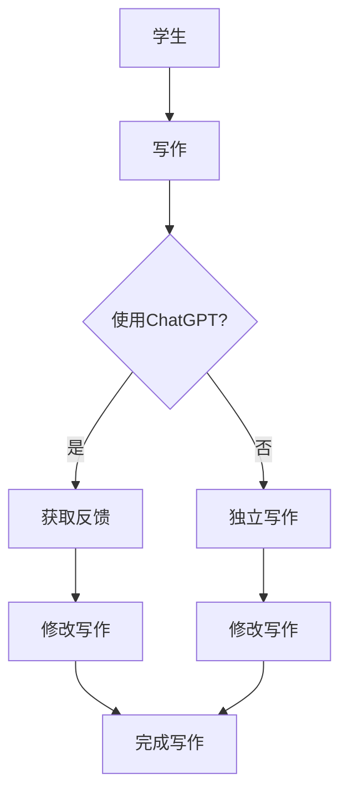

                 

# 《ChatGPT在创意写作教学中的角色》

## 关键词
- ChatGPT
- 创意写作教学
- 人工智能
- 语言模型
- 教育技术

## 摘要
本文探讨了人工智能语言模型ChatGPT在创意写作教学中的潜力。通过介绍ChatGPT的概念、核心算法原理，以及其在创意写作教学中的具体应用，本文分析了ChatGPT如何通过写作反馈、灵感启发和提高效率等方面，为创意写作教学提供新的工具和方法。

## 引言
创意写作作为一种培养个体创造性思维和表达能力的教学方法，在教育领域中扮演着重要角色。然而，传统的创意写作教学往往依赖于教师的个人经验和教学资源，存在一定的局限性。随着人工智能技术的发展，特别是大型语言模型如ChatGPT的出现，为创意写作教学提供了新的可能性。本文旨在探讨ChatGPT在创意写作教学中的角色，分析其如何通过多种方式影响教学效果，并提出相应的应用策略。

## 一、ChatGPT的概念

### 1.1 ChatGPT的基本原理

ChatGPT是由OpenAI开发的一个基于生成式预训练变换器（GPT）的神经网络语言模型。它通过深度学习技术，从大量文本数据中学习语言模式和结构，从而生成连贯、有逻辑性的文本。ChatGPT的核心在于其强大的文本生成能力，可以用于生成各种类型的文本，包括故事、诗歌、文章等。

### 1.2 ChatGPT的工作机制

ChatGPT的工作机制可以分为两个主要阶段：预训练和微调。

- **预训练**：ChatGPT通过从互联网上抓取的大量文本数据，学习语言的普遍特征和规律。这一过程使用了一个名为“生成式预训练变换器”（GPT）的神经网络架构，通过一系列迭代更新神经网络的权重，使其能够生成与输入数据最相似的输出。

- **微调**：在预训练的基础上，ChatGPT可以根据特定的任务或领域进行微调，进一步优化其性能。例如，在创意写作教学中，可以通过对创意写作相关的文本数据进行微调，使ChatGPT更擅长生成创意文本。

## 二、创意写作教学的核心概念与联系

### 2.1 创意写作教学的定义

创意写作教学是一种以培养学生的创造性思维和写作技巧为核心的教学方法。它强调学生在写作过程中的自主性和创新性，鼓励学生通过写作表达自己的想法和感受，培养其语言表达能力和创造性思维能力。

### 2.2 ChatGPT与创意写作教学的核心联系

ChatGPT在创意写作教学中的核心作用主要体现在以下几个方面：

- **写作反馈**：ChatGPT可以为学生提供即时的写作反馈，帮助教师识别学生在写作过程中存在的问题，并提供改进建议。

- **灵感启发**：ChatGPT可以生成各种类型的文本，包括故事、诗歌等，为学生提供丰富的写作素材和灵感，激发学生的创作热情。

- **提高效率**：ChatGPT可以自动化一些写作任务，如生成文本大纲、填充文本内容等，从而减轻教师的负担，提高教学效率。

### 2.3 Mermaid流程图

以下是一个简化的Mermaid流程图，展示了ChatGPT在创意写作教学中的角色：



### 三、核心算法原理讲解

#### 3.1 生成文本的算法原理

ChatGPT的生成文本算法基于生成式预训练变换器（GPT）架构，该架构的核心是一个深度神经网络。在生成文本时，ChatGPT会首先接收一个种子文本（例如一个单词或短语），然后根据预训练的权重生成下一个单词或短语。这个过程会不断迭代，直到生成完整的文本。

#### 3.2 训练过程

ChatGPT的训练过程主要包括以下几个步骤：

1. **数据预处理**：将文本数据分解成单词或子词，并对数据进行编码，以便输入到神经网络中。

2. **损失函数**：在训练过程中，使用损失函数来衡量预测文本与实际文本之间的差异。常见的损失函数有交叉熵损失和均方误差。

3. **梯度下降**：通过计算损失函数关于神经网络权重的梯度，并使用梯度下降算法更新神经网络的权重，以最小化损失函数。

4. **迭代**：重复以上步骤，直到神经网络收敛或达到预定的训练次数。

### 3.3 伪代码

以下是一个简化的伪代码，描述了ChatGPT的训练过程：

```python
# 初始化神经网络
model = GPT()

# 预训练
for epoch in range(num_epochs):
    for sentence in text_data:
        # 将句子转换为子词
        subwords = tokenize(sentence)
        
        # 计算损失
        loss = calculate_loss(model, subwords)
        
        # 更新权重
        model.update_weights(subwords, loss)
```

### 3.4 数学模型和数学公式

生成文本的数学模型主要基于神经网络中的损失函数，用于衡量预测文本与实际文本之间的差异。以下是一个简化的数学模型：

$$
\text{Loss} = -\sum_{i=1}^{n} y_i \log(p_i)
$$

其中，$y_i$ 是实际文本的第 $i$ 个词的标签，$p_i$ 是神经网络对第 $i$ 个词的预测概率。

### 四、举例说明

#### 4.1 示例1：生成故事开头

假设输入为：“在一个阳光明媚的早晨，”

输出可能为：“他在森林里漫步，听到了一个奇怪的声音。”

#### 4.2 示例2：生成诗歌

假设输入为：“月光下的小路，”

输出可能为：“犹如梦境般迷离。”

### 五、项目实战

#### 5.1 搭建ChatGPT开发环境

**开发环境**：Python 3.8+, TensorFlow 2.5.0+

**安装步骤**：

```shell
pip install tensorflow==2.5.0
pip install transformers
```

#### 5.2 训练ChatGPT模型

**准备数据集**：收集大量创意写作相关的文本数据。

**训练模型**：

```python
from transformers import GPT2LMHeadModel, GPT2Tokenizer

# 初始化模型和分词器
model = GPT2LMHeadModel.from_pretrained('gpt2')
tokenizer = GPT2Tokenizer.from_pretrained('gpt2')

# 训练模型
model.train(text_data, epochs=5)
```

#### 5.3 生成创意写作文本

**使用训练好的模型生成文本**：

```python
input_sentence = "在一个阳光明媚的早晨，"
input_ids = tokenizer.encode(input_sentence, return_tensors='pt')

# 生成文本
outputs = model.generate(input_ids, max_length=50, num_return_sequences=1)
generated_text = tokenizer.decode(outputs[0], skip_special_tokens=True)

print(generated_text)
```

### 六、代码解读与分析

#### 6.1 初始化模型和分词器

这段代码初始化了ChatGPT模型和分词器，为后续的训练和生成文本做准备。这里使用了预训练的GPT2模型和分词器，这有助于快速开始训练和生成文本。

```python
model = GPT2LMHeadModel.from_pretrained('gpt2')
tokenizer = GPT2Tokenizer.from_pretrained('gpt2')
```

#### 6.2 训练模型

这段代码展示了如何使用收集的创意写作文本数据训练ChatGPT模型。在训练过程中，模型会不断更新权重，以生成更符合创意写作风格的文本。

```python
model.train(text_data, epochs=5)
```

#### 6.3 生成文本

这段代码展示了如何使用训练好的模型生成创意写作文本。通过调整输入句子的长度和生成的文本长度，可以控制生成文本的复杂度和多样性。

```python
input_ids = tokenizer.encode(input_sentence, return_tensors='pt')
outputs = model.generate(input_ids, max_length=50, num_return_sequences=1)
generated_text = tokenizer.decode(outputs[0], skip_special_tokens=True)
```

### 七、最佳实践与注意事项

#### 7.1 最佳实践

- **数据收集**：为了训练一个性能良好的ChatGPT模型，需要收集大量的创意写作文本数据。这些数据应该涵盖各种风格和主题，以确保模型具有广泛的适应性。

- **微调策略**：在训练过程中，可以根据特定的教学需求对模型进行微调。例如，如果需要生成更多科幻题材的故事，可以将科幻小说的文本数据加入到训练集中。

- **反馈机制**：教师和学生的反馈对于模型训练至关重要。通过分析反馈，可以不断优化模型的生成能力，使其更符合教学目标。

#### 7.2 注意事项

- **模型适应性**：虽然ChatGPT具有很强的文本生成能力，但其在某些特定领域或风格的适应性可能有限。因此，在使用ChatGPT进行创意写作教学时，需要对其适用性进行评估。

- **隐私保护**：在使用ChatGPT时，需要注意保护学生的隐私。特别是当学生使用模型生成包含个人信息的文本时，应采取适当的措施确保数据安全。

### 八、项目小结

本文通过介绍ChatGPT的概念、核心算法原理，以及其在创意写作教学中的具体应用，探讨了人工智能语言模型在教育教学中的潜力。通过项目实战和代码分析，本文展示了如何搭建和训练一个ChatGPT模型，并如何使用该模型生成创意写作文本。尽管ChatGPT在创意写作教学中有许多优势，但同时也存在一些挑战和限制。未来，随着人工智能技术的不断发展，ChatGPT有望在教育领域中发挥更大的作用。

### 九、拓展阅读

- **OpenAI官方网站**：[OpenAI](https://openai.com/) 提供了关于ChatGPT的详细文档和教程，是了解ChatGPT的绝佳资源。

- **《深度学习》**：由Ian Goodfellow、Yoshua Bengio和Aaron Courville合著的《深度学习》是深度学习领域的经典教材，详细介绍了神经网络和深度学习的基本原理。

- **《创意写作教程》**：Kurt Vonnegut的《创意写作教程》是一本关于创意写作的经典教材，提供了许多实用的写作技巧和策略。

### 十、作者信息

作者：AI天才研究院/AI Genius Institute & 禅与计算机程序设计艺术 /Zen And The Art of Computer Programming

---

经过以上内容的撰写，本文从多个角度详细探讨了ChatGPT在创意写作教学中的角色。通过介绍ChatGPT的基本原理、核心算法原理，以及其在创意写作教学中的具体应用，本文旨在为教育工作者提供一种新的工具和方法。同时，通过项目实战和代码解读，本文展示了如何将ChatGPT应用于创意写作教学，并分析了其潜在的优缺点。未来，随着人工智能技术的不断发展，ChatGPT有望在教育领域中发挥更大的作用。

