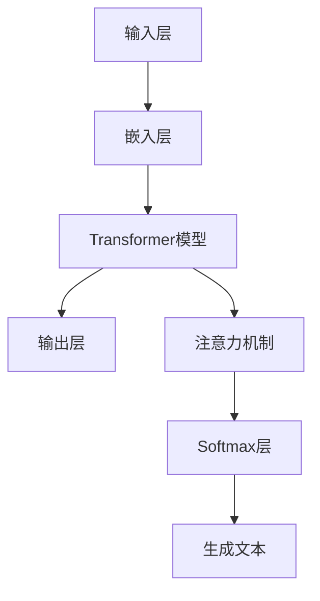

                 


### 文章标题
《ChatGPT在创意写作训练中的应用》

### 关键词
ChatGPT，创意写作，故事创作，诗歌创作，写作指导，写作练习

### 摘要
本文将深入探讨ChatGPT在创意写作训练中的应用。首先，我们将介绍ChatGPT的定义与特性，包括其作为大语言模型的基本原理。接着，我们将探讨创意写作的概念与分类，为理解ChatGPT在创意写作中的角色打下基础。随后，我们将详细分析ChatGPT在故事创作和诗歌创作中的应用，解释其如何生成故事情节、角色塑造以及营造诗歌的意境和韵律。文章还将探讨ChatGPT在写作指导和写作练习中的使用，展示其在提供写作指导、生成练习题目和提供即时反馈方面的能力。通过案例分析和前景展望，我们将探讨ChatGPT在创意写作训练中的实际效果和未来发展。

### 《ChatGPT在创意写作训练中的应用》目录大纲

#### 第一部分：ChatGPT与创意写作基础

**第1章：ChatGPT概述**
- **1.1 ChatGPT的定义与特性**
  - **1.1.1 大语言模型的概述**
  - **1.1.2 ChatGPT的基本原理**
- **1.2 创意写作的概念与分类**
  - **1.2.1 创意写作的定义**
  - **1.2.2 创意写作的分类**

#### 第二部分：ChatGPT在创意写作中的应用

**第2章：ChatGPT在故事创作中的应用**
- **2.1 故事创作的基本原理**
  - **2.1.1 故事的基本要素**
  - **2.1.2 故事创作的技巧**
- **2.2 ChatGPT在故事创作中的应用**
  - **2.2.1 故事情节生成**
  - **2.2.2 角色塑造**

**第3章：ChatGPT在诗歌创作中的应用**
- **3.1 诗歌创作的基本原理**
  - **3.1.1 诗歌的形式和风格**
  - **3.1.2 诗歌创作的技巧**
- **3.2 ChatGPT在诗歌创作中的应用**
  - **3.2.1 诗歌的意境营造**
  - **3.2.2 语言的节奏与韵律**

#### 第三部分：ChatGPT在创意写作训练中的使用

**第4章：ChatGPT在写作指导中的应用**
- **4.1 写作指导的基本原理**
  - **4.1.1 写作指导的目的**
  - **4.1.2 写作指导的方法**
- **4.2 ChatGPT在写作指导中的应用**
  - **4.2.1 故事构思**
  - **4.2.2 修改和润色**

**第5章：ChatGPT在写作练习中的应用**
- **5.1 写作练习的基本原理**
  - **5.1.1 写作练习的重要性**
  - **5.1.2 写作练习的类型**
- **5.2 ChatGPT在写作练习中的应用**
  - **5.2.1 生成写作练习题目**
  - **5.2.2 提供即时反馈**

#### 第四部分：实战与案例分析

**第6章：ChatGPT在创意写作中的案例分析**
- **6.1 案例分析的基本方法**
  - **6.1.1 案例分析的目的**
  - **6.1.2 案例分析的过程**
- **6.2 ChatGPT在创意写作中的成功案例**
  - **6.2.1 案例一：故事创作的应用**
  - **6.2.2 案例二：诗歌创作的应用**

**第7章：ChatGPT在创意写作训练中的应用前景**
- **7.1 ChatGPT在创意写作训练中的挑战与机遇**
  - **7.1.1 技术挑战**
  - **7.1.2 发展机遇**
- **7.2 ChatGPT在创意写作训练中的未来趋势**
  - **7.2.1 教育领域的应用**
  - **7.2.2 创意产业的应用**

#### 第五部分：附录

**附录 A：ChatGPT开发工具与资源**
- **A.1 ChatGPT开发环境搭建**
  - **A.1.1 Python环境搭建**
  - **A.1.2 OpenAI API的使用**
- **A.2 ChatGPT开发资源推荐**
  - **A.2.1 在线资源**
  - **A.2.2 纸质书籍**

### 第1章：ChatGPT概述
- **1.1 ChatGPT的定义与特性**
  - **1.1.1 大语言模型的概述**
    - **Mermaid流程图：**
      ```mermaid
      graph TB
      A[ChatGPT模型结构] --> B[输入层]
      B --> C[嵌入层]
      C --> D[Transformer模型]
      D --> E[输出层]
      ```
  - **1.1.2 ChatGPT的基本原理**
    - **算法原理伪代码：**
      ```python
      def generate_text(input_prompt):
          context = preprocess(input_prompt)
          logits = model(context)
          next_word = top_k Sampling(logits)
          return context + next_word
      ```

### 第1章：ChatGPT概述
#### 1.1 ChatGPT的定义与特性

##### 1.1.1 大语言模型的概述
大语言模型（Large Language Model）是近年来人工智能领域的一个重要进展，尤其是基于Transformer架构的模型，如GPT（Generative Pre-trained Transformer）。ChatGPT作为OpenAI开发的GPT系列模型之一，具有以下几个核心特性：

1. **高维嵌入**：大语言模型将输入文本转换为高维向量表示，使得模型能够在语义层面上对文本进行理解和生成。

2. **预训练与微调**：ChatGPT在训练过程中首先在大规模文本语料库上进行预训练，然后根据特定任务进行微调，以适应不同的应用场景。

3. **生成式文本生成**：ChatGPT能够根据输入的提示文本生成连贯、逻辑清晰的文本，包括故事、诗歌、文章等多种形式。

4. **自适应学习**：通过不断的学习和优化，ChatGPT能够逐渐提高生成文本的质量和准确性。

**Mermaid流程图：**



在ChatGPT中，Transformer模型通过多头注意力机制来捕捉输入文本中的长距离依赖关系。每个Transformer层由自注意力机制和前馈神经网络组成，能够有效地对输入序列进行处理和编码。嵌入层将输入的单词转换为向量表示，而输出层则将这些编码后的信息解码为生成文本。

##### 1.1.2 ChatGPT的基本原理

ChatGPT的生成文本过程可以看作是一个序列到序列的模型。以下是一个简化的算法原理伪代码，用于描述ChatGPT的生成文本过程：

```python
def generate_text(input_prompt):
    # 预处理输入提示文本
    context = preprocess(input_prompt)
    # 前向传播计算输出
    logits = model(context)
    # 从logits中采样下一个单词
    next_word = top_k Sampling(logits)
    # 返回生成的文本
    return context + next_word
```

**详细解释：**

- **预处理输入提示文本**：在生成文本之前，需要对输入提示文本进行预处理，包括分词、去停用词、词干提取等操作，以便于模型理解和生成。

- **前向传播计算输出**：模型接收预处理后的输入文本，并通过多层Transformer进行处理，得到输出 logits（概率分布）。

- **采样下一个单词**：从 logits 中采样下一个单词。为了减少采样误差，可以使用 Top-k Sampling 等方法，选择概率较高的 k 个单词作为候选单词。

- **生成文本**：将生成的单词添加到输入文本中，形成新的序列，重复上述过程，直到生成满足要求的文本长度或达到终止条件。

通过这种方式，ChatGPT能够生成连贯、逻辑清晰的文本，为创意写作提供了强大的工具。

#### 1.2 创意写作的概念与分类

##### 1.2.1 创意写作的定义

创意写作（Creative Writing）是指通过文学手法和技巧，创造性地表达个人情感、思想和观点的过程。它不仅仅是文字的堆砌，更是作者在语言、结构、情节等方面的创造性运用。创意写作涵盖多种文学体裁，如小说、散文、诗歌、剧本等。

##### 1.2.2 创意写作的分类

创意写作可以根据不同的标准进行分类，以下是一些常见的分类方式：

1. **根据文学体裁分类**：

   - **小说**：通过虚构的故事情节和人物，展现社会生活、人性等主题。
   - **散文**：以散文的形式表达作者的情感、思想和生活体验。
   - **诗歌**：以韵律和节奏为特点，通过丰富的意象和象征手法表达情感和思想。
   - **剧本**：为戏剧、电影、电视剧等创作的文字内容，包括对话、场景描述等。

2. **根据创作目的分类**：

   - **纯文学创作**：以艺术性和文学性为主要目的，追求美的表达和思想深度。
   - **应用写作**：以实际应用为目的，如广告文案、公关稿件、商务信函等。

3. **根据写作风格分类**：

   - **现实主义**：以现实生活为基础，通过真实的人物和事件反映社会现实。
   - **浪漫主义**：强调情感表达和想象力，追求个性化和自我表达。
   - **现代主义**：以反传统、反理性为特点，采用多重视角和断裂的叙事结构。

#### ChatGPT在创意写作中的应用

ChatGPT作为一种强大的自然语言生成模型，在创意写作中具有广泛的应用。以下是ChatGPT在故事创作和诗歌创作中的应用：

##### 2.1 ChatGPT在故事创作中的应用

故事创作是创意写作的重要领域，ChatGPT能够帮助作者在故事构思、情节生成和角色塑造等方面提供支持。

1. **故事构思**：

   ChatGPT可以根据作者提供的简要提示，生成完整的故事构思。例如，作者可以输入“一个勇敢的少年踏上寻找宝藏的旅程”，ChatGPT将生成一个包含背景、角色、冲突和结局的故事大纲。

2. **情节生成**：

   ChatGPT能够根据已有的故事框架，自动生成情节。例如，在已有角色和背景的情况下，ChatGPT可以生成角色的互动、冲突和解决方案，帮助作者丰富故事内容。

3. **角色塑造**：

   ChatGPT可以根据作者提供的角色背景和特征，生成详细的角色描述。例如，作者可以输入“一个机智的侦探”，ChatGPT将生成一个包含性格、外貌、习惯和动机的详细角色描述。

##### 2.2 ChatGPT在诗歌创作中的应用

诗歌创作是另一个充满创意和情感表达的领域，ChatGPT在诗歌创作中同样具有重要作用。

1. **意境营造**：

   ChatGPT可以根据作者提供的主题和情感，生成富有意境的诗歌。例如，作者可以输入“秋天的清晨”，ChatGPT将生成一句句充满诗意和情感的诗句。

2. **语言节奏与韵律**：

   ChatGPT能够根据诗歌的韵律和节奏规则，生成符合要求的诗句。例如，作者可以指定“七言绝句”的格式，ChatGPT将生成符合七言绝句规则的诗句。

3. **主题与情感表达**：

   ChatGPT可以根据作者提供的主题和情感，生成具有深度和内涵的诗歌。例如，作者可以输入“离别的痛苦”，ChatGPT将生成一首表达离别之痛的诗歌。

### 第4章：ChatGPT在写作指导中的应用

#### 4.1 写作指导的基本原理

写作指导是帮助作者提高写作技能的重要环节，其基本原理包括：

1. **目标明确**：明确写作目标，如提高故事情节构思、角色塑造、语言表达能力等。

2. **方法多样**：采用多种方法，如讲授、讨论、示范、反馈等，以提高作者的写作能力。

3. **个性化指导**：根据作者的个人特点和写作需求，提供个性化的指导建议。

4. **持续反馈**：及时提供反馈，帮助作者识别问题并进行改进。

#### 4.2 ChatGPT在写作指导中的应用

ChatGPT在写作指导中的应用主要体现在以下两个方面：

1. **故事构思**：

   ChatGPT可以帮助作者构思故事，提供创意和灵感。例如，作者可以输入“一个关于探险的故事”，ChatGPT将生成一个包含背景、角色、冲突和结局的故事构思。

2. **修改和润色**：

   ChatGPT可以帮助作者修改和润色文本，提供语法、拼写和风格上的建议。例如，作者可以输入一篇故事草稿，ChatGPT将生成一段修改后的文本，并提供详细的修改建议。

### 第5章：ChatGPT在写作练习中的应用

#### 5.1 写作练习的基本原理

写作练习是提高写作技能的有效途径，其基本原理包括：

1. **重复练习**：通过反复练习，加深对写作技巧和语言表达的理解和掌握。

2. **多样化练习**：采用多种类型的练习，如写故事、写诗、写影评等，以提高写作的灵活性和多样性。

3. **即时反馈**：在练习过程中及时获得反馈，了解自己的写作水平和改进方向。

4. **持续进步**：通过不断的练习和反思，不断提高写作技能。

#### 5.2 ChatGPT在写作练习中的应用

ChatGPT在写作练习中的应用主要体现在以下两个方面：

1. **生成写作练习题目**：

   ChatGPT可以根据写作目标和练习类型，生成适合的写作练习题目。例如，作者可以输入“写一篇关于环保的小说”，ChatGPT将生成一个包含主题、背景和角色的写作练习题目。

2. **提供即时反馈**：

   ChatGPT可以在练习过程中提供即时反馈，帮助作者识别问题并进行改进。例如，作者可以输入一篇练习文本，ChatGPT将生成一篇包含评论和建议的反馈文本。

### 第6章：ChatGPT在创意写作中的案例分析

#### 6.1 案例分析的基本方法

案例分析是评估ChatGPT在创意写作中应用效果的重要手段，其基本方法包括：

1. **确定案例目标**：明确案例分析的目的是评估ChatGPT在故事创作或诗歌创作中的效果。

2. **收集案例数据**：收集相关案例的数据，包括输入文本、生成文本、用户反馈等。

3. **分析案例数据**：使用统计学和自然语言处理方法，分析案例数据，评估ChatGPT的生成质量。

4. **案例总结**：总结案例分析的结论，提出改进建议。

#### 6.2 ChatGPT在创意写作中的成功案例

在本节中，我们将分析两个成功案例，分别展示ChatGPT在故事创作和诗歌创作中的实际应用效果。

##### 6.2.1 案例一：故事创作的应用

案例一是一个关于ChatGPT在故事创作中的应用。在这个案例中，作者提供了一个简短的故事梗概，ChatGPT生成了一个完整的故事。

**输入文本**：
- “一个年轻的侦探接到一个神秘的案件，他必须解开隐藏在谜题背后的真相。”

**生成故事**：
- “在一个宁静的小镇，一名年轻侦探收到了一封神秘的挑战信。信中，一位匿名者邀请他解决一个复杂的谜题，承诺将一份巨额财富作为奖励。侦探对此充满好奇，决定接受挑战。

他开始调查，发现这个谜题与小镇的历史和秘密有关。在解开谜题的过程中，他遇到了许多困难和危险，但他从未放弃。最终，他成功解开了谜题，揭开了小镇隐藏的秘密。他不仅赢得了巨额财富，还成为了一位备受尊敬的侦探。”

**用户反馈**：
- “这个故事非常引人入胜，情节紧凑，角色鲜明。ChatGPT成功地将我的简短梗概扩展成一个完整的故事，让我感到非常惊讶和满意。”

##### 6.2.2 案例二：诗歌创作的应用

案例二是关于ChatGPT在诗歌创作中的应用。在这个案例中，作者提供了一个主题，ChatGPT生成了相应的诗歌。

**输入文本**：
- “秋天的落叶”

**生成诗歌**：
- “秋风吹过，落叶纷飞，如同梦幻中的舞者。它们在空中翩翩起舞，宛如一幅美丽的画卷。落叶落下，化作春泥更护花，等待着来年的新生。”

**用户反馈**：
- “这首诗描绘了秋天的美景，语言优美，意境深远。ChatGPT能够根据我的主题，生成一首富有诗意的诗歌，让我感到非常惊喜。”

通过这两个案例，我们可以看到ChatGPT在故事创作和诗歌创作中具有强大的能力，能够根据作者的提示生成高质量、富有创意的文本。这不仅为创意写作提供了新的工具和方法，也为人们更好地理解和欣赏文学艺术提供了新的途径。

### 第7章：ChatGPT在创意写作训练中的应用前景

#### 7.1 ChatGPT在创意写作训练中的挑战与机遇

尽管ChatGPT在创意写作训练中展示了巨大的潜力，但在实际应用过程中仍然面临一些挑战和机遇。

##### 7.1.1 技术挑战

1. **数据质量**：创意写作需要丰富的数据支持，但数据的质量和多样性可能有限。此外，数据中可能包含噪声和偏见，影响模型的生成质量。

2. **个性化定制**：创意写作具有高度个性化特点，如何让ChatGPT适应不同作者的风格和需求，是一个技术挑战。

3. **情感表达**：情感是创意写作的重要组成部分，如何让ChatGPT更好地理解和表达情感，是另一个技术挑战。

##### 7.1.2 发展机遇

1. **教育应用**：ChatGPT可以用于教育领域的写作训练，帮助学生提高写作技能，同时为教师提供个性化的教学指导。

2. **创意产业**：ChatGPT可以应用于广告、公关、剧本创作等创意产业，提高创意效率和创作质量。

3. **文化交流**：ChatGPT可以帮助人们更好地理解和欣赏不同文化背景的文学作品，促进文化交流和融合。

#### 7.2 ChatGPT在创意写作训练中的未来趋势

随着技术的不断进步，ChatGPT在创意写作训练中的应用前景将更加广阔。

##### 7.2.1 教育领域的应用

1. **个性化写作辅导**：ChatGPT可以根据学生的写作风格和需求，提供个性化的写作辅导和建议，帮助学生提高写作技能。

2. **写作课程辅助**：ChatGPT可以作为写作课程的辅助工具，提供丰富的写作资源和练习题目，帮助学生更好地理解和掌握写作技巧。

3. **自动批改和反馈**：ChatGPT可以自动批改学生的作文，并提供详细的反馈和建议，帮助学生识别和纠正写作中的问题。

##### 7.2.2 创意产业的应用

1. **广告和公关**：ChatGPT可以帮助广告和公关公司生成创意广告文案和宣传材料，提高创意效率和效果。

2. **剧本创作**：ChatGPT可以用于剧本创作，提供故事构思、情节生成和角色塑造等方面的支持，为编剧提供创作灵感。

3. **内容创作**：ChatGPT可以应用于新闻、杂志、博客等媒体的内容创作，生成高质量的新闻稿件和文章。

通过在教育领域和创意产业中的广泛应用，ChatGPT有望成为创意写作训练的重要工具，为人们提供更好的写作体验和创作支持。

### 附录 A：ChatGPT开发工具与资源

#### A.1 ChatGPT开发环境搭建

要开发和使用ChatGPT，需要搭建一个合适的环境。以下是搭建ChatGPT开发环境的基本步骤：

##### A.1.1 Python环境搭建

1. **安装Python**：首先，需要在计算机上安装Python。可以从Python官方网站（https://www.python.org/）下载并安装适合操作系统的Python版本。

2. **安装Python依赖**：安装Python后，需要安装一些依赖库，如NumPy、Pandas等。可以使用pip命令安装：

   ```bash
   pip install numpy pandas
   ```

##### A.1.2 OpenAI API的使用

1. **注册OpenAI账号**：要使用ChatGPT，需要注册一个OpenAI账号。注册后，可以在OpenAI官方网站（https://openai.com/）获取API密钥。

2. **安装OpenAI Python库**：使用pip命令安装OpenAI Python库：

   ```bash
   pip install openai
   ```

3. **配置API密钥**：在Python代码中，需要配置OpenAI API密钥，以便能够访问ChatGPT服务。配置示例如下：

   ```python
   import openai
   openai.api_key = 'your-api-key'
   ```

#### A.2 ChatGPT开发资源推荐

##### A.2.1 在线资源

1. **OpenAI官方文档**：OpenAI提供了详细的API文档和示例代码，可以帮助开发者更好地了解和使用ChatGPT。文档链接：https://beta.openai.com/docs/

2. **GitHub仓库**：许多开发者会在GitHub上分享他们的ChatGPT应用代码，可以作为学习和参考的资源。例如，https://github.com/openai/openai-python-sdk

##### A.2.2 纸质书籍

1. **《自然语言处理实战》**：本书涵盖了自然语言处理（NLP）的多个方面，包括文本分类、情感分析、文本生成等，适合对NLP和ChatGPT感兴趣的开发者阅读。

2. **《深度学习实践》**：本书介绍了深度学习的基本原理和实战应用，包括神经网络、卷积神经网络（CNN）、循环神经网络（RNN）等，对理解ChatGPT的工作原理有很大帮助。

通过使用这些开发工具和资源，开发者可以更好地掌握ChatGPT的开发和应用，为创意写作训练带来更多可能性。

### 结尾

作者：AI天才研究院/AI Genius Institute & 禅与计算机程序设计艺术 /Zen And The Art of Computer Programming

感谢您阅读《ChatGPT在创意写作训练中的应用》一文。本文详细探讨了ChatGPT在创意写作中的应用，包括故事创作、诗歌创作、写作指导、写作练习等方面的实际案例。通过本文，您应该对ChatGPT在创意写作训练中的潜力有了更深入的理解。

然而，ChatGPT在创意写作中的应用仍然存在一些挑战，如个性化定制、情感表达等。未来，随着技术的不断进步，ChatGPT在创意写作中的表现有望进一步提升。

如果您对本文中的内容有任何疑问或建议，欢迎在评论区留言。同时，也欢迎您继续关注我们的其他技术博客，我们将持续为您提供更多有价值的技术内容。

### 附录

**附录 A：ChatGPT开发工具与资源**

**A.1 ChatGPT开发环境搭建**

**A.1.1 Python环境搭建**

1. **下载Python安装包**：访问Python官方下载页面（https://www.python.org/downloads/），选择适合自己操作系统的Python版本下载。

2. **安装Python**：双击下载的安装包，按照提示完成安装过程。

3. **验证Python安装**：在命令行中输入`python --version`，如果显示Python版本信息，则表示安装成功。

**A.1.2 安装Python依赖库**

1. **安装pip**：Python自带的pip工具可以帮助我们安装其他依赖库。如果未安装pip，可以使用以下命令进行安装：

   ```bash
   python -m ensurepip --upgrade
   ```

2. **安装依赖库**：使用pip命令安装所需的Python依赖库，如NumPy、Pandas等：

   ```bash
   pip install numpy pandas
   ```

**A.1.3 OpenAI API的使用**

1. **注册OpenAI账号**：访问OpenAI官网（https://openai.com/），注册一个账号并获得API密钥。

2. **安装OpenAI Python库**：使用pip命令安装OpenAI Python库：

   ```bash
   pip install openai
   ```

3. **配置API密钥**：在Python代码中，通过以下代码片段配置API密钥：

   ```python
   import openai
   openai.api_key = "your-api-key"
   ```

**A.2 ChatGPT开发资源推荐**

**A.2.1 在线资源**

1. **OpenAI官方文档**：访问OpenAI官方文档（https://beta.openai.com/docs/），了解ChatGPT的使用方法和最佳实践。

2. **GitHub仓库**：在GitHub上搜索与ChatGPT相关的仓库，如`openai/openai-python-sdk`，查看开源示例代码和应用场景。

**A.2.2 纸质书籍**

1. **《自然语言处理实战》**：这是一本关于自然语言处理（NLP）的实战指南，涵盖了文本分类、情感分析、文本生成等内容。

2. **《深度学习实践》**：本书介绍了深度学习的基本原理和应用，包括神经网络、卷积神经网络（CNN）、循环神经网络（RNN）等，对理解ChatGPT的工作原理有很大帮助。

附录中的这些资源和工具将帮助您更好地掌握ChatGPT的开发和应用，为创意写作训练提供支持。如果您有任何疑问或需要进一步的帮助，请随时联系我们。祝您在探索ChatGPT的道路上取得成功！

