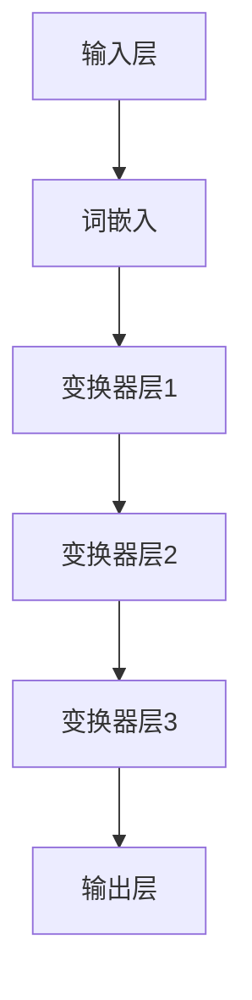
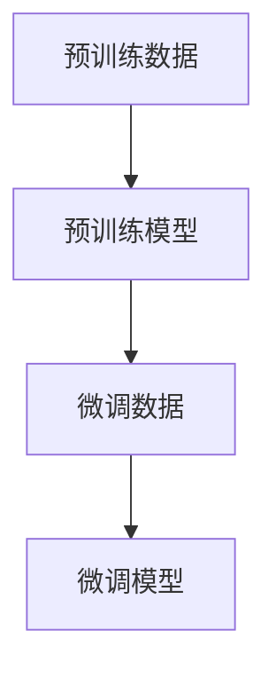

                 

# 《ChatGPT在社交媒体管理中的应用》

> 关键词：ChatGPT、社交媒体管理、社交媒体营销、客户服务、数据分析、优化策略

> 摘要：本文旨在探讨ChatGPT在社交媒体管理中的广泛应用，从社交媒体营销、客户服务、数据分析等方面深入分析ChatGPT的技术原理和应用实例，总结出ChatGPT在社交媒体管理中的挑战与优化策略，为企业和个人在社交媒体管理中提供有效的技术支持。

## 第一部分：ChatGPT概述

### 第1章：ChatGPT基本概念

#### 1.1 人工智能与自然语言处理

**人工智能的定义与发展历程**

人工智能（Artificial Intelligence，简称AI）是指模拟、延伸和扩展人类智能的理论、方法、技术及应用。人工智能的发展历程可以追溯到20世纪50年代，当时科学家们首次提出人工智能的概念。随着计算机技术的不断进步，人工智能经历了多个阶段的发展，从符号主义、知识工程到统计学习、深度学习，再到现在的生成式AI。

**自然语言处理的基本概念**

自然语言处理（Natural Language Processing，简称NLP）是人工智能的一个重要分支，主要研究如何让计算机理解和处理人类自然语言。NLP的目标是实现人机对话、文本生成、情感分析、信息抽取等任务。NLP的基本概念包括词汇、语法、语义、语音识别等。

#### 1.2 ChatGPT的概念与原理

**ChatGPT的定义**

ChatGPT是由OpenAI开发的一种基于变换器（Transformer）架构的预训练语言模型。它通过大规模语料库进行预训练，学会生成符合上下文的自然语言响应。ChatGPT可以应用于多种场景，如聊天机器人、内容生成、文本分类等。

**GPT模型的基本原理**

GPT模型是一种生成式预训练语言模型（Generative Pre-trained Transformer），其基本原理是基于变换器架构，通过自注意力机制（Self-Attention）和多层变换器网络（Multi-Layer Transformer）来实现。

**Mermaid流程图：GPT模型架构概述**

### 第2章：ChatGPT技术基础

#### 2.1 语言模型与生成模型

**语言模型的定义与作用**

语言模型是一种概率模型，用于预测一段文本的下一个单词或字符。语言模型在自然语言处理中具有重要作用，如文本生成、语音识别、机器翻译等。

**生成模型的基本原理**

生成模型是一种概率模型，用于生成新的数据。生成模型通过学习数据分布，生成与输入数据具有相似特征的新数据。生成模型在图像生成、音频生成、文本生成等领域具有广泛应用。

#### 2.2 深度学习与神经网络

**神经网络的基本结构**

神经网络是由大量神经元组成的计算模型，通过学习和适应输入数据，实现非线性映射。神经网络的基本结构包括输入层、隐藏层和输出层。

**常见的深度学习架构**

深度学习架构包括卷积神经网络（CNN）、循环神经网络（RNN）、变换器神经网络（Transformer）等。这些架构在图像处理、自然语言处理、语音识别等领域取得了显著成果。

#### 2.3 预训练与微调

**预训练的概念与意义**

预训练是指在大量未标注数据上进行训练，使模型学会通用知识。预训练的意义在于提高模型在特定任务上的表现，减少对标注数据的依赖。

**微调技术详解**

微调是指将预训练模型在特定任务上进行进一步训练，使其适应特定任务。微调技术通过调整模型参数，使模型在特定任务上取得更好的效果。

**Mermaid流程图：预训练与微调流程**

## 第二部分：ChatGPT在社交媒体管理中的应用

### 第3章：ChatGPT在社交媒体营销中的应用

#### 3.1 社交媒体营销概述

**社交媒体营销的定义与目标**

社交媒体营销是指利用社交媒体平台进行产品或品牌推广的活动。社交媒体营销的目标是提高品牌知名度、吸引潜在客户、增加销售。

**社交媒体营销的优势**

社交媒体营销具有成本低、覆盖广、互动性强等优势。与传统营销方式相比，社交媒体营销能够更快速地传播信息，提高品牌影响力。

#### 3.2 ChatGPT在社交媒体营销中的应用

**营销文案生成**

ChatGPT可以通过预训练模型生成高质量的营销文案，提高营销活动的效果。

**营销活动策划**

ChatGPT可以协助企业策划创意丰富的营销活动，提高用户参与度和品牌忠诚度。

**用户互动管理**

ChatGPT可以自动回复用户评论、私信等，提高用户体验，减轻企业运营负担。

#### 3.3 ChatGPT营销案例分析

**案例一：某电商品牌使用ChatGPT进行社交媒体营销**

某电商品牌利用ChatGPT生成营销文案和策划营销活动，取得了显著的销售增长和用户满意度提升。

**案例二：某教育培训机构使用ChatGPT进行社交媒体营销**

某教育培训机构利用ChatGPT自动回复用户咨询，提高了客户服务效率和用户满意度。

### 第4章：ChatGPT在社交媒体客户服务中的应用

#### 4.1 社交媒体客户服务概述

**社交媒体客户服务的定义与目标**

社交媒体客户服务是指通过社交媒体平台为用户提供咨询、解答疑问、解决问题等服务。社交媒体客户服务的目标是提高用户满意度，降低企业运营成本。

**社交媒体客户服务的重要性**

社交媒体客户服务在现代社会具有重要作用，能够帮助企业树立良好的品牌形象，提升用户忠诚度。

#### 4.2 ChatGPT在社交媒体客户服务中的应用

**自动回复系统**

ChatGPT可以自动回复用户评论、私信等，提高客户服务效率。

**客户咨询处理**

ChatGPT可以识别用户咨询内容，自动提供合适的解决方案，减轻人工客服负担。

**用户满意度提升**

ChatGPT通过提供快速、准确的客户服务，提高用户满意度，降低用户投诉率。

#### 4.3 ChatGPT客户服务案例分析

**案例一：某电商企业使用ChatGPT提升客户服务体验**

某电商企业利用ChatGPT自动回复用户咨询，提高了客户服务效率和用户满意度。

**案例二：某银行使用ChatGPT优化社交媒体客户服务**

某银行利用ChatGPT自动回复用户咨询，降低了人工客服工作量，提高了客户服务质量和用户满意度。

### 第5章：ChatGPT在社交媒体数据分析中的应用

#### 5.1 社交媒体数据分析概述

**社交媒体数据分析的定义与目标**

社交媒体数据分析是指利用大数据技术和统计分析方法，对社交媒体平台上的用户行为、内容、互动等进行分析，以获取有价值的信息和洞察。

**社交媒体数据分析的方法**

社交媒体数据分析的方法包括数据采集、数据清洗、数据存储、数据分析和数据可视化等。

#### 5.2 ChatGPT在社交媒体数据分析中的应用

**用户行为分析**

ChatGPT可以分析用户在社交媒体平台上的行为，如点赞、评论、分享等，为企业提供用户画像和兴趣偏好。

**舆情监测**

ChatGPT可以实时监测社交媒体平台上的舆情动态，为企业提供风险预警和应对策略。

**数据可视化**

ChatGPT可以生成直观的数据可视化图表，帮助企业更好地理解数据，发现潜在的商业机会。

#### 5.3 ChatGPT数据分析案例分析

**案例一：某电商企业使用ChatGPT分析社交媒体用户行为**

某电商企业利用ChatGPT分析用户在社交媒体平台上的行为，优化产品营销策略，提高了销售额。

**案例二：某媒体企业使用ChatGPT进行社交媒体舆情监测**

某媒体企业利用ChatGPT监测社交媒体平台上的舆情动态，及时调整报道方向，赢得了更多用户关注。

## 第三部分：ChatGPT在社交媒体管理中的挑战与优化

### 第6章：ChatGPT在社交媒体管理中的挑战

#### 6.1 数据安全与隐私保护

**数据安全与隐私保护的重要性**

在社交媒体管理中，数据安全和隐私保护至关重要。随着用户隐私意识的提高和法律法规的不断完善，企业和个人需要加强对数据安全和隐私保护的重视。

**隐私保护的法律法规**

了解和遵守相关的隐私保护法律法规，如《中华人民共和国网络安全法》、《欧洲通用数据保护条例》（GDPR）等，是数据安全和隐私保护的基本要求。

**数据加密与匿名化技术**

数据加密和匿名化技术是保护数据安全和隐私的有效手段。通过数据加密，确保数据在传输和存储过程中不会被窃取或篡改；通过匿名化技术，将用户数据中的敏感信息进行脱敏处理，降低隐私泄露风险。

#### 6.2 质量控制与优化

**质量控制的方法与技巧**

在社交媒体管理中，质量控制是确保ChatGPT应用效果的关键。质量控制的方法包括数据质量检查、模型评估、结果验证等。通过不断优化模型参数和算法，提高ChatGPT的应用效果。

**优化策略与实战**

优化策略包括数据预处理、模型调整、策略迭代等。在实际应用中，通过不断调整和优化，使ChatGPT在社交媒体管理中发挥更大的作用。

#### 6.3 技术升级与持续学习

**技术升级的重要性**

随着技术的不断进步，ChatGPT的应用场景和功能也在不断扩展。技术升级是保证ChatGPT在社交媒体管理中保持竞争力的关键。

**持续学习的途径与方法**

持续学习是提升ChatGPT应用效果的重要手段。通过参加线上课程、阅读专业书籍、参与技术社区等途径，不断学习和掌握最新的技术和应用方法。

### 第7章：ChatGPT在社交媒体管理中的优化策略

#### 7.1 策略制定与执行

**优化目标的设定**

在制定优化策略时，首先需要明确优化目标。优化目标可以分为短期目标和长期目标，如提高用户满意度、降低运营成本、提升营销效果等。

**优化策略的制定**

根据优化目标，制定具体的优化策略。优化策略包括技术优化、流程优化、团队协作等。

**策略执行的监督与评估**

在策略执行过程中，需要加强对策略执行的监督与评估。通过监控关键指标，如用户满意度、客服响应时间、营销效果等，评估优化策略的效果，并根据评估结果进行调整。

#### 7.2 成功案例分享

**某电商企业优化社交媒体营销策略的实践**

某电商企业通过优化社交媒体营销策略，提高了用户满意度、降低了运营成本，取得了显著的销售增长。

**某金融机构优化社交媒体客户服务的实践**

某金融机构通过优化社交媒体客户服务，提高了客户满意度，降低了投诉率，提升了品牌形象。

#### 7.3 未来发展趋势与展望

**ChatGPT在社交媒体管理中的应用前景**

随着人工智能技术的不断发展，ChatGPT在社交媒体管理中的应用前景十分广阔。未来，ChatGPT将在社交媒体营销、客户服务、数据分析等方面发挥更大的作用。

**潜在的技术创新与应用场景**

在社交媒体管理中，ChatGPT可以与其他技术相结合，如虚拟现实、增强现实、区块链等，创造出更多创新的应用场景。

## 附录

### 附录A：ChatGPT开发与部署指南

#### A.1 ChatGPT开发环境搭建

**硬件配置**

根据ChatGPT模型的大小和复杂度，选择合适的硬件配置。一般而言，GPU加速是必不可少的，同时建议使用高性能CPU和大量内存。

**软件安装与配置**

安装Python、TensorFlow等必要的开发工具和库。对于GPU加速，需要安装CUDA和cuDNN。

#### A.2 ChatGPT模型训练与优化

**模型训练方法**

使用预训练模型，通过转移学习技术进行微调，使其适应特定任务。

**优化策略与实践**

通过调整学习率、批次大小等超参数，优化模型性能。

#### A.3 ChatGPT应用案例解析

**代码实现与解析**

提供详细的代码实现和解析，包括数据预处理、模型训练、模型评估等步骤。

**案例应用场景与效果评估**

分析ChatGPT在不同应用场景中的表现，评估其效果和优势。

### 附录B：ChatGPT相关资源与工具

#### B.1 ChatGPT开源项目与框架

介绍常见的ChatGPT开源项目与框架，如OpenAI的GPT系列模型、TensorFlow的Transformer模型等。

#### B.2 ChatGPT学习资源

推荐在线课程、教材等学习资源，帮助读者深入了解ChatGPT的技术原理和应用。

#### B.3 ChatGPT社区与论坛

介绍ChatGPT相关的社区和论坛，如GitHub、Reddit等，供读者交流和讨论。

作者：AI天才研究院/AI Genius Institute & 禅与计算机程序设计艺术 /Zen And The Art of Computer Programming

