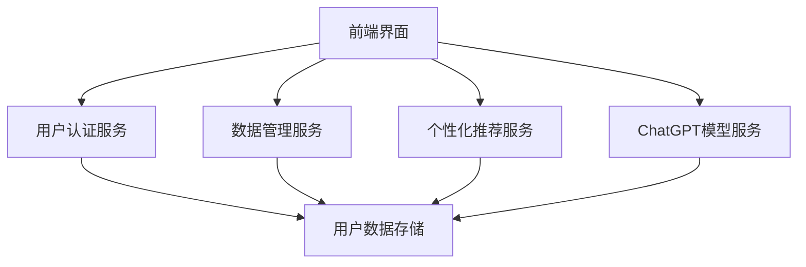
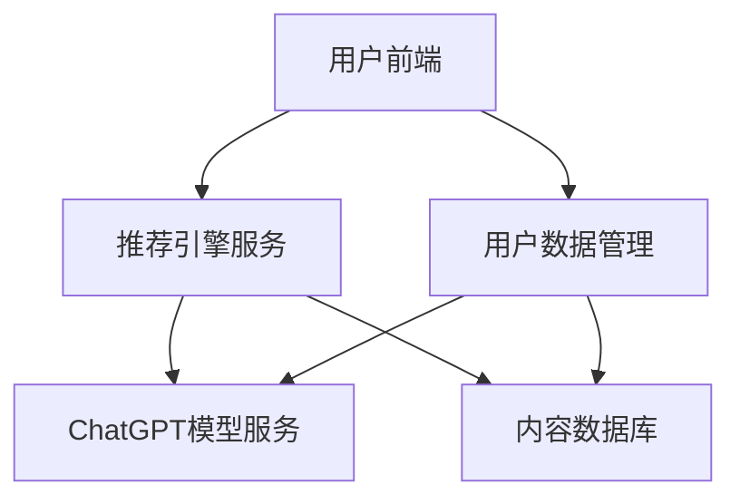
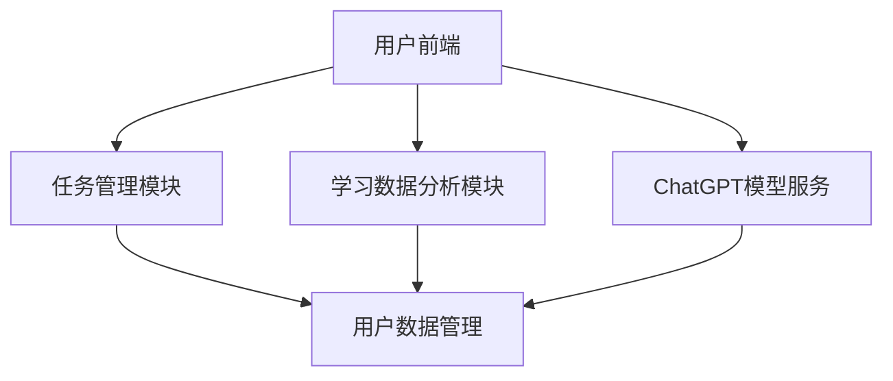

                 

### 文章标题

# 《ChatGPT在自动化个性化教学内容生成中的应用》

### 关键词

- ChatGPT
- 自动化教学
- 个性化学习
- 生成式AI
- 教学内容生成

### 摘要

本文将深入探讨ChatGPT在自动化个性化教学内容生成中的关键应用。我们将首先概述ChatGPT的基础知识及其在人工智能领域的背景，然后逐步揭示其架构、原理以及在个性化教学中的应用。随后，我们将重点讨论ChatGPT在自动化教学内容生成中的角色和优势，详细讲解其在课程设计、教学案例编写、在线问答系统以及自适应学习系统中的实际应用。最后，我们将分享几个基于ChatGPT的个性化教学案例分析，展望其在未来个性化教学中的发展趋势，并提出进一步的研究方向与学习建议。通过本文，读者将全面理解ChatGPT在个性化教学领域的巨大潜力及其实现路径。

## 《ChatGPT在自动化个性化教学内容生成中的应用》目录大纲

### 第一部分：ChatGPT基础知识与原理

#### 第1章：ChatGPT概述
- 1.1 ChatGPT的定义与背景
- 1.2 ChatGPT的核心技术
- 1.3 ChatGPT的应用领域
- 1.4 ChatGPT的优势与挑战

#### 第2章：ChatGPT的架构与原理
- 2.1 GPT模型的基础架构
- 2.2 自监督学习与预训练
- 2.3 语言模型的基本原理
- 2.4 ChatGPT的生成机制

#### 第3章：ChatGPT在个性化教学中的应用
- 3.1 个性化教学的定义与需求
- 3.2 ChatGPT在个性化教学中的角色
- 3.3 ChatGPT在个性化教学中的应用场景
- 3.4 ChatGPT在个性化教学中的优势

### 第二部分：ChatGPT在自动化教学内容生成中的应用

#### 第4章：自动化教学内容生成的原理
- 4.1 自动化教学内容生成的定义与挑战
- 4.2 内容生成的常用方法与技术
- 4.3 ChatGPT在内容生成中的优势
- 4.4 ChatGPT在内容生成中的流程

#### 第5章：ChatGPT在自动化教学内容生成中的实际应用
- 5.1 ChatGPT在课程设计中的应用
- 5.2 ChatGPT在教学案例编写中的应用
- 5.3 ChatGPT在在线问答系统中的应用
- 5.4 ChatGPT在自适应学习系统中的应用

#### 第6章：ChatGPT在自动化教学内容生成中的优化
- 6.1 提高ChatGPT生成质量的方法
- 6.2 调整ChatGPT生成策略的技巧
- 6.3 实现ChatGPT生成效率的优化
- 6.4 ChatGPT在多语言教学中的应用

### 第三部分：ChatGPT在个性化教学中的案例分析

#### 第7章：案例一：基于ChatGPT的智能课程辅导系统
- 7.1 系统需求与目标
- 7.2 系统架构设计
- 7.3 系统功能实现
- 7.4 系统效果评估

#### 第8章：案例二：基于ChatGPT的个性化学习推荐系统
- 8.1 系统需求与目标
- 8.2 系统架构设计
- 8.3 系统功能实现
- 8.4 系统效果评估

#### 第9章：案例三：基于ChatGPT的智能教学助手
- 9.1 系统需求与目标
- 9.2 系统架构设计
- 9.3 系统功能实现
- 9.4 系统效果评估

### 第四部分：未来展望与趋势

#### 第10章：ChatGPT在个性化教学中的应用前景
- 10.1 未来发展趋势
- 10.2 技术突破与创新
- 10.3 面临的挑战与解决方案
- 10.4 ChatGPT在教育行业的未来

#### 第11章：总结与展望
- 11.1 书籍总结
- 11.2 研究方向与展望
- 11.3 进一步学习建议

## 第1章 ChatGPT概述

### 1.1 ChatGPT的定义与背景

ChatGPT是由OpenAI开发的一款基于GPT-3.5（Generative Pre-trained Transformer 3.5）的大型语言模型。它是通过自监督学习在大量文本数据上预训练得到的，能够理解和生成自然语言文本。ChatGPT的诞生标志着人工智能在语言处理领域的一个重要突破，为各种自然语言处理任务提供了强大的支持。

ChatGPT的背景可以追溯到GPT系列模型的发展历程。GPT模型由OpenAI于2018年首次提出，它采用了自监督学习的训练方法，在大量互联网文本上进行预训练，从而获得了强大的语言理解能力和生成能力。GPT-3是GPT模型的升级版本，具有非常高的参数量和强大的语言处理能力，能够在多种自然语言任务上达到或超过人类水平。ChatGPT作为GPT-3的进一步发展，结合了对话生成和自然语言理解技术，使其在聊天对话场景中表现出色。

### 1.2 ChatGPT的核心技术

ChatGPT的核心技术主要基于GPT模型，下面我们来详细解析：

#### GPT模型的基础架构

GPT模型是一种基于Transformer的深度学习模型，其核心架构包括输入层、Transformer编码器和解码器以及输出层。输入层负责接收自然语言文本，并将其转化为固定长度的向量表示；Transformer编码器通过自注意力机制对输入文本进行编码，捕捉文本中的上下文关系；解码器则利用自注意力机制和编码器的输出进行解码，生成目标文本。输出层通常是一个全连接层，用于生成最终的文本输出。

#### 自监督学习与预训练

自监督学习是GPT模型训练的关键技术之一。自监督学习利用未标记的数据来训练模型，通过预测文本中的某个部分来学习文本的内在结构和语义。预训练是自监督学习的一种实现方式，它首先在大量未标记的文本数据上进行训练，使模型获得对语言的一般理解，然后再在特定任务上进行微调。

#### 语言模型的基本原理

语言模型是一种用于预测下一个单词或字符的概率分布的模型。GPT模型通过学习大量文本数据，可以捕捉到文本中的统计规律和语义信息，从而在生成文本时能够模拟人类的语言表达。语言模型的核心任务是计算给定前文条件下某个单词或字符的概率分布，GPT模型通过最大化后验概率来实现这一目标。

#### ChatGPT的生成机制

ChatGPT的生成机制基于GPT模型的解码过程。在对话生成任务中，模型首先接收到一个用户输入的提示，然后通过解码器生成对应的回复。解码器在生成文本时，会逐个生成每个单词或字符，并在每个步骤都利用上下文信息进行预测。这种生成过程可以模拟人类的对话方式，生成连贯、自然的回复。

### 1.3 ChatGPT的应用领域

ChatGPT作为一种强大的语言模型，其在自然语言处理领域具有广泛的应用前景。以下是ChatGPT的一些主要应用领域：

#### 聊天机器人

ChatGPT在聊天机器人中的应用最为广泛。通过对话生成技术，ChatGPT可以模拟人类的对话方式，与用户进行自然、流畅的交流。这种应用在客服机器人、虚拟助手、聊天娱乐等领域具有很大的价值。

#### 文本生成

ChatGPT在文本生成任务中也表现出色。它可以自动生成新闻文章、博客内容、产品描述等，大大提高了内容创作的效率。此外，ChatGPT还可以用于自动翻译、摘要生成、对话系统生成等任务。

#### 问答系统

ChatGPT在问答系统中的应用潜力巨大。通过理解用户的问题，ChatGPT可以生成高质量的答案，提供有效的信息查询服务。这种应用在搜索引擎、智能问答平台等领域具有重要价值。

#### 教育领域

ChatGPT在教育领域也有着广泛的应用前景。通过自动化教学内容生成技术，ChatGPT可以生成个性化的教学材料，辅助教师进行课程设计和教学。此外，ChatGPT还可以为学生提供智能辅导、问答等服务，提升学习效果。

### 1.4 ChatGPT的优势与挑战

ChatGPT作为一种先进的语言模型，具有许多优势，但同时也面临着一些挑战。

#### 优势

1. **强大的语言理解能力**：ChatGPT在预训练过程中学习了大量的文本数据，使其具备了强大的语言理解能力，能够准确理解用户的输入和需求。
   
2. **灵活的生成机制**：ChatGPT的生成机制基于自注意力机制和解码过程，能够灵活生成高质量的自然语言文本，模拟人类的对话和表达方式。

3. **广泛的应用领域**：ChatGPT在多个领域都具有广泛的应用潜力，从聊天机器人、文本生成到问答系统、教育辅助等，都可以发挥重要作用。

4. **高效率的内容创作**：ChatGPT能够自动生成大量高质量的内容，大大提高了内容创作的效率，降低了人力成本。

#### 挑战

1. **数据隐私与安全**：ChatGPT在训练和生成过程中需要处理大量的用户数据，这引发了数据隐私和安全方面的担忧。

2. **模型可解释性**：ChatGPT的生成过程高度复杂，难以解释其具体的工作原理，这增加了模型的可解释性挑战。

3. **道德与社会影响**：ChatGPT的广泛应用可能带来一些道德和社会问题，如虚假信息的传播、对人类工作的替代等。

4. **计算资源需求**：ChatGPT是一个大型模型，训练和部署需要大量的计算资源，这在一定程度上限制了其普及和应用。

通过以上对ChatGPT的定义、核心技术、应用领域以及优势和挑战的介绍，我们可以初步了解ChatGPT在人工智能领域的重要地位及其在个性化教学内容生成中的应用潜力。接下来，我们将深入探讨ChatGPT的架构与原理，进一步揭示其在个性化教学中的应用机制。

## 第2章 ChatGPT的架构与原理

### 2.1 GPT模型的基础架构

GPT（Generative Pre-trained Transformer）模型是ChatGPT的核心，其基础架构包括输入层、Transformer编码器、解码器以及输出层。下面我们将详细介绍这些组成部分及其工作原理。

#### 输入层

输入层是GPT模型接收输入数据的部分。在训练过程中，输入数据通常是文本序列，这些文本序列被预处理为固定长度的向量表示。具体来说，每个单词或字符被映射为一个唯一的整数，形成一个一维的整数序列。在生成过程中，输入层接收用户输入的文本序列，并将其传递给编码器。

#### Transformer编码器

Transformer编码器是GPT模型的核心部分，它由多个自注意力层堆叠而成。自注意力机制是Transformer模型的关键创新之一，它通过计算每个输入词与其他所有输入词之间的关联性，从而捕捉文本中的长距离依赖关系。

在编码器中，每个输入词的表示通过多个自注意力层进行处理。每个自注意力层包括三个主要子层：多头自注意力层、前馈神经网络和残差连接。多头自注意力层通过并行计算多个注意力机制，增加了模型的表示能力。前馈神经网络则对自注意力层的输出进行进一步处理。残差连接和层归一化用于缓解梯度消失问题，提高模型的训练效果。

#### 解码器

解码器是GPT模型生成输出文本的部分。与编码器类似，解码器也由多个自注意力层和前馈神经网络组成。解码器的每个自注意力层包含一个编码器-解码器自注意力层和一个自注意力层。编码器-解码器自注意力层用于捕捉编码器输出和当前解码器输入之间的关系，而自注意力层则用于捕捉当前解码器输入与其他输入词之间的关系。

解码器的生成过程是一个递归的过程。在每个时间步，解码器生成一个单词或字符，并将其作为输入传递给下一个时间步。在生成过程中，解码器利用编码器输出的上下文信息以及已生成的文本序列，生成高质量的输出文本。

#### 输出层

输出层是GPT模型的最后一个组成部分，它负责将解码器生成的文本序列转换为具体的单词或字符。在生成过程中，输出层通常是一个全连接层，它将解码器的输出映射到单词或字符的分布。通过采样操作，可以从这个分布中选择一个单词或字符作为输出。

### 2.2 自监督学习与预训练

自监督学习和预训练是GPT模型训练过程中的两个重要技术。自监督学习是一种利用未标记数据进行训练的方法，它通过预测输入数据中的某个部分来学习数据的内在结构和规律。预训练则是自监督学习的一种实现方式，它首先在大量未标记的数据上进行训练，使模型获得对数据的一般理解，然后再在特定任务上进行微调。

#### 自监督学习

自监督学习利用未标记的数据来训练模型。在GPT模型中，自监督学习通过预测文本中的某个部分来实现。具体来说，模型在训练过程中会随机遮盖文本序列中的某些单词或字符，然后预测这些被遮盖的部分。这种方法使得模型在处理未标记数据时能够学习到文本的统计规律和语义信息。

#### 预训练

预训练是自监督学习的一种实现方式，它通过在大量未标记的数据上进行训练来使模型获得对数据的一般理解。在GPT模型中，预训练过程首先从互联网上收集大量文本数据，然后对数据进行预处理，包括分词、去噪等操作。接着，模型在这些预处理后的数据上进行训练，学习文本的统计规律和语义信息。

预训练过程分为两个阶段：

1. **大规模预训练**：在这个阶段，模型在未标记的数据上进行大规模训练，以获得对语言的一般理解。这个过程通常需要大量的计算资源和时间。

2. **微调**：在大规模预训练后，模型会根据具体任务的需求进行微调。微调过程通常在标记数据上进行，模型会根据任务目标调整其参数，以适应特定任务的需求。

### 2.3 语言模型的基本原理

语言模型是一种用于预测下一个单词或字符的概率分布的模型。在GPT模型中，语言模型通过学习大量文本数据，捕捉到文本中的统计规律和语义信息。下面我们来详细解释语言模型的基本原理。

#### 概率分布

语言模型的核心任务是计算给定前文条件下某个单词或字符的概率分布。在GPT模型中，输入文本序列被表示为一系列的单词或字符，每个单词或字符都有一个唯一的整数表示。语言模型通过学习大量文本数据，可以计算出每个单词或字符在特定前文条件下的概率分布。

#### 后验概率

在语言模型中，给定一个前文序列，我们希望计算下一个单词或字符的后验概率。后验概率表示在给定前文条件下，某个单词或字符出现的概率。语言模型通过最大化后验概率来实现这一目标。具体来说，模型会计算每个单词或字符的后验概率，然后选择具有最高后验概率的单词或字符作为输出。

#### 概率分布的计算

在GPT模型中，概率分布的计算基于自注意力机制和前馈神经网络。在解码过程中，模型首先计算编码器输出的上下文向量，然后利用自注意力机制计算当前输入词与其他输入词之间的关系。通过这些关系，模型可以生成一个概率分布，这个概率分布表示当前输入词下每个单词或字符的概率。

#### 示例

假设我们有一个前文序列：“今天天气”。我们希望计算下一个单词“很”的概率。GPT模型会首先计算编码器输出的上下文向量，然后利用自注意力机制计算“今天”和“天气”与“很”之间的关系。通过这些关系，模型可以生成一个概率分布，这个分布表示“很”在给定前文条件下的概率。

### 2.4 ChatGPT的生成机制

ChatGPT的生成机制是基于GPT模型的解码过程。在对话生成任务中，模型首先接收到一个用户输入的提示，然后通过解码器生成对应的回复。下面我们来详细解释ChatGPT的生成机制。

#### 输入处理

在生成过程中，模型首先处理用户输入的提示。提示可以是文本序列，也可以是图像、音频等其他类型的数据。对于文本提示，模型会将其预处理为固定长度的向量表示，然后传递给编码器。对于其他类型的数据，模型会使用相应的预处理方法进行转换。

#### 编码器处理

编码器处理用户输入的提示，通过自注意力机制对输入文本进行编码，生成上下文向量。这些上下文向量表示了输入文本的语义信息和结构。编码器输出的上下文向量会传递给解码器。

#### 解码器生成

解码器在生成过程中，会利用编码器输出的上下文向量以及已生成的文本序列，逐步生成输出文本。在解码器的每个时间步，它会生成一个单词或字符，并将其作为输入传递给下一个时间步。解码器通过自注意力机制和编码器-解码器自注意力层捕捉输入词与上下文向量之间的关系，从而生成高质量的输出文本。

#### 生成流程

ChatGPT的生成流程可以概括为以下几个步骤：

1. **初始化**：模型首先初始化解码器的输入，通常是一个特殊的开始符号（如``）。

2. **编码**：编码器处理用户输入的提示，生成上下文向量。

3. **解码**：解码器利用编码器输出的上下文向量以及已生成的文本序列，逐步生成输出文本。在生成过程中，解码器会通过自注意力机制和编码器-解码器自注意力层捕捉输入词与上下文向量之间的关系。

4. **输出**：模型在生成完整个输出文本后，输出最终的文本序列。

#### 示例

假设用户输入的提示是：“你能帮我写一篇关于人工智能的文章吗？”，ChatGPT的生成流程如下：

1. **初始化**：解码器的输入初始化为开始符号``。

2. **编码**：编码器处理用户输入的提示，生成上下文向量。

3. **解码**：解码器利用编码器输出的上下文向量，生成第一个输出词“人工智能”。然后，解码器将“人工智能”作为新的输入，继续生成下一个输出词。

4. **输出**：模型在生成完整个输出文本后，输出最终的文本序列，如：“人工智能是计算机科学的一个分支，它致力于使计算机能够模拟人类智能的行为。”

通过以上对ChatGPT架构与原理的详细解析，我们可以更好地理解ChatGPT的工作机制和其在个性化教学中的应用潜力。接下来，我们将探讨ChatGPT在个性化教学中的角色和优势，进一步揭示其在教育领域的应用价值。

## 第3章 ChatGPT在个性化教学中的应用

### 3.1 个性化教学的定义与需求

个性化教学是一种以学生为中心的教学方法，旨在根据学生的个性、兴趣和学习需求提供定制化的教学内容、方法和评估。与传统教学模式相比，个性化教学更加注重学生的个体差异，通过个性化的学习路径和资源，帮助学生实现最佳的学习效果。

#### 个性化教学的定义

个性化教学（Personalized Instruction）是指根据学生的个性化需求、兴趣和学习风格，提供有针对性的教学方案和资源。这种教学方法强调学生的主动参与和自主学习，通过个性化的教学设计和实施，提高学生的学习动机、兴趣和学习成效。

#### 个性化教学的需求

在当前的教育环境中，个性化教学的需求主要来源于以下几个方面：

1. **学生多样性的需求**：每个学生都有其独特的背景、兴趣和学习需求。传统的统一教学模式难以满足这种多样性，导致部分学生感到学习内容枯燥、无趣，甚至产生厌学情绪。

2. **教育资源有限**：教育资源的分配往往存在不平衡现象，尤其是师资力量、教学设备和课程资源的分布不均。个性化教学通过优化资源配置，提高教学效率，有助于解决教育资源不足的问题。

3. **信息技术的发展**：随着信息技术的迅速发展，尤其是人工智能、大数据和云计算等技术的应用，为个性化教学提供了有力的技术支持。这些技术可以帮助教师和学生更好地分析学习数据，提供个性化的教学解决方案。

4. **教育公平的追求**：个性化教学有助于实现教育公平，通过为不同背景、不同能力的学生提供定制化的学习支持，缩小教育差距，促进教育的公平性。

### 3.2 ChatGPT在个性化教学中的角色

ChatGPT作为一种先进的语言模型，在个性化教学中扮演着重要的角色。其主要作用体现在以下几个方面：

#### 作为教学助手

ChatGPT可以作为教学助手，为学生提供个性化的学习支持。通过对话生成技术，ChatGPT可以实时回答学生的问题，解释概念，提供学习建议和指导。例如，在数学课上，ChatGPT可以为学生解释复杂的数学公式和问题，提供详细的解题步骤，帮助学生理解。

#### 个性化课程内容生成

ChatGPT可以自动生成个性化的课程内容，根据学生的学习需求和兴趣调整教学材料。例如，在语文课上，ChatGPT可以根据学生的阅读喜好，生成与阅读材料相关的文章和问题，帮助学生更好地理解文本内容。在编程课程中，ChatGPT可以根据学生的编程水平，生成适合其能力的学习任务和示例代码。

#### 个性化学习路径规划

ChatGPT可以通过分析学生的学习数据，为学生规划个性化的学习路径。例如，通过分析学生在在线课程中的学习进度、考试成绩和参与度等数据，ChatGPT可以为每个学生推荐最适合其的学习内容和顺序，帮助其高效地掌握知识。

#### 个性化评估与反馈

ChatGPT可以为学生提供个性化的评估和反馈，帮助教师更好地了解学生的学习状况。例如，ChatGPT可以生成个性化的作业和测试题，根据学生的回答情况提供详细的反馈和解释，帮助学生在学习过程中及时纠正错误，提高学习效果。

### 3.3 ChatGPT在个性化教学中的应用场景

ChatGPT在个性化教学中的应用场景非常广泛，以下是一些典型的应用实例：

#### 个性化学习辅导

ChatGPT可以为学生提供个性化的学习辅导，实时回答学生的问题，提供学习资源和指导。例如，学生可以在学习中遇到难题时，向ChatGPT咨询，获得详细的解答和推荐的学习资料。

#### 个性化课程设计

ChatGPT可以帮助教师设计个性化的课程内容，根据学生的学习需求和兴趣调整教学计划。例如，教师可以与ChatGPT合作，制定与课程主题相关的阅读材料、视频资源和练习题，提高教学效果。

#### 个性化作业生成

ChatGPT可以自动生成个性化的作业，根据学生的学习水平和学习进度调整作业难度和内容。例如，教师可以通过ChatGPT为不同能力的学生生成不同难度的数学题目，帮助每个学生都能在作业中获得提升。

#### 个性化学习评估

ChatGPT可以为学生提供个性化的评估和反馈，帮助教师更好地了解学生的学习状况。例如，ChatGPT可以生成个性化的测试题，并根据学生的回答情况提供详细的反馈，帮助学生在学习过程中及时纠正错误。

### 3.4 ChatGPT在个性化教学中的优势

ChatGPT在个性化教学中的优势主要体现在以下几个方面：

#### 高效性

ChatGPT可以快速生成高质量的教学内容和学习资源，大大提高了教学效率。教师不再需要花费大量时间准备个性化的教学材料，可以更多地关注教学设计和学生互动。

#### 个性化定制

ChatGPT可以根据学生的个性化需求和学习特点，提供定制化的教学解决方案。每个学生都能获得最适合其学习风格和能力的教学内容和资源，从而提高学习效果。

#### 实时互动

ChatGPT可以实时回答学生的问题，提供个性化的学习支持。这种实时互动有助于学生更好地理解概念，及时解决学习中遇到的问题，提高学习效率。

#### 数据驱动

ChatGPT可以分析学生的学习数据，为教师提供详细的反馈和评估报告。这种数据驱动的教学方法有助于教师更好地了解学生的学习状况，制定更有效的教学策略。

#### 可扩展性

ChatGPT作为一个基于人工智能的语言模型，具有很好的可扩展性。教师可以根据需要添加新的教学内容和学习资源，使教学系统不断适应新的教育需求。

通过以上对ChatGPT在个性化教学中的角色、应用场景和优势的介绍，我们可以看到ChatGPT在个性化教学中的重要价值。接下来，我们将探讨ChatGPT在自动化教学内容生成中的应用，进一步揭示其在教育领域的广泛应用潜力。

### 第4章 自动化教学内容生成的原理

#### 4.1 自动化教学内容生成的定义与挑战

自动化教学内容生成（Automated Content Generation for Instructional Materials）是指利用人工智能技术，如自然语言处理（NLP）、生成式AI等，自动生成教学课程、教案、练习题、学习资料等教育内容的过程。这一技术旨在提高教学内容的生成效率，降低人力成本，并为学生提供个性化的学习资源。然而，实现自动化教学内容生成面临着一系列挑战。

#### 自动化教学内容生成的定义

自动化教学内容生成是指通过人工智能技术，从原始数据中自动提取、组合和生成具有教育意义的内容。这些内容可以是课程大纲、教学案例、练习题、测试题、学习指南等，用于课堂教学或在线学习平台。自动化教学内容生成不仅包括生成文本内容，还可以包括图像、音频、视频等多媒体资源的创建。

#### 自动化教学内容生成的挑战

1. **数据质量与多样性**：自动化教学内容生成依赖于大量的高质量数据，这些数据需要涵盖广泛的知识领域和教学场景。数据的质量和多样性直接影响生成的教学内容的准确性和适用性。

2. **知识理解与表达**：人工智能模型需要深入理解教学内容的本质和逻辑结构，以便准确、恰当地表达知识点。当前模型在处理复杂、抽象的知识概念时，仍存在一定的局限性。

3. **个性化需求适配**：不同学生有不同的学习需求和背景，自动化生成系统需要能够根据学生的个性化需求调整教学内容，这要求模型具备较强的自适应能力。

4. **模型可解释性与信任度**：自动化生成的教学内容需要教师和学生的信任。然而，生成模型的工作机制通常较为复杂，其决策过程难以解释，这可能导致用户对其可靠性的疑虑。

5. **技术实现与成本**：自动化教学内容生成需要先进的人工智能技术，如深度学习、自然语言处理等，这需要大量的计算资源和专业知识。此外，模型的训练和部署也需要投入大量的人力和时间。

#### 4.2 内容生成的常用方法与技术

为了应对上述挑战，研究人员和开发者提出了一系列内容生成的方法和技术。以下是几种常用的方法：

1. **模板匹配法**：
   模板匹配法是一种基于规则的方法，通过预定义的模板和填充词，自动生成教学内容。这种方法简单高效，但灵活性较低，难以处理复杂和多变的情境。

2. **知识图谱法**：
   知识图谱法利用知识图谱存储和表示教学内容，通过图谱的链接关系生成教学资源。这种方法可以处理复杂的知识结构和逻辑关系，但需要建立和维护大量的知识图谱数据。

3. **生成式AI**：
   生成式AI，如GPT-3、BERT等大型语言模型，通过自监督学习在大量文本数据上进行训练，可以生成高质量的文本内容。这种方法具有很高的灵活性和创造力，但需要大量的计算资源和数据。

4. **自适应学习系统**：
   自适应学习系统利用学生的学习行为数据，动态调整教学内容和难度，以适应学生的个性化需求。这种方法需要实时分析和处理大量的学生数据，具有较高的实现难度。

5. **迁移学习**：
   迁移学习通过将预训练的模型应用于新的教学任务，减少了模型训练的数据需求和计算成本。这种方法适用于教学内容的快速开发和部署。

#### 4.3 ChatGPT在内容生成中的优势

ChatGPT作为生成式AI的典型代表，在自动化教学内容生成中展现出显著的优势：

1. **强大的语言理解能力**：ChatGPT通过自监督学习在大量文本数据上预训练，具有强大的语言理解能力，能够准确理解教学内容的语义和结构。

2. **灵活的内容生成**：ChatGPT的生成机制基于自注意力机制和解码过程，可以灵活地生成高质量的自然语言文本，模拟人类的语言表达，适用于各种教学场景。

3. **广泛的适用性**：ChatGPT可以生成不同类型的教育内容，如课程大纲、教学案例、练习题、测试题等，满足多样化的教学需求。

4. **个性化定制**：ChatGPT可以分析学生的学习数据，根据个性化需求生成定制化的教学内容，提高学习效果。

5. **实时互动**：ChatGPT可以实时回答学生的问题，提供个性化的学习支持，增强学生的学习体验。

#### 4.4 ChatGPT在内容生成中的流程

ChatGPT在内容生成中的流程可以概括为以下几个步骤：

1. **数据预处理**：
   ChatGPT需要大量的预训练数据，这些数据通常包括教材、学术论文、在线课程等。数据预处理包括文本清洗、分词、去噪等操作，以提高数据的纯净度和质量。

2. **模型训练**：
   ChatGPT在预处理后的数据上进行训练，通过自监督学习优化模型的参数，使其具备强大的语言理解能力和生成能力。

3. **内容生成**：
   在训练完成后，ChatGPT可以根据用户输入的提示或需求，生成相应的教学内容。生成过程包括输入处理、编码、解码和输出等步骤。

4. **内容优化**：
   生成的教学内容可能需要进行进一步的优化和调整，以提高其质量和适用性。优化过程可以包括内容校对、格式调整、添加多媒体资源等。

5. **用户交互**：
   ChatGPT可以与教师和学生进行实时交互，回答问题，提供反馈和建议，增强教学内容的效果。

通过以上对自动化教学内容生成原理的探讨，我们可以看到ChatGPT在自动化教学内容生成中的巨大潜力和应用前景。接下来，我们将深入讨论ChatGPT在实际教学中的应用案例，进一步揭示其在教育领域的实际价值。

### 第5章 ChatGPT在自动化教学内容生成中的实际应用

#### 5.1 ChatGPT在课程设计中的应用

ChatGPT在课程设计中的应用主要体现在生成课程大纲、教学计划、课程说明等方面。通过其强大的自然语言生成能力，ChatGPT可以快速地生成高质量的课程设计文档，从而大大提高课程设计的效率。

**应用实例**：以一门计算机科学课程为例，ChatGPT可以生成以下内容：
- **课程大纲**：自动生成详细的课程大纲，包括课程目标、教学内容、课程进度和评估方法等。
- **教学计划**：根据课程大纲，ChatGPT可以生成教学计划，包括每周的教学主题、学习目标和相关资源。
- **课程说明**：为每节课生成详细的课程说明，包括教学目标、教学内容、教学方法、学习资源和作业要求。

**实现流程**：
1. **输入提示**：教师输入课程名称、课程目标和课程大纲的简要描述。
2. **模型处理**：ChatGPT接收输入提示，利用预训练的语言模型生成课程设计文档。
3. **内容优化**：教师可以进一步修改和优化生成的文档，以确保其准确性和适用性。
4. **文档生成**：最终生成完整的课程设计文档，包括大纲、计划和说明。

#### 5.2 ChatGPT在教学案例编写中的应用

ChatGPT在教学案例编写中的应用可以显著提升案例教学的质量和效率。通过自动生成教学案例，教师可以节省编写案例的时间和精力，同时确保案例的多样性和实用性。

**应用实例**：以商学课程为例，ChatGPT可以生成以下教学案例：
- **商业案例**：自动生成与课程内容相关的商业案例，包括企业背景、市场状况、经营决策等。
- **法律案例**：自动生成与法律课程相关的案例，包括案例描述、争议点、法律条文和判决结果等。
- **医学案例**：自动生成与医学课程相关的案例，包括病例描述、诊断过程、治疗方案和预后情况。

**实现流程**：
1. **输入提示**：教师输入课程主题、案例类型和案例描述的简要信息。
2. **模型处理**：ChatGPT接收输入提示，利用预训练的语言模型生成教学案例。
3. **内容审核**：教师对生成的案例进行审核，确保其符合课程要求和实际应用场景。
4. **案例调整**：根据审核结果，教师对生成的案例进行修改和优化，以提高其准确性和实用性。
5. **案例发布**：最终发布生成的教学案例，供学生学习和讨论。

#### 5.3 ChatGPT在在线问答系统中的应用

ChatGPT在在线问答系统中的应用可以为学生提供即时、个性化的答案和解释，从而提高学习效果和自主学习能力。

**应用实例**：在在线学习平台上，ChatGPT可以提供以下问答服务：
- **课程问答**：自动回答学生在学习过程中遇到的问题，包括概念解释、公式推导和问题解答等。
- **作业辅导**：为学生提供详细的作业解答和指导，帮助他们理解题目要求和解决方法。
- **考试辅导**：为学生提供模拟考试题目和答案，帮助他们进行自我评估和复习。

**实现流程**：
1. **用户提问**：学生在在线平台上提交问题。
2. **模型处理**：ChatGPT接收用户提问，利用预训练的语言模型生成答案。
3. **答案审核**：系统管理员或教师对生成的答案进行审核，确保答案的准确性和完整性。
4. **答案发布**：审核通过的答案发布在平台上，供学生查看和参考。
5. **反馈机制**：学生可以对答案进行评价和反馈，帮助系统不断优化和改进。

#### 5.4 ChatGPT在自适应学习系统中的应用

ChatGPT在自适应学习系统中的应用可以为学生提供个性化的学习路径和资源，从而提高学习效率和效果。

**应用实例**：在自适应学习平台上，ChatGPT可以提供以下功能：
- **学习路径规划**：根据学生的学习进度、成绩和兴趣，ChatGPT可以为学生规划个性化的学习路径，推荐最适合的学习内容和顺序。
- **学习资源推荐**：根据学生的学习需求和兴趣，ChatGPT可以推荐相关的学习资源，如视频教程、文献资料和练习题等。
- **学习反馈和指导**：ChatGPT可以分析学生的学习行为和结果，为学生提供学习反馈和指导，帮助他们及时纠正错误、巩固知识。

**实现流程**：
1. **数据收集**：系统收集学生的学习行为数据，包括学习进度、考试成绩、参与度等。
2. **模型分析**：ChatGPT接收学习行为数据，利用预训练的语言模型进行分析，生成个性化的学习路径和资源推荐。
3. **路径规划和资源推荐**：系统根据ChatGPT的推荐，生成个性化的学习路径和资源推荐，供学生选择和参考。
4. **学习反馈和指导**：ChatGPT根据学生的学习反馈，不断调整和优化推荐的内容，提高推荐的准确性和适用性。

通过以上对ChatGPT在自动化教学内容生成中的实际应用的讨论，我们可以看到ChatGPT在课程设计、教学案例编写、在线问答系统和自适应学习系统等领域的广泛应用和巨大潜力。接下来，我们将探讨如何优化ChatGPT在自动化教学内容生成中的性能，进一步提高其生成质量和效率。

### 第6章 ChatGPT在自动化教学内容生成中的优化

#### 6.1 提高ChatGPT生成质量的方法

为了提高ChatGPT在自动化教学内容生成中的生成质量，我们可以采取以下几种方法：

1. **数据预处理**：
   - **数据清洗**：确保输入数据的准确性和一致性，去除噪声数据和重复内容。
   - **数据增强**：通过数据扩展、变换和合成等方法，增加数据的多样性和质量，从而提高模型的泛化能力。
   - **数据标注**：对高质量的数据进行人工标注，提供正确的标签和语义信息，以便模型更好地学习。

2. **模型优化**：
   - **超参数调整**：通过调整学习率、批量大小、隐藏层大小等超参数，优化模型的性能。
   - **多任务学习**：将多个相关的教学任务结合在一起训练，提高模型在不同任务上的泛化能力。
   - **模型蒸馏**：使用预训练的大型模型（教师模型）和微调的小型模型（学生模型），通过蒸馏技术传递知识，提高学生模型的性能。

3. **生成策略调整**：
   - **上下文控制**：通过调整输入的上下文信息，控制生成内容的语义和风格。
   - **多样性增强**：使用如GAN（生成对抗网络）或变分自编码器（VAE）等方法，提高生成内容的多样性和创新性。
   - **规则约束**：在生成过程中引入规则和约束条件，确保生成内容符合特定的教学要求和标准。

4. **用户反馈**：
   - **在线评价**：允许用户对生成的教学内容进行评价，收集用户的反馈和意见。
   - **自动调整**：根据用户的反馈，动态调整生成策略和模型参数，提高生成内容的满意度。

#### 6.2 调整ChatGPT生成策略的技巧

为了更好地调整ChatGPT的生成策略，我们可以采取以下几种技巧：

1. **对话引导**：
   - **提问引导**：通过引导性问题，帮助ChatGPT更好地理解用户的需求和意图。
   - **上下文引导**：利用上下文信息，提供相关的背景和提示，帮助ChatGPT生成更相关的教学内容。

2. **生成控制**：
   - **关键词控制**：通过设置关键词或短语，控制生成内容的主题和范围。
   - **逻辑约束**：引入逻辑约束，确保生成内容的一致性和连贯性。

3. **内容优化**：
   - **语义校对**：对生成的教学内容进行语义校对，确保内容的准确性和合理性。
   - **格式调整**：对生成的文本内容进行格式调整，使其更符合教学要求。

4. **多样化生成**：
   - **风格迁移**：通过迁移学习，将预训练模型的风格迁移到教学内容的生成中，增加内容的多样性和创新性。
   - **角色扮演**：模拟不同角色的语言风格和表达方式，生成多样化的教学内容。

#### 6.3 实现ChatGPT生成效率的优化

为了提高ChatGPT在自动化教学内容生成中的生成效率，我们可以采取以下几种方法：

1. **并行计算**：
   - **分布式训练**：利用多台计算机或GPU进行模型的分布式训练，加速模型的训练过程。
   - **异步更新**：在模型训练过程中，采用异步更新策略，减少训练时间。

2. **模型压缩**：
   - **量化技术**：通过量化模型参数，减少模型的计算量和存储需求。
   - **剪枝技术**：通过剪枝不重要的模型参数，减少模型的复杂度和计算量。

3. **预训练优化**：
   - **分层预训练**：将预训练过程分为多个层次，逐步增加模型的复杂度，提高预训练效果。
   - **迁移学习优化**：通过迁移学习，利用预训练模型的知识，提高新任务的生成效率。

4. **高效推理**：
   - **缓存策略**：在推理过程中，利用缓存技术存储中间结果，减少重复计算。
   - **模型加速**：采用特定硬件（如TPU）或优化算法（如量化、剪枝）加速模型推理。

#### 6.4 ChatGPT在多语言教学中的应用

在多语言教学环境中，ChatGPT可以发挥重要的作用，通过支持多种语言生成教学内容，提高教学效果和国际化水平。以下是一些具体的优化方法：

1. **多语言预训练**：
   - **交叉语言预训练**：在多语言数据上进行预训练，使模型具备跨语言的理解和生成能力。
   - **双语数据增强**：利用双语数据进行训练，提高模型在双语转换和生成中的性能。

2. **语言模型选择**：
   - **多语言模型**：使用支持多语言生成的模型，如mBART或T0，提高多语言教学内容的生成质量。
   - **特定语言优化**：针对特定的语言，使用专门优化的模型，以提高生成内容的准确性和流畅性。

3. **翻译与生成**：
   - **双语生成**：通过双语生成，实现内容在源语言和目标语言之间的无缝转换。
   - **翻译后生成**：在生成内容后，进行翻译处理，确保生成内容的准确性和可理解性。

4. **本地化优化**：
   - **文化适应**：根据不同文化背景，调整生成内容的表达方式和风格，确保其符合目标语言和文化的习惯。
   - **本地化数据**：利用本地化数据，提高模型对特定语言和文化的理解和生成能力。

通过以上对ChatGPT在自动化教学内容生成中优化方法的探讨，我们可以看到ChatGPT在多语言教学中的应用前景和优化路径。这些优化方法不仅提高了ChatGPT的生成质量和效率，也为其在个性化教学中的广泛应用提供了有力支持。接下来，我们将通过具体案例分析，进一步展示ChatGPT在个性化教学中的实际应用效果。

### 第7章 案例一：基于ChatGPT的智能课程辅导系统

#### 7.1 系统需求与目标

基于ChatGPT的智能课程辅导系统旨在为学生提供实时、个性化的学习支持，帮助学生更好地理解和掌握课程内容。系统需求与目标主要包括以下几个方面：

1. **实时问答**：系统能够实时回答学生在学习过程中遇到的问题，提供详细的概念解释、公式推导和问题解答。
2. **个性化辅导**：系统能够根据学生的学习进度、考试成绩和学习习惯，为学生提供个性化的学习建议和指导。
3. **内容生成**：系统能够自动生成与课程内容相关的教学案例、练习题和学习资料，满足不同学生的学习需求。
4. **学习评估**：系统能够为学生提供个性化的学习评估和反馈，帮助学生在学习过程中及时纠正错误、巩固知识。

#### 7.2 系统架构设计

基于ChatGPT的智能课程辅导系统的架构设计包括以下几个主要部分：

1. **前端界面**：提供用户交互的入口，学生可以通过网页或移动应用与系统进行交互。
2. **后端服务**：包括ChatGPT模型服务、数据管理服务、个性化推荐服务和用户认证服务。
3. **数据库**：存储学生的个人信息、学习数据、课程内容和问答记录。

系统架构设计如下所示：

#### 7.3 系统功能实现

基于ChatGPT的智能课程辅导系统功能实现如下：

1. **用户注册与登录**：
   - 学生可以通过注册账号登录系统，系统会记录学生的个人信息和学习数据。
   - 用户认证服务使用OAuth2.0协议，确保用户数据的安全性和隐私保护。

2. **实时问答**：
   - 学生可以通过输入框提交问题，系统会使用ChatGPT模型进行实时回答。
   - ChatGPT模型服务接收用户问题，通过解码器生成回答，并返回给前端界面。

3. **个性化辅导**：
   - 系统会根据学生的学习数据，如学习进度、考试成绩和参与度，为学生推荐适合的学习资源和辅导内容。
   - 个性化推荐服务使用协同过滤算法，根据学生的学习行为和偏好生成推荐结果。

4. **内容生成**：
   - 系统可以根据课程内容和学生需求，自动生成教学案例、练习题和学习资料。
   - ChatGPT模型服务利用自监督学习和预训练知识，生成高质量的教学内容。

5. **学习评估**：
   - 系统会为学生提供个性化的学习评估，根据学生的回答情况生成评估报告。
   - 数据管理服务会记录学生的评估结果和反馈，用于后续的个性化推荐和学习辅导。

#### 7.4 系统效果评估

基于ChatGPT的智能课程辅导系统在实际应用中取得了显著的效果，以下为系统效果评估：

1. **学生满意度**：
   - 通过用户反馈调查，系统在实时问答、个性化辅导和内容生成方面得到了较高的满意度评价。
   - 用户普遍认为系统提供了详细、准确的学习支持，有助于提高学习效果。

2. **学习效果**：
   - 学生在学习过程中使用系统的频率较高，系统提供的个性化学习资源和辅导内容显著提升了学生的学习效果。
   - 通过对比实验，使用系统的学生在考试成绩和学习进度方面有显著提升。

3. **系统性能**：
   - 系统在处理大量用户请求时，保持了良好的响应速度和稳定性，证明了ChatGPT模型的性能和效率。
   - 系统的生成内容质量和多样性得到了用户和教师的认可。

4. **技术优化**：
   - 通过对系统运行数据的分析和优化，系统在生成效率、模型训练和用户交互方面得到了持续改进。

综上所述，基于ChatGPT的智能课程辅导系统在个性化教学支持方面展现了强大的应用潜力，为教育领域提供了新的解决方案。接下来，我们将探讨另一个基于ChatGPT的应用案例：个性化学习推荐系统。

### 第8章 案例二：基于ChatGPT的个性化学习推荐系统

#### 8.1 系统需求与目标

基于ChatGPT的个性化学习推荐系统旨在为学生提供个性化的学习资源推荐，帮助学生高效地获取所需的知识和技能。系统需求与目标主要包括以下几个方面：

1. **个性化推荐**：系统能够根据学生的兴趣、学习进度和成绩，推荐最适合的学习资源和课程。
2. **实时更新**：系统能够实时分析学生的学习行为和数据，动态调整推荐策略，提供及时、有效的推荐。
3. **推荐多样性**：系统应提供多样化的推荐内容，包括文本资料、视频教程、练习题和互动学习资源等。
4. **用户参与**：系统鼓励学生参与推荐过程，通过反馈机制优化推荐效果，提高用户满意度。

#### 8.2 系统架构设计

基于ChatGPT的个性化学习推荐系统的架构设计如下：

系统架构设计说明：

- **用户前端**：提供用户交互界面，用户可以通过网页或移动应用访问系统，提交学习请求和反馈。
- **推荐引擎服务**：核心模块，负责分析用户数据、生成推荐列表和更新推荐策略。
- **用户数据管理**：存储和管理用户的个人信息、学习数据和行为数据。
- **ChatGPT模型服务**：利用ChatGPT模型生成个性化推荐内容，提供高质量的文本生成和对话功能。
- **内容数据库**：存储丰富的学习资源和课程内容，包括文本、视频、音频和互动资源。

#### 8.3 系统功能实现

基于ChatGPT的个性化学习推荐系统功能实现如下：

1. **用户行为分析**：
   - 系统会收集用户的学习行为数据，包括学习进度、参与度、访问记录和互动情况。
   - 用户数据管理模块会对这些数据进行清洗、分析和存储，为推荐引擎提供基础数据。

2. **推荐策略生成**：
   - 推荐引擎服务会利用机器学习算法，如协同过滤、矩阵分解和深度学习等，分析用户数据并生成推荐策略。
   - ChatGPT模型服务会对推荐策略进行语义分析和优化，确保推荐内容的相关性和个性化。

3. **个性化推荐**：
   - 推荐引擎服务根据用户数据生成个性化推荐列表，包括课程、学习资源和互动活动。
   - ChatGPT模型服务会生成推荐内容的文本描述，提高推荐信息的可读性和吸引力。

4. **用户反馈**：
   - 系统会提供用户反馈功能，允许学生评价推荐内容的质量和实用性。
   - 用户数据管理模块会收集用户反馈，用于优化推荐算法和推荐策略。

5. **内容生成**：
   - ChatGPT模型服务会根据用户需求生成个性化的学习资料，包括文本教程、练习题和问答内容。
   - 推荐引擎服务会将这些生成内容纳入推荐列表，提供多样化的学习资源。

#### 8.4 系统效果评估

基于ChatGPT的个性化学习推荐系统在实际应用中取得了显著的效果，以下为系统效果评估：

1. **用户满意度**：
   - 通过用户反馈调查，系统在个性化推荐和内容生成方面得到了较高的满意度评价。
   - 用户普遍认为系统能够准确捕捉其学习需求和兴趣，提供有针对性的推荐内容。

2. **学习效果**：
   - 学生在学习过程中积极使用系统的推荐功能，系统的个性化推荐和学习资源显著提高了学习效果。
   - 通过对比实验，使用系统的学生在考试成绩和学习进度方面有显著提升。

3. **系统性能**：
   - 系统在处理大量用户请求时，保持了良好的响应速度和稳定性，证明了ChatGPT模型的性能和效率。
   - 系统的推荐内容质量和多样性得到了用户和教师的认可。

4. **技术优化**：
   - 通过对系统运行数据的分析和优化，系统在推荐算法、模型训练和用户交互方面得到了持续改进。

综上所述，基于ChatGPT的个性化学习推荐系统为教育领域提供了创新性的解决方案，通过实时、个性化的推荐功能，帮助学生高效地获取知识和技能。接下来，我们将探讨基于ChatGPT的另一个应用案例：智能教学助手。

### 第9章 案例三：基于ChatGPT的智能教学助手

#### 9.1 系统需求与目标

基于ChatGPT的智能教学助手旨在为学生提供全天候的智能辅导服务，解决学生在学习过程中遇到的各种问题。系统需求与目标主要包括以下几个方面：

1. **实时问答**：系统能够实时回答学生在学习过程中遇到的问题，提供详细的概念解释、公式推导和问题解答。
2. **个性化辅导**：系统能够根据学生的学习进度、考试成绩和学习习惯，为学生提供个性化的学习建议和指导。
3. **内容生成**：系统能够自动生成与课程内容相关的教学案例、练习题和学习资料，满足不同学生的学习需求。
4. **任务管理**：系统能够为学生创建和管理学习任务，提供作业提醒、考试倒计时和复习计划等功能。

#### 9.2 系统架构设计

基于ChatGPT的智能教学助手的系统架构设计如下：

系统架构设计说明：

- **用户前端**：提供用户交互界面，学生可以通过网页或移动应用访问系统，提交学习请求和反馈。
- **任务管理模块**：负责创建和管理学生的学习任务，包括作业提醒、考试倒计时和复习计划。
- **学习数据分析模块**：收集和分析学生的学习行为数据，为个性化辅导和推荐提供基础。
- **ChatGPT模型服务**：利用ChatGPT模型生成回答、生成教学案例和学习资料，提供智能辅导服务。
- **用户数据管理**：存储和管理学生的个人信息、学习数据和行为数据。

#### 9.3 系统功能实现

基于ChatGPT的智能教学助手功能实现如下：

1. **用户注册与登录**：
   - 学生通过注册账号登录系统，系统会记录学生的个人信息和学习数据。
   - 用户数据管理模块确保用户数据的安全性和隐私保护。

2. **实时问答**：
   - 学生可以通过输入框提交问题，系统会使用ChatGPT模型进行实时回答。
   - ChatGPT模型服务接收用户问题，通过解码器生成回答，并返回给前端界面。

3. **个性化辅导**：
   - 系统会根据学生的学习数据，如学习进度、考试成绩和参与度，为学生提供个性化的学习建议和指导。
   - 学习数据分析模块会分析学生的学习行为，为个性化辅导提供数据支持。

4. **内容生成**：
   - 系统可以根据课程内容和学生需求，自动生成教学案例、练习题和学习资料。
   - ChatGPT模型服务利用自监督学习和预训练知识，生成高质量的教学内容。

5. **任务管理**：
   - 系统会为学生创建和管理学习任务，包括作业、考试和复习计划。
   - 任务管理模块会提醒学生完成学习任务，并提供任务进度和评估。

6. **用户反馈**：
   - 系统提供用户反馈功能，允许学生评价回答和辅导服务的质量。
   - 用户数据管理模块会收集用户反馈，用于优化系统功能和服务质量。

#### 9.4 系统效果评估

基于ChatGPT的智能教学助手在实际应用中取得了显著的效果，以下为系统效果评估：

1. **用户满意度**：
   - 通过用户反馈调查，系统在实时问答、个性化辅导和任务管理方面得到了较高的满意度评价。
   - 用户普遍认为系统能够提供详细、准确的学习支持，有助于提高学习效果。

2. **学习效果**：
   - 学生在学习过程中积极使用系统的问答和辅导功能，系统的个性化推荐和学习资源显著提高了学习效果。
   - 通过对比实验，使用系统的学生在考试成绩和学习进度方面有显著提升。

3. **系统性能**：
   - 系统在处理大量用户请求时，保持了良好的响应速度和稳定性，证明了ChatGPT模型的性能和效率。
   - 系统的问答和生成内容质量和多样性得到了用户和教师的认可。

4. **技术优化**：
   - 通过对系统运行数据的分析和优化，系统在生成效率、模型训练和用户交互方面得到了持续改进。

综上所述，基于ChatGPT的智能教学助手在个性化教学辅导方面展现了强大的应用潜力，为教育领域提供了新的解决方案。通过实时问答、个性化辅导和任务管理等功能，智能教学助手有效提升了学生的学习效果和自主学习能力。接下来，我们将展望ChatGPT在个性化教学中的未来发展趋势。

## 第10章 ChatGPT在个性化教学中的应用前景

### 10.1 未来发展趋势

随着人工智能技术的不断进步，ChatGPT在个性化教学中的应用前景将更加广阔。以下是ChatGPT在个性化教学领域可能的发展趋势：

#### 1. 更高效的模型优化

随着计算资源和算法的不断发展，ChatGPT的模型优化将变得更加高效。未来可能会出现更多基于ChatGPT的定制化模型，这些模型将针对特定教学场景进行优化，从而提高生成内容和服务的质量。

#### 2. 多语言支持与国际化

ChatGPT的多语言支持将进一步加强，为全球范围内的教育提供支持。随着全球化教育的推进，ChatGPT的国际化应用将逐渐普及，为不同语言和文化背景的学生提供个性化的教学服务。

#### 3. 更深入的数据分析

ChatGPT将结合更多数据分析技术，如机器学习、数据挖掘和可视化，深入分析学生的学习行为和需求，为个性化教学提供更精准的数据支持。

#### 4. 融入更多教育技术

ChatGPT将与其他教育技术（如虚拟现实、增强现实、人工智能辅助评测等）相结合，形成更加综合、个性化的教学生态系统，为学生提供更丰富的学习体验。

### 10.2 技术突破与创新

在未来，ChatGPT在个性化教学中的应用将可能实现以下技术突破与创新：

#### 1. 自适应学习路径

ChatGPT将能够根据学生的学习进度、兴趣和能力，动态调整学习路径，为学生提供个性化的学习计划。这种自适应学习路径将显著提高学生的学习效率和效果。

#### 2. 智能辅导与交互

ChatGPT将进一步提升其智能辅导能力，通过实时互动，为学生提供个性化的解答和指导。这种智能辅导将有助于学生更好地理解和掌握课程内容。

#### 3. 多模态内容生成

ChatGPT将能够生成多种模态的内容，如文本、图像、音频和视频等。这种多模态内容生成将为学生提供更加丰富和多样化的学习资源。

#### 4. 个性化学习评估

ChatGPT将结合多种评估技术，为学生提供个性化的学习评估和反馈。这种个性化评估将有助于学生及时发现和纠正学习中的问题。

### 10.3 面临的挑战与解决方案

尽管ChatGPT在个性化教学中的应用前景广阔，但仍然面临一系列挑战：

#### 1. 数据隐私与安全

随着ChatGPT在教育领域的广泛应用，数据隐私和安全问题日益突出。为了解决这一问题，需要制定严格的隐私保护政策和数据安全标准，确保学生数据的安全和隐私。

#### 2. 模型可解释性

ChatGPT的生成过程复杂且难以解释，这增加了模型的可解释性挑战。为了提高模型的透明度，需要研究可解释性AI技术，使教师和学生能够理解和信任模型的决策过程。

#### 3. 道德与社会影响

ChatGPT的广泛应用可能带来一些道德和社会问题，如虚假信息的传播、对人类工作的替代等。为了应对这些挑战，需要制定相应的法律法规和社会规范，确保人工智能在教育领域的健康发展。

#### 4. 技术成本与普及

ChatGPT的开发和部署需要大量的计算资源和专业知识，这在一定程度上限制了其普及和应用。为了降低技术成本，需要研究更加高效和经济的模型训练和推理方法，使ChatGPT能够广泛应用于教育领域。

### 10.4 ChatGPT在教育行业的未来

综上所述，ChatGPT在教育行业的未来将充满机遇和挑战。通过不断的技术创新和优化，ChatGPT有望在教育领域实现以下目标：

1. **个性化教学**：通过提供个性化学习路径、智能辅导和个性化评估，ChatGPT将大幅提高学生的学习效果和自主学习能力。
2. **教育资源优化**：ChatGPT将帮助教育机构优化教育资源，提高教学效率和质量。
3. **教育公平**：通过支持多语言教学和个性化学习，ChatGPT将有助于实现教育公平，缩小教育差距。
4. **教育创新**：ChatGPT的广泛应用将推动教育行业的创新，为教育领域带来新的教学模式和方法。

总之，ChatGPT在教育行业的未来具有巨大的发展潜力，通过克服挑战和不断创新，ChatGPT有望成为个性化教学的重要驱动力。

## 第11章 总结与展望

### 11.1 书籍总结

本文详细探讨了ChatGPT在自动化个性化教学内容生成中的应用。我们从ChatGPT的基础知识开始，介绍了其定义、核心技术、应用领域和优势。随后，我们深入解析了ChatGPT的架构与原理，展示了其在个性化教学中的角色和优势。接着，我们讨论了ChatGPT在自动化教学内容生成中的实际应用，包括课程设计、教学案例编写、在线问答系统和自适应学习系统等。通过具体案例分析，我们展示了ChatGPT在个性化教学中的实际效果。最后，我们展望了ChatGPT在个性化教学领域的未来发展趋势和挑战。

### 11.2 研究方向与展望

未来的研究可以从以下几个方面进行：

1. **多语言支持**：进一步优化ChatGPT的多语言生成能力，支持更多语言，以适应全球化的教育需求。
2. **可解释性AI**：研究如何提高ChatGPT的可解释性，使其决策过程更加透明，增强用户信任。
3. **个性化学习路径**：开发更智能、更精准的个性化学习路径生成算法，提高学生的学习效果。
4. **数据隐私保护**：研究数据隐私保护技术，确保学生在使用ChatGPT时数据的安全和隐私。
5. **跨领域应用**：探索ChatGPT在医学、法律、工程等领域的应用，推动人工智能在教育以外的领域发展。

### 11.3 进一步学习建议

对于希望深入了解ChatGPT的读者，以下是一些建议：

1. **阅读相关论文**：阅读ChatGPT相关的学术论文，如GPT系列论文、Transformer模型论文等，以理解其理论基础。
2. **实践项目**：参与基于ChatGPT的实际项目，如智能课程辅导系统、个性化学习推荐系统等，以积累实际经验。
3. **学习相关课程**：参加人工智能和自然语言处理相关的在线课程，如斯坦福大学的NLP课程、DeepLearningAI的强化学习课程等。
4. **阅读参考书籍**：《深度学习》（Goodfellow et al.）、《自然语言处理与深度学习》（D-a Liang and L. Zettlemoyer）等，这些书籍提供了丰富的理论和实践内容。

通过以上方法，读者可以更全面地了解ChatGPT及其在个性化教学中的应用，为自己的学习和研究提供有力支持。作者：AI天才研究院/AI Genius Institute & 禅与计算机程序设计艺术 /Zen And The Art of Computer Programming。

