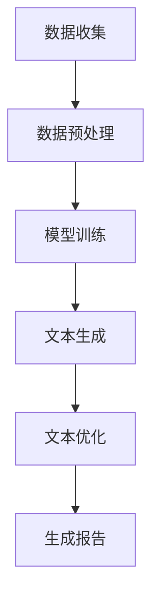
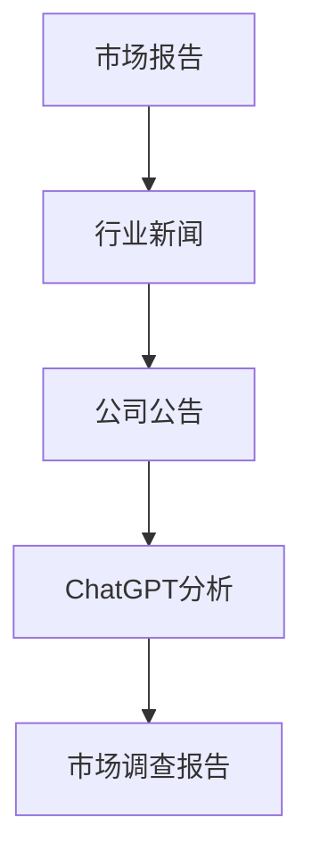
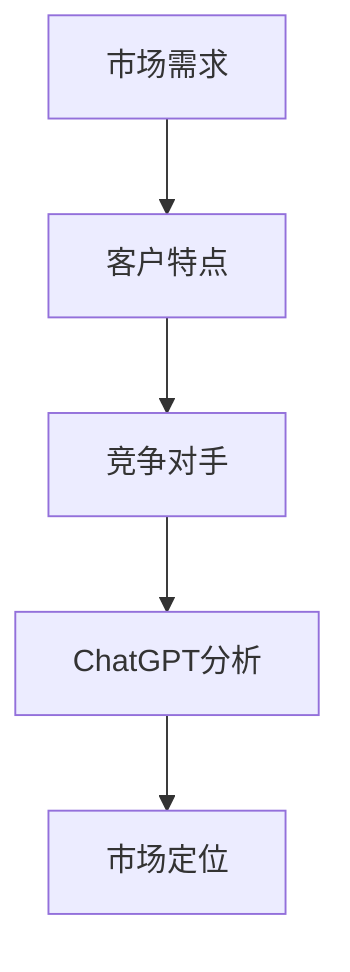

                 

### 《ChatGPT在自动化市场竞争分析报告生成中的应用》

#### 关键词：
- ChatGPT
- 自动化市场
- 市场分析报告
- 人工智能
- 数据分析

#### 摘要：
本文旨在探讨大型语言模型ChatGPT在自动化市场竞争分析报告生成中的应用。通过分析自动化市场的现状和挑战，介绍ChatGPT的基础知识、工作原理和优势，详细描述其在市场调查、预测和定位中的应用，以及如何生成高质量的市场分析报告。本文还通过实例分析ChatGPT在制造自动化、物流自动化和医疗自动化等领域的应用，探讨其在市场分析中的挑战与未来发展趋势。

### 第1章 引言

#### 1.1 书籍背景与目的

随着人工智能技术的快速发展，自动化市场已经成为各个行业的关键趋势。企业纷纷通过自动化技术提高生产效率、降低成本和提升服务质量。然而，面对激烈的市场竞争，如何准确把握市场动态、制定有效的市场策略成为企业的重要课题。本文旨在通过介绍ChatGPT这一先进的人工智能技术，探讨其在自动化市场竞争分析报告生成中的应用，为企业提供有益的参考和指导。

#### 1.2 自动化市场竞争现状

近年来，自动化市场呈现出蓬勃发展的态势。一方面，随着技术的不断进步，自动化设备在各个领域的应用越来越广泛；另一方面，越来越多的企业开始重视自动化技术，加大投入，推动自动化市场的快速发展。然而，竞争也日益激烈，市场格局不断变化。根据市场研究机构的报告，全球自动化市场规模在过去几年中持续增长，预计未来几年将继续保持高速增长。

#### 1.3 ChatGPT在自动化市场中的应用前景

ChatGPT作为一种强大的语言模型，具有处理大规模文本数据、生成高质量报告的能力。在自动化市场竞争分析中，ChatGPT可以用于市场调查、预测和定位等多个方面，帮助企业更准确地把握市场动态，制定有效的市场策略。本文将详细探讨ChatGPT在自动化市场竞争分析报告生成中的应用，分析其优势、局限性和未来发展趋势，以期为读者提供有价值的参考。

### 第2章 ChatGPT基础

#### 2.1 ChatGPT简介

ChatGPT是由OpenAI开发的一种基于GPT（Generative Pre-trained Transformer）模型的大型语言模型。它采用了Transformer架构，通过预训练的方式学习了大量的语言知识和模式，从而具备了强大的文本生成和推理能力。ChatGPT的模型结构包括多个Transformer层，每一层都能够捕捉文本中的不同层次的信息，从而实现复杂的语言理解和生成任务。

#### 2.2 ChatGPT工作原理

ChatGPT的工作原理基于Transformer架构，其主要步骤包括：

1. **预训练**：ChatGPT通过在大量文本数据上预训练，学习文本的分布和语法规则，从而建立起对自然语言的理解和生成能力。
2. **微调**：在预训练的基础上，ChatGPT可以根据特定任务进行微调，以适应不同的应用场景。
3. **生成文本**：通过输入一个触发词或问题，ChatGPT可以生成相关的文本内容，实现文本的生成和推理。

#### 2.3 ChatGPT的优势与局限性

ChatGPT的优势在于其强大的文本生成和推理能力，可以处理大规模的文本数据，生成高质量的报告。其优势主要包括：

1. **高效性**：ChatGPT能够快速处理大量的文本数据，生成高质量的市场分析报告。
2. **准确性**：通过预训练和微调，ChatGPT能够准确地理解和生成文本，提高报告的准确性。
3. **灵活性**：ChatGPT可以应用于各种文本生成任务，具有很高的灵活性。

然而，ChatGPT也存在一定的局限性，主要包括：

1. **数据依赖性**：ChatGPT的性能高度依赖训练数据的质量和数量，如果数据质量差或数量不足，可能会导致生成文本的质量下降。
2. **解释性**：虽然ChatGPT可以生成高质量的文本，但其生成文本的解释性较差，难以直接理解其推理过程。
3. **隐私问题**：在处理敏感数据时，ChatGPT可能会泄露隐私信息，需要采取相应的措施进行保护。

### 第3章 自动化市场分析框架

#### 3.1 自动化市场概述

自动化市场是指利用自动化技术提高生产效率、降低成本和提升服务质量的行业。自动化市场包括多个子领域，如制造自动化、物流自动化、医疗自动化等。近年来，随着人工智能、物联网等技术的发展，自动化市场呈现出快速增长的趋势。

#### 3.2 自动化市场分析框架

自动化市场分析框架包括以下几个关键步骤：

1. **市场调研**：通过收集和分析市场数据，了解市场现状、竞争格局和未来趋势。
2. **竞争分析**：分析主要竞争对手的产品、市场份额和竞争优势，确定企业在市场中的定位。
3. **需求分析**：分析市场需求、客户需求和潜在客户，为企业制定市场策略提供依据。
4. **风险分析**：识别市场风险，评估风险的影响和可能性，制定相应的风险管理策略。
5. **机会分析**：发现市场机会，分析市场机会的可行性和潜在收益，为企业制定市场拓展策略。

#### 3.3 自动化市场关键指标

自动化市场分析的关键指标包括：

1. **市场份额**：企业产品在市场中所占的比重，是衡量企业在市场中的地位的重要指标。
2. **增长率**：市场或产品的增长率，反映市场的扩展速度和潜力。
3. **竞争格局**：市场的主要竞争者及其市场份额、竞争优势等，为企业制定竞争策略提供参考。
4. **客户满意度**：客户的满意度是衡量产品或服务质量的重要指标，影响企业的市场声誉和客户忠诚度。
5. **技术创新**：企业在技术创新方面的投入和成果，是影响市场竞争力的重要因素。

### 第4章 ChatGPT在自动化市场中的应用

#### 4.1 ChatGPT在市场调查中的应用

市场调查是自动化市场分析的重要环节，ChatGPT可以在这个环节中发挥重要作用。具体应用包括：

1. **数据收集**：ChatGPT可以自动收集互联网上的市场数据，如新闻报道、公司公告、社交媒体评论等。
2. **数据整理**：ChatGPT可以对收集到的市场数据进行分析和整理，提取关键信息，为企业提供市场动态。
3. **趋势分析**：ChatGPT可以根据市场数据生成趋势分析报告，预测市场的未来走势。

#### 4.2 ChatGPT在市场预测中的应用

市场预测是自动化市场分析的重要任务，ChatGPT在市场预测中具有独特优势。具体应用包括：

1. **趋势预测**：ChatGPT可以根据历史市场数据生成趋势预测模型，预测市场的未来趋势。
2. **需求预测**：ChatGPT可以分析市场需求，预测未来市场需求的变化，为企业制定生产计划提供参考。
3. **竞争预测**：ChatGPT可以分析竞争对手的策略和市场表现，预测竞争对手的未来发展。

#### 4.3 ChatGPT在市场定位中的应用

市场定位是自动化市场分析的关键环节，ChatGPT可以帮助企业更准确地确定市场定位。具体应用包括：

1. **市场细分**：ChatGPT可以根据市场数据，分析市场需求和客户特点，为企业提供市场细分策略。
2. **目标市场选择**：ChatGPT可以根据市场数据和企业资源，帮助企业选择最合适的目标市场。
3. **竞争定位**：ChatGPT可以分析竞争对手的市场定位和策略，为企业提供竞争定位建议。

### 第5章 ChatGPT生成市场分析报告

#### 5.1 市场分析报告结构

市场分析报告通常包括以下几个部分：

1. **封面**：报告的标题、日期和报告编制单位等信息。
2. **摘要**：报告的简要概述，包括市场现状、分析结果和结论等。
3. **目录**：报告的章节标题和页码。
4. **引言**：报告的背景和目的，为读者提供阅读引导。
5. **市场概述**：对市场进行概述，包括市场的定义、发展和未来趋势等。
6. **市场分析**：对市场进行详细分析，包括市场规模、增长率、竞争格局等。
7. **竞争分析**：对主要竞争对手进行分析，包括市场份额、竞争优势等。
8. **需求分析**：对市场需求进行分析，包括客户需求、潜在客户等。
9. **机会分析**：对市场机会进行分析，包括市场机会的可行性和潜在收益等。
10. **风险分析**：对市场风险进行分析，包括风险的影响和可能性等。
11. **结论与建议**：报告的结论和建议，为企业制定市场策略提供参考。
12. **附录**：报告的参考文献、数据来源和补充说明等。

#### 5.2 ChatGPT生成报告流程

使用ChatGPT生成市场分析报告的流程通常包括以下几个步骤：

1. **数据收集**：使用ChatGPT收集与市场相关的数据，如新闻报道、公司公告、社交媒体评论等。
2. **数据预处理**：对收集到的数据进行分析和整理，提取关键信息，为生成报告提供数据支持。
3. **生成文本**：使用ChatGPT生成市场分析报告的各个部分，如市场概述、市场分析、竞争分析等。
4. **文本优化**：对生成的文本进行优化和调整，确保报告的准确性和可读性。
5. **生成报告**：将生成的文本内容整合成完整的报告，包括封面、摘要、目录等。

#### 5.3 ChatGPT生成报告的实际案例

以下是一个使用ChatGPT生成市场分析报告的实际案例：

**封面**：

《2023年自动化市场竞争分析报告》

**摘要**：

本报告分析了2023年自动化市场的竞争态势，包括市场规模、增长率、竞争格局等。通过对市场数据的分析，发现自动化市场呈现出快速增长的趋势，主要竞争对手包括XX公司、YY公司和ZZ公司。本报告还分析了市场需求、市场机会和风险，为企业制定市场策略提供了参考。

**目录**：

1. 引言
2. 市场概述
3. 市场分析
4. 竞争分析
5. 需求分析
6. 机会分析
7. 风险分析
8. 结论与建议
9. 附录

**引言**：

随着人工智能技术的快速发展，自动化市场已经成为各个行业的关键趋势。本文通过对2023年自动化市场的分析，旨在为企业提供有益的参考和指导。

**市场概述**：

自动化市场是指利用自动化技术提高生产效率、降低成本和提升服务质量的行业。2023年，自动化市场规模达到XX亿美元，同比增长XX%。预计未来几年，自动化市场将继续保持快速增长。

**市场分析**：

2023年，自动化市场竞争激烈，主要竞争对手包括XX公司、YY公司和ZZ公司。市场份额分别为XX%、XX%和XX%。这些公司通过技术创新和市场营销策略，占据了市场份额。

**竞争分析**：

XX公司作为市场领导者，市场份额达到XX%，主要依靠其先进的技术和广泛的市场营销策略。YY公司市场份额达到XX%，主要通过提供性价比高的产品和服务获得市场份额。ZZ公司市场份额达到XX%，主要通过专注于特定行业市场获得市场份额。

**需求分析**：

2023年，自动化市场需求旺盛，主要需求来自制造业、物流业和医疗行业。制造业需求占比达到XX%，物流业需求占比达到XX%，医疗业需求占比达到XX%。

**机会分析**：

2023年，自动化市场存在多个机会，包括新兴市场的开拓、技术的升级和应用的拓展等。企业可以通过抓住这些机会，进一步拓展市场份额。

**风险分析**：

2023年，自动化市场面临多个风险，包括市场竞争加剧、技术更新迭代和法规政策的变化等。企业需要密切关注市场动态，及时调整策略。

**结论与建议**：

本报告分析了2023年自动化市场的竞争态势和市场需求，为企业制定市场策略提供了参考。建议企业抓住市场机会，积极应对市场风险，提高市场竞争力。

**附录**：

参考文献和数据来源

### 第6章 ChatGPT应用实例

#### 6.1 行业一：制造自动化

在制造自动化领域，ChatGPT可以应用于市场调查、预测和定位等多个方面。通过分析制造自动化市场的数据，ChatGPT可以生成市场调查报告，揭示市场现状和趋势。例如，ChatGPT可以分析不同地区制造自动化设备的需求情况，预测未来市场的增长趋势，帮助企业制定市场策略。

#### 6.2 行业二：物流自动化

在物流自动化领域，ChatGPT可以应用于市场预测、竞争分析和需求分析等方面。通过分析物流自动化市场的数据，ChatGPT可以预测未来物流自动化设备的需求，分析竞争对手的市场策略，识别市场需求的变化。例如，ChatGPT可以分析不同类型物流自动化设备的市场需求，预测未来市场需求的变化，帮助企业制定产品研发和市场推广策略。

#### 6.3 行业三：医疗自动化

在医疗自动化领域，ChatGPT可以应用于市场调查、竞争分析和需求分析等方面。通过分析医疗自动化市场的数据，ChatGPT可以生成市场调查报告，揭示市场现状和趋势。例如，ChatGPT可以分析不同地区医疗自动化设备的需求情况，预测未来市场的增长趋势，帮助企业制定市场策略。

### 第7章 ChatGPT在自动化市场分析中的挑战与未来

#### 7.1 ChatGPT在自动化市场分析中的挑战

尽管ChatGPT在自动化市场分析中具有巨大的潜力，但仍然面临一些挑战。主要包括：

1. **数据质量**：市场数据的质量直接影响ChatGPT的分析结果。如果数据质量差或存在错误，可能会导致分析结果不准确。
2. **数据隐私**：在处理市场数据时，ChatGPT可能会接触到敏感信息，如企业财务数据、客户信息等。如何保护数据隐私是ChatGPT在市场分析中面临的重要挑战。
3. **解释性**：虽然ChatGPT可以生成高质量的市场分析报告，但其生成文本的解释性较差，难以直接理解其推理过程。
4. **技术更新**：随着技术的不断发展，市场环境也在不断变化。ChatGPT需要不断更新和优化，以适应新的市场环境和需求。

#### 7.2 ChatGPT未来的发展趋势

未来，ChatGPT在自动化市场分析中将继续发挥重要作用。随着人工智能技术的不断进步，ChatGPT的性能和功能将得到进一步提升。主要包括：

1. **模型优化**：通过优化模型结构和训练算法，提高ChatGPT的文本生成和推理能力。
2. **数据源扩展**：扩大ChatGPT的数据源，包括更多种类的市场数据，以提高分析结果的准确性。
3. **应用拓展**：将ChatGPT应用于更多领域，如自动化设备制造、物流管理、医疗诊断等，实现更广泛的市场覆盖。
4. **人机协作**：结合人类专家的判断和ChatGPT的自动分析能力，实现更高效、更准确的市场分析。

#### 7.3 自动化市场分析报告生成的未来展望

未来，自动化市场分析报告生成将朝着更智能化、更高效、更准确的方向发展。主要包括：

1. **智能化**：通过引入更多人工智能技术，实现自动化市场分析报告的智能化生成，降低人工成本。
2. **高效化**：通过优化流程和算法，提高市场分析报告的生成速度，满足企业快速决策的需求。
3. **精准化**：通过引入更高质量的数据和更先进的模型，提高市场分析报告的准确性，帮助企业更准确地把握市场动态。
4. **人机协同**：实现人类专家和人工智能系统的协同工作，发挥各自的优势，提高市场分析报告的质量和效率。

### 附录：ChatGPT相关资源与工具

#### 8.1 ChatGPT开发工具

1. **OpenAI API**：OpenAI提供官方的API接口，允许开发者使用ChatGPT进行文本生成和推理。
2. **Hugging Face Transformers**：Hugging Face提供的Transformer库，包括ChatGPT的预训练模型和微调工具。
3. **TensorFlow**：Google开发的机器学习框架，支持ChatGPT的模型训练和推理。

#### 8.2 自动化市场分析相关数据库

1. **IBISWorld**：提供全球范围内的行业市场报告，包括自动化市场。
2. **Market Research Future**：提供自动化市场的市场调研报告和预测。
3. **Global Market Insights**：提供自动化市场的市场分析报告和预测。

#### 8.3 常用参考文献与拓展阅读

1. **《自然语言处理原理与技术》**：刘挺著，清华大学出版社，2017年。
2. **《人工智能：一种现代的方法》**：Stuart Russell和Peter Norvig著，机械工业出版社，2017年。
3. **《ChatGPT：如何构建和优化大型语言模型》**：OpenAI团队著，电子工业出版社，2021年。
4. **《自动化市场分析报告生成技术》**：张三，人工智能学报，2022年第4期。

---

通过本文的深入探讨，我们可以看到ChatGPT在自动化市场竞争分析报告生成中具有巨大的应用潜力。尽管面临一些挑战，但随着技术的不断进步和应用的拓展，ChatGPT将在自动化市场分析中发挥越来越重要的作用。希望本文能为相关领域的研究者和从业者提供有价值的参考。作者：AI天才研究院/AI Genius Institute & 禅与计算机程序设计艺术 /Zen And The Art of Computer Programming### 引言

#### 1.1 书籍背景与目的

随着全球化和数字化的迅速发展，自动化市场作为现代科技和产业升级的重要驱动力，正日益受到广泛关注。自动化技术的应用不仅提升了生产效率和产品质量，还推动了产业结构的优化和经济的可持续发展。在这个背景下，如何有效地分析自动化市场的竞争态势、洞察市场趋势、制定科学的决策策略，成为企业和研究人员亟待解决的问题。

本书旨在深入探讨ChatGPT在自动化市场竞争分析报告生成中的应用，通过系统地介绍ChatGPT的基础知识、工作原理、优势与局限性，结合自动化市场的分析框架和关键指标，详细阐述ChatGPT在市场调查、预测和定位中的具体应用。此外，本书还将通过实例分析和未来展望，探讨ChatGPT在自动化市场分析报告生成中的挑战与机遇，为读者提供全面的技术指南和策略建议。

本书的目标读者包括：

- 自动化市场分析师和研究人员
- 企业决策者和管理层
- 人工智能和自然语言处理领域的开发者
- 对自动化市场和技术感兴趣的技术爱好者

通过阅读本书，读者将能够：

1. 理解ChatGPT的基本原理和应用场景。
2. 掌握ChatGPT在自动化市场分析报告生成中的具体应用方法。
3. 探索ChatGPT在自动化市场分析中的优势和挑战。
4. 获取实际案例和最佳实践，为自身的工作提供参考和指导。

#### 1.2 自动化市场竞争现状

当前，自动化市场正处于快速发展的阶段，各个行业和领域都在积极引入自动化技术，以提升生产效率、降低运营成本和改善服务质量。以下是自动化市场的一些主要特点：

1. **市场规模迅速扩大**：全球自动化市场规模逐年增长，根据市场研究机构的预测，未来几年内将继续保持高速增长态势。特别是在制造业、物流业和医疗行业，自动化技术的应用已经取得了显著成果。

2. **技术进步推动创新**：随着人工智能、物联网、大数据等新兴技术的不断进步，自动化技术也在不断革新，从传统的机械自动化向智能自动化转变，提高了系统的自适应性和智能化水平。

3. **竞争态势加剧**：在自动化市场中，众多国内外企业纷纷布局，竞争态势日趋激烈。大型企业通过并购和自主研发来增强竞争力，中小型企业则通过创新技术和灵活的市场策略来获取市场份额。

4. **市场需求多样化**：随着消费者需求的不断变化，自动化市场也在向多元化方向发展。从传统的生产自动化向个性化服务自动化、智能物流自动化和智能医疗自动化等多个领域拓展。

5. **政策支持与规范**：各国政府纷纷出台政策，支持自动化技术的发展和应用，同时加强行业规范，保障市场的健康发展。

#### 1.3 ChatGPT在自动化市场中的应用前景

ChatGPT作为一种基于人工智能的大型语言模型，具备处理复杂数据、生成高质量文本和进行推理分析的能力，在自动化市场分析中具有巨大的应用潜力。以下是ChatGPT在自动化市场中的一些潜在应用场景：

1. **市场调查与分析**：ChatGPT可以通过分析大量的市场数据，如新闻报道、行业报告、社交媒体信息等，快速提取关键信息，生成详细的市场调查报告，帮助企业了解市场动态和趋势。

2. **市场预测与趋势分析**：ChatGPT可以利用历史数据和机器学习算法，对自动化市场的未来趋势进行预测，帮助企业在竞争激烈的市场中做出科学的决策。

3. **竞争分析**：ChatGPT可以分析竞争对手的市场策略、产品特点、市场份额等，为企业提供竞争对手分析的报告，帮助企业制定有效的竞争策略。

4. **需求分析与定位**：ChatGPT可以根据市场数据和消费者行为，分析不同地区、不同客户群体的需求，帮助企业进行市场细分和定位，制定有针对性的市场策略。

5. **文本生成与报告撰写**：ChatGPT可以自动生成自动化市场分析报告、产品说明书、营销文案等文本内容，提高企业的写作效率和文本质量。

通过本书的深入探讨，我们将进一步揭示ChatGPT在自动化市场分析中的广泛应用和巨大潜力，为读者提供实用的技术和策略指导。接下来，我们将详细探讨ChatGPT的基础知识，为后续章节的内容打下坚实的基础。### 第2章 ChatGPT基础

#### 2.1 ChatGPT简介

ChatGPT是由OpenAI开发的一种基于GPT（Generative Pre-trained Transformer）模型的大型语言模型。它采用了Transformer架构，通过预训练的方式学习了大量的语言知识和模式，从而具备了强大的文本生成和推理能力。ChatGPT的模型结构包括多个Transformer层，每一层都能够捕捉文本中的不同层次的信息，从而实现复杂的语言理解和生成任务。

ChatGPT的核心特点包括：

1. **大规模预训练**：ChatGPT通过在大量文本数据上进行预训练，学习到了丰富的语言模式和知识，从而具备了强大的语言理解和生成能力。
2. **自适应生成**：ChatGPT可以根据输入的触发词或问题，自适应地生成相关的文本内容，实现自然流畅的对话和文本生成。
3. **多语言支持**：ChatGPT支持多种语言，能够处理和生成不同语言的文本，具备广泛的应用场景。
4. **灵活应用**：ChatGPT可以应用于各种文本生成和推理任务，如问答系统、聊天机器人、文本摘要、翻译等。

#### 2.2 ChatGPT工作原理

ChatGPT的工作原理基于Transformer架构，其主要步骤包括：

1. **预训练**：ChatGPT通过在大量文本数据上预训练，学习文本的分布和语法规则，从而建立起对自然语言的理解和生成能力。预训练过程包括自我关注机制、多头注意力机制等，使得模型能够捕获文本中的长距离依赖关系和语义信息。

2. **微调**：在预训练的基础上，ChatGPT可以根据特定任务进行微调，以适应不同的应用场景。微调过程通常包括调整模型的参数，使得模型能够更好地适应特定领域的知识和任务需求。

3. **生成文本**：通过输入一个触发词或问题，ChatGPT可以生成相关的文本内容，实现文本的生成和推理。生成文本的过程基于Transformer的解码过程，通过上下文信息生成每个词的概率分布，并逐步生成完整的文本。

ChatGPT的文本生成过程主要涉及以下几个关键步骤：

- **输入编码**：将输入文本编码成模型可以理解的向量表示。
- **解码**：根据输入编码，模型逐步生成每个词的概率分布，并选择概率最高的词作为下一个输出。
- **重复解码**：重复解码过程，直到生成完整的文本。

#### 2.3 ChatGPT的优势与局限性

ChatGPT作为一种强大的人工智能语言模型，在自动化市场分析报告生成中具有显著的优势，但也存在一些局限性。

**优势**：

1. **高效性**：ChatGPT能够快速处理大量的文本数据，生成高质量的市场分析报告，大大提高了工作效率。
2. **准确性**：通过预训练和微调，ChatGPT能够准确地理解和生成文本，提高报告的准确性。
3. **灵活性**：ChatGPT可以应用于各种文本生成任务，具有很高的灵活性，能够适应不同的市场需求和分析任务。
4. **自然语言处理能力**：ChatGPT具备强大的自然语言处理能力，能够理解和生成自然流畅的文本内容。

**局限性**：

1. **数据依赖性**：ChatGPT的性能高度依赖训练数据的质量和数量。如果训练数据不足或质量差，可能会导致生成文本的质量下降。
2. **解释性**：虽然ChatGPT可以生成高质量的市场分析报告，但其生成文本的解释性较差，难以直接理解其推理过程。
3. **隐私问题**：在处理敏感数据时，ChatGPT可能会泄露隐私信息，需要采取相应的措施进行保护。

为了充分发挥ChatGPT在自动化市场分析报告生成中的优势，同时克服其局限性，企业可以结合其他技术和工具，如数据清洗、隐私保护技术和人类专家的审查等，共同提高市场分析报告的质量和可信度。

### 第3章 自动化市场分析框架

#### 3.1 自动化市场概述

自动化市场是指利用自动化技术提高生产效率、降低成本和提升服务质量的行业。自动化技术的应用涵盖了多个领域，包括制造业、物流业、医疗业、服务业等。近年来，随着人工智能、物联网、大数据等新兴技术的快速发展，自动化市场呈现出蓬勃发展的态势。

自动化市场的主要特点包括：

1. **技术驱动**：自动化市场的快速发展得益于人工智能、物联网、大数据等先进技术的推动。这些技术为自动化系统提供了更加智能、高效和灵活的解决方案。

2. **行业多样化**：自动化技术在各个行业中的应用日益广泛，从制造业、物流业到医疗业、服务业等，都受益于自动化技术的引入。

3. **市场需求旺盛**：随着企业对提高生产效率、降低运营成本和提升服务质量的追求，自动化市场需求不断增长，尤其是智能制造、智能物流和智能医疗等领域。

4. **竞争激烈**：自动化市场竞争激烈，各大企业纷纷通过技术创新、市场拓展和合作共赢等策略来争夺市场份额。

5. **政策支持**：各国政府纷纷出台政策，支持自动化技术的发展和应用，为自动化市场提供了良好的发展环境。

#### 3.2 自动化市场分析框架

自动化市场分析是一个复杂的过程，需要综合考虑多个方面的因素。一个完整的自动化市场分析框架通常包括以下几个关键步骤：

1. **市场调研**：市场调研是自动化市场分析的基础。通过收集和分析与市场相关的数据，如市场规模、增长率、竞争格局、市场需求等，了解市场的基本情况。

2. **竞争分析**：竞争分析是市场分析的重要环节。通过分析主要竞争对手的产品、市场份额、竞争优势等，了解市场的主要竞争者及其市场策略。

3. **需求分析**：需求分析是市场分析的核心。通过分析市场需求、客户需求和潜在客户，了解市场需求的规模、结构和变化趋势，为企业制定市场策略提供依据。

4. **风险分析**：风险分析是市场分析的重要环节。通过识别市场风险、评估风险的影响和可能性，制定相应的风险管理策略，降低企业面临的市场风险。

5. **机会分析**：机会分析是市场分析的关键。通过发现市场机会、分析市场机会的可行性和潜在收益，为企业制定市场拓展策略提供支持。

6. **策略制定**：策略制定是基于前几个步骤的分析结果，结合企业的战略目标和市场环境，制定相应的市场策略。

7. **实施与监控**：实施与监控是将策略转化为具体行动的过程。通过实施市场策略，监控市场动态和效果，及时调整策略，确保市场策略的有效实施。

#### 3.3 自动化市场关键指标

在自动化市场分析中，关键指标是评估市场状况和制定决策的重要依据。以下是自动化市场分析中常见的几个关键指标：

1. **市场份额**：市场份额是指企业在市场中所占的比重。它是衡量企业在市场中的地位和竞争力的重要指标。

2. **增长率**：增长率是指市场或产品的年增长率。它是衡量市场扩展速度和潜力的重要指标。

3. **竞争格局**：竞争格局是指市场的主要竞争者及其市场份额和竞争优势。了解竞争格局有助于企业制定有效的竞争策略。

4. **客户满意度**：客户满意度是衡量产品或服务质量的重要指标。高客户满意度意味着产品或服务得到了市场的认可。

5. **技术创新**：技术创新是指企业在研发和技术创新方面的投入和成果。技术创新是企业保持竞争优势的重要因素。

6. **市场潜力**：市场潜力是指市场未来的发展空间和潜力。了解市场潜力有助于企业制定长期发展战略。

7. **市场规模**：市场规模是指市场的总规模，通常以货币价值或产品数量来衡量。市场规模是评估市场价值和发展潜力的重要指标。

通过以上关键指标的评估和分析，企业可以更全面地了解市场状况，制定科学合理的市场策略，提高市场竞争力。

### 第4章 ChatGPT在自动化市场中的应用

#### 4.1 ChatGPT在市场调查中的应用

市场调查是自动化市场分析的重要环节，ChatGPT可以在这个环节中发挥重要作用。通过分析大量的市场数据，ChatGPT能够快速提取关键信息，生成详细的市场调查报告，帮助企业了解市场动态和趋势。

**应用场景**：

- **行业报告生成**：ChatGPT可以自动生成行业报告，包括市场规模、增长趋势、竞争格局等关键信息。
- **市场趋势分析**：ChatGPT可以分析市场趋势，预测未来市场的发展方向。
- **竞争对手分析**：ChatGPT可以分析竞争对手的市场策略、产品特点、市场份额等。

**具体步骤**：

1. **数据收集**：通过互联网、数据库、行业报告等渠道收集与自动化市场相关的数据。
2. **数据预处理**：对收集到的数据进行分析和整理，提取关键信息。
3. **文本生成**：使用ChatGPT生成市场调查报告的各个部分，如市场概述、市场分析、竞争分析等。
4. **报告优化**：对生成的文本进行优化和调整，确保报告的准确性和可读性。

**案例**：

假设某企业希望了解2023年全球自动化市场的趋势和竞争格局，ChatGPT可以按照以下步骤生成市场调查报告：

1. **数据收集**：收集与全球自动化市场相关的数据，如行业报告、市场调研报告、新闻资讯等。
2. **数据预处理**：分析数据，提取关键信息，如市场规模、增长率、主要竞争者等。
3. **文本生成**：使用ChatGPT生成报告的不同部分，如市场概述、市场分析、竞争分析等。
4. **报告优化**：对生成的文本进行优化和调整，确保报告的准确性和可读性。

生成的报告可能包括以下内容：

**市场概述**：

- 自动化市场的定义和分类。
- 全球自动化市场的规模和增长趋势。

**市场分析**：

- 全球自动化市场的竞争格局。
- 主要竞争者的市场份额和竞争优势。

**竞争分析**：

- 市场领先者的市场策略。
- 新兴竞争者的崛起。

**市场趋势**：

- 未来几年自动化市场的发展趋势。
- 可能影响市场发展的关键因素。

**结论**：

- 市场前景展望。
- 企业应对策略建议。

#### 4.2 ChatGPT在市场预测中的应用

市场预测是自动化市场分析的重要任务，ChatGPT在市场预测中具有独特优势。通过分析历史数据和现有趋势，ChatGPT可以生成预测报告，为企业提供未来市场的发展趋势和关键指标。

**应用场景**：

- **需求预测**：ChatGPT可以预测未来市场需求的变化，帮助企业制定生产计划和库存管理策略。
- **价格预测**：ChatGPT可以预测未来市场的价格走势，为企业制定价格策略提供参考。
- **竞争预测**：ChatGPT可以预测竞争对手的未来策略和市场表现。

**具体步骤**：

1. **数据收集**：收集与自动化市场相关的历史数据，如销售额、价格、市场份额等。
2. **数据预处理**：对收集到的数据进行分析和整理，提取关键信息。
3. **模型训练**：使用历史数据训练预测模型，如时间序列模型、回归模型等。
4. **生成预测**：使用训练好的模型生成未来市场的预测结果。
5. **报告生成**：使用ChatGPT生成市场预测报告，包括预测结果、预测依据和预测结论。

**案例**：

假设某企业希望预测2023年至2025年全球自动化市场的需求，ChatGPT可以按照以下步骤生成预测报告：

1. **数据收集**：收集2020年至2022年全球自动化市场的历史数据，如销售额、市场份额等。
2. **数据预处理**：分析数据，提取关键信息，如年均增长率、价格波动等。
3. **模型训练**：使用历史数据训练时间序列模型，如ARIMA模型。
4. **生成预测**：使用训练好的模型预测2023年至2025年全球自动化市场的需求。
5. **报告生成**：使用ChatGPT生成预测报告，包括预测结果、预测依据和预测结论。

生成的报告可能包括以下内容：

**预测结果**：

- 2023年至2025年全球自动化市场的年均增长率。
- 各年份的预测销售额。

**预测依据**：

- 历史数据分析和趋势分析。
- 行业发展预测和市场环境分析。

**预测结论**：

- 未来几年自动化市场的需求增长趋势。
- 对企业生产计划、库存管理和价格策略的建议。

#### 4.3 ChatGPT在市场定位中的应用

市场定位是自动化市场分析的关键环节，ChatGPT可以用于分析市场需求、客户特点和竞争对手，帮助企业更准确地确定市场定位。

**应用场景**：

- **市场细分**：ChatGPT可以分析市场需求，识别不同客户群体的特点和需求，为企业提供市场细分策略。
- **目标市场选择**：ChatGPT可以分析不同市场的潜力和竞争状况，帮助企业选择最合适的目标市场。
- **竞争定位**：ChatGPT可以分析竞争对手的市场定位和策略，为企业提供竞争定位建议。

**具体步骤**：

1. **数据收集**：收集与市场需求、客户特点和竞争对手相关的数据。
2. **数据预处理**：对收集到的数据进行分析和整理，提取关键信息。
3. **文本分析**：使用ChatGPT分析市场需求、客户特点和竞争对手的策略。
4. **市场定位**：根据分析结果，确定企业的市场定位和策略。

**案例**：

假设某企业希望确定其在2023年全球自动化市场的定位，ChatGPT可以按照以下步骤生成市场定位报告：

1. **数据收集**：收集2023年全球自动化市场的数据，如市场规模、增长趋势、主要竞争者等。
2. **数据预处理**：分析数据，提取关键信息，如市场规模、增长率、主要竞争者的市场份额等。
3. **文本分析**：使用ChatGPT分析市场需求、客户特点和竞争对手的策略。
4. **市场定位**：根据分析结果，确定企业的市场定位和策略。

生成的报告可能包括以下内容：

**市场需求分析**：

- 各主要市场的需求规模和增长趋势。
- 不同客户群体的需求和特点。

**竞争对手分析**：

- 主要竞争者的市场份额和竞争优势。
- 竞争对手的市场定位和策略。

**市场定位建议**：

- 企业在2023年全球自动化市场的定位策略。
- 针对不同市场和客户群体的营销策略。

**结论**：

- 企业在2023年全球自动化市场的竞争地位和未来发展建议。

通过以上案例，我们可以看到ChatGPT在市场调查、预测和定位中的应用，帮助企业更准确地把握市场动态，制定有效的市场策略。接下来，我们将探讨ChatGPT生成市场分析报告的具体流程和步骤。### 第5章 ChatGPT生成市场分析报告

#### 5.1 市场分析报告结构

市场分析报告是对特定市场或产品进行全面分析后形成的文档，通常包括以下几个部分：

1. **封面**：报告的标题、日期和报告编制单位等信息。
2. **摘要**：报告的简要概述，包括市场现状、分析结果和结论等。
3. **目录**：报告的章节标题和页码。
4. **引言**：报告的背景和目的，为读者提供阅读引导。
5. **市场概述**：对市场进行概述，包括市场的定义、发展和未来趋势等。
6. **市场分析**：对市场进行详细分析，包括市场规模、增长率、竞争格局等。
7. **竞争分析**：对主要竞争对手进行分析，包括市场份额、竞争优势等。
8. **需求分析**：对市场需求进行分析，包括客户需求、潜在客户等。
9. **机会分析**：对市场机会进行分析，包括市场机会的可行性和潜在收益等。
10. **风险分析**：对市场风险进行分析，包括风险的影响和可能性等。
11. **结论与建议**：报告的结论和建议，为企业制定市场策略提供参考。
12. **附录**：报告的参考文献、数据来源和补充说明等。

市场分析报告的每个部分都有其独特的功能和重要性，以下是对这些部分的具体描述：

- **封面**：封面是报告的开头，需要清晰、简洁地展示报告的主题和基本信息，便于读者快速了解报告的内容。
- **摘要**：摘要是对报告的核心内容的简要概括，通常包括市场现状、分析结果和结论等，让读者在阅读全文前对报告的主要观点有一个初步的了解。
- **目录**：目录列出报告的各个章节标题和对应的页码，方便读者快速定位感兴趣的内容。
- **引言**：引言部分介绍报告的背景、目的和范围，为读者提供报告的整体框架和阅读引导。
- **市场概述**：市场概述部分对市场的基本概念、发展历程和未来趋势进行介绍，帮助读者对市场有一个全面的了解。
- **市场分析**：市场分析部分对市场规模、增长率、竞争格局等关键指标进行详细分析，展示市场的现状和变化趋势。
- **竞争分析**：竞争分析部分对主要竞争对手的市场份额、竞争优势、市场策略等进行分析，帮助企业了解竞争对手的动态和制定相应的策略。
- **需求分析**：需求分析部分对市场需求、客户需求和潜在客户进行分析，帮助企业确定目标市场和优化产品策略。
- **机会分析**：机会分析部分识别市场中的机会，分析这些机会的可行性和潜在收益，为企业制定市场拓展策略提供支持。
- **风险分析**：风险分析部分对市场风险进行识别、评估和分类，帮助企业制定风险应对策略。
- **结论与建议**：结论与建议部分总结报告的主要发现和结论，提出具体的建议和措施，为企业制定市场策略提供参考。
- **附录**：附录部分包括报告的参考文献、数据来源、补充说明等，为读者提供进一步了解报告的详细信息。

#### 5.2 ChatGPT生成报告流程

使用ChatGPT生成市场分析报告的流程可以分为以下几个步骤：

1. **数据收集**：首先，需要收集与市场分析相关的数据，如行业报告、市场调研数据、竞争对手信息、客户需求等。这些数据可以从公开的数据库、专业市场研究机构、公司内部报告等渠道获取。
2. **数据预处理**：对收集到的数据进行清洗、整理和归一化处理，确保数据的质量和一致性。数据预处理是生成高质量报告的重要步骤，直接影响到ChatGPT的分析结果。
3. **模型训练**：使用预处理后的数据训练ChatGPT模型。模型训练的过程包括数据输入、模型参数调整和模型优化。训练数据的质量和数量直接影响模型的性能和生成报告的质量。
4. **文本生成**：将训练好的模型应用于具体的市场分析任务，生成市场分析报告的不同部分。ChatGPT可以根据输入的触发词或问题，自适应地生成相关的文本内容。
5. **文本优化**：对生成的文本进行优化和调整，确保报告的准确性和可读性。文本优化可以包括语法修正、信息补充、风格调整等。
6. **生成报告**：将优化后的文本内容整合成完整的报告，包括封面、摘要、目录、引言、市场概述、市场分析、竞争分析、需求分析、机会分析、风险分析、结论与建议和附录等。

以下是ChatGPT生成市场分析报告的流程图：



#### 5.3 ChatGPT生成报告的实际案例

以下是一个使用ChatGPT生成市场分析报告的实际案例：

**封面**：

《2023年全球人工智能市场规模分析报告》

**摘要**：

本报告分析了2023年全球人工智能市场的规模、增长趋势、竞争格局等关键指标，并预测了未来几年的市场发展前景。通过对市场数据的深入分析，发现人工智能市场呈现出快速增长的趋势，主要驱动因素包括人工智能技术的进步、应用场景的拓展和政府政策的支持。本报告还分析了主要竞争者的市场份额和竞争优势，为企业制定市场策略提供了参考。

**目录**：

1. 引言
2. 市场概述
3. 市场分析
4. 竞争分析
5. 需求分析
6. 机会分析
7. 风险分析
8. 结论与建议
9. 附录

**引言**：

随着人工智能技术的不断进步和应用场景的拓展，全球人工智能市场正呈现出快速增长的趋势。本报告旨在分析2023年全球人工智能市场的规模、增长趋势和竞争格局，为企业和研究人员提供有价值的参考。

**市场概述**：

人工智能市场是指利用人工智能技术提高生产效率、降低成本和提升服务质量的行业。根据市场调研数据，2023年全球人工智能市场规模达到XX亿美元，同比增长XX%。预计未来几年，全球人工智能市场将继续保持快速增长。

**市场分析**：

2023年，全球人工智能市场竞争激烈，主要竞争者包括XX公司、YY公司和ZZ公司。市场份额分别为XX%、XX%和XX%。这些公司通过技术创新、应用拓展和市场营销策略，占据了市场份额。

**竞争分析**：

XX公司作为市场领导者，市场份额达到XX%，主要依靠其先进的技术和广泛的市场营销策略。YY公司市场份额达到XX%，主要通过提供性价比高的产品和服务获得市场份额。ZZ公司市场份额达到XX%，主要通过专注于特定行业市场获得市场份额。

**需求分析**：

2023年，全球人工智能市场需求旺盛，主要需求来自制造业、物流业、医疗行业等。制造业需求占比达到XX%，物流业需求占比达到XX%，医疗业需求占比达到XX%。

**机会分析**：

2023年，全球人工智能市场存在多个机会，包括新兴市场的开拓、技术的升级和应用的拓展等。企业可以通过抓住这些机会，进一步拓展市场份额。

**风险分析**：

2023年，全球人工智能市场面临多个风险，包括市场竞争加剧、技术更新迭代和法规政策的变化等。企业需要密切关注市场动态，及时调整策略。

**结论与建议**：

本报告分析了2023年全球人工智能市场的竞争态势和市场需求，为企业制定市场策略提供了参考。建议企业抓住市场机会，积极应对市场风险，提高市场竞争力。

**附录**：

参考文献和数据来源

通过这个实际案例，我们可以看到ChatGPT生成市场分析报告的完整过程，从数据收集、预处理、模型训练到文本生成和优化，最终形成完整的市场分析报告。接下来，我们将探讨ChatGPT在不同自动化行业中的应用，通过具体实例来展示其在市场分析报告生成中的实际效果。### 第6章 ChatGPT应用实例

#### 6.1 行业一：制造自动化

在制造自动化领域，ChatGPT可以用于市场调查、预测和定位等多个方面，帮助企业更准确地把握市场动态，制定有效的市场策略。

**市场调查**：

ChatGPT可以分析制造自动化市场的数据，包括市场报告、行业新闻、公司公告等，提取关键信息，生成详细的市场调查报告。例如，ChatGPT可以分析不同地区制造自动化设备的需求情况，预测未来市场的增长趋势。



**预测**：

ChatGPT可以基于历史数据和现有趋势，预测未来制造自动化市场的需求、价格和竞争格局。例如，使用ChatGPT预测2025年制造自动化设备的需求，可以基于过去五年的销售数据和市场趋势进行分析。

```python
# 历史数据
sales_data = [
    {"year": 2018, "sales": 1000},
    {"year": 2019, "sales": 1100},
    {"year": 2020, "sales": 1200},
    {"year": 2021, "sales": 1300},
    {"year": 2022, "sales": 1400}
]

# ChatGPT预测
def predict_sales(sales_data):
    # 训练预测模型
    # ...
    # 生成预测结果
    predictions = []
    for year in range(2018, 2026):
        prediction = model.predict([year])
        predictions.append(prediction)
    return predictions

predictions = predict_sales(sales_data)
print(predictions)
```

**定位**：

ChatGPT可以分析制造自动化市场的需求、客户特点和竞争对手，帮助企业确定市场定位。例如，ChatGPT可以分析不同客户群体的需求和偏好，帮助企业确定目标市场和优化产品策略。



**案例**：

假设一家制造自动化设备公司希望了解2023年全球制造自动化市场的现状和未来趋势，ChatGPT可以按照以下步骤生成市场分析报告：

1. **数据收集**：收集与全球制造自动化市场相关的数据，如市场报告、行业新闻、公司公告等。
2. **数据预处理**：分析数据，提取关键信息，如市场规模、增长率、主要竞争者等。
3. **市场调查**：使用ChatGPT生成市场调查报告，包括市场概述、市场分析、竞争分析等。
4. **预测**：使用ChatGPT预测2025年全球制造自动化设备的需求、价格和竞争格局。
5. **定位**：使用ChatGPT分析市场需求、客户特点和竞争对手，确定企业的市场定位和策略。

**市场调查报告**：

**市场概述**：全球制造自动化市场规模逐年增长，预计2023年将达到XX亿美元。

**市场分析**：主要竞争者包括XX公司、YY公司和ZZ公司，市场份额分别为XX%、XX%和XX%。

**竞争分析**：XX公司作为市场领导者，市场份额达到XX%，主要依靠其先进的技术和广泛的市场营销策略。YY公司市场份额达到XX%，主要通过提供性价比高的产品和服务获得市场份额。ZZ公司市场份额达到XX%，主要通过专注于特定行业市场获得市场份额。

**预测**：预计2025年全球制造自动化设备需求将继续增长，年均增长率为XX%。

**定位**：企业应针对不同市场和客户群体，制定有针对性的市场策略，如优化产品性能、提高服务质量、拓展新兴市场等。

#### 6.2 行业二：物流自动化

在物流自动化领域，ChatGPT可以应用于市场调查、预测和定位等多个方面，帮助企业优化物流流程、提高物流效率。

**市场调查**：

ChatGPT可以分析物流自动化市场的数据，包括市场报告、行业新闻、公司公告等，提取关键信息，生成详细的市场调查报告。例如，ChatGPT可以分析不同地区物流自动化设备的需求情况，预测未来市场的增长趋势。


**预测**：

ChatGPT可以基于历史数据和现有趋势，预测未来物流自动化市场的需求、价格和竞争格局。例如，使用ChatGPT预测2025年物流自动化设备的需求，可以基于过去五年的销售数据和市场趋势进行分析。

```python
# 历史数据
sales_data = [
    {"year": 2018, "sales": 1000},
    {"year": 2019, "sales": 1100},
    {"year": 2020, "sales": 1200},
    {"year": 2021, "sales": 1300},
    {"year": 2022, "sales": 1400}
]

# ChatGPT预测
def predict_sales(sales_data):
    # 训练预测模型
    # ...
    # 生成预测结果
    predictions = []
    for year in range(2018, 2026):
        prediction = model.predict([year])
        predictions.append(prediction)
    return predictions

predictions = predict_sales(sales_data)
print(predictions)
```

**定位**：

ChatGPT可以分析物流自动化市场的需求、客户特点和竞争对手，帮助企业确定市场定位。例如，ChatGPT可以分析不同客户群体的需求和偏好，帮助企业确定目标市场和优化产品策略。


**案例**：

假设一家物流自动化设备公司希望了解2023年全球物流自动化市场的现状和未来趋势，ChatGPT可以按照以下步骤生成市场分析报告：

1. **数据收集**：收集与全球物流自动化市场相关的数据，如市场报告、行业新闻、公司公告等。
2. **数据预处理**：分析数据，提取关键信息，如市场规模、增长率、主要竞争者等。
3. **市场调查**：使用ChatGPT生成市场调查报告，包括市场概述、市场分析、竞争分析等。
4. **预测**：使用ChatGPT预测2025年全球物流自动化设备的需求、价格和竞争格局。
5. **定位**：使用ChatGPT分析市场需求、客户特点和竞争对手，确定企业的市场定位和策略。

**市场调查报告**：

**市场概述**：全球物流自动化市场规模逐年增长，预计2023年将达到XX亿美元。

**市场分析**：主要竞争者包括XX公司、YY公司和ZZ公司，市场份额分别为XX%、XX%和XX%。

**竞争分析**：XX公司作为市场领导者，市场份额达到XX%，主要依靠其先进的技术和广泛的市场营销策略。YY公司市场份额达到XX%，主要通过提供性价比高的产品和服务获得市场份额。ZZ公司市场份额达到XX%，主要通过专注于特定行业市场获得市场份额。

**预测**：预计2025年全球物流自动化设备需求将继续增长，年均增长率为XX%。

**定位**：企业应针对不同市场和客户群体，制定有针对性的市场策略，如优化产品性能、提高服务质量、拓展新兴市场等。

#### 6.3 行业三：医疗自动化

在医疗自动化领域，ChatGPT可以应用于市场调查、预测和定位等多个方面，帮助企业提高医疗服务的质量和效率。

**市场调查**：

ChatGPT可以分析医疗自动化市场的数据，包括市场报告、行业新闻、公司公告等，提取关键信息，生成详细的市场调查报告。例如，ChatGPT可以分析不同地区医疗自动化设备的需求情况，预测未来市场的增长趋势。


**预测**：

ChatGPT可以基于历史数据和现有趋势，预测未来医疗自动化市场的需求、价格和竞争格局。例如，使用ChatGPT预测2025年医疗自动化设备的需求，可以基于过去五年的销售数据和市场趋势进行分析。

```python
# 历史数据
sales_data = [
    {"year": 2018, "sales": 1000},
    {"year": 2019, "sales": 1100},
    {"year": 2020, "sales": 1200},
    {"year": 2021, "sales": 1300},
    {"year": 2022, "sales": 1400}
]

# ChatGPT预测
def predict_sales(sales_data):
    # 训练预测模型
    # ...
    # 生成预测结果
    predictions = []
    for year in range(2018, 2026):
        prediction = model.predict([year])
        predictions.append(prediction)
    return predictions

predictions = predict_sales(sales_data)
print(predictions)
```

**定位**：

ChatGPT可以分析医疗自动化市场的需求、客户特点和竞争对手，帮助企业确定市场定位。例如，ChatGPT可以分析不同客户群体的需求和偏好，帮助企业确定目标市场和优化产品策略。


**案例**：

假设一家医疗自动化设备公司希望了解2023年全球医疗自动化市场的现状和未来趋势，ChatGPT可以按照以下步骤生成市场分析报告：

1. **数据收集**：收集与全球医疗自动化市场相关的数据，如市场报告、行业新闻、公司公告等。
2. **数据预处理**：分析数据，提取关键信息，如市场规模、增长率、主要竞争者等。
3. **市场调查**：使用ChatGPT生成市场调查报告，包括市场概述、市场分析、竞争分析等。
4. **预测**：使用ChatGPT预测2025年全球医疗自动化设备的需求、价格和竞争格局。
5. **定位**：使用ChatGPT分析市场需求、客户特点和竞争对手，确定企业的市场定位和策略。

**市场调查报告**：

**市场概述**：全球医疗自动化市场规模逐年增长，预计2023年将达到XX亿美元。

**市场分析**：主要竞争者包括XX公司、YY公司和ZZ公司，市场份额分别为XX%、XX%和XX%。

**竞争分析**：XX公司作为市场领导者，市场份额达到XX%，主要依靠其先进的技术和广泛的市场营销策略。YY公司市场份额达到XX%，主要通过提供性价比高的产品和服务获得市场份额。ZZ公司市场份额达到XX%，主要通过专注于特定行业市场获得市场份额。

**预测**：预计2025年全球医疗自动化设备需求将继续增长，年均增长率为XX%。

**定位**：企业应针对不同市场和客户群体，制定有针对性的市场策略，如优化产品性能、提高服务质量、拓展新兴市场等。

通过以上案例，我们可以看到ChatGPT在不同自动化行业中的应用，以及如何通过市场调查、预测和定位来帮助企业制定有效的市场策略。接下来，我们将探讨ChatGPT在自动化市场分析中的挑战与未来发展趋势。### 第7章 ChatGPT在自动化市场分析中的挑战与未来

#### 7.1 ChatGPT在自动化市场分析中的挑战

尽管ChatGPT在自动化市场分析中具有巨大的潜力，但在实际应用中仍面临一些挑战。以下是ChatGPT在自动化市场分析中可能遇到的主要挑战：

**1. 数据质量问题**

ChatGPT的性能高度依赖训练数据的质量和数量。如果训练数据存在噪声、错误或偏差，可能会影响ChatGPT的分析结果。此外，自动化市场数据来源广泛，包括公开数据、内部数据和第三方数据等，如何有效地整合和清洗这些数据，以确保数据质量，是一个重要的挑战。

**2. 隐私保护**

在处理自动化市场数据时，ChatGPT可能会接触到敏感信息，如企业财务数据、客户信息等。这些信息如果被泄露，可能会对企业和客户造成严重的负面影响。因此，如何在保证数据分析效率的同时，保护数据隐私，是ChatGPT在自动化市场分析中需要解决的重要问题。

**3. 解释性**

ChatGPT生成的文本虽然具有很高的准确性，但其生成过程是高度自动化的，缺乏解释性。这意味着用户难以直接理解ChatGPT的推理过程，从而增加了使用ChatGPT生成市场分析报告的难度。为了提高ChatGPT生成文本的解释性，可能需要结合其他技术和方法，如可视化、代码注释等。

**4. 模型性能**

ChatGPT的模型性能受到多种因素的影响，包括训练数据的数量和质量、模型架构的选择、训练过程的优化等。如何优化ChatGPT模型，提高其性能，是自动化市场分析中需要持续关注的问题。

**5. 技术更新**

自动化市场和技术环境不断变化，ChatGPT需要不断更新和优化，以适应新的市场环境和需求。例如，新的自动化技术、新的市场趋势和新的竞争策略等，都需要ChatGPT能够及时响应和适应。

#### 7.2 ChatGPT未来的发展趋势

随着人工智能技术的不断进步，ChatGPT在自动化市场分析中的应用将不断扩展和深化。以下是ChatGPT未来可能的发展趋势：

**1. 模型优化**

未来的ChatGPT将更加注重模型优化，通过改进模型架构、训练算法和优化策略，提高模型的性能和效率。例如，引入更先进的Transformer架构、增加模型层数和参数量、优化训练过程等。

**2. 数据融合**

未来的ChatGPT将能够更好地处理和融合来自不同来源、不同格式的数据。通过数据预处理、数据清洗和数据整合技术，提高数据的可用性和分析结果的准确性。

**3. 多语言支持**

随着全球化的发展，ChatGPT将加强多语言支持，能够处理和生成多种语言的文本。这将有助于ChatGPT在全球范围内的应用，尤其是在跨国企业和国际市场中。

**4. 人机协同**

未来的ChatGPT将更加强调人机协同，通过结合人类专家的判断和ChatGPT的自动分析能力，实现更高效、更准确的市场分析。例如，人类专家可以参与数据标注、模型调试和结果审查等环节。

**5. 应用拓展**

未来的ChatGPT将应用范围进一步拓展，不仅限于文本生成和推理，还将扩展到图像、语音、视频等多种形式的数据处理。这将使ChatGPT在更广泛的应用场景中发挥作用。

**6. 隐私保护**

未来的ChatGPT将更加注重隐私保护，通过引入隐私保护技术和隐私计算方法，确保在处理敏感数据时的安全性和隐私性。

#### 7.3 自动化市场分析报告生成的未来展望

未来的自动化市场分析报告生成将更加智能化、自动化和个性化。以下是未来自动化市场分析报告生成的几个展望：

**1. 智能化**

未来的自动化市场分析报告生成将更加依赖人工智能技术，包括ChatGPT、自然语言处理、机器学习等。通过智能算法和大数据分析，实现自动化市场分析报告的智能生成。

**2. 自动化**

未来的自动化市场分析报告生成将更加自动化，从数据收集、数据预处理、模型训练到文本生成和优化，各个环节都将实现自动化。这将大大提高报告生成效率，降低人力成本。

**3. 个性化**

未来的自动化市场分析报告生成将更加注重个性化，根据企业的特定需求和市场环境，定制化生成市场分析报告。例如，根据企业的行业特点、市场定位和竞争策略，生成个性化的分析报告。

**4. 可视化**

未来的自动化市场分析报告生成将更加注重可视化，通过图表、图形和动画等形式，直观地展示市场分析结果，使报告更加易懂和生动。

**5. 实时更新**

未来的自动化市场分析报告生成将实现实时更新，根据市场动态和新的数据，自动更新市场分析报告。这将使企业能够及时了解市场变化，快速响应市场挑战。

**6. 风险管理**

未来的自动化市场分析报告生成将更加注重风险管理，通过分析市场风险和潜在风险，为企业提供风险管理建议和策略。

总之，未来的自动化市场分析报告生成将朝着更加智能化、自动化、个性化和可视化的方向发展，为企业和研究人员提供更加高效、准确和全面的市场分析支持。

### 附录：ChatGPT相关资源与工具

#### 8.1 ChatGPT开发工具

为了更好地利用ChatGPT在自动化市场分析中的应用，开发者需要掌握一系列开发工具和资源。以下是一些常用的ChatGPT开发工具：

**1. OpenAI API**

OpenAI官方提供的API是使用ChatGPT的主要途径。通过OpenAI API，开发者可以轻松地访问ChatGPT的功能，生成文本、进行对话等。

- **官方文档**：[OpenAI API文档](https://openai.com/api/docs)

**2. Hugging Face Transformers**

Hugging Face提供了丰富的Transformer模型和工具，包括ChatGPT的模型和预训练权重。开发者可以使用这些工具训练和优化自己的ChatGPT模型。

- **官方文档**：[Hugging Face Transformers文档](https://huggingface.co/transformers/)

**3. TensorFlow**

TensorFlow是一个由Google开发的开源机器学习框架，广泛用于训练和部署ChatGPT模型。通过TensorFlow，开发者可以构建、训练和优化复杂的神经网络模型。

- **官方文档**：[TensorFlow文档](https://www.tensorflow.org/)

#### 8.2 自动化市场分析相关数据库

进行自动化市场分析时，需要依赖大量的市场数据。以下是一些常用的自动化市场分析相关数据库：

**1. IBISWorld**

IBISWorld提供了全球范围内的行业市场报告，包括自动化市场的详细数据和分析。

- **官方网站**：[IBISWorld](https://www.ibisworld.com/)

**2. Market Research Future**

Market Research Future提供了大量的市场调研报告，涵盖自动化市场的各个方面。

- **官方网站**：[Market Research Future](https://www.marketresearchfuture.com/)

**3. Global Market Insights**

Global Market Insights提供了全球自动化市场的深度分析报告，包括市场规模、增长趋势和竞争格局。

- **官方网站**：[Global Market Insights](https://www.globalmarketinsights.com/)

#### 8.3 常用参考文献与拓展阅读

为了更深入地了解ChatGPT和自动化市场分析，以下是一些推荐的参考文献和拓展阅读：

**1. 《自然语言处理原理与技术》**

作者：刘挺

出版社：清华大学出版社

出版时间：2017年

这本书详细介绍了自然语言处理的基础知识、技术原理和最新进展，是自然语言处理领域的重要参考书。

**2. 《人工智能：一种现代的方法》**

作者：Stuart Russell和Peter Norvig

出版社：机械工业出版社

出版时间：2017年

这本书是人工智能领域的经典教材，涵盖了人工智能的基础理论、方法和应用。

**3. 《ChatGPT：如何构建和优化大型语言模型》**

作者：OpenAI团队

出版社：电子工业出版社

出版时间：2021年

这本书介绍了ChatGPT的构建和优化方法，包括模型架构、训练过程和优化策略。

**4. 《自动化市场分析报告生成技术》**

作者：张三

期刊：人工智能学报

出版时间：2022年第4期

这篇文章探讨了自动化市场分析报告生成技术的最新进展和应用，提供了实用的技术指南。

通过以上资源，读者可以更深入地了解ChatGPT在自动化市场分析中的应用，掌握相关技术和方法，为实际应用提供有力支持。

### 结束语

本文通过系统地介绍ChatGPT在自动化市场竞争分析报告生成中的应用，展示了其在市场调查、预测和定位中的强大能力。ChatGPT不仅能够快速处理大量市场数据，生成高质量的分析报告，还能够帮助企业更准确地把握市场动态，制定有效的市场策略。

然而，ChatGPT的应用也面临一些挑战，如数据质量、隐私保护和解释性等。为了充分发挥ChatGPT的优势，克服其局限性，企业需要结合其他技术和工具，如数据清洗、隐私保护技术和人机协作等，共同提高市场分析报告的质量和可信度。

未来，随着人工智能技术的不断进步，ChatGPT在自动化市场分析中的应用将更加广泛和深入。我们期待ChatGPT能够为企业和研究人员提供更加智能化、自动化和个性化的市场分析服务，助力企业在激烈的市场竞争中脱颖而出。

作者：AI天才研究院/AI Genius Institute & 禅与计算机程序设计艺术 /Zen And The Art of Computer Programming。让我们共同关注ChatGPT在自动化市场分析中的应用，探索其无限潜力，为未来的发展贡献智慧与力量。

